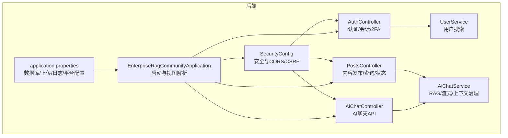
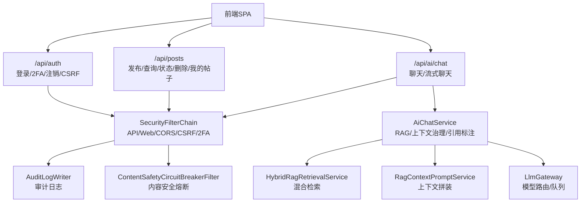
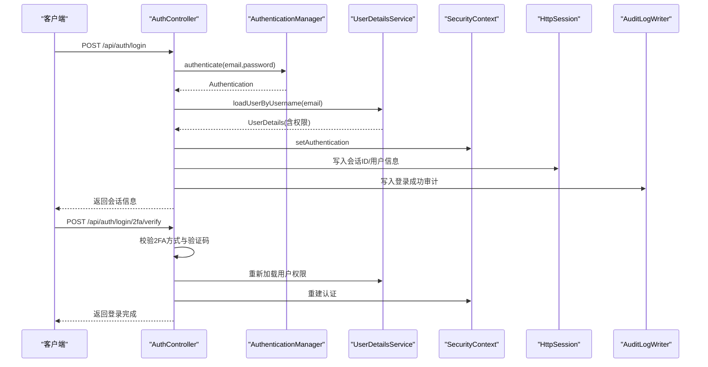
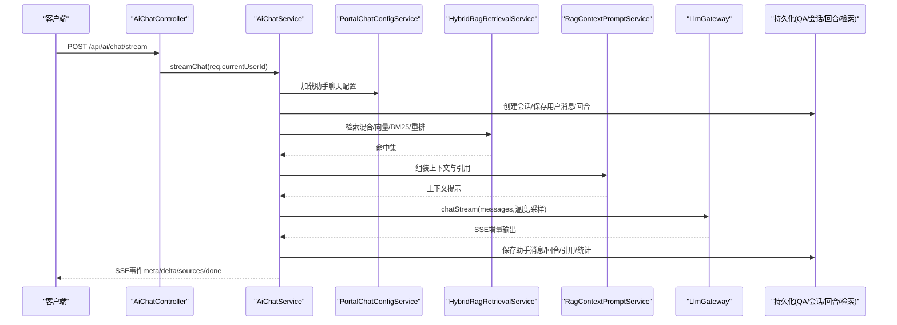
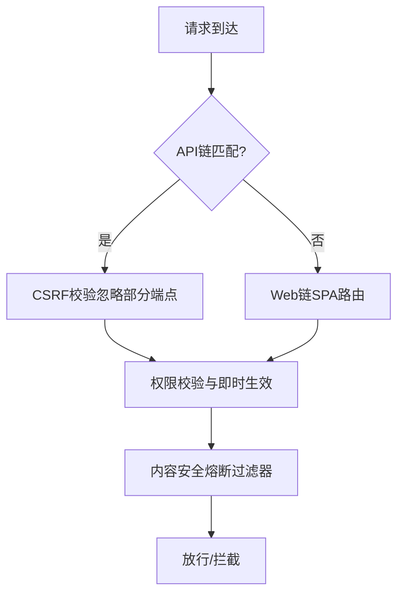
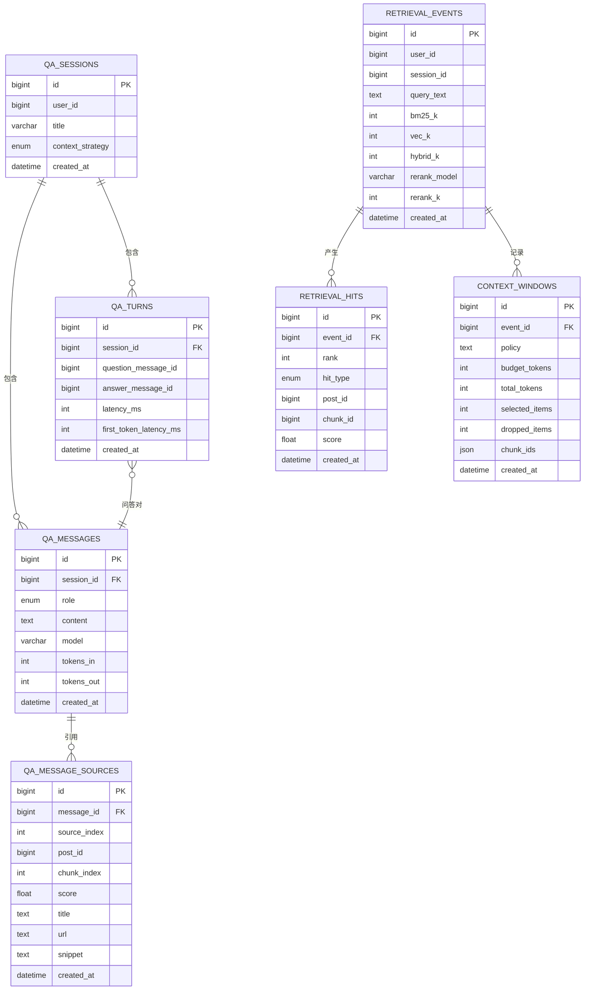
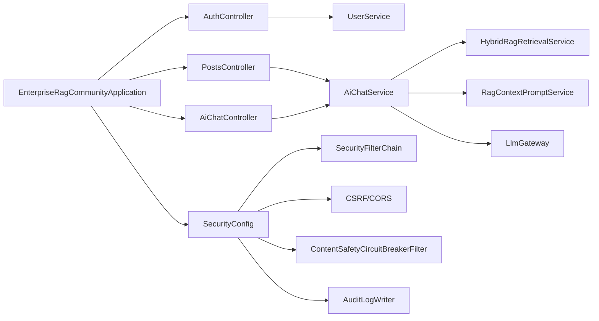

# 核心功能

<cite>
**本文引用的文件**
- [EnterpriseRagCommunityApplication.java](file://src/main/java/com/example/EnterpriseRagCommunity/EnterpriseRagCommunityApplication.java)
- [SecurityConfig.java](file://src/main/java/com/example/EnterpriseRagCommunity/config/SecurityConfig.java)
- [AuthController.java](file://src/main/java/com/example/EnterpriseRagCommunity/controller/AuthController.java)
- [UserService.java](file://src/main/java/com/example/EnterpriseRagCommunity/service/UserService.java)
- [PostsController.java](file://src/main/java/com/example/EnterpriseRagCommunity/controller/content/PostsController.java)
- [AiChatController.java](file://src/main/java/com/example/EnterpriseRagCommunity/controller/ai/AiChatController.java)
- [AiChatService.java](file://src/main/java/com/example/EnterpriseRagCommunity/service/ai/AiChatService.java)
- [application.properties](file://src/main/resources/application.properties)
</cite>

## 目录
1. [引言](#引言)
2. [项目结构](#项目结构)
3. [核心组件](#核心组件)
4. [架构总览](#架构总览)
5. [详细组件分析](#详细组件分析)
6. [依赖分析](#依赖分析)
7. [性能考虑](#性能考虑)
8. [故障排查指南](#故障排查指南)
9. [结论](#结论)

## 引言
本文件面向RAG社区平台的核心功能模块，系统化梳理并说明以下能力：
- 用户认证与权限管理：基于Spring Security的认证、会话、CSRF、2FA策略与权限即时生效机制
- 内容发布与管理：帖子发布、查询、状态变更、删除与“我的帖子”隔离
- AI智能服务：聊天（含流式SSE）、一次性回复、RAG增强、上下文治理、引用标注
- 审核机制：通过安全过滤器与审计日志联动，保障内容安全
- 检索增强（RAG）：混合检索、向量/关键词融合、上下文裁剪与引用标注

文档同时给出接口规范、数据模型要点、流程图与时序图，帮助开发者快速理解与集成。

## 项目结构
后端采用Spring Boot工程，核心目录与职责概览：
- config：安全配置、跨域、CSRF、会话策略
- controller：REST API控制器（认证、内容、AI聊天等）
- service：业务服务（用户、内容、AI聊天、检索等）
- repository/entity/dto：数据访问、实体与DTO
- resources：应用配置、数据库迁移脚本



**图表来源**
- [EnterpriseRagCommunityApplication.java:24-62](file://src/main/java/com/example/EnterpriseRagCommunity/EnterpriseRagCommunityApplication.java#L24-L62)
- [SecurityConfig.java:74-194](file://src/main/java/com/example/EnterpriseRagCommunity/config/SecurityConfig.java#L74-L194)
- [AuthController.java:78-81](file://src/main/java/com/example/EnterpriseRagCommunity/controller/AuthController.java#L78-L81)
- [PostsController.java:24-26](file://src/main/java/com/example/EnterpriseRagCommunity/controller/content/PostsController.java#L24-L26)
- [AiChatController.java:17-20](file://src/main/java/com/example/EnterpriseRagCommunity/controller/ai/AiChatController.java#L17-L20)
- [AiChatService.java:81-122](file://src/main/java/com/example/EnterpriseRagCommunity/service/ai/AiChatService.java#L81-L122)
- [application.properties:1-84](file://src/main/resources/application.properties#L1-L84)

**章节来源**
- [EnterpriseRagCommunityApplication.java:24-62](file://src/main/java/com/example/EnterpriseRagCommunity/EnterpriseRagCommunityApplication.java#L24-L62)
- [application.properties:1-84](file://src/main/resources/application.properties#L1-L84)

## 核心组件
- 安全与认证
  - 基于Spring Security的双链路过滤：API链优先拦截/api/**，Web链处理其余页面路由
  - 会话策略：始终创建会话，支持RBAC权限即时生效
  - CSRF：Cookie存储并暴露至前端，忽略初始化/认证相关端点
  - 2FA：登录二次验证支持邮箱验证码与TOTP，策略由服务评估
  - 审计：登录/登出/2FA验证均写入审计日志
- 用户与内容
  - 用户：支持按ID/账号/邮箱/角色/时间范围搜索
  - 内容：发布、查询、状态更新、删除、收藏与“我的帖子”
- AI聊天与RAG
  - 流式SSE与一次性回复
  - RAG增强：混合检索、上下文裁剪、引用标注
  - 上下文治理：消息长度与策略控制
- 审核与安全
  - 内容安全熔断过滤器贯穿请求链路
  - 审计日志记录关键动作与结果

**章节来源**
- [SecurityConfig.java:74-194](file://src/main/java/com/example/EnterpriseRagCommunity/config/SecurityConfig.java#L74-L194)
- [AuthController.java:321-441](file://src/main/java/com/example/EnterpriseRagCommunity/controller/AuthController.java#L321-L441)
- [UserService.java:43-110](file://src/main/java/com/example/EnterpriseRagCommunity/service/UserService.java#L43-L110)
- [PostsController.java:37-151](file://src/main/java/com/example/EnterpriseRagCommunity/controller/content/PostsController.java#L37-L151)
- [AiChatController.java:25-35](file://src/main/java/com/example/EnterpriseRagCommunity/controller/ai/AiChatController.java#L25-L35)
- [AiChatService.java:123-604](file://src/main/java/com/example/EnterpriseRagCommunity/service/ai/AiChatService.java#L123-L604)

## 架构总览
系统采用前后端分离，后端提供REST API与SSE流式输出。安全层通过多过滤器链实现细粒度控制，AI聊天服务串联检索、上下文组装与LLM路由。



**图表来源**
- [SecurityConfig.java:74-194](file://src/main/java/com/example/EnterpriseRagCommunity/config/SecurityConfig.java#L74-L194)
- [AuthController.java:321-441](file://src/main/java/com/example/EnterpriseRagCommunity/controller/AuthController.java#L321-L441)
- [PostsController.java:37-151](file://src/main/java/com/example/EnterpriseRagCommunity/controller/content/PostsController.java#L37-L151)
- [AiChatController.java:25-35](file://src/main/java/com/example/EnterpriseRagCommunity/controller/ai/AiChatController.java#L25-L35)
- [AiChatService.java:89-115](file://src/main/java/com/example/EnterpriseRagCommunity/service/ai/AiChatService.java#L89-L115)

## 详细组件分析

### 用户认证与权限管理
- 登录流程
  - 校验邮箱与密码，若账户为邮箱未验证状态，返回特定错误码提示完成验证
  - 若启用2FA策略，返回可用方式（邮箱/TOTP），并允许重发验证码
  - 2FA校验通过后，完成会话建立、写入审计日志并返回会话信息
- 注销流程
  - 清空Security上下文与会话，写入审计日志
- CSRF与CORS
  - Cookie存储CSRF Token，忽略初始化/认证端点
  - 支持自定义允许源与头部，暴露必要响应头
- 2FA策略
  - 基于用户维度评估登录2FA模式，结合邮箱与TOTP可用性决定可用方式
- 权限即时生效
  - 会话加载后立即应用RBAC变更，避免刷新页面



**图表来源**
- [AuthController.java:321-441](file://src/main/java/com/example/EnterpriseRagCommunity/controller/AuthController.java#L321-L441)
- [AuthController.java:482-642](file://src/main/java/com/example/EnterpriseRagCommunity/controller/AuthController.java#L482-L642)
- [SecurityConfig.java:286-321](file://src/main/java/com/example/EnterpriseRagCommunity/config/SecurityConfig.java#L286-L321)

**章节来源**
- [AuthController.java:321-441](file://src/main/java/com/example/EnterpriseRagCommunity/controller/AuthController.java#L321-L441)
- [AuthController.java:482-642](file://src/main/java/com/example/EnterpriseRagCommunity/controller/AuthController.java#L482-L642)
- [SecurityConfig.java:74-194](file://src/main/java/com/example/EnterpriseRagCommunity/config/SecurityConfig.java#L74-L194)
- [SecurityConfig.java:286-321](file://src/main/java/com/example/EnterpriseRagCommunity/config/SecurityConfig.java#L286-L321)

### 内容发布与管理
- 发布
  - 提交发布DTO，服务层执行持久化与状态初始化
- 查询
  - 支持关键词、ID、板块、状态、作者、时间范围、分页与排序
  - 门户默认仅展示已发布；管理端可查看全部
- 状态变更
  - 需具备审核相关权限，支持批量/单项更新
- 删除
  - 支持删除指定帖子
- 我的帖子
  - 仅返回当前登录用户创建的帖子，防止越权

```mermaid
flowchart TD
Start["进入 /api/posts"] --> Mode{"请求类型"}
Mode --> |POST| Publish["发布帖子"]
Mode --> |GET| Query["查询帖子<br/>关键词/ID/板块/状态/作者/时间/分页/排序"]
Mode --> |GET /{id}| GetById["按ID获取详情"]
Mode --> |PUT /{id}/status| UpdateStatus["更新状态需审核权限"]
Mode --> |PUT /{id}| Update["更新帖子"]
Mode --> |DELETE /{id}| Delete["删除帖子"]
Mode --> |GET /bookmarks| Bookmarks["我的收藏"]
Mode --> |GET /mine| Mine["我的帖子<br/>隔离作者"]
Publish --> End["结束"]
Query --> End
GetById --> End
UpdateStatus --> End
Update --> End
Delete --> End
Bookmarks --> End
Mine --> End
```

**图表来源**
- [PostsController.java:37-151](file://src/main/java/com/example/EnterpriseRagCommunity/controller/content/PostsController.java#L37-L151)

**章节来源**
- [PostsController.java:37-151](file://src/main/java/com/example/EnterpriseRagCommunity/controller/content/PostsController.java#L37-L151)

### AI智能服务（聊天/RAG）
- 接口
  - 流式聊天：SSE，支持元事件、增量delta、sources事件与done事件
  - 一次性聊天：返回完整回答
- 功能特性
  - 会话管理：自动创建/复用会话，持久化消息与回合
  - 历史上下文：按配置限制历史条数
  - RAG增强：混合检索（BM25/向量/重排），评论与正文聚合，上下文裁剪与引用标注
  - 上下文治理：根据策略与预算控制token使用
  - 多模态：支持图片与文件作为输入
  - 审计与统计：记录检索事件、命中、token用量、首字节延迟等
- 数据模型要点
  - 会话/QA消息/QA回合/检索事件/命中/上下文窗口/引用来源等



**图表来源**
- [AiChatController.java:25-35](file://src/main/java/com/example/EnterpriseRagCommunity/controller/ai/AiChatController.java#L25-L35)
- [AiChatService.java:123-604](file://src/main/java/com/example/EnterpriseRagCommunity/service/ai/AiChatService.java#L123-L604)
- [AiChatService.java:606-800](file://src/main/java/com/example/EnterpriseRagCommunity/service/ai/AiChatService.java#L606-L800)

**章节来源**
- [AiChatController.java:25-35](file://src/main/java/com/example/EnterpriseRagCommunity/controller/ai/AiChatController.java#L25-L35)
- [AiChatService.java:123-604](file://src/main/java/com/example/EnterpriseRagCommunity/service/ai/AiChatService.java#L123-L604)
- [AiChatService.java:606-800](file://src/main/java/com/example/EnterpriseRagCommunity/service/ai/AiChatService.java#L606-L800)

### 审核机制与安全
- 内容安全熔断
  - 在API/Web两链路均插入内容安全熔断过滤器，统一拦截与处理
- 审计日志
  - 认证、2FA、登录/登出、RAG检索等关键动作均写入审计
- 会话与权限
  - 会话创建策略与RBAC即时生效，降低权限滞后风险



**图表来源**
- [SecurityConfig.java:74-194](file://src/main/java/com/example/EnterpriseRagCommunity/config/SecurityConfig.java#L74-L194)
- [SecurityConfig.java:196-236](file://src/main/java/com/example/EnterpriseRagCommunity/config/SecurityConfig.java#L196-L236)

**章节来源**
- [SecurityConfig.java:74-194](file://src/main/java/com/example/EnterpriseRagCommunity/config/SecurityConfig.java#L74-L194)
- [SecurityConfig.java:196-236](file://src/main/java/com/example/EnterpriseRagCommunity/config/SecurityConfig.java#L196-L236)

### 检索增强（RAG）数据模型


**图表来源**
- [AiChatService.java:38-115](file://src/main/java/com/example/EnterpriseRagCommunity/service/ai/AiChatService.java#L38-L115)

**章节来源**
- [AiChatService.java:38-115](file://src/main/java/com/example/EnterpriseRagCommunity/service/ai/AiChatService.java#L38-L115)

## 依赖分析
- 启动与视图
  - 应用主类启用异步与分页序列化，显式注册JSP视图解析器（用于测试）
- 安全依赖
  - 双链路过滤器链、CSRF、CORS、会话策略、2FA策略服务、内容安全熔断
- 业务依赖
  - 认证控制器依赖用户服务与会话；内容控制器依赖内容服务；AI聊天服务依赖检索、提示词、上下文治理与LLM网关
- 配置依赖
  - 数据库连接、Flyway迁移、日志级别、上传根路径与URL前缀、OpenSearch平台配置



**图表来源**
- [EnterpriseRagCommunityApplication.java:24-62](file://src/main/java/com/example/EnterpriseRagCommunity/EnterpriseRagCommunityApplication.java#L24-L62)
- [SecurityConfig.java:74-194](file://src/main/java/com/example/EnterpriseRagCommunity/config/SecurityConfig.java#L74-L194)
- [AuthController.java:78-81](file://src/main/java/com/example/EnterpriseRagCommunity/controller/AuthController.java#L78-L81)
- [PostsController.java:24-26](file://src/main/java/com/example/EnterpriseRagCommunity/controller/content/PostsController.java#L24-L26)
- [AiChatController.java:17-20](file://src/main/java/com/example/EnterpriseRagCommunity/controller/ai/AiChatController.java#L17-L20)
- [AiChatService.java:89-115](file://src/main/java/com/example/EnterpriseRagCommunity/service/ai/AiChatService.java#L89-L115)

**章节来源**
- [EnterpriseRagCommunityApplication.java:24-62](file://src/main/java/com/example/EnterpriseRagCommunity/EnterpriseRagCommunityApplication.java#L24-L62)
- [SecurityConfig.java:74-194](file://src/main/java/com/example/EnterpriseRagCommunity/config/SecurityConfig.java#L74-L194)
- [AiChatService.java:89-115](file://src/main/java/com/example/EnterpriseRagCommunity/service/ai/AiChatService.java#L89-L115)

## 性能考虑
- 异步与线程池
  - 启用虚拟线程，提升I/O密集型场景并发
- 连接池与超时
  - 数据库连接池参数可调，建议结合实例规格与负载压测优化
  - AI请求连接与读取超时可配置，避免长尾阻塞
- 缓存与索引
  - OpenSearch/Elasticsearch连接超时与读取超时配置，建议与上游平台SLA对齐
- 日志与审计
  - 启用访问日志与审计日志，注意磁盘与IO开销，合理设置采样率与最大文件大小

[本节为通用指导，无需具体文件引用]

## 故障排查指南
- 认证失败
  - 检查邮箱是否已验证；确认密码正确；查看审计日志中的失败原因
  - 2FA失败：确认验证码是否过期、方式是否被允许
- 会话与权限
  - 若权限未即时生效，确认会话已创建且RBAC变更已应用
- CSRF与CORS
  - 确认前端已正确携带CSRF Token；检查允许源与头部配置
- AI聊天
  - SSE流中断：检查上游LLM网关连通性与超时设置；查看检索事件与命中持久化是否成功
  - RAG未生效：确认混合检索配置、上下文裁剪与引用标注策略
- 数据库与迁移
  - Flyway迁移失败：检查基线版本与迁移脚本编码；确认数据库可达

**章节来源**
- [AuthController.java:321-441](file://src/main/java/com/example/EnterpriseRagCommunity/controller/AuthController.java#L321-L441)
- [AuthController.java:482-642](file://src/main/java/com/example/EnterpriseRagCommunity/controller/AuthController.java#L482-L642)
- [SecurityConfig.java:105-142](file://src/main/java/com/example/EnterpriseRagCommunity/config/SecurityConfig.java#L105-L142)
- [application.properties:68-83](file://src/main/resources/application.properties#L68-L83)

## 结论
本平台围绕“认证安全、内容管理、AI增强、审核治理、检索增强”构建了完整的业务闭环。通过双链路安全过滤、即时权限生效、内容安全熔断与完善的审计日志，保障系统在开放场景下的可控与稳定。AI聊天模块以RAG为核心，结合上下文治理与引用标注，提供高质量的问答体验。建议在生产环境中结合监控与压测持续优化数据库与AI网关配置，确保高并发下的稳定性与低延迟。