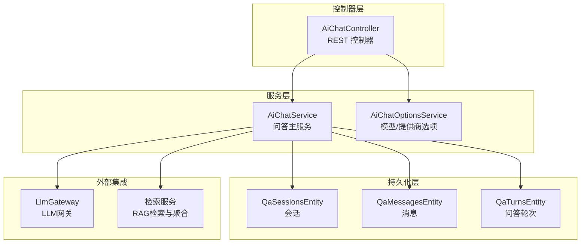
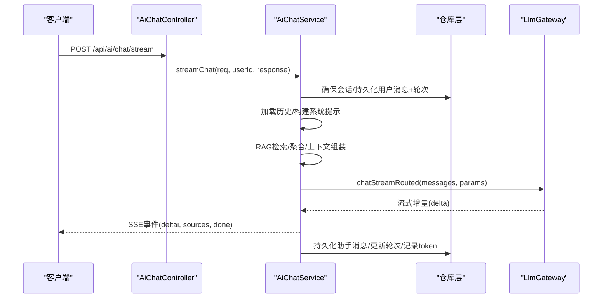
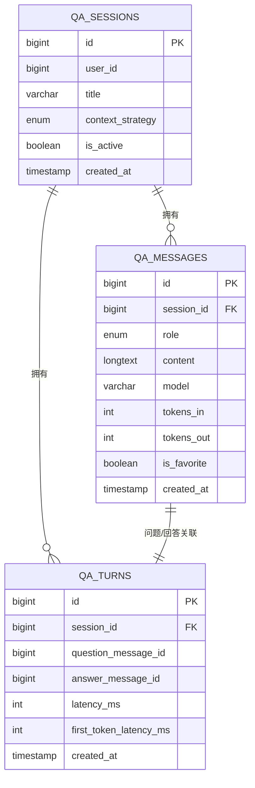
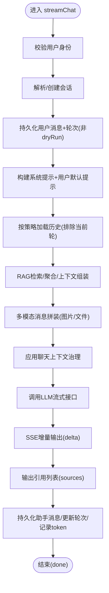
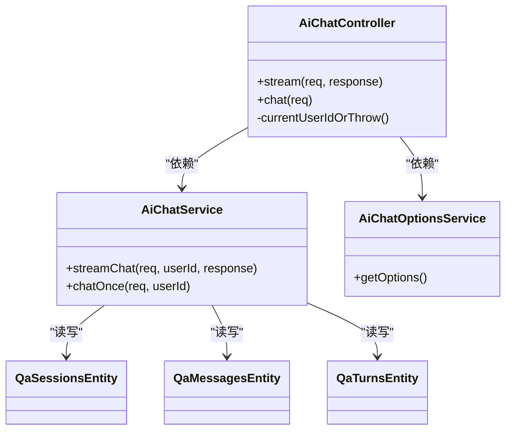
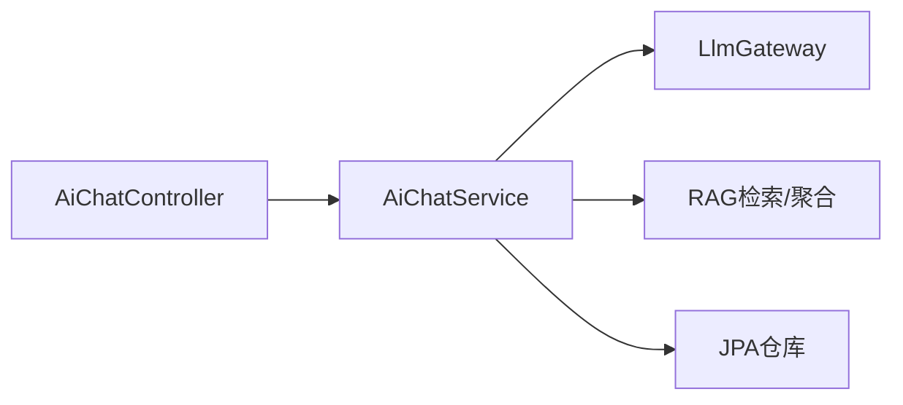
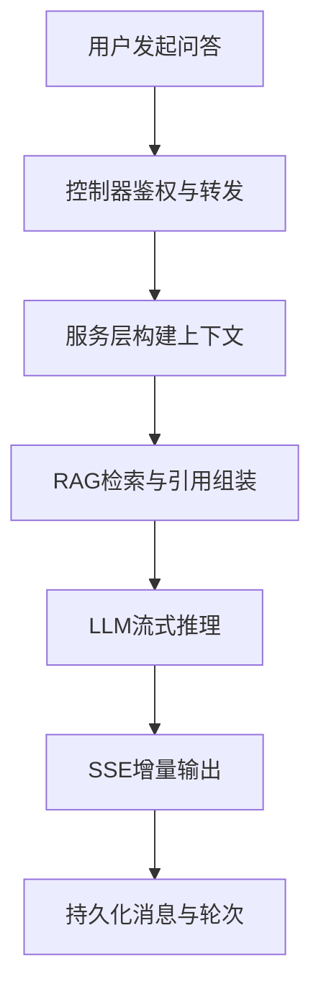

# RAG问答系统

<cite>
**本文档引用的文件**
- [QaSessionsEntity.java](file://src/main/java/com/example/EnterpriseRagCommunity/entity/rag/QaSessionsEntity.java)
- [QaMessagesEntity.java](file://src/main/java/com/example/EnterpriseRagCommunity/entity/rag/QaMessagesEntity.java)
- [QaTurnsEntity.java](file://src/main/java/com/example/EnterpriseRagCommunity/entity/rag/QaTurnsEntity.java)
- [ContextStrategy.java](file://src/main/java/com/example/EnterpriseRagCommunity/entity/rag/enums/ContextStrategy.java)
- [MessageRole.java](file://src/main/java/com/example/EnterpriseRagCommunity/entity/rag/enums/MessageRole.java)
- [AiChatService.java](file://src/main/java/com/example/EnterpriseRagCommunity/service/ai/AiChatService.java)
- [AiChatController.java](file://src/main/java/com/example/EnterpriseRagCommunity/controller/ai/AiChatController.java)
- [AiChatOptionsService.java](file://src/main/java/com/example/EnterpriseRagCommunity/service/ai/AiChatOptionsService.java)
- [AiChatStreamRequest.java](file://src/main/java/com/example/EnterpriseRagCommunity/dto/ai/AiChatStreamRequest.java)
- [AiChatResponseDTO.java](file://src/main/java/com/example/EnterpriseRagCommunity/dto/ai/AiChatResponseDTO.java)
</cite>

## 目录
1. [引言](#引言)
2. [项目结构](#项目结构)
3. [核心组件](#核心组件)
4. [架构总览](#架构总览)
5. [详细组件分析](#详细组件分析)
6. [依赖分析](#依赖分析)
7. [性能考虑](#性能考虑)
8. [故障排查指南](#故障排查指南)
9. [结论](#结论)
10. [附录](#附录)

## 引言
本技术文档面向RAG问答系统，聚焦于问答会话管理、消息处理与流式响应等核心能力，系统性阐述数据模型设计（QaSessionsEntity与QaMessagesEntity）、服务架构（AiChatService）以及API接口规范，并给出性能优化、并发控制与错误处理建议。文档同时提供可视化图示帮助读者快速理解系统运行流程。

## 项目结构
问答系统后端采用分层架构：控制器层负责HTTP请求接入与鉴权；服务层承载业务编排（会话、消息、检索、上下文构建、LLM调用、流式输出）；持久化层通过JPA实体与仓库访问数据库；前端通过SSE进行流式交互。

图表来源
- [AiChatController.java:1-48](file://src/main/java/com/example/EnterpriseRagCommunity/controller/ai/AiChatController.java#L1-L48)
- [AiChatService.java:1-120](file://src/main/java/com/example/EnterpriseRagCommunity/service/ai/AiChatService.java#L1-L120)
- [QaSessionsEntity.java:1-37](file://src/main/java/com/example/EnterpriseRagCommunity/entity/rag/QaSessionsEntity.java#L1-L37)
- [QaMessagesEntity.java:1-46](file://src/main/java/com/example/EnterpriseRagCommunity/entity/rag/QaMessagesEntity.java#L1-L46)
- [QaTurnsEntity.java](file://src/main/java/com/example/EnterpriseRagCommunity/entity/rag/QaTurnsEntity.java)

章节来源
- [AiChatController.java:1-48](file://src/main/java/com/example/EnterpriseRagCommunity/controller/ai/AiChatController.java#L1-L48)
- [AiChatService.java:1-120](file://src/main/java/com/example/EnterpriseRagCommunity/service/ai/AiChatService.java#L1-L120)

## 核心组件
- 数据模型
  - QaSessionsEntity：会话实体，包含用户ID、标题、上下文策略、活跃状态与创建时间。
  - QaMessagesEntity：消息实体，包含会话ID、角色（USER/ASSISTANT/SYSTEM）、内容、模型名、token统计、收藏标记与创建时间。
  - QaTurnsEntity：问答轮次实体，关联问题与回答消息ID，记录时延等指标。
  - 枚举：ContextStrategy（最近N/摘要/无），MessageRole（用户/助手/系统）。
- 服务编排
  - AiChatService：负责会话解析/创建、历史加载、RAG检索与上下文组装、多模态消息构造、LLM路由与流式输出、结果持久化与引用溯源。
  - AiChatOptionsService：提供可用提供商与模型选项，支持默认值回退。
- 控制器
  - AiChatController：提供流式聊天与一次性回复接口，统一鉴权与用户ID解析。

章节来源
- [QaSessionsEntity.java:1-37](file://src/main/java/com/example/EnterpriseRagCommunity/entity/rag/QaSessionsEntity.java#L1-L37)
- [QaMessagesEntity.java:1-46](file://src/main/java/com/example/EnterpriseRagCommunity/entity/rag/QaMessagesEntity.java#L1-L46)
- [QaTurnsEntity.java](file://src/main/java/com/example/EnterpriseRagCommunity/entity/rag/QaTurnsEntity.java)
- [ContextStrategy.java:1-9](file://src/main/java/com/example/EnterpriseRagCommunity/entity/rag/enums/ContextStrategy.java#L1-L9)
- [MessageRole.java:1-9](file://src/main/java/com/example/EnterpriseRagCommunity/entity/rag/enums/MessageRole.java#L1-L9)
- [AiChatService.java:120-604](file://src/main/java/com/example/EnterpriseRagCommunity/service/ai/AiChatService.java#L120-L604)
- [AiChatOptionsService.java:1-110](file://src/main/java/com/example/EnterpriseRagCommunity/service/ai/AiChatOptionsService.java#L1-L110)
- [AiChatController.java:1-48](file://src/main/java/com/example/EnterpriseRagCommunity/controller/ai/AiChatController.java#L1-L48)

## 架构总览
问答系统围绕“会话-消息-检索-上下文-LLM”闭环展开。控制器接收请求，服务层完成会话与消息的准备、历史与RAG上下文构建、多模态消息拼装、LLM流式输出，并在完成后持久化消息、更新轮次、记录token与引用。

图表来源
- [AiChatController.java:25-29](file://src/main/java/com/example/EnterpriseRagCommunity/controller/ai/AiChatController.java#L25-L29)
- [AiChatService.java:123-604](file://src/main/java/com/example/EnterpriseRagCommunity/service/ai/AiChatService.java#L123-L604)

## 详细组件分析

### 数据模型设计与关系
- QaSessionsEntity
  - 字段要点：用户ID、标题、上下文策略（RECENT_N/SUMMARIZE/NONE）、活跃标志、创建时间。
  - 用途：标识一次问答旅程，控制上下文加载策略与会话生命周期。
- QaMessagesEntity
  - 字段要点：会话ID、角色、内容（LOB）、模型名、入出token、收藏、创建时间。
  - 用途：存储完整对话历史，支撑上下文截断、token统计与引用溯源。
- QaTurnsEntity
  - 字段要点：会话ID、问题消息ID、回答消息ID、时延、首token时延等。
  - 用途：记录问答轮次指标，便于性能监控与复盘。
- 关系图

图表来源
- [QaSessionsEntity.java:14-36](file://src/main/java/com/example/EnterpriseRagCommunity/entity/rag/QaSessionsEntity.java#L14-L36)
- [QaMessagesEntity.java:14-44](file://src/main/java/com/example/EnterpriseRagCommunity/entity/rag/QaMessagesEntity.java#L14-L44)
- [QaTurnsEntity.java](file://src/main/java/com/example/EnterpriseRagCommunity/entity/rag/QaTurnsEntity.java)

章节来源
- [QaSessionsEntity.java:1-37](file://src/main/java/com/example/EnterpriseRagCommunity/entity/rag/QaSessionsEntity.java#L1-L37)
- [QaMessagesEntity.java:1-46](file://src/main/java/com/example/EnterpriseRagCommunity/entity/rag/QaMessagesEntity.java#L1-L46)
- [QaTurnsEntity.java](file://src/main/java/com/example/EnterpriseRagCommunity/entity/rag/QaTurnsEntity.java)
- [ContextStrategy.java:1-9](file://src/main/java/com/example/EnterpriseRagCommunity/entity/rag/enums/ContextStrategy.java#L1-L9)
- [MessageRole.java:1-9](file://src/main/java/com/example/EnterpriseRagCommunity/entity/rag/enums/MessageRole.java#L1-L9)

### 服务架构与业务流程（AiChatService）
- 会话管理
  - 解析/创建会话，支持干跑模式（dryRun）不写库。
  - 自动标题生成：首次回答后基于用户问题截断设置标题。
- 消息与历史
  - 用户消息入库并建立轮次；加载历史时排除当前轮次以避免自我引用。
  - 支持系统提示叠加用户默认系统提示。
- 上下文构建与RAG
  - 可选混合检索（BM25/向量/重排序）与评论增强聚合。
  - 上下文截断与引用组装，可按策略采样记录上下文窗口。
- 多模态与治理
  - 图像/文件输入转为多模态消息部件；应用聊天上下文治理策略。
- LLM调用与流式输出
  - 路由到指定提供商与模型，逐字节增量返回delta，支持深思模式<think>包裹。
  - 输出引用列表与最终sources事件，确保引用可见性。
- 结果持久化
  - 写入助手消息、更新轮次、记录token消耗、写入引用溯源。

图表来源
- [AiChatService.java:123-604](file://src/main/java/com/example/EnterpriseRagCommunity/service/ai/AiChatService.java#L123-L604)

章节来源
- [AiChatService.java:120-604](file://src/main/java/com/example/EnterpriseRagCommunity/service/ai/AiChatService.java#L120-L604)

### API接口规范
- 鉴权
  - 所有接口需登录态，匿名或会话过期将抛出认证异常。
- 流式聊天
  - 方法与路径：POST /api/ai/chat/stream
  - 请求体：AiChatStreamRequest（消息文本、会话ID、是否使用RAG、历史条数、温度、topP、深度思考、提供商/模型覆盖、图片/文件输入等）
  - 响应：text/event-stream，事件类型
    - meta：包含sessionId与userMessageId
    - delta：增量内容片段
    - sources：引用列表（最多200条）
    - error：错误信息
    - done：结束事件，携带耗时
- 一次性回复
  - 方法与路径：POST /api/ai/chat
  - 请求体：AiChatStreamRequest
  - 响应：AiChatResponseDTO（包含最终回答、引用、token统计等）

章节来源
- [AiChatController.java:25-35](file://src/main/java/com/example/EnterpriseRagCommunity/controller/ai/AiChatController.java#L25-L35)
- [AiChatStreamRequest.java](file://src/main/java/com/example/EnterpriseRagCommunity/dto/ai/AiChatStreamRequest.java)
- [AiChatResponseDTO.java](file://src/main/java/com/example/EnterpriseRagCommunity/dto/ai/AiChatResponseDTO.java)

### 类关系与依赖（代码级）

图表来源
- [AiChatController.java:17-48](file://src/main/java/com/example/EnterpriseRagCommunity/controller/ai/AiChatController.java#L17-L48)
- [AiChatService.java:83-116](file://src/main/java/com/example/EnterpriseRagCommunity/service/ai/AiChatService.java#L83-L116)
- [AiChatOptionsService.java:20-75](file://src/main/java/com/example/EnterpriseRagCommunity/service/ai/AiChatOptionsService.java#L20-L75)
- [QaSessionsEntity.java:14-36](file://src/main/java/com/example/EnterpriseRagCommunity/entity/rag/QaSessionsEntity.java#L14-L36)
- [QaMessagesEntity.java:14-44](file://src/main/java/com/example/EnterpriseRagCommunity/entity/rag/QaMessagesEntity.java#L14-L44)
- [QaTurnsEntity.java](file://src/main/java/com/example/EnterpriseRagCommunity/entity/rag/QaTurnsEntity.java)

## 依赖分析
- 组件耦合
  - 控制器仅依赖服务层，职责清晰；服务层依赖仓库与检索/上下文服务，形成稳定的业务编排层。
- 外部依赖
  - LlmGateway：统一LLM路由与流式调用。
  - 检索服务：RAG检索、评论增强聚合、上下文截断与引用组装。
- 数据依赖
  - 会话-消息-轮次三者强关联，保证问答轨迹完整；消息与引用溯源通过独立实体维护。

图表来源
- [AiChatService.java:89-115](file://src/main/java/com/example/EnterpriseRagCommunity/service/ai/AiChatService.java#L89-L115)
- [AiChatController.java:22-23](file://src/main/java/com/example/EnterpriseRagCommunity/controller/ai/AiChatController.java#L22-L23)

章节来源
- [AiChatService.java:89-115](file://src/main/java/com/example/EnterpriseRagCommunity/service/ai/AiChatService.java#L89-L115)
- [AiChatController.java:22-23](file://src/main/java/com/example/EnterpriseRagCommunity/controller/ai/AiChatController.java#L22-L23)

## 性能考虑
- 上下文截断与采样
  - 使用上下文策略与最大项限制，结合token预算控制，避免超限与延迟上升。
- RAG检索优化
  - 混合检索参数（BM25/向量/重排序）与评论增强的K值裁剪，减少无关上下文。
- 流式输出
  - SSE增量推送降低首token延迟感知；对引用列表做上限控制（最多200条）。
- 并发与资源
  - 控制并发会话数量与单会话历史长度；对LLM调用进行队列与超时控制。
- 存储与索引
  - 对会话、消息、轮次建立必要索引（如会话ID、创建时间），提升历史加载效率。

## 故障排查指南
- 认证失败
  - 现象：抛出未登录或会话过期异常。
  - 排查：确认前端携带正确Cookie/JWT；检查安全上下文与用户解析逻辑。
- 数据持久化失败
  - 现象：SSE返回error事件并结束。
  - 排查：查看数据库连接、事务一致性与唯一约束冲突；关注会话/消息/轮次保存异常日志。
- RAG检索异常
  - 现象：检索阶段捕获异常但继续执行，日志告警。
  - 排查：检查检索配置、向量索引状态与后端服务连通性。
- LLM调用异常
  - 现象：SSE输出error事件，记录模型与会话ID。
  - 排查：检查提供商/模型配置、路由策略与上游限流/熔断状态。
- 引用缺失或格式异常
  - 现象：引用列表为空或格式不规范。
  - 排查：确认引用组装策略、引用渲染配置与引用过滤逻辑。

章节来源
- [AiChatController.java:37-46](file://src/main/java/com/example/EnterpriseRagCommunity/controller/ai/AiChatController.java#L37-L46)
- [AiChatService.java:177-186](file://src/main/java/com/example/EnterpriseRagCommunity/service/ai/AiChatService.java#L177-L186)
- [AiChatService.java:361-363](file://src/main/java/com/example/EnterpriseRagCommunity/service/ai/AiChatService.java#L361-L363)
- [AiChatService.java:592-596](file://src/main/java/com/example/EnterpriseRagCommunity/service/ai/AiChatService.java#L592-L596)

## 结论
本系统通过清晰的分层架构与完善的实体模型，实现了从会话管理、消息处理到RAG检索与流式响应的全链路能力。AiChatService作为核心编排者，将上下文构建、多模态处理与LLM路由有机整合，并提供稳健的错误处理与可观测性。建议在生产环境中配合严格的并发控制、缓存与索引优化，持续监控上下文窗口与token使用，保障用户体验与系统稳定性。

## 附录
- 关键流程图（概念示意）
