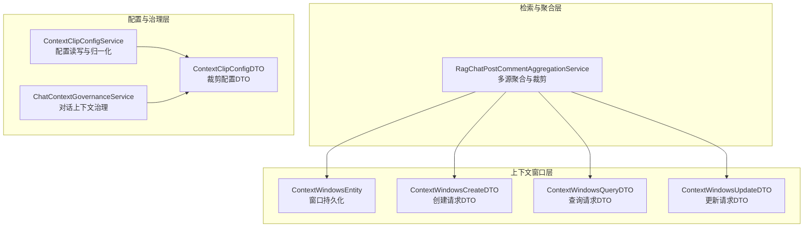
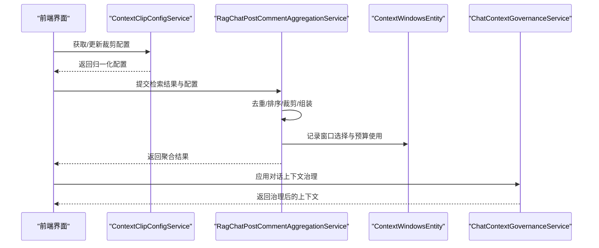
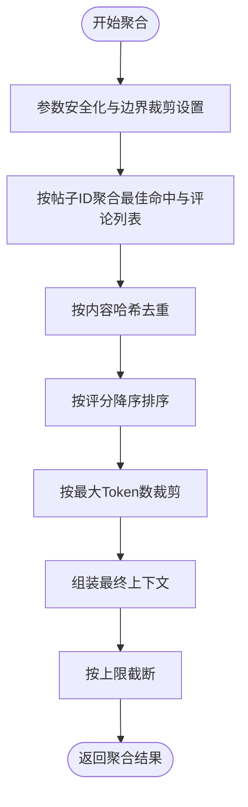
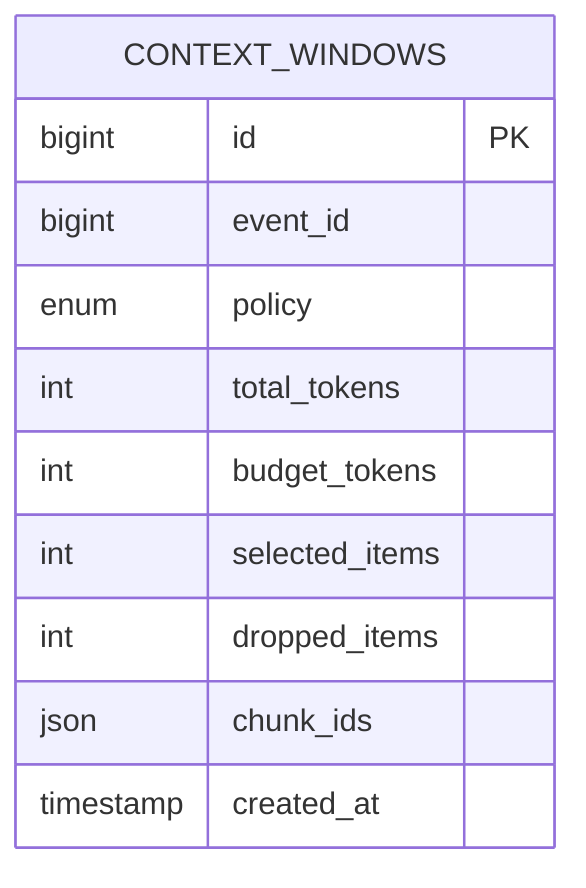
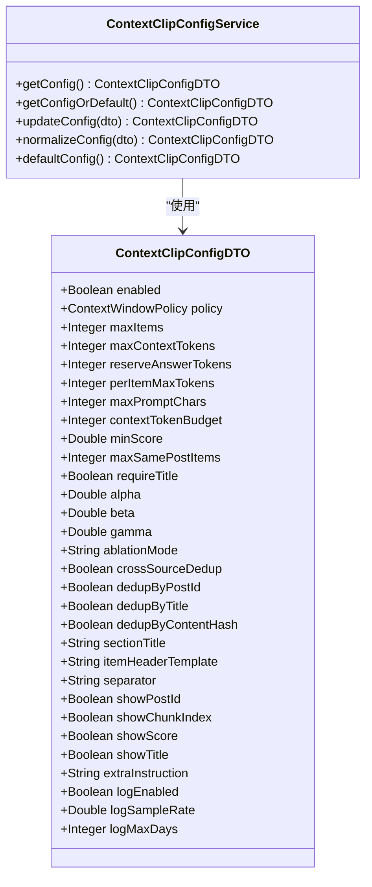
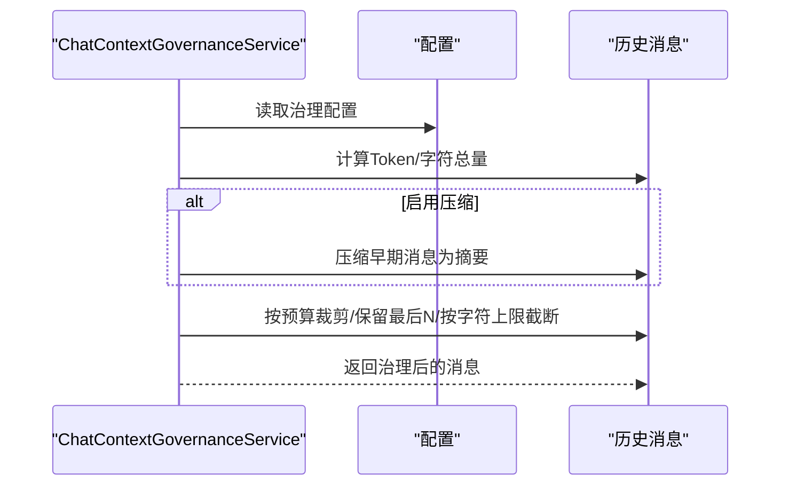
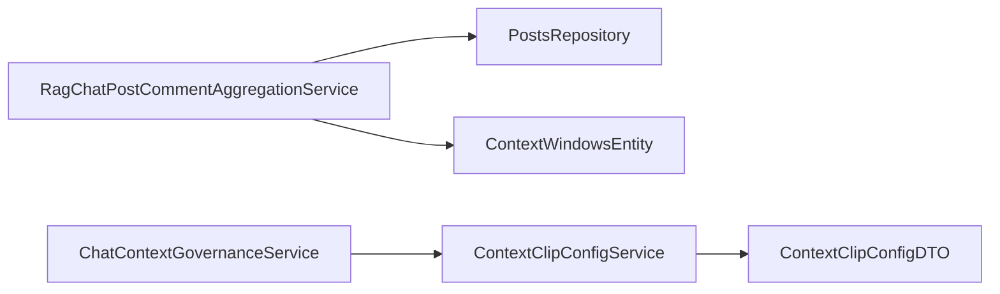

# 上下文聚合

<cite>
**本文引用的文件**
- [RagChatPostCommentAggregationService.java](file://src/main/java/com/example/EnterpriseRagCommunity/service/retrieval/RagChatPostCommentAggregationService.java)
- [ContextWindowsEntity.java](file://src/main/java/com/example/EnterpriseRagCommunity/entity/semantic/ContextWindowsEntity.java)
- [ContextWindowPolicy.java](file://src/main/java/com/example/EnterpriseRagCommunity/entity/semantic/enums/ContextWindowPolicy.java)
- [ContextWindowsCreateDTO.java](file://src/main/java/com/example/EnterpriseRagCommunity/dto/semantic/ContextWindowsCreateDTO.java)
- [ContextWindowsQueryDTO.java](file://src/main/java/com/example/EnterpriseRagCommunity/dto/semantic/ContextWindowsQueryDTO.java)
- [ContextWindowsUpdateDTO.java](file://src/main/java/com/example/EnterpriseRagCommunity/dto/semantic/ContextWindowsUpdateDTO.java)
- [ContextClipConfigDTO.java](file://src/main/java/com/example/EnterpriseRagCommunity/dto/retrieval/ContextClipConfigDTO.java)
- [ContextClipConfigService.java](file://src/main/java/com/example/EnterpriseRagCommunity/service/retrieval/admin/ContextClipConfigService.java)
- [ChatContextGovernanceService.java](file://src/main/java/com/example/EnterpriseRagCommunity/service/ai/ChatContextGovernanceService.java)
- [ContextClipConfigService.java（后端服务）](file://src/main/java/com/example/EnterpriseRagCommunity/service/retrieval/admin/ContextClipConfigService.java)
- [RagChatPostCommentAggregationServiceTest.java](file://src/test/java/com/example/EnterpriseRagCommunity/service/retrieval/RagChatPostCommentAggregationServiceTest.java)
- [RagContextPromptServiceTask2Test.java](file://src/test/java/com/example/EnterpriseRagCommunity/service/ai/RagContextPromptServiceTask2Test.java)
- [RagContextPromptServiceTask5Test.java](file://src/test/java/com/example/EnterpriseRagCommunity/service/ai/RagContextPromptServiceTask5Test.java)
- [ContextClipConfigServiceTest.java](file://src/test/java/com/example/EnterpriseRagCommunity/service/retrieval/admin/ContextClipConfigServiceTest.java)
</cite>

## 目录
1. [引言](#引言)
2. [项目结构](#项目结构)
3. [核心组件](#核心组件)
4. [架构总览](#架构总览)
5. [详细组件分析](#详细组件分析)
6. [依赖分析](#依赖分析)
7. [性能考虑](#性能考虑)
8. [故障排查指南](#故障排查指南)
9. [结论](#结论)
10. [附录](#附录)

## 引言
本文件面向“上下文聚合系统”的技术文档，聚焦于多源信息整合、上下文窗口管理、内容裁剪与质量控制等核心能力。重点覆盖以下方面：
- 多源检索结果聚合：帖子与评论的融合、去重、排序与裁剪
- 上下文窗口模型：窗口策略、预算与边界控制
- 裁剪与治理：基于配置的动态裁剪、冗余过滤、一致性与完整性保障
- 接口规范与性能优化建议：请求/响应结构、参数约束与调优要点

## 项目结构
围绕上下文聚合的关键模块分布如下：
- 聚合服务：RagChatPostCommentAggregationService（多源聚合）
- 上下文窗口实体与DTO：ContextWindowsEntity、ContextWindowsCreateDTO、ContextWindowsQueryDTO、ContextWindowsUpdateDTO
- 裁剪配置与治理：ContextClipConfigDTO、ContextClipConfigService、ChatContextGovernanceService
- 测试与验证：RagChatPostCommentAggregationServiceTest、RagContextPromptServiceTask2Test、RagContextPromptServiceTask5Test、ContextClipConfigServiceTest

图表来源
- [RagChatPostCommentAggregationService.java:28-175](file://src/main/java/com/example/EnterpriseRagCommunity/service/retrieval/RagChatPostCommentAggregationService.java#L28-L175)
- [ContextWindowsEntity.java:16-47](file://src/main/java/com/example/EnterpriseRagCommunity/entity/semantic/ContextWindowsEntity.java#L16-L47)
- [ContextWindowsCreateDTO.java:13-33](file://src/main/java/com/example/EnterpriseRagCommunity/dto/semantic/ContextWindowsCreateDTO.java#L13-L33)
- [ContextWindowsQueryDTO.java:12-42](file://src/main/java/com/example/EnterpriseRagCommunity/dto/semantic/ContextWindowsQueryDTO.java#L12-L42)
- [ContextWindowsUpdateDTO.java:14-34](file://src/main/java/com/example/EnterpriseRagCommunity/dto/semantic/ContextWindowsUpdateDTO.java#L14-L34)
- [ContextClipConfigDTO.java:12-63](file://src/main/java/com/example/EnterpriseRagCommunity/dto/retrieval/ContextClipConfigDTO.java#L12-L63)
- [ContextClipConfigService.java:26-54](file://src/main/java/com/example/EnterpriseRagCommunity/service/retrieval/admin/ContextClipConfigService.java#L26-L54)
- [ChatContextGovernanceService.java:40-121](file://src/main/java/com/example/EnterpriseRagCommunity/service/ai/ChatContextGovernanceService.java#L40-L121)

章节来源
- [RagChatPostCommentAggregationService.java:28-175](file://src/main/java/com/example/EnterpriseRagCommunity/service/retrieval/RagChatPostCommentAggregationService.java#L28-L175)
- [ContextWindowsEntity.java:16-47](file://src/main/java/com/example/EnterpriseRagCommunity/entity/semantic/ContextWindowsEntity.java#L16-L47)
- [ContextClipConfigDTO.java:12-63](file://src/main/java/com/example/EnterpriseRagCommunity/dto/retrieval/ContextClipConfigDTO.java#L12-L63)

## 核心组件
- 多源聚合服务：负责将帖子检索与评论检索结果进行合并，执行去重、按分数排序、内容裁剪与组装。
- 上下文窗口模型：以实体与DTO描述窗口策略、预算、选中/丢弃项统计、分片ID集合等。
- 动态裁剪配置：通过DTO与服务对窗口策略、预算、冗余惩罚、标题要求、日志采样等进行集中管理。
- 对话上下文治理：在对话层面实施压缩、预算裁剪、保留最后N条消息等治理策略。

章节来源
- [RagChatPostCommentAggregationService.java:28-175](file://src/main/java/com/example/EnterpriseRagCommunity/service/retrieval/RagChatPostCommentAggregationService.java#L28-L175)
- [ContextWindowsEntity.java:16-47](file://src/main/java/com/example/EnterpriseRagCommunity/entity/semantic/ContextWindowsEntity.java#L16-L47)
- [ContextClipConfigDTO.java:12-63](file://src/main/java/com/example/EnterpriseRagCommunity/dto/retrieval/ContextClipConfigDTO.java#L12-L63)
- [ChatContextGovernanceService.java:40-121](file://src/main/java/com/example/EnterpriseRagCommunity/service/ai/ChatContextGovernanceService.java#L40-L121)

## 架构总览
上下文聚合贯穿“检索-聚合-裁剪-治理”链路，前端通过配置界面调整策略，后端服务根据策略对检索结果进行聚合与裁剪，并在对话阶段进一步治理上下文长度与质量。

图表来源
- [ContextClipConfigService.java:26-54](file://src/main/java/com/example/EnterpriseRagCommunity/service/retrieval/admin/ContextClipConfigService.java#L26-L54)
- [RagChatPostCommentAggregationService.java:28-175](file://src/main/java/com/example/EnterpriseRagCommunity/service/retrieval/RagChatPostCommentAggregationService.java#L28-L175)
- [ContextWindowsEntity.java:16-47](file://src/main/java/com/example/EnterpriseRagCommunity/entity/semantic/ContextWindowsEntity.java#L16-L47)
- [ChatContextGovernanceService.java:40-121](file://src/main/java/com/example/EnterpriseRagCommunity/service/ai/ChatContextGovernanceService.java#L40-L121)

## 详细组件分析

### 组件A：RagChatPostCommentAggregationService（多源聚合）
该服务负责将帖子与评论的检索命中结果进行聚合，核心流程包括：
- 参数安全化与裁剪边界设定
- 按帖子ID聚合最佳命中与评论列表
- 内容去重（基于内容哈希）
- 评分排序与内容裁剪
- 组装最终上下文并返回

图表来源
- [RagChatPostCommentAggregationService.java:28-175](file://src/main/java/com/example/EnterpriseRagCommunity/service/retrieval/RagChatPostCommentAggregationService.java#L28-L175)

章节来源
- [RagChatPostCommentAggregationService.java:28-175](file://src/main/java/com/example/EnterpriseRagCommunity/service/retrieval/RagChatPostCommentAggregationService.java#L28-L175)
- [RagChatPostCommentAggregationServiceTest.java:20-30](file://src/test/java/com/example/EnterpriseRagCommunity/service/retrieval/RagChatPostCommentAggregationServiceTest.java#L20-L30)

### 组件B：ContextWindowsEntity（上下文窗口模型）
上下文窗口用于记录一次检索事件的窗口策略、预算、选中/丢弃项统计以及分片ID集合，支撑后续审计与复现。

图表来源
- [ContextWindowsEntity.java:16-47](file://src/main/java/com/example/EnterpriseRagCommunity/entity/semantic/ContextWindowsEntity.java#L16-L47)

章节来源
- [ContextWindowsEntity.java:16-47](file://src/main/java/com/example/EnterpriseRagCommunity/entity/semantic/ContextWindowsEntity.java#L16-L47)
- [ContextWindowsCreateDTO.java:13-33](file://src/main/java/com/example/EnterpriseRagCommunity/dto/semantic/ContextWindowsCreateDTO.java#L13-L33)
- [ContextWindowsQueryDTO.java:12-42](file://src/main/java/com/example/EnterpriseRagCommunity/dto/semantic/ContextWindowsQueryDTO.java#L12-L42)
- [ContextWindowsUpdateDTO.java:14-34](file://src/main/java/com/example/EnterpriseRagCommunity/dto/semantic/ContextWindowsUpdateDTO.java#L14-L34)

### 组件C：ContextClipConfigDTO 与 ContextClipConfigService（动态裁剪配置）
- ContextClipConfigDTO 描述窗口策略、预算、每项最大Token、字符上限、最小分数、同主题去重、标题要求、冗余惩罚系数、跨来源去重、日志开关与采样率等。
- ContextClipConfigService 提供配置读取、默认值归一化、边界校验与持久化。

图表来源
- [ContextClipConfigDTO.java:12-63](file://src/main/java/com/example/EnterpriseRagCommunity/dto/retrieval/ContextClipConfigDTO.java#L12-L63)
- [ContextClipConfigService.java:26-54](file://src/main/java/com/example/EnterpriseRagCommunity/service/retrieval/admin/ContextClipConfigService.java#L26-L54)

章节来源
- [ContextClipConfigDTO.java:12-63](file://src/main/java/com/example/EnterpriseRagCommunity/dto/retrieval/ContextClipConfigDTO.java#L12-L63)
- [ContextClipConfigService.java:26-54](file://src/main/java/com/example/EnterpriseRagCommunity/service/retrieval/admin/ContextClipConfigService.java#L26-L54)
- [ContextClipConfigServiceTest.java](file://src/test/java/com/example/EnterpriseRagCommunity/service/retrieval/admin/ContextClipConfigServiceTest.java)

### 组件D：ChatContextGovernanceService（对话上下文治理）
在对话阶段对历史消息进行治理，支持：
- 压缩历史（摘要替换早期消息）
- 按预算裁剪（删除最旧可丢弃消息）
- 保留最后N条消息
- 按字符上限截断
- 可选丢弃RAG上下文

图表来源
- [ChatContextGovernanceService.java:40-121](file://src/main/java/com/example/EnterpriseRagCommunity/service/ai/ChatContextGovernanceService.java#L40-L121)

章节来源
- [ChatContextGovernanceService.java:40-121](file://src/main/java/com/example/EnterpriseRagCommunity/service/ai/ChatContextGovernanceService.java#L40-L121)

## 依赖分析
- 聚合服务依赖帖子仓库以补充缺失的帖子正文，确保在命中仅含文件资产或标题时仍能生成上下文。
- 上下文窗口实体与DTO构成窗口持久化与对外接口契约，支持审计与运维。
- 裁剪配置服务提供统一的策略与边界控制，避免异常配置导致的性能与稳定性问题。
- 对话治理服务在会话维度进一步保障上下文长度与质量。

图表来源
- [RagChatPostCommentAggregationService.java:26-27](file://src/main/java/com/example/EnterpriseRagCommunity/service/retrieval/RagChatPostCommentAggregationService.java#L26-L27)
- [ContextWindowsEntity.java:16-47](file://src/main/java/com/example/EnterpriseRagCommunity/entity/semantic/ContextWindowsEntity.java#L16-L47)
- [ContextClipConfigService.java:26-54](file://src/main/java/com/example/EnterpriseRagCommunity/service/retrieval/admin/ContextClipConfigService.java#L26-L54)
- [ChatContextGovernanceService.java:25-26](file://src/main/java/com/example/EnterpriseRagCommunity/service/ai/ChatContextGovernanceService.java#L25-L26)

章节来源
- [RagChatPostCommentAggregationService.java:26-27](file://src/main/java/com/example/EnterpriseRagCommunity/service/retrieval/RagChatPostCommentAggregationService.java#L26-L27)
- [ContextClipConfigService.java:26-54](file://src/main/java/com/example/EnterpriseRagCommunity/service/retrieval/admin/ContextClipConfigService.java#L26-L54)
- [ChatContextGovernanceService.java:25-26](file://src/main/java/com/example/EnterpriseRagCommunity/service/ai/ChatContextGovernanceService.java#L25-L26)

## 性能考虑
- Token估算与二分裁剪：通过近似Token估算与二分查找实现高效裁剪，避免线性扫描带来的开销。
- 哈希去重：使用CRC32对裁剪后的文本进行去重，降低重复内容对预算的占用。
- 配置边界：服务端对关键参数进行边界校验与默认值归一化，防止极端配置引发资源浪费。
- 压缩与预算：对话治理阶段先压缩再按预算裁剪，减少大规模历史消息的处理成本。
- 批量查询：聚合服务一次性批量拉取帖子实体，减少多次数据库往返。

章节来源
- [RagChatPostCommentAggregationService.java:212-243](file://src/main/java/com/example/EnterpriseRagCommunity/service/retrieval/RagChatPostCommentAggregationService.java#L212-L243)
- [ChatContextGovernanceService.java:188-304](file://src/main/java/com/example/EnterpriseRagCommunity/service/ai/ChatContextGovernanceService.java#L188-L304)
- [ContextClipConfigService.java:103-160](file://src/main/java/com/example/EnterpriseRagCommunity/service/retrieval/admin/ContextClipConfigService.java#L103-L160)

## 故障排查指南
- 聚合结果为空
  - 检查输入命中是否为空或内容为空
  - 确认聚合策略与裁剪阈值是否过严
- 冗余内容过多
  - 开启跨来源去重与内容哈希去重
  - 调整冗余惩罚系数与ablation模式
- 预算超支或Token估算不准
  - 校验contextTokenBudget与reserveAnswerTokens
  - 使用更严格的perItemMaxTokens
- 对话上下文过长
  - 启用压缩并设置合理的触发阈值
  - 适当减少保留最后N条消息的数量

章节来源
- [RagChatPostCommentAggregationService.java:28-175](file://src/main/java/com/example/EnterpriseRagCommunity/service/retrieval/RagChatPostCommentAggregationService.java#L28-L175)
- [ContextClipConfigDTO.java:12-63](file://src/main/java/com/example/EnterpriseRagCommunity/dto/retrieval/ContextClipConfigDTO.java#L12-L63)
- [ChatContextGovernanceService.java:40-121](file://src/main/java/com/example/EnterpriseRagCommunity/service/ai/ChatContextGovernanceService.java#L40-L121)

## 结论
上下文聚合系统通过“多源聚合+动态裁剪+对话治理”的组合，实现了在复杂检索场景下的高质量上下文生成与稳定运行。其关键在于：
- 明确的窗口策略与预算边界
- 严谨的去重与冗余惩罚机制
- 可配置的治理策略与可观测的日志采样
- 高效的裁剪算法与批量查询优化

## 附录

### 上下文聚合API接口规范
- 请求体（聚合）
  - queryText: 查询文本（字符串）
  - postHits: 帖子检索命中列表（数组）
  - commentHits: 评论检索命中列表（数组）
  - cfg: 聚合配置（对象）
    - maxPosts: 最大返回帖子数（整数，默认6，范围1~100）
    - perPostMaxCommentChunks: 每帖最多评论片段数（整数，默认2，范围0~50）
    - includePostContentPolicy: 是否包含帖子正文（枚举：ALWAYS/ON_COMMENT_HIT/NEVER）
    - postContentMaxTokens: 帖子正文最大Token数（整数，默认1200，范围50~200000）
    - commentChunkMaxTokens: 评论片段最大Token数（整数，默认400，范围20~200000）

- 输出结构（聚合）
  - docId: 聚合文档ID（字符串）
  - postId: 帖子ID（整数）
  - boardId: 板块ID（整数）
  - chunkIndex: 块索引（整数）
  - score: 综合得分（数值）
  - title: 标题（字符串）
  - contentText: 组合内容（字符串）
  - sourceType: 来源类型（字符串）
  - fileAssetId: 文件资产ID（整数）
  - type: 命中类型（枚举）

- 请求体（上下文窗口创建）
  - eventId: 检索事件ID（整数）
  - policy: 策略（枚举：FIXED/ADAPTIVE/SLIDING/TOPK/IMPORTANCE/DEDUP/HYBRID）
  - totalTokens: 总Token数（整数）
  - chunkIds: 入选分片ID集合（JSON对象）

- 请求体（上下文窗口查询）
  - id/eventId/policy/totalTokens/minTotalTokens/maxTotalTokens/chunkIds/createdAt/createdFrom/createdTo（均可选）

- 请求体（上下文窗口更新）
  - id: 窗口ID（整数）
  - eventId/policy/totalTokens/chunkIds（可选）

章节来源
- [RagChatPostCommentAggregationService.java:28-175](file://src/main/java/com/example/EnterpriseRagCommunity/service/retrieval/RagChatPostCommentAggregationService.java#L28-L175)
- [ContextWindowsCreateDTO.java:13-33](file://src/main/java/com/example/EnterpriseRagCommunity/dto/semantic/ContextWindowsCreateDTO.java#L13-L33)
- [ContextWindowsQueryDTO.java:12-42](file://src/main/java/com/example/EnterpriseRagCommunity/dto/semantic/ContextWindowsQueryDTO.java#L12-L42)
- [ContextWindowsUpdateDTO.java:14-34](file://src/main/java/com/example/EnterpriseRagCommunity/dto/semantic/ContextWindowsUpdateDTO.java#L14-L34)

### 质量控制机制
- 冗余过滤
  - 内容哈希去重（CRC32）
  - 跨来源去重与同主题去重
  - 冗余惩罚（alpha/beta/gamma与ablation模式）
- 一致性检查
  - 配置归一化与边界校验
  - 日志采样与审计字段（created_at等）
- 完整性保证
  - 最小分数过滤
  - 标题要求与标题模板
  - 分隔符与条目头部模板

章节来源
- [RagContextPromptServiceTask2Test.java:18-31](file://src/test/java/com/example/EnterpriseRagCommunity/service/ai/RagContextPromptServiceTask2Test.java#L18-L31)
- [RagContextPromptServiceTask5Test.java:64-90](file://src/test/java/com/example/EnterpriseRagCommunity/service/ai/RagContextPromptServiceTask5Test.java#L64-L90)
- [ContextClipConfigDTO.java:12-63](file://src/main/java/com/example/EnterpriseRagCommunity/dto/retrieval/ContextClipConfigDTO.java#L12-L63)
- [ContextClipConfigService.java:103-160](file://src/main/java/com/example/EnterpriseRagCommunity/service/retrieval/admin/ContextClipConfigService.java#L103-L160)