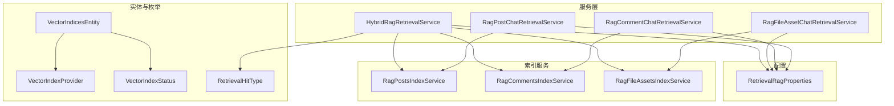
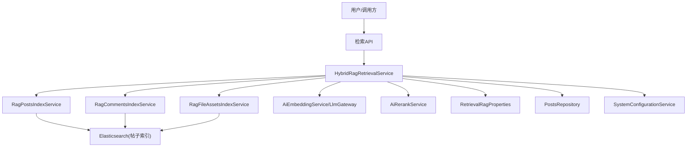
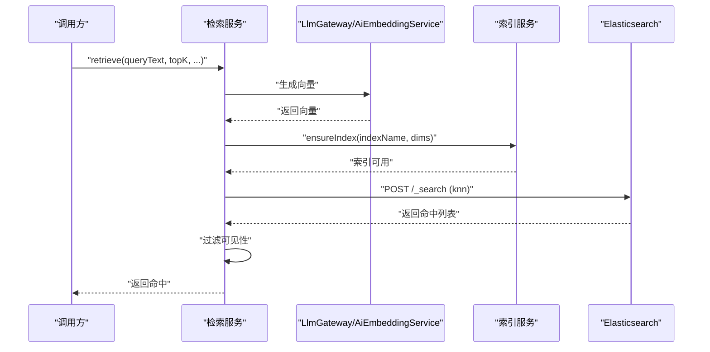
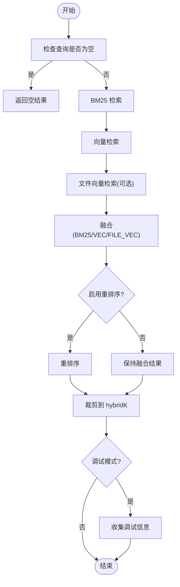
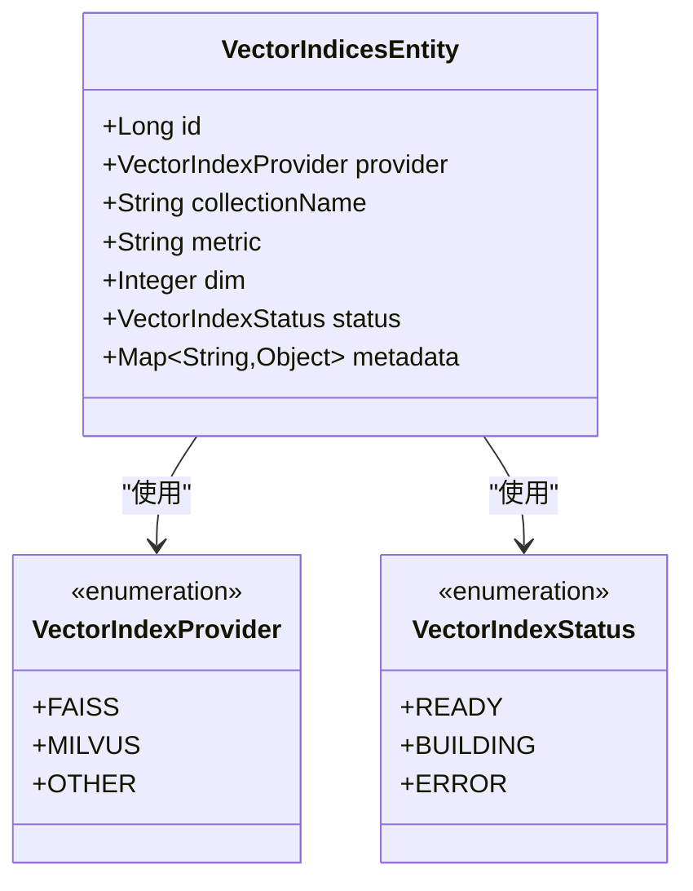
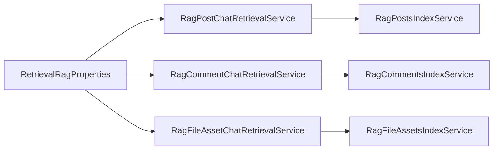
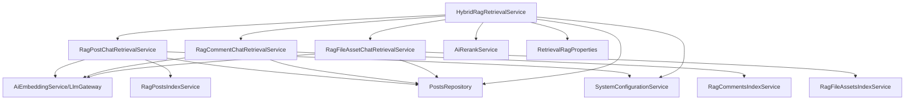

# 向量检索

<cite>
**本文引用的文件**
- [RagPostChatRetrievalService.java](file://src/main/java/com/example/EnterpriseRagCommunity/service/retrieval/RagPostChatRetrievalService.java)
- [RagCommentChatRetrievalService.java](file://src/main/java/com/example/EnterpriseRagCommunity/service/retrieval/RagCommentChatRetrievalService.java)
- [RagFileAssetChatRetrievalService.java](file://src/main/java/com/example/EnterpriseRagCommunity/service/retrieval/RagFileAssetChatRetrievalService.java)
- [VectorIndicesEntity.java](file://src/main/java/com/example/EnterpriseRagCommunity/entity/semantic/VectorIndicesEntity.java)
- [VectorIndexProvider.java](file://src/main/java/com/example/EnterpriseRagCommunity/entity/semantic/enums/VectorIndexProvider.java)
- [VectorIndexStatus.java](file://src/main/java/com/example/EnterpriseRagCommunity/entity/semantic/enums/VectorIndexStatus.java)
- [RetrievalRagProperties.java](file://src/main/java/com/example/EnterpriseRagCommunity/config/RetrievalRagProperties.java)
- [RagPostsIndexService.java](file://src/main/java/com/example/EnterpriseRagCommunity/service/retrieval/es/RagPostsIndexService.java)
- [RagCommentsIndexService.java](file://src/main/java/com/example/EnterpriseRagCommunity/service/retrieval/es/RagCommentsIndexService.java)
- [RagFileAssetsIndexService.java](file://src/main/java/com/example/EnterpriseRagCommunity/service/retrieval/es/RagFileAssetsIndexService.java)
- [HybridRagRetrievalService.java](file://src/main/java/com/example/EnterpriseRagCommunity/service/retrieval/HybridRagRetrievalService.java)
- [RetrievalHitType.java](file://src/main/java/com/example/EnterpriseRagCommunity/entity/semantic/enums/RetrievalHitType.java)
- [HybridRetrievalConfigDTO.java](file://src/main/java/com/example/EnterpriseRagCommunity/dto/retrieval/HybridRetrievalConfigDTO.java)
- [ModerationSimilarityService.java](file://src/main/java/com/example/EnterpriseRagCommunity/service/moderation/ModerationSimilarityService.java)
- [RagPostIndexBuildService.java](file://src/main/java/com/example/EnterpriseRagCommunity/service/retrieval/RagPostIndexBuildService.java)
- [AdminRetrievalHybridController.java](file://src/main/java/com/example/EnterpriseRagCommunity/controller/retrieval/admin/AdminRetrievalHybridController.java)
- [embed.tsx](file://my-vite-app/src/pages/admin/forms/review/embed.tsx)
</cite>

## 目录
1. [简介](#简介)
2. [项目结构](#项目结构)
3. [核心组件](#核心组件)
4. [架构总览](#架构总览)
5. [详细组件分析](#详细组件分析)
6. [依赖分析](#依赖分析)
7. [性能考虑](#性能考虑)
8. [故障排查指南](#故障排查指南)
9. [结论](#结论)
10. [附录](#附录)

## 简介
本文件面向向量检索模块，系统性阐述基于向量嵌入的语义检索实现，覆盖文档向量化、相似度计算、索引构建与查询流程。重点解析以下服务类：RagPostChatRetrievalService、RagCommentChatRetrievalService、RagFileAssetChatRetrievalService 的检索逻辑；VectorIndicesEntity 的索引模型设计；以及混合检索与重排序能力。同时给出 API 接口规范、性能优化建议、准确性评估与召回优化方法，以及实时更新机制。

## 项目结构
向量检索相关代码主要分布在如下位置：
- 服务层：检索服务与混合检索服务
- 实体与枚举：向量索引元数据与状态
- 配置：检索相关属性
- 索引服务：针对不同源（帖子、评论、文件资产）的索引管理
- 控制器与前端：混合检索配置与测试接口

**图表来源**
- [RagPostChatRetrievalService.java:1-187](file://src/main/java/com/example/EnterpriseRagCommunity/service/retrieval/RagPostChatRetrievalService.java#L1-L187)
- [RagCommentChatRetrievalService.java:1-222](file://src/main/java/com/example/EnterpriseRagCommunity/service/retrieval/RagCommentChatRetrievalService.java#L1-L222)
- [RagFileAssetChatRetrievalService.java:1-244](file://src/main/java/com/example/EnterpriseRagCommunity/service/retrieval/RagFileAssetChatRetrievalService.java#L1-L244)
- [HybridRagRetrievalService.java:1-200](file://src/main/java/com/example/EnterpriseRagCommunity/service/retrieval/HybridRagRetrievalService.java#L1-L200)
- [VectorIndicesEntity.java:1-43](file://src/main/java/com/example/EnterpriseRagCommunity/entity/semantic/VectorIndicesEntity.java#L1-L43)
- [VectorIndexProvider.java:1-8](file://src/main/java/com/example/EnterpriseRagCommunity/entity/semantic/enums/VectorIndexProvider.java#L1-L8)
- [VectorIndexStatus.java:1-8](file://src/main/java/com/example/EnterpriseRagCommunity/entity/semantic/enums/VectorIndexStatus.java#L1-L8)
- [RetrievalRagProperties.java:1-21](file://src/main/java/com/example/EnterpriseRagCommunity/config/RetrievalRagProperties.java#L1-L21)
- [RagPostsIndexService.java](file://src/main/java/com/example/EnterpriseRagCommunity/service/retrieval/es/RagPostsIndexService.java)
- [RagCommentsIndexService.java](file://src/main/java/com/example/EnterpriseRagCommunity/service/retrieval/es/RagCommentsIndexService.java)
- [RagFileAssetsIndexService.java](file://src/main/java/com/example/EnterpriseRagCommunity/service/retrieval/es/RagFileAssetsIndexService.java)

**章节来源**
- [RagPostChatRetrievalService.java:1-187](file://src/main/java/com/example/EnterpriseRagCommunity/service/retrieval/RagPostChatRetrievalService.java#L1-L187)
- [RagCommentChatRetrievalService.java:1-222](file://src/main/java/com/example/EnterpriseRagCommunity/service/retrieval/RagCommentChatRetrievalService.java#L1-L222)
- [RagFileAssetChatRetrievalService.java:1-244](file://src/main/java/com/example/EnterpriseRagCommunity/service/retrieval/RagFileAssetChatRetrievalService.java#L1-L244)
- [HybridRagRetrievalService.java:1-200](file://src/main/java/com/example/EnterpriseRagCommunity/service/retrieval/HybridRagRetrievalService.java#L1-L200)
- [VectorIndicesEntity.java:1-43](file://src/main/java/com/example/EnterpriseRagCommunity/entity/semantic/VectorIndicesEntity.java#L1-L43)
- [RetrievalRagProperties.java:1-21](file://src/main/java/com/example/EnterpriseRagCommunity/config/RetrievalRagProperties.java#L1-L21)

## 核心组件
- 检索服务
  - 帖子向量检索：RagPostChatRetrievalService
  - 评论向量检索：RagCommentChatRetrievalService
  - 文件资产向量检索：RagFileAssetChatRetrievalService
- 混合检索：HybridRagRetrievalService
- 索引模型：VectorIndicesEntity 及其枚举
- 配置：RetrievalRagProperties
- 索引服务：RagPostsIndexService、RagCommentsIndexService、RagFileAssetsIndexService

这些组件共同完成“向量化 → 索引构建/校验 → 查询检索 → 结果过滤与返回”的完整链路。

**章节来源**
- [RagPostChatRetrievalService.java:1-187](file://src/main/java/com/example/EnterpriseRagCommunity/service/retrieval/RagPostChatRetrievalService.java#L1-L187)
- [RagCommentChatRetrievalService.java:1-222](file://src/main/java/com/example/EnterpriseRagCommunity/service/retrieval/RagCommentChatRetrievalService.java#L1-L222)
- [RagFileAssetChatRetrievalService.java:1-244](file://src/main/java/com/example/EnterpriseRagCommunity/service/retrieval/RagFileAssetChatRetrievalService.java#L1-L244)
- [HybridRagRetrievalService.java:1-200](file://src/main/java/com/example/EnterpriseRagCommunity/service/retrieval/HybridRagRetrievalService.java#L1-L200)
- [VectorIndicesEntity.java:1-43](file://src/main/java/com/example/EnterpriseRagCommunity/entity/semantic/VectorIndicesEntity.java#L1-L43)
- [RetrievalRagProperties.java:1-21](file://src/main/java/com/example/EnterpriseRagCommunity/config/RetrievalRagProperties.java#L1-L21)

## 架构总览
下图展示向量检索在系统中的位置与交互：

**图表来源**
- [HybridRagRetrievalService.java:115-200](file://src/main/java/com/example/EnterpriseRagCommunity/service/retrieval/HybridRagRetrievalService.java#L115-L200)
- [RagPostsIndexService.java](file://src/main/java/com/example/EnterpriseRagCommunity/service/retrieval/es/RagPostsIndexService.java)
- [RagCommentsIndexService.java](file://src/main/java/com/example/EnterpriseRagCommunity/service/retrieval/es/RagCommentsIndexService.java)
- [RagFileAssetsIndexService.java](file://src/main/java/com/example/EnterpriseRagCommunity/service/retrieval/es/RagFileAssetsIndexService.java)
- [RetrievalRagProperties.java:1-21](file://src/main/java/com/example/EnterpriseRagCommunity/config/RetrievalRagProperties.java#L1-L21)

## 详细组件分析

### 检索服务：帖子、评论、文件资产
三类服务均遵循统一流程：校验输入 → 调用嵌入 → 校验维度 → 确保索引存在 → 发起 KNN 查询 → 解析结果 → 过滤可见性 → 返回命中。

**图表来源**
- [RagPostChatRetrievalService.java:40-88](file://src/main/java/com/example/EnterpriseRagCommunity/service/retrieval/RagPostChatRetrievalService.java#L40-L88)
- [RagCommentChatRetrievalService.java:38-87](file://src/main/java/com/example/EnterpriseRagCommunity/service/retrieval/RagCommentChatRetrievalService.java#L38-L87)
- [RagFileAssetChatRetrievalService.java:39-95](file://src/main/java/com/example/EnterpriseRagCommunity/service/retrieval/RagFileAssetChatRetrievalService.java#L39-L95)

**章节来源**
- [RagPostChatRetrievalService.java:40-187](file://src/main/java/com/example/EnterpriseRagCommunity/service/retrieval/RagPostChatRetrievalService.java#L40-L187)
- [RagCommentChatRetrievalService.java:38-222](file://src/main/java/com/example/EnterpriseRagCommunity/service/retrieval/RagCommentChatRetrievalService.java#L38-L222)
- [RagFileAssetChatRetrievalService.java:39-244](file://src/main/java/com/example/EnterpriseRagCommunity/service/retrieval/RagFileAssetChatRetrievalService.java#L39-L244)

### 混合检索与重排序
HybridRagRetrievalService 并行执行 BM25、向量检索与文件向量检索，随后进行融合（RRF 或线性融合），再可选地进行重排序，最后裁剪到最终 K。

**图表来源**
- [HybridRagRetrievalService.java:115-200](file://src/main/java/com/example/EnterpriseRagCommunity/service/retrieval/HybridRagRetrievalService.java#L115-L200)
- [HybridRetrievalConfigDTO.java:1-35](file://src/main/java/com/example/EnterpriseRagCommunity/dto/retrieval/HybridRetrievalConfigDTO.java#L1-L35)

**章节来源**
- [HybridRagRetrievalService.java:115-200](file://src/main/java/com/example/EnterpriseRagCommunity/service/retrieval/HybridRagRetrievalService.java#L115-L200)
- [HybridRetrievalConfigDTO.java:1-35](file://src/main/java/com/example/EnterpriseRagCommunity/dto/retrieval/HybridRetrievalConfigDTO.java#L1-L35)

### 索引模型设计：VectorIndicesEntity
VectorIndicesEntity 描述向量索引的元数据，包括提供方、集合名、距离度量、维度、状态及扩展元数据。结合枚举定义，支持多提供商与状态管理。

**图表来源**
- [VectorIndicesEntity.java:1-43](file://src/main/java/com/example/EnterpriseRagCommunity/entity/semantic/VectorIndicesEntity.java#L1-L43)
- [VectorIndexProvider.java:1-8](file://src/main/java/com/example/EnterpriseRagCommunity/entity/semantic/enums/VectorIndexProvider.java#L1-L8)
- [VectorIndexStatus.java:1-8](file://src/main/java/com/example/EnterpriseRagCommunity/entity/semantic/enums/VectorIndexStatus.java#L1-L8)

**章节来源**
- [VectorIndicesEntity.java:1-43](file://src/main/java/com/example/EnterpriseRagCommunity/entity/semantic/VectorIndicesEntity.java#L1-L43)
- [VectorIndexProvider.java:1-8](file://src/main/java/com/example/EnterpriseRagCommunity/entity/semantic/enums/VectorIndexProvider.java#L1-L8)
- [VectorIndexStatus.java:1-8](file://src/main/java/com/example/EnterpriseRagCommunity/entity/semantic/enums/VectorIndexStatus.java#L1-L8)

### 配置与索引服务
- RetrievalRagProperties 提供 ES 索引名、分词器开关、嵌入模型与维度等配置项。
- 索引服务负责确保目标索引存在且具备正确维度，支撑后续 KNN 查询。

**图表来源**
- [RetrievalRagProperties.java:1-21](file://src/main/java/com/example/EnterpriseRagCommunity/config/RetrievalRagProperties.java#L1-L21)
- [RagPostChatRetrievalService.java:61-66](file://src/main/java/com/example/EnterpriseRagCommunity/service/retrieval/RagPostChatRetrievalService.java#L61-L66)
- [RagCommentChatRetrievalService.java:59-64](file://src/main/java/com/example/EnterpriseRagCommunity/service/retrieval/RagCommentChatRetrievalService.java#L59-L64)
- [RagFileAssetChatRetrievalService.java:59-63](file://src/main/java/com/example/EnterpriseRagCommunity/service/retrieval/RagFileAssetChatRetrievalService.java#L59-L63)

**章节来源**
- [RetrievalRagProperties.java:1-21](file://src/main/java/com/example/EnterpriseRagCommunity/config/RetrievalRagProperties.java#L1-L21)
- [RagPostsIndexService.java](file://src/main/java/com/example/EnterpriseRagCommunity/service/retrieval/es/RagPostsIndexService.java)
- [RagCommentsIndexService.java](file://src/main/java/com/example/EnterpriseRagCommunity/service/retrieval/es/RagCommentsIndexService.java)
- [RagFileAssetsIndexService.java](file://src/main/java/com/example/EnterpriseRagCommunity/service/retrieval/es/RagFileAssetsIndexService.java)

## 依赖分析
- 检索服务依赖嵌入服务与系统配置，通过 LlmGateway 获取向量；依赖索引服务保证索引可用；依赖帖子仓库进行可见性过滤。
- 混合检索服务聚合多种检索来源，并引入重排序与隔离保护机制。

**图表来源**
- [RagPostChatRetrievalService.java:33-38](file://src/main/java/com/example/EnterpriseRagCommunity/service/retrieval/RagPostChatRetrievalService.java#L33-L38)
- [RagCommentChatRetrievalService.java:31-36](file://src/main/java/com/example/EnterpriseRagCommunity/service/retrieval/RagCommentChatRetrievalService.java#L31-L36)
- [RagFileAssetChatRetrievalService.java:32-37](file://src/main/java/com/example/EnterpriseRagCommunity/service/retrieval/RagFileAssetChatRetrievalService.java#L32-L37)
- [HybridRagRetrievalService.java:49-86](file://src/main/java/com/example/EnterpriseRagCommunity/service/retrieval/HybridRagRetrievalService.java#L49-L86)

**章节来源**
- [RagPostChatRetrievalService.java:33-38](file://src/main/java/com/example/EnterpriseRagCommunity/service/retrieval/RagPostChatRetrievalService.java#L33-L38)
- [RagCommentChatRetrievalService.java:31-36](file://src/main/java/com/example/EnterpriseRagCommunity/service/retrieval/RagCommentChatRetrievalService.java#L31-L36)
- [RagFileAssetChatRetrievalService.java:32-37](file://src/main/java/com/example/EnterpriseRagCommunity/service/retrieval/RagFileAssetChatRetrievalService.java#L32-L37)
- [HybridRagRetrievalService.java:49-86](file://src/main/java/com/example/EnterpriseRagCommunity/service/retrieval/HybridRagRetrievalService.java#L49-L86)

## 性能考虑
- 维度一致性：检索前对配置维度与推理维度进行校验，避免不匹配导致的错误或性能问题。
- num_candidates 与 size：KNN 查询中 num_candidates 应大于等于 size，以提升召回质量但需权衡性能。
- 超时与连接限制：ES 查询设置连接与读取超时，防止阻塞影响整体响应。
- 混合检索参数：合理设置 BM25、向量、文件向量的 K 与融合权重，控制最大文档数与最终裁剪 K。
- 重排序降级：当重排序异常时自动降级，保障稳定性。
- 嵌入模型与维度：前端与配置支持指定嵌入模型与维度，变更后通常需要重建索引以避免分布不一致。

**章节来源**
- [RagPostChatRetrievalService.java:54-58](file://src/main/java/com/example/EnterpriseRagCommunity/service/retrieval/RagPostChatRetrievalService.java#L54-L58)
- [RagCommentChatRetrievalService.java:52-57](file://src/main/java/com/example/EnterpriseRagCommunity/service/retrieval/RagCommentChatRetrievalService.java#L52-L57)
- [RagFileAssetChatRetrievalService.java:53-58](file://src/main/java/com/example/EnterpriseRagCommunity/service/retrieval/RagFileAssetChatRetrievalService.java#L53-L58)
- [HybridRagRetrievalService.java:134-137](file://src/main/java/com/example/EnterpriseRagCommunity/service/retrieval/HybridRagRetrievalService.java#L134-L137)
- [embed.tsx:918-969](file://my-vite-app/src/pages/admin/forms/review/embed.tsx#L918-L969)

## 故障排查指南
- 嵌入失败：检查 LlmGateway 路由与可用性，确认嵌入模型配置。
- 维度不匹配：当配置维度与推理维度不一致时会抛出异常，需统一配置或模型。
- ES 连接失败：检查 spring.elasticsearch.uris 与 APP_ES_API_KEY，确认网络连通性。
- 可见性过滤：若命中为空，检查帖子状态与删除标记，确保只返回已发布且未删除的内容。
- 重排序异常：混合检索在重排序异常时会降级，查看错误信息定位上游服务问题。

**章节来源**
- [RagPostChatRetrievalService.java:48-50](file://src/main/java/com/example/EnterpriseRagCommunity/service/retrieval/RagPostChatRetrievalService.java#L48-L50)
- [RagPostChatRetrievalService.java:56-58](file://src/main/java/com/example/EnterpriseRagCommunity/service/retrieval/RagPostChatRetrievalService.java#L56-L58)
- [RagPostChatRetrievalService.java:114-147](file://src/main/java/com/example/EnterpriseRagCommunity/service/retrieval/RagPostChatRetrievalService.java#L114-L147)
- [RagCommentChatRetrievalService.java:113-146](file://src/main/java/com/example/EnterpriseRagCommunity/service/retrieval/RagCommentChatRetrievalService.java#L113-L146)
- [RagFileAssetChatRetrievalService.java:130-163](file://src/main/java/com/example/EnterpriseRagCommunity/service/retrieval/RagFileAssetChatRetrievalService.java#L130-L163)
- [HybridRagRetrievalService.java:180-196](file://src/main/java/com/example/EnterpriseRagCommunity/service/retrieval/HybridRagRetrievalService.java#L180-L196)

## 结论
本模块通过统一的向量检索服务与混合检索能力，实现了对帖子、评论与文件资产的语义检索。借助 VectorIndicesEntity 的元数据模型与索引服务，系统能够灵活管理不同提供商与状态的向量索引。通过配置化参数与重排序机制，兼顾了召回质量与性能稳定性。建议在生产环境中持续监控嵌入模型与维度一致性、索引状态与 ES 连接健康度，并根据业务需求动态调整混合检索参数。

## 附录

### API 接口规范（向量检索）
- 基础路径
  - 混合检索测试：/admin/retrieval/hybrid/test
- 请求头
  - Content-Type: application/json
  - Authorization: 如启用 API Key，需携带 ApiKey 认证
- 请求体（混合检索测试）
  - queryText: 查询文本（必填）
  - documents: 重排序测试文档数组（必填）
  - useSavedConfig: 是否使用保存的配置（可选）
  - config: 自定义配置对象（可选）
  - debug: 是否输出调试信息（可选）
- 响应体
  - ok: 是否成功
  - errorMessage: 错误信息（如有）
  - results: 检索结果列表
  - 调试信息（当 debug=true 时）

**章节来源**
- [AdminRetrievalHybridController.java:88-121](file://src/main/java/com/example/EnterpriseRagCommunity/controller/retrieval/admin/AdminRetrievalHybridController.java#L88-L121)

### 准确性评估与召回优化
- 评估指标
  - 精准率（Precision@K）、召回率（Recall@K）、NDCG@K、MAP
- 优化策略
  - 调整 num_candidates 与 size，平衡召回与性能
  - 调整融合权重与融合模式（RRF/线性）
  - 启用并调优重排序模型与参数
  - 对不同源（BM25/向量/文件向量）分别设置 K 与权重
  - 使用调试模式收集各阶段耗时与命中分布

**章节来源**
- [HybridRagRetrievalService.java:115-200](file://src/main/java/com/example/EnterpriseRagCommunity/service/retrieval/HybridRagRetrievalService.java#L115-L200)
- [HybridRetrievalConfigDTO.java:1-35](file://src/main/java/com/example/EnterpriseRagCommunity/dto/retrieval/HybridRetrievalConfigDTO.java#L1-L35)

### 实时更新机制
- 索引构建状态
  - 索引状态枚举包含 READY/BUILDING/ERROR，便于追踪构建进度与异常
- 索引构建流程
  - 选择嵌入模型与提供商，写入状态为 BUILDING，随后进行批量向量化与入库
- 配置变更
  - 更换嵌入模型或维度后，通常需要重建索引以保证向量分布一致

**章节来源**
- [VectorIndexStatus.java:1-8](file://src/main/java/com/example/EnterpriseRagCommunity/entity/semantic/enums/VectorIndexStatus.java#L1-L8)
- [RagPostIndexBuildService.java:138-164](file://src/main/java/com/example/EnterpriseRagCommunity/service/retrieval/RagPostIndexBuildService.java#L138-L164)
- [embed.tsx:918-969](file://my-vite-app/src/pages/admin/forms/review/embed.tsx#L918-L969)