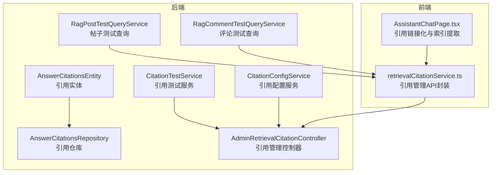
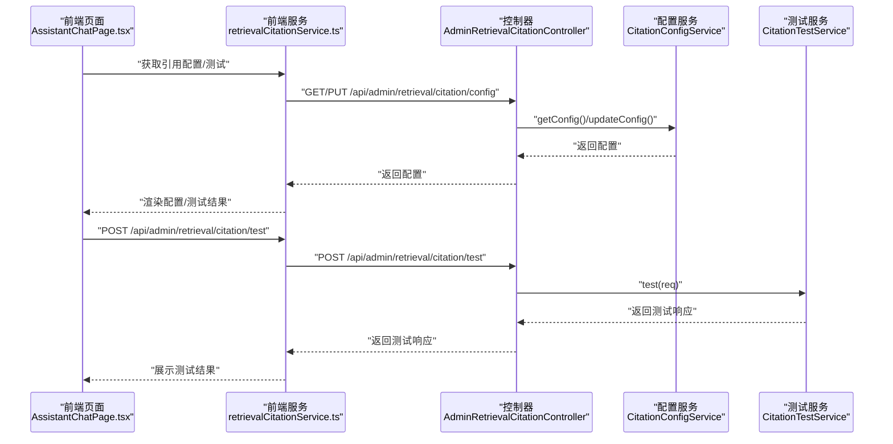
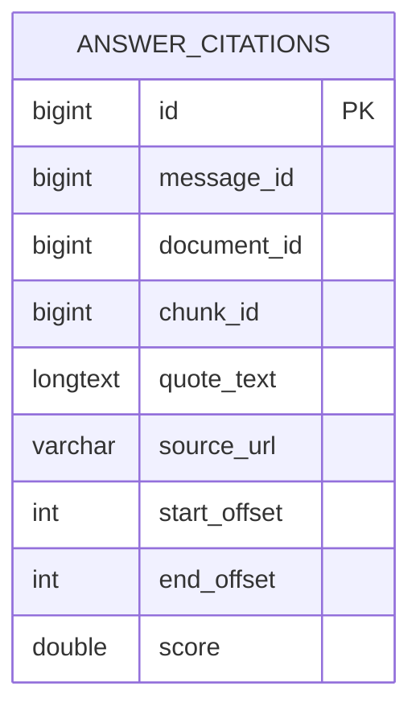
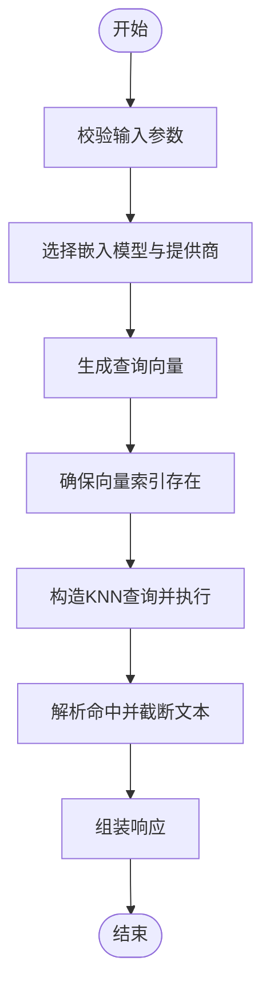
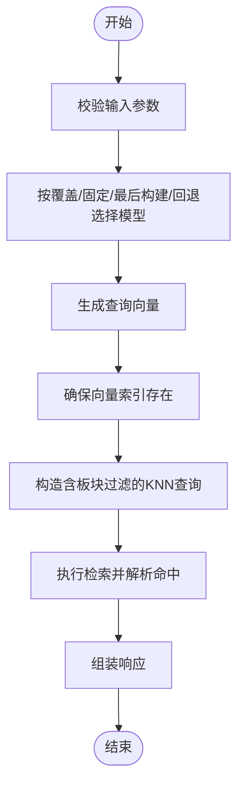
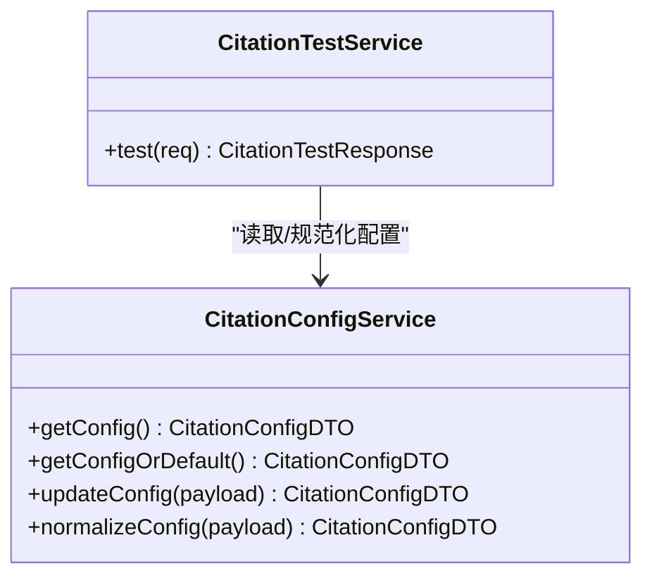
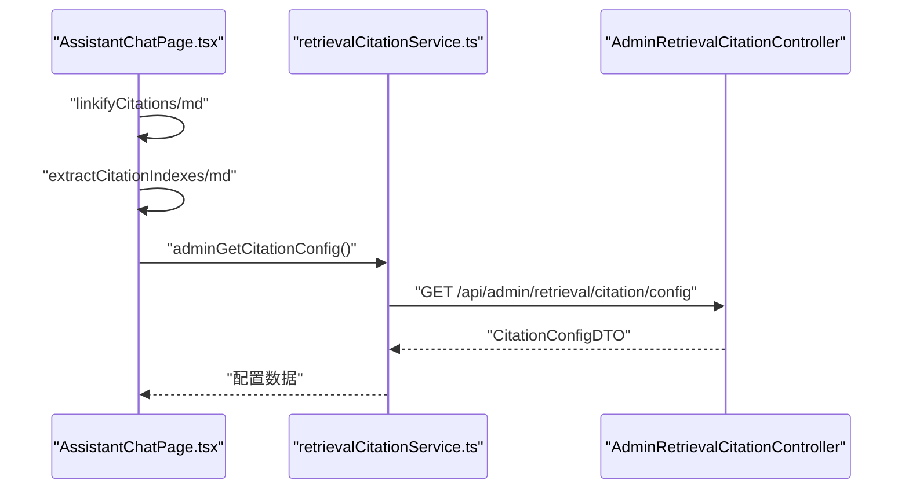
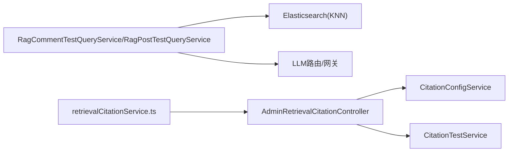
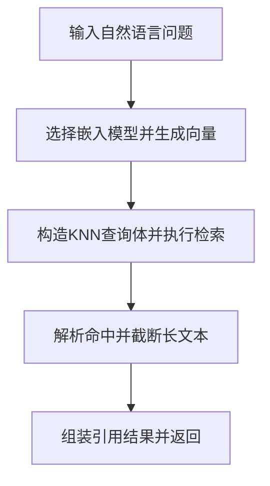

# 引用管理

<cite>
**本文档引用的文件**
- [AnswerCitationsEntity.java](file://src/main/java/com/example/EnterpriseRagCommunity/entity/rag/AnswerCitationsEntity.java)
- [AnswerCitationsRepository.java](file://src/main/java/com/example/EnterpriseRagCommunity/repository/rag/AnswerCitationsRepository.java)
- [AnswerCitationsCreateDTO.java](file://src/main/java/com/example/EnterpriseRagCommunity/dto/rag/AnswerCitationsCreateDTO.java)
- [AnswerCitationsQueryDTO.java](file://src/main/java/com/example/EnterpriseRagCommunity/dto/rag/AnswerCitationsQueryDTO.java)
- [AnswerCitationsUpdateDTO.java](file://src/main/java/com/example/EnterpriseRagCommunity/dto/rag/AnswerCitationsUpdateDTO.java)
- [RagCommentTestQueryService.java](file://src/main/java/com/example/EnterpriseRagCommunity/service/retrieval/RagCommentTestQueryService.java)
- [RagPostTestQueryService.java](file://src/main/java/com/example/EnterpriseRagCommunity/service/retrieval/RagPostTestQueryService.java)
- [AdminRetrievalCitationController.java](file://src/main/java/com/example/EnterpriseRagCommunity/controller/retrieval/admin/AdminRetrievalCitationController.java)
- [CitationConfigService.java](file://src/main/java/com/example/EnterpriseRagCommunity/service/retrieval/admin/CitationConfigService.java)
- [CitationTestService.java](file://src/main/java/com/example/EnterpriseRagCommunity/service/retrieval/admin/CitationTestService.java)
- [CitationConfigDTO.java](file://src/main/java/com/example/EnterpriseRagCommunity/dto/retrieval/CitationConfigDTO.java)
- [CitationTestRequest.java](file://src/main/java/com/example/EnterpriseRagCommunity/dto/retrieval/CitationTestRequest.java)
- [CitationTestResponse.java](file://src/main/java/com/example/EnterpriseRagCommunity/dto/retrieval/CitationTestResponse.java)
- [RagCommentsTestQueryRequest.java](file://src/main/java/com/example/EnterpriseRagCommunity/dto/retrieval/RagCommentsTestQueryRequest.java)
- [RagCommentsTestQueryResponse.java](file://src/main/java/com/example/EnterpriseRagCommunity/dto/retrieval/RagCommentsTestQueryResponse.java)
- [RagPostsTestQueryRequest.java](file://src/main/java/com/example/EnterpriseRagCommunity/dto/retrieval/RagPostsTestQueryRequest.java)
- [RagPostsTestQueryResponse.java](file://src/main/java/com/example/EnterpriseRagCommunity/dto/retrieval/RagPostsTestQueryResponse.java)
- [retrievalCitationService.ts](file://my-vite-app/src/services/retrievalCitationService.ts)
- [retrievalCitationService.test.ts](file://my-vite-app/src/services/retrievalCitationService.test.ts)
- [AssistantChatPage.tsx](file://my-vite-app/src/pages/portal/assistant/pages/AssistantChatPage.tsx)
</cite>

## 目录
1. [引言](#引言)
2. [项目结构](#项目结构)
3. [核心组件](#核心组件)
4. [架构总览](#架构总览)
5. [详细组件分析](#详细组件分析)
6. [依赖关系分析](#依赖关系分析)
7. [性能考量](#性能考量)
8. [故障排查指南](#故障排查指南)
9. [结论](#结论)
10. [附录](#附录)

## 引言
本文件面向引用管理系统，系统性阐述引用生成、验证与展示的实现机制；详解 AnswerCitationsEntity 数据模型设计及其在证据链管理中的作用；解析 RagCommentTestQueryService、RagPostTestQueryService 等服务的引用生成逻辑（内容定位、片段提取、上下文关联等）；给出引用管理 API 接口规范与前端调用方式；并总结质量控制机制（重复检测、完整性验证、时效性检查等）。

## 项目结构
引用管理涉及后端 Java 服务层与前端 TypeScript 服务层协同工作：
- 后端：实体与仓库负责引用持久化；服务层负责检索与测试查询；控制器提供管理接口；配置与测试服务负责引用策略与预览。
- 前端：TS 服务封装管理接口；React 页面负责引用链接化与索引提取。

图表来源
- [AnswerCitationsEntity.java:1-42](file://src/main/java/com/example/EnterpriseRagCommunity/entity/rag/AnswerCitationsEntity.java#L1-L42)
- [AnswerCitationsRepository.java:1-15](file://src/main/java/com/example/EnterpriseRagCommunity/repository/rag/AnswerCitationsRepository.java#L1-L15)
- [RagCommentTestQueryService.java:1-225](file://src/main/java/com/example/EnterpriseRagCommunity/service/retrieval/RagCommentTestQueryService.java#L1-L225)
- [RagPostTestQueryService.java:1-238](file://src/main/java/com/example/EnterpriseRagCommunity/service/retrieval/RagPostTestQueryService.java#L1-L238)
- [CitationConfigService.java:1-52](file://src/main/java/com/example/EnterpriseRagCommunity/service/retrieval/admin/CitationConfigService.java#L1-L52)
- [CitationTestService.java:1-30](file://src/main/java/com/example/EnterpriseRagCommunity/service/retrieval/admin/CitationTestService.java#L1-L30)
- [AdminRetrievalCitationController.java:1-46](file://src/main/java/com/example/EnterpriseRagCommunity/controller/retrieval/admin/AdminRetrievalCitationController.java#L1-L46)
- [retrievalCitationService.ts:78-108](file://my-vite-app/src/services/retrievalCitationService.ts#L78-L108)
- [AssistantChatPage.tsx:150-191](file://my-vite-app/src/pages/portal/assistant/pages/AssistantChatPage.tsx#L150-L191)

章节来源
- [AnswerCitationsEntity.java:1-42](file://src/main/java/com/example/EnterpriseRagCommunity/entity/rag/AnswerCitationsEntity.java#L1-L42)
- [AnswerCitationsRepository.java:1-15](file://src/main/java/com/example/EnterpriseRagCommunity/repository/rag/AnswerCitationsRepository.java#L1-L15)
- [RagCommentTestQueryService.java:1-225](file://src/main/java/com/example/EnterpriseRagCommunity/service/retrieval/RagCommentTestQueryService.java#L1-L225)
- [RagPostTestQueryService.java:1-238](file://src/main/java/com/example/EnterpriseRagCommunity/service/retrieval/RagPostTestQueryService.java#L1-L238)
- [CitationConfigService.java:1-52](file://src/main/java/com/example/EnterpriseRagCommunity/service/retrieval/admin/CitationConfigService.java#L1-L52)
- [CitationTestService.java:1-30](file://src/main/java/com/example/EnterpriseRagCommunity/service/retrieval/admin/CitationTestService.java#L1-L30)
- [AdminRetrievalCitationController.java:1-46](file://src/main/java/com/example/EnterpriseRagCommunity/controller/retrieval/admin/AdminRetrievalCitationController.java#L1-L46)
- [retrievalCitationService.ts:78-108](file://my-vite-app/src/services/retrievalCitationService.ts#L78-L108)
- [AssistantChatPage.tsx:150-191](file://my-vite-app/src/pages/portal/assistant/pages/AssistantChatPage.tsx#L150-L191)

## 核心组件
- 数据模型 AnswerCitationsEntity：承载引用来源追踪、证据链定位与可信度评分等关键字段，支撑引用的持久化与查询。
- 服务层：
  - 测试查询服务：RagCommentTestQueryService、RagPostTestQueryService，负责将自然语言查询转换为嵌入向量，执行 KNN 检索并返回命中结果。
  - 引用配置与测试服务：CitationConfigService、CitationTestService，负责引用策略的存储、规范化与测试预览。
- 控制器：AdminRetrievalCitationController 提供引用配置查询、更新与测试接口。
- 前端服务：retrievalCitationService.ts 封装管理接口；AssistantChatPage.tsx 实现引用标记的链接化与索引提取。

章节来源
- [AnswerCitationsEntity.java:1-42](file://src/main/java/com/example/EnterpriseRagCommunity/entity/rag/AnswerCitationsEntity.java#L1-L42)
- [RagCommentTestQueryService.java:1-225](file://src/main/java/com/example/EnterpriseRagCommunity/service/retrieval/RagCommentTestQueryService.java#L1-L225)
- [RagPostTestQueryService.java:1-238](file://src/main/java/com/example/EnterpriseRagCommunity/service/retrieval/RagPostTestQueryService.java#L1-L238)
- [CitationConfigService.java:1-52](file://src/main/java/com/example/EnterpriseRagCommunity/service/retrieval/admin/CitationConfigService.java#L1-L52)
- [CitationTestService.java:1-30](file://src/main/java/com/example/EnterpriseRagCommunity/service/retrieval/admin/CitationTestService.java#L1-L30)
- [AdminRetrievalCitationController.java:1-46](file://src/main/java/com/example/EnterpriseRagCommunity/controller/retrieval/admin/AdminRetrievalCitationController.java#L1-L46)
- [retrievalCitationService.ts:78-108](file://my-vite-app/src/services/retrievalCitationService.ts#L78-L108)
- [AssistantChatPage.tsx:150-191](file://my-vite-app/src/pages/portal/assistant/pages/AssistantChatPage.tsx#L150-L191)

## 架构总览
引用管理采用“配置驱动 + 检索增强 + 可视化”的整体架构：
- 配置层：通过 CitationConfigService 读写引用策略 JSON，并进行规范化处理。
- 检索层：基于向量索引（Elasticsearch/KNN）进行语义检索，返回候选片段与上下文。
- 展示层：前端将引用标记转换为可点击锚点，同时提取引用索引集合用于交互。

图表来源
- [AdminRetrievalCitationController.java:27-43](file://src/main/java/com/example/EnterpriseRagCommunity/controller/retrieval/admin/AdminRetrievalCitationController.java#L27-L43)
- [CitationConfigService.java:19-47](file://src/main/java/com/example/EnterpriseRagCommunity/service/retrieval/admin/CitationConfigService.java#L19-L47)
- [CitationTestService.java:19-30](file://src/main/java/com/example/EnterpriseRagCommunity/service/retrieval/admin/CitationTestService.java#L19-L30)
- [retrievalCitationService.ts:78-108](file://my-vite-app/src/services/retrievalCitationService.ts#L78-L108)
- [AssistantChatPage.tsx:150-191](file://my-vite-app/src/pages/portal/assistant/pages/AssistantChatPage.tsx#L150-L191)

## 详细组件分析

### 数据模型：AnswerCitationsEntity
- 设计目标：以最小必要字段刻画“引用来源追踪、证据链定位、可信度评分”。
- 关键字段：
  - messageId：答案消息 ID，用于按会话聚合引用。
  - documentId/chunkId：文档与分片标识，支撑证据链定位。
  - quoteText：引用片段文本，便于展示与审计。
  - sourceUrl：来源 URL，便于溯源与跳转。
  - startOffset/endOffset：片段在原文中的偏移，支持精确定位。
  - score：相关性得分，用于可信度排序与筛选。
- 查询能力：通过 AnswerCitationsRepository.findByMessageId 支持按消息 ID 批量查询引用。

图表来源
- [AnswerCitationsEntity.java:11-41](file://src/main/java/com/example/EnterpriseRagCommunity/entity/rag/AnswerCitationsEntity.java#L11-L41)
- [AnswerCitationsRepository.java:12-13](file://src/main/java/com/example/EnterpriseRagCommunity/repository/rag/AnswerCitationsRepository.java#L12-L13)

章节来源
- [AnswerCitationsEntity.java:1-42](file://src/main/java/com/example/EnterpriseRagCommunity/entity/rag/AnswerCitationsEntity.java#L1-L42)
- [AnswerCitationsRepository.java:1-15](file://src/main/java/com/example/EnterpriseRagCommunity/repository/rag/AnswerCitationsRepository.java#L1-L15)

### 服务组件：RagCommentTestQueryService（评论测试查询）
- 输入参数校验：要求 vectorIndexId、queryText 存在且非空白；topK、numCandidates 进行边界约束。
- 嵌入模型选择：优先使用请求覆盖模型，其次使用索引元数据固定模型，再回退到最后构建时的模型，最终回退到传统配置。
- 向量维度处理：若索引未配置维度，则根据嵌入向量推断并回写索引。
- 检索执行：构造 KNN 查询体，调用 Elasticsearch 执行检索，解析命中并截断长文本。
- 输出结构：包含索引名、topK、嵌入维度、模型、候选数、耗时与命中列表。

图表来源
- [RagCommentTestQueryService.java:40-162](file://src/main/java/com/example/EnterpriseRagCommunity/service/retrieval/RagCommentTestQueryService.java#L40-L162)

章节来源
- [RagCommentTestQueryService.java:1-225](file://src/main/java/com/example/EnterpriseRagCommunity/service/retrieval/RagCommentTestQueryService.java#L1-L225)

### 服务组件：RagPostTestQueryService（帖子测试查询）
- 输入参数校验与参数范围约束同上。
- 模型选择策略：支持显式覆盖提供商+模型；若仅覆盖提供商则按提供商路由；否则按全局路由选择。
- 板块过滤：在查询体中加入 board_id 的 term 过滤，限定检索范围。
- 输出结构：包含索引名、topK、板区 ID、嵌入维度、模型/提供商、候选数、耗时与命中列表。

图表来源
- [RagPostTestQueryService.java:40-170](file://src/main/java/com/example/EnterpriseRagCommunity/service/retrieval/RagPostTestQueryService.java#L40-L170)

章节来源
- [RagPostTestQueryService.java:1-238](file://src/main/java/com/example/EnterpriseRagCommunity/service/retrieval/RagPostTestQueryService.java#L1-L238)

### 引用配置与测试服务
- CitationConfigService：从应用设置中读取/写入引用配置 JSON，进行规范化与默认值处理。
- CitationTestService：根据请求决定使用已保存配置或临时配置，生成指令模板预览与来源预览。

图表来源
- [CitationConfigService.java:19-52](file://src/main/java/com/example/EnterpriseRagCommunity/service/retrieval/admin/CitationConfigService.java#L19-L52)
- [CitationTestService.java:19-30](file://src/main/java/com/example/EnterpriseRagCommunity/service/retrieval/admin/CitationTestService.java#L19-L30)

章节来源
- [CitationConfigService.java:1-52](file://src/main/java/com/example/EnterpriseRagCommunity/service/retrieval/admin/CitationConfigService.java#L1-L52)
- [CitationTestService.java:1-30](file://src/main/java/com/example/EnterpriseRagCommunity/service/retrieval/admin/CitationTestService.java#L1-L30)

### 引用管理 API 规范
- 获取配置
  - 方法：GET
  - 路径：/api/admin/retrieval/citation/config
  - 权限：admin_retrieval_citation, access
  - 返回：CitationConfigDTO
- 更新配置
  - 方法：PUT
  - 路径：/api/admin/retrieval/citation/config
  - 权限：admin_retrieval_citation, write
  - 请求体：CitationConfigDTO
  - 返回：CitationConfigDTO
- 测试配置
  - 方法：POST
  - 路径：/api/admin/retrieval/citation/test
  - 权限：admin_retrieval_citation, write
  - 请求体：CitationTestRequest
  - 返回：CitationTestResponse

章节来源
- [AdminRetrievalCitationController.java:27-43](file://src/main/java/com/example/EnterpriseRagCommunity/controller/retrieval/admin/AdminRetrievalCitationController.java#L27-L43)
- [CitationConfigDTO.java](file://src/main/java/com/example/EnterpriseRagCommunity/dto/retrieval/CitationConfigDTO.java)
- [CitationTestRequest.java](file://src/main/java/com/example/EnterpriseRagCommunity/dto/retrieval/CitationTestRequest.java)
- [CitationTestResponse.java](file://src/main/java/com/example/EnterpriseRagCommunity/dto/retrieval/CitationTestResponse.java)

### 前端引用展示与测试
- 引用链接化：AssistantChatPage.tsx 中的 linkifyCitations 将 Markdown 中的引用标记转换为可点击锚点；extractCitationIndexes 提取引用索引集合。
- 管理接口封装：retrievalCitationService.ts 提供获取配置、更新配置、测试配置的封装方法，统一处理 CSRF 与错误处理。

图表来源
- [AssistantChatPage.tsx:150-191](file://my-vite-app/src/pages/portal/assistant/pages/AssistantChatPage.tsx#L150-L191)
- [retrievalCitationService.ts:78-108](file://my-vite-app/src/services/retrievalCitationService.ts#L78-L108)
- [AdminRetrievalCitationController.java:27-31](file://src/main/java/com/example/EnterpriseRagCommunity/controller/retrieval/admin/AdminRetrievalCitationController.java#L27-L31)

章节来源
- [AssistantChatPage.tsx:150-191](file://my-vite-app/src/pages/portal/assistant/pages/AssistantChatPage.tsx#L150-L191)
- [retrievalCitationService.ts:78-108](file://my-vite-app/src/services/retrievalCitationService.ts#L78-L108)
- [AdminRetrievalCitationController.java:1-46](file://src/main/java/com/example/EnterpriseRagCommunity/controller/retrieval/admin/AdminRetrievalCitationController.java#L1-L46)

## 依赖关系分析
- 组件耦合：
  - 服务层对向量索引元数据、嵌入路由、系统配置有强依赖，保证检索的正确性与可扩展性。
  - 控制器仅暴露管理接口，职责清晰，便于权限控制与安全加固。
- 外部依赖：
  - Elasticsearch：作为 KNN 检索后端，提供高效相似度检索。
  - LLM 路由与网关：负责嵌入模型选择与向量生成。
- 潜在风险：
  - 模型维度不一致会导致检索异常，需在服务层严格校验与提示。
  - 前端引用链接化依赖 Markdown 结构，需保持前后端一致的标记约定。

图表来源
- [RagCommentTestQueryService.java:85-119](file://src/main/java/com/example/EnterpriseRagCommunity/service/retrieval/RagCommentTestQueryService.java#L85-L119)
- [RagPostTestQueryService.java:90-131](file://src/main/java/com/example/EnterpriseRagCommunity/service/retrieval/RagPostTestQueryService.java#L90-L131)
- [AdminRetrievalCitationController.java:24-43](file://src/main/java/com/example/EnterpriseRagCommunity/controller/retrieval/admin/AdminRetrievalCitationController.java#L24-L43)
- [CitationConfigService.java:19-47](file://src/main/java/com/example/EnterpriseRagCommunity/service/retrieval/admin/CitationConfigService.java#L19-L47)
- [CitationTestService.java:19-30](file://src/main/java/com/example/EnterpriseRagCommunity/service/retrieval/admin/CitationTestService.java#L19-L30)
- [retrievalCitationService.ts:78-108](file://my-vite-app/src/services/retrievalCitationService.ts#L78-L108)

章节来源
- [RagCommentTestQueryService.java:1-225](file://src/main/java/com/example/EnterpriseRagCommunity/service/retrieval/RagCommentTestQueryService.java#L1-L225)
- [RagPostTestQueryService.java:1-238](file://src/main/java/com/example/EnterpriseRagCommunity/service/retrieval/RagPostTestQueryService.java#L1-L238)
- [AdminRetrievalCitationController.java:1-46](file://src/main/java/com/example/EnterpriseRagCommunity/controller/retrieval/admin/AdminRetrievalCitationController.java#L1-L46)
- [CitationConfigService.java:1-52](file://src/main/java/com/example/EnterpriseRagCommunity/service/retrieval/admin/CitationConfigService.java#L1-L52)
- [CitationTestService.java:1-30](file://src/main/java/com/example/EnterpriseRagCommunity/service/retrieval/admin/CitationTestService.java#L1-L30)
- [retrievalCitationService.ts:78-108](file://my-vite-app/src/services/retrievalCitationService.ts#L78-L108)

## 性能考量
- 检索参数调优：
  - topK 与 numCandidates 的合理配比可平衡召回与性能；建议结合业务阈值动态调整。
  - 板块过滤（帖子检索）可显著缩小搜索空间，提升响应速度。
- 向量维度一致性：
  - 服务层在首次构建索引时推断维度并回写，避免后续检索因维度不一致导致失败。
- 嵌入模型选择：
  - 优先使用与索引构建一致的模型，减少跨模型差异带来的检索偏差。
- 前端优化：
  - 对长文本进行截断展示，降低渲染压力；引用索引提取仅在需要时进行。

## 故障排查指南
- 常见异常与定位：
  - “向量为空”：检查嵌入服务可用性与模型选择逻辑。
  - “索引维度不匹配”：确认索引元数据与实际嵌入维度一致，必要时重建索引。
  - “ES 搜索失败”：检查 ES 地址、认证头与网络连通性。
  - “无可用嵌入目标”：检查 LLM 路由配置与提供商状态。
- 建议排查步骤：
  1) 核对输入参数（queryText、topK、numCandidates、vectorIndexId）。
  2) 查看服务日志中的“Ensure ES index failed/Embedding failed/ES error HTTP”等关键错误。
  3) 使用测试接口验证配置与指令模板是否符合预期。
  4) 在前端页面中确认引用标记格式与链接化逻辑是否生效。

章节来源
- [RagCommentTestQueryService.java:102-119](file://src/main/java/com/example/EnterpriseRagCommunity/service/retrieval/RagCommentTestQueryService.java#L102-L119)
- [RagPostTestQueryService.java:110-131](file://src/main/java/com/example/EnterpriseRagCommunity/service/retrieval/RagPostTestQueryService.java#L110-L131)
- [AdminRetrievalCitationController.java:27-43](file://src/main/java/com/example/EnterpriseRagCommunity/controller/retrieval/admin/AdminRetrievalCitationController.java#L27-L43)
- [retrievalCitationService.ts:78-108](file://my-vite-app/src/services/retrievalCitationService.ts#L78-L108)

## 结论
引用管理系统通过“配置驱动 + 向量检索 + 前端链接化”的组合，实现了从策略配置到检索展示的完整闭环。AnswerCitationsEntity 以简洁字段支撑证据链与可信度管理；RagCommentTestQueryService 与 RagPostTestQueryService 提供了稳健的内容定位与上下文关联能力；AdminRetrievalCitationController 则提供了可操作的配置与测试接口。配合前端的引用链接化工具，系统在可用性与可维护性方面具备良好基础。

## 附录
- 引用生成流程（概念示意）
