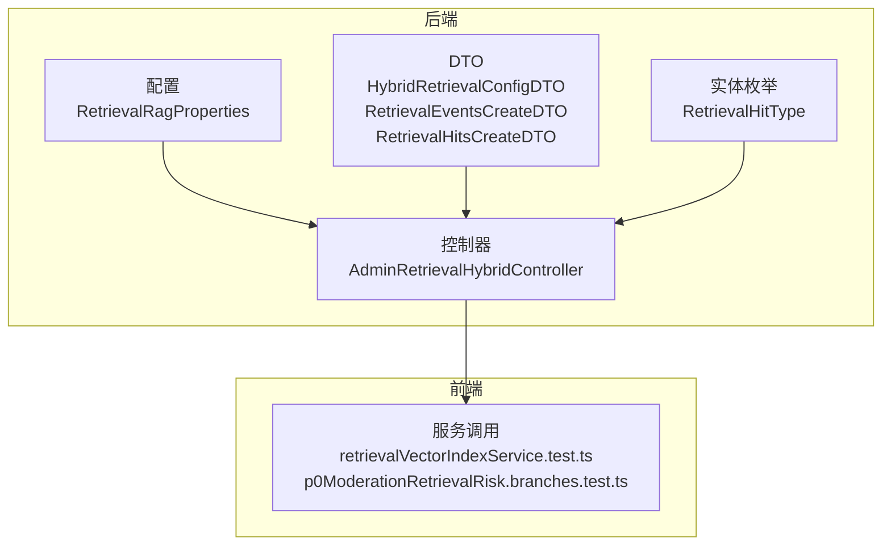
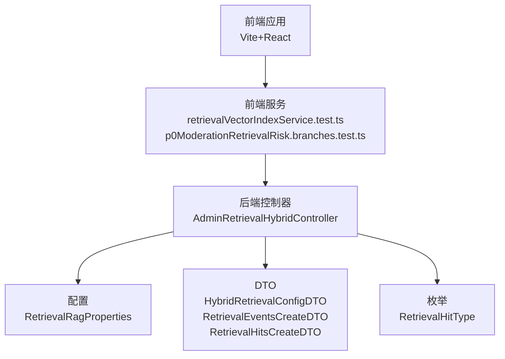
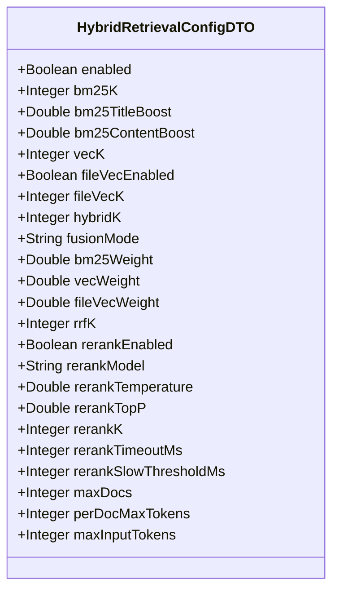
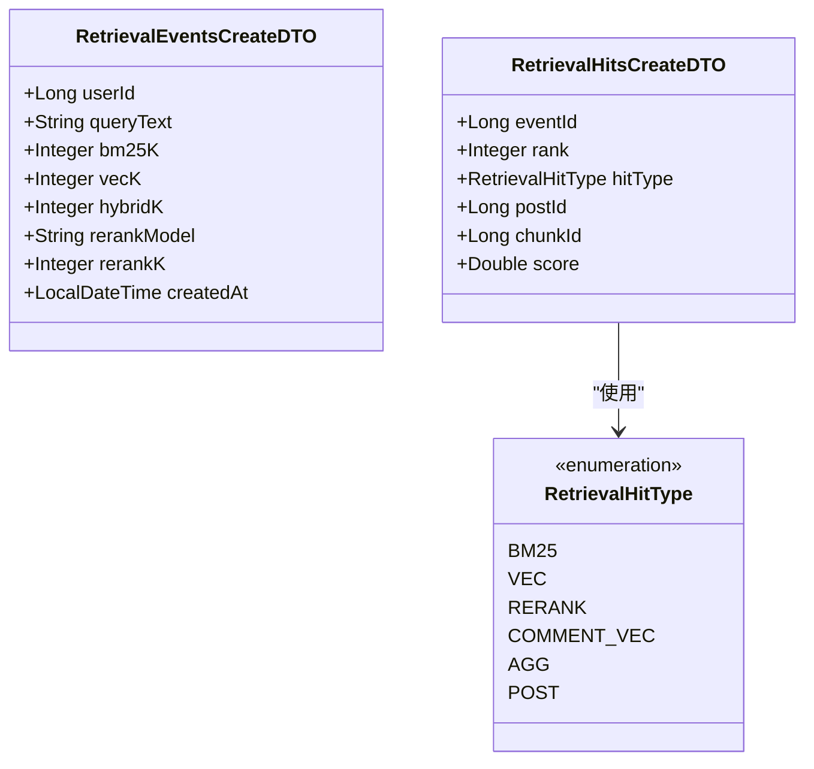
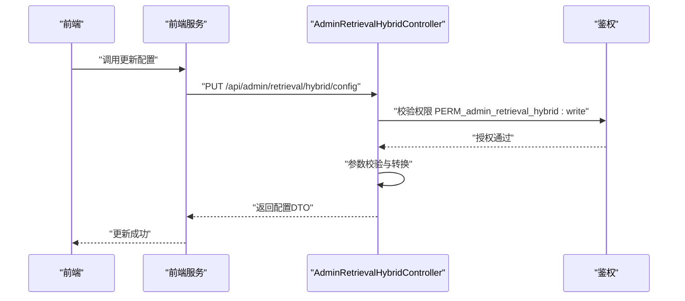
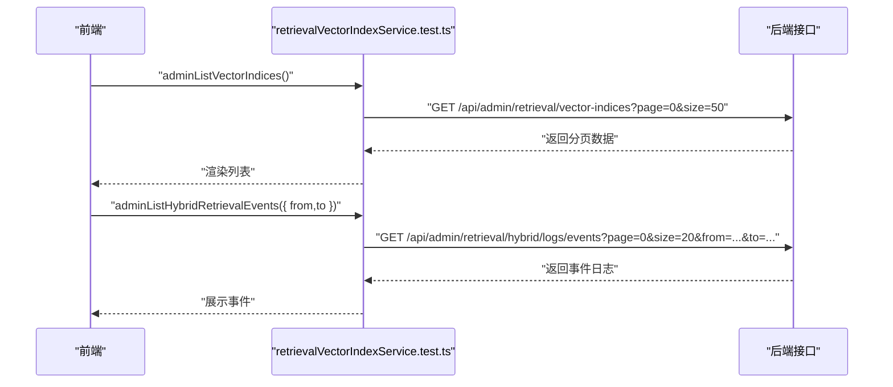
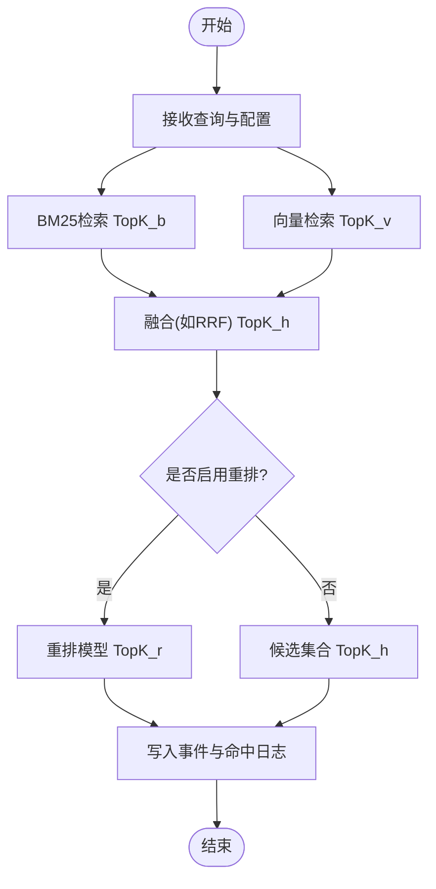
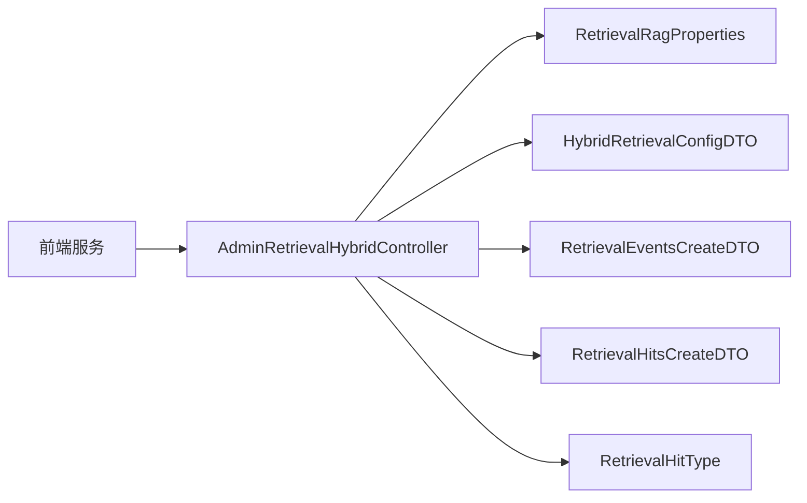

# 检索增强

<cite>
**本文档引用的文件**
- [RetrievalRagProperties.java](file://src/main/java/com/example/EnterpriseRagCommunity/config/RetrievalRagProperties.java)
- [HybridRetrievalConfigDTO.java](file://src/main/java/com/example/EnterpriseRagCommunity/dto/retrieval/HybridRetrievalConfigDTO.java)
- [RetrievalHitType.java](file://src/main/java/com/example/EnterpriseRagCommunity/entity/semantic/enums/RetrievalHitType.java)
- [RetrievalHitsCreateDTO.java](file://src/main/java/com/example/EnterpriseRagCommunity/dto/semantic/RetrievalHitsCreateDTO.java)
- [RetrievalEventsCreateDTO.java](file://src/main/java/com/example/EnterpriseRagCommunity/dto/semantic/RetrievalEventsCreateDTO.java)
- [AdminRetrievalHybridController.java](file://src/main/java/com/example/EnterpriseRagCommunity/controller/retrieval/admin/AdminRetrievalHybridController.java)
- [retrievalVectorIndexService.test.ts](file://my-vite-app/src/services/retrievalVectorIndexService.test.ts)
- [p0ModerationRetrievalRisk.branches.test.ts](file://my-vite-app/src/services/p0ModerationRetrievalRisk.branches.test.ts)
</cite>

## 目录
1. [简介](#简介)
2. [项目结构](#项目结构)
3. [核心组件](#核心组件)
4. [架构总览](#架构总览)
5. [详细组件分析](#详细组件分析)
6. [依赖分析](#依赖分析)
7. [性能考虑](#性能考虑)
8. [故障排查指南](#故障排查指南)
9. [结论](#结论)
10. [附录](#附录)

## 简介
本文件面向“检索增强”（RAG）系统，聚焦以下能力：RAG问答、向量检索、混合检索、引用生成、上下文聚合。文档覆盖检索配置、索引构建、相似度计算、重排序算法等技术实现；解释RAG实体模型、问答会话、消息历史、引用来源等数据结构；给出检索相关API接口规范（问答查询、上下文检索、引用生成、索引管理）；并提供性能优化、缓存策略与监控指标的实现建议。

## 项目结构
本仓库采用典型的分层架构：后端以Spring Boot为核心，前端使用Vite+React。检索相关的配置、DTO、实体、控制器与前端服务模块分布在如下位置：
- 后端配置：config层下的检索RAG属性
- 后端DTO与实体：dto/semantic、dto/retrieval、entity/semantic
- 后端控制器：controller/retrieval/admin 下的混合检索、向量索引、引用、上下文等管理接口
- 前端服务：my-vite-app/src/services 下的检索相关服务调用与测试

图表来源
- [RetrievalRagProperties.java:1-22](file://src/main/java/com/example/EnterpriseRagCommunity/config/RetrievalRagProperties.java#L1-L22)
- [HybridRetrievalConfigDTO.java:1-36](file://src/main/java/com/example/EnterpriseRagCommunity/dto/retrieval/HybridRetrievalConfigDTO.java#L1-L36)
- [RetrievalHitType.java:1-11](file://src/main/java/com/example/EnterpriseRagCommunity/entity/semantic/enums/RetrievalHitType.java#L1-L11)
- [RetrievalEventsCreateDTO.java:1-41](file://src/main/java/com/example/EnterpriseRagCommunity/dto/semantic/RetrievalEventsCreateDTO.java#L1-L41)
- [RetrievalHitsCreateDTO.java:1-37](file://src/main/java/com/example/EnterpriseRagCommunity/dto/semantic/RetrievalHitsCreateDTO.java#L1-L37)
- [AdminRetrievalHybridController.java:1-20](file://src/main/java/com/example/EnterpriseRagCommunity/controller/retrieval/admin/AdminRetrievalHybridController.java#L1-L20)
- [retrievalVectorIndexService.test.ts:1-40](file://my-vite-app/src/services/retrievalVectorIndexService.test.ts#L1-L40)
- [p0ModerationRetrievalRisk.branches.test.ts:30-53](file://my-vite-app/src/services/p0ModerationRetrievalRisk.branches.test.ts#L30-L53)

章节来源
- [RetrievalRagProperties.java:1-22](file://src/main/java/com/example/EnterpriseRagCommunity/config/RetrievalRagProperties.java#L1-L22)
- [HybridRetrievalConfigDTO.java:1-36](file://src/main/java/com/example/EnterpriseRagCommunity/dto/retrieval/HybridRetrievalConfigDTO.java#L1-L36)
- [RetrievalHitType.java:1-11](file://src/main/java/com/example/EnterpriseRagCommunity/entity/semantic/enums/RetrievalHitType.java#L1-L11)
- [RetrievalEventsCreateDTO.java:1-41](file://src/main/java/com/example/EnterpriseRagCommunity/dto/semantic/RetrievalEventsCreateDTO.java#L1-L41)
- [RetrievalHitsCreateDTO.java:1-37](file://src/main/java/com/example/EnterpriseRagCommunity/dto/semantic/RetrievalHitsCreateDTO.java#L1-L37)
- [AdminRetrievalHybridController.java:1-20](file://src/main/java/com/example/EnterpriseRagCommunity/controller/retrieval/admin/AdminRetrievalHybridController.java#L1-L20)
- [retrievalVectorIndexService.test.ts:1-40](file://my-vite-app/src/services/retrievalVectorIndexService.test.ts#L1-L40)
- [p0ModerationRetrievalRisk.branches.test.ts:30-53](file://my-vite-app/src/services/p0ModerationRetrievalRisk.branches.test.ts#L30-L53)

## 核心组件
- 检索配置
  - ES索引与嵌入参数：索引名称、中文分词器开关、嵌入模型与维度
  - 混合检索参数：BM25权重、向量权重、文件向量权重、融合模式、RRF参数、重排开关与模型参数
- 实体与数据模型
  - 检索命中类型：BM25、VEC、RERANK、COMMENT_VEC、AGG、POST
  - 检索事件与命中：事件ID、排名、命中类型、帖子ID、分片ID、得分
- 控制器与API
  - 混合检索配置管理接口（更新配置）
  - 向量索引管理接口（分页列表）
  - 检索事件与上下文日志接口（分页列表）

章节来源
- [RetrievalRagProperties.java:10-21](file://src/main/java/com/example/EnterpriseRagCommunity/config/RetrievalRagProperties.java#L10-L21)
- [HybridRetrievalConfigDTO.java:6-35](file://src/main/java/com/example/EnterpriseRagCommunity/dto/retrieval/HybridRetrievalConfigDTO.java#L6-L35)
- [RetrievalHitType.java:3-10](file://src/main/java/com/example/EnterpriseRagCommunity/entity/semantic/enums/RetrievalHitType.java#L3-L10)
- [RetrievalEventsCreateDTO.java:12-38](file://src/main/java/com/example/EnterpriseRagCommunity/dto/semantic/RetrievalEventsCreateDTO.java#L12-L38)
- [RetrievalHitsCreateDTO.java:11-34](file://src/main/java/com/example/EnterpriseRagCommunity/dto/semantic/RetrievalHitsCreateDTO.java#L11-L34)

## 架构总览
下图展示RAG检索在系统中的位置与交互：前端通过服务调用后端控制器；控制器依赖配置与DTO/实体进行参数校验与业务处理；最终返回结果或写入语义日志。

图表来源
- [AdminRetrievalHybridController.java:1-20](file://src/main/java/com/example/EnterpriseRagCommunity/controller/retrieval/admin/AdminRetrievalHybridController.java#L1-L20)
- [RetrievalRagProperties.java:10-21](file://src/main/java/com/example/EnterpriseRagCommunity/config/RetrievalRagProperties.java#L10-L21)
- [HybridRetrievalConfigDTO.java:6-35](file://src/main/java/com/example/EnterpriseRagCommunity/dto/retrieval/HybridRetrievalConfigDTO.java#L6-L35)
- [RetrievalEventsCreateDTO.java:12-38](file://src/main/java/com/example/EnterpriseRagCommunity/dto/semantic/RetrievalEventsCreateDTO.java#L12-L38)
- [RetrievalHitsCreateDTO.java:11-34](file://src/main/java/com/example/EnterpriseRagCommunity/dto/semantic/RetrievalHitsCreateDTO.java#L11-L34)
- [RetrievalHitType.java:3-10](file://src/main/java/com/example/EnterpriseRagCommunity/entity/semantic/enums/RetrievalHitType.java#L3-L10)
- [retrievalVectorIndexService.test.ts:30-40](file://my-vite-app/src/services/retrievalVectorIndexService.test.ts#L30-L40)
- [p0ModerationRetrievalRisk.branches.test.ts:30-53](file://my-vite-app/src/services/p0ModerationRetrievalRisk.branches.test.ts#L30-L53)

## 详细组件分析

### 组件A：混合检索配置与重排序
- 功能要点
  - 支持开启/关闭混合检索
  - BM25与向量检索的TopK、权重、温度、TopP、超时阈值等参数
  - 融合模式（如RRF）、重排模型与重排K
  - 文档级最大条数、每条文档最大Token、输入Token上限
- 参数校验与默认值
  - DTO中对数值字段设置最小值与范围约束
  - 未显式设置时采用默认值（由后端服务处理）
- 重排序算法
  - 可配置重排模型、温度、TopP、超时阈值与慢查询阈值
  - 重排输出TopK控制最终候选数量

图表来源
- [HybridRetrievalConfigDTO.java:6-35](file://src/main/java/com/example/EnterpriseRagCommunity/dto/retrieval/HybridRetrievalConfigDTO.java#L6-L35)

章节来源
- [HybridRetrievalConfigDTO.java:6-35](file://src/main/java/com/example/EnterpriseRagCommunity/dto/retrieval/HybridRetrievalConfigDTO.java#L6-L35)

### 组件B：检索事件与命中
- 检索事件
  - 记录查询文本、用户ID、各阶段TopK（BM25、向量、融合、重排）
  - 创建时间由数据库默认填充
- 检索命中
  - 每个命中的排名、类型（BM25/VEC/RERANK/COMMENT_VEC/AGG/POST）、得分
  - 关联帖子ID与分片ID，便于溯源与引用生成

图表来源
- [RetrievalEventsCreateDTO.java:12-38](file://src/main/java/com/example/EnterpriseRagCommunity/dto/semantic/RetrievalEventsCreateDTO.java#L12-L38)
- [RetrievalHitsCreateDTO.java:11-34](file://src/main/java/com/example/EnterpriseRagCommunity/dto/semantic/RetrievalHitsCreateDTO.java#L11-L34)
- [RetrievalHitType.java:3-10](file://src/main/java/com/example/EnterpriseRagCommunity/entity/semantic/enums/RetrievalHitType.java#L3-L10)

章节来源
- [RetrievalEventsCreateDTO.java:12-38](file://src/main/java/com/example/EnterpriseRagCommunity/dto/semantic/RetrievalEventsCreateDTO.java#L12-L38)
- [RetrievalHitsCreateDTO.java:11-34](file://src/main/java/com/example/EnterpriseRagCommunity/dto/semantic/RetrievalHitsCreateDTO.java#L11-L34)
- [RetrievalHitType.java:3-10](file://src/main/java/com/example/EnterpriseRagCommunity/entity/semantic/enums/RetrievalHitType.java#L3-L10)

### 组件C：混合检索控制器（序列流程）
- 更新混合检索配置
  - 接口路径：PUT /api/admin/retrieval/hybrid/config
  - 权限：需要 PERM_admin_retrieval_hybrid:write
  - 行为：接收配置DTO，校验参数，调用服务层更新，返回最新配置
- 异常处理：非法参数返回400及错误信息

图表来源
- [AdminRetrievalHybridController.java:13-20](file://src/main/java/com/example/EnterpriseRagCommunity/controller/retrieval/admin/AdminRetrievalHybridController.java#L13-L20)

章节来源
- [AdminRetrievalHybridController.java:13-20](file://src/main/java/com/example/EnterpriseRagCommunity/controller/retrieval/admin/AdminRetrievalHybridController.java#L13-L20)

### 组件D：向量索引与日志（前端调用示例）
- 向量索引列表
  - 默认分页参数：page=0、size=50
  - 接口路径：/api/admin/retrieval/vector-indices
- 检索事件与上下文日志
  - 支持from/to时间范围查询
  - 默认分页参数：page=0、size=20

图表来源
- [retrievalVectorIndexService.test.ts:30-40](file://my-vite-app/src/services/retrievalVectorIndexService.test.ts#L30-L40)
- [p0ModerationRetrievalRisk.branches.test.ts:30-53](file://my-vite-app/src/services/p0ModerationRetrievalRisk.branches.test.ts#L30-L53)

章节来源
- [retrievalVectorIndexService.test.ts:30-40](file://my-vite-app/src/services/retrievalVectorIndexService.test.ts#L30-L40)
- [p0ModerationRetrievalRisk.branches.test.ts:30-53](file://my-vite-app/src/services/p0ModerationRetrievalRisk.branches.test.ts#L30-L53)

### 组件E：混合检索算法流程（概念性）
- 输入：查询文本、混合检索配置（TopK、权重、融合模式、重排参数）
- 步骤：
  1) BM25检索TopK_b
  2) 向量检索TopK_v
  3) 融合（如RRF），得到TopK_h
  4) 可选重排（模型推理），得到TopK_r
  5) 写入检索事件与命中日志
- 输出：候选上下文集合，用于后续问答生成与引用生成

## 依赖分析
- 组件耦合
  - 控制器依赖配置类与DTO/实体进行参数解析与校验
  - 前端服务通过HTTP请求与后端控制器交互，遵循REST风格
- 外部依赖
  - ES索引配置（索引名、中文分词、嵌入维度）影响向量检索与BM25效果
  - 重排模型参数影响最终候选质量与时延

图表来源
- [AdminRetrievalHybridController.java:13-20](file://src/main/java/com/example/EnterpriseRagCommunity/controller/retrieval/admin/AdminRetrievalHybridController.java#L13-L20)
- [RetrievalRagProperties.java:10-21](file://src/main/java/com/example/EnterpriseRagCommunity/config/RetrievalRagProperties.java#L10-L21)
- [HybridRetrievalConfigDTO.java:6-35](file://src/main/java/com/example/EnterpriseRagCommunity/dto/retrieval/HybridRetrievalConfigDTO.java#L6-L35)
- [RetrievalEventsCreateDTO.java:12-38](file://src/main/java/com/example/EnterpriseRagCommunity/dto/semantic/RetrievalEventsCreateDTO.java#L12-L38)
- [RetrievalHitsCreateDTO.java:11-34](file://src/main/java/com/example/EnterpriseRagCommunity/dto/semantic/RetrievalHitsCreateDTO.java#L11-L34)
- [RetrievalHitType.java:3-10](file://src/main/java/com/example/EnterpriseRagCommunity/entity/semantic/enums/RetrievalHitType.java#L3-L10)
- [retrievalVectorIndexService.test.ts:30-40](file://my-vite-app/src/services/retrievalVectorIndexService.test.ts#L30-L40)
- [p0ModerationRetrievalRisk.branches.test.ts:30-53](file://my-vite-app/src/services/p0ModerationRetrievalRisk.branches.test.ts#L30-L53)

章节来源
- [RetrievalRagProperties.java:10-21](file://src/main/java/com/example/EnterpriseRagCommunity/config/RetrievalRagProperties.java#L10-L21)
- [HybridRetrievalConfigDTO.java:6-35](file://src/main/java/com/example/EnterpriseRagCommunity/dto/retrieval/HybridRetrievalConfigDTO.java#L6-L35)
- [RetrievalEventsCreateDTO.java:12-38](file://src/main/java/com/example/EnterpriseRagCommunity/dto/semantic/RetrievalEventsCreateDTO.java#L12-L38)
- [RetrievalHitsCreateDTO.java:11-34](file://src/main/java/com/example/EnterpriseRagCommunity/dto/semantic/RetrievalHitsCreateDTO.java#L11-L34)
- [RetrievalHitType.java:3-10](file://src/main/java/com/example/EnterpriseRagCommunity/entity/semantic/enums/RetrievalHitType.java#L3-L10)
- [AdminRetrievalHybridController.java:13-20](file://src/main/java/com/example/EnterpriseRagCommunity/controller/retrieval/admin/AdminRetrievalHybridController.java#L13-L20)
- [retrievalVectorIndexService.test.ts:30-40](file://my-vite-app/src/services/retrievalVectorIndexService.test.ts#L30-L40)
- [p0ModerationRetrievalRisk.branches.test.ts:30-53](file://my-vite-app/src/services/p0ModerationRetrievalRisk.branches.test.ts#L30-L53)

## 性能考虑
- 检索性能
  - TopK裁剪：在BM25、向量、融合、重排阶段分别限制TopK，降低下游LLM输入规模
  - 融合模式：RRF等可提升多样性与稳定性
  - 重排超时与慢查询阈值：避免重排成为性能瓶颈
- 缓存策略
  - 查询热点候选可按用户/会话维度缓存，结合失效策略
  - ES查询结果可缓存（需考虑时效性与一致性）
- 监控指标
  - 检索延迟（BM25、向量、融合、重排各阶段）
  - 重排成功率与慢查询比例
  - 命中率与平均排名分布
  - 日志写入吞吐与延迟

## 故障排查指南
- 常见问题
  - 配置非法：更新混合检索配置返回400，检查字段范围与必填项
  - 权限不足：访问管理接口返回403，确认具备 PERM_admin_retrieval_hybrid:write
  - 分页参数异常：前端URL包含默认page/size与from/to，确保参数格式正确
- 排查步骤
  - 查看控制器日志与异常栈
  - 核对ES索引状态与映射
  - 检查重排模型可用性与超时设置
  - 对比事件与命中日志，定位具体阶段耗时

章节来源
- [AdminRetrievalHybridController.java:13-20](file://src/main/java/com/example/EnterpriseRagCommunity/controller/retrieval/admin/AdminRetrievalHybridController.java#L13-L20)
- [p0ModerationRetrievalRisk.branches.test.ts:30-53](file://my-vite-app/src/services/p0ModerationRetrievalRisk.branches.test.ts#L30-L53)

## 结论
本系统围绕“混合检索+重排”的核心链路，提供了完善的配置、日志与管理接口。通过TopK裁剪、融合与重排，兼顾召回质量与效率；通过事件与命中日志，支撑溯源与优化。建议在生产环境完善缓存与监控体系，持续迭代融合与重排策略以提升问答质量。

## 附录

### API接口规范（检索相关）
- 混合检索配置
  - 更新配置
    - 方法与路径：PUT /api/admin/retrieval/hybrid/config
    - 权限：PERM_admin_retrieval_hybrid:write
    - 请求体：HybridRetrievalConfigDTO
    - 响应：HybridRetrievalConfigDTO
- 向量索引管理
  - 列表
    - 方法与路径：GET /api/admin/retrieval/vector-indices
    - 查询参数：page（默认0）、size（默认50）
    - 响应：分页结果
- 检索事件与上下文日志
  - 事件列表
    - 方法与路径：GET /api/admin/retrieval/hybrid/logs/events
    - 查询参数：page（默认0）、size（默认20）、from、to
    - 响应：分页结果
  - 上下文窗口日志
    - 方法与路径：GET /api/admin/retrieval/context/logs/windows
    - 查询参数：page（默认0）、size（默认20）、from、to
    - 响应：分页结果

章节来源
- [AdminRetrievalHybridController.java:13-20](file://src/main/java/com/example/EnterpriseRagCommunity/controller/retrieval/admin/AdminRetrievalHybridController.java#L13-L20)
- [retrievalVectorIndexService.test.ts:30-40](file://my-vite-app/src/services/retrievalVectorIndexService.test.ts#L30-L40)
- [p0ModerationRetrievalRisk.branches.test.ts:30-53](file://my-vite-app/src/services/p0ModerationRetrievalRisk.branches.test.ts#L30-L53)