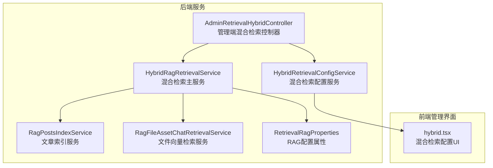
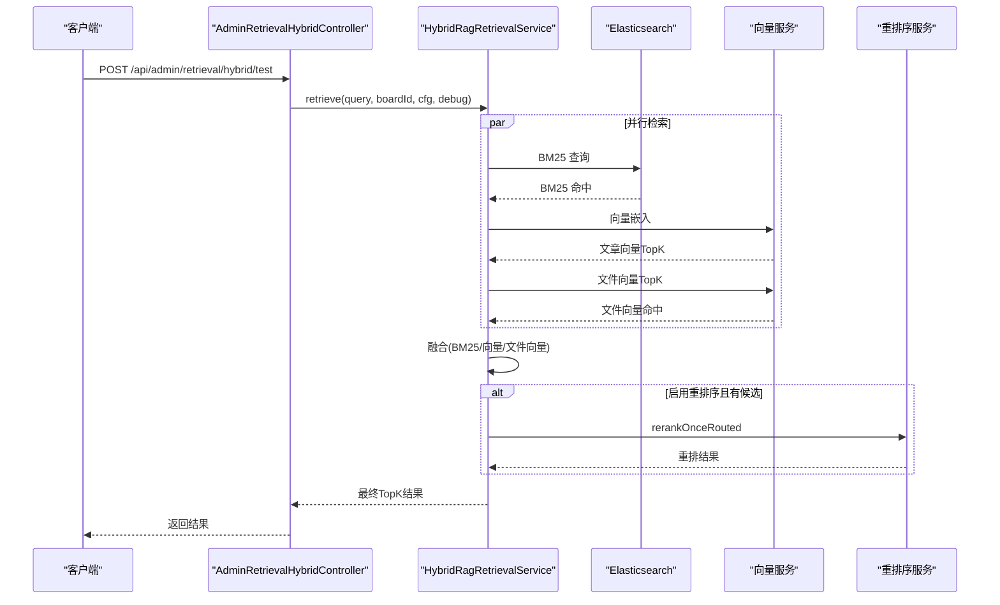
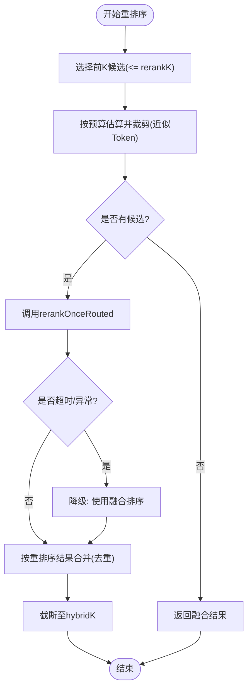
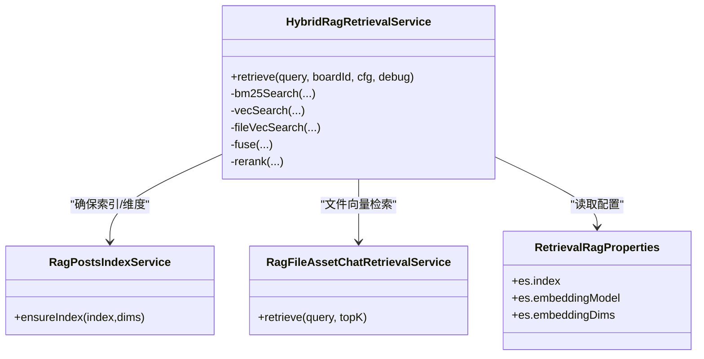

# 混合检索

<cite>
**本文引用的文件**
- [HybridRagRetrievalService.java](file://src/main/java/com/example/EnterpriseRagCommunity/service/retrieval/HybridRagRetrievalService.java)
- [HybridRetrievalConfigDTO.java](file://src/main/java/com/example/EnterpriseRagCommunity/dto/retrieval/HybridRetrievalConfigDTO.java)
- [HybridRetrievalConfigService.java](file://src/main/java/com/example/EnterpriseRagCommunity/service/retrieval/admin/HybridRetrievalConfigService.java)
- [AdminRetrievalHybridController.java](file://src/main/java/com/example/EnterpriseRagCommunity/controller/retrieval/admin/AdminRetrievalHybridController.java)
- [RetrievalRagProperties.java](file://src/main/java/com/example/EnterpriseRagCommunity/config/RetrievalRagProperties.java)
- [RagPostsIndexService.java](file://src/main/java/com/example/EnterpriseRagCommunity/service/retrieval/es/RagPostsIndexService.java)
- [RagFileAssetChatRetrievalService.java](file://src/main/java/com/example/EnterpriseRagCommunity/service/retrieval/RagFileAssetChatRetrievalService.java)
- [AiChatStreamRequest.java](file://src/main/java/com/example/EnterpriseRagCommunity/dto/ai/AiChatStreamRequest.java)
- [hybrid.tsx](file://my-vite-app/src/pages/admin/forms/retrieval/hybrid.tsx)
</cite>

## 目录
1. [引言](#引言)
2. [项目结构](#项目结构)
3. [核心组件](#核心组件)
4. [架构总览](#架构总览)
5. [详细组件分析](#详细组件分析)
6. [依赖关系分析](#依赖关系分析)
7. [性能考虑](#性能考虑)
8. [故障排查指南](#故障排查指南)
9. [结论](#结论)
10. [附录](#附录)

## 引言
本技术文档围绕混合检索系统展开，重点阐述“关键词检索（BM25）+ 向量检索（Dense Vector）+ 文件向量检索”的融合检索算法实现。文档覆盖以下内容：
- 核心算法：BM25 权重计算、向量相似度融合、重排序策略
- 配置参数：权重分配、阈值设置、重排序算法等
- API 接口规范：查询请求格式、多模态输入处理、结果合并策略
- 性能优化：并行处理、缓存策略、增量更新等

## 项目结构
混合检索模块位于后端 Java 服务与前端管理界面中，主要涉及检索服务、配置服务、控制器以及 ES 索引服务。

图表来源
- [HybridRagRetrievalService.java:44-86](file://src/main/java/com/example/EnterpriseRagCommunity/service/retrieval/HybridRagRetrievalService.java#L44-L86)
- [HybridRetrievalConfigService.java:12-21](file://src/main/java/com/example/EnterpriseRagCommunity/service/retrieval/admin/HybridRetrievalConfigService.java#L12-L21)
- [AdminRetrievalHybridController.java:39-49](file://src/main/java/com/example/EnterpriseRagCommunity/controller/retrieval/admin/AdminRetrievalHybridController.java#L39-L49)
- [RagPostsIndexService.java:22-33](file://src/main/java/com/example/EnterpriseRagCommunity/service/retrieval/es/RagPostsIndexService.java#L22-L33)
- [RagFileAssetChatRetrievalService.java:28-38](file://src/main/java/com/example/EnterpriseRagCommunity/service/retrieval/RagFileAssetChatRetrievalService.java#L28-L38)
- [RetrievalRagProperties.java:7-21](file://src/main/java/com/example/EnterpriseRagCommunity/config/RetrievalRagProperties.java#L7-L21)
- [hybrid.tsx:41-66](file://my-vite-app/src/pages/admin/forms/retrieval/hybrid.tsx#L41-L66)

章节来源
- [HybridRagRetrievalService.java:115-202](file://src/main/java/com/example/EnterpriseRagCommunity/service/retrieval/HybridRagRetrievalService.java#L115-L202)
- [AdminRetrievalHybridController.java:51-77](file://src/main/java/com/example/EnterpriseRagCommunity/controller/retrieval/admin/AdminRetrievalHybridController.java#L51-L77)

## 核心组件
- 混合检索主服务：负责 BM25、向量检索、文件向量检索、融合、重排序与最终截断输出。
- 配置服务：提供默认配置、规范化校验与持久化。
- 控制器：对外暴露配置读取、更新与检索测试接口。
- ES 索引服务：确保索引存在、维度匹配与映射构建。
- 文件向量检索服务：对文件资产进行向量检索并过滤可见性。

章节来源
- [HybridRagRetrievalService.java:293-387](file://src/main/java/com/example/EnterpriseRagCommunity/service/retrieval/HybridRagRetrievalService.java#L293-L387)
- [HybridRetrievalConfigService.java:94-145](file://src/main/java/com/example/EnterpriseRagCommunity/service/retrieval/admin/HybridRetrievalConfigService.java#L94-L145)
- [AdminRetrievalHybridController.java:51-77](file://src/main/java/com/example/EnterpriseRagCommunity/controller/retrieval/admin/AdminRetrievalHybridController.java#L51-L77)
- [RagPostsIndexService.java:52-72](file://src/main/java/com/example/EnterpriseRagCommunity/service/retrieval/es/RagPostsIndexService.java#L52-L72)
- [RagFileAssetChatRetrievalService.java:39-95](file://src/main/java/com/example/EnterpriseRagCommunity/service/retrieval/RagFileAssetChatRetrievalService.java#L39-L95)

## 架构总览
混合检索采用“并行检索 + 融合 + 可选重排序”的流水线设计，支持 BM25、向量与文件向量三路检索，通过 RR 或线性归一化融合，再按需进行重排序，最后截断到 hybridK 输出。

图表来源
- [AdminRetrievalHybridController.java:63-77](file://src/main/java/com/example/EnterpriseRagCommunity/controller/retrieval/admin/AdminRetrievalHybridController.java#L63-L77)
- [HybridRagRetrievalService.java:115-202](file://src/main/java/com/example/EnterpriseRagCommunity/service/retrieval/HybridRagRetrievalService.java#L115-L202)
- [RagFileAssetChatRetrievalService.java:39-95](file://src/main/java/com/example/EnterpriseRagCommunity/service/retrieval/RagFileAssetChatRetrievalService.java#L39-L95)

## 详细组件分析

### 核心算法：BM25 权重计算
- 使用最佳字段匹配（best_fields），对标题与正文分别加权，支持 boardId 过滤。
- 高亮片段提取用于后续展示。
- 支持 IK 中文分词（由 ES 索引服务动态启用/降级）。

章节来源
- [HybridRagRetrievalService.java:204-212](file://src/main/java/com/example/EnterpriseRagCommunity/service/retrieval/HybridRagRetrievalService.java#L204-L212)
- [HybridRagRetrievalService.java:653-674](file://src/main/java/com/example/EnterpriseRagCommunity/service/retrieval/HybridRagRetrievalService.java#L653-L674)
- [RagPostsIndexService.java:175-209](file://src/main/java/com/example/EnterpriseRagCommunity/service/retrieval/es/RagPostsIndexService.java#L175-L209)

### 核心算法：向量相似度融合
- 文章向量检索：先生成查询向量，校验维度，确保索引存在，执行 KNN 搜索。
- 文件向量检索：独立的文件资产索引，同样执行 KNN 搜索并过滤可见性。
- 融合策略：
  - RR（Reciprocal Rank Fusion）：对各路检索的排名位置进行倒数融合，适合不同来源的相对排序统一。
  - 线性融合：对各路分数做 Min-Max 归一化后加权求和，适合同尺度分数融合。
- 融合后按 fusedScore 降序，截断至 maxDocs。

章节来源
- [HybridRagRetrievalService.java:214-244](file://src/main/java/com/example/EnterpriseRagCommunity/service/retrieval/HybridRagRetrievalService.java#L214-L244)
- [RagFileAssetChatRetrievalService.java:39-95](file://src/main/java/com/example/EnterpriseRagCommunity/service/retrieval/RagFileAssetChatRetrievalService.java#L39-L95)
- [HybridRagRetrievalService.java:293-387](file://src/main/java/com/example/EnterpriseRagCommunity/service/retrieval/HybridRagRetrievalService.java#L293-L387)

### 核心算法：重排序策略
- 选择前 K（rerankK）个候选，按近似 Token 预算（queryTokens + perDocMaxTokens）裁剪，避免超限。
- 调用 rerankOnceRouted 执行重排序，支持超时控制与慢查询告警。
- 将重排序结果与未参与重排序的候选拼接，保持最终顺序与去重。

图表来源
- [HybridRagRetrievalService.java:389-521](file://src/main/java/com/example/EnterpriseRagCommunity/service/retrieval/HybridRagRetrievalService.java#L389-L521)

章节来源
- [HybridRagRetrievalService.java:389-521](file://src/main/java/com/example/EnterpriseRagCommunity/service/retrieval/HybridRagRetrievalService.java#L389-L521)

### 配置参数与规范化
- 关键参数：
  - bm25K、vecK、fileVecK：各路检索规模
  - bm25TitleBoost、bm25ContentBoost：BM25 字段权重
  - fusionMode：融合模式（RRF/LINEAR）
  - bm25Weight、vecWeight、fileVecWeight：融合权重
  - rrfK：RR 融合参数
  - rerankEnabled、rerankModel、rerankTemperature、rerankTopP、rerankK、rerankTimeoutMs、rerankSlowThresholdMs
  - maxDocs、perDocMaxTokens、maxInputTokens
- 规范化范围与默认值：对越界或非法值进行钳制与回退，确保运行安全。

章节来源
- [HybridRetrievalConfigDTO.java:6-35](file://src/main/java/com/example/EnterpriseRagCommunity/dto/retrieval/HybridRetrievalConfigDTO.java#L6-L35)
- [HybridRetrievalConfigService.java:61-92](file://src/main/java/com/example/EnterpriseRagCommunity/service/retrieval/admin/HybridRetrievalConfigService.java#L61-L92)
- [HybridRetrievalConfigService.java:94-145](file://src/main/java/com/example/EnterpriseRagCommunity/service/retrieval/admin/HybridRetrievalConfigService.java#L94-L145)
- [hybrid.tsx:41-66](file://my-vite-app/src/pages/admin/forms/retrieval/hybrid.tsx#L41-L66)

### API 接口规范
- 获取配置
  - 方法：GET
  - 路径：/api/admin/retrieval/hybrid/config
  - 权限：admin_retrieval_hybrid:access
- 更新配置
  - 方法：PUT
  - 路径：/api/admin/retrieval/hybrid/config
  - 请求体：HybridRetrievalConfigDTO
  - 权限：admin_retrieval_hybrid:write
- 测试检索
  - 方法：POST
  - 路径：/api/admin/retrieval/hybrid/test
  - 请求体：HybridRetrievalTestRequest（包含 queryText、boardId、debug、useSavedConfig、config）
  - 返回：RetrieveResult（包含各路命中、融合与重排序结果）
- 测试重排序
  - 方法：POST
  - 路径：/api/admin/retrieval/hybrid/test-rerank
  - 请求体：HybridRerankTestRequest（包含 queryText、documents、topN、useSavedConfig、config）
  - 返回：HybridRerankTestResponse（包含重排序结果与调试信息）

章节来源
- [AdminRetrievalHybridController.java:51-77](file://src/main/java/com/example/EnterpriseRagCommunity/controller/retrieval/admin/AdminRetrievalHybridController.java#L51-L77)
- [AdminRetrievalHybridController.java:79-209](file://src/main/java/com/example/EnterpriseRagCommunity/controller/retrieval/admin/AdminRetrievalHybridController.java#L79-L209)
- [HybridRetrievalTestRequest.java:6-12](file://src/main/java/com/example/EnterpriseRagCommunity/dto/retrieval/HybridRetrievalTestRequest.java#L6-L12)

### 多模态输入处理
- 图像与文件输入在聊天流请求中定义，可用于后续增强检索上下文或重排序提示，但当前混合检索主流程以文本查询为主。
- 文件向量检索独立于主流程，使用独立的文件资产索引与向量模型。

章节来源
- [AiChatStreamRequest.java:47-82](file://src/main/java/com/example/EnterpriseRagCommunity/dto/ai/AiChatStreamRequest.java#L47-L82)
- [RagFileAssetChatRetrievalService.java:39-95](file://src/main/java/com/example/EnterpriseRagCommunity/service/retrieval/RagFileAssetChatRetrievalService.java#L39-L95)

### 结果合并策略
- 先按 BM25/向量/文件向量各自排序，再进行融合（RR 或线性归一化加权）。
- 若启用重排序，则对融合前 K 个候选进行重排，最终截断至 hybridK。
- 对重复文档 ID 去重，保证最终结果唯一。

章节来源
- [HybridRagRetrievalService.java:293-387](file://src/main/java/com/example/EnterpriseRagCommunity/service/retrieval/HybridRagRetrievalService.java#L293-L387)
- [HybridRagRetrievalService.java:389-521](file://src/main/java/com/example/EnterpriseRagCommunity/service/retrieval/HybridRagRetrievalService.java#L389-L521)

## 依赖关系分析
- 混合检索服务依赖：
  - ES 检索：BM25 与向量检索
  - 向量服务：生成查询向量与执行 KNN
  - 文件向量服务：独立文件资产向量检索
  - 配置属性：索引名、嵌入模型与维度
  - 日志与监控：延迟统计、错误降级与慢查询告警

图表来源
- [HybridRagRetrievalService.java:49-86](file://src/main/java/com/example/EnterpriseRagCommunity/service/retrieval/HybridRagRetrievalService.java#L49-L86)
- [RagPostsIndexService.java:52-72](file://src/main/java/com/example/EnterpriseRagCommunity/service/retrieval/es/RagPostsIndexService.java#L52-L72)
- [RagFileAssetChatRetrievalService.java:28-38](file://src/main/java/com/example/EnterpriseRagCommunity/service/retrieval/RagFileAssetChatRetrievalService.java#L28-L38)
- [RetrievalRagProperties.java:14-20](file://src/main/java/com/example/EnterpriseRagCommunity/config/RetrievalRagProperties.java#L14-L20)

章节来源
- [HybridRagRetrievalService.java:49-86](file://src/main/java/com/example/EnterpriseRagCommunity/service/retrieval/HybridRagRetrievalService.java#L49-L86)

## 性能考虑
- 并行处理
  - BM25、向量与文件向量检索并行执行，减少总体延迟。
- 缓存策略
  - ES 搜索结果与索引映射可通过索引服务与网关层缓存优化（具体取决于部署环境）。
- 增量更新
  - 通过重建索引或增量刷新确保映射与维度一致；IK 分词器可用性自动探测与降级。
- 超时与降级
  - 重排序阶段设置超时阈值，异常时自动降级为融合排序，保障可用性。
- Token 预算
  - 重排序前对候选进行近似 Token 估算与裁剪，避免上游模型输入超限。

章节来源
- [HybridRagRetrievalService.java:139-202](file://src/main/java/com/example/EnterpriseRagCommunity/service/retrieval/HybridRagRetrievalService.java#L139-L202)
- [HybridRagRetrievalService.java:389-521](file://src/main/java/com/example/EnterpriseRagCommunity/service/retrieval/HybridRagRetrievalService.java#L389-L521)
- [RagPostsIndexService.java:74-82](file://src/main/java/com/example/EnterpriseRagCommunity/service/retrieval/es/RagPostsIndexService.java#L74-L82)

## 故障排查指南
- ES 搜索失败
  - 现象：BM25/向量/文件向量检索抛出异常
  - 排查：检查 ES 地址、认证、索引是否存在、维度是否匹配
- 嵌入维度不匹配
  - 现象：维度配置与实际嵌入长度不一致
  - 排查：确认配置的 embeddingDims 与实际向量维度一致，必要时重建索引
- 重排序超时/异常
  - 现象：重排序阶段抛出超时或上游失败
  - 排查：调整 rerankTimeoutMs、rerankSlowThresholdMs；检查 rerank 模型可用性与配额
- 可见性过滤导致命中为空
  - 现象：最终命中列表为空
  - 排查：确认 boardId、可见性状态与帖子状态

章节来源
- [HybridRagRetrievalService.java:591-627](file://src/main/java/com/example/EnterpriseRagCommunity/service/retrieval/HybridRagRetrievalService.java#L591-L627)
- [HybridRagRetrievalService.java:227-239](file://src/main/java/com/example/EnterpriseRagCommunity/service/retrieval/HybridRagRetrievalService.java#L227-L239)
- [HybridRagRetrievalService.java:180-196](file://src/main/java/com/example/EnterpriseRagCommunity/service/retrieval/HybridRagRetrievalService.java#L180-L196)

## 结论
该混合检索系统通过并行检索、灵活融合与可插拔重排序，实现了关键词与语义的协同检索。配置服务提供完善的参数规范化与默认值，控制器提供便捷的测试与管理接口。通过超时与降级机制、Token 预算与索引维度校验，系统在准确性与稳定性之间取得平衡，适合生产环境的持续演进与调优。

## 附录
- 默认配置参考（来自前端 UI 默认值）
  - bm25K、vecK、fileVecK、hybridK、fusionMode、权重、rrfK、rerankK、maxDocs、perDocMaxTokens、maxInputTokens 等均有合理默认值，便于快速上线与验证。

章节来源
- [hybrid.tsx:41-66](file://my-vite-app/src/pages/admin/forms/retrieval/hybrid.tsx#L41-L66)