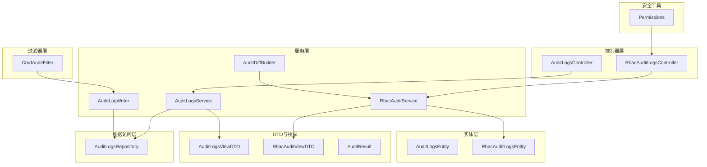
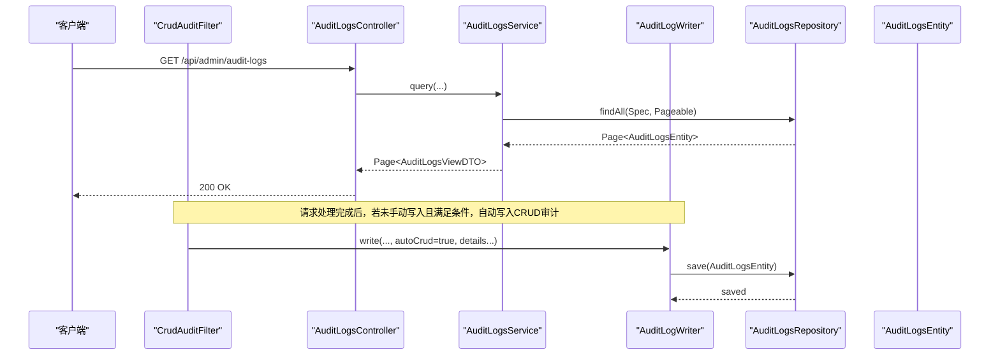
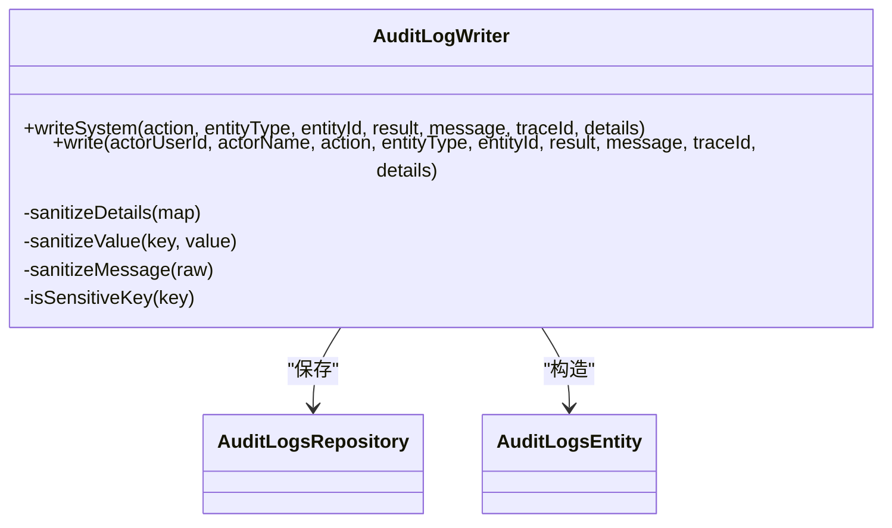
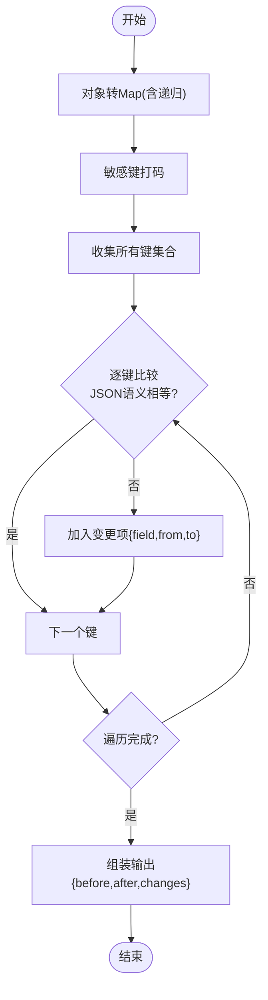
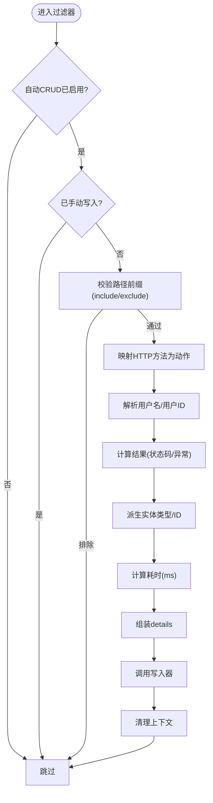
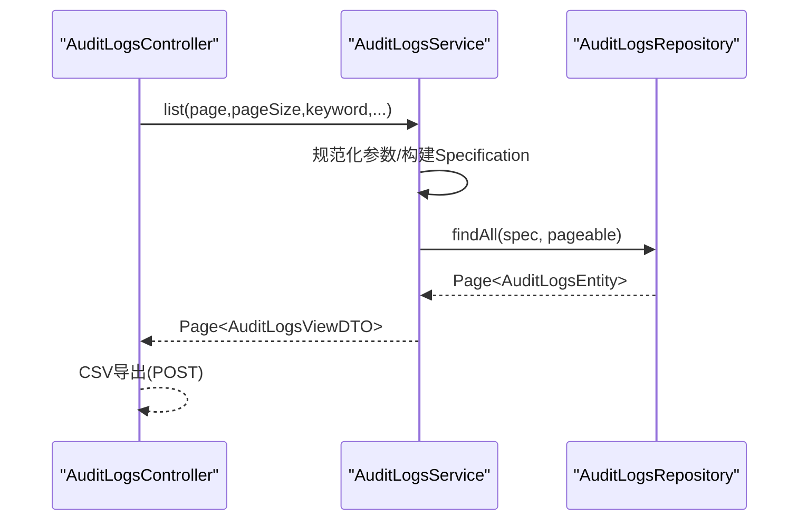
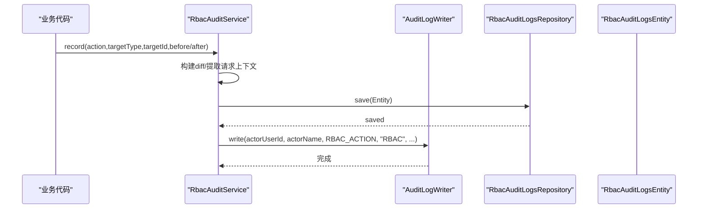
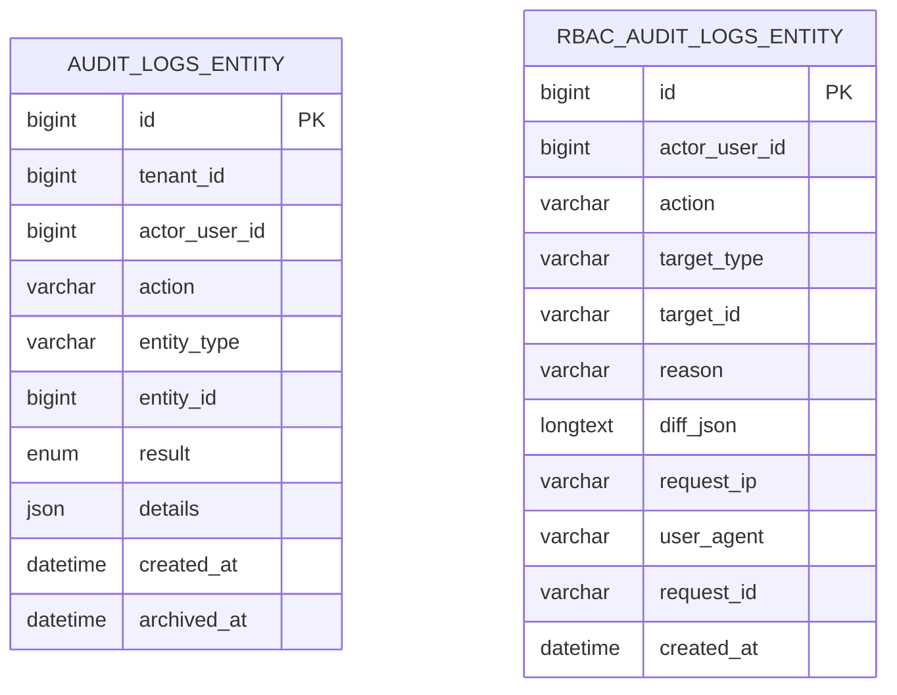
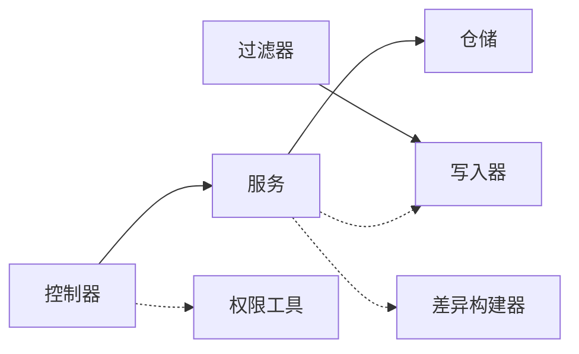

# 审计与安全

<cite>
**本文引用的文件**
- [AuditLogsController.java](file://src/main/java/com/example/EnterpriseRagCommunity/controller/access/AuditLogsController.java)
- [RbacAuditLogsController.java](file://src/main/java/com/example/EnterpriseRagCommunity/controller/access/RbacAuditLogsController.java)
- [AuditLogWriter.java](file://src/main/java/com/example/EnterpriseRagCommunity/service/access/AuditLogWriter.java)
- [AuditDiffBuilder.java](file://src/main/java/com/example/EnterpriseRagCommunity/service/access/AuditDiffBuilder.java)
- [CrudAuditFilter.java](file://src/main/java/com/example/EnterpriseRagCommunity/security/CrudAuditFilter.java)
- [AuditLogsService.java](file://src/main/java/com/example/EnterpriseRagCommunity/service/access/AuditLogsService.java)
- [RbacAuditService.java](file://src/main/java/com/example/EnterpriseRagCommunity/service/access/RbacAuditService.java)
- [AuditLogsRepository.java](file://src/main/java/com/example/EnterpriseRagCommunity/repository/access/AuditLogsRepository.java)
- [AuditLogsEntity.java](file://src/main/java/com/example/EnterpriseRagCommunity/entity/access/AuditLogsEntity.java)
- [RbacAuditLogsEntity.java](file://src/main/java/com/example/EnterpriseRagCommunity/entity/access/RbacAuditLogsEntity.java)
- [AuditResult.java](file://src/main/java/com/example/EnterpriseRagCommunity/entity/access/enums/AuditResult.java)
- [AuditLogsViewDTO.java](file://src/main/java/com/example/EnterpriseRagCommunity/dto/access/AuditLogsViewDTO.java)
- [RbacAuditViewDTO.java](file://src/main/java/com/example/EnterpriseRagCommunity/dto/access/RbacAuditViewDTO.java)
- [Permissions.java](file://src/main/java/com/example/EnterpriseRagCommunity/security/Permissions.java)
</cite>

## 目录
1. [引言](#引言)
2. [项目结构](#项目结构)
3. [核心组件](#核心组件)
4. [架构总览](#架构总览)
5. [详细组件分析](#详细组件分析)
6. [依赖分析](#依赖分析)
7. [性能考量](#性能考量)
8. [故障排查指南](#故障排查指南)
9. [结论](#结论)
10. [附录](#附录)

## 引言
本文件为“审计与安全”系统的全面技术文档，覆盖审计日志记录机制、差异构建器、CRUD审计过滤器的实现逻辑；RBAC审计日志系统（权限变更审计、操作追踪）；审计控制器API接口（审计日志查询、审计事件管理）；审计实体模型设计（审计日志实体、RBAC审计日志实体的字段定义与关系映射）；以及审计数据的存储策略、查询优化与合规性考虑，并提供安全审计最佳实践与故障排查指南。

## 项目结构
围绕审计与安全的关键模块分布于以下包与类：
- 控制器层：审计日志控制器、RBAC审计日志控制器
- 服务层：审计日志写入器、差异构建器、审计服务、RBAC审计服务
- 过滤器层：CRUD审计过滤器
- 数据访问层：审计日志仓储接口
- 实体层：审计日志实体、RBAC审计日志实体
- DTO与枚举：审计视图DTO、RBAC视图DTO、审计结果枚举
- 安全工具：权限字符串命名工具

图表来源
- [AuditLogsController.java:1-150](file://src/main/java/com/example/EnterpriseRagCommunity/controller/access/AuditLogsController.java#L1-L150)
- [RbacAuditLogsController.java:1-66](file://src/main/java/com/example/EnterpriseRagCommunity/controller/access/RbacAuditLogsController.java#L1-L66)
- [AuditLogWriter.java:1-151](file://src/main/java/com/example/EnterpriseRagCommunity/service/access/AuditLogWriter.java#L1-L151)
- [AuditDiffBuilder.java:1-106](file://src/main/java/com/example/EnterpriseRagCommunity/service/access/AuditDiffBuilder.java#L1-L106)
- [CrudAuditFilter.java:1-304](file://src/main/java/com/example/EnterpriseRagCommunity/security/CrudAuditFilter.java#L1-L304)
- [AuditLogsService.java:1-221](file://src/main/java/com/example/EnterpriseRagCommunity/service/access/AuditLogsService.java#L1-L221)
- [RbacAuditService.java:1-139](file://src/main/java/com/example/EnterpriseRagCommunity/service/access/RbacAuditService.java#L1-L139)
- [AuditLogsRepository.java:1-29](file://src/main/java/com/example/EnterpriseRagCommunity/repository/access/AuditLogsRepository.java#L1-L29)
- [AuditLogsEntity.java:1-51](file://src/main/java/com/example/EnterpriseRagCommunity/entity/access/AuditLogsEntity.java#L1-L51)
- [RbacAuditLogsEntity.java:1-51](file://src/main/java/com/example/EnterpriseRagCommunity/entity/access/RbacAuditLogsEntity.java#L1-L51)
- [AuditLogsViewDTO.java:1-40](file://src/main/java/com/example/EnterpriseRagCommunity/dto/access/AuditLogsViewDTO.java#L1-L40)
- [RbacAuditViewDTO.java:1-22](file://src/main/java/com/example/EnterpriseRagCommunity/dto/access/RbacAuditViewDTO.java#L1-L22)
- [Permissions.java:1-25](file://src/main/java/com/example/EnterpriseRagCommunity/security/Permissions.java#L1-L25)

章节来源
- [AuditLogsController.java:1-150](file://src/main/java/com/example/EnterpriseRagCommunity/controller/access/AuditLogsController.java#L1-L150)
- [RbacAuditLogsController.java:1-66](file://src/main/java/com/example/EnterpriseRagCommunity/controller/access/RbacAuditLogsController.java#L1-L66)
- [AuditLogWriter.java:1-151](file://src/main/java/com/example/EnterpriseRagCommunity/service/access/AuditLogWriter.java#L1-L151)
- [AuditDiffBuilder.java:1-106](file://src/main/java/com/example/EnterpriseRagCommunity/service/access/AuditDiffBuilder.java#L1-L106)
- [CrudAuditFilter.java:1-304](file://src/main/java/com/example/EnterpriseRagCommunity/security/CrudAuditFilter.java#L1-L304)
- [AuditLogsService.java:1-221](file://src/main/java/com/example/EnterpriseRagCommunity/service/access/AuditLogsService.java#L1-L221)
- [RbacAuditService.java:1-139](file://src/main/java/com/example/EnterpriseRagCommunity/service/access/RbacAuditService.java#L1-L139)
- [AuditLogsRepository.java:1-29](file://src/main/java/com/example/EnterpriseRagCommunity/repository/access/AuditLogsRepository.java#L1-L29)
- [AuditLogsEntity.java:1-51](file://src/main/java/com/example/EnterpriseRagCommunity/entity/access/AuditLogsEntity.java#L1-L51)
- [RbacAuditLogsEntity.java:1-51](file://src/main/java/com/example/EnterpriseRagCommunity/entity/access/RbacAuditLogsEntity.java#L1-L51)
- [AuditLogsViewDTO.java:1-40](file://src/main/java/com/example/EnterpriseRagCommunity/dto/access/AuditLogsViewDTO.java#L1-L40)
- [RbacAuditViewDTO.java:1-22](file://src/main/java/com/example/EnterpriseRagCommunity/dto/access/RbacAuditViewDTO.java#L1-L22)
- [Permissions.java:1-25](file://src/main/java/com/example/EnterpriseRagCommunity/security/Permissions.java#L1-L25)

## 核心组件
- 审计日志写入器：统一写入审计日志，负责敏感信息脱敏、请求上下文注入、自动标记“自动CRUD”等。
- 差异构建器：对对象变更进行深度对比，生成“变更前/后/变化列表”的结构化差异。
- CRUD审计过滤器：基于请求路径与方法自动识别CRUD动作，未手动写入时自动落库。
- 审计服务：提供审计日志查询、排序、分页、关键词检索、CSV导出等能力。
- RBAC审计服务：记录权限变更事件，持久化差异与请求上下文，同时写入通用审计日志。
- 控制器：对外暴露审计日志与RBAC审计日志的查询与导出接口。

章节来源
- [AuditLogWriter.java:1-151](file://src/main/java/com/example/EnterpriseRagCommunity/service/access/AuditLogWriter.java#L1-L151)
- [AuditDiffBuilder.java:1-106](file://src/main/java/com/example/EnterpriseRagCommunity/service/access/AuditDiffBuilder.java#L1-L106)
- [CrudAuditFilter.java:1-304](file://src/main/java/com/example/EnterpriseRagCommunity/security/CrudAuditFilter.java#L1-L304)
- [AuditLogsService.java:1-221](file://src/main/java/com/example/EnterpriseRagCommunity/service/access/AuditLogsService.java#L1-L221)
- [RbacAuditService.java:1-139](file://src/main/java/com/example/EnterpriseRagCommunity/service/access/RbacAuditService.java#L1-L139)
- [AuditLogsController.java:1-150](file://src/main/java/com/example/EnterpriseRagCommunity/controller/access/AuditLogsController.java#L1-L150)
- [RbacAuditLogsController.java:1-66](file://src/main/java/com/example/EnterpriseRagCommunity/controller/access/RbacAuditLogsController.java#L1-L66)

## 架构总览
审计与安全体系由“控制器—服务—过滤器—仓储—实体”分层构成，结合“自动CRUD审计+手动审计”的双通道，确保关键操作可追溯。

图表来源
- [AuditLogsController.java:31-67](file://src/main/java/com/example/EnterpriseRagCommunity/controller/access/AuditLogsController.java#L31-L67)
- [AuditLogsService.java:33-121](file://src/main/java/com/example/EnterpriseRagCommunity/service/access/AuditLogsService.java#L33-L121)
- [AuditLogWriter.java:43-88](file://src/main/java/com/example/EnterpriseRagCommunity/service/access/AuditLogWriter.java#L43-L88)
- [CrudAuditFilter.java:58-128](file://src/main/java/com/example/EnterpriseRagCommunity/security/CrudAuditFilter.java#L58-L128)
- [AuditLogsRepository.java:14-28](file://src/main/java/com/example/EnterpriseRagCommunity/repository/access/AuditLogsRepository.java#L14-L28)
- [AuditLogsEntity.java:12-50](file://src/main/java/com/example/EnterpriseRagCommunity/entity/access/AuditLogsEntity.java#L12-L50)

## 详细组件分析

### 审计日志写入器（AuditLogWriter）
职责与特性：
- 统一写入入口，保证字段一致性与兼容性。
- 自动从请求上下文中提取IP、请求ID、traceId、方法、路径等信息并注入details。
- 敏感字段与消息内容脱敏，避免泄露。
- 写入后标记上下文，防止重复写入。

图表来源
- [AuditLogWriter.java:23-151](file://src/main/java/com/example/EnterpriseRagCommunity/service/access/AuditLogWriter.java#L23-L151)
- [AuditLogsRepository.java:14-28](file://src/main/java/com/example/EnterpriseRagCommunity/repository/access/AuditLogsRepository.java#L14-L28)
- [AuditLogsEntity.java:12-50](file://src/main/java/com/example/EnterpriseRagCommunity/entity/access/AuditLogsEntity.java#L12-L50)

章节来源
- [AuditLogWriter.java:16-151](file://src/main/java/com/example/EnterpriseRagCommunity/service/access/AuditLogWriter.java#L16-L151)

### 差异构建器（AuditDiffBuilder）
职责与特性：
- 将对象转换为可比较的Map，递归处理嵌套结构。
- 对比“变更前/后”，输出“字段、从、到”的变化列表。
- 敏感字段键名识别并打码，保障隐私与合规。

图表来源
- [AuditDiffBuilder.java:23-105](file://src/main/java/com/example/EnterpriseRagCommunity/service/access/AuditDiffBuilder.java#L23-L105)

章节来源
- [AuditDiffBuilder.java:1-106](file://src/main/java/com/example/EnterpriseRagCommunity/service/access/AuditDiffBuilder.java#L1-L106)

### CRUD审计过滤器（CrudAuditFilter）
职责与特性：
- 在请求结束后自动判断是否需要记录CRUD审计。
- 支持启用/禁用、包含/排除路径前缀、是否包含读操作等配置。
- 自动推断动作类型（读/增/改/删）、实体类型与实体ID。
- 记录状态码、延迟、处理器信息、异常等上下文。

图表来源
- [CrudAuditFilter.java:58-128](file://src/main/java/com/example/EnterpriseRagCommunity/security/CrudAuditFilter.java#L58-L128)

章节来源
- [CrudAuditFilter.java:31-304](file://src/main/java/com/example/EnterpriseRagCommunity/security/CrudAuditFilter.java#L31-L304)

### 审计服务（AuditLogsService）
职责与特性：
- 提供分页查询、关键词检索（含details JSON字段）、时间范围筛选、结果类型筛选。
- 支持按操作类型（CREATE/UPDATE/DELETE）的运算符匹配。
- 支持排序与最大页大小限制，保障查询性能。
- 导出CSV接口复用查询参数并限制最大导出条数。

图表来源
- [AuditLogsController.java:31-141](file://src/main/java/com/example/EnterpriseRagCommunity/controller/access/AuditLogsController.java#L31-L141)
- [AuditLogsService.java:33-121](file://src/main/java/com/example/EnterpriseRagCommunity/service/access/AuditLogsService.java#L33-L121)
- [AuditLogsRepository.java:14-28](file://src/main/java/com/example/EnterpriseRagCommunity/repository/access/AuditLogsRepository.java#L14-L28)

章节来源
- [AuditLogsService.java:25-221](file://src/main/java/com/example/EnterpriseRagCommunity/service/access/AuditLogsService.java#L25-L221)
- [AuditLogsController.java:19-150](file://src/main/java/com/example/EnterpriseRagCommunity/controller/access/AuditLogsController.java#L19-L150)

### RBAC审计服务（RbacAuditService）
职责与特性：
- 记录权限变更事件，支持传入对象或直接传入差异。
- 自动从请求头提取“原因、请求ID、User-Agent、IP”，并持久化。
- 同步写入通用审计日志，便于统一查询与追踪。

图表来源
- [RbacAuditService.java:31-82](file://src/main/java/com/example/EnterpriseRagCommunity/service/access/RbacAuditService.java#L31-L82)
- [AuditLogWriter.java:43-88](file://src/main/java/com/example/EnterpriseRagCommunity/service/access/AuditLogWriter.java#L43-L88)
- [RbacAuditLogsEntity.java:12-51](file://src/main/java/com/example/EnterpriseRagCommunity/entity/access/RbacAuditLogsEntity.java#L12-L51)

章节来源
- [RbacAuditService.java:23-139](file://src/main/java/com/example/EnterpriseRagCommunity/service/access/RbacAuditService.java#L23-L139)

### 审计控制器（API接口）
- 审计日志控制器：提供分页查询、详情获取、CSV导出接口，支持多维筛选与排序。
- RBAC审计控制器：提供分页查询接口，支持按操作者、动作、目标类型/ID、时间范围筛选。

章节来源
- [AuditLogsController.java:19-150](file://src/main/java/com/example/EnterpriseRagCommunity/controller/access/AuditLogsController.java#L19-L150)
- [RbacAuditLogsController.java:21-66](file://src/main/java/com/example/EnterpriseRagCommunity/controller/access/RbacAuditLogsController.java#L21-L66)

### 审计实体模型
- 审计日志实体：包含操作者、动作、实体类型/ID、结果、详情JSON、创建时间、归档时间等。
- RBAC审计日志实体：包含操作者、动作、目标类型/ID、原因、差异JSON、请求IP/User-Agent/请求ID、创建时间等。

图表来源
- [AuditLogsEntity.java:12-50](file://src/main/java/com/example/EnterpriseRagCommunity/entity/access/AuditLogsEntity.java#L12-L50)
- [RbacAuditLogsEntity.java:12-51](file://src/main/java/com/example/EnterpriseRagCommunity/entity/access/RbacAuditLogsEntity.java#L12-L51)

章节来源
- [AuditLogsEntity.java:1-51](file://src/main/java/com/example/EnterpriseRagCommunity/entity/access/AuditLogsEntity.java#L1-L51)
- [RbacAuditLogsEntity.java:1-51](file://src/main/java/com/example/EnterpriseRagCommunity/entity/access/RbacAuditLogsEntity.java#L1-L51)

## 依赖分析
- 控制器依赖服务；服务依赖仓储；过滤器依赖写入器与管理员服务；RBAC服务依赖用户仓储、对象映射与写入器。
- 查询链路中，服务层通过Specification动态拼接谓词，仓储层使用JPA原生JSON查询以支持details字段检索。
- 权限控制通过注解在RBAC控制器上使用权限字符串工具生成的权限常量。

图表来源
- [AuditLogsController.java:24-29](file://src/main/java/com/example/EnterpriseRagCommunity/controller/access/AuditLogsController.java#L24-L29)
- [RbacAuditLogsController.java:25-28](file://src/main/java/com/example/EnterpriseRagCommunity/controller/access/RbacAuditLogsController.java#L25-L28)
- [AuditLogsService.java](file://src/main/java/com/example/EnterpriseRagCommunity/service/access/AuditLogsService.java#L29)
- [RbacAuditService.java:26-29](file://src/main/java/com/example/EnterpriseRagCommunity/service/access/RbacAuditService.java#L26-L29)
- [AuditLogWriter.java](file://src/main/java/com/example/EnterpriseRagCommunity/service/access/AuditLogWriter.java#L27)
- [AuditDiffBuilder.java](file://src/main/java/com/example/EnterpriseRagCommunity/service/access/AuditDiffBuilder.java#L21)
- [Permissions.java:13-22](file://src/main/java/com/example/EnterpriseRagCommunity/security/Permissions.java#L13-L22)

章节来源
- [AuditLogsService.java:1-221](file://src/main/java/com/example/EnterpriseRagCommunity/service/access/AuditLogsService.java#L1-L221)
- [RbacAuditService.java:1-139](file://src/main/java/com/example/EnterpriseRagCommunity/service/access/RbacAuditService.java#L1-L139)
- [AuditLogsRepository.java:1-29](file://src/main/java/com/example/EnterpriseRagCommunity/repository/access/AuditLogsRepository.java#L1-L29)
- [Permissions.java:1-25](file://src/main/java/com/example/EnterpriseRagCommunity/security/Permissions.java#L1-L25)

## 性能考量
- 分页与限制：服务层对页大小设置上限，避免超大分页导致内存压力。
- 查询优化：
  - 使用Specification动态拼接谓词，减少不必要扫描。
  - 对details JSON字段提供原生SQL查询能力，便于精确匹配。
  - 索引建议：对高频查询字段（如created_at、entity_type、entity_id、actor_user_id、result）建立索引。
- 自动CRUD过滤器：
  - 路径白/黑名单与读操作开关，降低无关请求的审计开销。
  - 用户ID缓存（带TTL），减少重复查询。
- 导出策略：限制最大导出条数，避免一次性导出造成阻塞。

章节来源
- [AuditLogsService.java:31-51](file://src/main/java/com/example/EnterpriseRagCommunity/service/access/AuditLogsService.java#L31-L51)
- [AuditLogsRepository.java:25-27](file://src/main/java/com/example/EnterpriseRagCommunity/repository/access/AuditLogsRepository.java#L25-L27)
- [CrudAuditFilter.java:52-56](file://src/main/java/com/example/EnterpriseRagCommunity/security/CrudAuditFilter.java#L52-L56)
- [AuditLogsController.java:99-114](file://src/main/java/com/example/EnterpriseRagCommunity/controller/access/AuditLogsController.java#L99-L114)

## 故障排查指南
常见问题与定位思路：
- 未看到预期的CRUD审计：
  - 检查自动CRUD开关、包含/排除路径配置、是否已手动写入。
  - 确认请求方法与路径是否命中动作映射规则。
- 审计日志缺失或为空：
  - 核对是否设置了“仅记录写操作”且当前请求为读操作。
  - 检查是否被排除路径前缀拦截。
- 关键字搜索无效：
  - 确认搜索字段是否落在支持的列或details JSON中。
  - 注意details JSON的字符串化可能受JPA提供方影响。
- 导出失败或过大：
  - 确认导出条数限制与请求参数。
- 敏感信息泄露风险：
  - 检查写入器与差异构建器的脱敏逻辑是否覆盖到相应键名。
- RBAC审计未同步：
  - 确认业务调用是否使用了RBAC审计服务的record方法。
  - 检查请求头中的原因、请求ID、User-Agent、IP是否正确传递。

章节来源
- [CrudAuditFilter.java:70-140](file://src/main/java/com/example/EnterpriseRagCommunity/security/CrudAuditFilter.java#L70-L140)
- [AuditLogsService.java:98-116](file://src/main/java/com/example/EnterpriseRagCommunity/service/access/AuditLogsService.java#L98-L116)
- [AuditLogWriter.java:90-149](file://src/main/java/com/example/EnterpriseRagCommunity/service/access/AuditLogWriter.java#L90-L149)
- [AuditDiffBuilder.java:82-104](file://src/main/java/com/example/EnterpriseRagCommunity/service/access/AuditDiffBuilder.java#L82-L104)
- [AuditLogsController.java:99-114](file://src/main/java/com/example/EnterpriseRagCommunity/controller/access/AuditLogsController.java#L99-L114)
- [RbacAuditService.java:36-82](file://src/main/java/com/example/EnterpriseRagCommunity/service/access/RbacAuditService.java#L36-L82)

## 结论
该审计与安全系统通过“自动CRUD审计+手动审计”的双通道设计，结合差异构建与敏感信息脱敏，实现了对平台关键操作的完整追踪与合规保障。控制器层提供灵活的查询与导出能力，服务层通过Specification与原生JSON查询实现高效检索，实体层采用JSON字段承载丰富上下文，整体架构清晰、扩展性强，适合在生产环境中持续演进与治理。

## 附录
- 最佳实践：
  - 明确审计范围与阈值，合理配置自动CRUD开关与路径白名单。
  - 对敏感字段命名保持一致，确保脱敏逻辑覆盖全面。
  - 定期清理与归档历史审计数据，控制存储成本。
  - 对高频查询建立索引，关注慢查询与导出任务的资源占用。
- 合规性提示：
  - 确保审计日志不可抵赖、可追溯，保留必要的元数据（IP、UA、请求ID、traceId）。
  - 对涉及个人数据的操作，遵循最小化原则与数据生命周期管理。