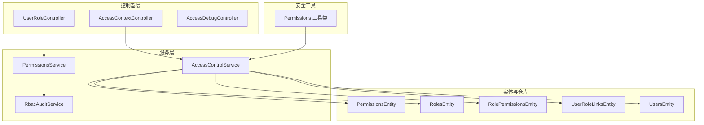
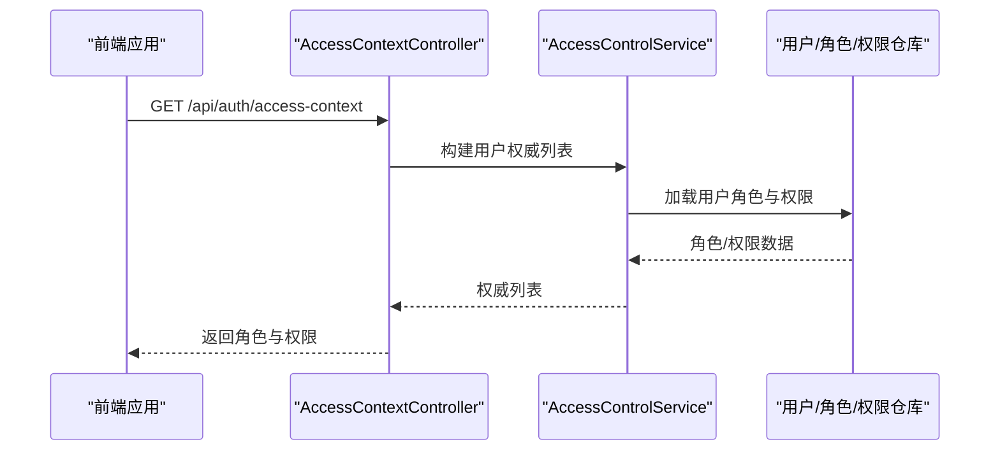
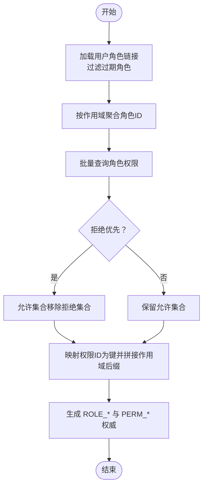
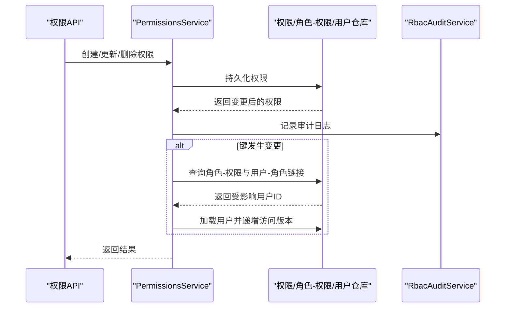
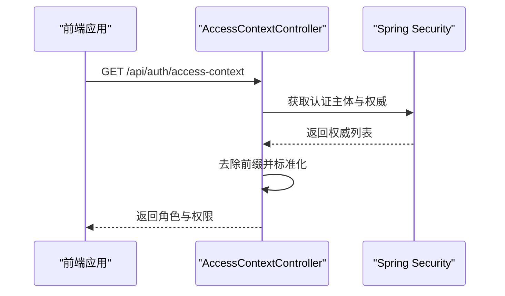
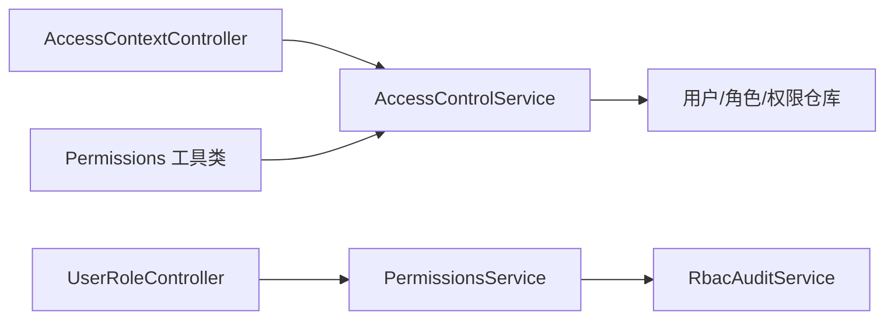

# 授权系统

<cite>
**本文引用的文件**
- [AccessControlService.java](file://src/main/java/com/example/EnterpriseRagCommunity/service/access/AccessControlService.java)
- [PermissionsService.java](file://src/main/java/com/example/EnterpriseRagCommunity/service/access/PermissionsService.java)
- [AccessContextController.java](file://src/main/java/com/example/EnterpriseRagCommunity/controller/access/AccessContextController.java)
- [UserRoleController.java](file://src/main/java/com/example/EnterpriseRagCommunity/controller/UserRoleController.java)
- [Permissions.java](file://src/main/java/com/example/EnterpriseRagCommunity/security/Permissions.java)
- [AccessDebugController.java](file://src/main/java/com/example/EnterpriseRagCommunity/controller/debug/AccessDebugController.java)
- [RbacAuditService.java](file://src/main/java/com/example/EnterpriseRagCommunity/service/AccessControlService.java)
- [AuditLogsViewDTO.java](file://src/main/java/com/example/EnterpriseRagCommunity/dto/access/AuditLogsViewDTO.java)
- [AccessContext.tsx](file://my-vite-app/src/contexts/AccessContext.tsx)
- [userAccessService.ts](file://my-vite-app/src/services/userAccessService.ts)
- [AdminUsersAccessSecurityTest.java](file://src/test/java/com/example/EnterpriseRagCommunity/security/AdminUsersAccessSecurityTest.java)
- [PermissionsServiceBranchTest.java](file://src/test/java/com/example/EnterpriseRagCommunity/service/access/PermissionsServiceBranchTest.java)
- [RbacAuditServiceBranchTest.java](file://src/test/java/com/example/EnterpriseRagCommunity/service/access/RbacAuditServiceBranchTest.java)
</cite>

## 目录
1. [引言](#引言)
2. [项目结构](#项目结构)
3. [核心组件](#核心组件)
4. [架构总览](#架构总览)
5. [详细组件分析](#详细组件分析)
6. [依赖关系分析](#依赖关系分析)
7. [性能考量](#性能考量)
8. [故障排查指南](#故障排查指南)
9. [结论](#结论)
10. [附录](#附录)

## 引言
本文件面向授权系统的实现与运维人员，系统性阐述基于角色的访问控制（RBAC）在本项目中的落地方式，包括权限定义、角色分配、权限继承与作用域、权限检查与构建、以及审计与日志处理。文档同时覆盖授权控制器的API接口规范、前端上下文提取与权限校验、以及最佳实践与安全注意事项。

## 项目结构
授权系统主要由以下层次构成：
- 控制器层：负责对外暴露REST API，如访问上下文查询、用户角色管理、调试快照等。
- 服务层：负责业务逻辑，如权限与角色的增删改查、权限构建、审计记录等。
- 实体与仓库层：持久化权限、角色、角色-权限关联、用户-角色链接等数据。
- 安全工具：权限字符串命名与规范化工具。
- 前端上下文与服务：从后端获取访问上下文，进行权限校验与用户角色分配。

图表来源
- [AccessContextController.java:1-60](file://src/main/java/com/example/EnterpriseRagCommunity/controller/access/AccessContextController.java#L1-L60)
- [UserRoleController.java:1-120](file://src/main/java/com/example/EnterpriseRagCommunity/controller/UserRoleController.java#L1-L120)
- [AccessControlService.java:1-222](file://src/main/java/com/example/EnterpriseRagCommunity/service/access/AccessControlService.java#L1-L222)
- [PermissionsService.java:1-164](file://src/main/java/com/example/EnterpriseRagCommunity/service/access/PermissionsService.java#L1-L164)
- [Permissions.java:1-24](file://src/main/java/com/example/EnterpriseRagCommunity/security/Permissions.java#L1-L24)

章节来源
- [AccessContextController.java:1-60](file://src/main/java/com/example/EnterpriseRagCommunity/controller/access/AccessContextController.java#L1-L60)
- [UserRoleController.java:1-120](file://src/main/java/com/example/EnterpriseRagCommunity/controller/UserRoleController.java#L1-L120)
- [AccessControlService.java:1-222](file://src/main/java/com/example/EnterpriseRagCommunity/service/access/AccessControlService.java#L1-L222)
- [PermissionsService.java:1-164](file://src/main/java/com/example/EnterpriseRagCommunity/service/access/PermissionsService.java#L1-L164)
- [Permissions.java:1-24](file://src/main/java/com/example/EnterpriseRagCommunity/security/Permissions.java#L1-L24)

## 核心组件
- 权限与角色构建服务：根据用户的角色与作用域，计算其最终权限集合，并生成标准的Spring Security权威列表。
- 权限服务：提供权限的增删改查、变更审计、以及对用户访问版本的触达更新。
- 访问上下文控制器：将认证主体的权威转换为标准化的“角色”和“权限”列表返回给前端。
- 用户角色控制器：提供角色的分页查询、创建、更新、删除等管理接口。
- 权限工具类：统一权限键命名格式，支持全局与作用域后缀。
- 调试控制器：用于生成数据库中已生效的权限快照，便于生产一致性校验。

章节来源
- [AccessControlService.java:1-222](file://src/main/java/com/example/EnterpriseRagCommunity/service/access/AccessControlService.java#L1-L222)
- [PermissionsService.java:1-164](file://src/main/java/com/example/EnterpriseRagCommunity/service/access/PermissionsService.java#L1-L164)
- [AccessContextController.java:1-60](file://src/main/java/com/example/EnterpriseRagCommunity/controller/access/AccessContextController.java#L1-L60)
- [UserRoleController.java:1-120](file://src/main/java/com/example/EnterpriseRagCommunity/controller/UserRoleController.java#L1-L120)
- [Permissions.java:1-24](file://src/main/java/com/example/EnterpriseRagCommunity/security/Permissions.java#L1-L24)
- [AccessDebugController.java:79-114](file://src/main/java/com/example/EnterpriseRagCommunity/controller/debug/AccessDebugController.java#L79-L114)

## 架构总览
授权系统采用“控制器-服务-仓储”的分层设计，结合Spring Security的权威体系，形成可扩展的RBAC模型。权限与角色通过多表关联，支持全局与作用域两种粒度；权限键采用“资源:动作”的命名规范，并可附加作用域后缀以限定范围。

图表来源
- [AccessContextController.java:23-58](file://src/main/java/com/example/EnterpriseRagCommunity/controller/access/AccessContextController.java#L23-L58)
- [AccessControlService.java:61-118](file://src/main/java/com/example/EnterpriseRagCommunity/service/access/AccessControlService.java#L61-L118)

## 详细组件分析

### 权限与角色构建服务（AccessControlService）
- 职责
  - 在单事务内加载用户的活跃角色与有效权限，构建标准权威列表。
  - 支持“拒绝优先”策略：当存在显式拒绝时，即使存在允许也视为未授权。
  - 支持作用域：为每个权威附加作用域后缀，区分全局与特定范围。
- 关键流程
  - 加载用户角色链接，过滤过期角色，按作用域聚合角色ID。
  - 汇总各作用域下角色的允许/拒绝权限集，执行“拒绝优先”合并。
  - 将权限ID映射为“资源:动作”键，并按作用域拼接后缀。
  - 生成三类权威：ROLE_{角色名}、ROLE_ID_{角色ID}、PERM_{资源:动作}。
- 性能特性
  - 使用批量查询减少N+1问题，按作用域分组聚合，避免重复计算。
  - 权限键与作用域后缀的拼接在内存完成，复杂度与权限数量线性相关。

图表来源
- [AccessControlService.java:120-200](file://src/main/java/com/example/EnterpriseRagCommunity/service/access/AccessControlService.java#L120-L200)

章节来源
- [AccessControlService.java:23-222](file://src/main/java/com/example/EnterpriseRagCommunity/service/access/AccessControlService.java#L23-L222)

### 权限服务（PermissionsService）
- 职责
  - 提供权限的条件查询、创建、更新、删除。
  - 在权限键变更或删除时，触达受影响的用户，使其重新加载权威。
  - 记录RBAC审计日志，包含变更前后差异。
- 关键流程
  - 查询：基于资源、动作、描述等字段的模糊匹配与排序分页。
  - 创建/更新/删除：持久化变更并触发审计记录。
  - 触达用户：通过角色-权限与用户-角色链接定位受影响用户，递增其访问版本并更新时间戳。
- 错误处理
  - 未找到实体时抛出领域异常，保证接口契约清晰。
  - 触达用户过程捕获异常并静默失败，确保主流程不受影响。

图表来源
- [PermissionsService.java:72-116](file://src/main/java/com/example/EnterpriseRagCommunity/service/access/PermissionsService.java#L72-L116)
- [RbacAuditService.java:60-95](file://src/main/java/com/example/EnterpriseRagCommunity/service/AccessControlService.java#L60-L95)

章节来源
- [PermissionsService.java:1-164](file://src/main/java/com/example/EnterpriseRagCommunity/service/access/PermissionsService.java#L1-L164)
- [RbacAuditService.java:60-95](file://src/main/java/com/example/EnterpriseRagCommunity/service/AccessControlService.java#L60-L95)

### 访问上下文控制器（AccessContextController）
- 职责
  - 将认证主体的权威转换为标准化的“角色”和“权限”列表，去除前缀并去重。
  - 兼容多种权威来源：ROLE_前缀与PERM_前缀，以及不含前缀的遗留形式。
- 输出
  - 返回当前登录用户的邮箱、角色集合（去前缀）、权限集合（去前缀）。

图表来源
- [AccessContextController.java:23-58](file://src/main/java/com/example/EnterpriseRagCommunity/controller/access/AccessContextController.java#L23-L58)

章节来源
- [AccessContextController.java:1-60](file://src/main/java/com/example/EnterpriseRagCommunity/controller/access/AccessContextController.java#L1-L60)

### 用户角色控制器（UserRoleController）
- 职责
  - 提供角色的分页查询、详情查询、创建、更新、删除等管理接口。
- 接口规范
  - GET /api/user-roles/all：查询所有角色（不分页）
  - GET /api/user-roles?page=&size=：分页查询角色
  - GET /api/user-roles/{id}：按ID查询角色
  - POST /api/user-roles：创建角色
  - PUT /api/user-roles/{id}：更新角色
  - DELETE /api/user-roles/{id}：删除角色

章节来源
- [UserRoleController.java:1-120](file://src/main/java/com/example/EnterpriseRagCommunity/controller/UserRoleController.java#L1-L120)

### 权限工具类（Permissions）
- 职责
  - 统一生成权限键：PERM_{resource:action}，并支持附加作用域后缀。
- 作用
  - 与AccessControlService配合，保证权限键命名一致，便于前端与后端解析。

章节来源
- [Permissions.java:1-24](file://src/main/java/com/example/EnterpriseRagCommunity/security/Permissions.java#L1-L24)

### 调试控制器（AccessDebugController）
- 职责
  - 生成数据库中已生效的权限快照，用于比对与验证。
- 行为
  - 汇总指定角色的允许/拒绝权限，剔除拒绝项后生成权限键集合。
  - 同时返回用户权威构建结果，便于与生产逻辑对比。

章节来源
- [AccessDebugController.java:79-114](file://src/main/java/com/example/EnterpriseRagCommunity/controller/debug/AccessDebugController.java#L79-L114)

## 依赖关系分析
- 控制器依赖服务：控制器仅负责参数绑定与响应封装，核心逻辑在服务层。
- 服务层依赖仓储：服务层通过仓储访问数据库，保持职责分离。
- 权限键命名：服务层与工具类共同维护权限键命名规范，避免不一致。
- 前端上下文：前端从后端获取标准化的角色与权限，再进行本地权限校验。

图表来源
- [AccessContextController.java:1-60](file://src/main/java/com/example/EnterpriseRagCommunity/controller/access/AccessContextController.java#L1-L60)
- [AccessControlService.java:1-222](file://src/main/java/com/example/EnterpriseRagCommunity/service/access/AccessControlService.java#L1-L222)
- [PermissionsService.java:1-164](file://src/main/java/com/example/EnterpriseRagCommunity/service/access/PermissionsService.java#L1-L164)
- [Permissions.java:1-24](file://src/main/java/com/example/EnterpriseRagCommunity/security/Permissions.java#L1-L24)

章节来源
- [AccessContextController.java:1-60](file://src/main/java/com/example/EnterpriseRagCommunity/controller/access/AccessContextController.java#L1-L60)
- [AccessControlService.java:1-222](file://src/main/java/com/example/EnterpriseRagCommunity/service/access/AccessControlService.java#L1-L222)
- [PermissionsService.java:1-164](file://src/main/java/com/example/EnterpriseRagCommunity/service/access/PermissionsService.java#L1-L164)
- [Permissions.java:1-24](file://src/main/java/com/example/EnterpriseRagCommunity/security/Permissions.java#L1-L24)

## 性能考量
- 批量查询：在角色权限与用户角色链接查询中采用批量方法，降低数据库往返次数。
- 作用域聚合：按作用域分组聚合角色ID，减少重复计算与冗余查询。
- 内存映射：权限ID到键的映射与键到作用域后缀的拼接在内存完成，适合中等规模权限集。
- 事务边界：权威构建与权限查询均在只读事务中执行，保障一致性与并发安全。

## 故障排查指南
- 权限未生效
  - 检查角色是否过期：角色链接中的过期时间会影响权威生成。
  - 确认“拒绝优先”策略：若存在显式拒绝，允许项不会生效。
  - 核对作用域：确认权限键是否带有正确的“@SCOPE:ID”后缀。
- 权限变更后用户未刷新
  - 确认权限键是否发生变更：只有键变更才会触达用户。
  - 检查受影响用户是否正确识别：需检查角色-权限与用户-角色链接。
- 审计缺失
  - 确认审计写入器可用：若写入失败应不影响主流程，但审计记录会丢失。
  - 检查认证上下文：匿名用户或缺少必要信息时，审计记录仍会落库，但缺少操作者信息。

章节来源
- [AccessControlService.java:120-200](file://src/main/java/com/example/EnterpriseRagCommunity/service/access/AccessControlService.java#L120-L200)
- [PermissionsService.java:134-156](file://src/main/java/com/example/EnterpriseRagCommunity/service/access/PermissionsService.java#L134-L156)
- [RbacAuditService.java:60-95](file://src/main/java/com/example/EnterpriseRagCommunity/service/AccessControlService.java#L60-L95)

## 结论
本授权系统以RBAC为核心，通过“拒绝优先”的权限合并策略、作用域化的权限键、以及完善的审计与用户触达机制，实现了灵活且可审计的权限管理。控制器层提供清晰的API，服务层承担复杂业务逻辑，前端通过访问上下文控制器获取标准化的角色与权限，整体架构清晰、易于扩展与维护。

## 附录

### 授权控制器API接口规范
- 访问上下文
  - 方法：GET
  - 路径：/api/auth/access-context
  - 返回：邮箱、角色数组、权限数组（均去前缀）
- 用户角色管理
  - 查询全部：GET /api/user-roles/all
  - 分页查询：GET /api/user-roles?page=&size=
  - 查询详情：GET /api/user-roles/{id}
  - 创建角色：POST /api/user-roles
  - 更新角色：PUT /api/user-roles/{id}
  - 删除角色：DELETE /api/user-roles/{id}

章节来源
- [AccessContextController.java:23-58](file://src/main/java/com/example/EnterpriseRagCommunity/controller/access/AccessContextController.java#L23-L58)
- [UserRoleController.java:34-118](file://src/main/java/com/example/EnterpriseRagCommunity/controller/UserRoleController.java#L34-L118)

### 前端权限与角色分配
- 上下文提取
  - 前端从后端获取标准化的角色与权限，进行本地权限校验与UI渲染。
- 角色分配
  - 前端通过服务接口向后端提交用户ID与角色ID数组，携带CSRF与可选管理员原因头。

章节来源
- [AccessContext.tsx:37-53](file://my-vite-app/src/contexts/AccessContext.tsx#L37-L53)
- [userAccessService.ts:140-171](file://my-vite-app/src/services/userAccessService.ts#L140-L171)

### 审计结果处理的数据模型
- 审计视图DTO
  - 字段：id、创建时间、租户ID、操作者ID/名称、动作、实体类型/ID、结果、消息、IP、追踪ID、HTTP方法、路径、自动CRUD标记、详情（含目标类型/ID、差异、请求ID、UA等）。
- 用途
  - 作为管理员视图的统一数据载体，与前端审计服务契约对齐。

章节来源
- [AuditLogsViewDTO.java:15-38](file://src/main/java/com/example/EnterpriseRagCommunity/dto/access/AuditLogsViewDTO.java#L15-L38)

### 测试与回归
- 安全回归测试
  - 验证管理员端点必须使用PERM_*权限而非hasRole('ADMIN')进行保护。
- 权限服务分支覆盖
  - 覆盖查询、创建、更新、删除、键变更触达用户等主分支。
- RBAC审计服务分支覆盖
  - 覆盖正常记录、缺失认证与审计写入器失败等场景。

章节来源
- [AdminUsersAccessSecurityTest.java:30-39](file://src/test/java/com/example/EnterpriseRagCommunity/security/AdminUsersAccessSecurityTest.java#L30-L39)
- [PermissionsServiceBranchTest.java:34-147](file://src/test/java/com/example/EnterpriseRagCommunity/service/access/PermissionsServiceBranchTest.java#L34-L147)
- [RbacAuditServiceBranchTest.java:60-94](file://src/test/java/com/example/EnterpriseRagCommunity/service/access/RbacAuditServiceBranchTest.java#L60-L94)