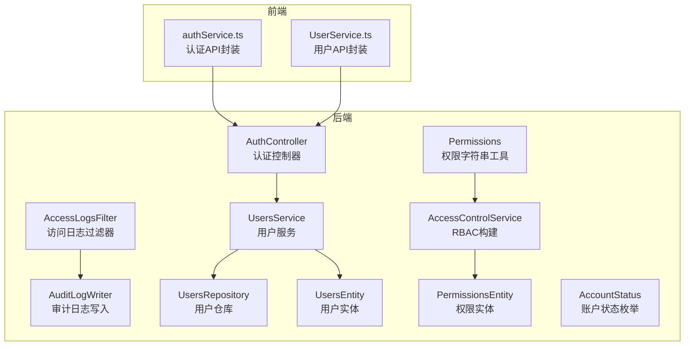
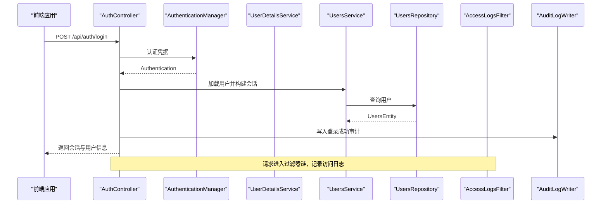
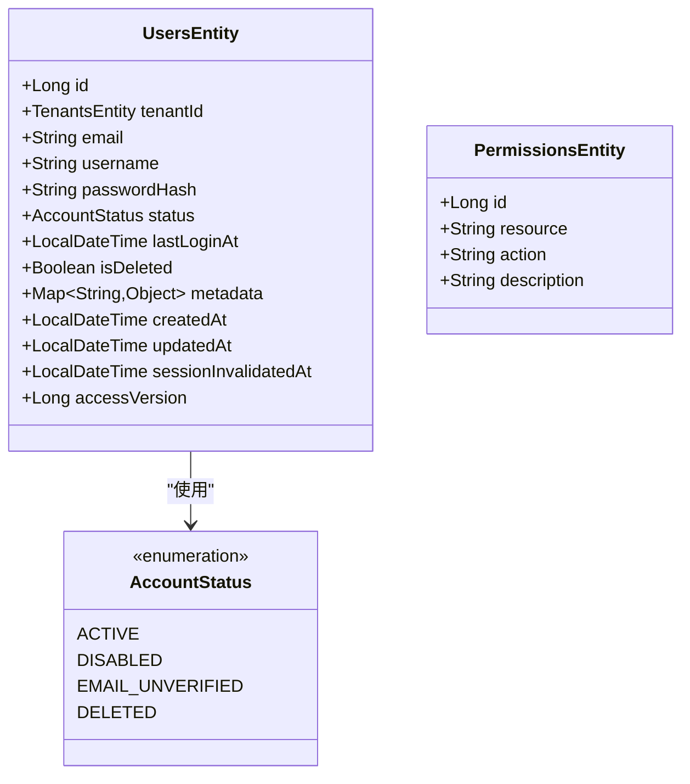
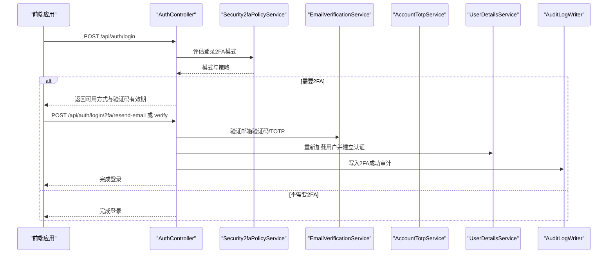
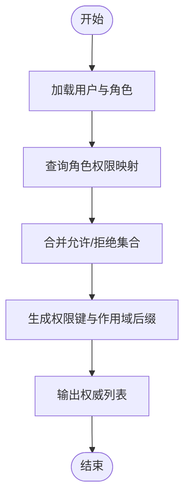
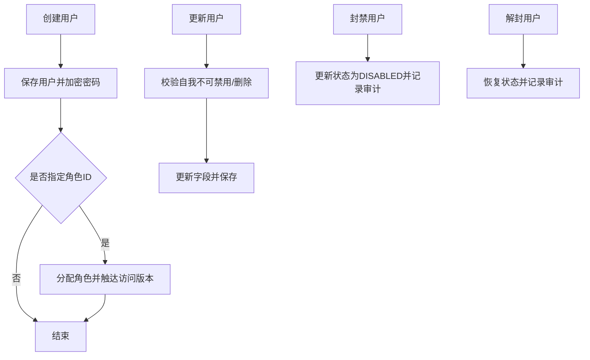
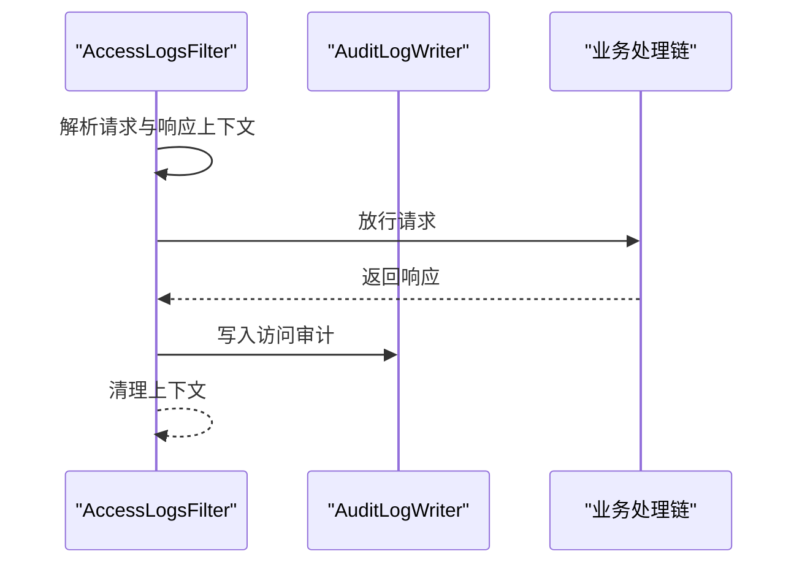
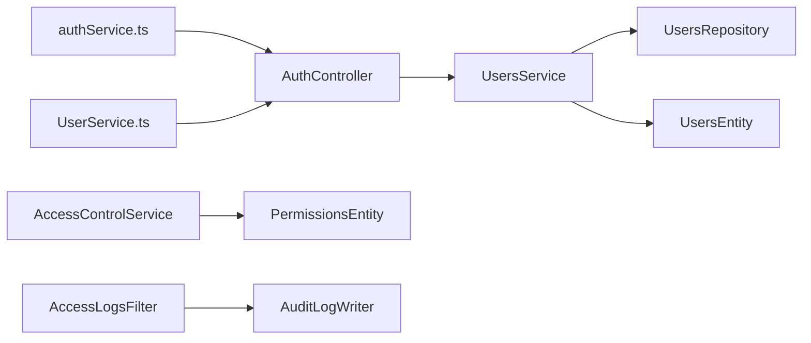

# 用户管理

<cite>
**本文引用的文件**
- [AuthController.java](file://src/main/java/com/example/EnterpriseRagCommunity/controller/AuthController.java)
- [UsersService.java](file://src/main/java/com/example/EnterpriseRagCommunity/service/access/UsersService.java)
- [UsersEntity.java](file://src/main/java/com/example/EnterpriseRagCommunity/entity/access/UsersEntity.java)
- [Permissions.java](file://src/main/java/com/example/EnterpriseRagCommunity/security/Permissions.java)
- [AccountStatus.java](file://src/main/java/com/example/EnterpriseRagCommunity/entity/access/enums/AccountStatus.java)
- [PermissionsEntity.java](file://src/main/java/com/example/EnterpriseRagCommunity/entity/access/PermissionsEntity.java)
- [AccessLogsFilter.java](file://src/main/java/com/example/EnterpriseRagCommunity/security/AccessLogsFilter.java)
- [AuditLogWriter.java](file://src/main/java/com/example/EnterpriseRagCommunity/service/access/AuditLogWriter.java)
- [UsersRepository.java](file://src/main/java/com/example/EnterpriseRagCommunity/repository/access/UsersRepository.java)
- [AccessControlService.java](file://src/main/java/com/example/EnterpriseRagCommunity/service/access/AccessControlService.java)
- [authService.ts](file://my-vite-app/src/services/authService.ts)
- [UserService.ts](file://my-vite-app/src/services/UserService.ts)
</cite>

## 目录
1. [引言](#引言)
2. [项目结构](#项目结构)
3. [核心组件](#核心组件)
4. [架构总览](#架构总览)
5. [详细组件分析](#详细组件分析)
6. [依赖分析](#依赖分析)
7. [性能考虑](#性能考虑)
8. [故障排查指南](#故障排查指南)
9. [结论](#结论)
10. [附录](#附录)

## 引言
本文件面向用户管理系统，围绕用户注册、登录、权限控制、角色管理、访问日志与审计日志等核心能力，提供从架构到接口的完整说明。重点覆盖：
- 用户认证流程与会话管理
- 基于角色的访问控制（RBAC）实现
- 2FA 双重认证机制（邮箱验证码与TOTP）
- 用户实体模型、权限枚举与审计日志
- 用户管理 API 接口规范（注册、登录、权限验证、用户信息更新等）
- 安全过滤器与访问控制拦截器的工作原理

## 项目结构
用户管理相关代码主要分布在后端 Java 工程与前端 Vite 应用中：
- 后端控制器与服务层：认证、用户、权限、审计与访问日志
- 数据模型与仓库：用户、权限、角色、审计与访问日志实体
- 安全与拦截：权限命名工具、访问日志过滤器、审计写入器
- 前端服务：认证与用户管理 API 的调用封装

图表来源
- [AuthController.java:1-1236](file://src/main/java/com/example/EnterpriseRagCommunity/controller/AuthController.java#L1-1236)
- [UsersService.java:1-412](file://src/main/java/com/example/EnterpriseRagCommunity/service/access/UsersService.java#L1-412)
- [AccessControlService.java:1-222](file://src/main/java/com/example/EnterpriseRagCommunity/service/access/AccessControlService.java#L1-222)
- [AccessLogsFilter.java:1-710](file://src/main/java/com/example/EnterpriseRagCommunity/security/AccessLogsFilter.java#L1-710)
- [AuditLogWriter.java:1-151](file://src/main/java/com/example/EnterpriseRagCommunity/service/access/AuditLogWriter.java#L1-151)
- [UsersRepository.java:1-47](file://src/main/java/com/example/EnterpriseRagCommunity/repository/access/UsersRepository.java#L1-47)
- [UsersEntity.java:1-89](file://src/main/java/com/example/EnterpriseRagCommunity/entity/access/UsersEntity.java#L1-89)
- [PermissionsEntity.java:1-26](file://src/main/java/com/example/EnterpriseRagCommunity/entity/access/PermissionsEntity.java#L1-26)
- [AccountStatus.java:1-7](file://src/main/java/com/example/EnterpriseRagCommunity/entity/access/enums/AccountStatus.java#L1-7)
- [Permissions.java:1-25](file://src/main/java/com/example/EnterpriseRagCommunity/security/Permissions.java#L1-25)
- [authService.ts:1-376](file://my-vite-app/src/services/authService.ts#L1-376)
- [UserService.ts:1-168](file://my-vite-app/src/services/UserService.ts#L1-168)

章节来源
- [AuthController.java:1-1236](file://src/main/java/com/example/EnterpriseRagCommunity/controller/AuthController.java#L1-1236)
- [UsersService.java:1-412](file://src/main/java/com/example/EnterpriseRagCommunity/service/access/UsersService.java#L1-412)
- [AccessControlService.java:1-222](file://src/main/java/com/example/EnterpriseRagCommunity/service/access/AccessControlService.java#L1-222)
- [AccessLogsFilter.java:1-710](file://src/main/java/com/example/EnterpriseRagCommunity/security/AccessLogsFilter.java#L1-710)
- [AuditLogWriter.java:1-151](file://src/main/java/com/example/EnterpriseRagCommunity/service/access/AuditLogWriter.java#L1-151)
- [UsersRepository.java:1-47](file://src/main/java/com/example/EnterpriseRagCommunity/repository/access/UsersRepository.java#L1-47)
- [UsersEntity.java:1-89](file://src/main/java/com/example/EnterpriseRagCommunity/entity/access/UsersEntity.java#L1-89)
- [PermissionsEntity.java:1-26](file://src/main/java/com/example/EnterpriseRagCommunity/entity/access/PermissionsEntity.java#L1-26)
- [AccountStatus.java:1-7](file://src/main/java/com/example/EnterpriseRagCommunity/entity/access/enums/AccountStatus.java#L1-7)
- [Permissions.java:1-25](file://src/main/java/com/example/EnterpriseRagCommunity/security/Permissions.java#L1-25)
- [authService.ts:1-376](file://my-vite-app/src/services/authService.ts#L1-376)
- [UserService.ts:1-168](file://my-vite-app/src/services/UserService.ts#L1-168)

## 核心组件
- 认证与会话
  - 登录、登出、CSRF 令牌获取、当前用户查询
  - 2FA 登录二次验证（邮箱验证码与TOTP）
- 用户服务
  - 用户创建、更新、软/硬删除、封禁/解封、角色分配
- RBAC 权限体系
  - 权限与角色映射、作用域（全局/按范围）、权限键生成
- 日志与审计
  - 访问日志过滤器、审计日志写入器
- 前端 API 封装
  - 认证与用户管理接口调用

章节来源
- [AuthController.java:321-725](file://src/main/java/com/example/EnterpriseRagCommunity/controller/AuthController.java#L321-725)
- [UsersService.java:52-337](file://src/main/java/com/example/EnterpriseRagCommunity/service/access/UsersService.java#L52-337)
- [AccessControlService.java:35-222](file://src/main/java/com/example/EnterpriseRagCommunity/service/access/AccessControlService.java#L35-222)
- [AccessLogsFilter.java:44-213](file://src/main/java/com/example/EnterpriseRagCommunity/security/AccessLogsFilter.java#L44-213)
- [AuditLogWriter.java:25-151](file://src/main/java/com/example/EnterpriseRagCommunity/service/access/AuditLogWriter.java#L25-151)
- [authService.ts:55-180](file://my-vite-app/src/services/authService.ts#L55-180)
- [UserService.ts:23-126](file://my-vite-app/src/services/UserService.ts#L23-126)

## 架构总览
用户管理采用“控制器-服务-仓库-实体”的分层架构，并结合 Spring Security 的权限体系与自定义过滤器实现访问与审计。

图表来源
- [AuthController.java:321-441](file://src/main/java/com/example/EnterpriseRagCommunity/controller/AuthController.java#L321-441)
- [UsersService.java:52-103](file://src/main/java/com/example/EnterpriseRagCommunity/service/access/UsersService.java#L52-103)
- [UsersRepository.java:17-37](file://src/main/java/com/example/EnterpriseRagCommunity/repository/access/UsersRepository.java#L17-37)
- [AccessLogsFilter.java:84-213](file://src/main/java/com/example/EnterpriseRagCommunity/security/AccessLogsFilter.java#L84-213)
- [AuditLogWriter.java:43-88](file://src/main/java/com/example/EnterpriseRagCommunity/service/access/AuditLogWriter.java#L43-88)

## 详细组件分析

### 用户实体模型与数据结构
- 用户实体 UsersEntity
  - 关键字段：邮箱、用户名、密码哈希、状态、软删除标记、元数据、时间戳、会话失效时间、访问版本
  - 作用：承载用户基本信息与安全状态
- 权限实体 PermissionsEntity
  - 关键字段：资源、动作、描述
  - 作用：定义权限键（resource:action），作为 RBAC 的最小粒度
- 账户状态枚举 AccountStatus
  - 枚举值：ACTIVE、DISABLED、EMAIL_UNVERIFIED、DELETED
  - 作用：统一账户状态语义

图表来源
- [UsersEntity.java:17-59](file://src/main/java/com/example/EnterpriseRagCommunity/entity/access/UsersEntity.java#L17-59)
- [PermissionsEntity.java:11-25](file://src/main/java/com/example/EnterpriseRagCommunity/entity/access/PermissionsEntity.java#L11-25)
- [AccountStatus.java:3-5](file://src/main/java/com/example/EnterpriseRagCommunity/entity/access/enums/AccountStatus.java#L3-5)

章节来源
- [UsersEntity.java:1-89](file://src/main/java/com/example/EnterpriseRagCommunity/entity/access/UsersEntity.java#L1-89)
- [PermissionsEntity.java:1-26](file://src/main/java/com/example/EnterpriseRagCommunity/entity/access/PermissionsEntity.java#L1-26)
- [AccountStatus.java:1-7](file://src/main/java/com/example/EnterpriseRagCommunity/entity/access/enums/AccountStatus.java#L1-7)

### 认证与会话管理
- 登录流程
  - 校验邮箱验证码（未完成验证的用户会被拒绝）
  - 执行认证（用户名/密码）
  - 若开启 2FA：返回可用方式（邮箱或TOTP），并写入会话；否则完成登录并写入审计
- 2FA 登录
  - 支持邮箱验证码与TOTP两种方式
  - 校验码后重建认证上下文并完成登录
- 登出
  - 清空认证上下文与会话，写入审计
- CSRF 令牌
  - 提供获取 CSRF 令牌的接口，前端在请求头携带 X-XSRF-TOKEN

图表来源
- [AuthController.java:321-642](file://src/main/java/com/example/EnterpriseRagCommunity/controller/AuthController.java#L321-642)
- [AccessLogsFilter.java:84-213](file://src/main/java/com/example/EnterpriseRagCommunity/security/AccessLogsFilter.java#L84-213)
- [AuditLogWriter.java:43-88](file://src/main/java/com/example/EnterpriseRagCommunity/service/access/AuditLogWriter.java#L43-88)

章节来源
- [AuthController.java:321-642](file://src/main/java/com/example/EnterpriseRagCommunity/controller/AuthController.java#L321-642)
- [AccessLogsFilter.java:44-213](file://src/main/java/com/example/EnterpriseRagCommunity/security/AccessLogsFilter.java#L44-213)
- [AuditLogWriter.java:25-151](file://src/main/java/com/example/EnterpriseRagCommunity/service/access/AuditLogWriter.java#L25-151)

### 基于角色的访问控制（RBAC）
- 权限命名
  - 使用工具类生成权限键 PERM_resource:action
  - 支持作用域后缀 @SCOPE:ID
- 权限加载
  - 依据用户角色集合，查询角色权限映射
  - 合并允许/拒绝集，支持“先拒后允”策略
- 授权输出
  - 生成 ROLE_{name}、ROLE_ID_{id}、PERM_resource:action 等权威列表

图表来源
- [AccessControlService.java:52-200](file://src/main/java/com/example/EnterpriseRagCommunity/service/access/AccessControlService.java#L52-200)
- [Permissions.java:13-22](file://src/main/java/com/example/EnterpriseRagCommunity/security/Permissions.java#L13-22)

章节来源
- [AccessControlService.java:35-222](file://src/main/java/com/example/EnterpriseRagCommunity/service/access/AccessControlService.java#L35-222)
- [Permissions.java:8-25](file://src/main/java/com/example/EnterpriseRagCommunity/security/Permissions.java#L8-25)

### 用户管理服务与操作
- 用户 CRUD
  - 创建：加密密码、设置状态、默认角色绑定
  - 更新：支持邮箱、用户名、密码、状态、元数据等字段
  - 删除：软删除与硬删除（需满足约束）
- 封禁/解封
  - 更新状态为 DISABLED 并记录审计
- 角色分配
  - 清空旧角色后批量插入新角色，触达访问版本以强制刷新

图表来源
- [UsersService.java:52-337](file://src/main/java/com/example/EnterpriseRagCommunity/service/access/UsersService.java#L52-337)
- [UsersRepository.java:17-45](file://src/main/java/com/example/EnterpriseRagCommunity/repository/access/UsersRepository.java#L17-45)

章节来源
- [UsersService.java:52-337](file://src/main/java/com/example/EnterpriseRagCommunity/service/access/UsersService.java#L52-337)
- [UsersRepository.java:17-45](file://src/main/java/com/example/EnterpriseRagCommunity/repository/access/UsersRepository.java#L17-45)

### 审计与访问日志
- 访问日志过滤器
  - 拦截请求与响应，提取请求头、客户端IP、请求体/响应体摘要
  - 排除特定管理端点，支持配置最大捕获字节数
- 审计日志写入器
  - 统一写入审计日志，自动填充请求上下文中的IP、请求ID、追踪ID等
  - 敏感字段掩码处理

图表来源
- [AccessLogsFilter.java:84-213](file://src/main/java/com/example/EnterpriseRagCommunity/security/AccessLogsFilter.java#L84-213)
- [AuditLogWriter.java:43-88](file://src/main/java/com/example/EnterpriseRagCommunity/service/access/AuditLogWriter.java#L43-88)

章节来源
- [AccessLogsFilter.java:44-213](file://src/main/java/com/example/EnterpriseRagCommunity/security/AccessLogsFilter.java#L44-213)
- [AuditLogWriter.java:25-151](file://src/main/java/com/example/EnterpriseRagCommunity/service/access/AuditLogWriter.java#L25-151)

### 用户管理 API 接口规范
以下接口由后端控制器提供，前端通过 authService.ts 与 UserService.ts 调用。

- 认证与会话
  - GET /api/auth/current-admin
    - 功能：获取当前登录管理员信息
    - 成功：200，返回用户DTO（不含敏感字段）
    - 失败：401/404
  - POST /api/auth/login
    - 功能：邮箱+密码登录
    - 成功：200，返回会话与用户信息
    - 失败：401，或403（未完成邮箱验证）
    - 2FA：403，返回可用方式与验证码有效期
  - POST /api/auth/login/2fa/resend-email
    - 功能：重发登录2FA邮箱验证码
    - 成功：200
    - 失败：400/401/403
  - POST /api/auth/login/2fa/verify
    - 功能：校验登录2FA验证码（email/totp）
    - 成功：200，完成登录
    - 失败：400/401
  - POST /api/auth/logout
    - 功能：退出登录
    - 成功：200
    - 失败：500
  - GET /api/auth/csrf-token
    - 功能：获取CSRF令牌
    - 成功：200
    - 失败：500
  - GET /api/auth/initial-setup-status
    - 功能：检查是否需要初始管理员设置
    - 成功：200
  - GET /api/auth/registration-status
    - 功能：检查注册开关
    - 成功：200

- 用户管理（前端封装示例）
  - GET /api/readers/dto
    - 功能：获取读者列表（DTO）
    - 成功：200
  - GET /api/readers/:id/dto
    - 功能：获取读者详情（DTO）
    - 成功：200
  - POST /api/readers
    - 功能：创建读者
    - 成功：201
  - PUT /api/readers/:id
    - 功能：更新读者
    - 成功：200
  - DELETE /api/readers/:id
    - 功能：删除读者
    - 成功：204

章节来源
- [AuthController.java:162-742](file://src/main/java/com/example/EnterpriseRagCommunity/controller/AuthController.java#L162-742)
- [authService.ts:55-180](file://my-vite-app/src/services/authService.ts#L55-180)
- [UserService.ts:23-126](file://my-vite-app/src/services/UserService.ts#L23-126)

## 依赖分析
- 控制器依赖服务，服务依赖仓库与实体
- RBAC 服务依赖权限与角色仓库，生成权威列表
- 过滤器依赖审计写入器，统一记录访问与请求上下文
- 前端服务封装后端接口，负责错误解析与状态码处理

图表来源
- [AuthController.java:1-1236](file://src/main/java/com/example/EnterpriseRagCommunity/controller/AuthController.java#L1-1236)
- [UsersService.java:1-412](file://src/main/java/com/example/EnterpriseRagCommunity/service/access/UsersService.java#L1-412)
- [AccessControlService.java:1-222](file://src/main/java/com/example/EnterpriseRagCommunity/service/access/AccessControlService.java#L1-222)
- [AccessLogsFilter.java:1-710](file://src/main/java/com/example/EnterpriseRagCommunity/security/AccessLogsFilter.java#L1-710)
- [AuditLogWriter.java:1-151](file://src/main/java/com/example/EnterpriseRagCommunity/service/access/AuditLogWriter.java#L1-151)
- [authService.ts:1-376](file://my-vite-app/src/services/authService.ts#L1-376)
- [UserService.ts:1-168](file://my-vite-app/src/services/UserService.ts#L1-168)

章节来源
- [AuthController.java:1-1236](file://src/main/java/com/example/EnterpriseRagCommunity/controller/AuthController.java#L1-1236)
- [UsersService.java:1-412](file://src/main/java/com/example/EnterpriseRagCommunity/service/access/UsersService.java#L1-412)
- [AccessControlService.java:1-222](file://src/main/java/com/example/EnterpriseRagCommunity/service/access/AccessControlService.java#L1-222)
- [AccessLogsFilter.java:1-710](file://src/main/java/com/example/EnterpriseRagCommunity/security/AccessLogsFilter.java#L1-710)
- [AuditLogWriter.java:1-151](file://src/main/java/com/example/EnterpriseRagCommunity/service/access/AuditLogWriter.java#L1-151)
- [authService.ts:1-376](file://my-vite-app/src/services/authService.ts#L1-376)
- [UserService.ts:1-168](file://my-vite-app/src/services/UserService.ts#L1-168)

## 性能考虑
- 访问日志捕获
  - 可配置请求/响应体最大捕获字节，避免大体积请求/响应导致内存压力
  - 对二进制与流式响应默认不捕获
- 用户查询
  - 使用 Specifications 进行条件拼接，注意索引与软删除过滤
- 会话与版本
  - 用户访问版本与会话失效时间用于强制刷新权限与会话有效性

[本节为通用指导，不直接分析具体文件]

## 故障排查指南
- 登录失败
  - 检查邮箱验证码状态（未完成验证会被拒绝）
  - 查看审计日志中的失败原因与请求上下文
- 2FA 无法使用
  - 确认策略允许邮箱验证码或TOTP
  - 检查邮箱服务与TOTP服务是否启用
- 审计与访问日志异常
  - 确认过滤器已生效且未排除目标端点
  - 检查敏感字段是否被正确掩码

章节来源
- [AuthController.java:321-642](file://src/main/java/com/example/EnterpriseRagCommunity/controller/AuthController.java#L321-642)
- [AccessLogsFilter.java:44-213](file://src/main/java/com/example/EnterpriseRagCommunity/security/AccessLogsFilter.java#L44-213)
- [AuditLogWriter.java:25-151](file://src/main/java/com/example/EnterpriseRagCommunity/service/access/AuditLogWriter.java#L25-151)

## 结论
本用户管理系统以清晰的分层架构与完善的日志审计为基础，实现了安全可控的认证与授权流程。RBAC 体系通过权限键与作用域灵活扩展，配合访问日志与审计日志，为运维与合规提供了可靠支撑。前端通过统一的服务封装对接后端接口，简化了集成复杂度。

[本节为总结性内容，不直接分析具体文件]

## 附录
- 常用权限键命名
  - 使用工具类生成 PERM_resource:action，支持作用域后缀
- 会话与CSRF
  - 登录成功后会话ID变化，需重新获取CSRF令牌
- 前端注意事项
  - 调用受保护接口时携带 X-XSRF-TOKEN
  - 错误对象可能包含 code、email、methods、验证码等待与有效期等字段

章节来源
- [Permissions.java:13-22](file://src/main/java/com/example/EnterpriseRagCommunity/security/Permissions.java#L13-22)
- [authService.ts:55-180](file://my-vite-app/src/services/authService.ts#L55-180)