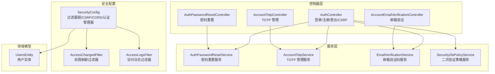
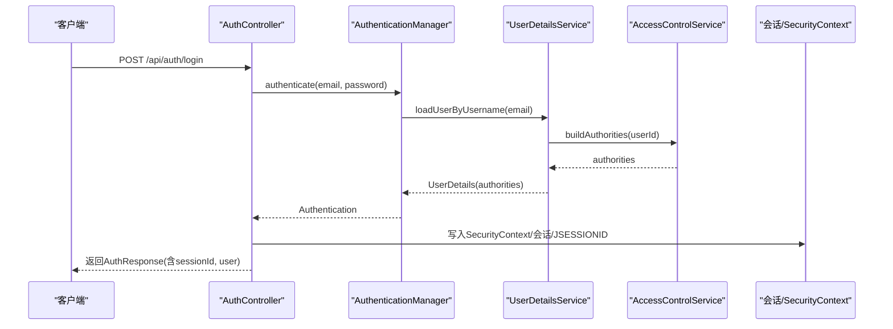
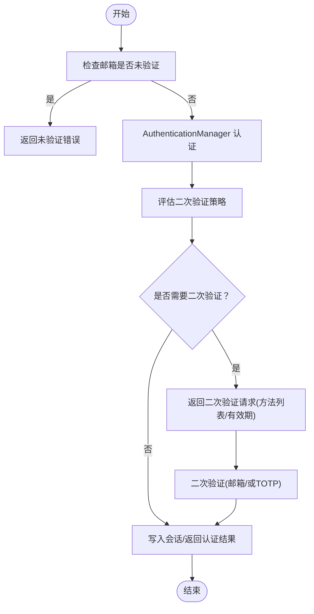
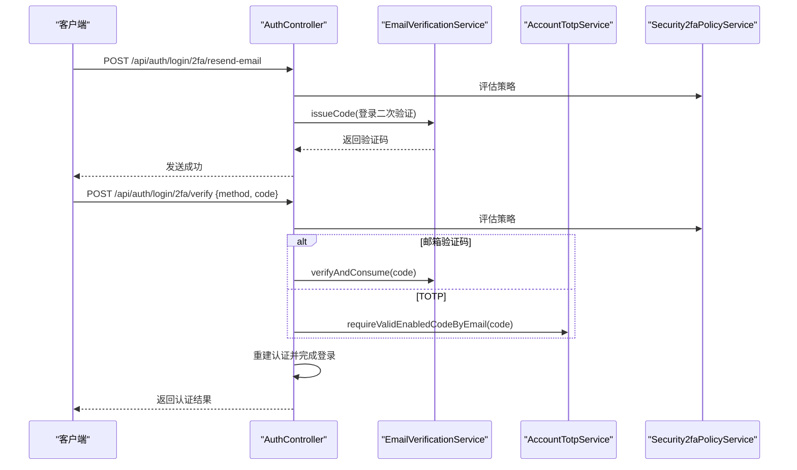
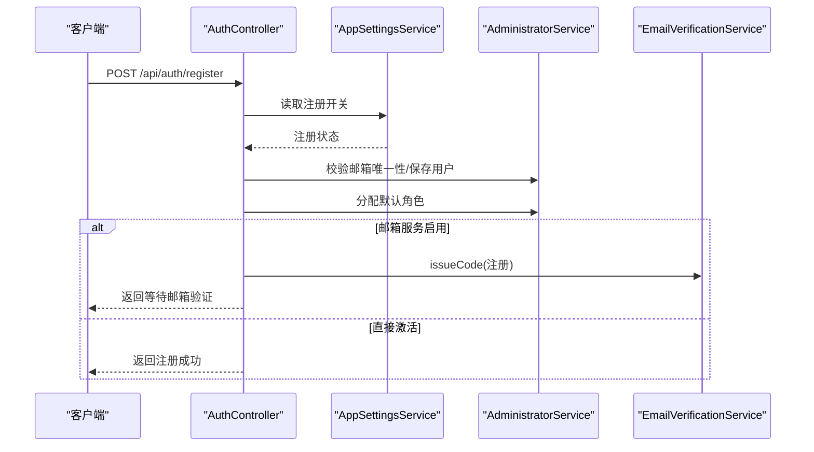
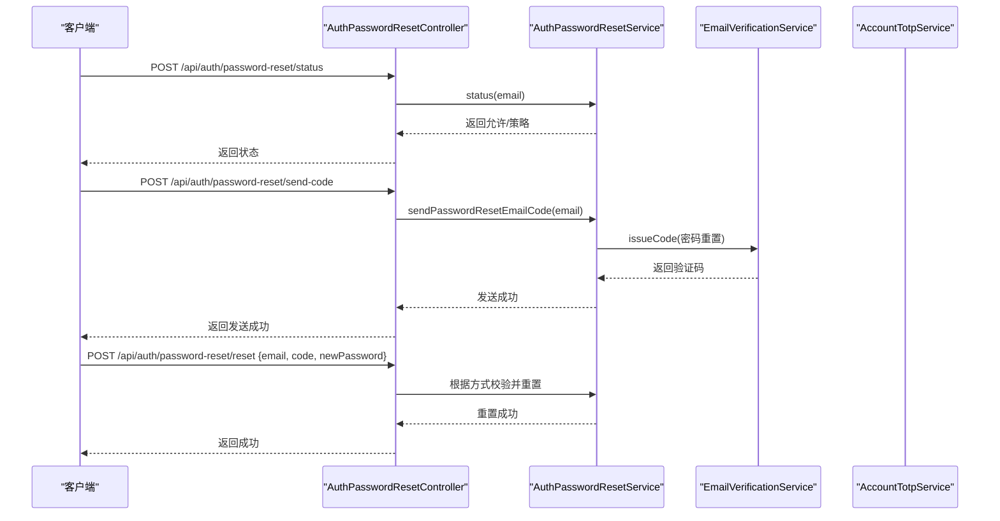
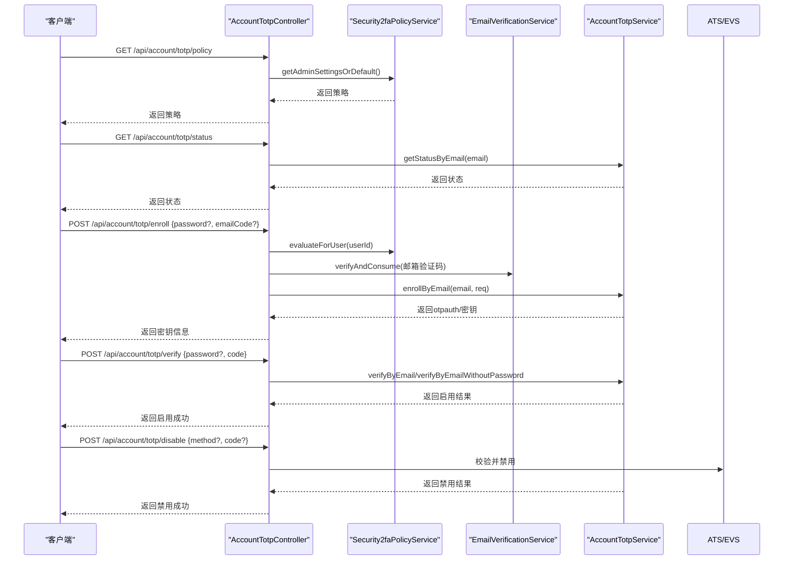
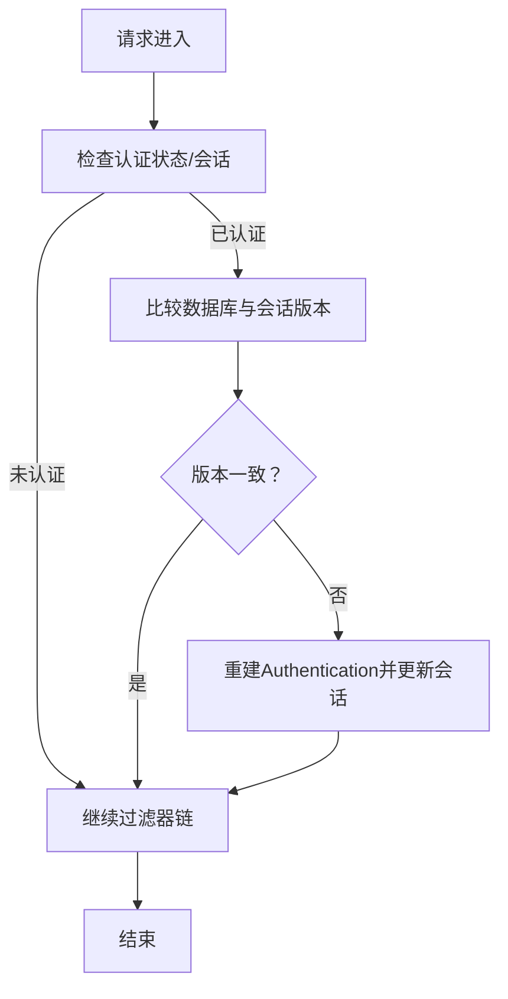
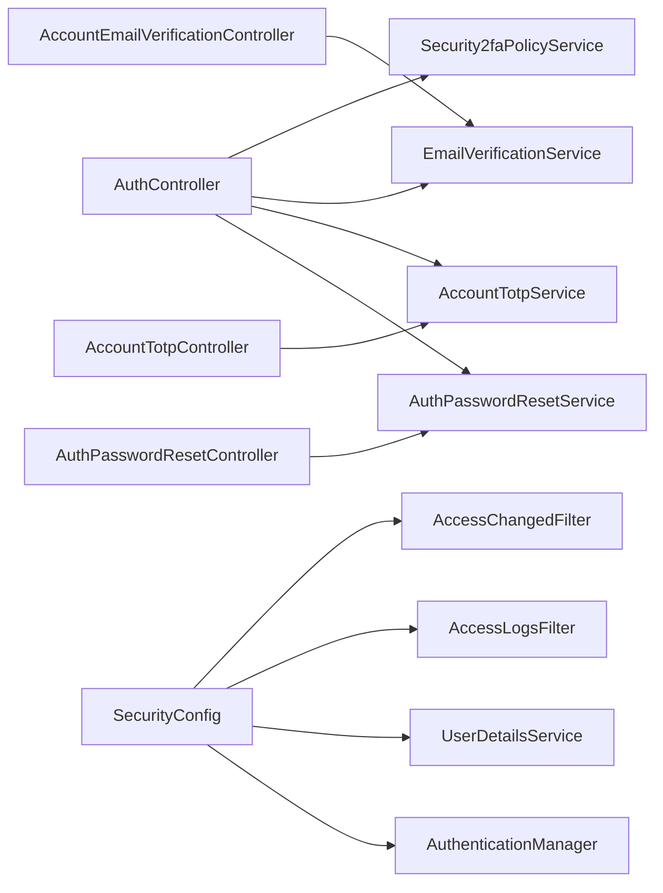

# 认证系统

<cite>
**本文档引用的文件**
- [AuthController.java](file://src/main/java/com/example/EnterpriseRagCommunity/controller/AuthController.java)
- [AuthPasswordResetController.java](file://src/main/java/com/example/EnterpriseRagCommunity/controller/AuthPasswordResetController.java)
- [AccountEmailVerificationController.java](file://src/main/java/com/example/EnterpriseRagCommunity/controller/AccountEmailVerificationController.java)
- [AccountTotpController.java](file://src/main/java/com/example/EnterpriseRagCommunity/controller/AccountTotpController.java)
- [AuthPasswordResetService.java](file://src/main/java/com/example/EnterpriseRagCommunity/service/AuthPasswordResetService.java)
- [AccountTotpService.java](file://src/main/java/com/example/EnterpriseRagCommunity/service/AccountTotpService.java)
- [EmailVerificationService.java](file://src/main/java/com/example/EnterpriseRagCommunity/service/access/EmailVerificationService.java)
- [Security2faPolicyService.java](file://src/main/java/com/example/EnterpriseRagCommunity/service/access/Security2faPolicyService.java)
- [AccessChangedFilter.java](file://src/main/java/com/example/EnterpriseRagCommunity/security/AccessChangedFilter.java)
- [AccessLogsFilter.java](file://src/main/java/com/example/EnterpriseRagCommunity/security/AccessLogsFilter.java)
- [SecurityConfig.java](file://src/main/java/com/example/EnterpriseRagCommunity/config/SecurityConfig.java)
- [UsersEntity.java](file://src/main/java/com/example/EnterpriseRagCommunity/entity/access/UsersEntity.java)
- [LoginRequest.java](file://src/main/java/com/example/EnterpriseRagCommunity/dto/access/request/LoginRequest.java)
- [RegisterRequest.java](file://src/main/java/com/example/EnterpriseRagCommunity/dto/access/request/RegisterRequest.java)
- [PasswordEncoderUtil.java](file://src/main/java/com/example/EnterpriseRagCommunity/utils/PasswordEncoderUtil.java)
</cite>

## 目录
1. [引言](#引言)
2. [项目结构](#项目结构)
3. [核心组件](#核心组件)
4. [架构总览](#架构总览)
5. [详细组件分析](#详细组件分析)
6. [依赖分析](#依赖分析)
7. [性能考虑](#性能考虑)
8. [故障排除指南](#故障排除指南)
9. [结论](#结论)
10. [附录](#附录)

## 引言
本文件面向认证系统的开发者与维护者，系统性阐述用户登录认证、密码重置、邮箱验证、TOTP 双重认证的完整实现与交互流程。文档覆盖控制器 API、服务层逻辑、安全过滤器工作原理，并提供最佳实践与排障建议，帮助读者快速理解并安全地扩展认证能力。

## 项目结构
认证相关代码主要分布在以下层次：
- 控制器层：负责对外 API、请求参数校验与响应封装
- 服务层：负责业务规则、密码加密、令牌与会话管理、二次验证策略
- 安全层：Spring Security 配置、过滤器链、CSRF、CORS
- 实体与 DTO：用户模型、请求/响应数据结构
- 工具类：密码编码工具

图表来源
- [AuthController.java:1-1236](file://src/main/java/com/example/EnterpriseRagCommunity/controller/AuthController.java#L1-L1236)
- [AuthPasswordResetController.java:1-67](file://src/main/java/com/example/EnterpriseRagCommunity/controller/AuthPasswordResetController.java#L1-L67)
- [AccountEmailVerificationController.java:1-108](file://src/main/java/com/example/EnterpriseRagCommunity/controller/AccountEmailVerificationController.java#L1-L108)
- [AccountTotpController.java:1-326](file://src/main/java/com/example/EnterpriseRagCommunity/controller/AccountTotpController.java#L1-L326)
- [AuthPasswordResetService.java:1-144](file://src/main/java/com/example/EnterpriseRagCommunity/service/AuthPasswordResetService.java#L1-L144)
- [AccountTotpService.java:1-359](file://src/main/java/com/example/EnterpriseRagCommunity/service/AccountTotpService.java#L1-L359)
- [EmailVerificationService.java:1-145](file://src/main/java/com/example/EnterpriseRagCommunity/service/access/EmailVerificationService.java#L1-L145)
- [Security2faPolicyService.java:1-361](file://src/main/java/com/example/EnterpriseRagCommunity/service/access/Security2faPolicyService.java#L1-L361)
- [SecurityConfig.java:1-323](file://src/main/java/com/example/EnterpriseRagCommunity/config/SecurityConfig.java#L1-L323)
- [AccessChangedFilter.java:1-154](file://src/main/java/com/example/EnterpriseRagCommunity/security/AccessChangedFilter.java#L1-L154)
- [AccessLogsFilter.java:1-710](file://src/main/java/com/example/EnterpriseRagCommunity/security/AccessLogsFilter.java#L1-L710)
- [UsersEntity.java:1-89](file://src/main/java/com/example/EnterpriseRagCommunity/entity/access/UsersEntity.java#L1-L89)

章节来源
- [SecurityConfig.java:74-194](file://src/main/java/com/example/EnterpriseRagCommunity/config/SecurityConfig.java#L74-L194)

## 核心组件
- 认证控制器：提供登录、注册、登出、CSRF、二次验证相关端点
- 密码重置控制器：提供密码重置状态查询、发送验证码、重置密码端点
- 邮箱验证控制器：提供邮箱验证码发送端点
- TOTP 管理控制器：提供策略查询、状态查询、启用/验证/禁用 TOTP 端点
- 服务层：
  - 密码重置服务：根据策略决定是否允许重置、生成/校验验证码、更新密码
  - TOTP 管理服务：生成密钥、验证一次性验证码、启用/禁用密钥
  - 邮箱验证码服务：签发/消费验证码、防刷控制
  - 二次验证策略服务：基于全局策略与用户偏好评估二次验证可用性
- 安全过滤器：
  - 权限刷新过滤器：当用户权限版本变化时，刷新会话中的权限
  - 访问日志过滤器：采集请求/响应摘要、敏感字段脱敏、写入访问日志
- 安全配置：定义过滤器链、CSRF/CORS、认证管理器、UserDetailsService

章节来源
- [AuthController.java:321-742](file://src/main/java/com/example/EnterpriseRagCommunity/controller/AuthController.java#L321-L742)
- [AuthPasswordResetController.java:31-66](file://src/main/java/com/example/EnterpriseRagCommunity/controller/AuthPasswordResetController.java#L31-L66)
- [AccountEmailVerificationController.java:39-107](file://src/main/java/com/example/EnterpriseRagCommunity/controller/AccountEmailVerificationController.java#L39-L107)
- [AccountTotpController.java:63-326](file://src/main/java/com/example/EnterpriseRagCommunity/controller/AccountTotpController.java#L63-L326)
- [AuthPasswordResetService.java:31-144](file://src/main/java/com/example/EnterpriseRagCommunity/service/AuthPasswordResetService.java#L31-L144)
- [AccountTotpService.java:40-359](file://src/main/java/com/example/EnterpriseRagCommunity/service/AccountTotpService.java#L40-L359)
- [EmailVerificationService.java:58-144](file://src/main/java/com/example/EnterpriseRagCommunity/service/access/EmailVerificationService.java#L58-L144)
- [Security2faPolicyService.java:137-196](file://src/main/java/com/example/EnterpriseRagCommunity/service/access/Security2faPolicyService.java#L137-L196)
- [AccessChangedFilter.java:35-154](file://src/main/java/com/example/EnterpriseRagCommunity/security/AccessChangedFilter.java#L35-L154)
- [AccessLogsFilter.java:41-213](file://src/main/java/com/example/EnterpriseRagCommunity/security/AccessLogsFilter.java#L41-L213)
- [SecurityConfig.java:286-321](file://src/main/java/com/example/EnterpriseRagCommunity/config/SecurityConfig.java#L286-L321)

## 架构总览
认证系统采用 Spring Security 的过滤器链，结合会话与权限缓存，实现即时生效的权限变更与细粒度的二次验证控制。登录成功后写入会话与 Cookie，并在后续请求中通过权限刷新过滤器保证权限一致性。

图表来源
- [AuthController.java:363-418](file://src/main/java/com/example/EnterpriseRagCommunity/controller/AuthController.java#L363-L418)
- [SecurityConfig.java:286-321](file://src/main/java/com/example/EnterpriseRagCommunity/config/SecurityConfig.java#L286-L321)

## 详细组件分析

### 登录认证流程
- 输入参数：邮箱、密码
- 流程要点：
  - 若用户邮箱未验证，返回“需完成邮箱验证”的提示
  - 通过 AuthenticationManager 进行认证
  - 依据二次验证策略评估是否需要二次验证（邮箱验证码或 TOTP）
  - 二次验证通过后，写入会话、Cookie 并返回认证结果

图表来源
- [AuthController.java:321-441](file://src/main/java/com/example/EnterpriseRagCommunity/controller/AuthController.java#L321-L441)
- [Security2faPolicyService.java:181-196](file://src/main/java/com/example/EnterpriseRagCommunity/service/access/Security2faPolicyService.java#L181-L196)

章节来源
- [AuthController.java:321-441](file://src/main/java/com/example/EnterpriseRagCommunity/controller/AuthController.java#L321-L441)
- [LoginRequest.java:9-18](file://src/main/java/com/example/EnterpriseRagCommunity/dto/access/request/LoginRequest.java#L9-L18)

### 二次验证（登录）
- 支持方式：邮箱验证码、TOTP
- 发送验证码：调用邮箱验证码服务签发并发送
- 校验流程：根据策略判断允许的方式，校验验证码或 TOTP 动态码
- 成功后重建认证并完成登录

图表来源
- [AuthController.java:443-642](file://src/main/java/com/example/EnterpriseRagCommunity/controller/AuthController.java#L443-L642)
- [EmailVerificationService.java:115-144](file://src/main/java/com/example/EnterpriseRagCommunity/service/access/EmailVerificationService.java#L115-L144)
- [AccountTotpService.java:73-101](file://src/main/java/com/example/EnterpriseRagCommunity/service/AccountTotpService.java#L73-L101)
- [Security2faPolicyService.java:181-196](file://src/main/java/com/example/EnterpriseRagCommunity/service/access/Security2faPolicyService.java#L181-L196)

章节来源
- [AuthController.java:443-642](file://src/main/java/com/example/EnterpriseRagCommunity/controller/AuthController.java#L443-L642)
- [AccountTotpService.java:73-101](file://src/main/java/com/example/EnterpriseRagCommunity/service/AccountTotpService.java#L73-L101)

### 注册与邮箱验证
- 注册：校验注册开关、邮箱唯一性，创建用户并分配默认角色
- 邮箱验证：可选启用邮箱验证码，注册成功后发送验证码
- 注册完成：根据策略决定是否需要邮箱验证

图表来源
- [AuthController.java:748-800](file://src/main/java/com/example/EnterpriseRagCommunity/controller/AuthController.java#L748-L800)
- [EmailVerificationService.java:58-113](file://src/main/java/com/example/EnterpriseRagCommunity/service/access/EmailVerificationService.java#L58-L113)

章节来源
- [AuthController.java:748-800](file://src/main/java/com/example/EnterpriseRagCommunity/controller/AuthController.java#L748-L800)
- [RegisterRequest.java:11-26](file://src/main/java/com/example/EnterpriseRagCommunity/dto/access/request/RegisterRequest.java#L11-L26)

### 密码重置机制
- 状态查询：判断是否允许重置（需启用邮箱或 TOTP）
- 发送验证码：支持邮箱验证码或 TOTP 动态码
- 重置密码：校验验证码/动态码后更新密码

图表来源
- [AuthPasswordResetController.java:31-66](file://src/main/java/com/example/EnterpriseRagCommunity/controller/AuthPasswordResetController.java#L31-L66)
- [AuthPasswordResetService.java:31-144](file://src/main/java/com/example/EnterpriseRagCommunity/service/AuthPasswordResetService.java#L31-L144)
- [EmailVerificationService.java:115-144](file://src/main/java/com/example/EnterpriseRagCommunity/service/access/EmailVerificationService.java#L115-L144)

章节来源
- [AuthPasswordResetController.java:31-66](file://src/main/java/com/example/EnterpriseRagCommunity/controller/AuthPasswordResetController.java#L31-L66)
- [AuthPasswordResetService.java:31-144](file://src/main/java/com/example/EnterpriseRagCommunity/service/AuthPasswordResetService.java#L31-L144)

### TOTP 双重认证实现
- 策略评估：管理员可配置 TOTP/邮箱验证码策略与登录二次验证模式
- 启用流程：密码验证 + 邮箱验证码 + 生成密钥 + 验证激活
- 验证流程：支持带/不带密码的验证，校验动态码
- 禁用流程：支持动态码或邮箱验证码禁用

图表来源
- [AccountTotpController.java:63-326](file://src/main/java/com/example/EnterpriseRagCommunity/controller/AccountTotpController.java#L63-L326)
- [Security2faPolicyService.java:137-196](file://src/main/java/com/example/EnterpriseRagCommunity/service/access/Security2faPolicyService.java#L137-L196)
- [EmailVerificationService.java:115-144](file://src/main/java/com/example/EnterpriseRagCommunity/service/access/EmailVerificationService.java#L115-L144)
- [AccountTotpService.java:103-359](file://src/main/java/com/example/EnterpriseRagCommunity/service/AccountTotpService.java#L103-L359)

章节来源
- [AccountTotpController.java:79-230](file://src/main/java/com/example/EnterpriseRagCommunity/controller/AccountTotpController.java#L79-L230)
- [AccountTotpService.java:103-359](file://src/main/java/com/example/EnterpriseRagCommunity/service/AccountTotpService.java#L103-L359)

### 安全过滤器工作原理
- 权限刷新过滤器：基于用户 access_version 与会话中的 ACCESS_VER 版本，必要时重建 Authentication 并更新会话权威集合
- 访问日志过滤器：对请求/响应进行采样与脱敏，写入访问日志，支持 JSON/URL 编码字段脱敏与大小截断

图表来源
- [AccessChangedFilter.java:54-152](file://src/main/java/com/example/EnterpriseRagCommunity/security/AccessChangedFilter.java#L54-L152)

章节来源
- [AccessChangedFilter.java:35-154](file://src/main/java/com/example/EnterpriseRagCommunity/security/AccessChangedFilter.java#L35-L154)
- [AccessLogsFilter.java:83-213](file://src/main/java/com/example/EnterpriseRagCommunity/security/AccessLogsFilter.java#L83-L213)

## 依赖分析
- 控制器依赖服务与仓库，服务依赖配置与工具类
- 安全配置定义过滤器顺序与忽略规则，UserDetailsService 从数据库加载用户并构建权威集合
- 权限刷新过滤器依赖用户仓储与权限服务，访问日志过滤器依赖审计写入器

图表来源
- [AuthController.java:89-149](file://src/main/java/com/example/EnterpriseRagCommunity/controller/AuthController.java#L89-L149)
- [AuthPasswordResetController.java:28-29](file://src/main/java/com/example/EnterpriseRagCommunity/controller/AuthPasswordResetController.java#L28-L29)
- [AccountEmailVerificationController.java:33-37](file://src/main/java/com/example/EnterpriseRagCommunity/controller/AccountEmailVerificationController.java#L33-L37)
- [AccountTotpController.java:52-61](file://src/main/java/com/example/EnterpriseRagCommunity/controller/AccountTotpController.java#L52-L61)
- [SecurityConfig.java:74-194](file://src/main/java/com/example/EnterpriseRagCommunity/config/SecurityConfig.java#L74-L194)

章节来源
- [SecurityConfig.java:286-321](file://src/main/java/com/example/EnterpriseRagCommunity/config/SecurityConfig.java#L286-L321)

## 性能考虑
- 会话权限刷新：通过 access_version 与会话版本对比，避免每次请求都重建权威集合
- 请求体采样：访问日志过滤器限制最大采样字节数，避免大体积请求/响应影响性能
- 验证码防刷：邮箱验证码服务内置最小发送间隔与消费后间隔减少策略
- 密码加密：使用 BCrypt，成本因子可在配置中调整以平衡安全性与性能

## 故障排除指南
- 登录失败
  - 检查邮箱是否未验证，若未验证需先完成邮箱验证
  - 核对用户名/密码是否正确
  - 查看审计日志与访问日志定位失败原因
- 二次验证失败
  - 确认验证码是否过期或已被消费
  - 对于 TOTP，确认手机时间已自动同步，且认证器应用支持相应算法/位数/周期
- 注册失败
  - 检查注册开关是否开启
  - 确认邮箱是否重复
- TOTP 启用失败
  - 确认已配置主密钥
  - 确认邮箱验证码已通过
  - 检查策略是否允许启用 TOTP
- 权限未生效
  - 管理员修改角色/权限后，权限刷新过滤器会在下次请求时生效
  - 如权限未更新，检查 access_version 是否递增

章节来源
- [AuthController.java:321-441](file://src/main/java/com/example/EnterpriseRagCommunity/controller/AuthController.java#L321-L441)
- [AccountTotpService.java:161-222](file://src/main/java/com/example/EnterpriseRagCommunity/service/AccountTotpService.java#L161-L222)
- [EmailVerificationService.java:115-144](file://src/main/java/com/example/EnterpriseRagCommunity/service/access/EmailVerificationService.java#L115-L144)
- [AccessChangedFilter.java:125-133](file://src/main/java/com/example/EnterpriseRagCommunity/security/AccessChangedFilter.java#L125-L133)

## 结论
本认证系统通过清晰的控制器-服务-安全三层架构，实现了完整的登录、注册、二次验证、密码重置与 TOTP 管理能力。配合权限刷新与访问日志过滤器，既保证了用户体验，也强化了安全与可观测性。建议在生产环境中结合策略配置与监控告警，持续优化安全与性能表现。

## 附录

### API 接口一览（请求/响应概要）
- 登录
  - POST /api/auth/login
  - 请求体：邮箱、密码
  - 响应：认证成功返回会话信息；如需二次验证，返回可用方式与有效期
- 登录二次验证
  - POST /api/auth/login/2fa/resend-email
  - POST /api/auth/login/2fa/verify {method, code}
- 注册
  - POST /api/auth/register
  - 请求体：邮箱、密码、用户名
  - 响应：注册成功或需邮箱验证
- 密码重置
  - POST /api/auth/password-reset/status
  - POST /api/auth/password-reset/send-code
  - POST /api/auth/password-reset/reset {email, emailCode|totpCode, newPassword}
- 邮箱验证
  - POST /api/account/email-verification/send {purpose}
- TOTP 管理
  - GET /api/account/totp/policy
  - GET /api/account/totp/status
  - POST /api/account/totp/enroll {password?, emailCode?}
  - POST /api/account/totp/verify {password?, code}
  - POST /api/account/totp/disable {method?, code?}
  - POST /api/account/totp/verify-password {password, action}

章节来源
- [AuthController.java:321-800](file://src/main/java/com/example/EnterpriseRagCommunity/controller/AuthController.java#L321-L800)
- [AuthPasswordResetController.java:31-66](file://src/main/java/com/example/EnterpriseRagCommunity/controller/AuthPasswordResetController.java#L31-L66)
- [AccountEmailVerificationController.java:39-82](file://src/main/java/com/example/EnterpriseRagCommunity/controller/AccountEmailVerificationController.java#L39-L82)
- [AccountTotpController.java:63-326](file://src/main/java/com/example/EnterpriseRagCommunity/controller/AccountTotpController.java#L63-L326)

### 数据模型与关键字段
- 用户实体 UsersEntity
  - 关键字段：邮箱、用户名、密码哈希、状态、最后登录时间、删除标记、元数据、创建/更新时间、会话失效时间、权限版本
- 密码编码
  - 使用 BCrypt 编码，工具类可辅助生成哈希

章节来源
- [UsersEntity.java:16-89](file://src/main/java/com/example/EnterpriseRagCommunity/entity/access/UsersEntity.java#L16-L89)
- [PasswordEncoderUtil.java:6-18](file://src/main/java/com/example/EnterpriseRagCommunity/utils/PasswordEncoderUtil.java#L6-L18)