# 访问控制

<cite>
**本文引用的文件**   
- [BoardAcl.java](file://src/main/java/com/example/EnterpriseRagCommunity/security/BoardAcl.java)
- [AccessLogsFilter.java](file://src/main/java/com/example/EnterpriseRagCommunity/security/AccessLogsFilter.java)
- [AccessChangedFilter.java](file://src/main/java/com/example/EnterpriseRagCommunity/security/AccessChangedFilter.java)
- [CrudAuditFilter.java](file://src/main/java/com/example/EnterpriseRagCommunity/security/CrudAuditFilter.java)
- [Permissions.java](file://src/main/java/com/example/EnterpriseRagCommunity/security/Permissions.java)
- [AccessControlService.java](file://src/main/java/com/example/EnterpriseRagCommunity/service/access/AccessControlService.java)
- [AccessContextController.java](file://src/main/java/com/example/EnterpriseRagCommunity/controller/access/AccessContextController.java)
- [AccessLogWriter.java](file://src/main/java/com/example/EnterpriseRagCommunity/service/access/AccessLogWriter.java)
- [AuditLogWriter.java](file://src/main/java/com/example/EnterpriseRagCommunity/service/access/AuditLogWriter.java)
- [RequireAdminStepUp.java](file://src/main/java/com/example/EnterpriseRagCommunity/security/stepup/RequireAdminStepUp.java)
- [AdminStepUpInterceptor.java](file://src/main/java/com/example/EnterpriseRagCommunity/security/stepup/AdminStepUpInterceptor.java)
</cite>

## 目录
1. [引言](#引言)
2. [项目结构](#项目结构)
3. [核心组件](#核心组件)
4. [架构总览](#架构总览)
5. [组件详解](#组件详解)
6. [依赖关系分析](#依赖关系分析)
7. [性能考量](#性能考量)
8. [故障排查指南](#故障排查指南)
9. [结论](#结论)
10. [附录：API 规范](#附录api-规范)

## 引言
本技术文档聚焦于系统的访问控制系统，覆盖基于资源的访问控制（RBAC）实现、板块 ACL 权限控制、内容访问限制、访问日志与审计日志记录体系、管理员“二次提升”认证拦截与注解、以及访问上下文与访问日志控制器的 API 规范。同时给出安全最佳实践与性能优化建议，帮助开发者在保证安全性的前提下获得稳定高效的运行表现。

## 项目结构
访问控制相关代码主要分布在以下模块：
- 安全层过滤器与拦截器：访问日志过滤器、变更审计过滤器、会话权限刷新过滤器、管理员二次提升注解与拦截器
- 业务服务：访问控制服务（构建权限与角色）、日志写入服务
- 控制器：访问上下文控制器、访问日志控制器（后端管理端）

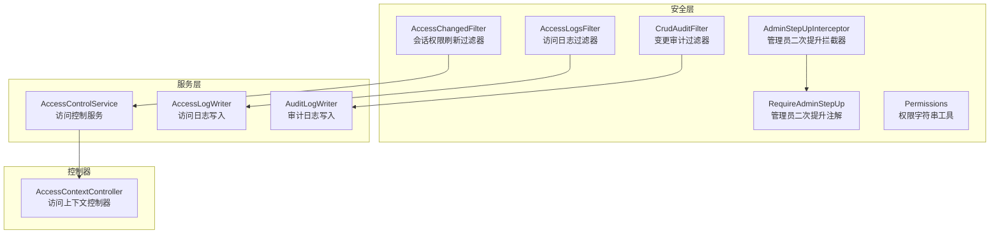

**图示来源**
- [AccessLogsFilter.java:1-710](file://src/main/java/com/example/EnterpriseRagCommunity/security/AccessLogsFilter.java#L1-L710)
- [CrudAuditFilter.java:1-304](file://src/main/java/com/example/EnterpriseRagCommunity/security/CrudAuditFilter.java#L1-L304)
- [AccessChangedFilter.java:1-154](file://src/main/java/com/example/EnterpriseRagCommunity/security/AccessChangedFilter.java#L1-L154)
- [RequireAdminStepUp.java:1-12](file://src/main/java/com/example/EnterpriseRagCommunity/security/stepup/RequireAdminStepUp.java#L1-L12)
- [AdminStepUpInterceptor.java:1-25](file://src/main/java/com/example/EnterpriseRagCommunity/security/stepup/AdminStepUpInterceptor.java#L1-L25)
- [Permissions.java:1-25](file://src/main/java/com/example/EnterpriseRagCommunity/security/Permissions.java#L1-L25)
- [AccessControlService.java:1-222](file://src/main/java/com/example/EnterpriseRagCommunity/service/access/AccessControlService.java#L1-L222)
- [AccessContextController.java:1-60](file://src/main/java/com/example/EnterpriseRagCommunity/controller/access/AccessContextController.java#L1-L60)
- [AccessLogWriter.java:1-71](file://src/main/java/com/example/EnterpriseRagCommunity/service/access/AccessLogWriter.java#L1-L71)
- [AuditLogWriter.java:1-151](file://src/main/java/com/example/EnterpriseRagCommunity/service/access/AuditLogWriter.java#L1-L151)

**章节来源**
- [AccessLogsFilter.java:1-710](file://src/main/java/com/example/EnterpriseRagCommunity/security/AccessLogsFilter.java#L1-L710)
- [CrudAuditFilter.java:1-304](file://src/main/java/com/example/EnterpriseRagCommunity/security/CrudAuditFilter.java#L1-L304)
- [AccessChangedFilter.java:1-154](file://src/main/java/com/example/EnterpriseRagCommunity/security/AccessChangedFilter.java#L1-L154)
- [AccessControlService.java:1-222](file://src/main/java/com/example/EnterpriseRagCommunity/service/access/AccessControlService.java#L1-L222)
- [AccessContextController.java:1-60](file://src/main/java/com/example/EnterpriseRagCommunity/controller/access/AccessContextController.java#L1-L60)
- [AccessLogWriter.java:1-71](file://src/main/java/com/example/EnterpriseRagCommunity/service/access/AccessLogWriter.java#L1-L71)
- [AuditLogWriter.java:1-151](file://src/main/java/com/example/EnterpriseRagCommunity/service/access/AuditLogWriter.java#L1-L151)
- [Permissions.java:1-25](file://src/main/java/com/example/EnterpriseRagCommunity/security/Permissions.java#L1-L25)
- [RequireAdminStepUp.java:1-12](file://src/main/java/com/example/EnterpriseRagCommunity/security/stepup/RequireAdminStepUp.java#L1-L12)
- [AdminStepUpInterceptor.java:1-25](file://src/main/java/com/example/EnterpriseRagCommunity/security/stepup/AdminStepUpInterceptor.java#L1-L25)

## 核心组件
- 基于资源的访问控制（RBAC）
  - 权限与角色模型：用户-角色-角色权限-权限四层映射，支持作用域后缀（全局或按类型+ID）
  - 权限构建：一次性事务内加载用户角色与权限，生成标准 Spring Security 权威集合（ROLE_*、ROLE_ID_*、PERM_*）
- 板块 ACL 权限控制
  - 通过板块版主关系、帖子归属、队列项类型进行细粒度校验
- 访问日志与审计日志
  - 访问日志过滤器：请求/响应体捕获、敏感信息脱敏、请求头快照、IP 解析、超时截断、缓存命中统计
  - 变更审计过滤器：自动 CRUD 行为识别、实体类型与 ID 推导、结果判定、异常与耗时记录
  - 日志写入服务：统一持久化入口，确保字段规范化与默认值填充
- 管理员二次提升
  - 注解声明需要更高强度认证的接口；拦截器在会话中检查时间窗，超时则拒绝或引导完成二次提升
- 访问上下文与控制器
  - 暴露当前用户的角色与权限清单，兼容多种权威前缀风格

**章节来源**
- [AccessControlService.java:1-222](file://src/main/java/com/example/EnterpriseRagCommunity/service/access/AccessControlService.java#L1-L222)
- [BoardAcl.java:1-60](file://src/main/java/com/example/EnterpriseRagCommunity/security/BoardAcl.java#L1-L60)
- [AccessLogsFilter.java:1-710](file://src/main/java/com/example/EnterpriseRagCommunity/security/AccessLogsFilter.java#L1-L710)
- [CrudAuditFilter.java:1-304](file://src/main/java/com/example/EnterpriseRagCommunity/security/CrudAuditFilter.java#L1-L304)
- [AccessLogWriter.java:1-71](file://src/main/java/com/example/EnterpriseRagCommunity/service/access/AccessLogWriter.java#L1-L71)
- [AuditLogWriter.java:1-151](file://src/main/java/com/example/EnterpriseRagCommunity/service/access/AuditLogWriter.java#L1-L151)
- [RequireAdminStepUp.java:1-12](file://src/main/java/com/example/EnterpriseRagCommunity/security/stepup/RequireAdminStepUp.java#L1-L12)
- [AdminStepUpInterceptor.java:1-25](file://src/main/java/com/example/EnterpriseRagCommunity/security/stepup/AdminStepUpInterceptor.java#L1-L25)
- [AccessContextController.java:1-60](file://src/main/java/com/example/EnterpriseRagCommunity/controller/access/AccessContextController.java#L1-L60)

## 架构总览
访问控制由“过滤器/拦截器 + 服务 + 控制器”三层协同构成：
- 过滤器层负责请求生命周期内的日志采集与权限刷新
- 服务层负责权限计算与日志落库
- 控制器层对外暴露访问上下文查询能力

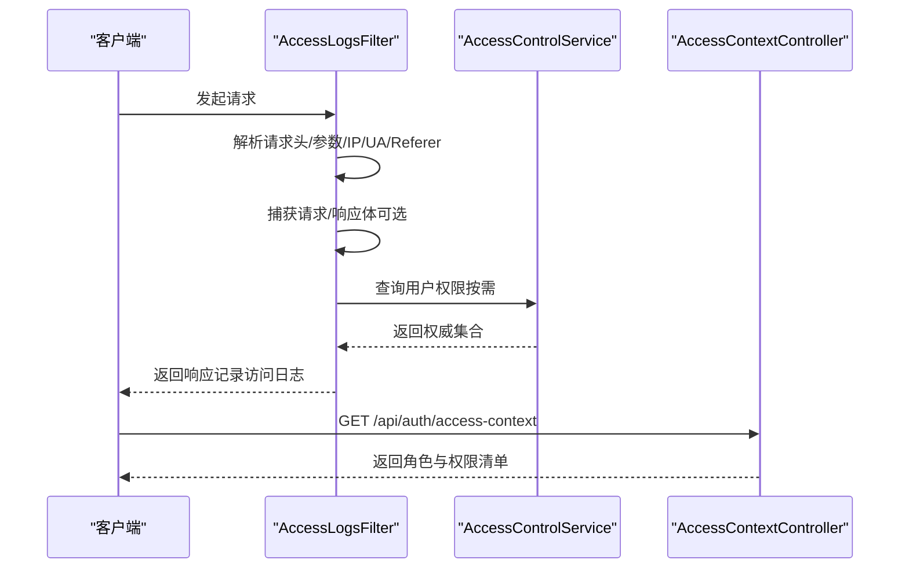

**图示来源**
- [AccessLogsFilter.java:84-213](file://src/main/java/com/example/EnterpriseRagCommunity/security/AccessLogsFilter.java#L84-L213)
- [AccessControlService.java:62-118](file://src/main/java/com/example/EnterpriseRagCommunity/service/access/AccessControlService.java#L62-L118)
- [AccessContextController.java:23-58](file://src/main/java/com/example/EnterpriseRagCommunity/controller/access/AccessContextController.java#L23-L58)

## 组件详解

### 基于资源的访问控制（RBAC）
- 权限与角色
  - 用户拥有多个角色，角色可带作用域（全局或按类型+ID），最终合并为允许/拒绝集合
  - 支持“先拒后允”策略，优先剔除拒绝项
- 权限键生成
  - 资源:动作 键，支持作用域后缀
- 权限字符串工具
  - 提供便捷方法生成标准权限键与带作用域键

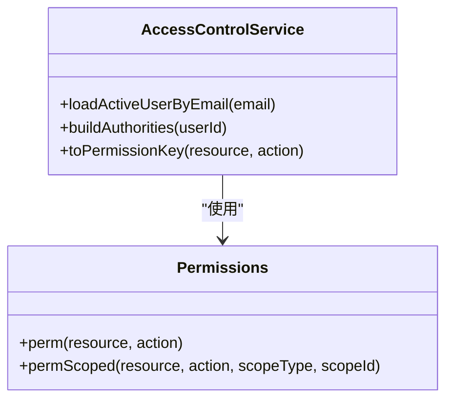

**图示来源**
- [AccessControlService.java:35-221](file://src/main/java/com/example/EnterpriseRagCommunity/service/access/AccessControlService.java#L35-L221)
- [Permissions.java:13-22](file://src/main/java/com/example/EnterpriseRagCommunity/security/Permissions.java#L13-L22)

**章节来源**
- [AccessControlService.java:52-221](file://src/main/java/com/example/EnterpriseRagCommunity/service/access/AccessControlService.java#L52-L221)
- [Permissions.java:8-25](file://src/main/java/com/example/EnterpriseRagCommunity/security/Permissions.java#L8-L25)

### 板块 ACL 权限控制
- 版主校验：根据板块 ID 判断是否为版主
- 帖子校验：根据帖子归属板块推导
- 队列项校验：根据内容类型（帖子/评论）与关联对象推导

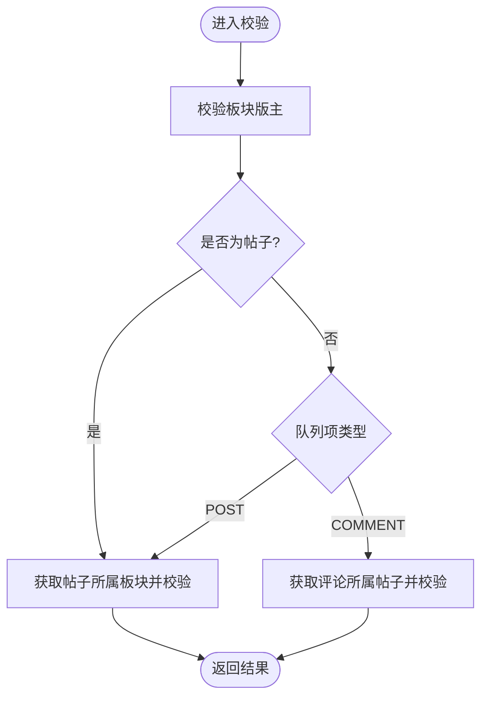

**图示来源**
- [BoardAcl.java:24-51](file://src/main/java/com/example/EnterpriseRagCommunity/security/BoardAcl.java#L24-L51)

**章节来源**
- [BoardAcl.java:1-60](file://src/main/java/com/example/EnterpriseRagCommunity/security/BoardAcl.java#L1-L60)

### 访问日志过滤器（AccessLogsFilter）
- 功能要点
  - 请求/响应体捕获与截断（最大字节限制）
  - 敏感信息脱敏（URL 查询串、请求/响应体 JSON/表单）
  - 请求头快照与 IP 解析（支持 Forwarded/X-Forwarded-For/X-Real-IP）
  - 会话 ID 哈希、请求追踪（X-Request-Id/X-Trace-Id）
  - 排除特定路径前缀（如管理端日志查询）
  - 用户 ID 缓存（避免重复查询）
- 性能与安全
  - 仅对非静态/非二进制/非 SSE 的请求/响应进行捕获
  - 严格限制最大捕获字节数，防止内存膨胀
  - 对敏感字段进行掩码处理

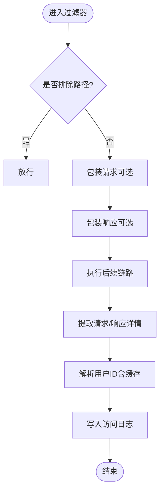

**图示来源**
- [AccessLogsFilter.java:72-213](file://src/main/java/com/example/EnterpriseRagCommunity/security/AccessLogsFilter.java#L72-L213)

**章节来源**
- [AccessLogsFilter.java:46-213](file://src/main/java/com/example/EnterpriseRagCommunity/security/AccessLogsFilter.java#L46-L213)

### 变更审计过滤器（CrudAuditFilter）
- 自动 CRUD 识别：根据 HTTP 方法与路径推断读/增/改/删
- 实体类型与 ID 推导：从路径段或参数中提取
- 结果判定：成功/失败（依据状态码与异常）
- 可配置包含/排除路径前缀，支持包含读操作

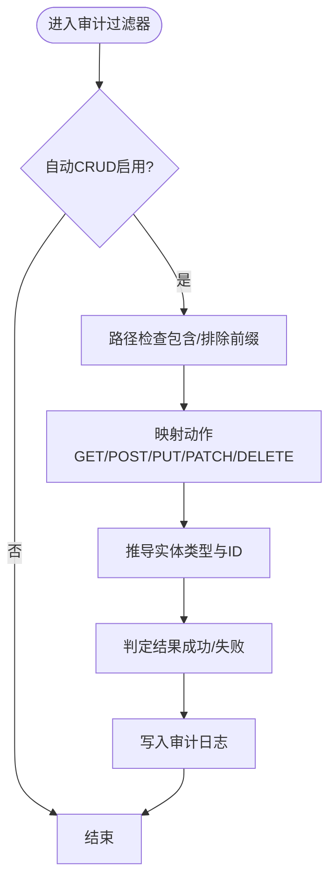

**图示来源**
- [CrudAuditFilter.java:58-128](file://src/main/java/com/example/EnterpriseRagCommunity/security/CrudAuditFilter.java#L58-L128)

**章节来源**
- [CrudAuditFilter.java:35-128](file://src/main/java/com/example/EnterpriseRagCommunity/security/CrudAuditFilter.java#L35-L128)

### 会话权限刷新过滤器（AccessChangedFilter）
- 场景
  - 基于 Session 的认证，权限在登录时固化到会话
  - 当管理员调整角色-权限或用户-角色映射后，现有会话可能持有过期权限
- 策略
  - 在会话中维护“访问版本号”与“失效时间戳”
  - 定期检查数据库元数据变化，必要时重建权威集合并替换当前 SecurityContext 中的认证信息
  - 若检测到会话被强制失效，则返回 401 并提示重新登录

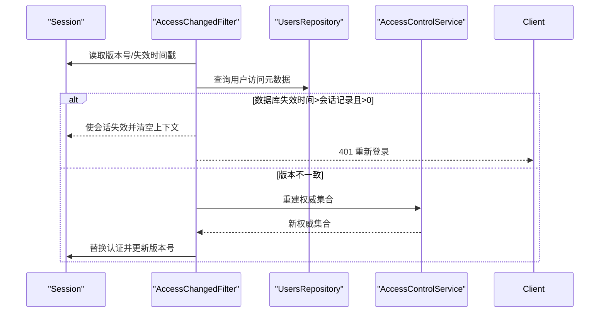

**图示来源**
- [AccessChangedFilter.java:54-152](file://src/main/java/com/example/EnterpriseRagCommunity/security/AccessChangedFilter.java#L54-L152)

**章节来源**
- [AccessChangedFilter.java:35-152](file://src/main/java/com/example/EnterpriseRagCommunity/security/AccessChangedFilter.java#L35-L152)

### 管理员二次提升（注解与拦截器）
- 注解
  - 声明某接口/类需要管理员“二次提升”，并设置有效期（秒）
- 拦截器
  - 在会话中检查“允许提升至的时间点”，若未达到则拒绝或引导完成二次提升

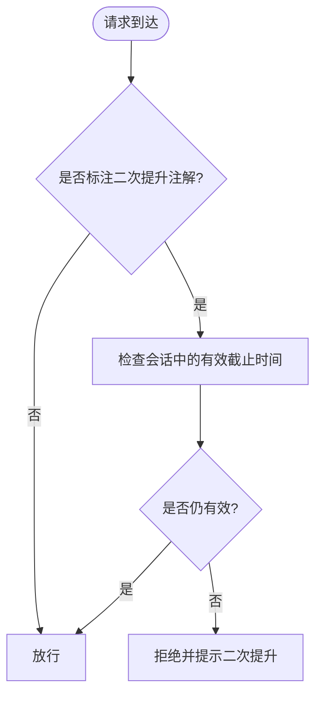

**图示来源**
- [RequireAdminStepUp.java:8-12](file://src/main/java/com/example/EnterpriseRagCommunity/security/stepup/RequireAdminStepUp.java#L8-L12)
- [AdminStepUpInterceptor.java:17-25](file://src/main/java/com/example/EnterpriseRagCommunity/security/stepup/AdminStepUpInterceptor.java#L17-L25)

**章节来源**
- [RequireAdminStepUp.java:1-12](file://src/main/java/com/example/EnterpriseRagCommunity/security/stepup/RequireAdminStepUp.java#L1-L12)
- [AdminStepUpInterceptor.java:1-25](file://src/main/java/com/example/EnterpriseRagCommunity/security/stepup/AdminStepUpInterceptor.java#L1-L25)

### 访问上下文控制器（AccessContextController）
- 接口
  - GET /api/auth/access-context
- 行为
  - 返回当前用户的邮箱、角色列表（去 ROLE_ID 前缀）、权限列表（去 PERM 前缀）
  - 兼容旧风格权威标识

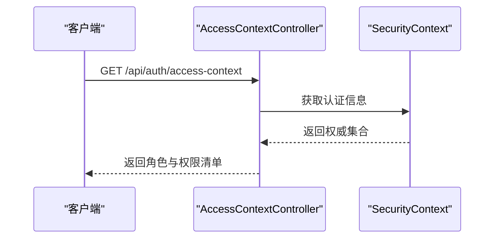

**图示来源**
- [AccessContextController.java:23-58](file://src/main/java/com/example/EnterpriseRagCommunity/controller/access/AccessContextController.java#L23-L58)

**章节来源**
- [AccessContextController.java:15-60](file://src/main/java/com/example/EnterpriseRagCommunity/controller/access/AccessContextController.java#L15-L60)

### 访问日志与审计日志写入服务
- 访问日志写入
  - 统一构造实体并保存，填充默认值与时间戳
- 审计日志写入
  - 合并请求上下文（IP、请求ID、UA、路径等）
  - 敏感字段与消息内容脱敏，保持现有管理端 UI 兼容

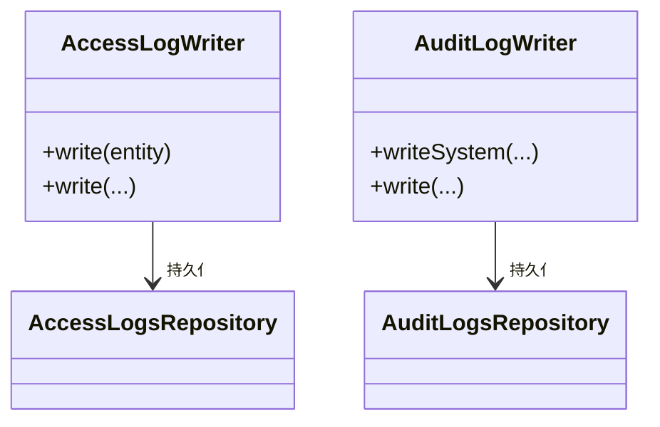

**图示来源**
- [AccessLogWriter.java:17-68](file://src/main/java/com/example/EnterpriseRagCommunity/service/access/AccessLogWriter.java#L17-L68)
- [AuditLogWriter.java:43-87](file://src/main/java/com/example/EnterpriseRagCommunity/service/access/AuditLogWriter.java#L43-L87)

**章节来源**
- [AccessLogWriter.java:1-71](file://src/main/java/com/example/EnterpriseRagCommunity/service/access/AccessLogWriter.java#L1-L71)
- [AuditLogWriter.java:1-151](file://src/main/java/com/example/EnterpriseRagCommunity/service/access/AuditLogWriter.java#L1-L151)

## 依赖关系分析
- 组件耦合
  - 过滤器依赖服务与仓储以解析用户与权限
  - 控制器依赖认证上下文展示权威集合
  - 写入服务依赖对应仓库进行持久化
- 外部集成
  - 日志写入依赖数据库存储与索引（迁移脚本包含访问日志查询索引）
- 循环依赖
  - 未发现直接循环依赖；过滤器与服务通过接口解耦

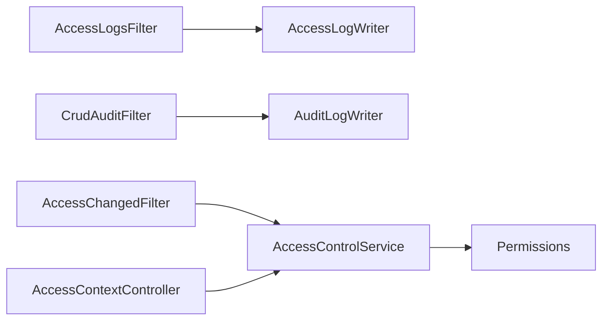

**图示来源**
- [AccessLogsFilter.java:52-53](file://src/main/java/com/example/EnterpriseRagCommunity/security/AccessLogsFilter.java#L52-L53)
- [CrudAuditFilter.java:37-38](file://src/main/java/com/example/EnterpriseRagCommunity/security/CrudAuditFilter.java#L37-L38)
- [AccessChangedFilter.java:45-46](file://src/main/java/com/example/EnterpriseRagCommunity/security/AccessChangedFilter.java#L45-L46)
- [AccessContextController.java:1-60](file://src/main/java/com/example/EnterpriseRagCommunity/controller/access/AccessContextController.java#L1-L60)
- [AccessControlService.java:39-43](file://src/main/java/com/example/EnterpriseRagCommunity/service/access/AccessControlService.java#L39-L43)
- [Permissions.java:1-25](file://src/main/java/com/example/EnterpriseRagCommunity/security/Permissions.java#L1-L25)

**章节来源**
- [AccessLogsFilter.java:44-53](file://src/main/java/com/example/EnterpriseRagCommunity/security/AccessLogsFilter.java#L44-L53)
- [CrudAuditFilter.java:34-38](file://src/main/java/com/example/EnterpriseRagCommunity/security/CrudAuditFilter.java#L34-L38)
- [AccessChangedFilter.java:37-46](file://src/main/java/com/example/EnterpriseRagCommunity/security/AccessChangedFilter.java#L37-L46)
- [AccessContextController.java:1-60](file://src/main/java/com/example/EnterpriseRagCommunity/controller/access/AccessContextController.java#L1-L60)
- [AccessControlService.java:39-43](file://src/main/java/com/example/EnterpriseRagCommunity/service/access/AccessControlService.java#L39-L43)
- [Permissions.java:1-25](file://src/main/java/com/example/EnterpriseRagCommunity/security/Permissions.java#L1-L25)

## 性能考量
- 请求/响应体捕获
  - 仅对文本类、非二进制、非流式响应进行捕获，避免大体积负载
  - 通过最大字节限制与截断策略控制内存占用
- 用户 ID 缓存
  - 使用 TTL 缓存用户名到用户 ID 的映射，降低重复查询
- 权限构建
  - 单事务内批量加载用户角色与权限，减少 N+1 查询
- 过滤器链顺序
  - 审计过滤器具有较高优先级，确保在链路末端补写日志
- 数据库索引
  - 访问日志查询索引已在迁移脚本中定义，建议结合实际查询模式持续优化

[本节为通用性能建议，无需特定文件引用]

## 故障排查指南
- 访问日志缺失
  - 检查是否命中排除路径前缀
  - 确认捕获开关与最大字节配置
  - 查看请求/响应是否为二进制或 SSE 类型
- 审计日志未记录
  - 确认自动 CRUD 开关与包含/排除前缀配置
  - 检查是否已手动写入审计日志导致跳过自动记录
- 权限不生效或过期
  - 管理员修改角色/权限或用户角色映射后，现有会话可能保留旧权威
  - 检查会话中的版本号与失效时间戳，必要时触发权限刷新
- 二次提升未生效
  - 确认注解配置与拦截器逻辑
  - 检查会话中“允许提升至的时间点”是否已过期

**章节来源**
- [AccessLogsFilter.java:73-81](file://src/main/java/com/example/EnterpriseRagCommunity/security/AccessLogsFilter.java#L73-L81)
- [CrudAuditFilter.java:130-140](file://src/main/java/com/example/EnterpriseRagCommunity/security/CrudAuditFilter.java#L130-L140)
- [AccessChangedFilter.java:93-133](file://src/main/java/com/example/EnterpriseRagCommunity/security/AccessChangedFilter.java#L93-L133)
- [AdminStepUpInterceptor.java:17-25](file://src/main/java/com/example/EnterpriseRagCommunity/security/stepup/AdminStepUpInterceptor.java#L17-L25)

## 结论
该访问控制系统通过 RBAC 与板块 ACL 实现细粒度权限控制，配合访问日志与审计日志过滤器形成完整的可观测性闭环；会话权限刷新过滤器保障权限变更的及时生效；管理员二次提升机制在高风险操作上提供了额外的安全保障。整体设计兼顾安全性与性能，适合在生产环境中稳定运行。

[本节为总结性内容，无需特定文件引用]

## 附录API 规范

### 访问上下文控制器
- 路径
  - GET /api/auth/access-context
- 成功响应
  - 字段
    - email: 当前用户邮箱
    - roles: 角色名称数组（去前缀）
    - permissions: 权限键数组（去前缀）
- 示例
  - 返回示例字段结构（不含具体值）：email、roles、permissions

**章节来源**
- [AccessContextController.java:23-58](file://src/main/java/com/example/EnterpriseRagCommunity/controller/access/AccessContextController.java#L23-L58)

### 管理员二次提升
- 注解
  - @RequireAdminStepUp
    - 参数：ttlSeconds（默认 600 秒）
- 拦截器行为
  - 读取会话中的“允许提升至的时间点”，若已过期则拒绝或引导完成二次提升

**章节来源**
- [RequireAdminStepUp.java:8-12](file://src/main/java/com/example/EnterpriseRagCommunity/security/stepup/RequireAdminStepUp.java#L8-L12)
- [AdminStepUpInterceptor.java:17-25](file://src/main/java/com/example/EnterpriseRagCommunity/security/stepup/AdminStepUpInterceptor.java#L17-L25)