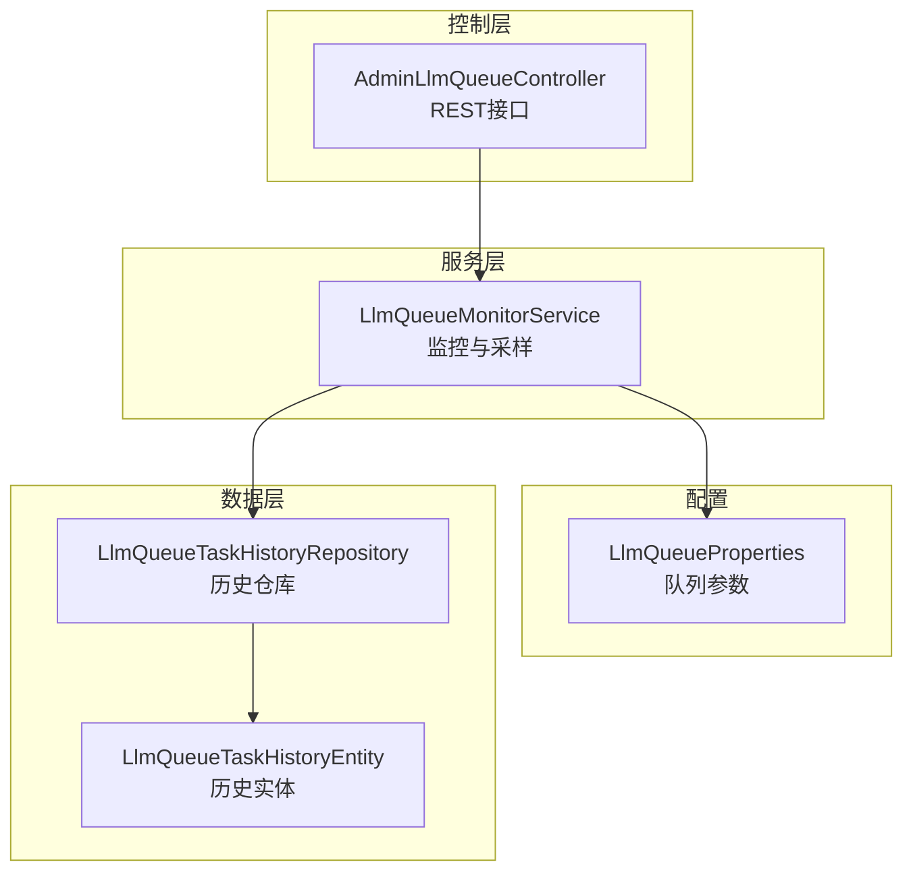
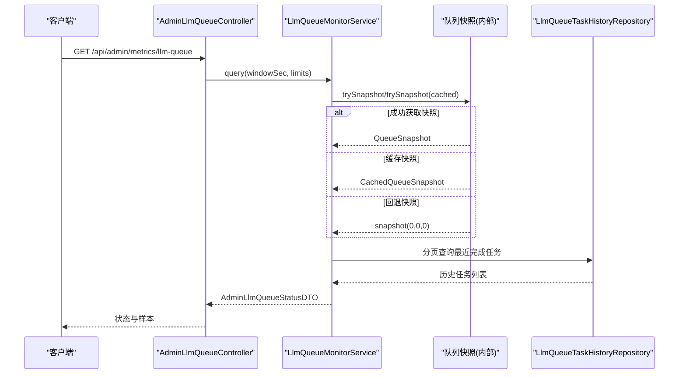
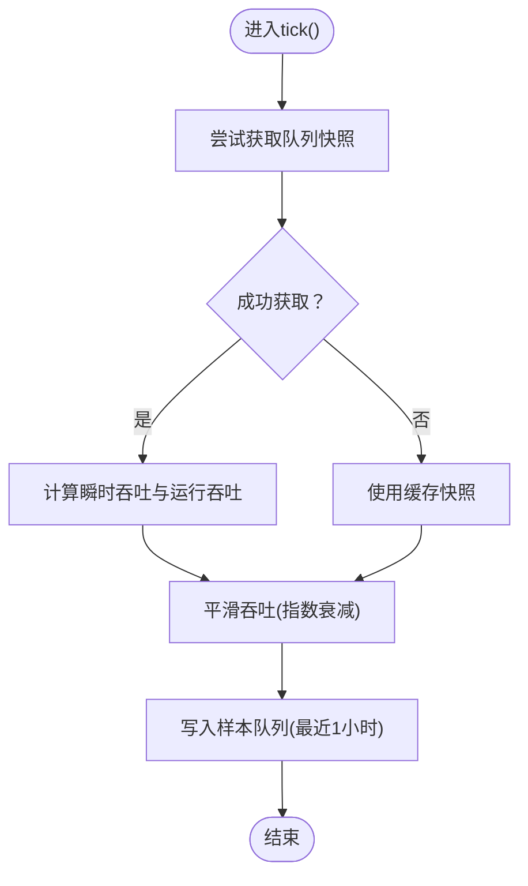
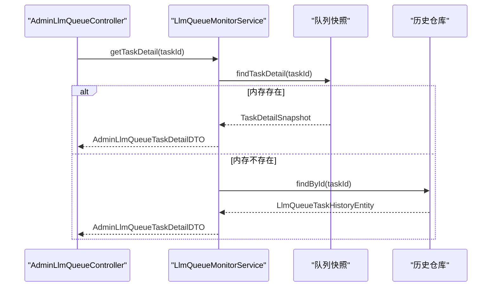
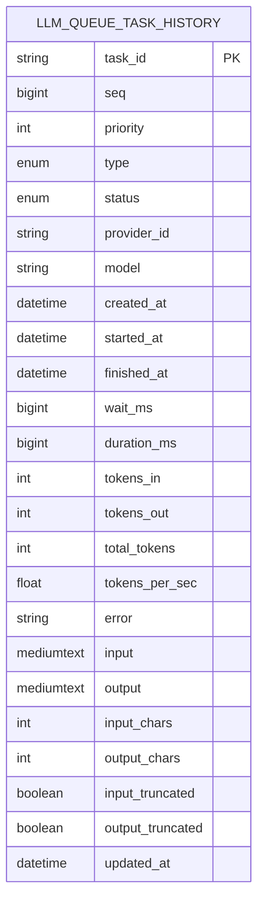
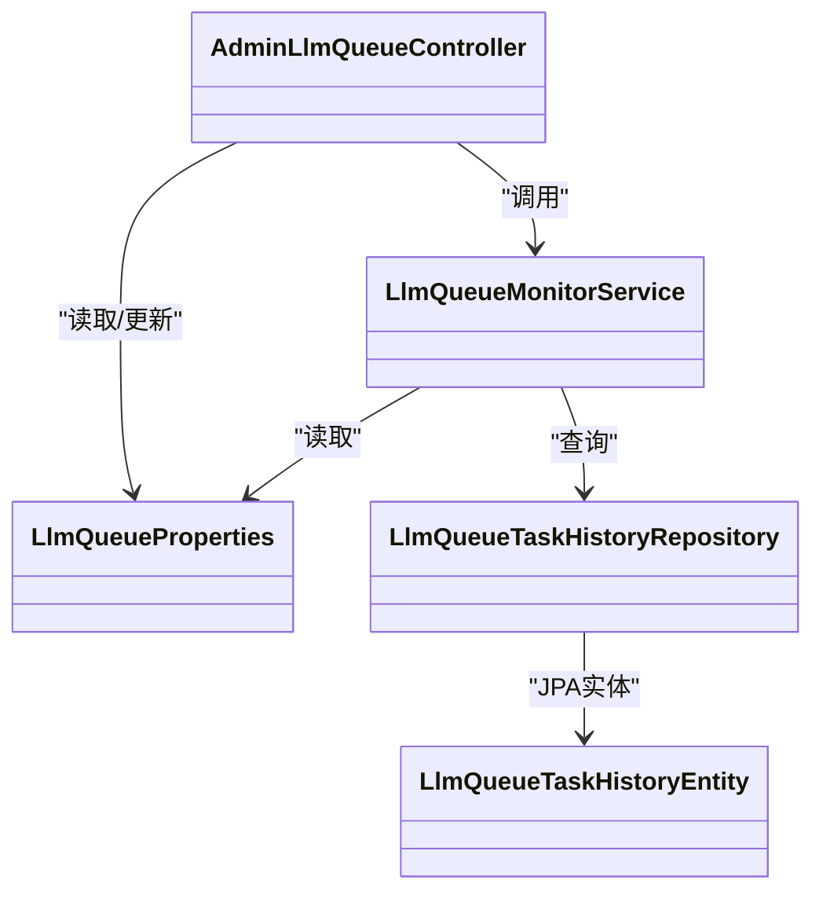

# LLM队列管理

<cite>
**本文引用的文件**
- [LlmQueueProperties.java](file://src/main/java/com/example/EnterpriseRagCommunity/config/LlmQueueProperties.java)
- [AdminLlmQueueController.java](file://src/main/java/com/example/EnterpriseRagCommunity/controller/monitor/admin/AdminLlmQueueController.java)
- [LlmQueueMonitorService.java](file://src/main/java/com/example/EnterpriseRagCommunity/service/monitor/LlmQueueMonitorService.java)
- [AdminLlmQueueStatusDTO.java](file://src/main/java/com/example/EnterpriseRagCommunity/dto/monitor/AdminLlmQueueStatusDTO.java)
- [AdminLlmQueueTaskDTO.java](file://src/main/java/com/example/EnterpriseRagCommunity/dto/monitor/AdminLlmQueueTaskDTO.java)
- [AdminLlmQueueTaskDetailDTO.java](file://src/main/java/com/example/EnterpriseRagCommunity/dto/monitor/AdminLlmQueueTaskDetailDTO.java)
- [AdminLlmQueueSampleDTO.java](file://src/main/java/com/example/EnterpriseRagCommunity/dto/monitor/AdminLlmQueueSampleDTO.java)
- [AdminLlmQueueConfigDTO.java](file://src/main/java/com/example/EnterpriseRagCommunity/dto/monitor/AdminLlmQueueConfigDTO.java)
- [LlmQueueTaskHistoryEntity.java](file://src/main/java/com/example/EnterpriseRagCommunity/entity/monitor/LlmQueueTaskHistoryEntity.java)
- [LlmQueueTaskHistoryRepository.java](file://src/main/java/com/example/EnterpriseRagCommunity/repository/monitor/LlmQueueTaskHistoryRepository.java)
</cite>

## 目录
1. [引言](#引言)
2. [项目结构](#项目结构)
3. [核心组件](#核心组件)
4. [架构总览](#架构总览)
5. [详细组件分析](#详细组件分析)
6. [依赖关系分析](#依赖关系分析)
7. [性能考量](#性能考量)
8. [故障排查指南](#故障排查指南)
9. [结论](#结论)
10. [附录](#附录)

## 引言
本文件面向LLM队列管理系统的使用者与维护者，系统性阐述队列状态监控、任务执行跟踪、性能采样与统计、配置管理、任务生命周期与历史清理等能力。文档以代码为依据，结合架构图与流程图，帮助读者快速理解并正确使用该系统。

## 项目结构
LLM队列管理相关模块主要分布在以下包中：
- 配置：应用级队列参数（并发、队列容量、完成保留数、历史保留天数）
- 控制层：对外暴露队列状态查询、任务详情查询、配置读取与更新
- 服务层：队列监控与采样、最近完成任务合并、缓存与数据库回退
- DTO：监控输出、任务明细、配置对象
- 实体与仓库：队列任务历史持久化与清理

图表来源
- [AdminLlmQueueController.java:1-79](file://src/main/java/com/example/EnterpriseRagCommunity/controller/monitor/admin/AdminLlmQueueController.java#L1-L79)
- [LlmQueueMonitorService.java:1-397](file://src/main/java/com/example/EnterpriseRagCommunity/service/monitor/LlmQueueMonitorService.java#L1-L397)
- [LlmQueueProperties.java:1-16](file://src/main/java/com/example/EnterpriseRagCommunity/config/LlmQueueProperties.java#L1-L16)
- [LlmQueueTaskHistoryRepository.java:1-17](file://src/main/java/com/example/EnterpriseRagCommunity/repository/monitor/LlmQueueTaskHistoryRepository.java#L1-L17)
- [LlmQueueTaskHistoryEntity.java:1-100](file://src/main/java/com/example/EnterpriseRagCommunity/entity/monitor/LlmQueueTaskHistoryEntity.java#L1-L100)

章节来源
- [AdminLlmQueueController.java:1-79](file://src/main/java/com/example/EnterpriseRagCommunity/controller/monitor/admin/AdminLlmQueueController.java#L1-L79)
- [LlmQueueMonitorService.java:1-397](file://src/main/java/com/example/EnterpriseRagCommunity/service/monitor/LlmQueueMonitorService.java#L1-L397)
- [LlmQueueProperties.java:1-16](file://src/main/java/com/example/EnterpriseRagCommunity/config/LlmQueueProperties.java#L1-L16)
- [LlmQueueTaskHistoryRepository.java:1-17](file://src/main/java/com/example/EnterpriseRagCommunity/repository/monitor/LlmQueueTaskHistoryRepository.java#L1-L17)
- [LlmQueueTaskHistoryEntity.java:1-100](file://src/main/java/com/example/EnterpriseRagCommunity/entity/monitor/LlmQueueTaskHistoryEntity.java#L1-L100)

## 核心组件
- 队列配置管理：通过配置类集中管理最大并发、队列大小、完成任务保留数量、历史保留天数
- 队列监控服务：定时采样、平滑计算吞吐、合并内存与数据库中的最近完成任务、生成时间序列样本
- 控制器：提供状态查询、任务详情、配置读取与更新接口
- 历史数据：持久化已完成任务，支持按截止时间清理

章节来源
- [LlmQueueProperties.java:1-16](file://src/main/java/com/example/EnterpriseRagCommunity/config/LlmQueueProperties.java#L1-L16)
- [LlmQueueMonitorService.java:1-397](file://src/main/java/com/example/EnterpriseRagCommunity/service/monitor/LlmQueueMonitorService.java#L1-L397)
- [AdminLlmQueueController.java:1-79](file://src/main/java/com/example/EnterpriseRagCommunity/controller/monitor/admin/AdminLlmQueueController.java#L1-L79)
- [LlmQueueTaskHistoryRepository.java:1-17](file://src/main/java/com/example/EnterpriseRagCommunity/repository/monitor/LlmQueueTaskHistoryRepository.java#L1-L17)

## 架构总览
下图展示从HTTP请求到队列快照、采样与历史查询的整体流程：

图表来源
- [AdminLlmQueueController.java:30-39](file://src/main/java/com/example/EnterpriseRagCommunity/controller/monitor/admin/AdminLlmQueueController.java#L30-L39)
- [LlmQueueMonitorService.java:152-203](file://src/main/java/com/example/EnterpriseRagCommunity/service/monitor/LlmQueueMonitorService.java#L152-L203)
- [LlmQueueTaskHistoryRepository.java:13-16](file://src/main/java/com/example/EnterpriseRagCommunity/repository/monitor/LlmQueueTaskHistoryRepository.java#L13-L16)

## 详细组件分析

### 组件A：队列配置管理
- 配置项
  - 最大并发：限制同时运行的任务数
  - 队列大小：等待队列的最大容量
  - 完成保留：内存中最近完成任务的保留数量
  - 历史保留天数：历史表清理的截止时间
- 控制器接口
  - 读取配置：GET /api/admin/metrics/llm-queue/config
  - 更新配置：PUT /api/admin/metrics/llm-queue/config（带参数校验与边界约束）

章节来源
- [LlmQueueProperties.java:10-15](file://src/main/java/com/example/EnterpriseRagCommunity/config/LlmQueueProperties.java#L10-L15)
- [AdminLlmQueueController.java:49-77](file://src/main/java/com/example/EnterpriseRagCommunity/controller/monitor/admin/AdminLlmQueueController.java#L49-L77)

### 组件B：队列监控与采样
- 采样与平滑
  - 每秒定时采样：队列长度、运行中任务数、瞬时吞吐
  - 平滑策略：在无新任务时对最近非零吞吐进行指数衰减
  - 时间序列：保存最近一小时样本，按窗口裁剪返回
- 快照与合并
  - 优先尝试获取最新快照；失败时使用缓存快照并标记stale
  - 合并最近完成任务：内存快照+数据库最近完成任务，按完成时间与序号排序并截断
- 缓存与回退
  - 最近完成任务列表缓存：带TTL，避免频繁查询数据库
  - 任务详情：优先从内存快照获取；缺失时回退到历史表

图表来源
- [LlmQueueMonitorService.java:57-120](file://src/main/java/com/example/EnterpriseRagCommunity/service/monitor/LlmQueueMonitorService.java#L57-L120)
- [LlmQueueMonitorService.java:122-150](file://src/main/java/com/example/EnterpriseRagCommunity/service/monitor/LlmQueueMonitorService.java#L122-L150)

章节来源
- [LlmQueueMonitorService.java:57-120](file://src/main/java/com/example/EnterpriseRagCommunity/service/monitor/LlmQueueMonitorService.java#L57-L120)
- [LlmQueueMonitorService.java:122-150](file://src/main/java/com/example/EnterpriseRagCommunity/service/monitor/LlmQueueMonitorService.java#L122-L150)
- [LlmQueueMonitorService.java:152-203](file://src/main/java/com/example/EnterpriseRagCommunity/service/monitor/LlmQueueMonitorService.java#L152-L203)
- [LlmQueueMonitorService.java:243-269](file://src/main/java/com/example/EnterpriseRagCommunity/service/monitor/LlmQueueMonitorService.java#L243-L269)
- [LlmQueueMonitorService.java:271-301](file://src/main/java/com/example/EnterpriseRagCommunity/service/monitor/LlmQueueMonitorService.java#L271-L301)

### 组件C：任务详情与历史回溯
- 任务详情优先从内存快照获取；若不存在，则回退到历史表
- 历史表清理：按完成时间早于截止时间的数据进行删除

图表来源
- [AdminLlmQueueController.java:41-47](file://src/main/java/com/example/EnterpriseRagCommunity/controller/monitor/admin/AdminLlmQueueController.java#L41-L47)
- [LlmQueueMonitorService.java:205-212](file://src/main/java/com/example/EnterpriseRagCommunity/service/monitor/LlmQueueMonitorService.java#L205-L212)
- [LlmQueueTaskHistoryRepository.java:12-16](file://src/main/java/com/example/EnterpriseRagCommunity/repository/monitor/LlmQueueTaskHistoryRepository.java#L12-L16)

章节来源
- [LlmQueueMonitorService.java:205-212](file://src/main/java/com/example/EnterpriseRagCommunity/service/monitor/LlmQueueMonitorService.java#L205-L212)
- [LlmQueueTaskHistoryRepository.java:12-16](file://src/main/java/com/example/EnterpriseRagCommunity/repository/monitor/LlmQueueTaskHistoryRepository.java#L12-L16)

### 组件D：数据模型与存储策略
- 历史实体字段覆盖任务全生命周期关键指标（创建/开始/结束时间、等待时长、耗时、token输入/输出/总计、吞吐、错误信息、输入输出内容与截断标记）
- 存储策略
  - 内存：运行中与最近完成任务的快照
  - 数据库：已完成任务的历史表，支持按截止时间清理

图表来源
- [LlmQueueTaskHistoryEntity.java:21-99](file://src/main/java/com/example/EnterpriseRagCommunity/entity/monitor/LlmQueueTaskHistoryEntity.java#L21-L99)

章节来源
- [LlmQueueTaskHistoryEntity.java:1-100](file://src/main/java/com/example/EnterpriseRagCommunity/entity/monitor/LlmQueueTaskHistoryEntity.java#L1-L100)
- [LlmQueueTaskHistoryRepository.java:13-16](file://src/main/java/com/example/EnterpriseRagCommunity/repository/monitor/LlmQueueTaskHistoryRepository.java#L13-L16)

## 依赖关系分析
- 控制器依赖监控服务与配置类
- 监控服务依赖队列快照、历史仓库与配置类
- 历史仓库依赖历史实体

图表来源
- [AdminLlmQueueController.java:27-28](file://src/main/java/com/example/EnterpriseRagCommunity/controller/monitor/admin/AdminLlmQueueController.java#L27-L28)
- [LlmQueueMonitorService.java:40-42](file://src/main/java/com/example/EnterpriseRagCommunity/service/monitor/LlmQueueMonitorService.java#L40-L42)
- [LlmQueueTaskHistoryRepository.java:12-16](file://src/main/java/com/example/EnterpriseRagCommunity/repository/monitor/LlmQueueTaskHistoryRepository.java#L12-L16)

章节来源
- [AdminLlmQueueController.java:27-28](file://src/main/java/com/example/EnterpriseRagCommunity/controller/monitor/admin/AdminLlmQueueController.java#L27-L28)
- [LlmQueueMonitorService.java:40-42](file://src/main/java/com/example/EnterpriseRagCommunity/service/monitor/LlmQueueMonitorService.java#L40-L42)
- [LlmQueueTaskHistoryRepository.java:12-16](file://src/main/java/com/example/EnterpriseRagCommunity/repository/monitor/LlmQueueTaskHistoryRepository.java#L12-L16)

## 性能考量
- 采样频率与窗口：每秒采样，样本保留1小时；查询可指定窗口秒数
- 限流与截断：对运行、等待、完成三类列表设置上限，防止过度拉取
- 缓存策略：最近完成任务列表带TTL缓存，减少数据库压力
- 平滑吞吐：在无新任务时对最近非零吞吐进行指数衰减，避免误报峰值
- 查询优化：分页查询最近完成任务，限制单次最大条数

章节来源
- [LlmQueueMonitorService.java:33-38](file://src/main/java/com/example/EnterpriseRagCommunity/service/monitor/LlmQueueMonitorService.java#L33-L38)
- [LlmQueueMonitorService.java:57-120](file://src/main/java/com/example/EnterpriseRagCommunity/service/monitor/LlmQueueMonitorService.java#L57-L120)
- [LlmQueueMonitorService.java:152-203](file://src/main/java/com/example/EnterpriseRagCommunity/service/monitor/LlmQueueMonitorService.java#L152-L203)
- [LlmQueueMonitorService.java:271-301](file://src/main/java/com/example/EnterpriseRagCommunity/service/monitor/LlmQueueMonitorService.java#L271-L301)

## 故障排查指南
- 任务不存在或详情已清理
  - 现象：查询任务详情返回404
  - 原因：内存快照中无此任务，且历史表也未找到
  - 处理：确认任务ID是否正确；检查历史清理策略是否过短
- 状态显示stale
  - 现象：状态对象stale=true
  - 原因：未能获取最新快照，使用了缓存快照
  - 处理：检查队列服务可用性与锁竞争情况
- 吞吐为0或波动异常
  - 现象：吞吐为0或长时间保持非零后骤降
  - 原因：无新任务导致指数衰减归零
  - 处理：确认任务流量；检查平滑参数与窗口设置
- 配置更新无效
  - 现象：更新配置后仍使用旧值
  - 原因：参数越界被裁剪；或未生效
  - 处理：确保参数在允许范围内；重启或刷新配置

章节来源
- [AdminLlmQueueController.java:44-46](file://src/main/java/com/example/EnterpriseRagCommunity/controller/monitor/admin/AdminLlmQueueController.java#L44-L46)
- [LlmQueueMonitorService.java:165-180](file://src/main/java/com/example/EnterpriseRagCommunity/service/monitor/LlmQueueMonitorService.java#L165-L180)
- [LlmQueueMonitorService.java:122-150](file://src/main/java/com/example/EnterpriseRagCommunity/service/monitor/LlmQueueMonitorService.java#L122-L150)
- [AdminLlmQueueController.java:61-76](file://src/main/java/com/example/EnterpriseRagCommunity/controller/monitor/admin/AdminLlmQueueController.java#L61-L76)

## 结论
本系统通过“配置-监控-存储”三层协同，实现了对LLM队列的实时监控、性能采样与历史回溯。其设计兼顾了可观测性与性能：定时采样与平滑策略保证吞吐稳定呈现；内存与数据库双通道回退提升可用性；严格的限流与缓存降低资源消耗。建议在生产环境中结合业务流量特征调整配置，并定期评估历史保留策略与清理周期。

## 附录

### API接口规范
- 获取队列状态
  - 方法与路径：GET /api/admin/metrics/llm-queue
  - 权限：需要admin_metrics_llm_queue.read
  - 参数：
    - windowSec：窗口秒数，默认300，范围[10, 3600]
    - limitRunning：运行列表限制，默认50，上限500
    - limitPending：等待列表限制，默认200，上限2000
    - limitCompleted：完成列表限制，默认由配置决定，上限2000
  - 返回：AdminLlmQueueStatusDTO
- 获取任务详情
  - 方法与路径：GET /api/admin/metrics/llm-queue/tasks/{taskId}
  - 权限：需要admin_metrics_llm_queue.read
  - 返回：AdminLlmQueueTaskDetailDTO；不存在或已清理返回404
- 读取队列配置
  - 方法与路径：GET /api/admin/metrics/llm-queue/config
  - 权限：需要admin_metrics_llm_queue.read
  - 返回：AdminLlmQueueConfigDTO
- 更新队列配置
  - 方法与路径：PUT /api/admin/metrics/llm-queue/config
  - 权限：需要admin_metrics_llm_queue.write
  - 请求体：AdminLlmQueueConfigDTO（可选字段）
  - 校验与边界：
    - maxConcurrent：[1, 1024]
    - maxQueueSize：[100, 200000]
    - keepCompleted：[0, 20000]
  - 返回：当前配置

章节来源
- [AdminLlmQueueController.java:30-39](file://src/main/java/com/example/EnterpriseRagCommunity/controller/monitor/admin/AdminLlmQueueController.java#L30-L39)
- [AdminLlmQueueController.java:41-47](file://src/main/java/com/example/EnterpriseRagCommunity/controller/monitor/admin/AdminLlmQueueController.java#L41-L47)
- [AdminLlmQueueController.java:49-57](file://src/main/java/com/example/EnterpriseRagCommunity/controller/monitor/admin/AdminLlmQueueController.java#L49-L57)
- [AdminLlmQueueController.java:59-77](file://src/main/java/com/example/EnterpriseRagCommunity/controller/monitor/admin/AdminLlmQueueController.java#L59-L77)

### DTO与实体字段说明
- AdminLlmQueueStatusDTO
  - 字段：快照时间戳、stale标志、截断标志、最大并发、运行/等待计数、运行/等待/最近完成任务列表、时间序列样本
- AdminLlmQueueTaskDTO
  - 字段：任务ID、序号、优先级、类型、标签、状态、提供商/模型、创建/开始/结束时间、等待/耗时毫秒、token输入/输出/总计、吞吐、错误
- AdminLlmQueueTaskDetailDTO
  - 字段：同上，并包含输入/输出文本
- AdminLlmQueueSampleDTO
  - 字段：时间戳、队列长度、运行数、吞吐
- AdminLlmQueueConfigDTO
  - 字段：最大并发、队列大小、完成保留数
- LlmQueueTaskHistoryEntity
  - 字段：任务ID、序号、优先级、类型、状态、提供商/模型、时间戳、等待/耗时、token、吞吐、错误、输入/输出及截断标记、更新时间

章节来源
- [AdminLlmQueueStatusDTO.java:8-19](file://src/main/java/com/example/EnterpriseRagCommunity/dto/monitor/AdminLlmQueueStatusDTO.java#L8-L19)
- [AdminLlmQueueTaskDTO.java:10-29](file://src/main/java/com/example/EnterpriseRagCommunity/dto/monitor/AdminLlmQueueTaskDTO.java#L10-L29)
- [AdminLlmQueueTaskDetailDTO.java:10-31](file://src/main/java/com/example/EnterpriseRagCommunity/dto/monitor/AdminLlmQueueTaskDetailDTO.java#L10-L31)
- [AdminLlmQueueSampleDTO.java:8-13](file://src/main/java/com/example/EnterpriseRagCommunity/dto/monitor/AdminLlmQueueSampleDTO.java#L8-L13)
- [AdminLlmQueueConfigDTO.java:6-10](file://src/main/java/com/example/EnterpriseRagCommunity/dto/monitor/AdminLlmQueueConfigDTO.java#L6-L10)
- [LlmQueueTaskHistoryEntity.java:21-99](file://src/main/java/com/example/EnterpriseRagCommunity/entity/monitor/LlmQueueTaskHistoryEntity.java#L21-L99)