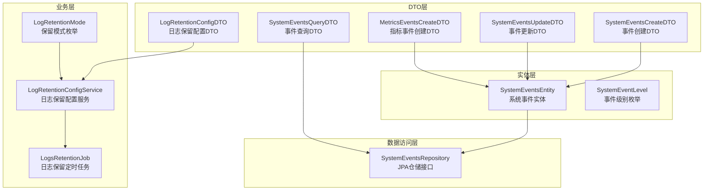
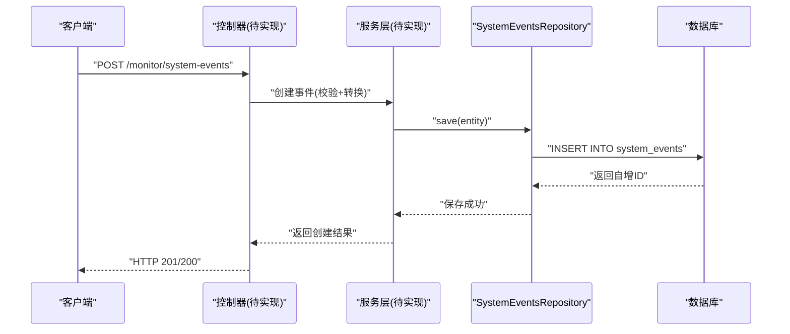
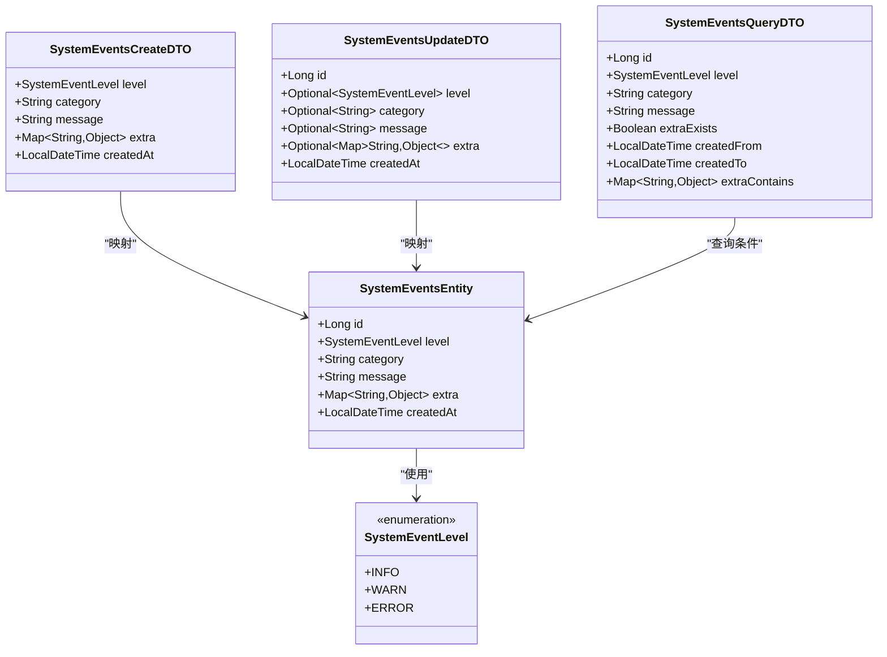
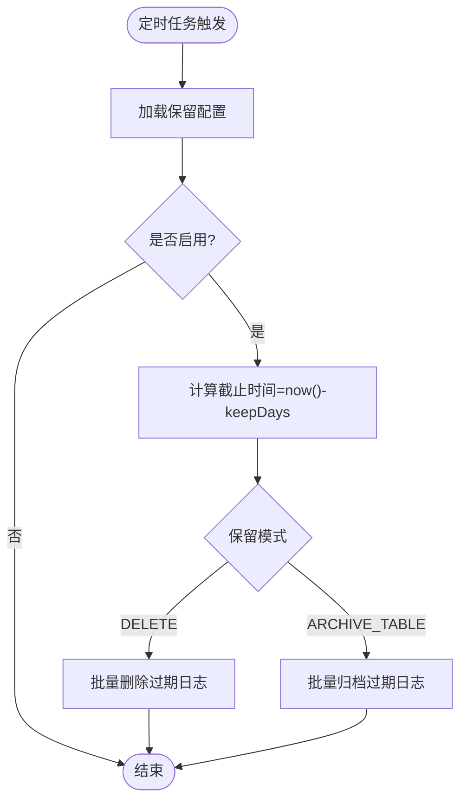
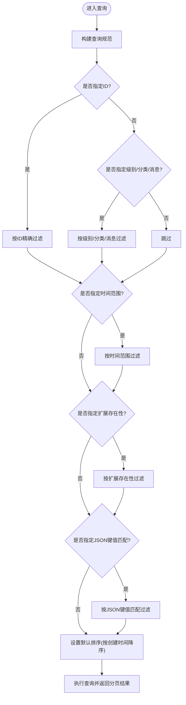
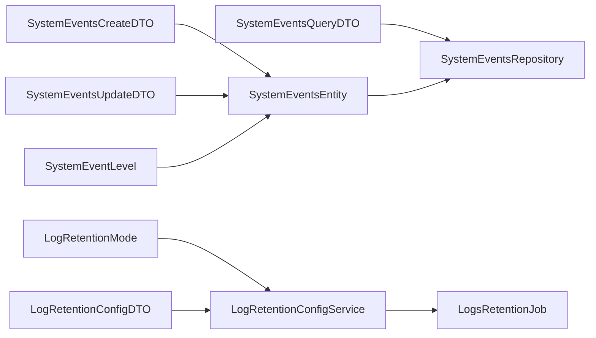

# 事件日志管理

<cite>
**本文引用的文件**
- [SystemEventsEntity.java](file://src/main/java/com/example/EnterpriseRagCommunity/entity/monitor/SystemEventsEntity.java)
- [SystemEventLevel.java](file://src/main/java/com/example/EnterpriseRagCommunity/entity/monitor/enums/SystemEventLevel.java)
- [SystemEventsCreateDTO.java](file://src/main/java/com/example/EnterpriseRagCommunity/dto/monitor/SystemEventsCreateDTO.java)
- [SystemEventsUpdateDTO.java](file://src/main/java/com/example/EnterpriseRagCommunity/dto/monitor/SystemEventsUpdateDTO.java)
- [SystemEventsQueryDTO.java](file://src/main/java/com/example/EnterpriseRagCommunity/dto/monitor/SystemEventsQueryDTO.java)
- [SystemEventsRepository.java](file://src/main/java/com/example/EnterpriseRagCommunity/repository/monitor/SystemEventsRepository.java)
- [LogRetentionConfigService.java](file://src/main/java/com/example/EnterpriseRagCommunity/service/monitor/LogRetentionConfigService.java)
- [LogRetentionMode.java](file://src/main/java/com/example/EnterpriseRagCommunity/service/monitor/LogRetentionMode.java)
- [LogsRetentionJob.java](file://src/main/java/com/example/EnterpriseRagCommunity/service/monitor/LogsRetentionJob.java)
- [LogRetentionConfigDTO.java](file://src/main/java/com/example/EnterpriseRagCommunity/dto/monitor/LogRetentionConfigDTO.java)
- [MetricsEventsCreateDTO.java](file://src/main/java/com/example/EnterpriseRagCommunity/dto/monitor/MetricsEventsCreateDTO.java)
</cite>

## 目录
1. [简介](#简介)
2. [项目结构](#项目结构)
3. [核心组件](#核心组件)
4. [架构总览](#架构总览)
5. [详细组件分析](#详细组件分析)
6. [依赖分析](#依赖分析)
7. [性能考虑](#性能考虑)
8. [故障排查指南](#故障排查指南)
9. [结论](#结论)
10. [附录](#附录)

## 简介
本文件面向事件日志管理系统，系统性阐述事件记录、查询与管理能力，覆盖事件类型分类、日志级别管理、事件过滤查询、事件记录机制、日志保留策略、事件分类标准、事件日志DTO数据结构、枚举类型定义、查询条件构建、API接口规范以及事件数据的存储策略、索引优化与批量处理机制。文档以仓库中现有代码为依据，确保描述与实现一致。

## 项目结构
事件日志管理涉及以下层次：
- 实体层：系统事件实体定义与枚举
- DTO层：事件创建、更新、查询与指标事件创建的请求/响应载体
- 数据访问层：基于Spring Data JPA的仓储接口
- 业务层：日志保留配置与定时清理作业
- 指标事件：独立的指标事件DTO用于度量场景

图表来源
- [SystemEventsEntity.java:1-40](file://src/main/java/com/example/EnterpriseRagCommunity/entity/monitor/SystemEventsEntity.java#L1-L40)
- [SystemEventLevel.java:1-7](file://src/main/java/com/example/EnterpriseRagCommunity/entity/monitor/enums/SystemEventLevel.java#L1-L7)
- [SystemEventsCreateDTO.java:1-36](file://src/main/java/com/example/EnterpriseRagCommunity/dto/monitor/SystemEventsCreateDTO.java#L1-L36)
- [SystemEventsUpdateDTO.java:1-38](file://src/main/java/com/example/EnterpriseRagCommunity/dto/monitor/SystemEventsUpdateDTO.java#L1-L38)
- [SystemEventsQueryDTO.java:1-42](file://src/main/java/com/example/EnterpriseRagCommunity/dto/monitor/SystemEventsQueryDTO.java#L1-L42)
- [SystemEventsRepository.java:1-11](file://src/main/java/com/example/EnterpriseRagCommunity/repository/monitor/SystemEventsRepository.java#L1-L11)
- [LogRetentionConfigService.java:1-53](file://src/main/java/com/example/EnterpriseRagCommunity/service/monitor/LogRetentionConfigService.java#L1-L53)
- [LogsRetentionJob.java:1-35](file://src/main/java/com/example/EnterpriseRagCommunity/service/monitor/LogsRetentionJob.java#L1-L35)
- [LogRetentionMode.java:1-6](file://src/main/java/com/example/EnterpriseRagCommunity/service/monitor/LogRetentionMode.java#L1-L6)
- [LogRetentionConfigDTO.java:1-10](file://src/main/java/com/example/EnterpriseRagCommunity/dto/monitor/LogRetentionConfigDTO.java#L1-L10)
- [MetricsEventsCreateDTO.java:1-30](file://src/main/java/com/example/EnterpriseRagCommunity/dto/monitor/MetricsEventsCreateDTO.java#L1-L30)

章节来源
- [SystemEventsEntity.java:1-40](file://src/main/java/com/example/EnterpriseRagCommunity/entity/monitor/SystemEventsEntity.java#L1-L40)
- [SystemEventsRepository.java:1-11](file://src/main/java/com/example/EnterpriseRagCommunity/repository/monitor/SystemEventsRepository.java#L1-L11)

## 核心组件
- 系统事件实体：承载事件主键、级别、分类、消息、附加JSON、创建时间等字段，使用字符串枚举存储事件级别，JSON字段存储扩展信息。
- 事件级别枚举：定义INFO、WARN、ERROR三档级别，用于统一事件严重程度标识。
- 事件DTO族：创建、更新、查询三类DTO，分别约束输入参数、可选字段与排序默认值；查询DTO继承分页基类，支持多维过滤与JSON键值匹配。
- 指标事件DTO：用于记录指标名称、标签（JSON Map）、数值与时间戳，便于度量场景的数据采集。
- 日志保留配置：通过应用设置读取/写入保留开关、保留天数与保留模式（归档或删除），并进行边界校验与默认值处理。
- 定时清理作业：按配置周期执行，对审计日志与访问日志进行批量清理或归档（当前系统事件未直接在定时任务中处理）。

章节来源
- [SystemEventsEntity.java:1-40](file://src/main/java/com/example/EnterpriseRagCommunity/entity/monitor/SystemEventsEntity.java#L1-L40)
- [SystemEventLevel.java:1-7](file://src/main/java/com/example/EnterpriseRagCommunity/entity/monitor/enums/SystemEventLevel.java#L1-L7)
- [SystemEventsCreateDTO.java:1-36](file://src/main/java/com/example/EnterpriseRagCommunity/dto/monitor/SystemEventsCreateDTO.java#L1-L36)
- [SystemEventsUpdateDTO.java:1-38](file://src/main/java/com/example/EnterpriseRagCommunity/dto/monitor/SystemEventsUpdateDTO.java#L1-L38)
- [SystemEventsQueryDTO.java:1-42](file://src/main/java/com/example/EnterpriseRagCommunity/dto/monitor/SystemEventsQueryDTO.java#L1-L42)
- [MetricsEventsCreateDTO.java:1-30](file://src/main/java/com/example/EnterpriseRagCommunity/dto/monitor/MetricsEventsCreateDTO.java#L1-L30)
- [LogRetentionConfigService.java:1-53](file://src/main/java/com/example/EnterpriseRagCommunity/service/monitor/LogRetentionConfigService.java#L1-L53)
- [LogsRetentionJob.java:1-35](file://src/main/java/com/example/EnterpriseRagCommunity/service/monitor/LogsRetentionJob.java#L1-L35)

## 架构总览
事件日志管理采用分层架构：
- 表现层：控制器负责接收请求并调用服务层
- 服务层：封装业务规则，如事件持久化、查询与日志保留策略
- 数据访问层：通过JPA仓储接口与数据库交互
- 存储层：MySQL表system_events存储事件数据，配合索引提升查询性能

图表来源
- [SystemEventsRepository.java:1-11](file://src/main/java/com/example/EnterpriseRagCommunity/repository/monitor/SystemEventsRepository.java#L1-L11)
- [SystemEventsEntity.java:1-40](file://src/main/java/com/example/EnterpriseRagCommunity/entity/monitor/SystemEventsEntity.java#L1-L40)

## 详细组件分析

### 系统事件实体与DTO
- 实体字段与约束
  - 主键：自增Long型ID
  - 级别：字符串枚举，非空
  - 分类：字符串，最大长度64，非空
  - 消息：字符串，最大长度255，非空
  - 扩展：JSON字段，存储Map<String,Object>，用于灵活扩展
  - 创建时间：非空，用于排序与筛选
- DTO设计
  - 创建DTO：必填级别、分类、消息；可选扩展；创建时间由后端生成
  - 更新DTO：必填ID；各字段均为可选，避免全量覆盖
  - 查询DTO：继承分页基类，提供ID、级别、分类、消息、扩展存在性、时间范围、JSON键值匹配等条件；默认按创建时间降序
- 关系图

图表来源
- [SystemEventsEntity.java:1-40](file://src/main/java/com/example/EnterpriseRagCommunity/entity/monitor/SystemEventsEntity.java#L1-L40)
- [SystemEventLevel.java:1-7](file://src/main/java/com/example/EnterpriseRagCommunity/entity/monitor/enums/SystemEventLevel.java#L1-L7)
- [SystemEventsCreateDTO.java:1-36](file://src/main/java/com/example/EnterpriseRagCommunity/dto/monitor/SystemEventsCreateDTO.java#L1-L36)
- [SystemEventsUpdateDTO.java:1-38](file://src/main/java/com/example/EnterpriseRagCommunity/dto/monitor/SystemEventsUpdateDTO.java#L1-L38)
- [SystemEventsQueryDTO.java:1-42](file://src/main/java/com/example/EnterpriseRagCommunity/dto/monitor/SystemEventsQueryDTO.java#L1-L42)

章节来源
- [SystemEventsEntity.java:1-40](file://src/main/java/com/example/EnterpriseRagCommunity/entity/monitor/SystemEventsEntity.java#L1-L40)
- [SystemEventsCreateDTO.java:1-36](file://src/main/java/com/example/EnterpriseRagCommunity/dto/monitor/SystemEventsCreateDTO.java#L1-L36)
- [SystemEventsUpdateDTO.java:1-38](file://src/main/java/com/example/EnterpriseRagCommunity/dto/monitor/SystemEventsUpdateDTO.java#L1-L38)
- [SystemEventsQueryDTO.java:1-42](file://src/main/java/com/example/EnterpriseRagCommunity/dto/monitor/SystemEventsQueryDTO.java#L1-L42)

### 日志保留策略与定时清理
- 配置项
  - 开关：启用/禁用日志保留
  - 保留天数：最小1天，最大3650天，超出范围自动裁剪
  - 保留模式：ARCHIVE_TABLE（归档表）或DELETE（删除）
- 定时任务
  - 默认每分钟执行一次（可配置cron）
  - 计算截止时间：当前时间减去保留天数
  - 对审计日志与访问日志进行批量处理（系统事件未直接在此任务中处理）

图表来源
- [LogsRetentionJob.java:1-35](file://src/main/java/com/example/EnterpriseRagCommunity/service/monitor/LogsRetentionJob.java#L1-L35)
- [LogRetentionConfigService.java:1-53](file://src/main/java/com/example/EnterpriseRagCommunity/service/monitor/LogRetentionConfigService.java#L1-L53)
- [LogRetentionMode.java:1-6](file://src/main/java/com/example/EnterpriseRagCommunity/service/monitor/LogRetentionMode.java#L1-L6)

章节来源
- [LogRetentionConfigService.java:1-53](file://src/main/java/com/example/EnterpriseRagCommunity/service/monitor/LogRetentionConfigService.java#L1-L53)
- [LogsRetentionJob.java:1-35](file://src/main/java/com/example/EnterpriseRagCommunity/service/monitor/LogsRetentionJob.java#L1-L35)
- [LogRetentionMode.java:1-6](file://src/main/java/com/example/EnterpriseRagCommunity/service/monitor/LogRetentionMode.java#L1-L6)

### 查询条件构建与过滤逻辑
- 支持的查询维度
  - 精确匹配：ID、级别、分类、消息
  - 时间范围：createdFrom、createdTo
  - 扩展字段存在性：extraExists
  - JSON键值匹配：extraContains（简单键值对）
- 排序与分页
  - 默认按创建时间降序
  - 继承分页基类，具备通用分页能力

图表来源
- [SystemEventsQueryDTO.java:1-42](file://src/main/java/com/example/EnterpriseRagCommunity/dto/monitor/SystemEventsQueryDTO.java#L1-L42)
- [SystemEventsRepository.java:1-11](file://src/main/java/com/example/EnterpriseRagCommunity/repository/monitor/SystemEventsRepository.java#L1-L11)

章节来源
- [SystemEventsQueryDTO.java:1-42](file://src/main/java/com/example/EnterpriseRagCommunity/dto/monitor/SystemEventsQueryDTO.java#L1-L42)
- [SystemEventsRepository.java:1-11](file://src/main/java/com/example/EnterpriseRagCommunity/repository/monitor/SystemEventsRepository.java#L1-L11)

### 指标事件数据模型
- 指标事件用于记录度量数据，包含指标名称、标签（JSON Map）、数值与时间戳
- 设计简洁，便于后续接入监控系统或时序数据库

章节来源
- [MetricsEventsCreateDTO.java:1-30](file://src/main/java/com/example/EnterpriseRagCommunity/dto/monitor/MetricsEventsCreateDTO.java#L1-L30)

## 依赖分析
- 实体与仓储
  - SystemEventsEntity依赖SystemEventLevel枚举
  - SystemEventsRepository继承JpaRepository与JpaSpecificationExecutor，提供分页与动态查询能力
- DTO与实体映射
  - Create/Update/Query DTO与SystemEventsEntity之间存在一对一映射关系，用于数据传输与持久化
- 业务与配置
  - LogRetentionConfigService读取应用设置并解析保留模式与天数
  - LogsRetentionJob根据配置执行清理或归档

图表来源
- [SystemEventsCreateDTO.java:1-36](file://src/main/java/com/example/EnterpriseRagCommunity/dto/monitor/SystemEventsCreateDTO.java#L1-L36)
- [SystemEventsUpdateDTO.java:1-38](file://src/main/java/com/example/EnterpriseRagCommunity/dto/monitor/SystemEventsUpdateDTO.java#L1-L38)
- [SystemEventsQueryDTO.java:1-42](file://src/main/java/com/example/EnterpriseRagCommunity/dto/monitor/SystemEventsQueryDTO.java#L1-L42)
- [SystemEventsEntity.java:1-40](file://src/main/java/com/example/EnterpriseRagCommunity/entity/monitor/SystemEventsEntity.java#L1-L40)
- [SystemEventsRepository.java:1-11](file://src/main/java/com/example/EnterpriseRagCommunity/repository/monitor/SystemEventsRepository.java#L1-L11)
- [SystemEventLevel.java:1-7](file://src/main/java/com/example/EnterpriseRagCommunity/entity/monitor/enums/SystemEventLevel.java#L1-L7)
- [LogRetentionConfigService.java:1-53](file://src/main/java/com/example/EnterpriseRagCommunity/service/monitor/LogRetentionConfigService.java#L1-L53)
- [LogsRetentionJob.java:1-35](file://src/main/java/com/example/EnterpriseRagCommunity/service/monitor/LogsRetentionJob.java#L1-L35)
- [LogRetentionMode.java:1-6](file://src/main/java/com/example/EnterpriseRagCommunity/service/monitor/LogRetentionMode.java#L1-L6)
- [LogRetentionConfigDTO.java:1-10](file://src/main/java/com/example/EnterpriseRagCommunity/dto/monitor/LogRetentionConfigDTO.java#L1-L10)

章节来源
- [SystemEventsRepository.java:1-11](file://src/main/java/com/example/EnterpriseRagCommunity/repository/monitor/SystemEventsRepository.java#L1-L11)
- [LogRetentionConfigService.java:1-53](file://src/main/java/com/example/EnterpriseRagCommunity/service/monitor/LogRetentionConfigService.java#L1-L53)

## 性能考虑
- 存储与索引
  - 建议在system_events表上建立复合索引：(level, category, created_at)，以加速按级别、分类与时间范围的过滤查询
  - JSON字段extra的键值匹配查询可能无法命中传统索引，建议仅在必要时使用，或通过物化列/预聚合降低复杂度
- 分页与排序
  - 默认按created_at降序，结合时间范围可显著减少扫描范围
  - 分页查询应避免深度分页，优先使用“游标”或基于时间窗口的增量拉取
- 批量处理
  - 定时清理作业限制每批处理数量（示例中为5000条），避免长时间锁表
  - 删除/归档操作建议在低峰时段执行，或采用分批+事务提交的方式降低锁竞争
- 写入优化
  - 扩展字段extra为JSON，写入时尽量控制键数量与嵌套层级，避免超大JSON导致IO压力
  - 批量插入可通过JDBC批次或JPA批量刷新策略优化

## 故障排查指南
- 配置异常
  - 保留天数越界：当配置小于等于0或大于3650时，系统会进行裁剪至合法区间
  - 保留模式非法：若配置值为空或非预期枚举，将回退到默认模式
- 查询异常
  - 时间范围错误：确保createdFrom不大于createdTo
  - JSON键值匹配：仅支持简单键值对，复杂查询建议通过其他维度组合
- 清理异常
  - 定时任务未执行：检查cron表达式与调度配置
  - 批量删除/归档失败：确认数据库连接、权限与事务隔离级别

章节来源
- [LogRetentionConfigService.java:1-53](file://src/main/java/com/example/EnterpriseRagCommunity/service/monitor/LogRetentionConfigService.java#L1-L53)
- [LogsRetentionJob.java:1-35](file://src/main/java/com/example/EnterpriseRagCommunity/service/monitor/LogsRetentionJob.java#L1-L35)

## 结论
事件日志管理系统以清晰的分层架构实现了事件记录、查询与管理能力。系统事件实体与DTO族提供了完备的数据结构与约束，日志保留配置与定时清理作业保障了数据生命周期管理。通过合理的索引与批量处理策略，可在保证查询性能的同时维持系统的稳定性。后续可补充控制器与服务实现，完善事件创建、查询、更新、删除的完整API链路。

## 附录

### API接口规范（建议）
- 事件创建
  - 方法：POST
  - 路径：/monitor/system-events
  - 请求体：SystemEventsCreateDTO
  - 响应：201 Created 或 200 OK
- 事件查询
  - 方法：GET
  - 路径：/monitor/system-events
  - 查询参数：SystemEventsQueryDTO（含分页、过滤、排序）
  - 响应：分页列表
- 事件更新
  - 方法：PATCH
  - 路径：/monitor/system-events
  - 请求体：SystemEventsUpdateDTO
  - 响应：200 OK
- 事件删除
  - 方法：DELETE
  - 路径：/monitor/system-events/{id}
  - 响应：204 No Content
- 日志保留配置
  - 获取：GET /admin/settings/logs/retention
  - 更新：PUT /admin/settings/logs/retention
  - 请求体：LogRetentionConfigDTO

### 事件数据模型与枚举
- 事件级别枚举：INFO、WARN、ERROR
- 事件实体字段：id、level、category、message、extra、created_at
- 查询DTO字段：id、level、category、message、extraExists、createdFrom、createdTo、extraContains
- 创建/更新DTO字段：参见对应DTO文件

章节来源
- [SystemEventLevel.java:1-7](file://src/main/java/com/example/EnterpriseRagCommunity/entity/monitor/enums/SystemEventLevel.java#L1-L7)
- [SystemEventsEntity.java:1-40](file://src/main/java/com/example/EnterpriseRagCommunity/entity/monitor/SystemEventsEntity.java#L1-L40)
- [SystemEventsQueryDTO.java:1-42](file://src/main/java/com/example/EnterpriseRagCommunity/dto/monitor/SystemEventsQueryDTO.java#L1-L42)
- [SystemEventsCreateDTO.java:1-36](file://src/main/java/com/example/EnterpriseRagCommunity/dto/monitor/SystemEventsCreateDTO.java#L1-L36)
- [SystemEventsUpdateDTO.java:1-38](file://src/main/java/com/example/EnterpriseRagCommunity/dto/monitor/SystemEventsUpdateDTO.java#L1-L38)
- [LogRetentionConfigDTO.java:1-10](file://src/main/java/com/example/EnterpriseRagCommunity/dto/monitor/LogRetentionConfigDTO.java#L1-L10)