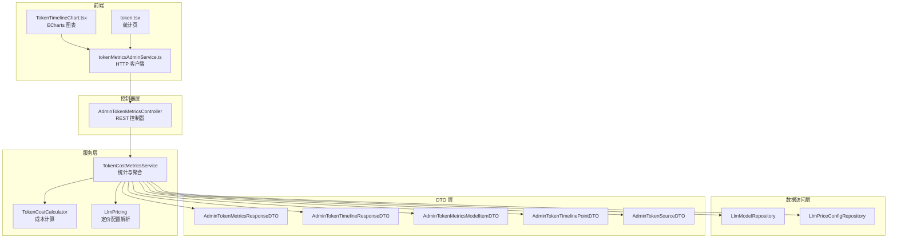
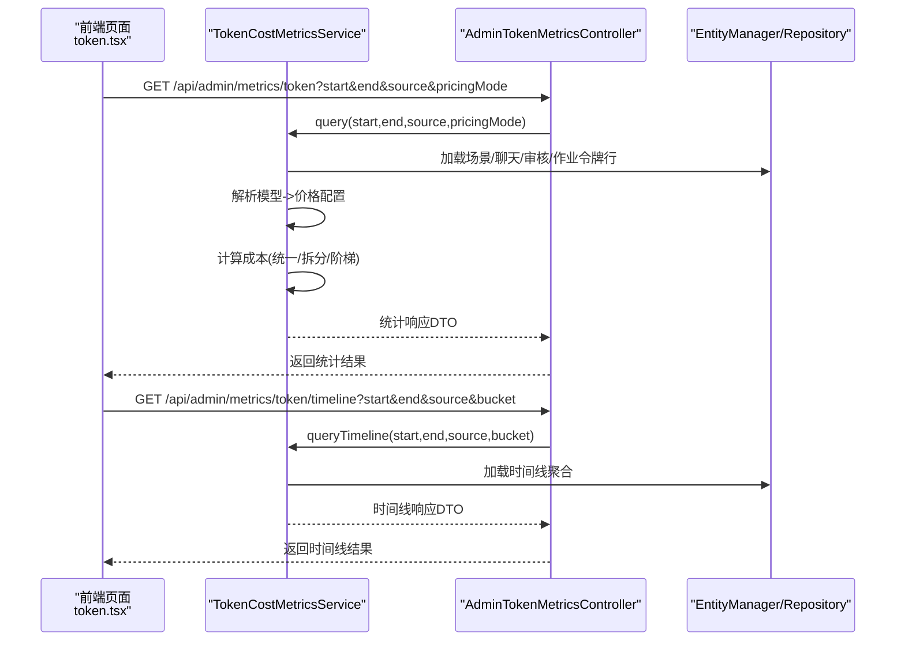
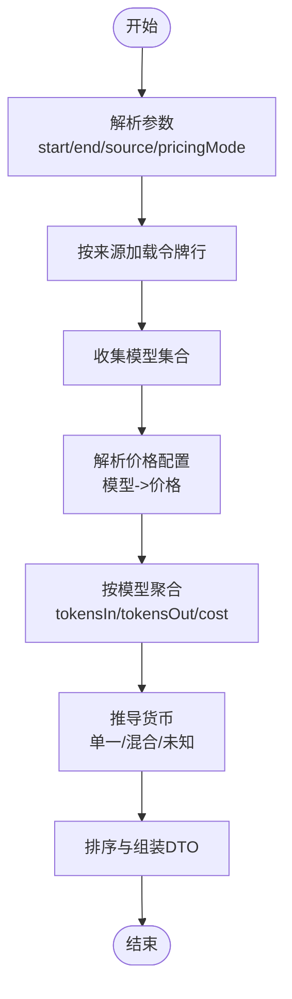
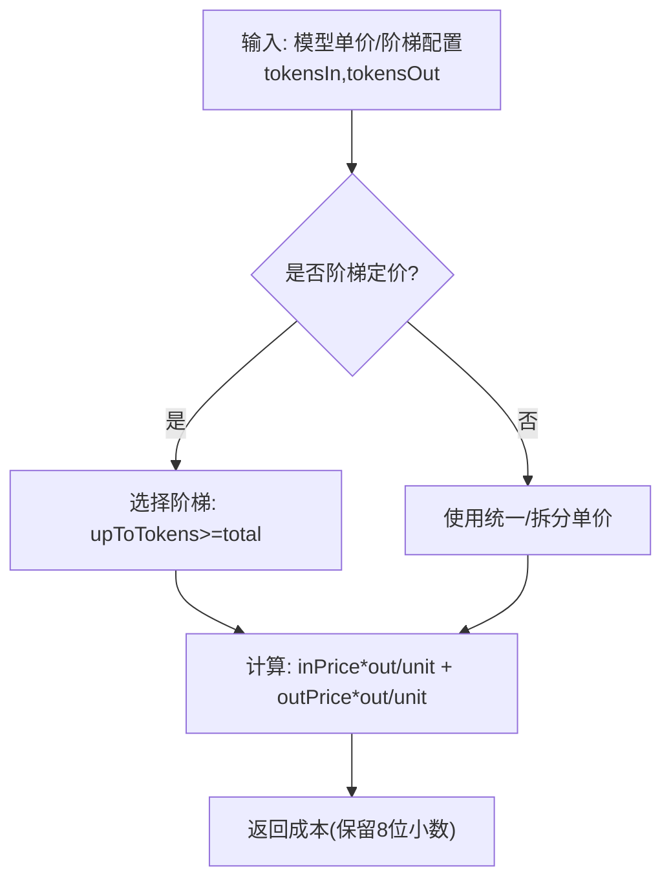
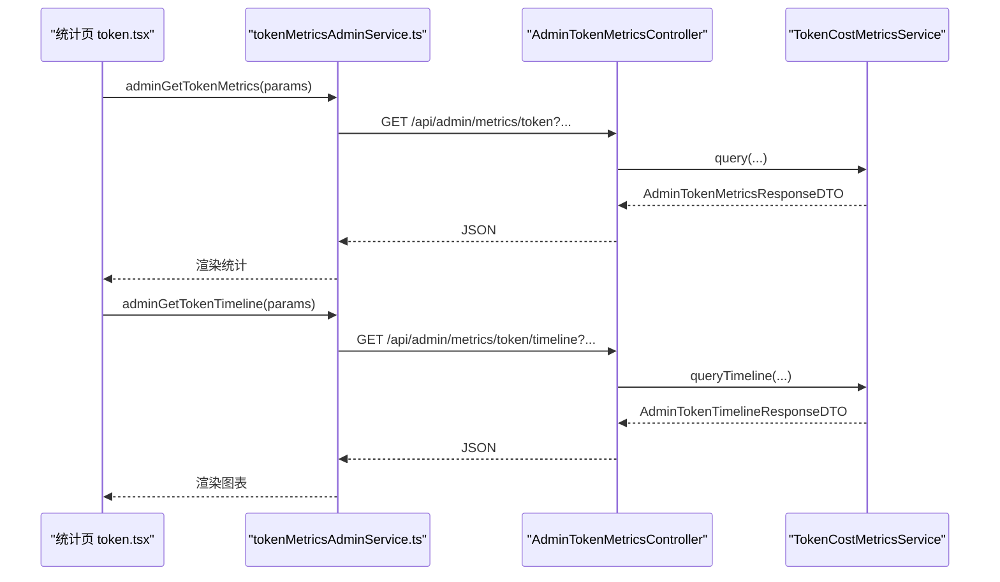
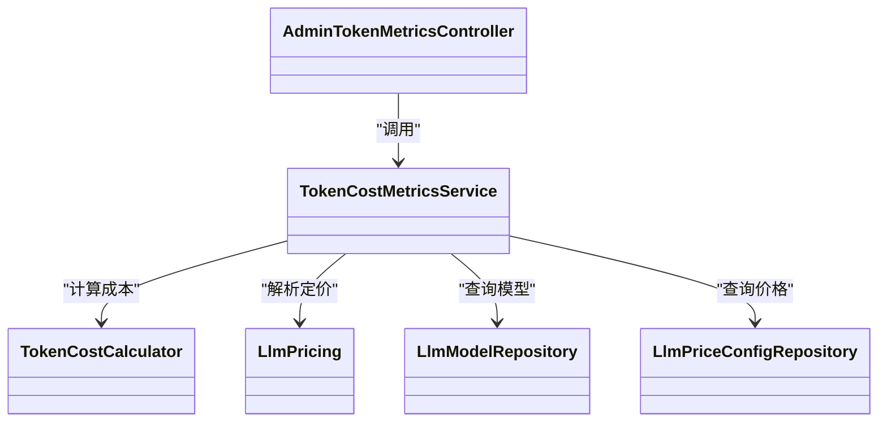

# 令牌消耗统计

<cite>
**本文引用的文件**
- [AdminTokenMetricsController.java](file://src/main/java/com/example/EnterpriseRagCommunity/controller/monitor/admin/AdminTokenMetricsController.java)
- [TokenCostMetricsService.java](file://src/main/java/com/example/EnterpriseRagCommunity/service/monitor/TokenCostMetricsService.java)
- [TokenCostCalculator.java](file://src/main/java/com/example/EnterpriseRagCommunity/service/monitor/TokenCostCalculator.java)
- [AdminTokenMetricsResponseDTO.java](file://src/main/java/com/example/EnterpriseRagCommunity/dto/monitor/AdminTokenMetricsResponseDTO.java)
- [AdminTokenMetricsModelItemDTO.java](file://src/main/java/com/example/EnterpriseRagCommunity/dto/monitor/AdminTokenMetricsModelItemDTO.java)
- [AdminTokenTimelineResponseDTO.java](file://src/main/java/com/example/EnterpriseRagCommunity/dto/monitor/AdminTokenTimelineResponseDTO.java)
- [AdminTokenTimelinePointDTO.java](file://src/main/java/com/example/EnterpriseRagCommunity/dto/monitor/AdminTokenTimelinePointDTO.java)
- [AdminTokenSourceDTO.java](file://src/main/java/com/example/EnterpriseRagCommunity/dto/monitor/AdminTokenSourceDTO.java)
- [tokenMetricsAdminService.ts](file://my-vite-app/src/services/tokenMetricsAdminService.ts)
- [TokenTimelineChart.tsx](file://my-vite-app/src/pages/admin/forms/metrics/TokenTimelineChart.tsx)
- [token.tsx](file://my-vite-app/src/pages/admin/forms/metrics/token.tsx)
- [LlmPricing.java](file://src/main/java/com/example/EnterpriseRagCommunity/service/monitor/LlmPricing.java)
- [LlmPriceConfigAdminService.java](file://src/main/java/com/example/EnterpriseRagCommunity/service/ai/LlmPriceConfigAdminService.java)
- [AdminLlmLoadTestService.java](file://src/main/java/com/example/EnterpriseRagCommunity/service/monitor/AdminLlmLoadTestService.java)
</cite>

## 目录
1. [引言](#引言)
2. [项目结构](#项目结构)
3. [核心组件](#核心组件)
4. [架构总览](#架构总览)
5. [详细组件分析](#详细组件分析)
6. [依赖关系分析](#依赖关系分析)
7. [性能考虑](#性能考虑)
8. [故障排查指南](#故障排查指南)
9. [结论](#结论)
10. [附录：API 接口规范](#附录api-接口规范)

## 引言
本文件面向“令牌消耗统计系统”，系统围绕 LLM 令牌使用量进行统计与分析，覆盖以下能力：
- 令牌消耗计算与成本统计分析
- 时间线追踪与趋势可视化
- 价格配置与计费算法（含统一/拆分单价、阶梯定价）
- DTO 数据结构与前端交互
- 存储与查询路径、精度控制与报表生成机制

该系统通过后端服务聚合历史任务与作业中的令牌用量，结合价格配置计算成本，并以响应 DTO 提供给前端图表与表格展示。

## 项目结构
围绕令牌统计的关键模块分布如下：
- 控制器层：对外暴露统计与趋势查询接口
- 服务层：负责数据加载、聚合、计费与时间线切分
- 计算层：单价与阶梯定价解析、成本计算
- DTO 层：前后端数据契约
- 前端服务与页面：调用接口并渲染图表

图示来源
- [AdminTokenMetricsController.java:28-141](file://src/main/java/com/example/EnterpriseRagCommunity/controller/monitor/admin/AdminTokenMetricsController.java#L28-L141)
- [TokenCostMetricsService.java:32-712](file://src/main/java/com/example/EnterpriseRagCommunity/service/monitor/TokenCostMetricsService.java#L32-L712)
- [TokenCostCalculator.java:7-69](file://src/main/java/com/example/EnterpriseRagCommunity/service/monitor/TokenCostCalculator.java#L7-L69)
- [AdminTokenMetricsResponseDTO.java:9-16](file://src/main/java/com/example/EnterpriseRagCommunity/dto/monitor/AdminTokenMetricsResponseDTO.java#L9-L16)
- [AdminTokenTimelineResponseDTO.java:8-16](file://src/main/java/com/example/EnterpriseRagCommunity/dto/monitor/AdminTokenTimelineResponseDTO.java#L8-L16)
- [AdminTokenMetricsModelItemDTO.java:7-14](file://src/main/java/com/example/EnterpriseRagCommunity/dto/monitor/AdminTokenMetricsModelItemDTO.java#L7-L14)
- [AdminTokenTimelinePointDTO.java:7-12](file://src/main/java/com/example/EnterpriseRagCommunity/dto/monitor/AdminTokenTimelinePointDTO.java#L7-L12)
- [AdminTokenSourceDTO.java:5-10](file://src/main/java/com/example/EnterpriseRagCommunity/dto/monitor/AdminTokenSourceDTO.java#L5-L10)
- [tokenMetricsAdminService.ts:109-146](file://my-vite-app/src/services/tokenMetricsAdminService.ts#L109-L146)
- [TokenTimelineChart.tsx:18-39](file://my-vite-app/src/pages/admin/forms/metrics/TokenTimelineChart.tsx#L18-L39)
- [token.tsx:614-657](file://my-vite-app/src/pages/admin/forms/metrics/token.tsx#L614-L657)

章节来源
- [AdminTokenMetricsController.java:28-141](file://src/main/java/com/example/EnterpriseRagCommunity/controller/monitor/admin/AdminTokenMetricsController.java#L28-L141)
- [TokenCostMetricsService.java:32-712](file://src/main/java/com/example/EnterpriseRagCommunity/service/monitor/TokenCostMetricsService.java#L32-L712)

## 核心组件
- 控制器：提供统计查询、时间线查询与场景源枚举接口
- 服务：按时间范围与来源聚合令牌用量，解析价格配置并计算成本；支持小时/天粒度的时间线
- 计算器：支持统一单价、拆分单价与阶梯定价的成本计算
- DTO：定义统计结果、时间线点、模型项与场景源的数据结构
- 前端：封装 HTTP 请求、错误处理与图表渲染

章节来源
- [AdminTokenMetricsController.java:113-140](file://src/main/java/com/example/EnterpriseRagCommunity/controller/monitor/admin/AdminTokenMetricsController.java#L113-L140)
- [TokenCostMetricsService.java:44-230](file://src/main/java/com/example/EnterpriseRagCommunity/service/monitor/TokenCostMetricsService.java#L44-L230)
- [TokenCostCalculator.java:14-57](file://src/main/java/com/example/EnterpriseRagCommunity/service/monitor/TokenCostCalculator.java#L14-L57)
- [AdminTokenMetricsResponseDTO.java:9-16](file://src/main/java/com/example/EnterpriseRagCommunity/dto/monitor/AdminTokenMetricsResponseDTO.java#L9-L16)
- [AdminTokenTimelineResponseDTO.java:8-16](file://src/main/java/com/example/EnterpriseRagCommunity/dto/monitor/AdminTokenTimelineResponseDTO.java#L8-L16)
- [AdminTokenMetricsModelItemDTO.java:7-14](file://src/main/java/com/example/EnterpriseRagCommunity/dto/monitor/AdminTokenMetricsModelItemDTO.java#L7-L14)
- [AdminTokenTimelinePointDTO.java:7-12](file://src/main/java/com/example/EnterpriseRagCommunity/dto/monitor/AdminTokenTimelinePointDTO.java#L7-L12)
- [AdminTokenSourceDTO.java:5-10](file://src/main/java/com/example/EnterpriseRagCommunity/dto/monitor/AdminTokenSourceDTO.java#L5-L10)
- [tokenMetricsAdminService.ts:109-146](file://my-vite-app/src/services/tokenMetricsAdminService.ts#L109-L146)

## 架构总览
系统采用“控制器-服务-计算-数据访问”的分层设计，数据来源包括新任务队列历史与旧作业表，价格配置来自模型与价格配置表，最终以 DTO 返回给前端。

图示来源
- [AdminTokenMetricsController.java:113-140](file://src/main/java/com/example/EnterpriseRagCommunity/controller/monitor/admin/AdminTokenMetricsController.java#L113-L140)
- [TokenCostMetricsService.java:60-230](file://src/main/java/com/example/EnterpriseRagCommunity/service/monitor/TokenCostMetricsService.java#L60-L230)
- [token.tsx:614-657](file://my-vite-app/src/pages/admin/forms/metrics/token.tsx#L614-L657)

## 详细组件分析

### 组件一：统计与时间线服务（TokenCostMetricsService）
- 功能职责
  - 统计维度：按模型聚合输入/输出/总量令牌，计算成本，汇总货币与总量
  - 来源过滤：支持 ALL、CHAT、MODERATION、JOB 及具体任务类型
  - 时间线：按小时或天聚合令牌，自动选择粒度
  - 价格解析：从模型与价格配置表解析单价或阶梯配置
- 关键流程
  - 数据加载：根据来源选择不同 SQL 查询（场景历史、聊天、审核、作业）
  - 价格解析：优先按模型名匹配价格配置，缺失时回退到名称匹配
  - 成本计算：委托 TokenCostCalculator 执行统一/拆分/阶梯定价
  - 结果排序：按成本降序、令牌量降序、模型名排序
- 性能要点
  - 使用原生 SQL 与分组聚合，减少 Java 端内存压力
  - 时间线自动粒度选择，避免过多点位
  - 价格缓存：按模型名与价格 ID 建立映射，减少重复查询

图示来源
- [TokenCostMetricsService.java:60-156](file://src/main/java/com/example/EnterpriseRagCommunity/service/monitor/TokenCostMetricsService.java#L60-L156)

章节来源
- [TokenCostMetricsService.java:60-230](file://src/main/java/com/example/EnterpriseRagCommunity/service/monitor/TokenCostMetricsService.java#L60-L230)
- [TokenCostMetricsService.java:232-476](file://src/main/java/com/example/EnterpriseRagCommunity/service/monitor/TokenCostMetricsService.java#L232-L476)
- [TokenCostMetricsService.java:478-547](file://src/main/java/com/example/EnterpriseRagCommunity/service/monitor/TokenCostMetricsService.java#L478-L547)

### 组件二：令牌计费算法（TokenCostCalculator）
- 支持的计费模式
  - 统一单价：输入与输出共享单价
  - 拆分单价：输入与输出分别定价
  - 阶梯定价：按总令牌数选择对应阶梯单价
- 计算细节
  - 单价单位：千/百万，统一除法保留 8 位精度，四舍五入
  - 输入/输出价格为空时跳过对应部分
  - 阶梯选择：按总令牌数在阶梯列表中定位区间
- 精度与边界
  - BigDecimal 8 位精度，HALF_UP 四舍五入
  - 负数令牌视为 0

图示来源
- [TokenCostCalculator.java:27-57](file://src/main/java/com/example/EnterpriseRagCommunity/service/monitor/TokenCostCalculator.java#L27-L57)

章节来源
- [TokenCostCalculator.java:14-57](file://src/main/java/com/example/EnterpriseRagCommunity/service/monitor/TokenCostCalculator.java#L14-L57)

### 组件三：定价配置与解析（LlmPricing）
- 元数据格式
  - 支持策略：FLAT（统一/拆分）、TIERED（阶梯）
  - 单位：PER_1K（千）、PER_1M（百万）
  - 字段：默认/非思考/思考输入/输出单价，以及阶梯列表
- 解析逻辑
  - 优先从元数据构建 Config，否则回退到传统 inputCostPer1k/outputCostPer1k
  - isConfiguredForMode 判断当前模式下是否具备有效价格

章节来源
- [LlmPricing.java](file://src/main/java/com/example/EnterpriseRagCommunity/service/monitor/LlmPricing.java)
- [LlmPriceConfigAdminService.java:75-94](file://src/main/java/com/example/EnterpriseRagCommunity/service/ai/LlmPriceConfigAdminService.java#L75-L94)

### 组件四：控制器与前端交互
- 控制器接口
  - GET /api/admin/metrics/token：统计查询
  - GET /api/admin/metrics/token/timeline：时间线查询
  - GET /api/admin/metrics/token/sources：场景源枚举
- 前端服务
  - 封装查询参数构建、CSRF、错误消息提取
  - 提供统计与时间线两个查询方法
- 前端页面
  - 渲染总令牌与总成本
  - 使用 ECharts 展示时间线趋势

图示来源
- [AdminTokenMetricsController.java:113-140](file://src/main/java/com/example/EnterpriseRagCommunity/controller/monitor/admin/AdminTokenMetricsController.java#L113-L140)
- [tokenMetricsAdminService.ts:109-146](file://my-vite-app/src/services/tokenMetricsAdminService.ts#L109-L146)
- [TokenTimelineChart.tsx:18-39](file://my-vite-app/src/pages/admin/forms/metrics/TokenTimelineChart.tsx#L18-L39)

章节来源
- [AdminTokenMetricsController.java:40-140](file://src/main/java/com/example/EnterpriseRagCommunity/controller/monitor/admin/AdminTokenMetricsController.java#L40-L140)
- [tokenMetricsAdminService.ts:109-146](file://my-vite-app/src/services/tokenMetricsAdminService.ts#L109-L146)
- [TokenTimelineChart.tsx:18-39](file://my-vite-app/src/pages/admin/forms/metrics/TokenTimelineChart.tsx#L18-L39)
- [token.tsx:614-657](file://my-vite-app/src/pages/admin/forms/metrics/token.tsx#L614-L657)

## 依赖关系分析
- 控制器依赖服务层
- 服务层依赖实体仓库与计算层
- 计算层依赖定价配置解析
- 前端服务依赖控制器接口

图示来源
- [AdminTokenMetricsController.java:34-38](file://src/main/java/com/example/EnterpriseRagCommunity/controller/monitor/admin/AdminTokenMetricsController.java#L34-L38)
- [TokenCostMetricsService.java:41-42](file://src/main/java/com/example/EnterpriseRagCommunity/service/monitor/TokenCostMetricsService.java#L41-L42)
- [TokenCostCalculator.java:27-45](file://src/main/java/com/example/EnterpriseRagCommunity/service/monitor/TokenCostCalculator.java#L27-L45)
- [LlmPricing.java](file://src/main/java/com/example/EnterpriseRagCommunity/service/monitor/LlmPricing.java)

章节来源
- [TokenCostMetricsService.java:38-42](file://src/main/java/com/example/EnterpriseRagCommunity/service/monitor/TokenCostMetricsService.java#L38-L42)

## 性能考虑
- 查询优化
  - 使用原生 SQL 与 GROUP BY 在数据库侧完成聚合，降低 Java 端内存占用
  - 时间线自动粒度选择，避免过密点位导致渲染与网络压力
- 计算优化
  - BigDecimal 8 位精度已足够满足成本显示需求，避免过度精度带来的开销
  - 仅对正数令牌参与计算，忽略负值与空值
- 缓存与复用
  - 模型到价格配置映射复用，减少重复查询
  - 价格配置解析优先按模型名命中，缺失时再回退名称匹配

## 故障排查指南
- 无价格配置
  - 现象：模型项 priceMissing 为 true
  - 原因：模型未绑定价格配置或当前定价模式未配置
  - 处理：在价格配置管理中为模型设置单价或添加阶梯配置
- 混合货币
  - 现象：currency 为 MIXED
  - 原因：同一查询范围内存在多种货币
  - 处理：按模型或时间线进一步细分查询
- 时间线为空
  - 现象：时间线 points 为空或 totalTokens 为 0
  - 原因：时间范围无对应记录或来源过滤不匹配
  - 处理：调整 start/end 或 source 参数
- 前端报错
  - 现象：获取统计/趋势失败
  - 原因：后端返回 message 或网络异常
  - 处理：检查 CSRF、跨域配置与后端日志

章节来源
- [TokenCostMetricsService.java:122-125](file://src/main/java/com/example/EnterpriseRagCommunity/service/monitor/TokenCostMetricsService.java#L122-L125)
- [tokenMetricsAdminService.ts:102-120](file://my-vite-app/src/services/tokenMetricsAdminService.ts#L102-L120)

## 结论
该令牌消耗统计系统以清晰的分层架构实现了从数据采集、价格解析、成本计算到结果呈现的完整闭环。通过灵活的来源过滤与时间线粒度选择，满足了多场景下的统计与分析需求；通过统一/拆分/阶梯三种计费模式，适配多样化的定价策略；前端以图表与表格形式直观展示统计结果，便于运营与财务人员进行成本分析与预算控制。

## 附录：API 接口规范

- 获取统计结果
  - 方法与路径：GET /api/admin/metrics/token
  - 权限：admin_metrics_token:read
  - 查询参数
    - start: 开始时间（ISO 8601），可选
    - end: 结束时间（ISO 8601），可选
    - source: 来源（ALL/CHAT/MODERATION/JOB/任务类型），可选
    - pricingMode: 定价模式字符串，可选（由服务端解析）
  - 响应：AdminTokenMetricsResponseDTO
    - start/end: 查询起止时间
    - currency: 单一货币或 MIXED/空
    - totalTokens: 总令牌数
    - totalCost: 总成本
    - items: 按模型聚合的明细列表（含 tokensIn/tokensOut/totalTokens/cost/priceMissing）

- 获取时间线
  - 方法与路径：GET /api/admin/metrics/token/timeline
  - 权限：admin_metrics_token:read
  - 查询参数
    - start: 开始时间（ISO 8601），可选
    - end: 结束时间（ISO 8601），可选
    - source: 来源（同上），可选
    - bucket: 粒度（AUTO/HOUR/DAY），可选
  - 响应：AdminTokenTimelineResponseDTO
    - start/end/source/bucket/totalTokens/points
    - points: 时间点数组，每个元素包含 time/tokensIn/tokensOut/totalTokens

- 场景源枚举
  - 方法与路径：GET /api/admin/metrics/token/sources
  - 权限：admin_metrics_token:read
  - 响应：AdminTokenSourceDTO[]
    - taskType/label/category/sortIndex

- 前端调用封装
  - tokenMetricsAdminService.ts 提供 adminGetTokenMetrics、adminGetTokenTimeline、adminListTokenSources 等方法
  - 内置 CSRF 令牌注入与错误消息提取

章节来源
- [AdminTokenMetricsController.java:113-140](file://src/main/java/com/example/EnterpriseRagCommunity/controller/monitor/admin/AdminTokenMetricsController.java#L113-L140)
- [AdminTokenMetricsResponseDTO.java:9-16](file://src/main/java/com/example/EnterpriseRagCommunity/dto/monitor/AdminTokenMetricsResponseDTO.java#L9-L16)
- [AdminTokenTimelineResponseDTO.java:8-16](file://src/main/java/com/example/EnterpriseRagCommunity/dto/monitor/AdminTokenTimelineResponseDTO.java#L8-L16)
- [AdminTokenSourceDTO.java:5-10](file://src/main/java/com/example/EnterpriseRagCommunity/dto/monitor/AdminTokenSourceDTO.java#L5-L10)
- [tokenMetricsAdminService.ts:109-146](file://my-vite-app/src/services/tokenMetricsAdminService.ts#L109-L146)