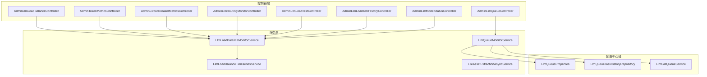
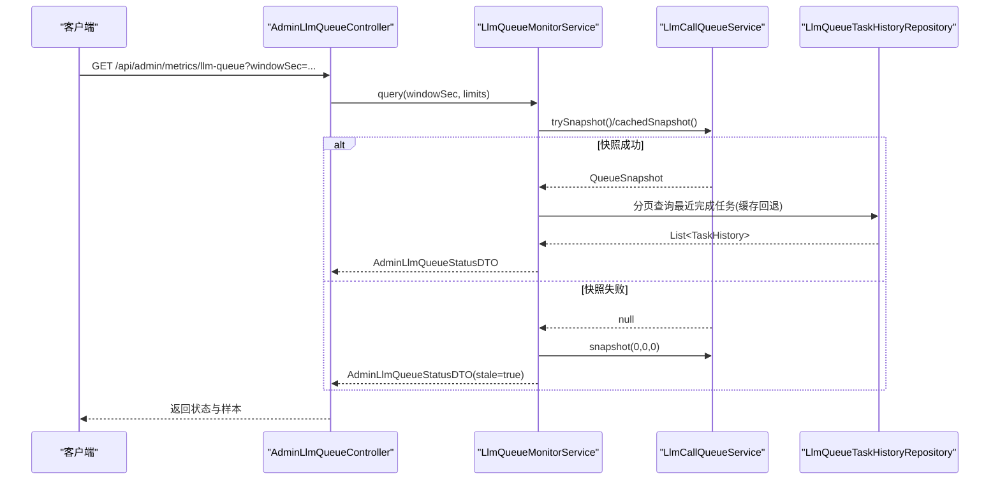
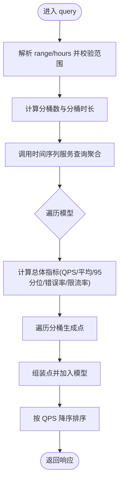
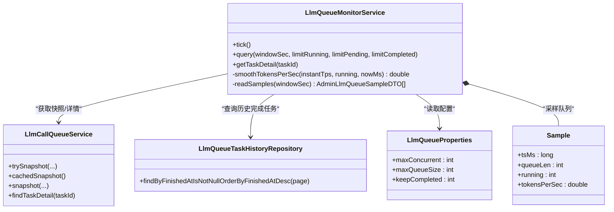
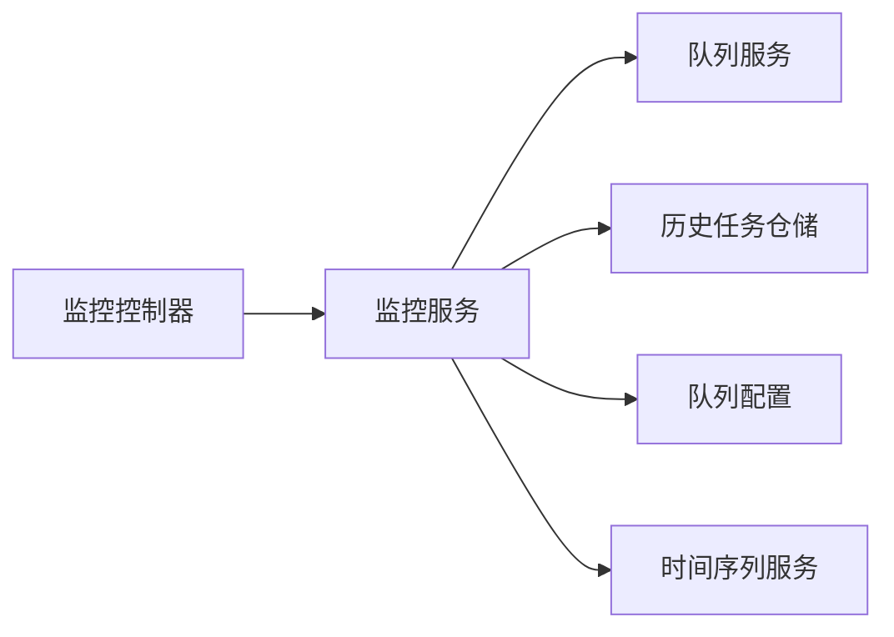

# 监控分析

<cite>
**本文档引用的文件**
- [AdminLlmLoadBalanceController.java](file://src/main/java/com/example/EnterpriseRagCommunity/controller/monitor/admin/AdminLlmLoadBalanceController.java)
- [LlmLoadBalanceMonitorService.java](file://src/main/java/com/example/EnterpriseRagCommunity/service/monitor/LlmLoadBalanceMonitorService.java)
- [AdminLlmQueueController.java](file://src/main/java/com/example/EnterpriseRagCommunity/controller/monitor/admin/AdminLlmQueueController.java)
- [LlmQueueMonitorService.java](file://src/main/java/com/example/EnterpriseRagCommunity/service/monitor/LlmQueueMonitorService.java)
- [AdminLlmLoadBalanceResponseDTO.java](file://src/main/java/com/example/EnterpriseRagCommunity/dto/monitor/AdminLlmLoadBalanceResponseDTO.java)
- [AdminLlmQueueSampleDTO.java](file://src/main/java/com/example/EnterpriseRagCommunity/dto/monitor/AdminLlmQueueSampleDTO.java)
- [LlmLoadBalanceTimeseriesService.java](file://src/main/java/com/example/EnterpriseRagCommunity/service/monitor/LlmLoadBalanceTimeseriesService.java)
- [LlmQueueTaskHistoryRepository.java](file://src/main/java/com/example/EnterpriseRagCommunity/repository/monitor/LlmQueueTaskHistoryRepository.java)
- [LlmQueueProperties.java](file://src/main/java/com/example/EnterpriseRagCommunity/config/LlmQueueProperties.java)
- [LlmCallQueueService.java](file://src/main/java/com/example/EnterpriseRagCommunity/service/ai/LlmCallQueueService.java)
- [AdminTokenMetricsController.java](file://src/main/java/com/example/EnterpriseRagCommunity/controller/monitor/admin/AdminTokenMetricsController.java)
- [AdminCircuitBreakerMetricsController.java](file://src/main/java/com/example/EnterpriseRagCommunity/controller/monitor/admin/AdminCircuitBreakerMetricsController.java)
- [AdminLlmRoutingMonitorController.java](file://src/main/java/com/example/EnterpriseRagCommunity/controller/monitor/admin/AdminLlmRoutingMonitorController.java)
- [AdminLlmLoadTestController.java](file://src/main/java/com/example/EnterpriseRagCommunity/controller/monitor/admin/AdminLlmLoadTestController.java)
- [AdminLlmLoadTestHistoryController.java](file://src/main/java/com/example/EnterpriseRagCommunity/controller/monitor/admin/AdminLlmLoadTestHistoryController.java)
- [AdminLlmModelStatusController.java](file://src/main/java/com/example/EnterpriseRagCommunity/controller/monitor/admin/AdminLlmModelStatusController.java)
- [FileAssetExtractionAsyncService.java](file://src/main/java/com/example/EnterpriseRagCommunity/service/monitor/FileAssetExtractionAsyncService.java)
</cite>

## 目录
1. [引言](#引言)
2. [项目结构](#项目结构)
3. [核心组件](#核心组件)
4. [架构总览](#架构总览)
5. [详细组件分析](#详细组件分析)
6. [依赖关系分析](#依赖关系分析)
7. [性能考虑](#性能考虑)
8. [故障排查指南](#故障排查指南)
9. [结论](#结论)
10. [附录](#附录)

## 引言
本文件面向监控分析系统的使用者与维护者，系统性阐述负载均衡监控、LLM队列管理、令牌消耗统计、系统事件记录、通知管理等核心监控功能。内容涵盖指标采集策略、性能分析方法、告警机制、日志保留与数据存储、实体模型与数据结构、API 接口规范以及可视化展示建议。文档以代码为依据，结合架构图与流程图，帮助读者快速理解并高效使用监控能力。

## 项目结构
监控相关模块主要分布在以下层次：
- 控制器层（controller/monitor/admin）：对外暴露监控 API，负责参数解析与权限控制
- 服务层（service/monitor）：实现监控逻辑，包括时间序列聚合、采样平滑、缓存与回退策略
- DTO 层（dto/monitor）：定义监控响应与请求的数据结构
- 配置层（config）：队列配置参数
- 仓储层（repository/monitor）：持久化历史任务与事件
- AI 队列服务（service/ai）：提供队列快照与任务详情

**图表来源**
- [AdminLlmLoadBalanceController.java:16-23](file://src/main/java/com/example/EnterpriseRagCommunity/controller/monitor/admin/AdminLlmLoadBalanceController.java#L16-L23)
- [AdminLlmQueueController.java:30-47](file://src/main/java/com/example/EnterpriseRagCommunity/controller/monitor/admin/AdminLlmQueueController.java#L30-L47)
- [LlmLoadBalanceMonitorService.java:19-35](file://src/main/java/com/example/EnterpriseRagCommunity/service/monitor/LlmLoadBalanceMonitorService.java#L19-L35)
- [LlmQueueMonitorService.java:40-55](file://src/main/java/com/example/EnterpriseRagCommunity/service/monitor/LlmQueueMonitorService.java#L40-L55)
- [LlmLoadBalanceTimeseriesService.java](file://src/main/java/com/example/EnterpriseRagCommunity/service/monitor/LlmLoadBalanceTimeseriesService.java)
- [LlmQueueTaskHistoryRepository.java](file://src/main/java/com/example/EnterpriseRagCommunity/repository/monitor/LlmQueueTaskHistoryRepository.java)
- [LlmQueueProperties.java](file://src/main/java/com/example/EnterpriseRagCommunity/config/LlmQueueProperties.java)
- [LlmCallQueueService.java](file://src/main/java/com/example/EnterpriseRagCommunity/service/ai/LlmCallQueueService.java)

**章节来源**
- [AdminLlmLoadBalanceController.java:1-25](file://src/main/java/com/example/EnterpriseRagCommunity/controller/monitor/admin/AdminLlmLoadBalanceController.java#L1-L25)
- [AdminLlmQueueController.java:1-79](file://src/main/java/com/example/EnterpriseRagCommunity/controller/monitor/admin/AdminLlmQueueController.java#L1-L79)
- [LlmLoadBalanceMonitorService.java:1-147](file://src/main/java/com/example/EnterpriseRagCommunity/service/monitor/LlmLoadBalanceMonitorService.java#L1-L147)
- [LlmQueueMonitorService.java:1-397](file://src/main/java/com/example/EnterpriseRagCommunity/service/monitor/LlmQueueMonitorService.java#L1-L397)

## 核心组件
- 负载均衡监控服务：负责解析时间范围、计算分桶、聚合统计与输出时间序列
- LLM 队列监控服务：定时采样队列状态，计算令牌吞吐量，合并内存与数据库中的完成任务，并提供任务详情
- 时间序列服务：提供按时间窗口聚合的查询能力
- 队列配置与仓储：提供最大并发、队列长度、完成任务保留数等配置，以及历史任务的持久化查询
- 其他监控控制器：令牌统计、熔断器指标、路由决策流、负载测试与历史、模型状态等

**章节来源**
- [LlmLoadBalanceMonitorService.java:24-75](file://src/main/java/com/example/EnterpriseRagCommunity/service/monitor/LlmLoadBalanceMonitorService.java#L24-L75)
- [LlmQueueMonitorService.java:57-120](file://src/main/java/com/example/EnterpriseRagCommunity/service/monitor/LlmQueueMonitorService.java#L57-L120)
- [LlmQueueProperties.java](file://src/main/java/com/example/EnterpriseRagCommunity/config/LlmQueueProperties.java)
- [LlmQueueTaskHistoryRepository.java](file://src/main/java/com/example/EnterpriseRagCommunity/repository/monitor/LlmQueueTaskHistoryRepository.java)

## 架构总览
监控系统采用“控制器-服务-配置/仓储”的分层架构，通过定时任务与快照机制实现低开销的实时监控；通过时间序列聚合与缓存策略平衡准确性与时效性；通过 DTO 统一对外输出格式，便于前端可视化。

**图表来源**
- [AdminLlmQueueController.java:30-39](file://src/main/java/com/example/EnterpriseRagCommunity/controller/monitor/admin/AdminLlmQueueController.java#L30-L39)
- [LlmQueueMonitorService.java:152-203](file://src/main/java/com/example/EnterpriseRagCommunity/service/monitor/LlmQueueMonitorService.java#L152-L203)
- [LlmCallQueueService.java](file://src/main/java/com/example/EnterpriseRagCommunity/service/ai/LlmCallQueueService.java)
- [LlmQueueTaskHistoryRepository.java](file://src/main/java/com/example/EnterpriseRagCommunity/repository/monitor/LlmQueueTaskHistoryRepository.java)

## 详细组件分析

### 负载均衡监控（负载监控）
- 功能概述：支持按小时/分钟/秒/天等单位的时间范围查询，自动分桶聚合调用次数、QPS、平均/95 分位响应时延、错误率与限流率，并输出模型维度指标。
- 关键流程：
  - 解析 range 或 hours 参数，限定最小/最大范围
  - 计算分桶大小与数量，调用时间序列服务获取聚合结果
  - 对每个模型计算总体与分桶级指标，排序后返回
- 性能特性：分桶数量与范围动态调整，避免过大数据集；对空计数场景进行安全除零处理。

**图表来源**
- [LlmLoadBalanceMonitorService.java:24-75](file://src/main/java/com/example/EnterpriseRagCommunity/service/monitor/LlmLoadBalanceMonitorService.java#L24-L75)
- [LlmLoadBalanceMonitorService.java:77-108](file://src/main/java/com/example/EnterpriseRagCommunity/service/monitor/LlmLoadBalanceMonitorService.java#L77-L108)
- [LlmLoadBalanceMonitorService.java:110-134](file://src/main/java/com/example/EnterpriseRagCommunity/service/monitor/LlmLoadBalanceMonitorService.java#L110-L134)

**章节来源**
- [AdminLlmLoadBalanceController.java:16-23](file://src/main/java/com/example/EnterpriseRagCommunity/controller/monitor/admin/AdminLlmLoadBalanceController.java#L16-L23)
- [LlmLoadBalanceMonitorService.java:24-75](file://src/main/java/com/example/EnterpriseRagCommunity/service/monitor/LlmLoadBalanceMonitorService.java#L24-L75)
- [AdminLlmLoadBalanceResponseDTO.java:8-14](file://src/main/java/com/example/EnterpriseRagCommunity/dto/monitor/AdminLlmLoadBalanceResponseDTO.java#L8-L14)

### LLM 队列监控（队列状态与样本）
- 功能概述：定时采样队列状态，计算令牌吞吐量（TPS），合并内存与数据库中的最近完成任务，提供队列状态、运行/等待/完成任务列表与样本曲线。
- 关键流程：
  - 每秒 tick：从队列服务获取快照，计算瞬时 TPS 与运行中 TPS，平滑后写入样本队列
  - 查询：根据窗口与限制获取快照，合并最近完成任务，读取样本
  - 任务详情：优先从队列服务获取，否则回退到历史任务表
- 平滑算法：当无新任务时，基于指数衰减保持 TPS 的短期记忆，避免突降为 0。

**图表来源**
- [LlmQueueMonitorService.java:28-55](file://src/main/java/com/example/EnterpriseRagCommunity/service/monitor/LlmQueueMonitorService.java#L28-L55)
- [LlmQueueMonitorService.java:57-120](file://src/main/java/com/example/EnterpriseRagCommunity/service/monitor/LlmQueueMonitorService.java#L57-L120)
- [LlmQueueMonitorService.java:122-150](file://src/main/java/com/example/EnterpriseRagCommunity/service/monitor/LlmQueueMonitorService.java#L122-L150)
- [LlmCallQueueService.java](file://src/main/java/com/example/EnterpriseRagCommunity/service/ai/LlmCallQueueService.java)
- [LlmQueueTaskHistoryRepository.java](file://src/main/java/com/example/EnterpriseRagCommunity/repository/monitor/LlmQueueTaskHistoryRepository.java)
- [LlmQueueProperties.java](file://src/main/java/com/example/EnterpriseRagCommunity/config/LlmQueueProperties.java)

**章节来源**
- [AdminLlmQueueController.java:30-47](file://src/main/java/com/example/EnterpriseRagCommunity/controller/monitor/admin/AdminLlmQueueController.java#L30-L47)
- [LlmQueueMonitorService.java:57-120](file://src/main/java/com/example/EnterpriseRagCommunity/service/monitor/LlmQueueMonitorService.java#L57-L120)
- [LlmQueueMonitorService.java:152-203](file://src/main/java/com/example/EnterpriseRagCommunity/service/monitor/LlmQueueMonitorService.java#L152-L203)
- [AdminLlmQueueSampleDTO.java:8-13](file://src/main/java/com/example/EnterpriseRagCommunity/dto/monitor/AdminLlmQueueSampleDTO.java#L8-L13)

### 令牌消耗统计（成本统计）
- 功能概述：提供令牌来源、类型归类与时间线查询，支持按任务类型/标签归因成本，辅助成本分析与优化。
- 数据来源：结合队列任务的输入/输出令牌与耗时，推导吞吐与成本。
- 使用建议：结合负载监控与路由监控，定位高成本路径与异常峰值。

**章节来源**
- [AdminTokenMetricsController.java:43-138](file://src/main/java/com/example/EnterpriseRagCommunity/controller/monitor/admin/AdminTokenMetricsController.java#L43-L138)

### 系统事件记录与通知管理
- 文件提取监控：异步文件资产提取服务具备预算控制、计数器与错误处理，可作为系统事件与资源使用的观测来源。
- 通知配置：通过通知类型枚举与状态枚举管理通知策略与生命周期。

**章节来源**
- [FileAssetExtractionAsyncService.java](file://src/main/java/com/example/EnterpriseRagCommunity/service/monitor/FileAssetExtractionAsyncService.java)
- [AdminCircuitBreakerMetricsController.java:28-33](file://src/main/java/com/example/EnterpriseRagCommunity/controller/monitor/admin/AdminCircuitBreakerMetricsController.java#L28-L33)

### 路由监控与负载测试
- 路由决策流：提供 SSE 流式输出路由决策事件，便于实时追踪路由策略执行情况。
- 负载测试：提供运行、停止、状态查询与历史记录的完整闭环，支持导出结果用于回归分析。

**章节来源**
- [AdminLlmRoutingMonitorController.java:35-114](file://src/main/java/com/example/EnterpriseRagCommunity/controller/monitor/admin/AdminLlmRoutingMonitorController.java#L35-L114)
- [AdminLlmLoadTestController.java:35-63](file://src/main/java/com/example/EnterpriseRagCommunity/controller/monitor/admin/AdminLlmLoadTestController.java#L35-L63)
- [AdminLlmLoadTestHistoryController.java:33-50](file://src/main/java/com/example/EnterpriseRagCommunity/controller/monitor/admin/AdminLlmLoadTestHistoryController.java#L33-L50)

### 模型状态监控
- 功能概述：提供模型可用性与错误码提取、状态统计，辅助定位上游服务异常与限流问题。

**章节来源**
- [AdminLlmModelStatusController.java:29-118](file://src/main/java/com/example/EnterpriseRagCommunity/controller/monitor/admin/AdminLlmModelStatusController.java#L29-L118)

## 依赖关系分析
- 控制器依赖服务：各控制器仅注入对应服务，职责清晰，耦合度低
- 服务间依赖：队列监控依赖队列服务与仓储；负载监控依赖时间序列服务
- 配置与缓存：队列监控内部维护样本与最近完成任务缓存，降低数据库压力
- 外部集成：通过队列服务抽象与时间序列服务解耦具体实现

**图表来源**
- [AdminLlmQueueController.java:27-28](file://src/main/java/com/example/EnterpriseRagCommunity/controller/monitor/admin/AdminLlmQueueController.java#L27-L28)
- [LlmQueueMonitorService.java:40-42](file://src/main/java/com/example/EnterpriseRagCommunity/service/monitor/LlmQueueMonitorService.java#L40-L42)
- [LlmLoadBalanceMonitorService.java:19-20](file://src/main/java/com/example/EnterpriseRagCommunity/service/monitor/LlmLoadBalanceMonitorService.java#L19-L20)

**章节来源**
- [AdminLlmQueueController.java:21-79](file://src/main/java/com/example/EnterpriseRagCommunity/controller/monitor/admin/AdminLlmQueueController.java#L21-L79)
- [LlmQueueMonitorService.java:1-397](file://src/main/java/com/example/EnterpriseRagCommunity/service/monitor/LlmQueueMonitorService.java#L1-L397)
- [LlmLoadBalanceMonitorService.java:1-147](file://src/main/java/com/example/EnterpriseRagCommunity/service/monitor/LlmLoadBalanceMonitorService.java#L1-L147)

## 性能考虑
- 采样与平滑：每秒采样，指数衰减平滑 TPS，避免抖动与误报
- 分页与缓存：最近完成任务分页查询并带 TTL 缓存，减少数据库压力
- 限流与截断：查询参数存在上限保护，防止超大窗口导致内存与 CPU 压力
- 时间序列：分桶数量与范围自适应，兼顾精度与性能

**章节来源**
- [LlmQueueMonitorService.java:57-120](file://src/main/java/com/example/EnterpriseRagCommunity/service/monitor/LlmQueueMonitorService.java#L57-L120)
- [LlmQueueMonitorService.java:271-301](file://src/main/java/com/example/EnterpriseRagCommunity/service/monitor/LlmQueueMonitorService.java#L271-L301)
- [LlmLoadBalanceMonitorService.java:21-31](file://src/main/java/com/example/EnterpriseRagCommunity/service/monitor/LlmLoadBalanceMonitorService.java#L21-L31)

## 故障排查指南
- 队列状态为空或 stale：检查队列服务是否正常提供快照，确认 trySnapshot 是否阻塞
- 最近完成任务缺失：确认数据库中是否存在 finishedAt 非空的任务，检查缓存 TTL 与分页限制
- TPS 突降为 0：检查指数衰减逻辑与运行中任务是否仍在产生输出令牌
- API 权限不足：确认访问令牌具有相应权限标识
- 负载测试异常：检查运行状态、停止信号与导出路径

**章节来源**
- [AdminLlmQueueController.java:41-47](file://src/main/java/com/example/EnterpriseRagCommunity/controller/monitor/admin/AdminLlmQueueController.java#L41-L47)
- [LlmQueueMonitorService.java:165-180](file://src/main/java/com/example/EnterpriseRagCommunity/service/monitor/LlmQueueMonitorService.java#L165-L180)
- [LlmQueueMonitorService.java:122-150](file://src/main/java/com/example/EnterpriseRagCommunity/service/monitor/LlmQueueMonitorService.java#L122-L150)

## 结论
该监控分析系统通过分层设计与采样平滑策略，在保证实时性的同时兼顾性能与稳定性。负载均衡监控、队列状态与样本、令牌统计、路由与负载测试、模型状态等模块协同工作，形成完整的可观测性闭环。建议在生产环境中结合告警规则与可视化看板，持续优化队列配置与上游服务健康度。

## 附录

### API 接口规范（节选）
- 负载均衡监控
  - GET /api/llm/load-balance 或 /api/admin/metrics/llm-load-balance
  - 参数：range（如 1h/5m/30s）、hours（整数小时）
  - 返回：AdminLlmLoadBalanceResponseDTO（包含范围、起止时间、分桶秒、模型列表）
- LLM 队列监控
  - GET /api/admin/metrics/llm-queue
  - 参数：windowSec（窗口秒）、limitRunning、limitPending、limitCompleted
  - 返回：AdminLlmQueueStatusDTO（包含快照时间、状态、运行/等待/完成任务、样本）
  - GET /api/admin/metrics/llm-queue/tasks/{taskId}：任务详情
  - GET /api/admin/metrics/llm-queue/config：当前配置
  - PUT /api/admin/metrics/llm-queue/config：更新配置（最大并发、队列长度、完成任务保留数）

**章节来源**
- [AdminLlmLoadBalanceController.java:16-23](file://src/main/java/com/example/EnterpriseRagCommunity/controller/monitor/admin/AdminLlmLoadBalanceController.java#L16-L23)
- [AdminLlmQueueController.java:30-77](file://src/main/java/com/example/EnterpriseRagCommunity/controller/monitor/admin/AdminLlmQueueController.java#L30-L77)
- [AdminLlmLoadBalanceResponseDTO.java:8-14](file://src/main/java/com/example/EnterpriseRagCommunity/dto/monitor/AdminLlmLoadBalanceResponseDTO.java#L8-L14)
- [AdminLlmQueueSampleDTO.java:8-13](file://src/main/java/com/example/EnterpriseRagCommunity/dto/monitor/AdminLlmQueueSampleDTO.java#L8-L13)

### 数据模型与实体
- 负载均衡响应模型：包含范围标签、时间戳、分桶秒、模型列表
- 队列样本模型：包含时间、队列长度、运行数、令牌吞吐
- 队列任务模型：包含任务 ID、优先级、类型、提供商、模型、时间线、令牌统计、错误信息

**章节来源**
- [AdminLlmLoadBalanceResponseDTO.java:8-14](file://src/main/java/com/example/EnterpriseRagCommunity/dto/monitor/AdminLlmLoadBalanceResponseDTO.java#L8-L14)
- [AdminLlmQueueSampleDTO.java:8-13](file://src/main/java/com/example/EnterpriseRagCommunity/dto/monitor/AdminLlmQueueSampleDTO.java#L8-L13)

### 存储策略与分析算法
- 存储策略：队列历史任务按完成时间倒序分页查询；样本队列保留有限窗口；最近完成任务带 TTL 缓存
- 分析算法：时间序列分桶聚合、指数衰减平滑、安全除零与边界裁剪

**章节来源**
- [LlmQueueMonitorService.java:271-301](file://src/main/java/com/example/EnterpriseRagCommunity/service/monitor/LlmQueueMonitorService.java#L271-L301)
- [LlmQueueMonitorService.java:376-391](file://src/main/java/com/example/EnterpriseRagCommunity/service/monitor/LlmQueueMonitorService.java#L376-L391)
- [LlmLoadBalanceMonitorService.java:21-31](file://src/main/java/com/example/EnterpriseRagCommunity/service/monitor/LlmLoadBalanceMonitorService.java#L21-L31)