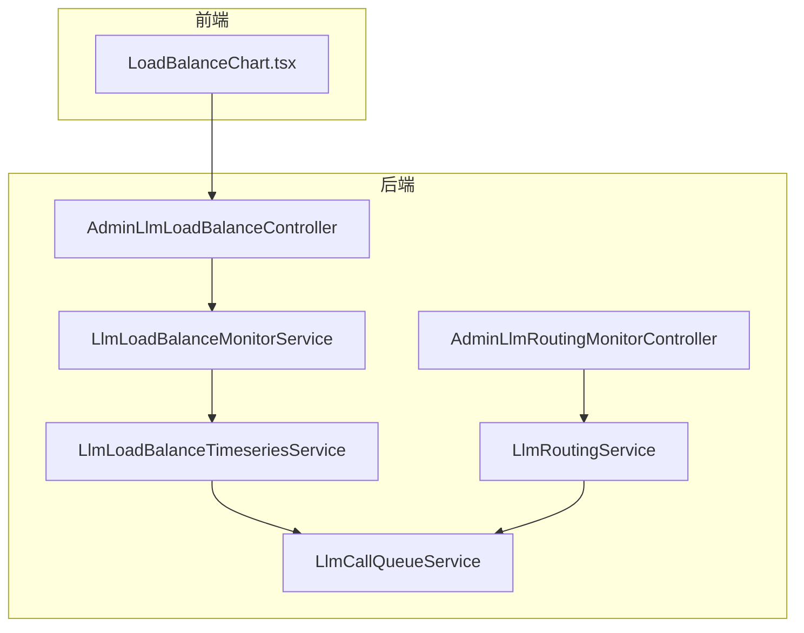
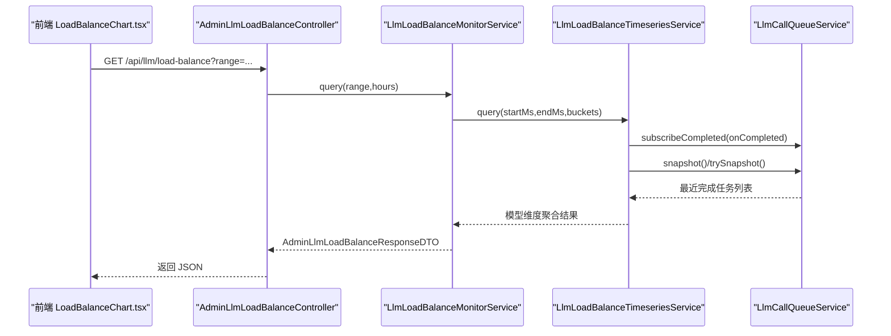
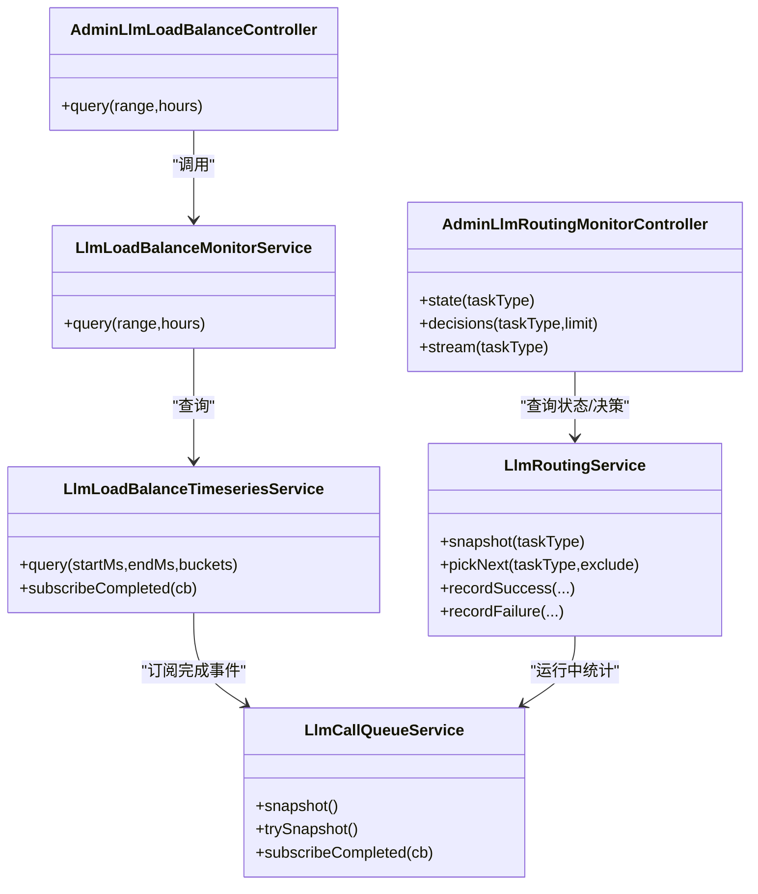

# 负载均衡监控

<cite>
**本文档引用的文件**
- [LlmLoadBalanceMonitorService.java](file://src/main/java/com/example/EnterpriseRagCommunity/service/monitor/LlmLoadBalanceMonitorService.java)
- [LlmLoadBalanceTimeseriesService.java](file://src/main/java/com/example/EnterpriseRagCommunity/service/monitor/LlmLoadBalanceTimeseriesService.java)
- [AdminLlmLoadBalanceController.java](file://src/main/java/com/example/EnterpriseRagCommunity/controller/monitor/admin/AdminLlmLoadBalanceController.java)
- [LoadBalanceChart.tsx](file://my-vite-app/src/pages/admin/forms/metrics/LoadBalanceChart.tsx)
- [LlmRoutingService.java](file://src/main/java/com/example/EnterpriseRagCommunity/service/ai/LlmRoutingService.java)
- [LlmCallQueueService.java](file://src/main/java/com/example/EnterpriseRagCommunity/service/ai/LlmCallQueueService.java)
- [AdminLlmRoutingMonitorController.java](file://src/main/java/com/example/EnterpriseRagCommunity/controller/monitor/admin/AdminLlmRoutingMonitorController.java)
- [AdminLlmLoadBalanceResponseDTO.java](file://src/main/java/com/example/EnterpriseRagCommunity/dto/monitor/AdminLlmLoadBalanceResponseDTO.java)
- [AdminLlmLoadBalanceModelDTO.java](file://src/main/java/com/example/EnterpriseRagCommunity/dto/monitor/AdminLlmLoadBalanceModelDTO.java)
- [AdminLlmLoadBalancePointDTO.java](file://src/main/java/com/example/EnterpriseRagCommunity/dto/monitor/AdminLlmLoadBalancePointDTO.java)
- [AdminLlmModelStatusItemDTO.java](file://src/main/java/com/example/EnterpriseRagCommunity/dto/monitor/AdminLlmModelStatusItemDTO.java)
- [AdminLlmModelCallRecordDTO.java](file://src/main/java/com/example/EnterpriseRagCommunity/dto/monitor/AdminLlmModelCallRecordDTO.java)
- [MetricsEventsCreateDTO.java](file://src/main/java/com/example/EnterpriseRagCommunity/dto/monitor/MetricsEventsCreateDTO.java)
- [MetricsEventsUpdateDTO.java](file://src/main/java/com/example/EnterpriseRagCommunity/dto/monitor/MetricsEventsUpdateDTO.java)
- [MetricType.java](file://src/main/java/com/example/EnterpriseRagCommunity/entity/monitor/enums/MetricType.java)
</cite>

## 目录
1. [引言](#引言)
2. [项目结构](#项目结构)
3. [核心组件](#核心组件)
4. [架构总览](#架构总览)
5. [详细组件分析](#详细组件分析)
6. [依赖关系分析](#依赖关系分析)
7. [性能考量](#性能考量)
8. [故障排查指南](#故障排查指南)
9. [结论](#结论)
10. [附录：API 接口规范](#附录api-接口规范)

## 引言
本文件面向企业级 RAG 社区项目的 LLM 负载均衡监控系统，系统性阐述模型调用负载分布、实时负载监控与历史趋势分析的完整能力。重点覆盖以下方面：
- 负载均衡算法实现（加权轮询、优先级回退、速率配额与冷却机制）
- 监控指标采集与统计（QPS、平均/尾延迟、错误率、429 限流率）
- 时间序列数据分析与可视化（分钟级聚合、桶划分、P95 计算）
- 负载均衡 DTO 数据结构与服务架构
- 管理端 API 规范（负载状态查询、路由决策流、模型性能监控）

## 项目结构
后端采用分层架构，监控与路由相关代码主要分布在以下包：
- controller/monitor/admin：对外暴露管理端监控接口
- service/monitor：监控数据聚合与时间序列处理
- service/ai：路由策略、队列与运行时状态
- dto/monitor：前后端交互的监控数据传输对象
- my-vite-app/src/pages/admin：前端可视化与交互

图表来源
- [AdminLlmLoadBalanceController.java:16-23](file://src/main/java/com/example/EnterpriseRagCommunity/controller/monitor/admin/AdminLlmLoadBalanceController.java#L16-L23)
- [LlmLoadBalanceMonitorService.java:24-75](file://src/main/java/com/example/EnterpriseRagCommunity/service/monitor/LlmLoadBalanceMonitorService.java#L24-L75)
- [LlmLoadBalanceTimeseriesService.java:98-126](file://src/main/java/com/example/EnterpriseRagCommunity/service/monitor/LlmLoadBalanceTimeseriesService.java#L98-L126)
- [LlmRoutingService.java:104-112](file://src/main/java/com/example/EnterpriseRagCommunity/service/ai/LlmRoutingService.java#L104-L112)
- [LlmCallQueueService.java:666-762](file://src/main/java/com/example/EnterpriseRagCommunity/service/ai/LlmCallQueueService.java#L666-L762)
- [AdminLlmRoutingMonitorController.java:30-69](file://src/main/java/com/example/EnterpriseRagCommunity/controller/monitor/admin/AdminLlmRoutingMonitorController.java#L30-L69)

章节来源
- [AdminLlmLoadBalanceController.java:1-25](file://src/main/java/com/example/EnterpriseRagCommunity/controller/monitor/admin/AdminLlmLoadBalanceController.java#L1-L25)
- [LlmLoadBalanceMonitorService.java:1-147](file://src/main/java/com/example/EnterpriseRagCommunity/service/monitor/LlmLoadBalanceMonitorService.java#L1-L147)
- [LlmLoadBalanceTimeseriesService.java:1-272](file://src/main/java/com/example/EnterpriseRagCommunity/service/monitor/LlmLoadBalanceTimeseriesService.java#L1-L272)
- [LlmRoutingService.java:1-541](file://src/main/java/com/example/EnterpriseRagCommunity/service/ai/LlmRoutingService.java#L1-L541)
- [LlmCallQueueService.java:1-800](file://src/main/java/com/example/EnterpriseRagCommunity/service/ai/LlmCallQueueService.java#L1-L800)
- [AdminLlmRoutingMonitorController.java:1-154](file://src/main/java/com/example/EnterpriseRagCommunity/controller/monitor/admin/AdminLlmRoutingMonitorController.java#L1-L154)

## 核心组件
- 负载均衡监控服务：解析时间范围、计算桶大小、聚合模型维度指标并返回前端所需结构
- 时间序列服务：基于分钟级窗口聚合调用事件，支持桶内样本采样与 P95 统计
- 路由服务：实现加权轮询与优先级回退策略，维护健康状态、速率令牌与冷却时间
- 队列服务：提供任务快照、最近完成任务列表与事件订阅，支撑监控数据源
- 控制器：对外暴露查询与 SSE 流接口，供前端拉取与实时订阅

章节来源
- [LlmLoadBalanceMonitorService.java:24-75](file://src/main/java/com/example/EnterpriseRagCommunity/service/monitor/LlmLoadBalanceMonitorService.java#L24-L75)
- [LlmLoadBalanceTimeseriesService.java:138-171](file://src/main/java/com/example/EnterpriseRagCommunity/service/monitor/LlmLoadBalanceTimeseriesService.java#L138-L171)
- [LlmRoutingService.java:304-336](file://src/main/java/com/example/EnterpriseRagCommunity/service/ai/LlmRoutingService.java#L304-L336)
- [LlmCallQueueService.java:666-762](file://src/main/java/com/example/EnterpriseRagCommunity/service/ai/LlmCallQueueService.java#L666-L762)
- [AdminLlmRoutingMonitorController.java:30-69](file://src/main/java/com/example/EnterpriseRagCommunity/controller/monitor/admin/AdminLlmRoutingMonitorController.java#L30-L69)

## 架构总览
系统通过控制器接收请求，监控服务进行范围与桶参数解析，时间序列服务从队列服务的完成事件中聚合分钟级数据，最终以 DTO 结构返回给前端可视化组件。

图表来源
- [AdminLlmLoadBalanceController.java:16-23](file://src/main/java/com/example/EnterpriseRagCommunity/controller/monitor/admin/AdminLlmLoadBalanceController.java#L16-L23)
- [LlmLoadBalanceMonitorService.java:24-75](file://src/main/java/com/example/EnterpriseRagCommunity/service/monitor/LlmLoadBalanceMonitorService.java#L24-L75)
- [LlmLoadBalanceTimeseriesService.java:98-126](file://src/main/java/com/example/EnterpriseRagCommunity/service/monitor/LlmLoadBalanceTimeseriesService.java#L98-L126)
- [LlmCallQueueService.java:666-762](file://src/main/java/com/example/EnterpriseRagCommunity/service/ai/LlmCallQueueService.java#L666-L762)

## 详细组件分析

### 负载均衡监控服务（LlmLoadBalanceMonitorService）
职责
- 解析时间范围参数，限定最小/最大范围与桶数量
- 计算每个桶的时间跨度与统计口径
- 调用时间序列服务获取模型维度聚合结果
- 计算总体 QPS、错误率、429 限流率与 P95 响应时间
- 对模型按 QPS 排序并封装为响应 DTO

关键逻辑
- 时间范围解析与规范化
- 桶数与桶宽计算
- 模型维度指标计算与点级指标映射

章节来源
- [LlmLoadBalanceMonitorService.java:24-147](file://src/main/java/com/example/EnterpriseRagCommunity/service/monitor/LlmLoadBalanceMonitorService.java#L24-L147)
- [AdminLlmLoadBalanceResponseDTO.java:8-14](file://src/main/java/com/example/EnterpriseRagCommunity/dto/monitor/AdminLlmLoadBalanceResponseDTO.java#L8-L14)
- [AdminLlmLoadBalanceModelDTO.java:8-18](file://src/main/java/com/example/EnterpriseRagCommunity/dto/monitor/AdminLlmLoadBalanceModelDTO.java#L8-L18)
- [AdminLlmLoadBalancePointDTO.java:6-16](file://src/main/java/com/example/EnterpriseRagCommunity/dto/monitor/AdminLlmLoadBalancePointDTO.java#L6-L16)

### 时间序列服务（LlmLoadBalanceTimeseriesService）
职责
- 订阅队列完成事件，按分钟窗口聚合调用次数、耗时、错误与 429 次数
- 维护每分钟样本集，用于 P95 近似计算
- 支持跨分钟与跨桶的聚合，输出模型维度序列

关键数据结构
- MinuteAgg：每分钟累计计数、耗时求和、错误与 429 计数，以及少量样本
- MinuteBucket：按模型键聚合的分钟窗口
- ModelAgg：跨桶聚合，输出桶级点与全局统计
- BucketPoint：单桶指标（计数、错误、429、平均耗时、P95）

算法要点
- 分钟对齐与清理过期分钟桶
- 桶内样本上限控制与随机替换，保证 P95 的代表性
- 桶级与全局 P95 使用百分位计算

章节来源
- [LlmLoadBalanceTimeseriesService.java:55-272](file://src/main/java/com/example/EnterpriseRagCommunity/service/monitor/LlmLoadBalanceTimeseriesService.java#L55-L272)

### 路由服务（LlmRoutingService）
职责
- 提供路由策略（加权轮询、优先级回退）与目标列表
- 维护运行时健康状态（连续失败、冷却时间）
- 实现速率配额（令牌桶）与调度预留
- 提供运行时快照，包含权重、运行中数量、速率令牌等

算法与数据结构
- 加权轮询：为候选目标累积 currentWeight，选择最大者并减去总权重
- 速率配额：按 QPS 动态补充令牌，预留时消耗令牌
- 冷却：连续失败达到阈值或收到 429 时进入冷却

章节来源
- [LlmRoutingService.java:304-336](file://src/main/java/com/example/EnterpriseRagCommunity/service/ai/LlmRoutingService.java#L304-L336)
- [LlmRoutingService.java:382-439](file://src/main/java/com/example/EnterpriseRagCommunity/service/ai/LlmRoutingService.java#L382-L439)
- [LlmRoutingService.java:338-372](file://src/main/java/com/example/EnterpriseRagCommunity/service/ai/LlmRoutingService.java#L338-L372)

### 队列服务（LlmCallQueueService）
职责
- 维护任务队列、运行中与最近完成列表
- 提供快照接口，支持限制大小与非阻塞尝试
- 订阅完成事件，供监控服务聚合

章节来源
- [LlmCallQueueService.java:666-762](file://src/main/java/com/example/EnterpriseRagCommunity/service/ai/LlmCallQueueService.java#L666-L762)
- [LlmCallQueueService.java:103-126](file://src/main/java/com/example/EnterpriseRagCommunity/service/ai/LlmCallQueueService.java#L103-L126)

### 前端可视化（LoadBalanceChart.tsx）
职责
- 提供时间范围切换与自动刷新
- 从后端拉取数据并本地缓存，支持降级请求
- 计算均衡建议（上调/下调/摘除/检查无流量），并渲染 ECharts 图表

章节来源
- [LoadBalanceChart.tsx:274-328](file://my-vite-app/src/pages/admin/forms/metrics/LoadBalanceChart.tsx#L274-L328)
- [LoadBalanceChart.tsx:333-452](file://my-vite-app/src/pages/admin/forms/metrics/LoadBalanceChart.tsx#L333-L452)
- [LoadBalanceChart.tsx:466-488](file://my-vite-app/src/pages/admin/forms/metrics/LoadBalanceChart.tsx#L466-L488)

### 路由监控控制器（AdminLlmRoutingMonitorController）
职责
- 提供路由状态查询、决策事件列表与 SSE 实时流
- 支持按任务类型过滤与限制条目数

章节来源
- [AdminLlmRoutingMonitorController.java:30-103](file://src/main/java/com/example/EnterpriseRagCommunity/controller/monitor/admin/AdminLlmRoutingMonitorController.java#L30-L103)
- [AdminLlmRoutingMonitorController.java:105-141](file://src/main/java/com/example/EnterpriseRagCommunity/controller/monitor/admin/AdminLlmRoutingMonitorController.java#L105-L141)

## 依赖关系分析

图表来源
- [AdminLlmLoadBalanceController.java:16-23](file://src/main/java/com/example/EnterpriseRagCommunity/controller/monitor/admin/AdminLlmLoadBalanceController.java#L16-L23)
- [LlmLoadBalanceMonitorService.java:24-75](file://src/main/java/com/example/EnterpriseRagCommunity/service/monitor/LlmLoadBalanceMonitorService.java#L24-L75)
- [LlmLoadBalanceTimeseriesService.java:98-126](file://src/main/java/com/example/EnterpriseRagCommunity/service/monitor/LlmLoadBalanceTimeseriesService.java#L98-L126)
- [LlmCallQueueService.java:666-762](file://src/main/java/com/example/EnterpriseRagCommunity/service/ai/LlmCallQueueService.java#L666-L762)
- [AdminLlmRoutingMonitorController.java:30-69](file://src/main/java/com/example/EnterpriseRagCommunity/controller/monitor/admin/AdminLlmRoutingMonitorController.java#L30-L69)
- [LlmRoutingService.java:232-284](file://src/main/java/com/example/EnterpriseRagCommunity/service/ai/LlmRoutingService.java#L232-L284)

## 性能考量
- 时间序列聚合
  - 分钟桶清理：定期清理超过保留窗口的分钟桶，避免内存膨胀
  - 样本上限：每分钟仅保留固定数量样本，使用随机替换策略，平衡 P95 准确性与内存占用
  - 桶数量限制：限制最大桶数，确保查询性能稳定
- 路由调度
  - 加权轮询使用局部锁保护，减少竞争开销
  - 速率配额按秒动态补充，预留时才扣减令牌，避免过度限流
  - 冷却时间与失败阈值防止雪崩效应
- 前端缓存
  - 本地缓存 24 小时 TTL，降低重复请求压力
  - 支持降级请求与错误提示，提升用户体验

[本节为通用性能讨论，无需具体文件分析]

## 故障排查指南
- 负载均衡数据为空
  - 检查队列是否正常工作与是否有最近完成任务
  - 确认时间范围是否合理（最小/最大范围限制）
  - 查看前端缓存是否命中
- 响应缓慢或 P95 波动大
  - 关注路由状态中的冷却剩余时间与连续失败数
  - 检查速率令牌是否不足导致排队
- SSE 实时流断开
  - 确认权限与任务类型过滤条件
  - 检查订阅回调是否抛出异常导致连接关闭

章节来源
- [LlmLoadBalanceMonitorService.java:77-108](file://src/main/java/com/example/EnterpriseRagCommunity/service/monitor/LlmLoadBalanceMonitorService.java#L77-L108)
- [LlmLoadBalanceTimeseriesService.java:128-136](file://src/main/java/com/example/EnterpriseRagCommunity/service/monitor/LlmLoadBalanceTimeseriesService.java#L128-L136)
- [AdminLlmRoutingMonitorController.java:105-141](file://src/main/java/com/example/EnterpriseRagCommunity/controller/monitor/admin/AdminLlmRoutingMonitorController.java#L105-L141)

## 结论
该系统通过“队列完成事件 → 分钟聚合 → 桶级统计”的链路，实现了对 LLM 调用的多维负载监控，并结合路由策略与速率配额保障稳定性。前端提供直观的可视化与均衡建议，便于管理员快速定位问题与优化负载分配。

[本节为总结性内容，无需具体文件分析]

## 附录API 接口规范

### 负载状态查询
- 方法与路径
  - GET /api/llm/load-balance
  - GET /api/admin/metrics/llm-load-balance
- 权限
  - admin_metrics_llm_queue:read
- 查询参数
  - range：时间范围字符串（如 1h、30m、15m 等）
  - hours：小时数（与 range 二选一）
- 响应
  - AdminLlmLoadBalanceResponseDTO：包含范围、起止时间、桶间隔与模型列表
  - 模型项包含 providerId、modelName、count、qps、avgResponseMs、errorRate、throttled429Rate、p95ResponseMs 及点级数组

章节来源
- [AdminLlmLoadBalanceController.java:16-23](file://src/main/java/com/example/EnterpriseRagCommunity/controller/monitor/admin/AdminLlmLoadBalanceController.java#L16-L23)
- [AdminLlmLoadBalanceResponseDTO.java:8-14](file://src/main/java/com/example/EnterpriseRagCommunity/dto/monitor/AdminLlmLoadBalanceResponseDTO.java#L8-L14)
- [AdminLlmLoadBalanceModelDTO.java:8-18](file://src/main/java/com/example/EnterpriseRagCommunity/dto/monitor/AdminLlmLoadBalanceModelDTO.java#L8-L18)
- [AdminLlmLoadBalancePointDTO.java:6-16](file://src/main/java/com/example/EnterpriseRagCommunity/dto/monitor/AdminLlmLoadBalancePointDTO.java#L6-L16)

### 路由状态与决策
- 路由状态
  - GET /api/admin/metrics/llm-routing/state
  - 参数：taskType（可选）
  - 响应：策略信息与各目标运行时状态（权重、优先级、运行中数量、连续失败、冷却剩余、当前权重、最后调度时间、速率令牌等）
- 路由决策列表
  - GET /api/admin/metrics/llm-routing/decisions
  - 参数：taskType（可选）、limit（1~10000）
  - 响应：决策事件列表（时间戳、任务类型、尝试次数、提供商/模型、结果、错误码/消息、延迟、上游来源）
- 路由决策流
  - GET /api/admin/metrics/llm-routing/stream
  - 参数：taskType（可选）
  - 响应：SSE 流，事件名 routing，数据为决策事件

章节来源
- [AdminLlmRoutingMonitorController.java:30-103](file://src/main/java/com/example/EnterpriseRagCommunity/controller/monitor/admin/AdminLlmRoutingMonitorController.java#L30-L103)
- [AdminLlmRoutingMonitorController.java:105-141](file://src/main/java/com/example/EnterpriseRagCommunity/controller/monitor/admin/AdminLlmRoutingMonitorController.java#L105-L141)

### 指标事件管理（扩展）
- 创建指标事件
  - POST /api/admin/metrics/events
  - 请求体：MetricsEventsCreateDTO（name、tags、value、ts）
- 更新指标事件
  - PUT /api/admin/metrics/events
  - 请求体：MetricsEventsUpdateDTO（id、name/tags/value 可选更新）

章节来源
- [MetricsEventsCreateDTO.java:13-29](file://src/main/java/com/example/EnterpriseRagCommunity/dto/monitor/MetricsEventsCreateDTO.java#L13-L29)
- [MetricsEventsUpdateDTO.java:14-31](file://src/main/java/com/example/EnterpriseRagCommunity/dto/monitor/MetricsEventsUpdateDTO.java#L14-L31)
- [MetricType.java:3-7](file://src/main/java/com/example/EnterpriseRagCommunity/entity/monitor/enums/MetricType.java#L3-L7)

### 模型状态与调用记录（扩展）
- 模型状态项
  - providerId、modelName、runningCount、records（含任务 ID、类型、状态、耗时、令牌用量、错误信息等）
- 用途
  - 辅助定位模型运行状况与异常调用

章节来源
- [AdminLlmModelStatusItemDTO.java:8-13](file://src/main/java/com/example/EnterpriseRagCommunity/dto/monitor/AdminLlmModelStatusItemDTO.java#L8-L13)
- [AdminLlmModelCallRecordDTO.java:6-18](file://src/main/java/com/example/EnterpriseRagCommunity/dto/monitor/AdminLlmModelCallRecordDTO.java#L6-L18)