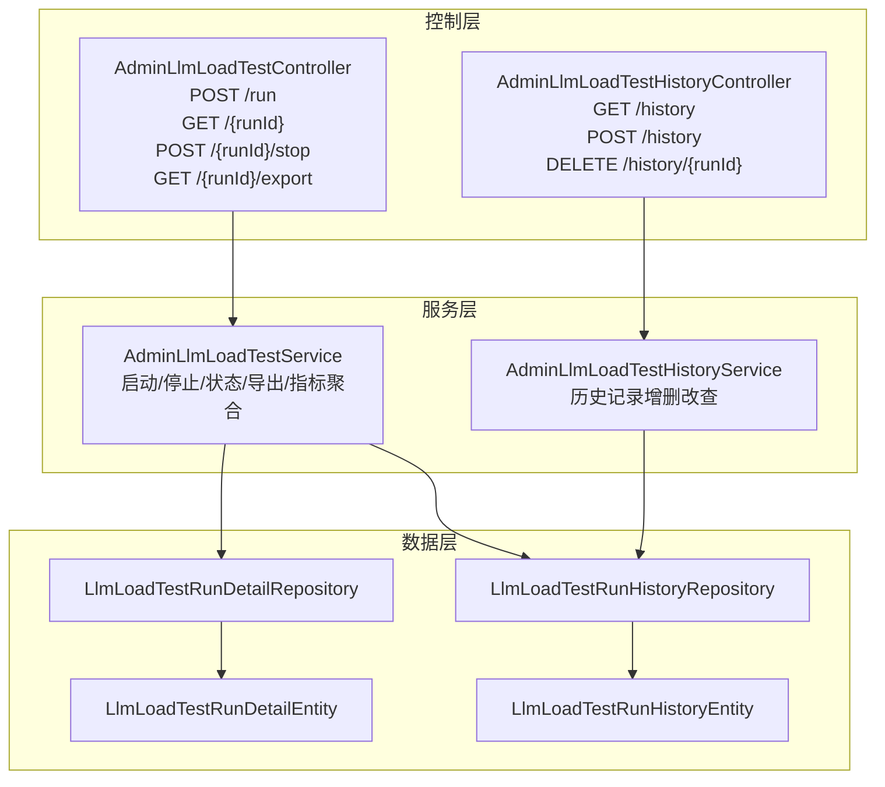
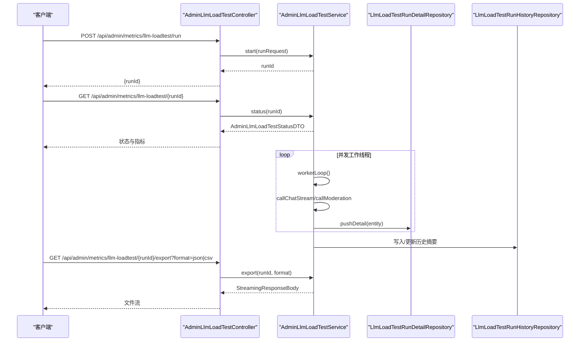
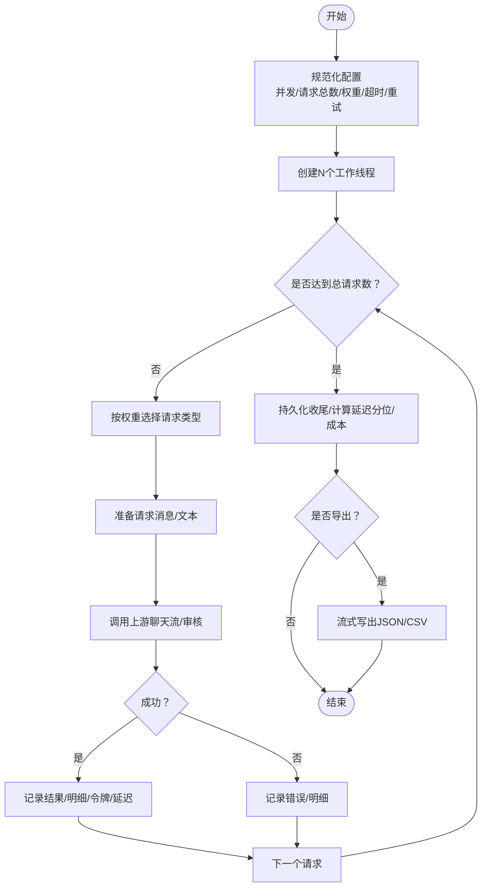
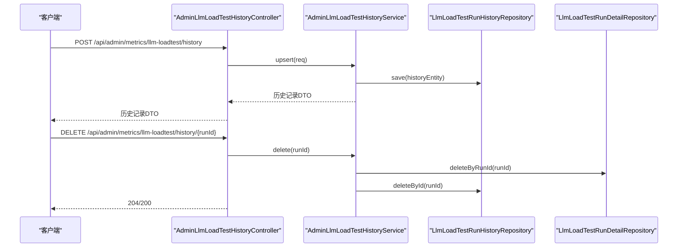
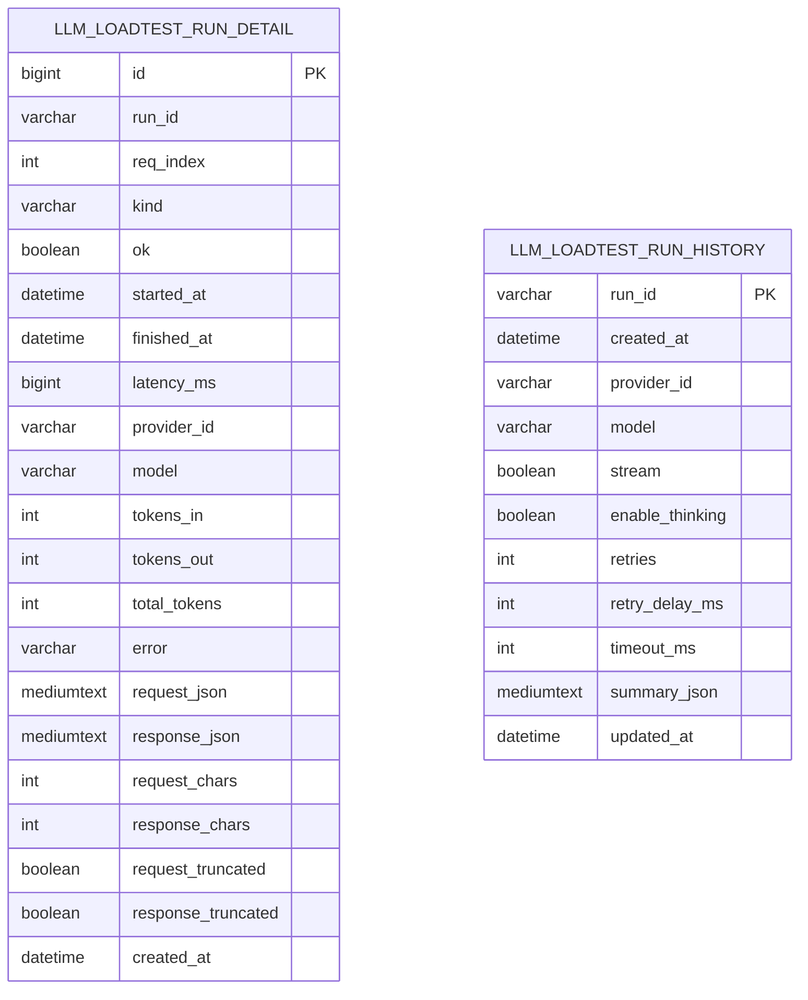
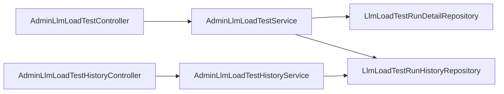

# 负载测试监控

<cite>
**本文引用的文件**
- [AdminLlmLoadTestController.java](file://src/main/java/com/example/EnterpriseRagCommunity/controller/monitor/admin/AdminLlmLoadTestController.java)
- [AdminLlmLoadTestService.java](file://src/main/java/com/example/EnterpriseRagCommunity/service/monitor/AdminLlmLoadTestService.java)
- [AdminLlmLoadTestRunRequestDTO.java](file://src/main/java/com/example/EnterpriseRagCommunity/dto/monitor/AdminLlmLoadTestRunRequestDTO.java)
- [AdminLlmLoadTestRunResponseDTO.java](file://src/main/java/com/example/EnterpriseRagCommunity/dto/monitor/AdminLlmLoadTestRunResponseDTO.java)
- [AdminLlmLoadTestStatusDTO.java](file://src/main/java/com/example/EnterpriseRagCommunity/dto/monitor/AdminLlmLoadTestStatusDTO.java)
- [AdminLlmLoadTestResultDTO.java](file://src/main/java/com/example/EnterpriseRagCommunity/dto/monitor/AdminLlmLoadTestResultDTO.java)
- [AdminLlmLoadTestQueuePeakDTO.java](file://src/main/java/com/example/EnterpriseRagCommunity/dto/monitor/AdminLlmLoadTestQueuePeakDTO.java)
- [AdminLlmLoadTestHistoryController.java](file://src/main/java/com/example/EnterpriseRagCommunity/controller/monitor/admin/AdminLlmLoadTestHistoryController.java)
- [AdminLlmLoadTestHistoryService.java](file://src/main/java/com/example/EnterpriseRagCommunity/service/monitor/AdminLlmLoadTestHistoryService.java)
- [AdminLlmLoadTestHistoryRecordDTO.java](file://src/main/java/com/example/EnterpriseRagCommunity/dto/monitor/AdminLlmLoadTestHistoryRecordDTO.java)
- [AdminLlmLoadTestHistoryUpsertRequestDTO.java](file://src/main/java/com/example/EnterpriseRagCommunity/dto/monitor/AdminLlmLoadTestHistoryUpsertRequestDTO.java)
- [LlmLoadTestRunDetailEntity.java](file://src/main/java/com/example/EnterpriseRagCommunity/entity/monitor/LlmLoadTestRunDetailEntity.java)
- [LlmLoadTestRunHistoryEntity.java](file://src/main/java/com/example/EnterpriseRagCommunity/entity/monitor/LlmLoadTestRunHistoryEntity.java)
- [LlmLoadTestRunDetailRepository.java](file://src/main/java/com/example/EnterpriseRagCommunity/repository/monitor/LlmLoadTestRunDetailRepository.java)
- [LlmLoadTestRunHistoryRepository.java](file://src/main/java/com/example/EnterpriseRagCommunity/repository/monitor/LlmLoadTestRunHistoryRepository.java)
- [EnterpriseRagCommunity_basic_load.jmx](file://perf/jmeter/EnterpriseRagCommunity_basic_load.jmx)
- [run-jmeter.ps1](file://perf/jmeter/run-jmeter.ps1)
- [自动化测试与指标说明.md](file://docs/自动化测试与指标说明.md)
</cite>

## 目录
1. [引言](#引言)
2. [项目结构](#项目结构)
3. [核心组件](#核心组件)
4. [架构总览](#架构总览)
5. [详细组件分析](#详细组件分析)
6. [依赖关系分析](#依赖关系分析)
7. [性能考量](#性能考量)
8. [故障排查指南](#故障排查指南)
9. [结论](#结论)
10. [附录](#附录)

## 引言
本文件面向企业级大模型（LLM）系统的负载测试与性能监控，系统性阐述负载测试计划管理、执行状态监控、结果分析统计、并发控制机制、性能指标采集与存储策略，并提供API接口规范与报告生成机制。文档同时结合现有JMeter脚本与仓库内服务实现，帮助读者快速理解并落地压测工作。

## 项目结构
围绕负载测试监控的关键模块由三层构成：
- 控制层：负责REST API入口与权限校验
- 服务层：负责测试调度、并发执行、指标聚合、持久化与导出
- 数据层：负责测试明细与历史记录的持久化

图表来源
- [AdminLlmLoadTestController.java:24-66](file://src/main/java/com/example/EnterpriseRagCommunity/controller/monitor/admin/AdminLlmLoadTestController.java#L24-L66)
- [AdminLlmLoadTestHistoryController.java:22-56](file://src/main/java/com/example/EnterpriseRagCommunity/controller/monitor/admin/AdminLlmLoadTestHistoryController.java#L22-L56)
- [AdminLlmLoadTestService.java:75-104](file://src/main/java/com/example/EnterpriseRagCommunity/service/monitor/AdminLlmLoadTestService.java#L75-L104)
- [AdminLlmLoadTestHistoryService.java:21-30](file://src/main/java/com/example/EnterpriseRagCommunity/service/monitor/AdminLlmLoadTestHistoryService.java#L21-L30)
- [LlmLoadTestRunDetailRepository.java:9-14](file://src/main/java/com/example/EnterpriseRagCommunity/repository/monitor/LlmLoadTestRunDetailRepository.java#L9-L14)
- [LlmLoadTestRunHistoryRepository.java:10-13](file://src/main/java/com/example/EnterpriseRagCommunity/repository/monitor/LlmLoadTestRunHistoryRepository.java#L10-L13)

章节来源
- [AdminLlmLoadTestController.java:24-66](file://src/main/java/com/example/EnterpriseRagCommunity/controller/monitor/admin/AdminLlmLoadTestController.java#L24-L66)
- [AdminLlmLoadTestHistoryController.java:22-56](file://src/main/java/com/example/EnterpriseRagCommunity/controller/monitor/admin/AdminLlmLoadTestHistoryController.java#L22-L56)

## 核心组件
- 控制器与服务
  - AdminLlmLoadTestController：提供测试任务创建、状态查询、停止与导出能力
  - AdminLlmLoadTestService：负责并发执行、队列采样、指标计算、成本估算、持久化与导出
  - AdminLlmLoadTestHistoryController/Service：提供历史记录列表、新增/更新、删除
- DTO与实体
  - 请求/响应/状态/结果/峰值DTO定义测试数据结构
  - 历史记录DTO封装摘要信息
  - 实体映射数据库表结构，支持明细与历史两条路径
- 仓库
  - 明细与历史仓库分别提供分页查询、存在性检查、批量保存与删除

章节来源
- [AdminLlmLoadTestService.java:75-104](file://src/main/java/com/example/EnterpriseRagCommunity/service/monitor/AdminLlmLoadTestService.java#L75-L104)
- [AdminLlmLoadTestHistoryService.java:21-30](file://src/main/java/com/example/EnterpriseRagCommunity/service/monitor/AdminLlmLoadTestHistoryService.java#L21-L30)
- [LlmLoadTestRunDetailEntity.java:15-89](file://src/main/java/com/example/EnterpriseRagCommunity/entity/monitor/LlmLoadTestRunDetailEntity.java#L15-L89)
- [LlmLoadTestRunHistoryEntity.java:13-54](file://src/main/java/com/example/EnterpriseRagCommunity/entity/monitor/LlmLoadTestRunHistoryEntity.java#L13-L54)

## 架构总览
下图展示从API到服务再到数据层的完整调用链路，以及并发执行与指标聚合的关键节点。

图表来源
- [AdminLlmLoadTestController.java:32-64](file://src/main/java/com/example/EnterpriseRagCommunity/controller/monitor/admin/AdminLlmLoadTestController.java#L32-L64)
- [AdminLlmLoadTestService.java:106-196](file://src/main/java/com/example/EnterpriseRagCommunity/service/monitor/AdminLlmLoadTestService.java#L106-L196)
- [LlmLoadTestRunDetailRepository.java:10-13](file://src/main/java/com/example/EnterpriseRagCommunity/repository/monitor/LlmLoadTestRunDetailRepository.java#L10-L13)
- [LlmLoadTestRunHistoryRepository.java:11-12](file://src/main/java/com/example/EnterpriseRagCommunity/repository/monitor/LlmLoadTestRunHistoryRepository.java#L11-L12)

## 详细组件分析

### 控制器与API规范
- 测试任务创建
  - 方法：POST /api/admin/metrics/llm-loadtest/run
  - 权限：admin_metrics_llm_queue/read
  - 请求体：AdminLlmLoadTestRunRequestDTO
  - 返回体：AdminLlmLoadTestRunResponseDTO(runId)
- 执行状态查询
  - 方法：GET /api/admin/metrics/llm-loadtest/{runId}
  - 返回体：AdminLlmLoadTestStatusDTO（含运行状态、计数、延迟分位、令牌统计、成本、队列峰值、最近结果）
- 停止测试
  - 方法：POST /api/admin/metrics/llm-loadtest/{runId}/stop
  - 返回：stopped=true 或 404
- 导出结果
  - 方法：GET /api/admin/metrics/llm-loadtest/{runId}/export?format=json|csv
  - 返回：StreamingResponseBody（CSV或JSON）

章节来源
- [AdminLlmLoadTestController.java:32-64](file://src/main/java/com/example/EnterpriseRagCommunity/controller/monitor/admin/AdminLlmLoadTestController.java#L32-L64)
- [AdminLlmLoadTestRunRequestDTO.java:6-20](file://src/main/java/com/example/EnterpriseRagCommunity/dto/monitor/AdminLlmLoadTestRunRequestDTO.java#L6-L20)
- [AdminLlmLoadTestRunResponseDTO.java:6-8](file://src/main/java/com/example/EnterpriseRagCommunity/dto/monitor/AdminLlmLoadTestRunResponseDTO.java#L6-L8)
- [AdminLlmLoadTestStatusDTO.java:10-34](file://src/main/java/com/example/EnterpriseRagCommunity/dto/monitor/AdminLlmLoadTestStatusDTO.java#L10-L34)

### 服务层：并发执行与指标聚合
- 并发与调度
  - 使用虚拟线程池执行器与固定大小线程池分别处理请求与令牌统计
  - 最大同时运行任务数限制，避免资源耗尽
  - 每个worker按权重随机选择聊天流式或审核测试请求
- 队列采样与峰值
  - 后台定时采样队列挂起/运行/总任务数与TPS，记录最大值与平均值
- 指标计算
  - 成功/失败/完成计数
  - 总/输入/输出令牌累计
  - 延迟均值、最大值、P50/P95分位
  - 成本估算（按模型价格配置与令牌统计）
- 结果导出
  - 支持JSON与CSV两种格式，分页读取明细表，流式写出

图表来源
- [AdminLlmLoadTestService.java:106-196](file://src/main/java/com/example/EnterpriseRagCommunity/service/monitor/AdminLlmLoadTestService.java#L106-L196)
- [AdminLlmLoadTestService.java:248-305](file://src/main/java/com/example/EnterpriseRagCommunity/service/monitor/AdminLlmLoadTestService.java#L248-L305)
- [AdminLlmLoadTestService.java:198-245](file://src/main/java/com/example/EnterpriseRagCommunity/service/monitor/AdminLlmLoadTestService.java#L198-L245)
- [AdminLlmLoadTestService.java:1145-1243](file://src/main/java/com/example/EnterpriseRagCommunity/service/monitor/AdminLlmLoadTestService.java#L1145-L1243)

章节来源
- [AdminLlmLoadTestService.java:75-104](file://src/main/java/com/example/EnterpriseRagCommunity/service/monitor/AdminLlmLoadTestService.java#L75-L104)
- [AdminLlmLoadTestService.java:106-196](file://src/main/java/com/example/EnterpriseRagCommunity/service/monitor/AdminLlmLoadTestService.java#L106-L196)
- [AdminLlmLoadTestService.java:198-245](file://src/main/java/com/example/EnterpriseRagCommunity/service/monitor/AdminLlmLoadTestService.java#L198-L245)
- [AdminLlmLoadTestService.java:1145-1243](file://src/main/java/com/example/EnterpriseRagCommunity/service/monitor/AdminLlmLoadTestService.java#L1145-L1243)

### DTO数据结构与字段说明
- AdminLlmLoadTestRunRequestDTO
  - 并发度、总请求数、聊天流权重、审核权重、提供商ID、模型名、是否流式、是否启用思考指令、超时、重试次数、重试间隔、聊天消息、审核文本
- AdminLlmLoadTestRunResponseDTO
  - runId
- AdminLlmLoadTestStatusDTO
  - 运行标识、时间戳、运行状态、取消标记、错误、完成/总数、成功/失败、平均/最大延迟、P50/P95延迟、总/输入/输出令牌、总成本、币种、价格缺失标记、队列峰值、最近结果列表
- AdminLlmLoadTestResultDTO
  - 索引、类型、成功标记、延迟毫秒、开始/结束时间、错误、令牌数、输入/输出令牌、模型名
- AdminLlmLoadTestQueuePeakDTO
  - 最大队列挂起、运行、总任务数，最大/平均TPS

章节来源
- [AdminLlmLoadTestRunRequestDTO.java:6-20](file://src/main/java/com/example/EnterpriseRagCommunity/dto/monitor/AdminLlmLoadTestRunRequestDTO.java#L6-L20)
- [AdminLlmLoadTestRunResponseDTO.java:6-8](file://src/main/java/com/example/EnterpriseRagCommunity/dto/monitor/AdminLlmLoadTestRunResponseDTO.java#L6-L8)
- [AdminLlmLoadTestStatusDTO.java:10-34](file://src/main/java/com/example/EnterpriseRagCommunity/dto/monitor/AdminLlmLoadTestStatusDTO.java#L10-L34)
- [AdminLlmLoadTestResultDTO.java:6-18](file://src/main/java/com/example/EnterpriseRagCommunity/dto/monitor/AdminLlmLoadTestResultDTO.java#L6-L18)
- [AdminLlmLoadTestQueuePeakDTO.java:6-12](file://src/main/java/com/example/EnterpriseRagCommunity/dto/monitor/AdminLlmLoadTestQueuePeakDTO.java#L6-L12)

### 历史记录管理
- 列表：按创建时间倒序返回历史记录（含摘要）
- 新增/更新：接收runId与summary，写入历史表
- 删除：删除历史记录及对应明细

图表来源
- [AdminLlmLoadTestHistoryController.java:36-54](file://src/main/java/com/example/EnterpriseRagCommunity/controller/monitor/admin/AdminLlmLoadTestHistoryController.java#L36-L54)
- [AdminLlmLoadTestHistoryService.java:29-81](file://src/main/java/com/example/EnterpriseRagCommunity/service/monitor/AdminLlmLoadTestHistoryService.java#L29-L81)
- [LlmLoadTestRunDetailRepository.java:12-13](file://src/main/java/com/example/EnterpriseRagCommunity/repository/monitor/LlmLoadTestRunDetailRepository.java#L12-L13)
- [LlmLoadTestRunHistoryRepository.java:11-12](file://src/main/java/com/example/EnterpriseRagCommunity/repository/monitor/LlmLoadTestRunHistoryRepository.java#L11-L12)

章节来源
- [AdminLlmLoadTestHistoryController.java:22-56](file://src/main/java/com/example/EnterpriseRagCommunity/controller/monitor/admin/AdminLlmLoadTestHistoryController.java#L22-L56)
- [AdminLlmLoadTestHistoryService.java:21-81](file://src/main/java/com/example/EnterpriseRagCommunity/service/monitor/AdminLlmLoadTestHistoryService.java#L21-L81)

### 数据模型与存储策略
- 明细表（llm_loadtest_run_detail）
  - 存储每次请求的详细信息：索引、类型、时间、延迟、提供商、模型、令牌、错误、请求/响应JSON及其截断标记
  - 分页查询按索引升序，便于导出
- 历史表（llm_loadtest_run_history）
  - 存储一次测试的摘要：创建/更新时间、提供商、模型、流式、思考指令开关、重试策略、超时、摘要JSON
  - 摘要JSON包含配置与统计结果
- 截断策略
  - 明细JSON超过阈值自动截断并追加后缀，避免过大文本影响存储与传输

图表来源
- [LlmLoadTestRunDetailEntity.java:19-87](file://src/main/java/com/example/EnterpriseRagCommunity/entity/monitor/LlmLoadTestRunDetailEntity.java#L19-L87)
- [LlmLoadTestRunHistoryEntity.java:17-52](file://src/main/java/com/example/EnterpriseRagCommunity/entity/monitor/LlmLoadTestRunHistoryEntity.java#L17-L52)

章节来源
- [LlmLoadTestRunDetailEntity.java:15-89](file://src/main/java/com/example/EnterpriseRagCommunity/entity/monitor/LlmLoadTestRunDetailEntity.java#L15-L89)
- [LlmLoadTestRunHistoryEntity.java:13-54](file://src/main/java/com/example/EnterpriseRagCommunity/entity/monitor/LlmLoadTestRunHistoryEntity.java#L13-L54)
- [LlmLoadTestRunDetailRepository.java:9-14](file://src/main/java/com/example/EnterpriseRagCommunity/repository/monitor/LlmLoadTestRunDetailRepository.java#L9-L14)
- [LlmLoadTestRunHistoryRepository.java:10-13](file://src/main/java/com/example/EnterpriseRagCommunity/repository/monitor/LlmLoadTestRunHistoryRepository.java#L10-L13)

### JMeter负载测试集成
- 测试计划：EnterpriseRagCommunity_basic_load.jmx
- 运行脚本：run-jmeter.ps1，支持主机、端口、协议、并发线程、坡道时间、循环次数等参数
- 使用说明：参考自动化测试与指标说明文档中的命令示例与排障提示

章节来源
- [EnterpriseRagCommunity_basic_load.jmx:1-22](file://perf/jmeter/EnterpriseRagCommunity_basic_load.jmx#L1-L22)
- [run-jmeter.ps1:1-54](file://perf/jmeter/run-jmeter.ps1#L1-L54)
- [自动化测试与指标说明.md:62-71](file://docs/自动化测试与指标说明.md#L62-L71)

## 依赖关系分析
- 控制器依赖服务层进行业务编排
- 服务层依赖网关、令牌统计、队列监控、模型与价格配置、仓库进行数据读写
- 仓库依赖JPA分页查询与批量操作

图表来源
- [AdminLlmLoadTestController.java:24-66](file://src/main/java/com/example/EnterpriseRagCommunity/controller/monitor/admin/AdminLlmLoadTestController.java#L24-L66)
- [AdminLlmLoadTestHistoryController.java:22-56](file://src/main/java/com/example/EnterpriseRagCommunity/controller/monitor/admin/AdminLlmLoadTestHistoryController.java#L22-L56)
- [AdminLlmLoadTestService.java:75-92](file://src/main/java/com/example/EnterpriseRagCommunity/service/monitor/AdminLlmLoadTestService.java#L75-L92)
- [AdminLlmLoadTestHistoryService.java:25-27](file://src/main/java/com/example/EnterpriseRagCommunity/service/monitor/AdminLlmLoadTestHistoryService.java#L25-L27)

章节来源
- [AdminLlmLoadTestService.java:75-92](file://src/main/java/com/example/EnterpriseRagCommunity/service/monitor/AdminLlmLoadTestService.java#L75-L92)
- [AdminLlmLoadTestHistoryService.java:25-27](file://src/main/java/com/example/EnterpriseRagCommunity/service/monitor/AdminLlmLoadTestHistoryService.java#L25-L27)

## 性能考量
- 并发模型
  - 使用虚拟线程池处理I/O密集型请求，降低上下文切换开销
  - 固定线程池处理令牌统计，避免过多线程竞争
- 指标计算
  - 使用无锁/低锁原子累加器与数组缓存，减少同步成本
  - 延迟分位采用排序与插值计算，保证准确性
- 存储与导出
  - 明细批量入库与流式导出，避免内存峰值
  - JSON/CSV双格式导出，满足不同下游需求
- 成本估算
  - 基于模型价格配置与令牌统计，支持思考/非思考模式切换

## 故障排查指南
- API返回404
  - runId不存在或已过期清理
- 导出为空
  - 确认runId是否存在明细或历史记录；若无则无法导出
- 超时/重试
  - 调整请求超时与重试策略；必要时降低并发
- 队列峰值过高
  - 观察队列峰值DTO中的最大挂起/运行/总任务数与TPS，适当降载或扩容
- 成本缺失
  - 检查模型价格配置是否齐全；若缺失将标记priceMissing

章节来源
- [AdminLlmLoadTestController.java:43-64](file://src/main/java/com/example/EnterpriseRagCommunity/controller/monitor/admin/AdminLlmLoadTestController.java#L43-L64)
- [AdminLlmLoadTestService.java:139-163](file://src/main/java/com/example/EnterpriseRagCommunity/service/monitor/AdminLlmLoadTestService.java#L139-L163)
- [AdminLlmLoadTestStatusDTO.java:29-33](file://src/main/java/com/example/EnterpriseRagCommunity/dto/monitor/AdminLlmLoadTestStatusDTO.java#L29-L33)

## 结论
该负载测试监控体系以清晰的分层设计实现了从任务创建、并发执行、指标聚合到结果导出与历史归档的全链路闭环。配合JMeter脚本，既可进行系统级压测，也可通过内部服务进行精细化的LLM吞吐与成本评估。建议在生产环境中结合队列峰值与成本估算进行容量规划，并定期维护模型价格配置以确保成本统计准确。

## 附录
- API一览
  - POST /api/admin/metrics/llm-loadtest/run
  - GET /api/admin/metrics/llm-loadtest/{runId}
  - POST /api/admin/metrics/llm-loadtest/{runId}/stop
  - GET /api/admin/metrics/llm-loadtest/{runId}/export?format=json|csv
  - GET /api/admin/metrics/llm-loadtest/history
  - POST /api/admin/metrics/llm-loadtest/history
  - DELETE /api/admin/metrics/llm-loadtest/history/{runId}
- JMeter运行示例
  - powershell -ExecutionPolicy Bypass -File perf\jmeter\run-jmeter.ps1 -HostName localhost -Port 8099 -Protocol http -Threads 500 -RampSeconds 5 -Loops 600