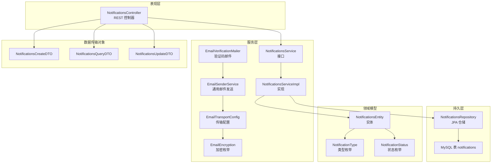
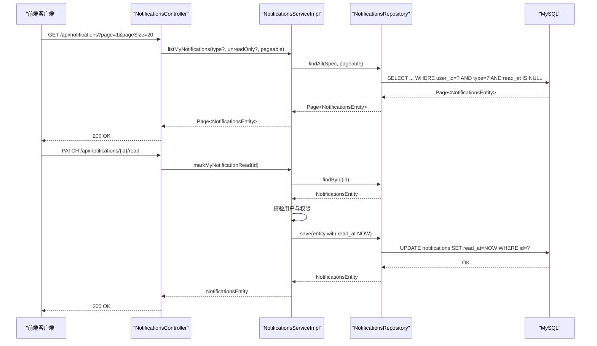
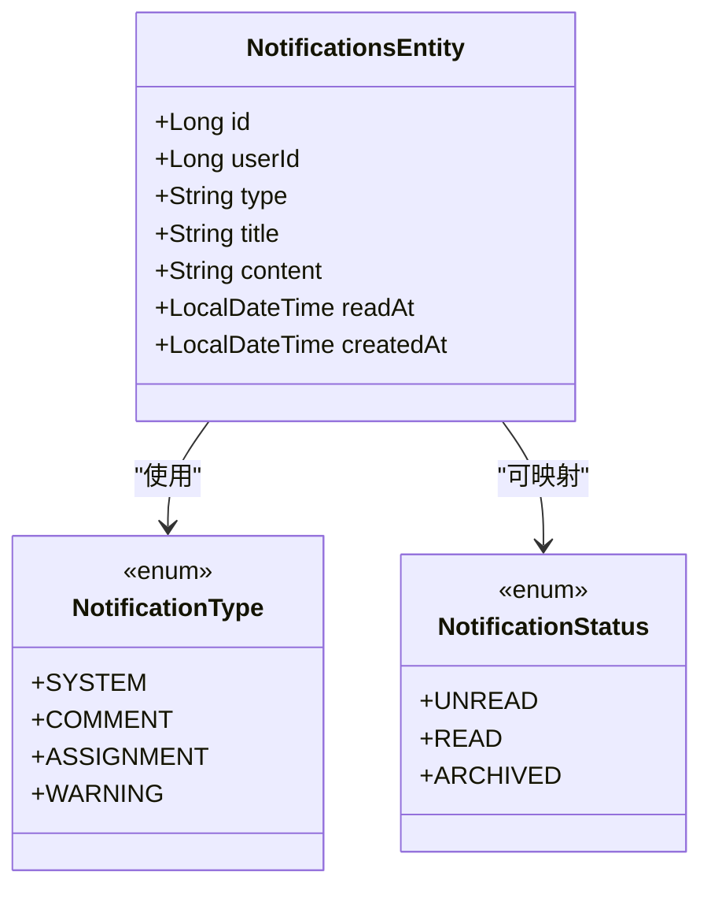
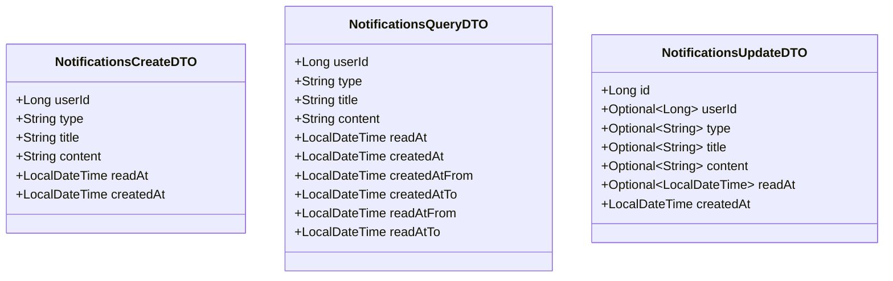
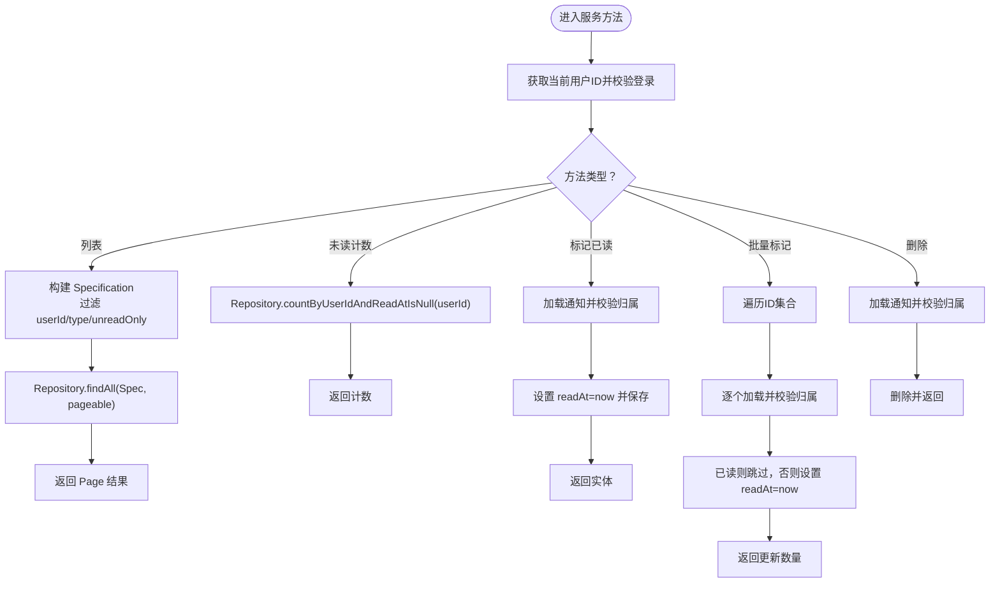
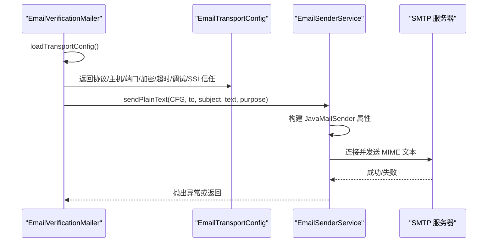
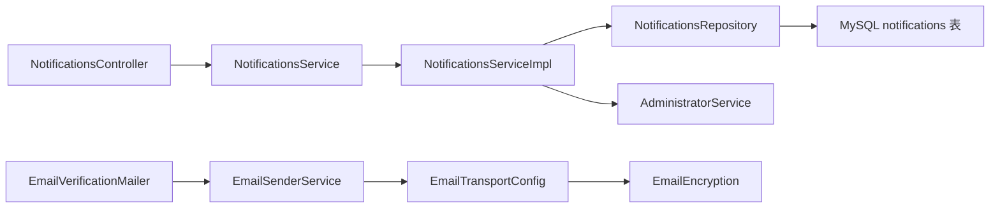

# 通知管理

<cite>
**本文引用的文件**
- [NotificationsController.java](file://src/main/java/com/example/EnterpriseRagCommunity/controller/NotificationsController.java)
- [NotificationsService.java](file://src/main/java/com/example/EnterpriseRagCommunity/service/monitor/NotificationsService.java)
- [NotificationsServiceImpl.java](file://src/main/java/com/example/EnterpriseRagCommunity/service/monitor/impl/NotificationsServiceImpl.java)
- [NotificationsRepository.java](file://src/main/java/com/example/EnterpriseRagCommunity/repository/monitor/NotificationsRepository.java)
- [NotificationsEntity.java](file://src/main/java/com/example/EnterpriseRagCommunity/entity/monitor/NotificationsEntity.java)
- [NotificationType.java](file://src/main/java/com/example/EnterpriseRagCommunity/entity/monitor/enums/NotificationType.java)
- [NotificationStatus.java](file://src/main/java/com/example/EnterpriseRagCommunity/entity/monitor/enums/NotificationStatus.java)
- [NotificationsCreateDTO.java](file://src/main/java/com/example/EnterpriseRagCommunity/dto/monitor/NotificationsCreateDTO.java)
- [NotificationsQueryDTO.java](file://src/main/java/com/example/EnterpriseRagCommunity/dto/monitor/NotificationsQueryDTO.java)
- [NotificationsUpdateDTO.java](file://src/main/java/com/example/EnterpriseRagCommunity/dto/monitor/NotificationsUpdateDTO.java)
- [EmailVerificationMailer.java](file://src/main/java/com/example/EnterpriseRagCommunity/service/notify/EmailVerificationMailer.java)
- [EmailSenderService.java](file://src/main/java/com/example/EnterpriseRagCommunity/service/notify/EmailSenderService.java)
- [EmailTransportConfig.java](file://src/main/java/com/example/EnterpriseRagCommunity/service/notify/EmailTransportConfig.java)
- [EmailEncryption.java](file://src/main/java/com/example/EnterpriseRagCommunity/service/notify/EmailEncryption.java)
- [AccountSecurityNotificationMailer.java](file://src/main/java/com/example/EnterpriseRagCommunity/service/notify/AccountSecurityNotificationMailer.java)
- [AccountEmailChangeNotificationMailer.java](file://src/main/java/com/example/EnterpriseRagCommunity/service/notify/AccountEmailChangeNotificationMailer.java)
</cite>

## 目录
1. [引言](#引言)
2. [项目结构](#项目结构)
3. [核心组件](#核心组件)
4. [架构总览](#架构总览)
5. [详细组件分析](#详细组件分析)
6. [依赖分析](#依赖分析)
7. [性能考虑](#性能考虑)
8. [故障排查指南](#故障排查指南)
9. [结论](#结论)
10. [附录](#附录)

## 引言
本文件为通知管理系统的功能文档，覆盖站内通知的发送、接收与管理能力，包括通知类型分类、发送状态跟踪、收件箱管理、邮件传输协议、通知模板管理、DTO 数据结构、枚举类型定义、状态管理、API 接口规范以及通知数据存储与发送队列管理等。文档旨在帮助开发者与运维人员快速理解系统设计与实现，并提供排障与优化建议。

## 项目结构
通知管理由“控制器-服务-仓储-实体-枚举-DTO-邮件发送”多层协作构成，采用 Spring MVC + Spring Data JPA 的典型后端架构。前端通过 REST API 与后端交互；邮件发送通过 JavaMail 实现，支持多种加密模式与超时配置。

图表来源
- [NotificationsController.java:1-258](file://src/main/java/com/example/EnterpriseRagCommunity/controller/NotificationsController.java#L1-L258)
- [NotificationsService.java:1-28](file://src/main/java/com/example/EnterpriseRagCommunity/service/monitor/NotificationsService.java#L1-L28)
- [NotificationsServiceImpl.java:1-135](file://src/main/java/com/example/EnterpriseRagCommunity/service/monitor/impl/NotificationsServiceImpl.java#L1-L135)
- [NotificationsRepository.java:1-18](file://src/main/java/com/example/EnterpriseRagCommunity/repository/monitor/NotificationsRepository.java#L1-L18)
- [NotificationsEntity.java:1-43](file://src/main/java/com/example/EnterpriseRagCommunity/entity/monitor/NotificationsEntity.java#L1-L43)
- [NotificationType.java:1-9](file://src/main/java/com/example/EnterpriseRagCommunity/entity/monitor/enums/NotificationType.java#L1-L9)
- [NotificationStatus.java:1-8](file://src/main/java/com/example/EnterpriseRagCommunity/entity/monitor/enums/NotificationStatus.java#L1-L8)
- [NotificationsCreateDTO.java:1-40](file://src/main/java/com/example/EnterpriseRagCommunity/dto/monitor/NotificationsCreateDTO.java#L1-L40)
- [NotificationsQueryDTO.java:1-51](file://src/main/java/com/example/EnterpriseRagCommunity/dto/monitor/NotificationsQueryDTO.java#L1-L51)
- [NotificationsUpdateDTO.java:1-39](file://src/main/java/com/example/EnterpriseRagCommunity/dto/monitor/NotificationsUpdateDTO.java#L1-L39)
- [EmailVerificationMailer.java:1-105](file://src/main/java/com/example/EnterpriseRagCommunity/service/notify/EmailVerificationMailer.java#L1-L105)
- [EmailSenderService.java:1-166](file://src/main/java/com/example/EnterpriseRagCommunity/service/notify/EmailSenderService.java#L1-L166)
- [EmailTransportConfig.java:1-14](file://src/main/java/com/example/EnterpriseRagCommunity/service/notify/EmailTransportConfig.java#L1-L14)
- [EmailEncryption.java:1-7](file://src/main/java/com/example/EnterpriseRagCommunity/service/notify/EmailEncryption.java#L1-L7)

章节来源
- [NotificationsController.java:1-258](file://src/main/java/com/example/EnterpriseRagCommunity/controller/NotificationsController.java#L1-L258)
- [NotificationsServiceImpl.java:1-135](file://src/main/java/com/example/EnterpriseRagCommunity/service/monitor/impl/NotificationsServiceImpl.java#L1-L135)
- [EmailVerificationMailer.java:1-105](file://src/main/java/com/example/EnterpriseRagCommunity/service/notify/EmailVerificationMailer.java#L1-L105)

## 核心组件
- 控制器层：提供通知列表、未读计数、单条/批量标记已读、删除等接口，统一进行鉴权与审计日志记录。
- 服务层：封装通知业务逻辑，包括查询、状态更新、删除与创建；同时负责用户身份校验与权限控制。
- 仓储层：基于 JPA Specification 提供复杂查询能力，支持按类型、是否未读、时间范围等条件筛选。
- 实体与枚举：定义通知表结构、类型与状态，确保数据一致性与可扩展性。
- DTO：定义创建、查询、更新的数据契约，约束字段长度与必填项。
- 邮件发送：提供通用邮件发送能力，支持 SMTP/SSL/STARTTLS，可配置连接、读写超时与调试开关。

章节来源
- [NotificationsController.java:38-161](file://src/main/java/com/example/EnterpriseRagCommunity/controller/NotificationsController.java#L38-L161)
- [NotificationsService.java:10-26](file://src/main/java/com/example/EnterpriseRagCommunity/service/monitor/NotificationsService.java#L10-L26)
- [NotificationsServiceImpl.java:43-133](file://src/main/java/com/example/EnterpriseRagCommunity/service/monitor/impl/NotificationsServiceImpl.java#L43-L133)
- [NotificationsRepository.java:10-17](file://src/main/java/com/example/EnterpriseRagCommunity/repository/monitor/NotificationsRepository.java#L10-L17)
- [NotificationsEntity.java:13-42](file://src/main/java/com/example/EnterpriseRagCommunity/entity/monitor/NotificationsEntity.java#L13-L42)
- [NotificationType.java:3-8](file://src/main/java/com/example/EnterpriseRagCommunity/entity/monitor/enums/NotificationType.java#L3-L8)
- [NotificationStatus.java:3-7](file://src/main/java/com/example/EnterpriseRagCommunity/entity/monitor/enums/NotificationStatus.java#L3-L7)
- [NotificationsCreateDTO.java:13-38](file://src/main/java/com/example/EnterpriseRagCommunity/dto/monitor/NotificationsCreateDTO.java#L13-L38)
- [NotificationsQueryDTO.java:10-50](file://src/main/java/com/example/EnterpriseRagCommunity/dto/monitor/NotificationsQueryDTO.java#L10-L50)
- [NotificationsUpdateDTO.java:12-38](file://src/main/java/com/example/EnterpriseRagCommunity/dto/monitor/NotificationsUpdateDTO.java#L12-L38)
- [EmailSenderService.java:28-88](file://src/main/java/com/example/EnterpriseRagCommunity/service/notify/EmailSenderService.java#L28-L88)
- [EmailVerificationMailer.java:27-33](file://src/main/java/com/example/EnterpriseRagCommunity/service/notify/EmailVerificationMailer.java#L27-L33)

## 架构总览
通知管理采用分层架构，控制器负责请求接入与响应封装，服务层处理业务规则与事务边界，仓储层抽象数据库访问，实体与枚举保证数据模型稳定。邮件发送模块独立于通知业务，通过可配置的传输参数实现灵活的 SMTP 发送。

图表来源
- [NotificationsController.java:38-106](file://src/main/java/com/example/EnterpriseRagCommunity/controller/NotificationsController.java#L38-L106)
- [NotificationsServiceImpl.java:43-81](file://src/main/java/com/example/EnterpriseRagCommunity/service/monitor/impl/NotificationsServiceImpl.java#L43-L81)
- [NotificationsRepository.java:10-17](file://src/main/java/com/example/EnterpriseRagCommunity/repository/monitor/NotificationsRepository.java#L10-L17)

## 详细组件分析

### 通知实体与枚举
- 实体字段：自增主键、接收用户 ID、类型字符串、标题、内容、已读时间、创建时间。
- 类型枚举：SYSTEM、COMMENT、ASSIGNMENT、WARNING。
- 状态枚举：UNREAD、READ、ARCHIVED（用于后续归档策略）。

图表来源
- [NotificationsEntity.java:13-42](file://src/main/java/com/example/EnterpriseRagCommunity/entity/monitor/NotificationsEntity.java#L13-L42)
- [NotificationType.java:3-8](file://src/main/java/com/example/EnterpriseRagCommunity/entity/monitor/enums/NotificationType.java#L3-L8)
- [NotificationStatus.java:3-7](file://src/main/java/com/example/EnterpriseRagCommunity/entity/monitor/enums/NotificationStatus.java#L3-L7)

章节来源
- [NotificationsEntity.java:13-42](file://src/main/java/com/example/EnterpriseRagCommunity/entity/monitor/NotificationsEntity.java#L13-L42)
- [NotificationType.java:3-8](file://src/main/java/com/example/EnterpriseRagCommunity/entity/monitor/enums/NotificationType.java#L3-L8)
- [NotificationStatus.java:3-7](file://src/main/java/com/example/EnterpriseRagCommunity/entity/monitor/enums/NotificationStatus.java#L3-L7)

### DTO 数据结构
- 创建 DTO：userId、type、title、content 可选 readAt/createdAt（系统填充）。
- 查询 DTO：继承分页基类，支持 userId、type、title、content、readAt、createdAt 的范围查询。
- 更新 DTO：支持对 userId/type/title/content/readAt 的可选更新，createdAt 只读。

图表来源
- [NotificationsCreateDTO.java:13-38](file://src/main/java/com/example/EnterpriseRagCommunity/dto/monitor/NotificationsCreateDTO.java#L13-L38)
- [NotificationsQueryDTO.java:10-50](file://src/main/java/com/example/EnterpriseRagCommunity/dto/monitor/NotificationsQueryDTO.java#L10-L50)
- [NotificationsUpdateDTO.java:12-38](file://src/main/java/com/example/EnterpriseRagCommunity/dto/monitor/NotificationsUpdateDTO.java#L12-L38)

章节来源
- [NotificationsCreateDTO.java:13-38](file://src/main/java/com/example/EnterpriseRagCommunity/dto/monitor/NotificationsCreateDTO.java#L13-L38)
- [NotificationsQueryDTO.java:10-50](file://src/main/java/com/example/EnterpriseRagCommunity/dto/monitor/NotificationsQueryDTO.java#L10-L50)
- [NotificationsUpdateDTO.java:12-38](file://src/main/java/com/example/EnterpriseRagCommunity/dto/monitor/NotificationsUpdateDTO.java#L12-L38)

### 通知服务与仓储
- 列表查询：基于 Specification 动态拼接条件，支持按类型与是否未读过滤。
- 未读计数：统计 read_at 为空的数量。
- 标记已读：单条与批量，均进行用户与权限校验，避免越权。
- 删除通知：仅允许通知所属用户删除。
- 创建通知：校验必填字段，自动填充创建时间与未读状态。

图表来源
- [NotificationsServiceImpl.java:43-133](file://src/main/java/com/example/EnterpriseRagCommunity/service/monitor/impl/NotificationsServiceImpl.java#L43-L133)
- [NotificationsRepository.java:10-17](file://src/main/java/com/example/EnterpriseRagCommunity/repository/monitor/NotificationsRepository.java#L10-L17)

章节来源
- [NotificationsService.java:10-26](file://src/main/java/com/example/EnterpriseRagCommunity/service/monitor/NotificationsService.java#L10-L26)
- [NotificationsServiceImpl.java:43-133](file://src/main/java/com/example/EnterpriseRagCommunity/service/monitor/impl/NotificationsServiceImpl.java#L43-L133)
- [NotificationsRepository.java:10-17](file://src/main/java/com/example/EnterpriseRagCommunity/repository/monitor/NotificationsRepository.java#L10-L17)

### 邮件发送机制与传输配置
- 传输配置：协议、主机、端口、加密模式、连接/读写/写入超时、调试开关、SSL 信任域。
- 加密模式：NONE、SSL、STARTTLS。
- 发送流程：从系统配置或环境变量读取凭据与发件人信息，构造 JavaMailSender，设置 SMTP 属性，发送纯文本邮件并记录审计日志。

图表来源
- [EmailVerificationMailer.java:35-75](file://src/main/java/com/example/EnterpriseRagCommunity/service/notify/EmailVerificationMailer.java#L35-L75)
- [EmailSenderService.java:90-132](file://src/main/java/com/example/EnterpriseRagCommunity/service/notify/EmailSenderService.java#L90-L132)
- [EmailTransportConfig.java:3-14](file://src/main/java/com/example/EnterpriseRagCommunity/service/notify/EmailTransportConfig.java#L3-L14)
- [EmailEncryption.java:3-7](file://src/main/java/com/example/EnterpriseRagCommunity/service/notify/EmailEncryption.java#L3-L7)

章节来源
- [EmailVerificationMailer.java:27-33](file://src/main/java/com/example/EnterpriseRagCommunity/service/notify/EmailVerificationMailer.java#L27-L33)
- [EmailSenderService.java:28-88](file://src/main/java/com/example/EnterpriseRagCommunity/service/notify/EmailSenderService.java#L28-L88)
- [EmailTransportConfig.java:3-14](file://src/main/java/com/example/EnterpriseRagCommunity/service/notify/EmailTransportConfig.java#L3-L14)
- [EmailEncryption.java:3-7](file://src/main/java/com/example/EnterpriseRagCommunity/service/notify/EmailEncryption.java#L3-L7)

### 通知管理 API 规范
- 获取通知列表
  - 方法与路径：GET /api/notifications
  - 查询参数：type（类型）、unreadOnly（是否仅未读）、page（页码，默认1）、pageSize（每页大小，默认20，上限200）
  - 响应：分页结果，按创建时间倒序
- 未读计数
  - 方法与路径：GET /api/notifications/unread-count
  - 响应：包含未读数量的对象
- 标记单条通知为已读
  - 方法与路径：PATCH /api/notifications/{id}/read
  - 响应：被更新的通知实体
- 批量标记通知为已读
  - 方法与路径：PATCH /api/notifications/read
  - 请求体：包含 id 数组
  - 响应：包含实际更新数量的对象
- 删除通知
  - 方法与路径：DELETE /api/notifications/{id}
  - 响应：204 No Content 或错误

章节来源
- [NotificationsController.java:38-161](file://src/main/java/com/example/EnterpriseRagCommunity/controller/NotificationsController.java#L38-L161)

## 依赖分析
- 控制器依赖服务接口，服务实现依赖仓储与管理员服务进行用户校验。
- 邮件发送模块相互解耦：邮件发送器依赖传输配置与系统配置；验证码邮件器负责主题与正文模板生成，并调用通用发送器。
- 仓储层基于 JPA Specification，便于扩展复杂查询条件。

图表来源
- [NotificationsController.java:29-36](file://src/main/java/com/example/EnterpriseRagCommunity/controller/NotificationsController.java#L29-L36)
- [NotificationsServiceImpl.java:25-29](file://src/main/java/com/example/EnterpriseRagCommunity/service/monitor/impl/NotificationsServiceImpl.java#L25-L29)
- [EmailVerificationMailer.java:19-21](file://src/main/java/com/example/EnterpriseRagCommunity/service/notify/EmailVerificationMailer.java#L19-L21)
- [EmailSenderService.java:24-26](file://src/main/java/com/example/EnterpriseRagCommunity/service/notify/EmailSenderService.java#L24-L26)

章节来源
- [NotificationsController.java:29-36](file://src/main/java/com/example/EnterpriseRagCommunity/controller/NotificationsController.java#L29-L36)
- [NotificationsServiceImpl.java:25-29](file://src/main/java/com/example/EnterpriseRagCommunity/service/monitor/impl/NotificationsServiceImpl.java#L25-L29)
- [EmailVerificationMailer.java:19-21](file://src/main/java/com/example/EnterpriseRagCommunity/service/notify/EmailVerificationMailer.java#L19-L21)
- [EmailSenderService.java:24-26](file://src/main/java/com/example/EnterpriseRagCommunity/service/notify/EmailSenderService.java#L24-L26)

## 性能考虑
- 分页与排序：默认按创建时间倒序，合理设置 pageSize 上限，避免一次性拉取过多数据。
- 条件查询：利用 Specification 动态拼接过滤条件，减少不必要的全表扫描。
- 批量更新：批量标记已读时逐条校验并更新，建议在调用侧控制批量大小，避免长事务。
- 邮件发送：根据网络状况调整连接/读写超时，开启调试仅限问题定位阶段。
- 索引建议：对 user_id、type、read_at 建立合适索引以提升查询与计数性能。

## 故障排查指南
- 认证与权限
  - 未登录或会话过期：服务层抛出认证异常，需检查前端登录状态与 Token。
  - 无权限：尝试操作非本人通知，需检查用户归属校验逻辑。
- 邮件发送失败
  - 配置缺失：用户名/密码/发件地址未配置，需检查系统配置与环境变量。
  - 主机/端口非法：传输配置校验失败，需确认 host/port/encryption 设置。
  - 审计日志：邮件发送成功/失败均有系统级审计记录，可用于追踪。
- 控制器异常
  - 参数非法：如批量更新请求体格式不正确，返回 400 并记录审计日志。
  - 删除失败：通知不存在或越权，返回相应错误并记录审计日志。

章节来源
- [NotificationsServiceImpl.java:31-41](file://src/main/java/com/example/EnterpriseRagCommunity/service/monitor/impl/NotificationsServiceImpl.java#L31-L41)
- [EmailSenderService.java:34-44](file://src/main/java/com/example/EnterpriseRagCommunity/service/notify/EmailSenderService.java#L34-L44)
- [EmailVerificationMailer.java:35-75](file://src/main/java/com/example/EnterpriseRagCommunity/service/notify/EmailVerificationMailer.java#L35-L75)
- [NotificationsController.java:83-105](file://src/main/java/com/example/EnterpriseRagCommunity/controller/NotificationsController.java#L83-L105)
- [NotificationsController.java:137-160](file://src/main/java/com/example/EnterpriseRagCommunity/controller/NotificationsController.java#L137-L160)

## 结论
通知管理系统通过清晰的分层设计实现了站内通知的完整生命周期管理，并提供了灵活的邮件发送能力。结合 DTO 约束、枚举与实体定义，系统具备良好的扩展性与可维护性。建议在生产环境中配合完善的监控与审计体系，持续优化查询与发送性能。

## 附录
- 通知类型扩展：可在枚举中新增类型，并在控制器与服务层按需扩展过滤与展示逻辑。
- 模板管理：邮件模板通过服务方法集中生成，便于统一维护与国际化扩展。
- 归档策略：状态枚举支持 ARCHIVED，可在未来实现通知归档与清理策略。