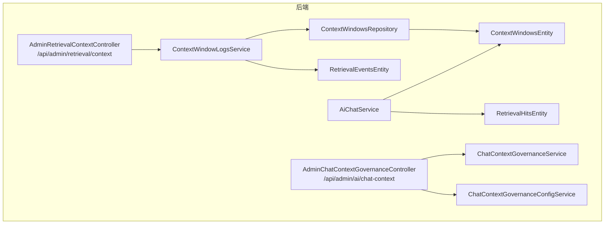
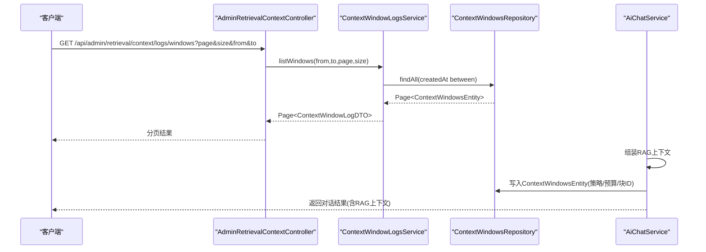
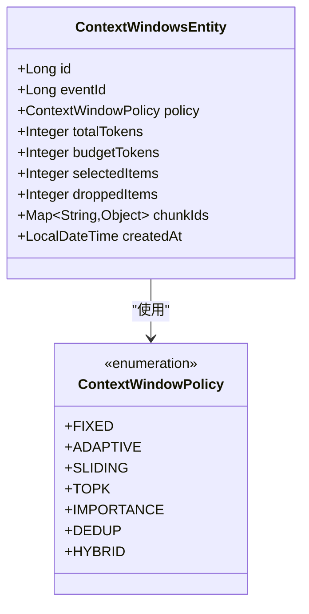
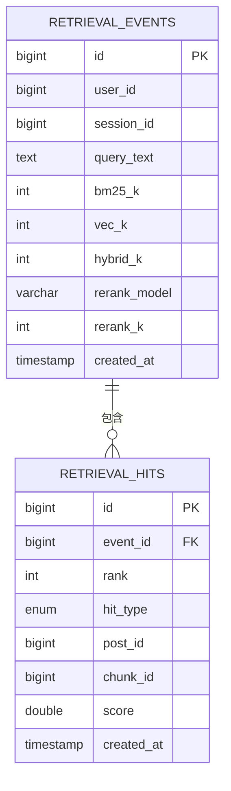
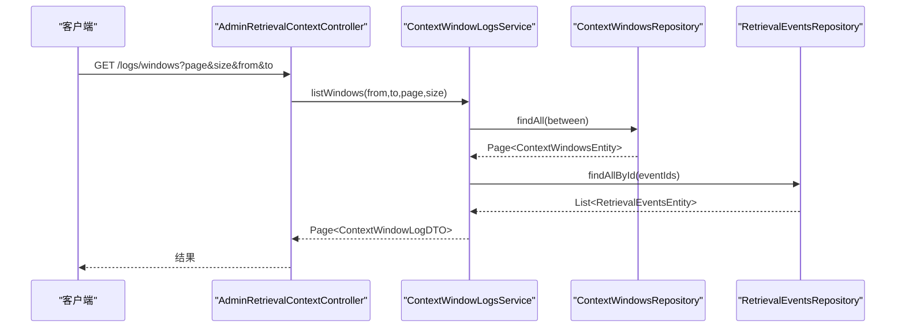
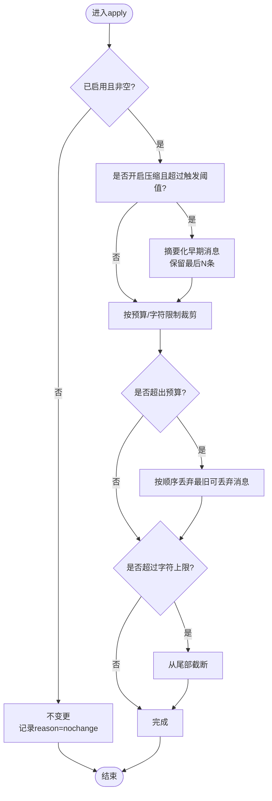
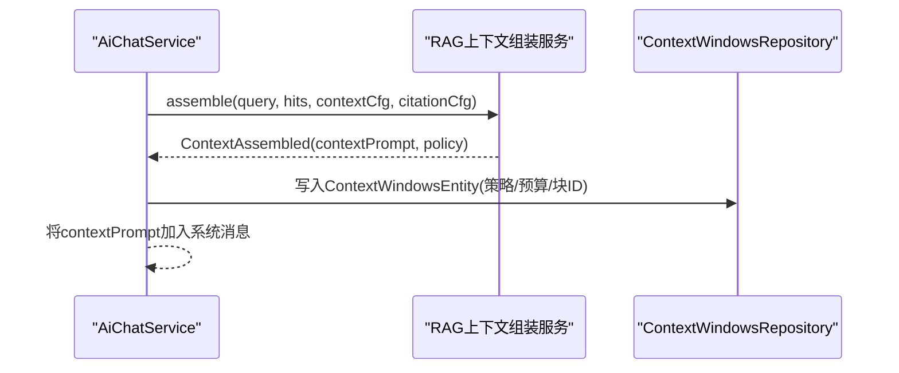
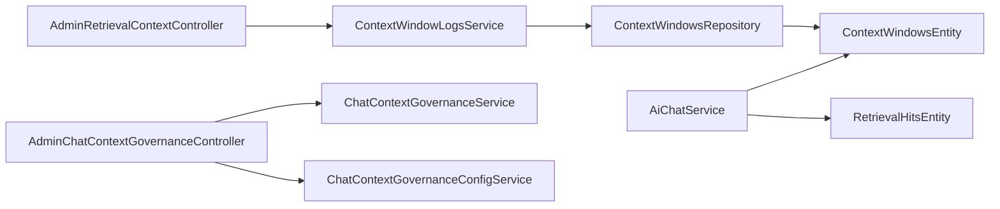

# 上下文管理

<cite>
**本文引用的文件**   
- [ContextWindowsEntity.java](file://src/main/java/com/example/EnterpriseRagCommunity/entity/semantic/ContextWindowsEntity.java)
- [ContextWindowPolicy.java](file://src/main/java/com/example/EnterpriseRagCommunity/entity/semantic/enums/ContextWindowPolicy.java)
- [RetrievalEventsEntity.java](file://src/main/java/com/example/EnterpriseRagCommunity/entity/semantic/RetrievalEventsEntity.java)
- [RetrievalHitsEntity.java](file://src/main/java/com/example/EnterpriseRagCommunity/entity/semantic/RetrievalHitsEntity.java)
- [RetrievalHitType.java](file://src/main/java/com/example/EnterpriseRagCommunity/entity/semantic/enums/RetrievalHitType.java)
- [ContextWindowsRepository.java](file://src/main/java/com/example/EnterpriseRagCommunity/repository/semantic/ContextWindowsRepository.java)
- [ContextWindowLogsService.java](file://src/main/java/com/example/EnterpriseRagCommunity/service/retrieval/admin/ContextWindowLogsService.java)
- [AdminRetrievalContextController.java](file://src/main/java/com/example/EnterpriseRagCommunity/controller/retrieval/admin/AdminRetrievalContextController.java)
- [ChatContextGovernanceService.java](file://src/main/java/com/example/EnterpriseRagCommunity/service/ai/ChatContextGovernanceService.java)
- [ChatContextGovernanceConfigService.java](file://src/main/java/com/example/EnterpriseRagCommunity/service/ai/ChatContextGovernanceConfigService.java)
- [AdminChatContextGovernanceController.java](file://src/main/java/com/example/EnterpriseRagCommunity/controller/ai/admin/AdminChatContextGovernanceController.java)
- [AiChatService.java](file://src/main/java/com/example/EnterpriseRagCommunity/service/ai/AiChatService.java)
- [ContextWindowDetailDTO.java](file://src/main/java/com/example/EnterpriseRagCommunity/dto/retrieval/ContextWindowDetailDTO.java)
- [ContextWindowLogDTO.java](file://src/main/java/com/example/EnterpriseRagCommunity/dto/retrieval/ContextWindowLogDTO.java)
- [RetrievalHitLogDTO.java](file://src/main/java/com/example/EnterpriseRagCommunity/dto/retrieval/RetrievalHitLogDTO.java)
- [ContextStrategy.java](file://src/main/java/com/example/EnterpriseRagCommunity/entity/rag/enums/ContextStrategy.java)
</cite>

## 目录
1. [引言](#引言)
2. [项目结构](#项目结构)
3. [核心组件](#核心组件)
4. [架构总览](#架构总览)
5. [详细组件分析](#详细组件分析)
6. [依赖分析](#依赖分析)
7. [性能考虑](#性能考虑)
8. [故障排除指南](#故障排除指南)
9. [结论](#结论)
10. [附录](#附录)

## 引言
本技术文档围绕“上下文管理”主题，系统阐述上下文窗口的概念、实体设计、窗口大小与内容截断策略、检索事件与命中数据模型，以及上下文在RAG检索过程中的作用。文档还提供了上下文管理API接口规范（窗口创建、内容添加、查询、清理等）、内存与持久化策略、性能优化建议，并总结最佳实践与故障排除方法。目标是帮助开发者与运维人员快速理解并正确使用上下文管理能力。

## 项目结构
上下文管理涉及后端实体与仓库、服务层、控制器，以及前端服务调用。核心模块包括：
- 语义层实体与仓库：上下文窗口、检索事件、检索命中
- 管理服务：上下文窗口日志服务、聊天上下文治理服务及配置
- 控制器：管理员上下文窗口日志与聊天上下文治理的REST接口
- 聊天服务：在RAG流程中组装上下文窗口并写入日志

图表来源
- [AdminRetrievalContextController.java:30-85](file://src/main/java/com/example/EnterpriseRagCommunity/controller/retrieval/admin/AdminRetrievalContextController.java#L30-L85)
- [ContextWindowLogsService.java:23-116](file://src/main/java/com/example/EnterpriseRagCommunity/service/retrieval/admin/ContextWindowLogsService.java#L23-L116)
- [ContextWindowsRepository.java:14-32](file://src/main/java/com/example/EnterpriseRagCommunity/repository/semantic/ContextWindowsRepository.java#L14-L32)
- [ContextWindowsEntity.java:12-47](file://src/main/java/com/example/EnterpriseRagCommunity/entity/semantic/ContextWindowsEntity.java#L12-L47)
- [RetrievalEventsEntity.java:9-46](file://src/main/java/com/example/EnterpriseRagCommunity/entity/semantic/RetrievalEventsEntity.java#L9-L46)
- [RetrievalHitsEntity.java:10-45](file://src/main/java/com/example/EnterpriseRagCommunity/entity/semantic/RetrievalHitsEntity.java#L10-L45)
- [AdminChatContextGovernanceController.java:26-99](file://src/main/java/com/example/EnterpriseRagCommunity/controller/ai/admin/AdminChatContextGovernanceController.java#L26-L99)
- [ChatContextGovernanceService.java:20-121](file://src/main/java/com/example/EnterpriseRagCommunity/service/ai/ChatContextGovernanceService.java#L20-L121)
- [ChatContextGovernanceConfigService.java:10-119](file://src/main/java/com/example/EnterpriseRagCommunity/service/ai/ChatContextGovernanceConfigService.java#L10-L119)
- [AiChatService.java:335-350](file://src/main/java/com/example/EnterpriseRagCommunity/service/ai/AiChatService.java#L335-L350)

章节来源
- [AdminRetrievalContextController.java:30-85](file://src/main/java/com/example/EnterpriseRagCommunity/controller/retrieval/admin/AdminRetrievalContextController.java#L30-L85)
- [ContextWindowLogsService.java:23-116](file://src/main/java/com/example/EnterpriseRagCommunity/service/retrieval/admin/ContextWindowLogsService.java#L23-L116)
- [ContextWindowsRepository.java:14-32](file://src/main/java/com/example/EnterpriseRagCommunity/repository/semantic/ContextWindowsRepository.java#L14-L32)
- [ContextWindowsEntity.java:12-47](file://src/main/java/com/example/EnterpriseRagCommunity/entity/semantic/ContextWindowsEntity.java#L12-L47)
- [RetrievalEventsEntity.java:9-46](file://src/main/java/com/example/EnterpriseRagCommunity/entity/semantic/RetrievalEventsEntity.java#L9-L46)
- [RetrievalHitsEntity.java:10-45](file://src/main/java/com/example/EnterpriseRagCommunity/entity/semantic/RetrievalHitsEntity.java#L10-L45)
- [AdminChatContextGovernanceController.java:26-99](file://src/main/java/com/example/EnterpriseRagCommunity/controller/ai/admin/AdminChatContextGovernanceController.java#L26-L99)
- [ChatContextGovernanceService.java:20-121](file://src/main/java/com/example/EnterpriseRagCommunity/service/ai/ChatContextGovernanceService.java#L20-L121)
- [ChatContextGovernanceConfigService.java:10-119](file://src/main/java/com/example/EnterpriseRagCommunity/service/ai/ChatContextGovernanceConfigService.java#L10-L119)
- [AiChatService.java:335-350](file://src/main/java/com/example/EnterpriseRagCommunity/service/ai/AiChatService.java#L335-L350)

## 核心组件
- 上下文窗口实体与策略
  - 实体：记录一次检索事件对应的上下文窗口，包含策略、预算与总token数、选中/丢弃条目数、块ID集合、创建时间等。
  - 策略枚举：固定预算、自适应、滑动窗口、TopK、重要性、去重、混合等。
- 检索事件与命中
  - 事件实体：记录检索请求的用户、会话、查询文本、各检索参数与时间。
  - 命中实体：记录每次检索的命中项（类型、排序、文档/块ID、分数）。
- 日志服务与仓库
  - 通过仓库按事件、策略、时间范围、JSON包含块ID进行查询。
  - 服务负责分页、关联查询事件文本、统计条目数量。
- 聊天上下文治理
  - 在对话生成前对消息进行压缩与截断，确保不超过预算；支持保留最后N条、按字符/令牌上限截断、丢弃旧消息等。
  - 支持配置开关、采样率、日志记录与审计。

章节来源
- [ContextWindowsEntity.java:12-47](file://src/main/java/com/example/EnterpriseRagCommunity/entity/semantic/ContextWindowsEntity.java#L12-L47)
- [ContextWindowPolicy.java:3-11](file://src/main/java/com/example/EnterpriseRagCommunity/entity/semantic/enums/ContextWindowPolicy.java#L3-L11)
- [RetrievalEventsEntity.java:9-46](file://src/main/java/com/example/EnterpriseRagCommunity/entity/semantic/RetrievalEventsEntity.java#L9-L46)
- [RetrievalHitsEntity.java:10-45](file://src/main/java/com/example/EnterpriseRagCommunity/entity/semantic/RetrievalHitsEntity.java#L10-L45)
- [ContextWindowsRepository.java:14-32](file://src/main/java/com/example/EnterpriseRagCommunity/repository/semantic/ContextWindowsRepository.java#L14-L32)
- [ContextWindowLogsService.java:23-116](file://src/main/java/com/example/EnterpriseRagCommunity/service/retrieval/admin/ContextWindowLogsService.java#L23-L116)
- [ChatContextGovernanceService.java:20-121](file://src/main/java/com/example/EnterpriseRagCommunity/service/ai/ChatContextGovernanceService.java#L20-L121)
- [ChatContextGovernanceConfigService.java:10-119](file://src/main/java/com/example/EnterpriseRagCommunity/service/ai/ChatContextGovernanceConfigService.java#L10-L119)

## 架构总览
上下文管理贯穿检索与对话两个阶段：
- 检索阶段：RAG检索完成后，根据策略与预算组装上下文窗口，写入上下文窗口日志。
- 对话阶段：聊天服务在生成前应用上下文治理策略，确保消息长度与预算匹配。

图表来源
- [AdminRetrievalContextController.java:58-85](file://src/main/java/com/example/EnterpriseRagCommunity/controller/retrieval/admin/AdminRetrievalContextController.java#L58-L85)
- [ContextWindowLogsService.java:30-60](file://src/main/java/com/example/EnterpriseRagCommunity/service/retrieval/admin/ContextWindowLogsService.java#L30-L60)
- [ContextWindowsRepository.java:14-32](file://src/main/java/com/example/EnterpriseRagCommunity/repository/semantic/ContextWindowsRepository.java#L14-L32)
- [AiChatService.java:335-350](file://src/main/java/com/example/EnterpriseRagCommunity/service/ai/AiChatService.java#L335-L350)

## 详细组件分析

### 上下文窗口实体与策略
- 实体字段
  - 事件ID、策略、预算token、总token、选中/丢弃条目、块ID集合(JSON)、创建时间。
- 策略类型
  - 固定预算、自适应、滑动窗口、TopK、重要性、去重、混合等，用于指导选择与截断。
- 查询能力
  - 支持按事件、策略、时间范围查询；支持JSON包含块ID的原生查询。

图表来源
- [ContextWindowsEntity.java:12-47](file://src/main/java/com/example/EnterpriseRagCommunity/entity/semantic/ContextWindowsEntity.java#L12-L47)
- [ContextWindowPolicy.java:3-11](file://src/main/java/com/example/EnterpriseRagCommunity/entity/semantic/enums/ContextWindowPolicy.java#L3-L11)

章节来源
- [ContextWindowsEntity.java:12-47](file://src/main/java/com/example/EnterpriseRagCommunity/entity/semantic/ContextWindowsEntity.java#L12-L47)
- [ContextWindowPolicy.java:3-11](file://src/main/java/com/example/EnterpriseRagCommunity/entity/semantic/enums/ContextWindowPolicy.java#L3-L11)
- [ContextWindowsRepository.java:14-32](file://src/main/java/com/example/EnterpriseRagCommunity/repository/semantic/ContextWindowsRepository.java#L14-L32)

### 检索事件与命中数据模型
- 检索事件
  - 记录用户、会话、查询文本、BM25/向量检索K、混合K、重排模型与重排K、创建时间。
- 检索命中
  - 记录命中项的事件ID、排序、命中类型(BM25/向量/重排/评论向量/聚合/帖子)、文档/块ID、分数、创建时间。
- DTO映射
  - 日志服务将事件与命中映射为可返回的DTO，便于前端展示与审计。

图表来源
- [RetrievalEventsEntity.java:9-46](file://src/main/java/com/example/EnterpriseRagCommunity/entity/semantic/RetrievalEventsEntity.java#L9-L46)
- [RetrievalHitsEntity.java:10-45](file://src/main/java/com/example/EnterpriseRagCommunity/entity/semantic/RetrievalHitsEntity.java#L10-L45)
- [RetrievalHitType.java:3-10](file://src/main/java/com/example/EnterpriseRagCommunity/entity/semantic/enums/RetrievalHitType.java#L3-L10)
- [ContextWindowLogsService.java:73-97](file://src/main/java/com/example/EnterpriseRagCommunity/service/retrieval/admin/ContextWindowLogsService.java#L73-L97)

章节来源
- [RetrievalEventsEntity.java:9-46](file://src/main/java/com/example/EnterpriseRagCommunity/entity/semantic/RetrievalEventsEntity.java#L9-L46)
- [RetrievalHitsEntity.java:10-45](file://src/main/java/com/example/EnterpriseRagCommunity/entity/semantic/RetrievalHitsEntity.java#L10-L45)
- [RetrievalHitType.java:3-10](file://src/main/java/com/example/EnterpriseRagCommunity/entity/semantic/enums/RetrievalHitType.java#L3-L10)
- [ContextWindowLogsService.java:73-97](file://src/main/java/com/example/EnterpriseRagCommunity/service/retrieval/admin/ContextWindowLogsService.java#L73-L97)

### 上下文窗口日志服务与控制器
- 日志服务
  - 分页查询上下文窗口，按创建时间倒序；关联检索事件以补充查询文本；统计块ID集合中的条目数量。
- 控制器
  - 提供列表与详情接口，支持时间范围过滤与分页参数。

图表来源
- [AdminRetrievalContextController.java:58-85](file://src/main/java/com/example/EnterpriseRagCommunity/controller/retrieval/admin/AdminRetrievalContextController.java#L58-L85)
- [ContextWindowLogsService.java:30-97](file://src/main/java/com/example/EnterpriseRagCommunity/service/retrieval/admin/ContextWindowLogsService.java#L30-L97)
- [ContextWindowsRepository.java:14-32](file://src/main/java/com/example/EnterpriseRagCommunity/repository/semantic/ContextWindowsRepository.java#L14-L32)

章节来源
- [AdminRetrievalContextController.java:30-85](file://src/main/java/com/example/EnterpriseRagCommunity/controller/retrieval/admin/AdminRetrievalContextController.java#L30-L85)
- [ContextWindowLogsService.java:23-116](file://src/main/java/com/example/EnterpriseRagCommunity/service/retrieval/admin/ContextWindowLogsService.java#L23-L116)
- [ContextWindowsRepository.java:14-32](file://src/main/java/com/example/EnterpriseRagCommunity/repository/semantic/ContextWindowsRepository.java#L14-L32)

### 聊天上下文治理（对话阶段）
- 功能要点
  - 压缩历史：将早期消息摘要化，保留最后若干条消息。
  - 截断预算：按最大提示token与预留回答token计算可用预算，丢弃或截断旧消息。
  - 字符限制：超过最大字符时从尾部截断。
  - 可配置：开关、触发阈值、保留条数、采样率、日志天数等。
- 执行流程

图表来源
- [ChatContextGovernanceService.java:40-304](file://src/main/java/com/example/EnterpriseRagCommunity/service/ai/ChatContextGovernanceService.java#L40-L304)

章节来源
- [ChatContextGovernanceService.java:20-533](file://src/main/java/com/example/EnterpriseRagCommunity/service/ai/ChatContextGovernanceService.java#L20-L533)
- [ChatContextGovernanceConfigService.java:10-119](file://src/main/java/com/example/EnterpriseRagCommunity/service/ai/ChatContextGovernanceConfigService.java#L10-L119)
- [AdminChatContextGovernanceController.java:26-99](file://src/main/java/com/example/EnterpriseRagCommunity/controller/ai/admin/AdminChatContextGovernanceController.java#L26-L99)

### RAG检索中的上下文作用
- 组装上下文
  - 在RAG流程中，根据检索命中与策略组装系统提示，必要时写入上下文窗口日志。
- 策略枚举
  - 上下文策略枚举用于指导RAG上下文的构建方式（如最近N、摘要、无）。

图表来源
- [AiChatService.java:335-350](file://src/main/java/com/example/EnterpriseRagCommunity/service/ai/AiChatService.java#L335-L350)
- [ContextStrategy.java:3-7](file://src/main/java/com/example/EnterpriseRagCommunity/entity/rag/enums/ContextStrategy.java#L3-L7)

章节来源
- [AiChatService.java:335-350](file://src/main/java/com/example/EnterpriseRagCommunity/service/ai/AiChatService.java#L335-L350)
- [ContextStrategy.java:3-7](file://src/main/java/com/example/EnterpriseRagCommunity/entity/rag/enums/ContextStrategy.java#L3-L7)

## 依赖分析
- 组件耦合
  - 控制器依赖服务；服务依赖仓库与实体；聊天服务依赖上下文窗口实体与检索命中实体。
- 关键依赖链
  - AdminRetrievalContextController → ContextWindowLogsService → ContextWindowsRepository
  - AiChatService → ContextWindowsEntity/RetrievalHitsEntity
  - AdminChatContextGovernanceController → ChatContextGovernanceService/ChatContextGovernanceConfigService

图表来源
- [AdminRetrievalContextController.java:30-85](file://src/main/java/com/example/EnterpriseRagCommunity/controller/retrieval/admin/AdminRetrievalContextController.java#L30-L85)
- [ContextWindowLogsService.java:23-116](file://src/main/java/com/example/EnterpriseRagCommunity/service/retrieval/admin/ContextWindowLogsService.java#L23-L116)
- [ContextWindowsRepository.java:14-32](file://src/main/java/com/example/EnterpriseRagCommunity/repository/semantic/ContextWindowsRepository.java#L14-L32)
- [ContextWindowsEntity.java:12-47](file://src/main/java/com/example/EnterpriseRagCommunity/entity/semantic/ContextWindowsEntity.java#L12-L47)
- [AiChatService.java:335-350](file://src/main/java/com/example/EnterpriseRagCommunity/service/ai/AiChatService.java#L335-L350)
- [RetrievalHitsEntity.java:10-45](file://src/main/java/com/example/EnterpriseRagCommunity/entity/semantic/RetrievalHitsEntity.java#L10-L45)
- [AdminChatContextGovernanceController.java:26-99](file://src/main/java/com/example/EnterpriseRagCommunity/controller/ai/admin/AdminChatContextGovernanceController.java#L26-L99)
- [ChatContextGovernanceService.java:20-121](file://src/main/java/com/example/EnterpriseRagCommunity/service/ai/ChatContextGovernanceService.java#L20-L121)
- [ChatContextGovernanceConfigService.java:10-119](file://src/main/java/com/example/EnterpriseRagCommunity/service/ai/ChatContextGovernanceConfigService.java#L10-L119)

章节来源
- [AdminRetrievalContextController.java:30-85](file://src/main/java/com/example/EnterpriseRagCommunity/controller/retrieval/admin/AdminRetrievalContextController.java#L30-L85)
- [ContextWindowLogsService.java:23-116](file://src/main/java/com/example/EnterpriseRagCommunity/service/retrieval/admin/ContextWindowLogsService.java#L23-L116)
- [ContextWindowsRepository.java:14-32](file://src/main/java/com/example/EnterpriseRagCommunity/repository/semantic/ContextWindowsRepository.java#L14-L32)
- [ContextWindowsEntity.java:12-47](file://src/main/java/com/example/EnterpriseRagCommunity/entity/semantic/ContextWindowsEntity.java#L12-L47)
- [AiChatService.java:335-350](file://src/main/java/com/example/EnterpriseRagCommunity/service/ai/AiChatService.java#L335-L350)
- [RetrievalHitsEntity.java:10-45](file://src/main/java/com/example/EnterpriseRagCommunity/entity/semantic/RetrievalHitsEntity.java#L10-L45)
- [AdminChatContextGovernanceController.java:26-99](file://src/main/java/com/example/EnterpriseRagCommunity/controller/ai/admin/AdminChatContextGovernanceController.java#L26-L99)
- [ChatContextGovernanceService.java:20-121](file://src/main/java/com/example/EnterpriseRagCommunity/service/ai/ChatContextGovernanceService.java#L20-L121)
- [ChatContextGovernanceConfigService.java:10-119](file://src/main/java/com/example/EnterpriseRagCommunity/service/ai/ChatContextGovernanceConfigService.java#L10-L119)

## 性能考虑
- 上下文窗口查询
  - 使用原生SQL的JSON_CONTAINS查询块ID，避免复杂JOIN；按时间范围与策略过滤，减少扫描。
- 日志分页
  - 默认每页20条，最大200条，按创建时间倒序，降低前端压力。
- 聊天上下文治理
  - 采用近似令牌估算与线性扫描丢弃，复杂度与消息数量线性相关；可通过保留最后N条与压缩早期消息降低开销。
- 存储与索引
  - 建议在事件ID、策略、创建时间上建立索引，提升日志查询性能。

[本节为通用性能建议，无需特定文件引用]

## 故障排除指南
- 上下文窗口日志为空
  - 检查时间范围参数是否合理；确认事件ID是否存在；核对策略过滤条件。
- 写入上下文窗口失败
  - 检查RAG流程是否正确组装上下文；确认策略与预算配置；查看采样率设置。
- 聊天上下文治理未生效
  - 确认治理配置已启用；检查最大提示token与预留回答token是否合理；核对允许丢弃RAG上下文的选项。
- JSON查询异常
  - 确认块ID格式与JSON路径表达式一致；避免非法JSON内容导致查询失败。

章节来源
- [ContextWindowLogsService.java:30-97](file://src/main/java/com/example/EnterpriseRagCommunity/service/retrieval/admin/ContextWindowLogsService.java#L30-L97)
- [ChatContextGovernanceService.java:40-121](file://src/main/java/com/example/EnterpriseRagCommunity/service/ai/ChatContextGovernanceService.java#L40-L121)
- [ChatContextGovernanceConfigService.java:35-73](file://src/main/java/com/example/EnterpriseRagCommunity/service/ai/ChatContextGovernanceConfigService.java#L35-L73)
- [ContextWindowsRepository.java:25-31](file://src/main/java/com/example/EnterpriseRagCommunity/repository/semantic/ContextWindowsRepository.java#L25-L31)

## 结论
上下文管理通过“上下文窗口实体+策略+日志服务+治理服务”的组合，在RAG检索与对话阶段实现了可控的上下文长度与质量。其核心价值在于：
- 明确的实体与策略定义，便于扩展与审计
- 精准的日志记录与查询能力，支撑运营与排障
- 可配置的上下文治理，保障对话稳定性与成本控制
建议在生产环境中结合业务场景调整策略与预算，并持续监控日志与性能指标。

[本节为总结性内容，无需特定文件引用]

## 附录

### 上下文管理API接口规范
- 上下文窗口日志
  - 列表：GET /api/admin/retrieval/context/logs/windows?page=&size=&from=&to=
  - 详情：GET /api/admin/retrieval/context/logs/windows/{id}
  - 返回：分页DTO（包含策略、预算、总token、选中/丢弃条目、块ID统计、查询文本、时间）
- 聊天上下文治理配置
  - 获取：GET /api/admin/ai/chat-context/config
  - 更新：PUT /api/admin/ai/chat-context/config（携带配置负载）
  - 日志列表：GET /api/admin/ai/chat-context/logs?page=&size=&from=&to=
  - 日志详情：GET /api/admin/ai/chat-context/logs/{id}

章节来源
- [AdminRetrievalContextController.java:30-85](file://src/main/java/com/example/EnterpriseRagCommunity/controller/retrieval/admin/AdminRetrievalContextController.java#L30-L85)
- [ContextWindowDetailDTO.java:9-21](file://src/main/java/com/example/EnterpriseRagCommunity/dto/retrieval/ContextWindowDetailDTO.java#L9-L21)
- [ContextWindowLogDTO.java:1-15](file://src/main/java/com/example/EnterpriseRagCommunity/dto/retrieval/ContextWindowLogDTO.java#L1-L15)
- [RetrievalHitLogDTO.java:1-15](file://src/main/java/com/example/EnterpriseRagCommunity/dto/retrieval/RetrievalHitLogDTO.java#L1-L15)
- [AdminChatContextGovernanceController.java:26-99](file://src/main/java/com/example/EnterpriseRagCommunity/controller/ai/admin/AdminChatContextGovernanceController.java#L26-L99)