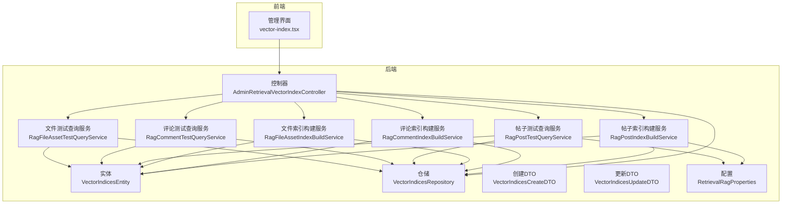
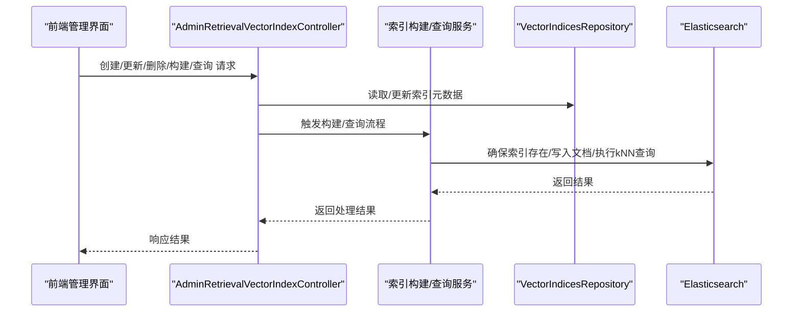
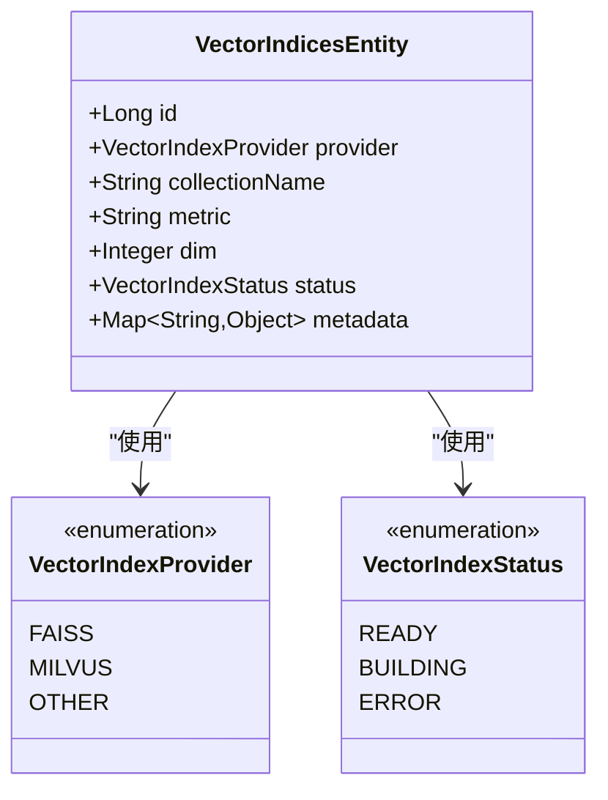
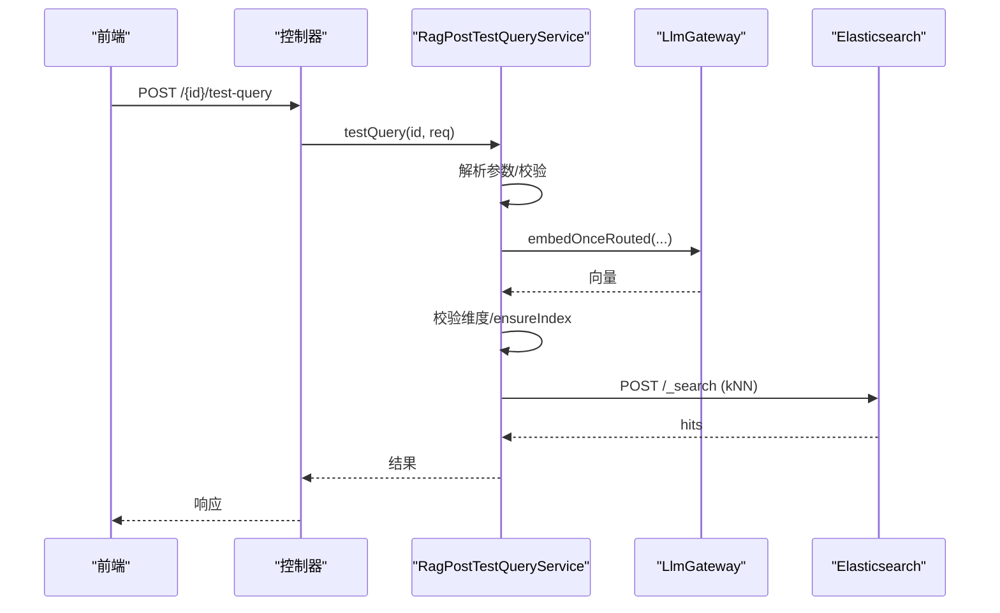
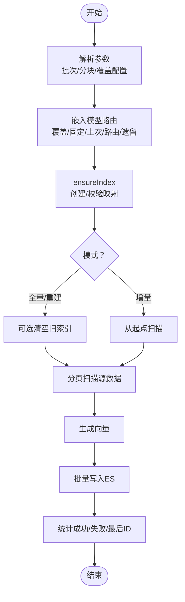
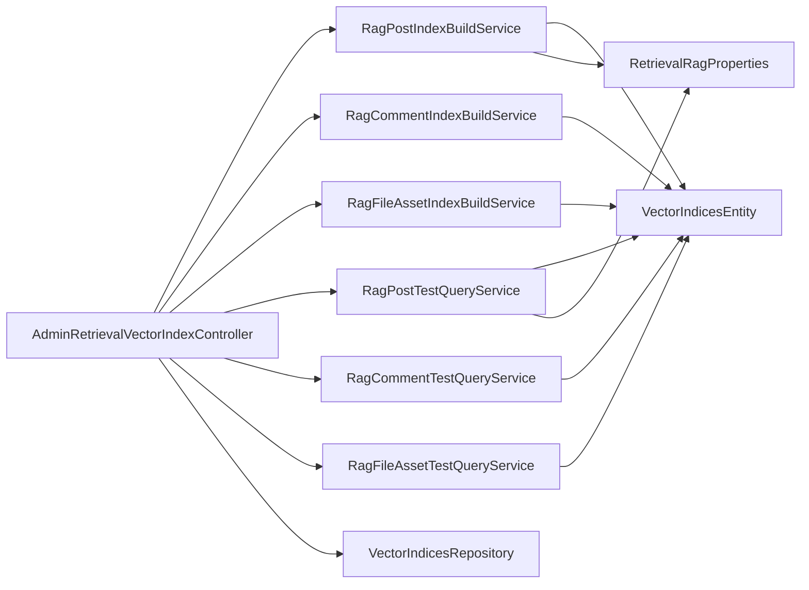

# 向量索引

<cite>
**本文引用的文件**
- [AdminRetrievalVectorIndexController.java](file://src/main/java/com/example/EnterpriseRagCommunity/controller/retrieval/admin/AdminRetrievalVectorIndexController.java)
- [VectorIndicesEntity.java](file://src/main/java/com/example/EnterpriseRagCommunity/entity/semantic/VectorIndicesEntity.java)
- [VectorIndexProvider.java](file://src/main/java/com/example/EnterpriseRagCommunity/entity/semantic/enums/VectorIndexProvider.java)
- [VectorIndexStatus.java](file://src/main/java/com/example/EnterpriseRagCommunity/entity/semantic/enums/VectorIndexStatus.java)
- [VectorIndicesRepository.java](file://src/main/java/com/example/EnterpriseRagCommunity/repository/semantic/VectorIndicesRepository.java)
- [VectorIndicesCreateDTO.java](file://src/main/java/com/example/EnterpriseRagCommunity/dto/semantic/VectorIndicesCreateDTO.java)
- [VectorIndicesUpdateDTO.java](file://src/main/java/com/example/EnterpriseRagCommunity/dto/semantic/VectorIndicesUpdateDTO.java)
- [RagPostIndexBuildService.java](file://src/main/java/com/example/EnterpriseRagCommunity/service/retrieval/RagPostIndexBuildService.java)
- [RagCommentIndexBuildService.java](file://src/main/java/com/example/EnterpriseRagCommunity/service/retrieval/RagCommentIndexBuildService.java)
- [RagFileAssetIndexBuildService.java](file://src/main/java/com/example/EnterpriseRagCommunity/service/retrieval/RagFileAssetIndexBuildService.java)
- [RagPostTestQueryService.java](file://src/main/java/com/example/EnterpriseRagCommunity/service/retrieval/RagPostTestQueryService.java)
- [RagCommentTestQueryService.java](file://src/main/java/com/example/EnterpriseRagCommunity/service/retrieval/RagCommentTestQueryService.java)
- [RagFileAssetTestQueryService.java](file://src/main/java/com/example/EnterpriseRagCommunity/service/retrieval/RagFileAssetTestQueryService.java)
- [RetrievalRagProperties.java](file://src/main/java/com/example/EnterpriseRagCommunity/config/RetrievalRagProperties.java)
- [vector-index.tsx](file://my-vite-app/src/pages/admin/forms/retrieval/vector-index.tsx)
</cite>

## 目录
1. [简介](#简介)
2. [项目结构](#项目结构)
3. [核心组件](#核心组件)
4. [架构总览](#架构总览)
5. [详细组件分析](#详细组件分析)
6. [依赖关系分析](#依赖关系分析)
7. [性能考量](#性能考量)
8. [故障排查指南](#故障排查指南)
9. [结论](#结论)
10. [附录](#附录)

## 简介
本文件面向企业级RAG社区项目的“向量索引”子系统，提供从数据模型、索引策略、创建/更新/查询到存储与性能优化的完整技术文档。系统以 Elasticsearch 作为向量检索后端，支持基于帖子、评论、文件资产三类源的向量索引构建与测试查询，并通过统一的管理API进行索引生命周期管理。

## 项目结构
向量索引相关代码主要分布在以下层次：
- 控制器层：提供管理与测试查询的REST接口
- 实体与枚举：描述索引实体、提供方与状态
- DTO：创建/更新请求载荷
- 仓储层：持久化索引元数据
- 服务层：负责索引构建、增量同步、测试查询
- 配置：检索RAG相关ES参数
- 前端：管理界面与测试查询UI

图表来源
- [AdminRetrievalVectorIndexController.java:1-555](file://src/main/java/com/example/EnterpriseRagCommunity/controller/retrieval/admin/AdminRetrievalVectorIndexController.java#L1-L555)
- [VectorIndicesEntity.java:1-42](file://src/main/java/com/example/EnterpriseRagCommunity/entity/semantic/VectorIndicesEntity.java#L1-L42)
- [VectorIndicesRepository.java:1-19](file://src/main/java/com/example/EnterpriseRagCommunity/repository/semantic/VectorIndicesRepository.java#L1-L19)
- [VectorIndicesCreateDTO.java:1-42](file://src/main/java/com/example/EnterpriseRagCommunity/dto/semantic/VectorIndicesCreateDTO.java#L1-L42)
- [VectorIndicesUpdateDTO.java:1-38](file://src/main/java/com/example/EnterpriseRagCommunity/dto/semantic/VectorIndicesUpdateDTO.java#L1-L38)
- [RagPostIndexBuildService.java:1-200](file://src/main/java/com/example/EnterpriseRagCommunity/service/retrieval/RagPostIndexBuildService.java#L1-L200)
- [RagPostTestQueryService.java:1-200](file://src/main/java/com/example/EnterpriseRagCommunity/service/retrieval/RagPostTestQueryService.java#L1-L200)
- [RetrievalRagProperties.java:1-22](file://src/main/java/com/example/EnterpriseRagCommunity/config/RetrievalRagProperties.java#L1-L22)
- [vector-index.tsx:1-800](file://my-vite-app/src/pages/admin/forms/retrieval/vector-index.tsx#L1-L800)

章节来源
- [AdminRetrievalVectorIndexController.java:1-555](file://src/main/java/com/example/EnterpriseRagCommunity/controller/retrieval/admin/AdminRetrievalVectorIndexController.java#L1-L555)
- [vector-index.tsx:1-800](file://my-vite-app/src/pages/admin/forms/retrieval/vector-index.tsx#L1-L800)

## 核心组件
- 数据模型
  - 索引实体：包含提供方、集合名、度量方式、维度、状态、元数据等字段
  - 枚举：提供方取值（FAISS/MILVUS/OTHER），状态取值（READY/BUILDING/ERROR）
- 管理API
  - 列表、创建、更新、删除索引
  - 针对三类源的构建/重建/增量同步
  - 测试查询（帖子/评论/文件）
- 查询与构建服务
  - 统一的kNN检索构建与执行逻辑
  - 嵌入模型路由与维度校验
- 配置
  - ES索引名称、是否启用中文分词、默认嵌入模型与维度

章节来源
- [VectorIndicesEntity.java:1-42](file://src/main/java/com/example/EnterpriseRagCommunity/entity/semantic/VectorIndicesEntity.java#L1-L42)
- [VectorIndexProvider.java:1-8](file://src/main/java/com/example/EnterpriseRagCommunity/entity/semantic/enums/VectorIndexProvider.java#L1-L8)
- [VectorIndexStatus.java:1-9](file://src/main/java/com/example/EnterpriseRagCommunity/entity/semantic/enums/VectorIndexStatus.java#L1-L9)
- [VectorIndicesRepository.java:1-19](file://src/main/java/com/example/EnterpriseRagCommunity/repository/semantic/VectorIndicesRepository.java#L1-L19)
- [VectorIndicesCreateDTO.java:1-42](file://src/main/java/com/example/EnterpriseRagCommunity/dto/semantic/VectorIndicesCreateDTO.java#L1-L42)
- [VectorIndicesUpdateDTO.java:1-38](file://src/main/java/com/example/EnterpriseRagCommunity/dto/semantic/VectorIndicesUpdateDTO.java#L1-L38)
- [RagPostIndexBuildService.java:1-200](file://src/main/java/com/example/EnterpriseRagCommunity/service/retrieval/RagPostIndexBuildService.java#L1-L200)
- [RagPostTestQueryService.java:1-200](file://src/main/java/com/example/EnterpriseRagCommunity/service/retrieval/RagPostTestQueryService.java#L1-L200)
- [RetrievalRagProperties.java:1-22](file://src/main/java/com/example/EnterpriseRagCommunity/config/RetrievalRagProperties.java#L1-L22)

## 架构总览
系统采用“控制器-服务-仓储-实体”的分层架构，前端通过管理界面触发后端API，后端服务负责：
- 解析索引配置与元数据
- 路由嵌入模型与维度校验
- 构建ES索引映射与kNN字段
- 执行批量构建/增量同步/测试查询

图表来源
- [AdminRetrievalVectorIndexController.java:55-555](file://src/main/java/com/example/EnterpriseRagCommunity/controller/retrieval/admin/AdminRetrievalVectorIndexController.java#L55-L555)
- [RagPostIndexBuildService.java:62-200](file://src/main/java/com/example/EnterpriseRagCommunity/service/retrieval/RagPostIndexBuildService.java#L62-L200)
- [RagPostTestQueryService.java:40-200](file://src/main/java/com/example/EnterpriseRagCommunity/service/retrieval/RagPostTestQueryService.java#L40-L200)
- [VectorIndicesRepository.java:1-19](file://src/main/java/com/example/EnterpriseRagCommunity/repository/semantic/VectorIndicesRepository.java#L1-L19)

## 详细组件分析

### 数据模型与索引策略
- 索引实体字段
  - 提供方：FAISS/MILVUS/OTHER（当前管理界面标注OTHER对应Elasticsearch）
  - 集合名：ES索引名称或集合标识
  - 度量：如余弦距离等
  - 维度：0表示自动推断
  - 状态：READY/BUILDING/ERROR
  - 元数据：JSON，用于记录默认分块参数、上次构建使用的嵌入模型/提供商、统计信息等
- 索引策略
  - 通过ensureIndex确保ES索引存在且包含向量字段映射
  - kNN查询使用query_vector与num_candidates控制候选集规模
  - 支持按boardId过滤（帖子场景）

图表来源
- [VectorIndicesEntity.java:1-42](file://src/main/java/com/example/EnterpriseRagCommunity/entity/semantic/VectorIndicesEntity.java#L1-L42)
- [VectorIndexProvider.java:1-8](file://src/main/java/com/example/EnterpriseRagCommunity/entity/semantic/enums/VectorIndexProvider.java#L1-L8)
- [VectorIndexStatus.java:1-9](file://src/main/java/com/example/EnterpriseRagCommunity/entity/semantic/enums/VectorIndexStatus.java#L1-L9)

章节来源
- [VectorIndicesEntity.java:1-42](file://src/main/java/com/example/EnterpriseRagCommunity/entity/semantic/VectorIndicesEntity.java#L1-L42)
- [VectorIndexProvider.java:1-8](file://src/main/java/com/example/EnterpriseRagCommunity/entity/semantic/enums/VectorIndexProvider.java#L1-L8)
- [VectorIndexStatus.java:1-9](file://src/main/java/com/example/EnterpriseRagCommunity/entity/semantic/enums/VectorIndexStatus.java#L1-L9)

### 管理API接口规范
- 列表索引
  - 方法：GET
  - 路径：/api/admin/retrieval/vector-indices
  - 查询参数：page,size
  - 权限：admin_retrieval_index:access
- 创建索引
  - 方法：POST
  - 路径：/api/admin/retrieval/vector-indices
  - 请求体：VectorIndicesCreateDTO
  - 权限：admin_retrieval_index:action
- 更新索引
  - 方法：PUT
  - 路径：/api/admin/retrieval/vector-indices/{id}
  - 路径参数：id
  - 请求体：VectorIndicesUpdateDTO
  - 权限：admin_retrieval_index:action
- 删除索引
  - 方法：DELETE
  - 路径：/api/admin/retrieval/vector-indices/{id}
  - 权限：admin_retrieval_index:action

- 帖子源
  - 全量构建：POST /{id}/build/posts
  - 全量重建：POST /{id}/rebuild/posts
  - 增量同步：POST /{id}/sync/posts
  - 测试查询：POST /{id}/test-query
- 评论源
  - 全量构建：POST /{id}/build/comments
  - 全量重建：POST /{id}/rebuild/comments
  - 增量同步：POST /{id}/sync/comments
  - 测试查询：POST /{id}/test-query/comments
- 文件资产源
  - 全量构建：POST /{id}/build/files
  - 全量重建：POST /{id}/rebuild/files
  - 增量同步：POST /{id}/sync/files
  - 测试查询：POST /{id}/test-query/files

请求参数要点（以帖子测试查询为例）
- queryText：必填
- topK：默认8，范围[1,50]
- numCandidates：默认topK*10，范围[10,10000]
- embeddingModel/embeddingProviderId：可选覆盖
- boardId：可选过滤

响应要点
- hits：命中文档列表，包含docId、分数、上下文预览等
- tookMs：查询耗时
- embeddingModel/embeddingProviderId/embeddingDims：实际使用的嵌入配置与维度

章节来源
- [AdminRetrievalVectorIndexController.java:55-555](file://src/main/java/com/example/EnterpriseRagCommunity/controller/retrieval/admin/AdminRetrievalVectorIndexController.java#L55-L555)
- [VectorIndicesCreateDTO.java:1-42](file://src/main/java/com/example/EnterpriseRagCommunity/dto/semantic/VectorIndicesCreateDTO.java#L1-L42)
- [VectorIndicesUpdateDTO.java:1-38](file://src/main/java/com/example/EnterpriseRagCommunity/dto/semantic/VectorIndicesUpdateDTO.java#L1-L38)

### 创建/更新/查询实现细节

#### 创建与更新
- 创建：接收VectorIndicesCreateDTO，设置provider/collectionName/metric/dim/status/metadata，保存后写入审计日志
- 更新：校验id一致性，逐项更新字段，保存后记录差异并写入审计日志

章节来源
- [AdminRetrievalVectorIndexController.java:66-127](file://src/main/java/com/example/EnterpriseRagCommunity/controller/retrieval/admin/AdminRetrievalVectorIndexController.java#L66-L127)
- [VectorIndicesCreateDTO.java:1-42](file://src/main/java/com/example/EnterpriseRagCommunity/dto/semantic/VectorIndicesCreateDTO.java#L1-L42)
- [VectorIndicesUpdateDTO.java:1-38](file://src/main/java/com/example/EnterpriseRagCommunity/dto/semantic/VectorIndicesUpdateDTO.java#L1-L38)

#### 查询流程（以帖子测试查询为例）
- 参数解析与校验
  - topK与numCandidates范围约束
  - 嵌入模型覆盖优先于固定/上次构建配置，最终回退至路由或遗留配置
- 嵌入生成
  - 调用嵌入网关生成向量
- 索引准备
  - 若索引不存在则ensureIndex创建，必要时根据向量维度推断并写回索引实体
- kNN检索
  - 构造kNN查询体，发送至ES/_search
  - 解析命中并返回

图表来源
- [AdminRetrievalVectorIndexController.java:525-553](file://src/main/java/com/example/EnterpriseRagCommunity/controller/retrieval/admin/AdminRetrievalVectorIndexController.java#L525-L553)
- [RagPostTestQueryService.java:40-200](file://src/main/java/com/example/EnterpriseRagCommunity/service/retrieval/RagPostTestQueryService.java#L40-L200)

章节来源
- [RagPostTestQueryService.java:40-200](file://src/main/java/com/example/EnterpriseRagCommunity/service/retrieval/RagPostTestQueryService.java#L40-L200)

#### 构建与增量同步（以帖子为例）
- 参数处理
  - 分批大小、分块长度、重叠长度、是否清空旧索引
  - 嵌入模型/提供商优先级：覆盖 > 固定 > 上次构建 > 路由 > 遗留
- 状态管理
  - 构建前置为BUILDING，完成后回写READY或保留ERROR
- 写入策略
  - 全量/重建：可选择清空旧索引
  - 增量：从指定起点扫描并追加
- 维度处理
  - 若索引未配置维度，首次构建时推断并写回

图表来源
- [RagPostIndexBuildService.java:62-200](file://src/main/java/com/example/EnterpriseRagCommunity/service/retrieval/RagPostIndexBuildService.java#L62-L200)

章节来源
- [RagPostIndexBuildService.java:62-200](file://src/main/java/com/example/EnterpriseRagCommunity/service/retrieval/RagPostIndexBuildService.java#L62-L200)

### 相似度计算与检索效率优化
- 相似度计算
  - kNN查询使用向量字段与query_vector，结合num_candidates扩大候选集
  - 支持按boardId等字段过滤
- 效率优化
  - num_candidates与topK成比例，合理设置可平衡召回与性能
  - 使用合适的度量（如余弦）与索引映射
  - 前端测试查询限制topK上限，避免过高的资源消耗

章节来源
- [RagPostTestQueryService.java:133-134](file://src/main/java/com/example/EnterpriseRagCommunity/service/retrieval/RagPostTestQueryService.java#L133-L134)
- [RagCommentTestQueryService.java:125-126](file://src/main/java/com/example/EnterpriseRagCommunity/service/retrieval/RagCommentTestQueryService.java#L125-L126)
- [RagFileAssetTestQueryService.java:1-200](file://src/main/java/com/example/EnterpriseRagCommunity/service/retrieval/RagFileAssetTestQueryService.java#L1-L200)

### 存储策略与配置
- ES索引
  - 默认索引名可通过配置类指定
  - 通过ensureIndex创建包含向量字段的映射
- 嵌入配置
  - 支持固定嵌入模型/提供商，或通过路由动态选择
  - 支持显式指定维度，否则自动推断
- 前端配置
  - 管理界面支持设置默认分块长度、重叠长度、自动增量同步间隔等

章节来源
- [RetrievalRagProperties.java:1-22](file://src/main/java/com/example/EnterpriseRagCommunity/config/RetrievalRagProperties.java#L1-L22)
- [vector-index.tsx:109-170](file://my-vite-app/src/pages/admin/forms/retrieval/vector-index.tsx#L109-L170)

## 依赖关系分析
- 控制器依赖多个服务与仓储，统一编排索引生命周期
- 服务层依赖嵌入路由、ES模板、系统配置、索引仓储
- 实体与仓储构成稳定的持久化层
- 前端通过服务封装调用后端API

图表来源
- [AdminRetrievalVectorIndexController.java:45-53](file://src/main/java/com/example/EnterpriseRagCommunity/controller/retrieval/admin/AdminRetrievalVectorIndexController.java#L45-L53)
- [RagPostIndexBuildService.java:53-61](file://src/main/java/com/example/EnterpriseRagCommunity/service/retrieval/RagPostIndexBuildService.java#L53-L61)
- [RagPostTestQueryService.java:32-38](file://src/main/java/com/example/EnterpriseRagCommunity/service/retrieval/RagPostTestQueryService.java#L32-L38)
- [VectorIndicesEntity.java:1-42](file://src/main/java/com/example/EnterpriseRagCommunity/entity/semantic/VectorIndicesEntity.java#L1-L42)
- [VectorIndicesRepository.java:1-19](file://src/main/java/com/example/EnterpriseRagCommunity/repository/semantic/VectorIndicesRepository.java#L1-L19)
- [RetrievalRagProperties.java:1-22](file://src/main/java/com/example/EnterpriseRagCommunity/config/RetrievalRagProperties.java#L1-L22)

章节来源
- [AdminRetrievalVectorIndexController.java:45-53](file://src/main/java/com/example/EnterpriseRagCommunity/controller/retrieval/admin/AdminRetrievalVectorIndexController.java#L45-L53)
- [RagPostIndexBuildService.java:53-61](file://src/main/java/com/example/EnterpriseRagCommunity/service/retrieval/RagPostIndexBuildService.java#L53-L61)
- [RagPostTestQueryService.java:32-38](file://src/main/java/com/example/EnterpriseRagCommunity/service/retrieval/RagPostTestQueryService.java#L32-L38)

## 性能考量
- 维度与映射
  - 确保索引映射与向量维度一致，避免运行时错误
- 候选集规模
  - num_candidates建议为topK的若干倍，兼顾召回与性能
- 分块策略
  - 合理设置分块长度与重叠，提升检索质量同时控制写入成本
- 路由与降级
  - 当固定/上次构建目标不可用时，回退到路由或遗留配置，保证可用性
- 并发与批处理
  - 构建/同步采用分页与批处理，避免单次压力过大

## 故障排查指南
- 常见错误
  - 嵌入维度不匹配：检查索引配置维度与实际嵌入维度
  - ES连接失败：确认spring.elasticsearch.uris与APP_ES_API_KEY配置
  - 无可用嵌入目标：检查嵌入路由配置与提供商/模型状态
- 排查步骤
  - 查看审计日志，定位失败动作与原因
  - 在管理界面执行测试查询，观察命中数与耗时
  - 检查索引状态（READY/BUILDING/ERROR）与元数据中的统计信息

章节来源
- [RagPostTestQueryService.java:116-131](file://src/main/java/com/example/EnterpriseRagCommunity/service/retrieval/RagPostTestQueryService.java#L116-L131)
- [RagPostIndexBuildService.java:73-77](file://src/main/java/com/example/EnterpriseRagCommunity/service/retrieval/RagPostIndexBuildService.java#L73-L77)

## 结论
本向量索引系统以ES为核心，提供统一的索引管理与测试查询能力，支持多源数据的批量构建与增量同步。通过明确的数据模型、严格的维度校验与合理的kNN参数配置，系统在保证检索质量的同时兼顾性能与可维护性。建议在生产环境中配合完善的监控与告警机制，持续优化分块策略与候选集规模。

## 附录
- 前端管理界面功能
  - 列表展示索引状态与统计
  - 编辑默认嵌入配置与分块参数
  - 执行全量重建/增量同步
  - 发起测试查询并查看命中结果

章节来源
- [vector-index.tsx:515-800](file://my-vite-app/src/pages/admin/forms/retrieval/vector-index.tsx#L515-L800)