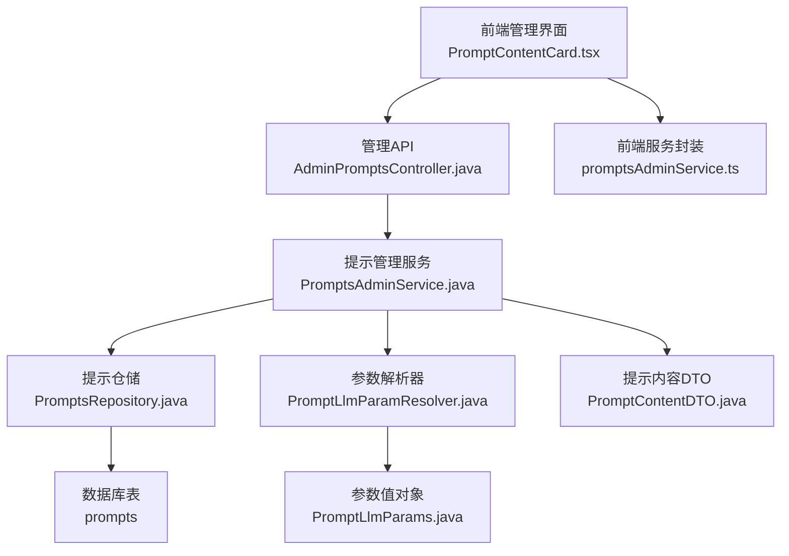
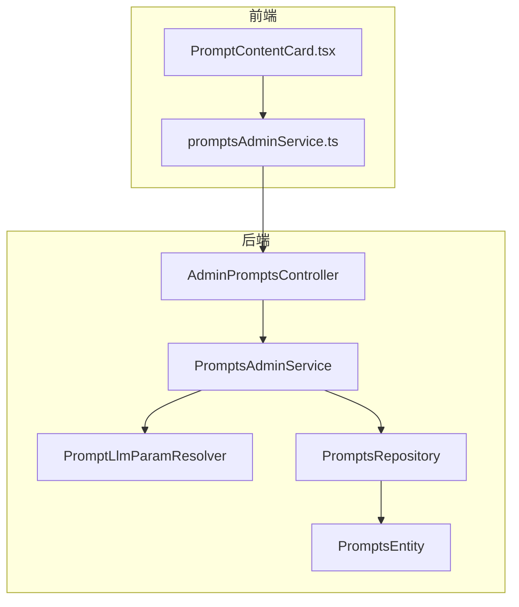
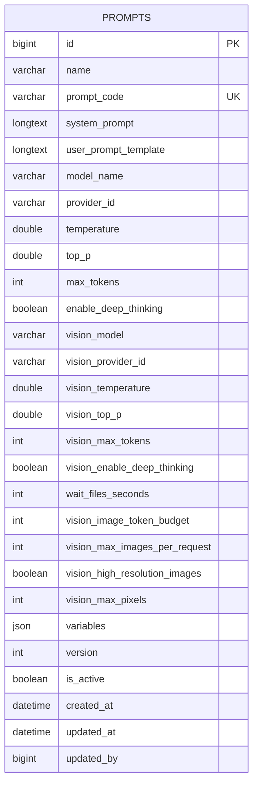
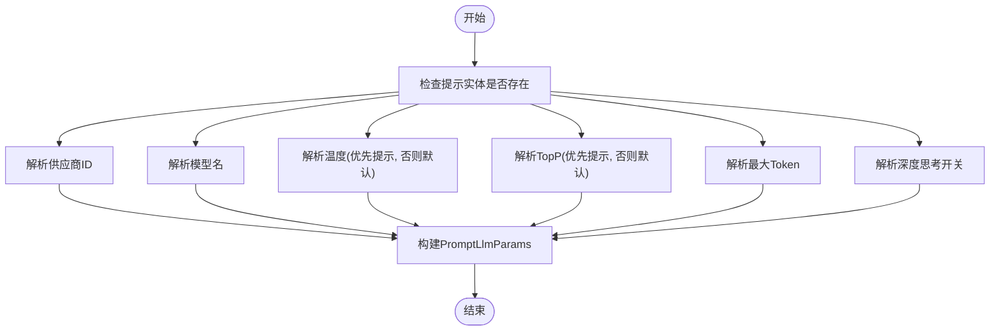
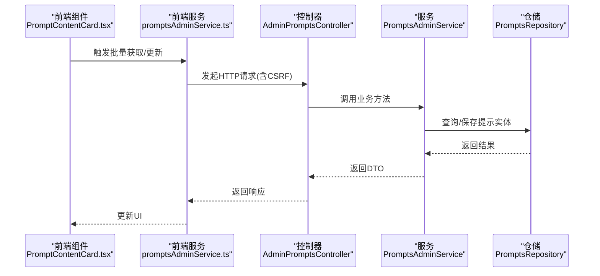
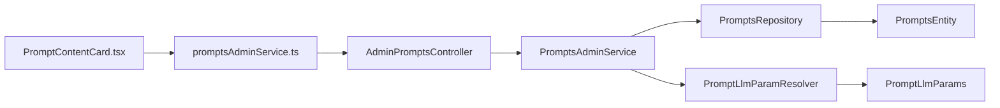

# 提示工程

<cite>
**本文引用的文件**
- [PromptsEntity.java](file://src/main/java/com/example/EnterpriseRagCommunity/entity/semantic/PromptsEntity.java)
- [PromptsAdminService.java](file://src/main/java/com/example/EnterpriseRagCommunity/service/ai/PromptsAdminService.java)
- [AdminPromptsController.java](file://src/main/java/com/example/EnterpriseRagCommunity/controller/ai/admin/AdminPromptsController.java)
- [PromptsRepository.java](file://src/main/java/com/example/EnterpriseRagCommunity/repository/semantic/PromptsRepository.java)
- [PromptContentDTO.java](file://src/main/java/com/example/EnterpriseRagCommunity/dto/ai/PromptContentDTO.java)
- [PromptContentUpdateRequest.java](file://src/main/java/com/example/EnterpriseRagCommunity/dto/ai/PromptContentUpdateRequest.java)
- [PromptLlmParamResolver.java](file://src/main/java/com/example/EnterpriseRagCommunity/service/ai/PromptLlmParamResolver.java)
- [PromptLlmParams.java](file://src/main/java/com/example/EnterpriseRagCommunity/service/ai/PromptLlmParams.java)
- [AiLanguageDetectService.java](file://src/main/java/com/example/EnterpriseRagCommunity/service/ai/AiLanguageDetectService.java)
- [AdminModerationLlmUpstreamSupport.java](file://src/main/java/com/example/EnterpriseRagCommunity/service/moderation/admin/AdminModerationLlmUpstreamSupport.java)
- [permissions.java](file://src/main/java/com/example/EnterpriseRagCommunity/security/Permissions.java)
- [promptsAdminService.ts](file://my-vite-app/src/services/promptsAdminService.ts)
- [PromptContentCard.tsx](file://my-vite-app/src/components/admin/PromptContentCard.tsx)
- [AdminAiAdminControllersBranchIntegrationTest.java](file://src/integrationTest/java/com/example/EnterpriseRagCommunity/controller/ai/admin/AdminAiAdminControllersBranchIntegrationTest.java)
- [AdminPromptsControllerTest.java](file://src/test/java/com/example/EnterpriseRagCommunity/controller/ai/admin/AdminPromptsControllerTest.java)
- [PromptsAdminServiceTest.java](file://src/test/java/com/example/EnterpriseRagCommunity/service/ai/PromptsAdminServiceTest.java)
- [PromptLlmParamResolverTest.java](file://src/test/java/com/example/EnterpriseRagCommunity/service/ai/PromptLlmParamResolverTest.java)
- [TokenCountService.java](file://src/main/java/com/example/EnterpriseRagCommunity/service/ai/TokenCountService.java)
- [ChatContextGovernanceService.java](file://src/main/java/com/example/EnterpriseRagCommunity/service/ai/ChatContextGovernanceService.java)
- [ChatContextGovernanceConfigService.java](file://src/main/java/com/example/EnterpriseRagCommunity/service/ai/ChatContextGovernanceConfigService.java)
</cite>

## 目录
1. [引言](#引言)
2. [项目结构](#项目结构)
3. [核心组件](#核心组件)
4. [架构总览](#架构总览)
5. [详细组件分析](#详细组件分析)
6. [依赖分析](#依赖分析)
7. [性能考虑](#性能考虑)
8. [故障排查指南](#故障排查指南)
9. [结论](#结论)
10. [附录](#附录)

## 引言
本文件面向提示工程系统，围绕提示模板的设计与管理进行系统性技术说明。内容涵盖提示实体结构、参数化模板、动态内容生成、提示在AI对话、内容生成、规则推理中的应用、提示管理API接口规范（创建、更新、删除、查询、批量操作）、版本控制、权限管理与安全策略、提示参数解析、上下文注入、输出格式化等关键技术实现，并提供最佳实践、性能优化与调试技巧。

## 项目结构
提示工程相关能力横跨后端服务层、数据访问层、前端管理界面与测试用例，形成“前端卡片编辑 → 后端控制器 → 业务服务 → 数据持久化”的完整闭环。

图表来源
- [AdminPromptsController.java:1-69](file://src/main/java/com/example/EnterpriseRagCommunity/controller/ai/admin/AdminPromptsController.java#L1-L69)
- [PromptsAdminService.java:1-109](file://src/main/java/com/example/EnterpriseRagCommunity/service/ai/PromptsAdminService.java#L1-L109)
- [PromptsRepository.java:1-26](file://src/main/java/com/example/EnterpriseRagCommunity/repository/semantic/PromptsRepository.java#L1-L26)
- [PromptsEntity.java:10-103](file://src/main/java/com/example/EnterpriseRagCommunity/entity/semantic/PromptsEntity.java#L10-L103)
- [PromptLlmParamResolver.java:1-37](file://src/main/java/com/example/EnterpriseRagCommunity/service/ai/PromptLlmParamResolver.java#L1-L37)
- [PromptLlmParams.java:1-12](file://src/main/java/com/example/EnterpriseRagCommunity/service/ai/PromptLlmParams.java#L1-L12)
- [PromptContentDTO.java:1-17](file://src/main/java/com/example/EnterpriseRagCommunity/dto/ai/PromptContentDTO.java#L1-L17)
- [PromptContentCard.tsx:1-85](file://my-vite-app/src/components/admin/PromptContentCard.tsx#L1-L85)
- [promptsAdminService.ts:1-77](file://my-vite-app/src/services/promptsAdminService.ts#L1-L77)

章节来源
- [AdminPromptsController.java:1-69](file://src/main/java/com/example/EnterpriseRagCommunity/controller/ai/admin/AdminPromptsController.java#L1-L69)
- [PromptsAdminService.java:1-109](file://src/main/java/com/example/EnterpriseRagCommunity/service/ai/PromptsAdminService.java#L1-L109)
- [PromptsRepository.java:1-26](file://src/main/java/com/example/EnterpriseRagCommunity/repository/semantic/PromptsRepository.java#L1-L26)
- [PromptsEntity.java:10-103](file://src/main/java/com/example/EnterpriseRagCommunity/entity/semantic/PromptsEntity.java#L10-L103)
- [PromptContentCard.tsx:1-85](file://my-vite-app/src/components/admin/PromptContentCard.tsx#L1-L85)
- [promptsAdminService.ts:1-77](file://my-vite-app/src/services/promptsAdminService.ts#L1-L77)

## 核心组件
- 提示实体：定义提示模板的元数据、参数与版本控制字段，支持文本与视觉模型参数分离。
- 提示管理服务：提供批量查询、内容更新、版本递增与规范化处理。
- 管理控制器：暴露REST接口，负责鉴权、CSRF保护与异常映射。
- 参数解析器：从提示实体中提取LLM调用参数，优先使用提示内配置，否则回退默认值。
- 前端卡片组件与服务封装：提供可视化编辑、批量获取与更新的交互体验。

章节来源
- [PromptsEntity.java:10-103](file://src/main/java/com/example/EnterpriseRagCommunity/entity/semantic/PromptsEntity.java#L10-L103)
- [PromptsAdminService.java:25-74](file://src/main/java/com/example/EnterpriseRagCommunity/service/ai/PromptsAdminService.java#L25-L74)
- [AdminPromptsController.java:31-67](file://src/main/java/com/example/EnterpriseRagCommunity/controller/ai/admin/AdminPromptsController.java#L31-L67)
- [PromptLlmParamResolver.java:9-37](file://src/main/java/com/example/EnterpriseRagCommunity/service/ai/PromptLlmParamResolver.java#L9-L37)
- [PromptContentCard.tsx:1-85](file://my-vite-app/src/components/admin/PromptContentCard.tsx#L1-L85)
- [promptsAdminService.ts:34-77](file://my-vite-app/src/services/promptsAdminService.ts#L34-L77)

## 架构总览
提示工程系统采用经典的三层架构：前端通过管理API进行提示内容的批量获取与更新；后端控制器负责鉴权与CSRF校验；业务服务执行提示实体的查询与更新逻辑并维护版本；仓储层负责与数据库交互；参数解析器为上层调用方提供标准化的LLM参数。

图表来源
- [AdminPromptsController.java:23-67](file://src/main/java/com/example/EnterpriseRagCommunity/controller/ai/admin/AdminPromptsController.java#L23-L67)
- [PromptsAdminService.java:22-74](file://src/main/java/com/example/EnterpriseRagCommunity/service/ai/PromptsAdminService.java#L22-L74)
- [PromptsRepository.java:12-24](file://src/main/java/com/example/EnterpriseRagCommunity/repository/semantic/PromptsRepository.java#L12-L24)
- [PromptsEntity.java:10-103](file://src/main/java/com/example/EnterpriseRagCommunity/entity/semantic/PromptsEntity.java#L10-L103)
- [PromptLlmParamResolver.java:1-37](file://src/main/java/com/example/EnterpriseRagCommunity/service/ai/PromptLlmParamResolver.java#L1-L37)
- [PromptContentCard.tsx:1-85](file://my-vite-app/src/components/admin/PromptContentCard.tsx#L1-L85)
- [promptsAdminService.ts:1-77](file://my-vite-app/src/services/promptsAdminService.ts#L1-L77)

## 详细组件分析

### 提示实体与参数化模板
- 实体字段覆盖提示名称、唯一编码、系统提示、用户提示模板、模型与供应商、采样参数、最大Token、深度思考开关、视觉模型参数、等待文件秒数、图像预算与限制等。
- 版本字段用于并发更新时的乐观锁控制，配合服务层的版本递增策略实现版本控制。
- 变量字段以JSON形式存储，便于扩展动态上下文注入。

图表来源
- [PromptsEntity.java:10-103](file://src/main/java/com/example/EnterpriseRagCommunity/entity/semantic/PromptsEntity.java#L10-L103)

章节来源
- [PromptsEntity.java:10-103](file://src/main/java/com/example/EnterpriseRagCommunity/entity/semantic/PromptsEntity.java#L10-L103)

### 提示参数解析与上下文注入
- 参数解析器优先使用提示实体中的模型与供应商配置，若为空则回退到默认值；采样参数与深度思考开关同样遵循“提示优先、默认兜底”的原则。
- 文本与视觉提示均支持基于模板的变量替换，典型占位符包括标题、正文、文本内容等，便于在不同场景下注入上下文。

图表来源
- [PromptLlmParamResolver.java:9-37](file://src/main/java/com/example/EnterpriseRagCommunity/service/ai/PromptLlmParamResolver.java#L9-L37)
- [PromptLlmParams.java:1-12](file://src/main/java/com/example/EnterpriseRagCommunity/service/ai/PromptLlmParams.java#L1-L12)

章节来源
- [PromptLlmParamResolver.java:1-37](file://src/main/java/com/example/EnterpriseRagCommunity/service/ai/PromptLlmParamResolver.java#L1-L37)
- [PromptLlmParamResolverTest.java:1-160](file://src/test/java/com/example/EnterpriseRagCommunity/service/ai/PromptLlmParamResolverTest.java#L1-L160)
- [AdminModerationLlmUpstreamSupport.java:300-321](file://src/main/java/com/example/EnterpriseRagCommunity/service/moderation/admin/AdminModerationLlmUpstreamSupport.java#L300-L321)
- [AiLanguageDetectService.java:32-56](file://src/main/java/com/example/EnterpriseRagCommunity/service/ai/AiLanguageDetectService.java#L32-L56)

### 提示管理API与前端交互
- 管理控制器提供批量获取与按编码更新提示内容的接口，均受权限注解保护，并对缺失请求体与未找到资源进行明确的HTTP状态码返回。
- 前端通过服务封装统一发起请求，携带CSRF令牌，支持批量获取与单个更新，并在失败时展示后端消息。

图表来源
- [AdminPromptsController.java:31-67](file://src/main/java/com/example/EnterpriseRagCommunity/controller/ai/admin/AdminPromptsController.java#L31-L67)
- [PromptsAdminService.java:25-74](file://src/main/java/com/example/EnterpriseRagCommunity/service/ai/PromptsAdminService.java#L25-L74)
- [PromptsRepository.java:12-24](file://src/main/java/com/example/EnterpriseRagCommunity/repository/semantic/PromptsRepository.java#L12-L24)
- [PromptContentCard.tsx:1-85](file://my-vite-app/src/components/admin/PromptContentCard.tsx#L1-L85)
- [promptsAdminService.ts:34-77](file://my-vite-app/src/services/promptsAdminService.ts#L34-L77)

章节来源
- [AdminPromptsController.java:31-67](file://src/main/java/com/example/EnterpriseRagCommunity/controller/ai/admin/AdminPromptsController.java#L31-L67)
- [PromptsAdminService.java:25-74](file://src/main/java/com/example/EnterpriseRagCommunity/service/ai/PromptsAdminService.java#L25-L74)
- [PromptsRepository.java:12-24](file://src/main/java/com/example/EnterpriseRagCommunity/repository/semantic/PromptsRepository.java#L12-L24)
- [PromptContentDTO.java:1-17](file://src/main/java/com/example/EnterpriseRagCommunity/dto/ai/PromptContentDTO.java#L1-L17)
- [PromptContentUpdateRequest.java:1-14](file://src/main/java/com/example/EnterpriseRagCommunity/dto/ai/PromptContentUpdateRequest.java#L1-L14)
- [PromptContentCard.tsx:1-85](file://my-vite-app/src/components/admin/PromptContentCard.tsx#L1-L85)
- [promptsAdminService.ts:34-77](file://my-vite-app/src/services/promptsAdminService.ts#L34-L77)

### 权限管理与安全策略
- 控制器使用基于权限字符串的注解进行细粒度授权，权限命名采用统一前缀与作用域后缀，支持全局或特定范围的授权。
- 接口同时启用跨域与CSRF保护，确保管理端的安全访问。

章节来源
- [AdminPromptsController.java:32-51](file://src/main/java/com/example/EnterpriseRagCommunity/controller/ai/admin/AdminPromptsController.java#L32-L51)
- [permissions.java:1-24](file://src/main/java/com/example/EnterpriseRagCommunity/security/Permissions.java#L1-L24)

### 输出格式化与上下文治理
- 输出格式化方面，系统支持对推理内容进行清理与格式化，例如移除推理标记等，保证最终输出符合预期。
- 上下文治理通过配置服务与治理服务协同，对聊天历史与输入内容进行长度与字符统计、截断与归一化处理，保障Token预算与稳定性。

章节来源
- [TokenCountService.java:259-289](file://src/main/java/com/example/EnterpriseRagCommunity/service/ai/TokenCountService.java#L259-L289)
- [ChatContextGovernanceService.java:1-38](file://src/main/java/com/example/EnterpriseRagCommunity/service/ai/ChatContextGovernanceService.java#L1-L38)
- [ChatContextGovernanceConfigService.java:1-33](file://src/main/java/com/example/EnterpriseRagCommunity/service/ai/ChatContextGovernanceConfigService.java#L1-L33)

## 依赖分析
提示工程模块内部耦合度低，职责清晰：控制器仅负责鉴权与转发；服务层承担业务编排与版本控制；仓储层专注数据存取；参数解析器作为纯函数式工具被广泛复用。

图表来源
- [AdminPromptsController.java:23-67](file://src/main/java/com/example/EnterpriseRagCommunity/controller/ai/admin/AdminPromptsController.java#L23-L67)
- [PromptsAdminService.java:22-74](file://src/main/java/com/example/EnterpriseRagCommunity/service/ai/PromptsAdminService.java#L22-L74)
- [PromptsRepository.java:12-24](file://src/main/java/com/example/EnterpriseRagCommunity/repository/semantic/PromptsRepository.java#L12-L24)
- [PromptsEntity.java:10-103](file://src/main/java/com/example/EnterpriseRagCommunity/entity/semantic/PromptsEntity.java#L10-L103)
- [PromptLlmParamResolver.java:1-37](file://src/main/java/com/example/EnterpriseRagCommunity/service/ai/PromptLlmParamResolver.java#L1-L37)
- [PromptLlmParams.java:1-12](file://src/main/java/com/example/EnterpriseRagCommunity/service/ai/PromptLlmParams.java#L1-L12)
- [PromptContentCard.tsx:1-85](file://my-vite-app/src/components/admin/PromptContentCard.tsx#L1-L85)
- [promptsAdminService.ts:1-77](file://my-vite-app/src/services/promptsAdminService.ts#L1-L77)

章节来源
- [AdminPromptsController.java:23-67](file://src/main/java/com/example/EnterpriseRagCommunity/controller/ai/admin/AdminPromptsController.java#L23-L67)
- [PromptsAdminService.java:22-74](file://src/main/java/com/example/EnterpriseRagCommunity/service/ai/PromptsAdminService.java#L22-L74)
- [PromptsRepository.java:12-24](file://src/main/java/com/example/EnterpriseRagCommunity/repository/semantic/PromptsRepository.java#L12-L24)
- [PromptLlmParamResolver.java:1-37](file://src/main/java/com/example/EnterpriseRagCommunity/service/ai/PromptLlmParamResolver.java#L1-L37)

## 性能考虑
- 批量查询：通过一次性查询多个提示编码，减少往返次数，建议前端按需聚合需要的编码列表。
- 版本控制：更新时递增版本号，避免并发覆盖；建议在高并发场景下结合乐观锁策略。
- 参数解析：解析器为纯函数，可缓存常用提示的参数组合，降低重复计算成本。
- 上下文治理：对历史消息与输入进行长度与字符统计，必要时截断，避免超出模型上下文窗口导致的失败与重试。
- 输出格式化：对推理内容进行清理，减少后续处理开销。

## 故障排查指南
- 批量获取返回缺失编码：确认编码大小写与去空白处理，服务层会将编码统一转大写并去空白。
- 更新提示返回未找到：检查提示编码是否正确，服务层会在未找到时抛出相应异常并映射为HTTP 404。
- CSRF保护导致更新失败：确保前端请求头携带正确的CSRF令牌。
- 权限不足：检查当前管理员角色是否具备对应权限字符串与作用域。
- 参数解析异常：确认提示实体中的模型与供应商字段非空且有效，否则将回退到默认值。

章节来源
- [PromptsAdminService.java:91-107](file://src/main/java/com/example/EnterpriseRagCommunity/service/ai/PromptsAdminService.java#L91-L107)
- [PromptsAdminServiceTest.java:178-198](file://src/test/java/com/example/EnterpriseRagCommunity/service/ai/PromptsAdminServiceTest.java#L178-L198)
- [AdminAiAdminControllersBranchIntegrationTest.java:133-152](file://src/integrationTest/java/com/example/EnterpriseRagCommunity/controller/ai/admin/AdminAiAdminControllersBranchIntegrationTest.java#L133-L152)
- [AdminPromptsControllerTest.java:33-58](file://src/test/java/com/example/EnterpriseRagCommunity/controller/ai/admin/AdminPromptsControllerTest.java#L33-L58)

## 结论
提示工程系统通过清晰的实体设计、稳健的服务层与严格的权限控制，实现了提示模板的全生命周期管理。参数解析器与上下文治理机制确保了提示在不同场景下的稳定与高效运行。前端提供了直观的编辑与批量管理能力，配合完善的测试覆盖，保障了系统的可靠性与可维护性。

## 附录

### API接口规范（提示管理）
- 批量获取提示内容
  - 方法与路径：POST /api/admin/prompts/batch
  - 请求体：包含编码数组
  - 响应体：包含成功获取的提示列表与缺失编码列表
  - 权限：至少满足以下之一：admin_semantic_title_gen:access、admin_semantic_multi_label:access、admin_semantic_translate:access、admin_moderation_logs:read、admin_users:read
  - CSRF：必需
- 更新提示内容
  - 方法与路径：PUT /api/admin/prompts/{promptCode}/content
  - 路径参数：promptCode
  - 请求体：提示内容与运行参数（名称、系统提示、用户提示模板、温度、TopP、最大Token、深度思考开关）
  - 响应体：更新后的提示内容DTO
  - 权限：至少满足以下之一：admin_semantic_title_gen:action、admin_semantic_multi_label:action、admin_semantic_translate:action、admin_moderation_logs:read、admin_users:write
  - CSRF：必需

章节来源
- [AdminPromptsController.java:31-67](file://src/main/java/com/example/EnterpriseRagCommunity/controller/ai/admin/AdminPromptsController.java#L31-L67)
- [PromptContentUpdateRequest.java:1-14](file://src/main/java/com/example/EnterpriseRagCommunity/dto/ai/PromptContentUpdateRequest.java#L1-L14)
- [PromptContentDTO.java:1-17](file://src/main/java/com/example/EnterpriseRagCommunity/dto/ai/PromptContentDTO.java#L1-L17)

### 最佳实践
- 编码规范：统一使用大写与去除空白的提示编码，避免重复与不一致。
- 参数优先级：尽量在提示实体中配置关键参数，确保一致性与可追溯性。
- 版本控制：每次更新后递增版本号，便于审计与回滚。
- 上下文治理：合理设置历史长度与字符上限，避免超长上下文导致的性能问题。
- 输出格式化：对推理内容进行清理，确保最终输出整洁可控。

### 调试技巧
- 使用前端调试面板查看批量获取与更新的响应细节。
- 在服务层与控制器层添加必要的日志与异常信息，便于定位问题。
- 利用测试用例覆盖边界条件，如空编码、缺失提示、权限不足等场景。