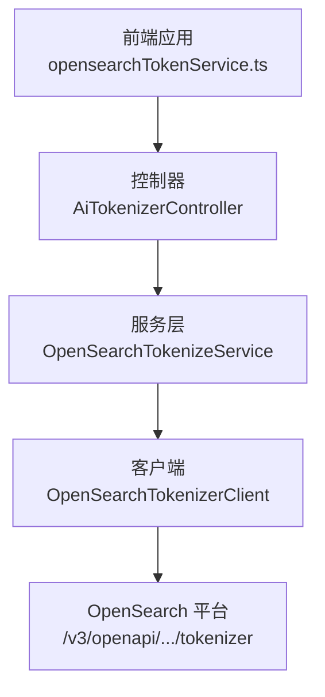
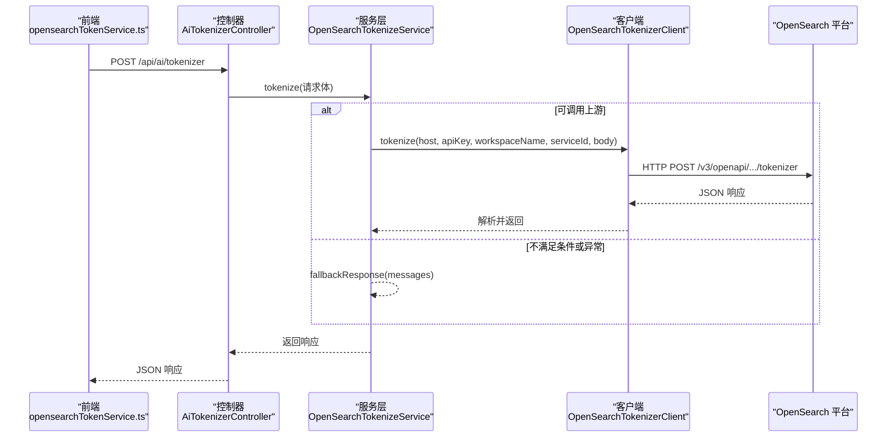
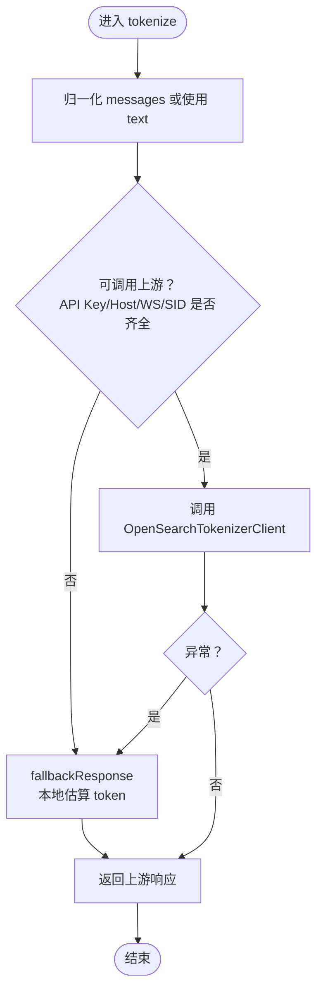
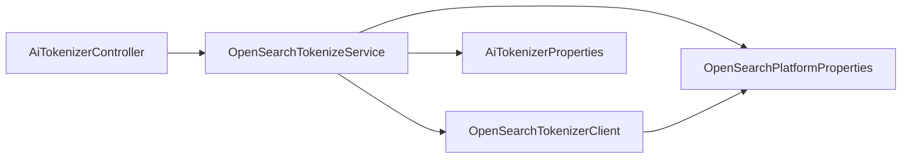

# 文本分词

<cite>
**本文引用的文件**
- [OpenSearchTokenizeService.java](file://src/main/java/com/example/EnterpriseRagCommunity/service/ai/OpenSearchTokenizeService.java)
- [OpenSearchTokenizerClient.java](file://src/main/java/com/example/EnterpriseRagCommunity/service/ai/client/OpenSearchTokenizerClient.java)
- [AiTokenizerController.java](file://src/main/java/com/example/EnterpriseRagCommunity/controller/ai/AiTokenizerController.java)
- [OpenSearchTokenizeRequest.java](file://src/main/java/com/example/EnterpriseRagCommunity/dto/ai/OpenSearchTokenizeRequest.java)
- [OpenSearchTokenizeResponse.java](file://src/main/java/com/example/EnterpriseRagCommunity/dto/ai/OpenSearchTokenizeResponse.java)
- [AiTokenizerProperties.java](file://src/main/java/com/example/EnterpriseRagCommunity/config/AiTokenizerProperties.java)
- [OpenSearchPlatformProperties.java](file://src/main/java/com/example/EnterpriseRagCommunity/config/OpenSearchPlatformProperties.java)
- [opensearchTokenService.ts](file://my-vite-app/src/services/opensearchTokenService.ts)
- [OpenSearchTokenizeServiceTest.java](file://src/test/java/com/example/EnterpriseRagCommunity/service/ai/OpenSearchTokenizeServiceTest.java)
- [AiTokenizerControllerTest.java](file://src/test/java/com/example/EnterpriseRagCommunity/controller/ai/AiTokenizerControllerTest.java)
</cite>

## 目录
1. [引言](#引言)
2. [项目结构](#项目结构)
3. [核心组件](#核心组件)
4. [架构总览](#架构总览)
5. [详细组件分析](#详细组件分析)
6. [依赖分析](#依赖分析)
7. [性能考虑](#性能考虑)
8. [故障排查指南](#故障排查指南)
9. [结论](#结论)
10. [附录：API 接口规范与最佳实践](#附录api-接口规范与最佳实践)

## 引言
本技术文档围绕企业级 RAG 社区项目中的“文本分词”能力展开，重点阐述基于 OpenSearch 平台的分词器集成实现，包括：
- 分词请求与响应的数据模型与格式
- 分词算法与令牌化服务架构
- 性能优化策略（估算与回退）
- 错误处理与容错机制
- 分词 API 的接口规范与前端调用方式
- 在 RAG 系统中的作用、多语言支持与自定义规则建议

## 项目结构
与分词功能直接相关的后端模块由三层组成：
- 控制层：接收外部请求并鉴权
- 服务层：负责消息归一化、上游调用与回退逻辑
- 客户端层：封装 HTTP 调用 OpenSearch 平台分词接口

前端通过 TypeScript 服务封装了对后端 /api/ai/tokenizer 的调用。

图表来源
- [AiTokenizerController.java:12-36](file://src/main/java/com/example/EnterpriseRagCommunity/controller/ai/AiTokenizerController.java#L12-L36)
- [OpenSearchTokenizeService.java:18-43](file://src/main/java/com/example/EnterpriseRagCommunity/service/ai/OpenSearchTokenizeService.java#L18-L43)
- [OpenSearchTokenizerClient.java:24-82](file://src/main/java/com/example/EnterpriseRagCommunity/service/ai/client/OpenSearchTokenizerClient.java#L24-L82)

章节来源
- [AiTokenizerController.java:12-36](file://src/main/java/com/example/EnterpriseRagCommunity/controller/ai/AiTokenizerController.java#L12-L36)
- [OpenSearchTokenizeService.java:18-43](file://src/main/java/com/example/EnterpriseRagCommunity/service/ai/OpenSearchTokenizeService.java#L18-L43)
- [OpenSearchTokenizerClient.java:24-82](file://src/main/java/com/example/EnterpriseRagCommunity/service/ai/client/OpenSearchTokenizerClient.java#L24-L82)

## 核心组件
- 请求数据模型：OpenSearchTokenizeRequest 支持两种输入形式之一：
  - 单条纯文本 text
  - 消息列表 messages（每条含 role 与 content），且最后一条必须是 user 角色
- 响应数据模型：OpenSearchTokenizeResponse 包含 request_id、latency、code、message、usage.input_tokens、result.token_ids 与 result.tokens
- 服务层：OpenSearchTokenizeService 负责：
  - 归一化 messages 或回退到 text
  - 判断是否可调用上游 OpenSearch 平台
  - 发起 HTTP 调用或进行本地估算回退
- 客户端：OpenSearchTokenizerClient 封装 HTTP 请求、超时设置、错误解析与返回值校验
- 配置项：AiTokenizerProperties（API Key）与 OpenSearchPlatformProperties（平台地址、工作空间、服务 ID、连接/读取超时）

章节来源
- [OpenSearchTokenizeRequest.java:7-20](file://src/main/java/com/example/EnterpriseRagCommunity/dto/ai/OpenSearchTokenizeRequest.java#L7-L20)
- [OpenSearchTokenizeResponse.java:8-34](file://src/main/java/com/example/EnterpriseRagCommunity/dto/ai/OpenSearchTokenizeResponse.java#L8-L34)
- [OpenSearchTokenizeService.java:24-140](file://src/main/java/com/example/EnterpriseRagCommunity/service/ai/OpenSearchTokenizeService.java#L24-L140)
- [OpenSearchTokenizerClient.java:24-82](file://src/main/java/com/example/EnterpriseRagCommunity/service/ai/client/OpenSearchTokenizerClient.java#L24-L82)
- [AiTokenizerProperties.java:9-12](file://src/main/java/com/example/EnterpriseRagCommunity/config/AiTokenizerProperties.java#L9-L12)
- [OpenSearchPlatformProperties.java:9-16](file://src/main/java/com/example/EnterpriseRagCommunity/config/OpenSearchPlatformProperties.java#L9-L16)

## 架构总览
下图展示了从前端到 OpenSearch 平台的完整调用链路，以及在异常或配置不全时的服务回退路径。

图表来源
- [opensearchTokenService.ts:47-52](file://my-vite-app/src/services/opensearchTokenService.ts#L47-L52)
- [AiTokenizerController.java:19-23](file://src/main/java/com/example/EnterpriseRagCommunity/controller/ai/AiTokenizerController.java#L19-L23)
- [OpenSearchTokenizeService.java:24-43](file://src/main/java/com/example/EnterpriseRagCommunity/service/ai/OpenSearchTokenizeService.java#L24-L43)
- [OpenSearchTokenizerClient.java:24-82](file://src/main/java/com/example/EnterpriseRagCommunity/service/ai/client/OpenSearchTokenizerClient.java#L24-L82)

## 详细组件分析

### 组件一：控制器（AiTokenizerController）
- 职责：暴露 /api/ai/tokenizer 接口；进行用户鉴权；转发请求至服务层
- 关键点：
  - 使用 Spring Security 获取当前认证用户
  - 若未登录或匿名，抛出认证异常
  - 将请求体转交给 OpenSearchTokenizeService 执行

章节来源
- [AiTokenizerController.java:19-34](file://src/main/java/com/example/EnterpriseRagCommunity/controller/ai/AiTokenizerController.java#L19-L34)

### 组件二：服务层（OpenSearchTokenizeService）
- 职责：消息归一化、上游调用决策、异常回退、本地估算
- 关键流程：
  - 归一化 messages：过滤空/非法项，确保最后一条为 user 角色；若为空则抛出参数错误
  - 回退条件：当 API Key、平台主机、工作空间或服务 ID 缺失时，直接走本地估算
  - 上游调用：构造 body（包含 messages），调用客户端；异常捕获后同样走本地估算
  - 本地估算：拼接有效内容，按字符集估算 token 数量（CJK 与非 CJK 分类处理）

图表来源
- [OpenSearchTokenizeService.java:24-73](file://src/main/java/com/example/EnterpriseRagCommunity/service/ai/OpenSearchTokenizeService.java#L24-L73)
- [OpenSearchTokenizeService.java:75-110](file://src/main/java/com/example/EnterpriseRagCommunity/service/ai/OpenSearchTokenizeService.java#L75-L110)
- [OpenSearchTokenizeService.java:112-140](file://src/main/java/com/example/EnterpriseRagCommunity/service/ai/OpenSearchTokenizeService.java#L112-L140)

章节来源
- [OpenSearchTokenizeService.java:24-140](file://src/main/java/com/example/EnterpriseRagCommunity/service/ai/OpenSearchTokenizeService.java#L24-L140)

### 组件三：客户端（OpenSearchTokenizerClient）
- 职责：构建 OpenSearch 平台分词接口 URL，发送 HTTP 请求，解析响应
- 关键点：
  - 参数校验：缺少任一必要参数即抛出异常
  - URL 构造：对工作空间与服务 ID 进行路径转义
  - 超时控制：connectTimeoutMs 与 readTimeoutMs
  - 错误处理：读取错误流并尝试解析标准错误字段（code/message/request_id），统一抛出异常
  - 成功返回：解析 JSON 为响应对象

章节来源
- [OpenSearchTokenizerClient.java:24-82](file://src/main/java/com/example/EnterpriseRagCommunity/service/ai/client/OpenSearchTokenizerClient.java#L24-L82)

### 组件四：数据模型（请求/响应）
- 请求模型（OpenSearchTokenizeRequest）：
  - 字段：text、messages（Message：role、content）、workspaceName、serviceId
  - 规范：messages 非空时，最后一条必须为 user；否则需提供 text
- 响应模型（OpenSearchTokenizeResponse）：
  - 字段：request_id、latency、code、message、usage.input_tokens、result.token_ids、result.tokens

章节来源
- [OpenSearchTokenizeRequest.java:7-20](file://src/main/java/com/example/EnterpriseRagCommunity/dto/ai/OpenSearchTokenizeRequest.java#L7-L20)
- [OpenSearchTokenizeResponse.java:8-34](file://src/main/java/com/example/EnterpriseRagCommunity/dto/ai/OpenSearchTokenizeResponse.java#L8-L34)

### 组件五：配置（AiTokenizerProperties、OpenSearchPlatformProperties）
- AiTokenizerProperties：app.ai.tokenizer.apiKey
- OpenSearchPlatformProperties：app.opensearch.platform.host、workspaceName、serviceId、connectTimeoutMs、readTimeoutMs

章节来源
- [AiTokenizerProperties.java:9-12](file://src/main/java/com/example/EnterpriseRagCommunity/config/AiTokenizerProperties.java#L9-L12)
- [OpenSearchPlatformProperties.java:9-16](file://src/main/java/com/example/EnterpriseRagCommunity/config/OpenSearchPlatformProperties.java#L9-L16)

### 组件六：前端调用（opensearchTokenService.ts）
- 提供 tokenizeText(text, { workspaceName?, serviceId? }) 方法
- 自动注入 CSRF Token，并根据环境变量拼接 API 基础路径
- 对非 2xx 响应进行错误提取与抛出

章节来源
- [opensearchTokenService.ts:47-52](file://my-vite-app/src/services/opensearchTokenService.ts#L47-L52)

## 依赖分析
- 控制器依赖服务层
- 服务层依赖客户端与配置属性
- 客户端依赖配置属性与 Jackson ObjectMapper
- 前端依赖控制器提供的 /api/ai/tokenizer

图表来源
- [AiTokenizerController.java:15-16](file://src/main/java/com/example/EnterpriseRagCommunity/controller/ai/AiTokenizerController.java#L15-L16)
- [OpenSearchTokenizeService.java:21-22](file://src/main/java/com/example/EnterpriseRagCommunity/service/ai/OpenSearchTokenizeService.java#L21-L22)
- [OpenSearchTokenizerClient.java:17-18](file://src/main/java/com/example/EnterpriseRagCommunity/service/ai/client/OpenSearchTokenizerClient.java#L17-L18)

章节来源
- [AiTokenizerController.java:15-16](file://src/main/java/com/example/EnterpriseRagCommunity/controller/ai/AiTokenizerController.java#L15-L16)
- [OpenSearchTokenizeService.java:21-22](file://src/main/java/com/example/EnterpriseRagCommunity/service/ai/OpenSearchTokenizeService.java#L21-L22)
- [OpenSearchTokenizerClient.java:17-18](file://src/main/java/com/example/EnterpriseRagCommunity/service/ai/client/OpenSearchTokenizerClient.java#L17-L18)

## 性能考虑
- 估算策略：
  - 对输入文本逐字符计算 Unicode 码点
  - CJK 字符计为 1 个 token
  - 非 CJK 字符按每 4 个字符约等于 1 个 token 估算
  - 最少返回 1 个 token，避免零值影响上层逻辑
- 超时控制：
  - 客户端使用配置的连接与读取超时，防止阻塞
- 回退机制：
  - 当上游不可用或异常时，立即切换到本地估算，保障可用性
- 建议优化方向（通用实践，非现有实现）：
  - 引入本地分词器（如基于规则的分词或轻量模型）以进一步降低延迟
  - 对频繁请求进行结果缓存（需结合业务场景与一致性要求）
  - 对长文本采用分块估算并累加，减少一次性处理压力

章节来源
- [OpenSearchTokenizeService.java:75-110](file://src/main/java/com/example/EnterpriseRagCommunity/service/ai/OpenSearchTokenizeService.java#L75-L110)
- [OpenSearchTokenizerClient.java:43-44](file://src/main/java/com/example/EnterpriseRagCommunity/service/ai/client/OpenSearchTokenizerClient.java#L43-L44)

## 故障排查指南
- 常见错误与定位要点：
  - 缺少必要配置：API Key、平台主机、工作空间或服务 ID 为空时，客户端直接抛出异常
  - 上游 HTTP 错误：客户端解析错误响应中的 code/message/request_id 并组合为统一异常信息
  - 请求参数错误：messages 为空或最后一条非 user 角色时，服务层抛出参数异常
  - 未登录或匿名访问：控制器在鉴权失败时抛出认证异常
- 测试覆盖点（用于验证行为）：
  - 上游 HTTP 错误应触发回退
  - 缺少 host/workspace/service 时应直接回退
  - messages 为空列表时回退到 text 路径
  - 包含无效内容的消息会被规范化并回退
  - CJK 与非 CJK 字符混合时估算正确
- 建议排查步骤：
  - 检查 app.ai.tokenizer.api-key 与 app.opensearch.platform.* 配置
  - 查看控制器与服务层日志，确认是否进入回退路径
  - 使用测试用例思路复现问题（构造空 messages、缺失参数、无效角色等）

章节来源
- [OpenSearchTokenizerClient.java:30-33](file://src/main/java/com/example/EnterpriseRagCommunity/service/ai/client/OpenSearchTokenizerClient.java#L30-L33)
- [OpenSearchTokenizerClient.java:58-81](file://src/main/java/com/example/EnterpriseRagCommunity/service/ai/client/OpenSearchTokenizerClient.java#L58-L81)
- [OpenSearchTokenizeService.java:126-133](file://src/main/java/com/example/EnterpriseRagCommunity/service/ai/OpenSearchTokenizeService.java#L126-L133)
- [AiTokenizerController.java:25-34](file://src/main/java/com/example/EnterpriseRagCommunity/controller/ai/AiTokenizerController.java#L25-L34)
- [OpenSearchTokenizeServiceTest.java:186-215](file://src/test/java/com/example/EnterpriseRagCommunity/service/ai/OpenSearchTokenizeServiceTest.java#L186-L215)
- [OpenSearchTokenizeServiceTest.java:218-242](file://src/test/java/com/example/EnterpriseRagCommunity/service/ai/OpenSearchTokenizeServiceTest.java#L218-L242)
- [OpenSearchTokenizeServiceTest.java:277-290](file://src/test/java/com/example/EnterpriseRagCommunity/service/ai/OpenSearchTokenizeServiceTest.java#L277-L290)
- [OpenSearchTokenizeServiceTest.java:292-351](file://src/test/java/com/example/EnterpriseRagCommunity/service/ai/OpenSearchTokenizeServiceTest.java#L292-L351)

## 结论
该分词实现以“可调用优先、异常回退”的策略保证稳定性，通过本地估算维持基本可用性。其架构清晰、职责分明，便于扩展与维护。对于更高性能与更丰富的分词能力，可在现有基础上引入本地分词器与缓存策略，并完善多语言与自定义规则的配置化管理。

## 附录：API 接口规范与最佳实践

### API 接口规范
- 地址
  - POST /api/ai/tokenizer
- 请求头
  - Content-Type: application/json
  - X-XSRF-TOKEN: CSRF Token（前端自动注入）
- 请求体字段
  - text: string（可选；与 messages 二选一）
  - messages: array（可选；每项含 role 与 content）
  - workspaceName: string（可选；覆盖配置）
  - serviceId: string（可选；覆盖配置）
- 响应体字段
  - request_id: string（可选）
  - latency: number（可选）
  - code: string（可选）
  - message: string（可选）
  - usage.input_tokens: number（必需）
  - result.token_ids: array<number>（可选）
  - result.tokens: array<string>（可选）

章节来源
- [AiTokenizerController.java:19-23](file://src/main/java/com/example/EnterpriseRagCommunity/controller/ai/AiTokenizerController.java#L19-L23)
- [OpenSearchTokenizeRequest.java:7-20](file://src/main/java/com/example/EnterpriseRagCommunity/dto/ai/OpenSearchTokenizeRequest.java#L7-L20)
- [OpenSearchTokenizeResponse.java:8-34](file://src/main/java/com/example/EnterpriseRagCommunity/dto/ai/OpenSearchTokenizeResponse.java#L8-L34)
- [opensearchTokenService.ts:47-52](file://my-vite-app/src/services/opensearchTokenService.ts#L47-L52)

### 错误码与语义
- 未登录/匿名：控制器抛出认证异常
- 参数错误：messages 为空或最后一条非 user 角色
- 配置缺失：客户端抛出“缺少配置”异常
- 上游错误：HTTP 非 2xx 或响应中包含 code/message/request_id

章节来源
- [AiTokenizerController.java:25-34](file://src/main/java/com/example/EnterpriseRagCommunity/controller/ai/AiTokenizerController.java#L25-L34)
- [OpenSearchTokenizeService.java:126-133](file://src/main/java/com/example/EnterpriseRagCommunity/service/ai/OpenSearchTokenizeService.java#L126-L133)
- [OpenSearchTokenizerClient.java:30-33](file://src/main/java/com/example/EnterpriseRagCommunity/service/ai/client/OpenSearchTokenizerClient.java#L30-L33)
- [OpenSearchTokenizerClient.java:58-81](file://src/main/java/com/example/EnterpriseRagCommunity/service/ai/client/OpenSearchTokenizerClient.java#L58-L81)

### 在 RAG 系统中的作用
- 文档切片与嵌入前的预处理：分词估算用于控制切片大小与上下文窗口
- 多语言支持：服务层对 CJK 与非 CJK 字符分别估算，有助于跨语言场景的 token 预估
- 自定义规则建议（通用实践，非现有实现）：
  - 针对特定领域术语建立词汇表映射
  - 对标点与空白进行统一归一化
  - 对长文本采用滚动窗口切片并保留语义边界

### 实际使用示例（路径参考）
- 前端调用
  - [opensearchTokenService.ts:47-52](file://my-vite-app/src/services/opensearchTokenService.ts#L47-L52)
- 后端控制器
  - [AiTokenizerController.java:19-23](file://src/main/java/com/example/EnterpriseRagCommunity/controller/ai/AiTokenizerController.java#L19-L23)
- 服务层分词
  - [OpenSearchTokenizeService.java:24-43](file://src/main/java/com/example/EnterpriseRagCommunity/service/ai/OpenSearchTokenizeService.java#L24-L43)
- 客户端调用 OpenSearch
  - [OpenSearchTokenizerClient.java:24-82](file://src/main/java/com/example/EnterpriseRagCommunity/service/ai/client/OpenSearchTokenizerClient.java#L24-L82)

### 最佳实践
- 明确配置：确保 app.ai.tokenizer.api-key 与 app.opensearch.platform.* 已正确设置
- 输入规范：优先使用 messages 并确保最后一条为 user；若使用 text，请保证内容可读
- 错误处理：在调用方捕获并提示用户，同时记录 request_id 以便追踪
- 性能优化：对高频请求进行结果缓存（需评估一致性），或引入本地轻量分词器
- 多语言：关注 CJK 与非 CJK 的估算差异，必要时结合领域词典提升准确性