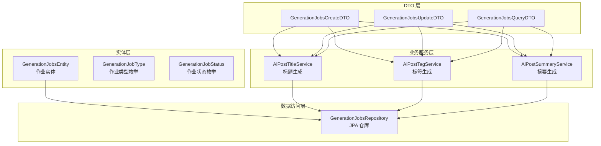
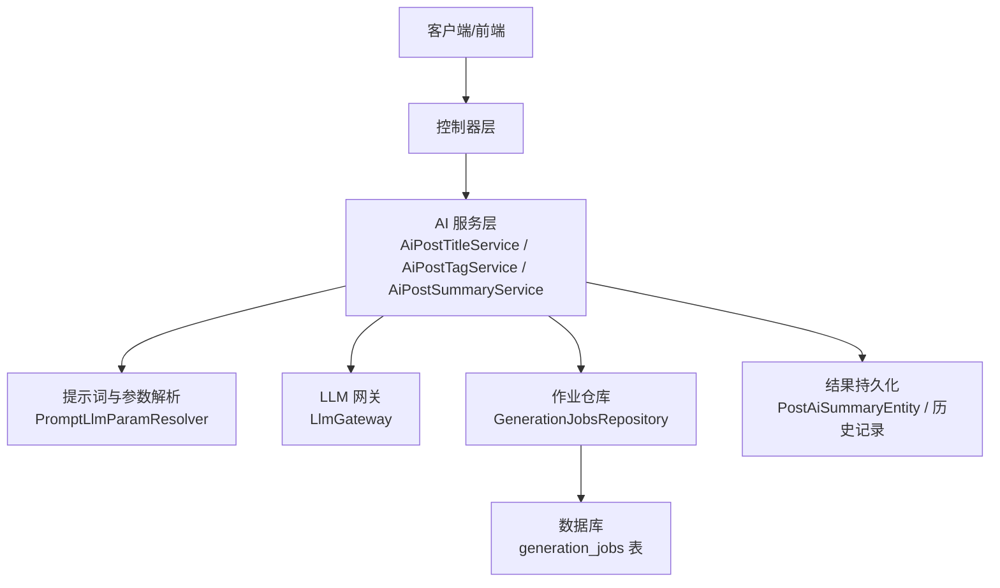
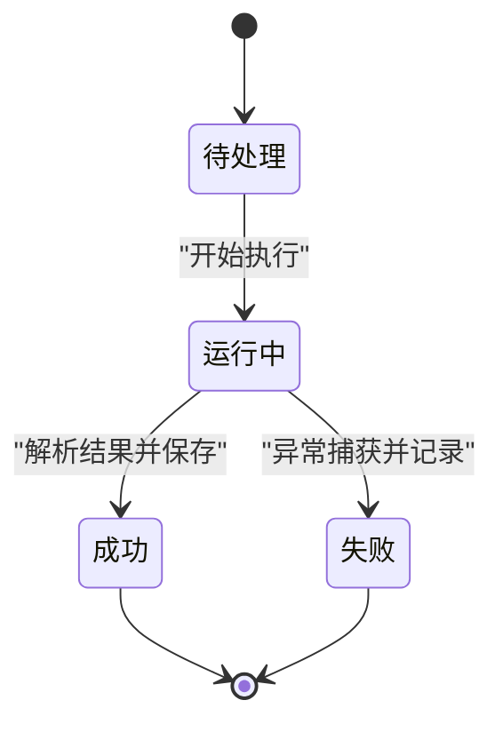
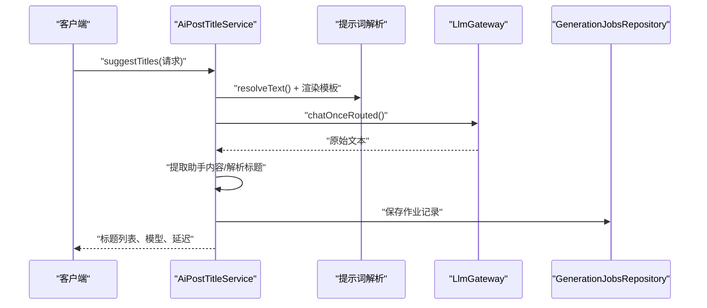
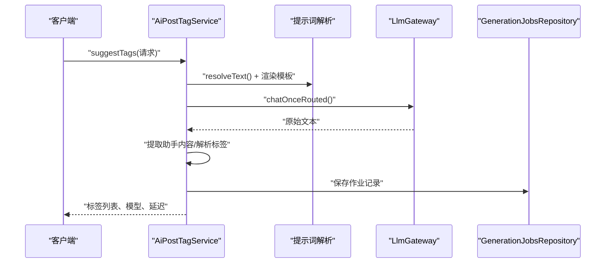
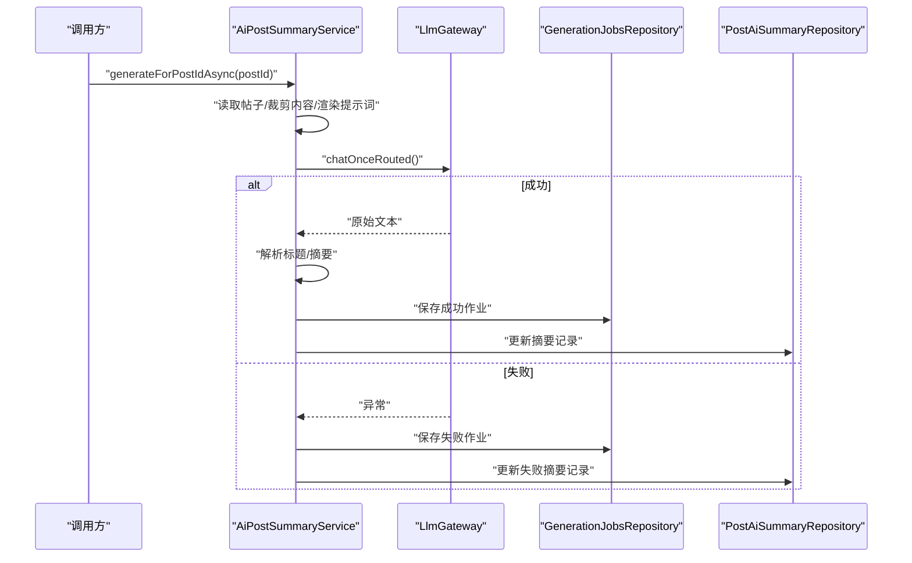
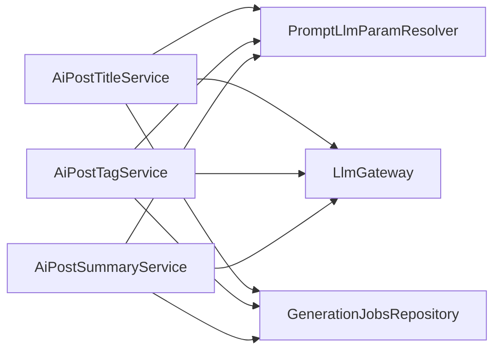

# 文档生成

<cite>
**本文引用的文件**   
- [GenerationJobsEntity.java](file://src/main/java/com/example/EnterpriseRagCommunity/entity/semantic/GenerationJobsEntity.java)
- [GenerationJobStatus.java](file://src/main/java/com/example/EnterpriseRagCommunity/entity/semantic/enums/GenerationJobStatus.java)
- [GenerationJobType.java](file://src/main/java/com/example/EnterpriseRagCommunity/entity/semantic/enums/GenerationJobType.java)
- [GenerationJobsRepository.java](file://src/main/java/com/example/EnterpriseRagCommunity/repository/semantic/GenerationJobsRepository.java)
- [GenerationJobsCreateDTO.java](file://src/main/java/com/example/EnterpriseRagCommunity/dto/semantic/GenerationJobsCreateDTO.java)
- [GenerationJobsUpdateDTO.java](file://src/main/java/com/example/EnterpriseRagCommunity/dto/semantic/GenerationJobsUpdateDTO.java)
- [GenerationJobsQueryDTO.java](file://src/main/java/com/example/EnterpriseRagCommunity/dto/semantic/GenerationJobsQueryDTO.java)
- [AiPostTitleService.java](file://src/main/java/com/example/EnterpriseRagCommunity/service/ai/AiPostTitleService.java)
- [AiPostTagService.java](file://src/main/java/com/example/EnterpriseRagCommunity/service/ai/AiPostTagService.java)
- [AiPostSummaryService.java](file://src/main/java/com/example/EnterpriseRagCommunity/service/ai/AiPostSummaryService.java)
- [PostTitleGenHistoryDTO.java](file://src/main/java/com/example/EnterpriseRagCommunity/dto/ai/PostTitleGenHistoryDTO.java)
</cite>

## 目录
1. [引言](#引言)
2. [项目结构](#项目结构)
3. [核心组件](#核心组件)
4. [架构总览](#架构总览)
5. [详细组件分析](#详细组件分析)
6. [依赖分析](#依赖分析)
7. [性能考虑](#性能考虑)
8. [故障排查指南](#故障排查指南)
9. [结论](#结论)
10. [附录](#附录)

## 引言
本技术文档围绕“文档生成”能力进行系统性梳理，覆盖作业生命周期管理（状态、执行流程、结果处理）、文档与文档块实体设计、分块策略与元数据管理、版本控制、API 接口规范、在 RAG 系统中的应用场景、性能优化与并发控制、错误恢复机制，并提供实际使用案例与配置示例。读者可据此快速理解并集成文档生成能力。

## 项目结构
文档生成能力主要由以下层次构成：
- 实体层：作业实体与枚举定义，统一承载作业类型、目标类型、状态、参数与结果等。
- 数据访问层：基于 Spring Data JPA 的仓库接口，提供按类型/状态/时间/复合条件查询。
- 业务服务层：面向具体任务类型的 AI 服务（标题生成、标签生成、摘要生成），封装提示词渲染、LLM 调用、结果解析与持久化。
- DTO 层：创建、更新、查询作业的传输对象，确保接口契约清晰与安全。
- 控制器层：对外暴露 REST API（未在本节展开，详见各服务的控制器文件）。

图表来源
- [GenerationJobsEntity.java:1-85](file://src/main/java/com/example/EnterpriseRagCommunity/entity/semantic/GenerationJobsEntity.java#L1-L85)
- [GenerationJobsRepository.java:1-28](file://src/main/java/com/example/EnterpriseRagCommunity/repository/semantic/GenerationJobsRepository.java#L1-L28)
- [AiPostTitleService.java:1-279](file://src/main/java/com/example/EnterpriseRagCommunity/service/ai/AiPostTitleService.java#L1-L279)
- [AiPostTagService.java:1-290](file://src/main/java/com/example/EnterpriseRagCommunity/service/ai/AiPostTagService.java#L1-L290)
- [AiPostSummaryService.java:1-484](file://src/main/java/com/example/EnterpriseRagCommunity/service/ai/AiPostSummaryService.java#L1-L484)

章节来源
- [GenerationJobsEntity.java:1-85](file://src/main/java/com/example/EnterpriseRagCommunity/entity/semantic/GenerationJobsEntity.java#L1-L85)
- [GenerationJobsRepository.java:1-28](file://src/main/java/com/example/EnterpriseRagCommunity/repository/semantic/GenerationJobsRepository.java#L1-L28)

## 核心组件
- 作业实体与枚举
  - 作业实体统一记录作业类型、目标类型、目标 ID、状态、提示词模板、模型、温度、拓 P、延迟、参数、结果、Token 统计、成本、错误信息以及时间戳。
  - 作业类型涵盖标题、标签、摘要、翻译、建议、帖子组合等；作业状态包含待处理、运行中、成功、失败。
- 仓库接口
  - 提供按类型/状态、按提示词模板、按时间范围、按目标类型+目标 ID+状态等复合条件查询，便于调度与监控。
- DTO
  - 创建 DTO：用于提交作业请求，包含必填字段与可选参数。
  - 更新 DTO：支持部分字段更新，审计字段受保护。
  - 查询 DTO：继承分页请求，支持多维过滤。

章节来源
- [GenerationJobsEntity.java:1-85](file://src/main/java/com/example/EnterpriseRagCommunity/entity/semantic/GenerationJobsEntity.java#L1-L85)
- [GenerationJobStatus.java:1-9](file://src/main/java/com/example/EnterpriseRagCommunity/entity/semantic/enums/GenerationJobStatus.java#L1-L9)
- [GenerationJobType.java:1-11](file://src/main/java/com/example/EnterpriseRagCommunity/entity/semantic/enums/GenerationJobType.java#L1-L11)
- [GenerationJobsRepository.java:1-28](file://src/main/java/com/example/EnterpriseRagCommunity/repository/semantic/GenerationJobsRepository.java#L1-L28)
- [GenerationJobsCreateDTO.java:1-39](file://src/main/java/com/example/EnterpriseRagCommunity/dto/semantic/GenerationJobsCreateDTO.java#L1-L39)
- [GenerationJobsUpdateDTO.java:1-68](file://src/main/java/com/example/EnterpriseRagCommunity/dto/semantic/GenerationJobsUpdateDTO.java#L1-L68)
- [GenerationJobsQueryDTO.java:1-36](file://src/main/java/com/example/EnterpriseRagCommunity/dto/semantic/GenerationJobsQueryDTO.java#L1-L36)

## 架构总览
文档生成在系统中的位置与交互如下：

图表来源
- [AiPostTitleService.java:1-279](file://src/main/java/com/example/EnterpriseRagCommunity/service/ai/AiPostTitleService.java#L1-L279)
- [AiPostTagService.java:1-290](file://src/main/java/com/example/EnterpriseRagCommunity/service/ai/AiPostTagService.java#L1-L290)
- [AiPostSummaryService.java:1-484](file://src/main/java/com/example/EnterpriseRagCommunity/service/ai/AiPostSummaryService.java#L1-L484)
- [GenerationJobsRepository.java:1-28](file://src/main/java/com/example/EnterpriseRagCommunity/repository/semantic/GenerationJobsRepository.java#L1-L28)

## 详细组件分析

### 作业生命周期与状态机
作业状态从创建到完成或失败的流转如下：

图表来源
- [GenerationJobStatus.java:1-9](file://src/main/java/com/example/EnterpriseRagCommunity/entity/semantic/enums/GenerationJobStatus.java#L1-L9)
- [AiPostSummaryService.java:184-238](file://src/main/java/com/example/EnterpriseRagCommunity/service/ai/AiPostSummaryService.java#L184-L238)

章节来源
- [GenerationJobStatus.java:1-9](file://src/main/java/com/example/EnterpriseRagCommunity/entity/semantic/enums/GenerationJobStatus.java#L1-L9)
- [AiPostSummaryService.java:184-238](file://src/main/java/com/example/EnterpriseRagCommunity/service/ai/AiPostSummaryService.java#L184-L238)

### 标题生成服务（AiPostTitleService）
- 输入：请求包含内容、版块名、标签、数量等；结合配置服务确定最大字符数、提示词模板、模型与采样参数。
- 流程：渲染用户提示词 → 调用 LLM 网关 → 解析助手输出 → 去重与截断 → 记录作业与历史。
- 结果：返回标题列表、模型与延迟；同时写入 generation_jobs 与建议历史表。

图表来源
- [AiPostTitleService.java:35-156](file://src/main/java/com/example/EnterpriseRagCommunity/service/ai/AiPostTitleService.java#L35-L156)
- [GenerationJobsRepository.java:1-28](file://src/main/java/com/example/EnterpriseRagCommunity/repository/semantic/GenerationJobsRepository.java#L1-L28)

章节来源
- [AiPostTitleService.java:35-156](file://src/main/java/com/example/EnterpriseRagCommunity/service/ai/AiPostTitleService.java#L35-L156)

### 标签生成服务（AiPostTagService）
- 输入：请求包含内容、标题、已有标签、版块等；根据配置裁剪内容长度。
- 流程：渲染提示词 → LLM 调用 → 解析标签 → 去重与截断 → 记录作业与历史。
- 结果：返回标签列表、模型与延迟；写入 generation_jobs 与建议历史表。

图表来源
- [AiPostTagService.java:35-156](file://src/main/java/com/example/EnterpriseRagCommunity/service/ai/AiPostTagService.java#L35-L156)
- [GenerationJobsRepository.java:1-28](file://src/main/java/com/example/EnterpriseRagCommunity/repository/semantic/GenerationJobsRepository.java#L1-L28)

章节来源
- [AiPostTagService.java:35-156](file://src/main/java/com/example/EnterpriseRagCommunity/service/ai/AiPostTagService.java#L35-L156)

### 摘要生成服务（AiPostSummaryService）
- 输入：帖子 ID；异步执行，读取帖子标题与内容，按配置裁剪。
- 流程：渲染提示词 → LLM 调用 → 解析标题与摘要 → 保存成功或失败记录 → 写入 PostAiSummary 与历史。
- 错误处理：异常时记录失败作业与错误信息，避免中断主线程。

图表来源
- [AiPostSummaryService.java:47-130](file://src/main/java/com/example/EnterpriseRagCommunity/service/ai/AiPostSummaryService.java#L47-L130)
- [GenerationJobsRepository.java:1-28](file://src/main/java/com/example/EnterpriseRagCommunity/repository/semantic/GenerationJobsRepository.java#L1-L28)

章节来源
- [AiPostSummaryService.java:47-130](file://src/main/java/com/example/EnterpriseRagCommunity/service/ai/AiPostSummaryService.java#L47-L130)

### 文档实体与分块策略、元数据管理、版本控制
- 文档实体
  - 作业实体 generation_jobs 统一承载作业元数据与结果，支持 JSON 字段存储参数与结果，便于扩展。
- 文档块实体
  - 本模块未直接提供文档块实体定义；但分块策略与证据链路在其他模块有体现，可参考语义审核相关逻辑（例如按标点断句、重叠窗口等策略），以适配文档分块场景。
- 元数据管理
  - 通过 JSON 字段 params/result_json 存储动态参数与结果；通过 prompt_code/prompt_version 跟踪提示词版本。
- 版本控制
  - 通过 prompt_version 字段记录提示词版本，便于回溯与灰度发布。

章节来源
- [GenerationJobsEntity.java:1-85](file://src/main/java/com/example/EnterpriseRagCommunity/entity/semantic/GenerationJobsEntity.java#L1-L85)

### API 接口规范（作业管理）
说明：以下为作业管理的通用接口规范，具体端点以控制器实现为准。请求与响应均采用 DTO。

- 作业创建
  - 方法与路径：POST /api/semantic/generation/jobs
  - 请求体：GenerationJobsCreateDTO
  - 字段说明：jobType、targetType、targetId、status、promptId、model、params、resultJson、tokensIn、tokensOut、costCents 等
  - 返回：创建后的作业实体
- 作业状态查询
  - 方法与路径：GET /api/semantic/generation/jobs/{id}
  - 返回：指定作业详情
- 作业列表查询
  - 方法与路径：GET /api/semantic/generation/jobs
  - 查询参数：GenerationJobsQueryDTO（支持按 jobType、status、targetType、targetId、model、promptId、params 等过滤）
- 作业更新
  - 方法与路径：PUT /api/semantic/generation/jobs
  - 请求体：GenerationJobsUpdateDTO（支持部分字段更新）
  - 返回：更新后的作业实体

章节来源
- [GenerationJobsCreateDTO.java:1-39](file://src/main/java/com/example/EnterpriseRagCommunity/dto/semantic/GenerationJobsCreateDTO.java#L1-L39)
- [GenerationJobsUpdateDTO.java:1-68](file://src/main/java/com/example/EnterpriseRagCommunity/dto/semantic/GenerationJobsUpdateDTO.java#L1-L68)
- [GenerationJobsQueryDTO.java:1-36](file://src/main/java/com/example/EnterpriseRagCommunity/dto/semantic/GenerationJobsQueryDTO.java#L1-L36)

### 在 RAG 系统中的应用场景
- 内容摘要：对长文本生成简洁摘要，辅助检索与展示。
- 标签生成：自动抽取主题标签，提升检索召回质量。
- 标题生成：为内容生成多个候选标题，提高用户点击率与检索准确性。
- 翻译与改写：支持多语言翻译与风格改写（作业类型包含 TRANSLATE、SUGGESTION 等）。

章节来源
- [GenerationJobType.java:1-11](file://src/main/java/com/example/EnterpriseRagCommunity/entity/semantic/enums/GenerationJobType.java#L1-L11)
- [AiPostTitleService.java:35-156](file://src/main/java/com/example/EnterpriseRagCommunity/service/ai/AiPostTitleService.java#L35-L156)
- [AiPostTagService.java:35-156](file://src/main/java/com/example/EnterpriseRagCommunity/service/ai/AiPostTagService.java#L35-L156)
- [AiPostSummaryService.java:47-130](file://src/main/java/com/example/EnterpriseRagCommunity/service/ai/AiPostSummaryService.java#L47-L130)

### 性能优化策略、并发控制与错误恢复
- 性能优化
  - 内容裁剪：按配置的最大字符数裁剪输入，降低 Token 消耗与延迟。
  - 结果解析兼容：对不同格式的助手输出进行兼容解析，减少失败重试。
  - 参数复用：通过提示词解析器统一注入模型与采样参数，避免重复计算。
- 并发控制
  - 异步执行：摘要生成使用异步注解，避免阻塞主线程。
  - 事务边界：在保存成功/失败记录时使用事务，保证一致性。
- 错误恢复
  - 失败兜底：异常时记录失败作业与错误信息，保留现场以便重试或人工干预。
  - 最大长度限制：对错误消息与字段进行截断，避免超长导致的存储问题。

章节来源
- [AiPostSummaryService.java:47-130](file://src/main/java/com/example/EnterpriseRagCommunity/service/ai/AiPostSummaryService.java#L47-L130)
- [AiPostTitleService.java:35-156](file://src/main/java/com/example/EnterpriseRagCommunity/service/ai/AiPostTitleService.java#L35-L156)
- [AiPostTagService.java:35-156](file://src/main/java/com/example/EnterpriseRagCommunity/service/ai/AiPostTagService.java#L35-L156)

### 实际使用案例与配置示例
- 标题生成
  - 场景：用户输入内容与标签，请求生成多个候选标题。
  - 关键点：通过配置服务设置默认/最大数量、最大字符数、提示词模板与采样参数；最终返回标题列表与延迟。
- 标签生成
  - 场景：基于标题与内容生成主题标签，支持已有标签作为上下文。
  - 关键点：渲染提示词时拼接版块、标题、已有标签；解析输出后去重与截断。
- 摘要生成
  - 场景：对帖子内容生成标题与摘要，写入摘要表与作业表。
  - 关键点：异步执行、异常记录、结果清洗与长度限制。

章节来源
- [AiPostTitleService.java:35-156](file://src/main/java/com/example/EnterpriseRagCommunity/service/ai/AiPostTitleService.java#L35-L156)
- [AiPostTagService.java:35-156](file://src/main/java/com/example/EnterpriseRagCommunity/service/ai/AiPostTagService.java#L35-L156)
- [AiPostSummaryService.java:47-130](file://src/main/java/com/example/EnterpriseRagCommunity/service/ai/AiPostSummaryService.java#L47-L130)
- [PostTitleGenHistoryDTO.java:1-28](file://src/main/java/com/example/EnterpriseRagCommunity/dto/ai/PostTitleGenHistoryDTO.java#L1-L28)

## 依赖分析
- 组件耦合
  - 服务层依赖提示词解析器与 LLM 网关，解耦了提示词与模型细节。
  - 作业实体与仓库接口形成稳定的持久化契约，便于横向扩展。
- 外部依赖
  - LLM 网关负责路由与调用，服务层仅感知结果文本。
- 可能的循环依赖
  - 当前结构为单向依赖（服务 → 提示词/网关 → 仓库），未见循环。

图表来源
- [AiPostTitleService.java:1-279](file://src/main/java/com/example/EnterpriseRagCommunity/service/ai/AiPostTitleService.java#L1-L279)
- [AiPostTagService.java:1-290](file://src/main/java/com/example/EnterpriseRagCommunity/service/ai/AiPostTagService.java#L1-L290)
- [AiPostSummaryService.java:1-484](file://src/main/java/com/example/EnterpriseRagCommunity/service/ai/AiPostSummaryService.java#L1-L484)

章节来源
- [AiPostTitleService.java:1-279](file://src/main/java/com/example/EnterpriseRagCommunity/service/ai/AiPostTitleService.java#L1-L279)
- [AiPostTagService.java:1-290](file://src/main/java/com/example/EnterpriseRagCommunity/service/ai/AiPostTagService.java#L1-L290)
- [AiPostSummaryService.java:1-484](file://src/main/java/com/example/EnterpriseRagCommunity/service/ai/AiPostSummaryService.java#L1-L484)

## 性能考虑
- 输入裁剪：在进入 LLM 前对内容进行最大字符数限制，显著降低 Token 使用与往返延迟。
- 输出解析：对多种输出格式进行兼容解析，减少因格式差异导致的失败重试。
- 异步化：摘要生成采用异步执行，避免阻塞请求线程。
- 事务与持久化：在保存成功/失败记录时使用事务，保证数据一致性与可恢复性。

## 故障排查指南
- 常见问题
  - 上游 AI 调用失败：检查 LLM 网关可用性与路由配置；查看作业记录中的错误信息字段。
  - 输出解析失败：确认提示词模板是否引导稳定 JSON 输出；必要时调整提示词或放宽解析策略。
  - 作业状态异常：通过查询接口定位作业状态与时间戳，结合日志与错误信息进行定位。
- 建议步骤
  - 查看 generation_jobs 中对应作业的 status、errorMessage、latencyMs、promptVersion。
  - 对比提示词模板版本与参数，确认是否存在不兼容变更。
  - 对失败作业进行重试或人工干预，必要时降低内容长度或调整采样参数。

章节来源
- [AiPostSummaryService.java:184-238](file://src/main/java/com/example/EnterpriseRagCommunity/service/ai/AiPostSummaryService.java#L184-L238)
- [GenerationJobsEntity.java:1-85](file://src/main/java/com/example/EnterpriseRagCommunity/entity/semantic/GenerationJobsEntity.java#L1-L85)

## 结论
文档生成模块以统一的作业实体与仓库为核心，配合标题、标签、摘要三大 AI 服务能力，实现了从提示词渲染、LLM 调用、结果解析到持久化的完整闭环。通过配置驱动与版本控制，能够灵活适配不同场景；异步化与错误恢复机制保障了系统的稳定性与可维护性。建议在生产环境中结合监控与告警，持续优化提示词模板与参数，以获得更高质量的生成结果。

## 附录
- 术语
  - 作业：一次文档生成任务的抽象，包含类型、目标、状态与结果。
  - 提示词模板：定义系统提示词与用户提示词的模板，支持参数化渲染。
  - 作业状态：待处理、运行中、成功、失败。
- 相关枚举与实体
  - 作业类型：TITLE、TAGS、SUMMARY、TRANSLATE、SUGGESTION、POST_COMPOSE
  - 作业状态：PENDING、RUNNING、SUCCEEDED、FAILED

章节来源
- [GenerationJobType.java:1-11](file://src/main/java/com/example/EnterpriseRagCommunity/entity/semantic/enums/GenerationJobType.java#L1-L11)
- [GenerationJobStatus.java:1-9](file://src/main/java/com/example/EnterpriseRagCommunity/entity/semantic/enums/GenerationJobStatus.java#L1-L9)