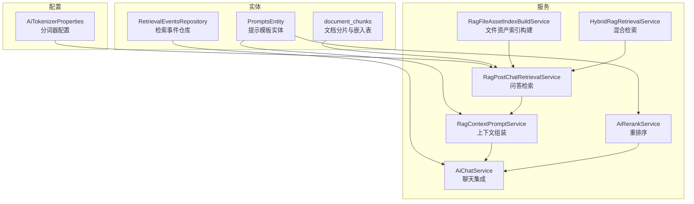
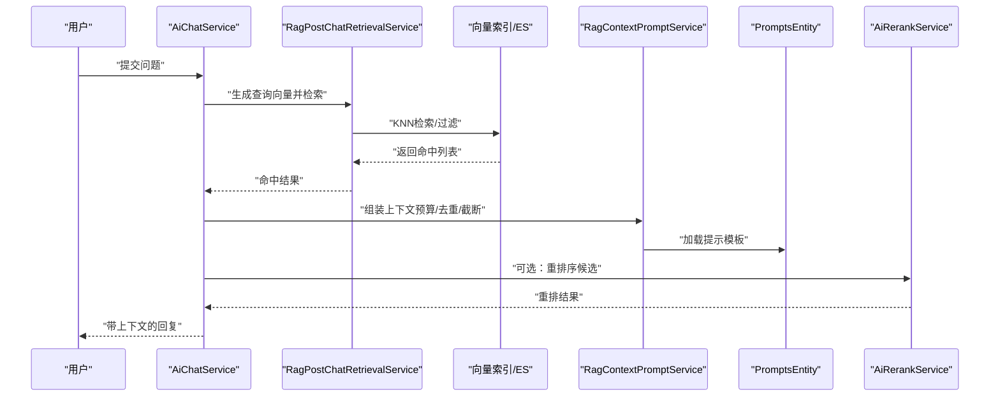
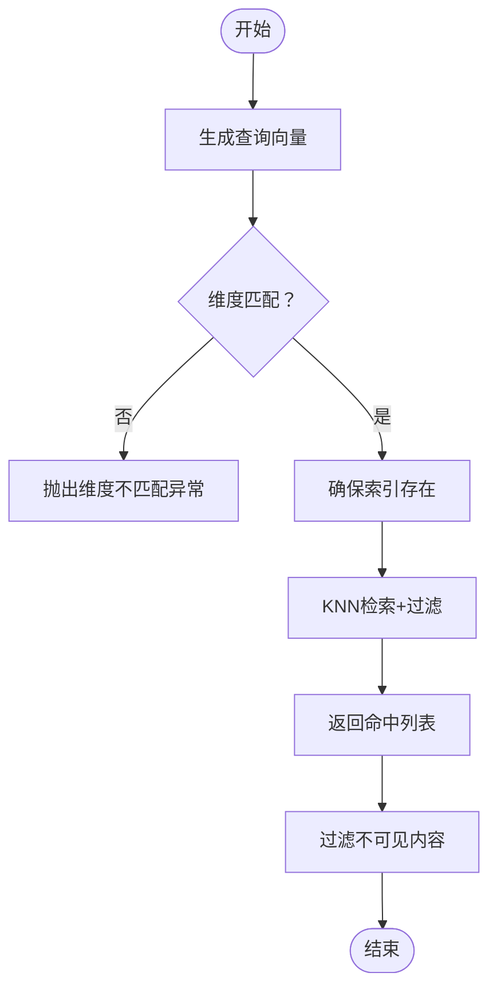
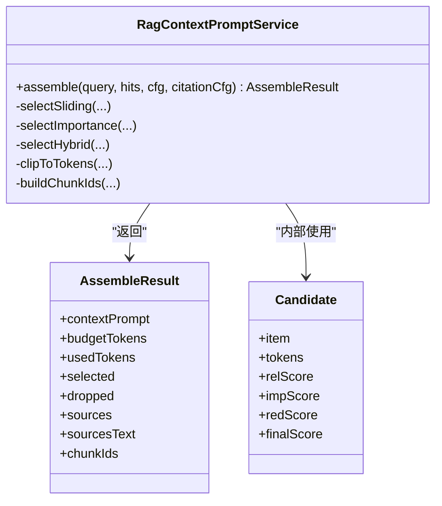
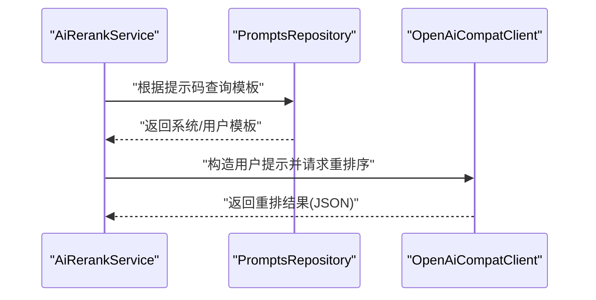
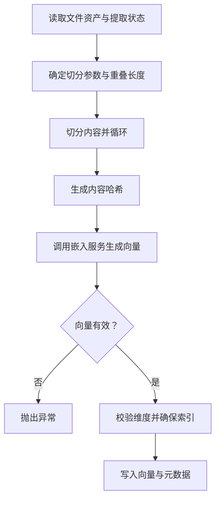
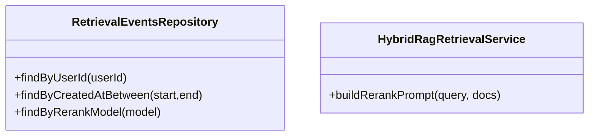
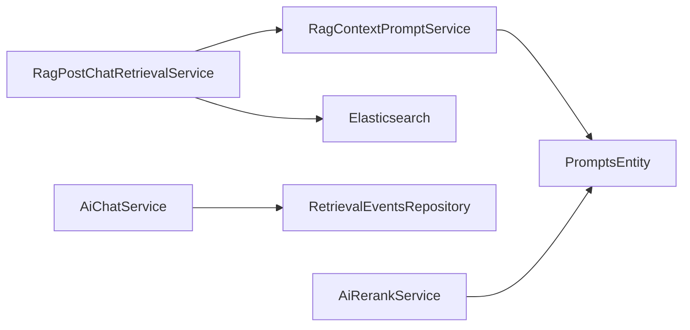
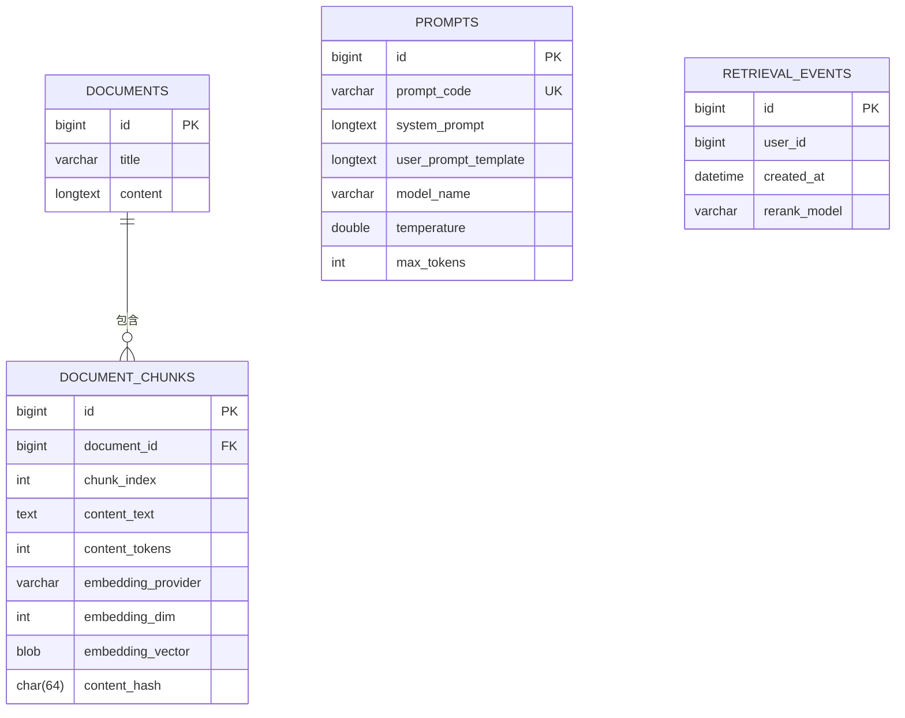

# 语义处理

<cite>
**本文引用的文件**
- [AiTokenizerProperties.java](file://src/main/java/com/example/EnterpriseRagCommunity/config/AiTokenizerProperties.java)
- [PromptsEntity.java](file://src/main/java/com/example/EnterpriseRagCommunity/entity/semantic/PromptsEntity.java)
- [RetrievalEventsRepository.java](file://src/main/java/com/example/EnterpriseRagCommunity/repository/semantic/RetrievalEventsRepository.java)
- [RagPostChatRetrievalService.java](file://src/main/java/com/example/EnterpriseRagCommunity/service/retrieval/RagPostChatRetrievalService.java)
- [RagContextPromptService.java](file://src/main/java/com/example/EnterpriseRagCommunity/service/ai/RagContextPromptService.java)
- [AiChatService.java](file://src/main/java/com/example/EnterpriseRagCommunity/service/ai/AiChatService.java)
- [V1__table_design.sql](file://src/main/resources/db/migration/V1__table_design.sql)
- [RagFileAssetIndexBuildService.java](file://src/main/java/com/example/EnterpriseRagCommunity/service/retrieval/RagFileAssetIndexBuildService.java)
- [AiRerankService.java](file://src/main/java/com/example/EnterpriseRagCommunity/service/ai/AiRerankService.java)
- [HybridRagRetrievalService.java](file://src/main/java/com/example/EnterpriseRagCommunity/service/retrieval/HybridRagRetrievalService.java)
- [RagContextPromptServiceUtilityBranchesTest.java](file://src/test/java/com/example/EnterpriseRagCommunity/service/ai/RagContextPromptServiceUtilityBranchesTest.java)
</cite>

## 目录
1. [简介](#简介)
2. [项目结构](#项目结构)
3. [核心组件](#核心组件)
4. [架构总览](#架构总览)
5. [详细组件分析](#详细组件分析)
6. [依赖关系分析](#依赖关系分析)
7. [性能考量](#性能考量)
8. [故障排查指南](#故障排查指南)
9. [结论](#结论)
10. [附录](#附录)

## 简介
本文件面向企业级RAG社区系统中的语义处理能力，围绕文本分词、向量化、文档生成、提示工程、检索事件等核心功能进行系统化说明。重点覆盖以下方面：
- 分词器配置与令牌估算策略
- 向量索引构建与存储结构
- 文档块与上下文组装、提示模板与重排序
- 检索事件记录与回放
- 性能优化、缓存策略与质量评估方法

## 项目结构
语义处理相关代码主要分布在以下层次：
- 配置层：分词器参数等
- 实体层：提示模板、检索事件、文档块等
- 服务层：检索、上下文组装、重排序、聊天集成
- 数据层：数据库迁移脚本定义文档块与索引字段
- 测试层：覆盖上下文组装工具函数的关键分支

**图表来源**
- [AiTokenizerProperties.java:1-14](file://src/main/java/com/example/EnterpriseRagCommunity/config/AiTokenizerProperties.java#L1-L14)
- [PromptsEntity.java:1-104](file://src/main/java/com/example/EnterpriseRagCommunity/entity/semantic/PromptsEntity.java#L1-L104)
- [RetrievalEventsRepository.java:1-22](file://src/main/java/com/example/EnterpriseRagCommunity/repository/semantic/RetrievalEventsRepository.java#L1-L22)
- [RagPostChatRetrievalService.java:1-187](file://src/main/java/com/example/EnterpriseRagCommunity/service/retrieval/RagPostChatRetrievalService.java#L1-L187)
- [RagContextPromptService.java:1-800](file://src/main/java/com/example/EnterpriseRagCommunity/service/ai/RagContextPromptService.java#L1-L800)
- [AiRerankService.java:301-326](file://src/main/java/com/example/EnterpriseRagCommunity/service/ai/AiRerankService.java#L301-L326)
- [RagFileAssetIndexBuildService.java:293-543](file://src/main/java/com/example/EnterpriseRagCommunity/service/retrieval/RagFileAssetIndexBuildService.java#L293-L543)
- [HybridRagRetrievalService.java:523-545](file://src/main/java/com/example/EnterpriseRagCommunity/service/retrieval/HybridRagRetrievalService.java#L523-L545)
- [AiChatService.java:1177-1201](file://src/main/java/com/example/EnterpriseRagCommunity/service/ai/AiChatService.java#L1177-L1201)
- [V1__table_design.sql:380-395](file://src/main/resources/db/migration/V1__table_design.sql#L380-L395)

**章节来源**
- [AiTokenizerProperties.java:1-14](file://src/main/java/com/example/EnterpriseRagCommunity/config/AiTokenizerProperties.java#L1-L14)
- [PromptsEntity.java:1-104](file://src/main/java/com/example/EnterpriseRagCommunity/entity/semantic/PromptsEntity.java#L1-L104)
- [RetrievalEventsRepository.java:1-22](file://src/main/java/com/example/EnterpriseRagCommunity/repository/semantic/RetrievalEventsRepository.java#L1-L22)
- [RagPostChatRetrievalService.java:1-187](file://src/main/java/com/example/EnterpriseRagCommunity/service/retrieval/RagPostChatRetrievalService.java#L1-L187)
- [RagContextPromptService.java:1-800](file://src/main/java/com/example/EnterpriseRagCommunity/service/ai/RagContextPromptService.java#L1-L800)
- [AiRerankService.java:301-326](file://src/main/java/com/example/EnterpriseRagCommunity/service/ai/AiRerankService.java#L301-L326)
- [RagFileAssetIndexBuildService.java:293-543](file://src/main/java/com/example/EnterpriseRagCommunity/service/retrieval/RagFileAssetIndexBuildService.java#L293-L543)
- [HybridRagRetrievalService.java:523-545](file://src/main/java/com/example/EnterpriseRagCommunity/service/retrieval/HybridRagRetrievalService.java#L523-L545)
- [AiChatService.java:1177-1201](file://src/main/java/com/example/EnterpriseRagCommunity/service/ai/AiChatService.java#L1177-L1201)
- [V1__table_design.sql:380-395](file://src/main/resources/db/migration/V1__table_design.sql#L380-L395)

## 核心组件
- 分词与令牌估算
  - 分词器配置项集中于配置类，便于统一管理与注入。
  - 上下文组装服务内置近似令牌估算与截断逻辑，支持按预算与策略选择上下文。
- 向量索引与文档块
  - 数据库存储文档分片与嵌入，支持全文索引与唯一约束，确保去重与高效检索。
  - 文件资产索引构建服务负责切分、嵌入、维度校验与写入索引。
- 提示工程与重排序
  - 提示模板实体承载系统提示与用户模板，支持多模态参数。
  - 重排序服务通过提示模板与LLM完成候选排序，支持附加说明与输出格式约束。
- 检索事件
  - 检索事件仓库提供按用户、时间与参数过滤的查询能力，支撑审计与复盘。

**章节来源**
- [AiTokenizerProperties.java:1-14](file://src/main/java/com/example/EnterpriseRagCommunity/config/AiTokenizerProperties.java#L1-L14)
- [RagContextPromptService.java:1-800](file://src/main/java/com/example/EnterpriseRagCommunity/service/ai/RagContextPromptService.java#L1-L800)
- [V1__table_design.sql:380-395](file://src/main/resources/db/migration/V1__table_design.sql#L380-L395)
- [RagFileAssetIndexBuildService.java:293-543](file://src/main/java/com/example/EnterpriseRagCommunity/service/retrieval/RagFileAssetIndexBuildService.java#L293-L543)
- [PromptsEntity.java:1-104](file://src/main/java/com/example/EnterpriseRagCommunity/entity/semantic/PromptsEntity.java#L1-L104)
- [AiRerankService.java:301-326](file://src/main/java/com/example/EnterpriseRagCommunity/service/ai/AiRerankService.java#L301-L326)
- [RetrievalEventsRepository.java:1-22](file://src/main/java/com/example/EnterpriseRagCommunity/repository/semantic/RetrievalEventsRepository.java#L1-L22)

## 架构总览
语义处理端到端流程包括：输入查询经嵌入生成向量，查询向量在向量索引中检索，返回命中后由上下文组装服务裁剪与去重，随后进入提示工程与生成阶段，并记录检索事件以供后续审计与优化。

**图表来源**
- [AiChatService.java:1177-1201](file://src/main/java/com/example/EnterpriseRagCommunity/service/ai/AiChatService.java#L1177-L1201)
- [RagPostChatRetrievalService.java:40-88](file://src/main/java/com/example/EnterpriseRagCommunity/service/retrieval/RagPostChatRetrievalService.java#L40-L88)
- [RagContextPromptService.java:32-357](file://src/main/java/com/example/EnterpriseRagCommunity/service/ai/RagContextPromptService.java#L32-L357)
- [PromptsEntity.java:1-104](file://src/main/java/com/example/EnterpriseRagCommunity/entity/semantic/PromptsEntity.java#L1-L104)
- [AiRerankService.java:301-326](file://src/main/java/com/example/EnterpriseRagCommunity/service/ai/AiRerankService.java#L301-L326)

## 详细组件分析

### 组件A：问答检索与向量索引
- 功能要点
  - 将查询文本嵌入为向量，校验维度一致性，确保索引存在后执行KNN检索。
  - 过滤不可见内容（如非公开帖子），保证检索结果合规。
  - 支持按版块过滤与构建查询体，兼容多ES节点与API Key鉴权。
- 关键数据结构
  - 命中对象包含文档ID、分数、帖子ID、分片索引、标题与正文文本等。
- 性能与可靠性
  - 连接与读取超时控制，错误路径抛出明确异常信息。
  - 维度不匹配时直接失败，避免后续处理成本。

**图表来源**
- [RagPostChatRetrievalService.java:40-88](file://src/main/java/com/example/EnterpriseRagCommunity/service/retrieval/RagPostChatRetrievalService.java#L40-L88)
- [RagPostChatRetrievalService.java:114-147](file://src/main/java/com/example/EnterpriseRagCommunity/service/retrieval/RagPostChatRetrievalService.java#L114-L147)

**章节来源**
- [RagPostChatRetrievalService.java:1-187](file://src/main/java/com/example/EnterpriseRagCommunity/service/retrieval/RagPostChatRetrievalService.java#L1-L187)

### 组件B：上下文组装与提示工程
- 功能要点
  - 支持多种上下文窗口策略（TOPK、SLIDING、IMPORTANCE、HYBRID），按预算与去重规则选择最佳片段。
  - 内置近似令牌估算、按策略截断、标题/内容去重、跨来源去重、同文章数量上限等机制。
  - 可选添加引用说明与来源清单，支持多种渲染模式。
- 关键数据结构
  - 组装结果包含上下文提示、预算/使用令牌、选中/丢弃项、引用来源与统计信息。
  - 候选与选择状态封装了去重集合与计数，便于滑动/贪心选择。
- 质量保障
  - 单元测试覆盖空集、空白、最大项限制等边界分支，提升鲁棒性。

**图表来源**
- [RagContextPromptService.java:32-357](file://src/main/java/com/example/EnterpriseRagCommunity/service/ai/RagContextPromptService.java#L32-L357)
- [RagContextPromptService.java:359-385](file://src/main/java/com/example/EnterpriseRagCommunity/service/ai/RagContextPromptService.java#L359-L385)
- [RagContextPromptService.java:387-588](file://src/main/java/com/example/EnterpriseRagCommunity/service/ai/RagContextPromptService.java#L387-L588)

**章节来源**
- [RagContextPromptService.java:1-800](file://src/main/java/com/example/EnterpriseRagCommunity/service/ai/RagContextPromptService.java#L1-L800)
- [RagContextPromptServiceUtilityBranchesTest.java:17-36](file://src/test/java/com/example/EnterpriseRagCommunity/service/ai/RagContextPromptServiceUtilityBranchesTest.java#L17-L36)

### 组件C：提示模板与重排序
- 提示模板
  - 提示模板实体包含系统提示、用户模板、模型参数（温度、采样、最大令牌等）、多模态参数与变量等。
- 重排序
  - 通过默认提示码加载系统提示，支持附加说明，构造用户提示并调用兼容客户端完成重排序，严格JSON输出格式约束。

**图表来源**
- [AiRerankService.java:301-326](file://src/main/java/com/example/EnterpriseRagCommunity/service/ai/AiRerankService.java#L301-L326)
- [PromptsEntity.java:1-104](file://src/main/java/com/example/EnterpriseRagCommunity/entity/semantic/PromptsEntity.java#L1-L104)

**章节来源**
- [PromptsEntity.java:1-104](file://src/main/java/com/example/EnterpriseRagCommunity/entity/semantic/PromptsEntity.java#L1-L104)
- [AiRerankService.java:301-326](file://src/main/java/com/example/EnterpriseRagCommunity/service/ai/AiRerankService.java#L301-L326)

### 组件D：文档块与向量索引构建
- 文档块表结构
  - 包含文档ID、分片序号、文本内容、令牌计数、嵌入提供方/维度、向量数据、内容哈希与外键约束。
- 索引构建流程
  - 切分文件内容，计算内容哈希，调用嵌入服务生成向量，校验维度，确保索引存在并写入向量字段。

**图表来源**
- [V1__table_design.sql:380-395](file://src/main/resources/db/migration/V1__table_design.sql#L380-L395)
- [RagFileAssetIndexBuildService.java:461-543](file://src/main/java/com/example/EnterpriseRagCommunity/service/retrieval/RagFileAssetIndexBuildService.java#L461-L543)

**章节来源**
- [V1__table_design.sql:380-395](file://src/main/resources/db/migration/V1__table_design.sql#L380-L395)
- [RagFileAssetIndexBuildService.java:293-543](file://src/main/java/com/example/EnterpriseRagCommunity/service/retrieval/RagFileAssetIndexBuildService.java#L293-L543)

### 组件E：检索事件与混合检索
- 检索事件
  - 事件实体与仓库提供按用户、时间范围与重排序模型等条件的查询能力，用于审计与复盘。
- 混合检索
  - 构建重排序提示时，将查询与候选文档拼接为严格JSON输出格式的用户提示，便于LLM稳定输出。

**图表来源**
- [RetrievalEventsRepository.java:1-22](file://src/main/java/com/example/EnterpriseRagCommunity/repository/semantic/RetrievalEventsRepository.java#L1-L22)
- [HybridRagRetrievalService.java:523-545](file://src/main/java/com/example/EnterpriseRagCommunity/service/retrieval/HybridRagRetrievalService.java#L523-L545)

**章节来源**
- [RetrievalEventsRepository.java:1-22](file://src/main/java/com/example/EnterpriseRagCommunity/repository/semantic/RetrievalEventsRepository.java#L1-L22)
- [HybridRagRetrievalService.java:523-545](file://src/main/java/com/example/EnterpriseRagCommunity/service/retrieval/HybridRagRetrievalService.java#L523-L545)

## 依赖关系分析
- 组件耦合
  - 问答检索服务依赖嵌入网关与索引服务，输出命中结果给上下文组装服务。
  - 上下文组装服务依赖提示模板实体与检索命中，输出系统提示给聊天服务。
  - 聊天服务在收到命中后写入检索事件，便于后续审计。
- 外部依赖
  - Elasticsearch作为向量索引后端，支持KNN检索与过滤。
  - 提示模板通过仓库查询，确保系统提示与用户模板的一致性。

**图表来源**
- [RagPostChatRetrievalService.java:1-187](file://src/main/java/com/example/EnterpriseRagCommunity/service/retrieval/RagPostChatRetrievalService.java#L1-L187)
- [RagContextPromptService.java:1-800](file://src/main/java/com/example/EnterpriseRagCommunity/service/ai/RagContextPromptService.java#L1-L800)
- [PromptsEntity.java:1-104](file://src/main/java/com/example/EnterpriseRagCommunity/entity/semantic/PromptsEntity.java#L1-L104)
- [AiChatService.java:1177-1201](file://src/main/java/com/example/EnterpriseRagCommunity/service/ai/AiChatService.java#L1177-L1201)
- [RetrievalEventsRepository.java:1-22](file://src/main/java/com/example/EnterpriseRagCommunity/repository/semantic/RetrievalEventsRepository.java#L1-L22)
- [AiRerankService.java:301-326](file://src/main/java/com/example/EnterpriseRagCommunity/service/ai/AiRerankService.java#L301-L326)

**章节来源**
- [AiChatService.java:1177-1201](file://src/main/java/com/example/EnterpriseRagCommunity/service/ai/AiChatService.java#L1177-L1201)
- [RagPostChatRetrievalService.java:1-187](file://src/main/java/com/example/EnterpriseRagCommunity/service/retrieval/RagPostChatRetrievalService.java#L1-L187)
- [RagContextPromptService.java:1-800](file://src/main/java/com/example/EnterpriseRagCommunity/service/ai/RagContextPromptService.java#L1-L800)
- [PromptsEntity.java:1-104](file://src/main/java/com/example/EnterpriseRagCommunity/entity/semantic/PromptsEntity.java#L1-L104)
- [RetrievalEventsRepository.java:1-22](file://src/main/java/com/example/EnterpriseRagCommunity/repository/semantic/RetrievalEventsRepository.java#L1-L22)
- [AiRerankService.java:301-326](file://src/main/java/com/example/EnterpriseRagCommunity/service/ai/AiRerankService.java#L301-L326)

## 性能考量
- 向量检索
  - 控制num_candidates与k的比例，避免过度候选带来的延迟。
  - 使用连接/读取超时与HTTP状态检查，防止ES异常阻塞。
- 上下文组装
  - 通过预算令牌与每项最大令牌限制，避免超过模型上下文窗口。
  - 去重策略减少冗余，提升信息密度。
- 索引构建
  - 切分与重叠参数影响召回与存储，需结合业务权衡。
  - 维度校验提前失败，避免无效写入。
- 缓存策略
  - 对热点查询向量与常用提示模板进行缓存，降低重复计算与网络开销。
  - 对ES查询结果进行短期缓存，减少重复检索压力。
- 质量评估
  - 通过检索事件统计命中分布、重排序前后差异与用户反馈，持续迭代策略参数与提示模板。

[本节为通用指导，无需列出具体文件来源]

## 故障排查指南
- 嵌入维度不匹配
  - 现象：检索前维度校验失败。
  - 排查：确认配置的嵌入维度与实际嵌入长度一致。
  - 参考：检索服务中的维度校验与异常抛出。
- ES检索异常
  - 现象：HTTP错误或无响应。
  - 排查：检查ES地址、API Key、超时设置与网络连通性。
  - 参考：检索服务的ES搜索实现与异常处理。
- 上下文组装异常
  - 现象：组装结果为空或预算不足。
  - 排查：调整预算令牌、每项最大令牌与去重策略，检查输入命中是否有效。
  - 参考：上下文组装服务的策略与截断逻辑。
- 重排序失败
  - 现象：提示模板缺失或输出格式不符合预期。
  - 排查：确认提示码存在且系统提示模板完整，输出格式约束严格。
  - 参考：重排序服务的模板加载与提示构造。

**章节来源**
- [RagPostChatRetrievalService.java:54-66](file://src/main/java/com/example/EnterpriseRagCommunity/service/retrieval/RagPostChatRetrievalService.java#L54-L66)
- [RagPostChatRetrievalService.java:114-147](file://src/main/java/com/example/EnterpriseRagCommunity/service/retrieval/RagPostChatRetrievalService.java#L114-L147)
- [RagContextPromptService.java:58-62](file://src/main/java/com/example/EnterpriseRagCommunity/service/ai/RagContextPromptService.java#L58-L62)
- [AiRerankService.java:301-326](file://src/main/java/com/example/EnterpriseRagCommunity/service/ai/AiRerankService.java#L301-L326)

## 结论
本系统通过“查询向量—KNN检索—上下文组装—提示工程—生成”的流水线，实现了可配置、可审计、可优化的企业级语义处理能力。建议在生产环境中结合业务场景持续调优上下文策略、提示模板与重排序参数，并完善缓存与监控体系以保障性能与稳定性。

[本节为总结性内容，无需列出具体文件来源]

## 附录

### 数据模型图（文档块与检索事件）

**图表来源**
- [V1__table_design.sql:380-395](file://src/main/resources/db/migration/V1__table_design.sql#L380-L395)
- [PromptsEntity.java:1-104](file://src/main/java/com/example/EnterpriseRagCommunity/entity/semantic/PromptsEntity.java#L1-L104)
- [RetrievalEventsRepository.java:1-22](file://src/main/java/com/example/EnterpriseRagCommunity/repository/semantic/RetrievalEventsRepository.java#L1-L22)

### API接口规范（基于现有实现的语义处理相关接口）
- 分词查询
  - 入口：分词器配置类提供参数入口，便于统一注入与管理。
  - 适用：外部系统可通过该配置对接分词服务。
  - 参考：分词器配置类。
- 向量生成
  - 入口：检索服务在问答流程中调用嵌入生成查询向量。
  - 输出：向量数组与维度信息，用于KNN检索。
  - 参考：检索服务的嵌入调用与维度校验。
- 文档处理
  - 入口：文件资产索引构建服务负责切分、嵌入、维度校验与写入。
  - 输出：文档分片与向量数据入库。
  - 参考：索引构建服务的切分与写入流程。
- 提示管理
  - 入口：提示模板实体与仓库提供系统提示与用户模板的持久化与查询。
  - 输出：系统提示与用户模板，支持多模态参数。
  - 参考：提示模板实体与重排序服务的模板加载。

**章节来源**
- [AiTokenizerProperties.java:1-14](file://src/main/java/com/example/EnterpriseRagCommunity/config/AiTokenizerProperties.java#L1-L14)
- [RagPostChatRetrievalService.java:44-66](file://src/main/java/com/example/EnterpriseRagCommunity/service/retrieval/RagPostChatRetrievalService.java#L44-L66)
- [RagFileAssetIndexBuildService.java:527-543](file://src/main/java/com/example/EnterpriseRagCommunity/service/retrieval/RagFileAssetIndexBuildService.java#L527-L543)
- [PromptsEntity.java:1-104](file://src/main/java/com/example/EnterpriseRagCommunity/entity/semantic/PromptsEntity.java#L1-L104)
- [AiRerankService.java:301-326](file://src/main/java/com/example/EnterpriseRagCommunity/service/ai/AiRerankService.java#L301-L326)