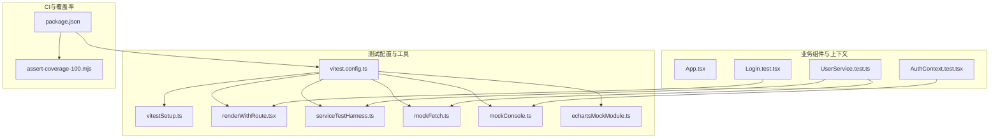
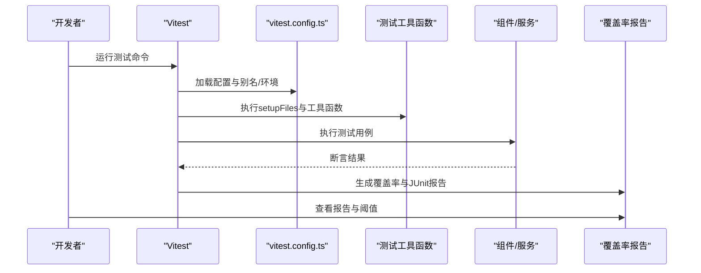
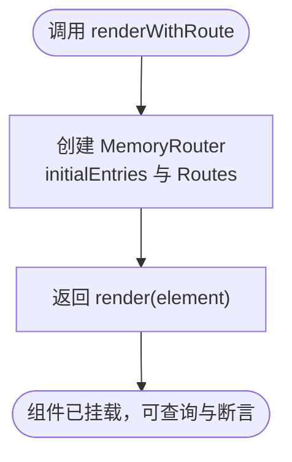
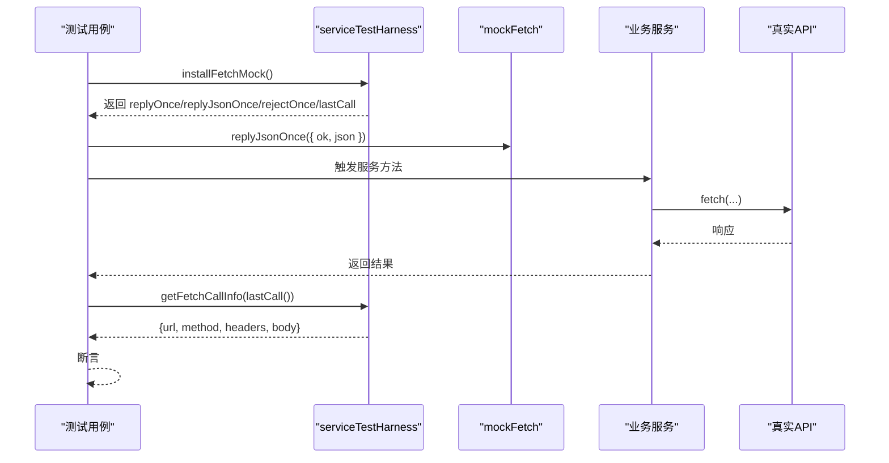
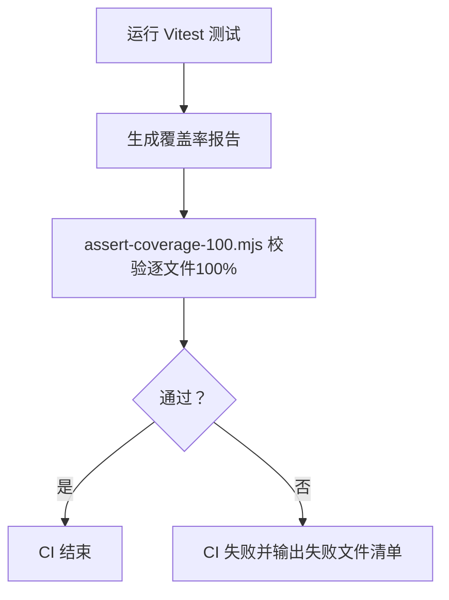
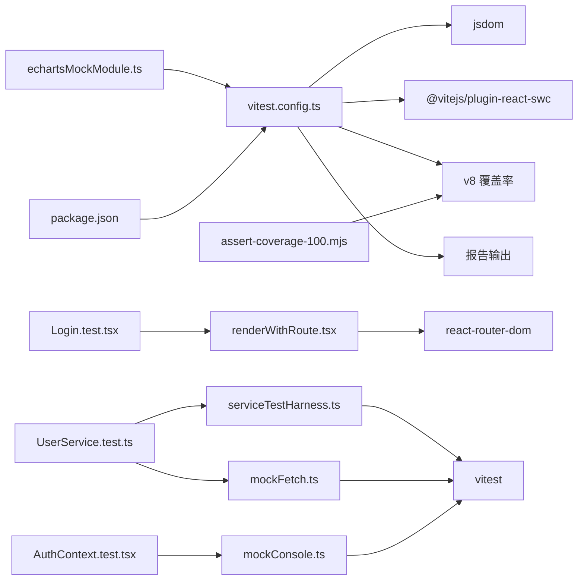

# UI测试

<cite>
**本文引用的文件**
- [vitest.config.ts](file://my-vite-app/vitest.config.ts)
- [package.json](file://my-vite-app/package.json)
- [vitestSetup.ts](file://my-vite-app/src/testUtils/vitestSetup.ts)
- [renderWithRoute.tsx](file://my-vite-app/src/testUtils/renderWithRoute.tsx)
- [renderWithRoute.example.test.tsx](file://my-vite-app/src/testUtils/renderWithRoute.example.test.tsx)
- [serviceTestHarness.ts](file://my-vite-app/src/testUtils/serviceTestHarness.ts)
- [mockFetch.ts](file://my-vite-app/src/testUtils/mockFetch.ts)
- [mockConsole.ts](file://my-vite-app/src/testUtils/mockConsole.ts)
- [echartsMockModule.ts](file://my-vite-app/src/testUtils/echartsMockModule.ts)
- [Login.test.tsx](file://my-vite-app/src/components/login/Login.test.tsx)
- [UserService.test.ts](file://my-vite-app/src/services/UserService.test.ts)
- [AuthContext.test.tsx](file://my-vite-app/src/contexts/AuthContext.test.tsx)
- [App.tsx](file://my-vite-app/src/App.tsx)
- [assert-coverage-100.mjs](file://my-vite-app/scripts/assert-coverage-100.mjs)
</cite>

## 目录
1. [引言](#引言)
2. [项目结构](#项目结构)
3. [核心组件](#核心组件)
4. [架构总览](#架构总览)
5. [详细组件分析](#详细组件分析)
6. [依赖关系分析](#依赖关系分析)
7. [性能考量](#性能考量)
8. [故障排查指南](#故障排查指南)
9. [结论](#结论)
10. [附录](#附录)

## 引言
本文件面向React前端应用的UI测试，系统性阐述基于Vitest的测试体系与最佳实践。内容覆盖测试环境配置、测试工具函数、组件测试策略（快照、交互、渲染验证）、Mock策略（API、路由、状态管理）、覆盖率与CI集成、以及端到端测试思路与测试数据管理。目标是帮助开发者在不牺牲可维护性的前提下，构建稳定、可读、可扩展的前端测试体系。

## 项目结构
- 测试运行器与配置集中在Vite应用目录中，采用Vitest作为核心测试框架，JSDOM作为DOM环境，支持TypeScript与React组件测试。
- 测试工具函数集中于src/testUtils，提供路由渲染、Fetch Mock、控制台Mock、ECharts兼容等通用能力。
- 组件与服务均配套单元测试，覆盖交互流程、错误处理、参数构造与HTTP调用细节。
- CI脚本通过自定义Node脚本对覆盖率进行严格校验，确保逐文件100%覆盖。

**图表来源**
- [vitest.config.ts:1-43](file://my-vite-app/vitest.config.ts#L1-L43)
- [vitestSetup.ts:1-10](file://my-vite-app/src/testUtils/vitestSetup.ts#L1-L10)
- [renderWithRoute.tsx:1-23](file://my-vite-app/src/testUtils/renderWithRoute.tsx#L1-L23)
- [serviceTestHarness.ts:1-58](file://my-vite-app/src/testUtils/serviceTestHarness.ts#L1-L58)
- [mockFetch.ts:1-138](file://my-vite-app/src/testUtils/mockFetch.ts#L1-L138)
- [mockConsole.ts:1-20](file://my-vite-app/src/testUtils/mockConsole.ts#L1-L20)
- [echartsMockModule.ts:1-35](file://my-vite-app/src/testUtils/echartsMockModule.ts#L1-L35)
- [Login.test.tsx:1-624](file://my-vite-app/src/components/login/Login.test.tsx#L1-L624)
- [AuthContext.test.tsx:1-212](file://my-vite-app/src/contexts/AuthContext.test.tsx#L1-L212)
- [UserService.test.ts:1-200](file://my-vite-app/src/services/UserService.test.ts#L1-L200)
- [App.tsx:1-352](file://my-vite-app/src/App.tsx#L1-L352)
- [package.json:1-82](file://my-vite-app/package.json#L1-L82)
- [assert-coverage-100.mjs:1-119](file://my-vite-app/scripts/assert-coverage-100.mjs#L1-L119)

**章节来源**
- [vitest.config.ts:1-43](file://my-vite-app/vitest.config.ts#L1-L43)
- [package.json:1-82](file://my-vite-app/package.json#L1-L82)

## 核心组件
- 测试环境与覆盖率
  - 使用JSDOM作为DOM环境，启用v8覆盖率收集，输出文本、JSON摘要与HTML报告，并将报告写入指定目录。
  - 排除测试文件、类型声明、静态资源与入口文件，阈值设为0以聚焦功能覆盖而非强制达标。
- 测试工具函数
  - 渲染路由包装：renderWithRoute提供MemoryRouter与Routes封装，便于在测试中挂载带路由参数的页面组件。
  - Fetch Mock：serviceTestHarness与mockFetch提供统一的fetch替身、一次性响应、队列响应、调用信息提取等能力。
  - 控制台Mock：mockConsole用于屏蔽或捕获console.warn/error等日志，便于断言副作用。
  - ECharts兼容：echartsMockModule提供最小化ECharts实例，避免图表渲染对测试造成干扰。
- 路由与上下文
  - App.tsx定义了完整的路由树与权限控制，测试需覆盖受保护路由、权限判定与兜底行为。

**章节来源**
- [vitest.config.ts:12-41](file://my-vite-app/vitest.config.ts#L12-L41)
- [vitestSetup.ts:1-10](file://my-vite-app/src/testUtils/vitestSetup.ts#L1-L10)
- [renderWithRoute.tsx:1-23](file://my-vite-app/src/testUtils/renderWithRoute.tsx#L1-L23)
- [serviceTestHarness.ts:1-58](file://my-vite-app/src/testUtils/serviceTestHarness.ts#L1-L58)
- [mockFetch.ts:1-138](file://my-vite-app/src/testUtils/mockFetch.ts#L1-L138)
- [mockConsole.ts:1-20](file://my-vite-app/src/testUtils/mockConsole.ts#L1-L20)
- [echartsMockModule.ts:1-35](file://my-vite-app/src/testUtils/echartsMockModule.ts#L1-L35)
- [App.tsx:104-323](file://my-vite-app/src/App.tsx#L104-L323)

## 架构总览
下图展示了测试运行时的关键交互：测试脚本通过Vitest执行，依赖测试工具函数进行渲染、Mock与断言；覆盖率由v8收集并生成报告；CI脚本对覆盖率进行最终校验。

**图表来源**
- [vitest.config.ts:12-41](file://my-vite-app/vitest.config.ts#L12-L41)
- [package.json:6-12](file://my-vite-app/package.json#L6-L12)

## 详细组件分析

### 测试环境与覆盖率配置
- 环境与插件
  - 环境：jsdom
  - 插件：@vitejs/plugin-react-swc
  - 别名：echarts指向测试兼容模块
- 包含与设置
  - 包含src下所有.test.(ts|tsx)文件
  - setupFiles在测试前创建报告目录
- 报告与覆盖率
  - 输出格式：默认、JUnit
  - 覆盖率提供者：v8
  - 报告目录：test-reports/vitest-coverage
  - 排除规则：测试文件、类型声明、静态资源、页面、入口等
  - 阈值：全部设为0，避免强制达标带来的反效果

**章节来源**
- [vitest.config.ts:12-41](file://my-vite-app/vitest.config.ts#L12-L41)
- [vitestSetup.ts:1-10](file://my-vite-app/src/testUtils/vitestSetup.ts#L1-L10)

### 路由渲染工具：renderWithRoute
- 功能要点
  - 封装MemoryRouter与Routes，支持传入初始路由与匹配路径
  - 返回Testing Library的render结果，便于查询与断言
- 使用示例
  - 在示例测试中演示了参数解析、路径匹配与查询字符串断言

**图表来源**
- [renderWithRoute.tsx:5-21](file://my-vite-app/src/testUtils/renderWithRoute.tsx#L5-L21)
- [renderWithRoute.example.test.tsx:23-38](file://my-vite-app/src/testUtils/renderWithRoute.example.test.tsx#L23-L38)

**章节来源**
- [renderWithRoute.tsx:1-23](file://my-vite-app/src/testUtils/renderWithRoute.tsx#L1-L23)
- [renderWithRoute.example.test.tsx:1-40](file://my-vite-app/src/testUtils/renderWithRoute.example.test.tsx#L1-L40)

### API调用Mock：serviceTestHarness 与 mockFetch
- 统一入口
  - installFetchMock：安装全局fetch替身，返回replyOnce/replyJsonOnce/rejectOnce/lastCall等辅助方法
  - resetServiceTest：重置所有mock与模块，避免跨用例污染
  - getFetchCallInfo：从最后一次调用中提取URL、方法、头与请求体
- 辅助工具
  - mockFetch系列：createMockResponse、mockFetchQueue等，支持一次性与队列式响应
- 典型用法
  - 在服务测试中，先installFetchMock，再replyJsonOnce构造响应，最后断言URL、方法、头与body

**图表来源**
- [serviceTestHarness.ts:18-58](file://my-vite-app/src/testUtils/serviceTestHarness.ts#L18-L58)
- [mockFetch.ts:31-138](file://my-vite-app/src/testUtils/mockFetch.ts#L31-L138)
- [UserService.test.ts:25-122](file://my-vite-app/src/services/UserService.test.ts#L25-L122)

**章节来源**
- [serviceTestHarness.ts:1-58](file://my-vite-app/src/testUtils/serviceTestHarness.ts#L1-L58)
- [mockFetch.ts:1-138](file://my-vite-app/src/testUtils/mockFetch.ts#L1-L138)
- [UserService.test.ts:1-200](file://my-vite-app/src/services/UserService.test.ts#L1-L200)

### 控制台副作用Mock：mockConsole
- 作用
  - 屏蔽或spy console.warn/error等方法，避免测试输出干扰与噪声
- 使用场景
  - 在AuthContext测试中，对错误日志进行Mock，确保断言可控

**章节来源**
- [mockConsole.ts:1-20](file://my-vite-app/src/testUtils/mockConsole.ts#L1-L20)
- [AuthContext.test.tsx:56-60](file://my-vite-app/src/contexts/AuthContext.test.tsx#L56-L60)

### ECharts兼容Mock
- 作用
  - 提供最小化的ECharts实例，避免图表渲染对测试的影响
- 使用场景
  - 在组件测试中，当组件内部使用ECharts时，通过别名替换为测试模块

**章节来源**
- [echartsMockModule.ts:1-35](file://my-vite-app/src/testUtils/echartsMockModule.ts#L1-L35)
- [vitest.config.ts:8-10](file://my-vite-app/vitest.config.ts#L8-L10)

### 组件测试策略
- 快照测试
  - 建议对稳定UI进行快照对比，防止回归。可在组件渲染后使用screen.getByRole等定位器进行选择性快照。
- 交互测试
  - 使用fireEvent与用户事件库触发交互，断言状态变化与副作用。
- 渲染验证
  - 通过Testing Library的查询API断言可见性、文案与属性。

示例参考：
- Login组件测试覆盖了CSRF令牌缺失、登录成功、注册链接可见性、2FA流程、验证码重发与冷却等复杂交互。
- AuthContext测试覆盖了Provider外使用、认证状态刷新、TOTP策略与并发刷新去重等边界情况。

**章节来源**
- [Login.test.tsx:149-624](file://my-vite-app/src/components/login/Login.test.tsx#L149-L624)
- [AuthContext.test.tsx:47-212](file://my-vite-app/src/contexts/AuthContext.test.tsx#L47-L212)

### 路由与权限Mock
- 路由Mock
  - 使用renderWithRoute在测试中挂载带参数的页面组件，断言参数解析与路径匹配。
- 权限Mock
  - 在路由层，App.tsx通过RequireAccess/RequirePermission等组件实现权限控制，测试中可通过上下文或服务Mock模拟权限状态。

**章节来源**
- [renderWithRoute.tsx:1-23](file://my-vite-app/src/testUtils/renderWithRoute.tsx#L1-L23)
- [App.tsx:104-323](file://my-vite-app/src/App.tsx#L104-L323)

### 状态管理Mock
- 上下文Mock
  - 在AuthContext测试中，通过vi.mock对相关服务进行Mock，断言useAuth的行为与副作用。
- 全局状态
  - 对localStorage等全局副作用进行清理与断言，确保测试隔离。

**章节来源**
- [AuthContext.test.tsx:6-21](file://my-vite-app/src/contexts/AuthContext.test.tsx#L6-L21)
- [Login.test.tsx:150-161](file://my-vite-app/src/components/login/Login.test.tsx#L150-L161)

### 测试覆盖率要求与CI集成
- 覆盖率配置
  - v8提供者，输出text、json-summary、html报告
  - 排除测试、类型、静态资源与入口文件
  - 阈值设为0，避免强制达标
- CI脚本
  - 在CI中运行测试并生成覆盖率
  - 使用assert-coverage-100.mjs对src下逐文件进行100%校验（Lines/Branches/Functions/Statements）
  - 通过Node脚本修复Istanbul索引问题与变更文件覆盖率检查

**图表来源**
- [package.json:11-12](file://my-vite-app/package.json#L11-L12)
- [assert-coverage-100.mjs:72-116](file://my-vite-app/scripts/assert-coverage-100.mjs#L72-L116)

**章节来源**
- [vitest.config.ts:20-40](file://my-vite-app/vitest.config.ts#L20-L40)
- [package.json:11-12](file://my-vite-app/package.json#L11-L12)
- [assert-coverage-100.mjs:1-119](file://my-vite-app/scripts/assert-coverage-100.mjs#L1-L119)

### 端到端测试与测试数据管理
- 端到端测试
  - 当前仓库主要采用组件级与服务级单元测试。若需引入端到端测试，建议结合Playwright或Cypress，在CI中单独运行，避免与单元测试冲突。
- 测试数据管理
  - 使用Mock数据与工厂函数生成测试输入，确保可重复性与可维护性。
  - 对外部依赖（如API、存储）进行Mock，避免真实依赖影响测试稳定性。

[本节为概念性指导，不直接分析具体文件]

## 依赖关系分析
- 配置依赖
  - vitest.config.ts依赖JSDOM、React插件、覆盖率提供者与报告输出
  - package.json定义测试脚本与依赖版本
- 工具函数依赖
  - renderWithRoute依赖react-router-dom
  - serviceTestHarness与mockFetch依赖vitest
  - mockConsole依赖vitest.spyOn
  - echartsMockModule为别名替换提供兼容实现
- 业务依赖
  - 组件测试依赖App.tsx中的路由与权限控制
  - 服务测试依赖csrfUtils与fetch替身

**图表来源**
- [vitest.config.ts:1-43](file://my-vite-app/vitest.config.ts#L1-L43)
- [renderWithRoute.tsx:1-23](file://my-vite-app/src/testUtils/renderWithRoute.tsx#L1-L23)
- [serviceTestHarness.ts:1-58](file://my-vite-app/src/testUtils/serviceTestHarness.ts#L1-L58)
- [mockFetch.ts:1-138](file://my-vite-app/src/testUtils/mockFetch.ts#L1-L138)
- [mockConsole.ts:1-20](file://my-vite-app/src/testUtils/mockConsole.ts#L1-L20)
- [echartsMockModule.ts:1-35](file://my-vite-app/src/testUtils/echartsMockModule.ts#L1-L35)
- [Login.test.tsx:1-624](file://my-vite-app/src/components/login/Login.test.tsx#L1-L624)
- [AuthContext.test.tsx:1-212](file://my-vite-app/src/contexts/AuthContext.test.tsx#L1-L212)
- [UserService.test.ts:1-200](file://my-vite-app/src/services/UserService.test.ts#L1-L200)
- [package.json:1-82](file://my-vite-app/package.json#L1-L82)
- [assert-coverage-100.mjs:1-119](file://my-vite-app/scripts/assert-coverage-100.mjs#L1-L119)

**章节来源**
- [vitest.config.ts:1-43](file://my-vite-app/vitest.config.ts#L1-L43)
- [package.json:1-82](file://my-vite-app/package.json#L1-L82)

## 性能考量
- 测试隔离
  - 使用resetServiceTest与vi.resetAllMocks确保用例间无状态污染
- DOM与副作用
  - 使用cleanup与unstubAllGlobals避免内存泄漏与全局污染
- 覆盖率成本
  - v8提供者开销较低，建议仅在CI中开启严格校验

[本节为通用指导，不直接分析具体文件]

## 故障排查指南
- 路由断言失败
  - 检查renderWithRoute的route与path配置是否与组件参数一致
- Fetch调用断言失败
  - 使用getFetchCallInfo提取lastCall信息，确认URL、方法、头与body
- 控制台日志影响断言
  - 使用mockConsole屏蔽或捕获console.warn/error
- 覆盖率不达标
  - 使用assert-coverage-100.mjs查看具体文件与指标，逐步补齐测试

**章节来源**
- [renderWithRoute.example.test.tsx:23-38](file://my-vite-app/src/testUtils/renderWithRoute.example.test.tsx#L23-L38)
- [serviceTestHarness.ts:42-58](file://my-vite-app/src/testUtils/serviceTestHarness.ts#L42-L58)
- [mockConsole.ts:1-20](file://my-vite-app/src/testUtils/mockConsole.ts#L1-L20)
- [assert-coverage-100.mjs:88-116](file://my-vite-app/scripts/assert-coverage-100.mjs#L88-L116)

## 结论
本项目以Vitest为核心，结合完善的测试工具函数与Mock策略，实现了对路由、权限、状态管理与API调用的全面覆盖。通过严格的覆盖率校验与CI集成，确保测试质量与可维护性。建议在现有基础上持续完善端到端测试与测试数据管理，进一步提升整体测试体系的完整性与鲁棒性。

## 附录
- 常用命令
  - 本地运行测试：npm run test
  - CI模式运行并生成覆盖率：npm run test:ci
- 关键配置
  - 环境：jsdom
  - 报告：默认、JUnit、HTML
  - 覆盖率：v8，阈值0，输出目录test-reports/vitest-coverage

**章节来源**
- [package.json:6-12](file://my-vite-app/package.json#L6-L12)
- [vitest.config.ts:12-41](file://my-vite-app/vitest.config.ts#L12-L41)