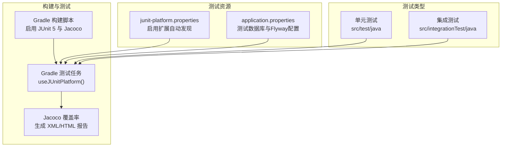
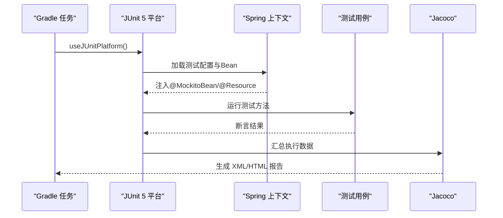
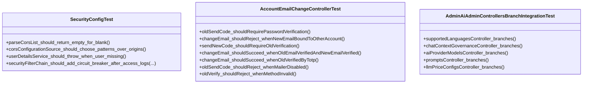
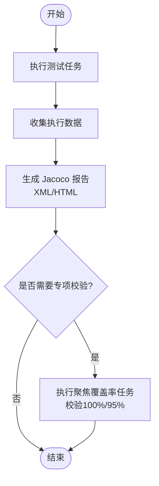
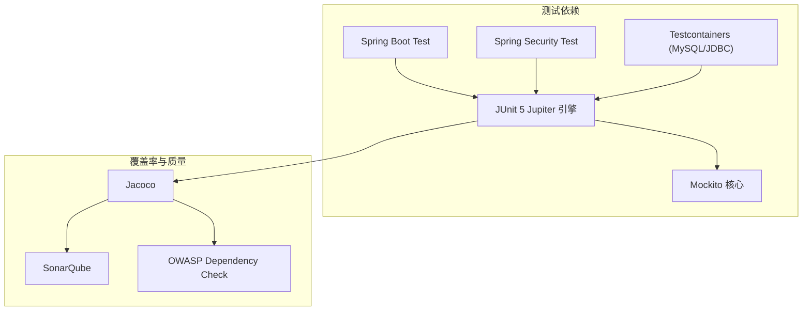

# 单元测试

<cite>
**本文引用的文件**
- [build.gradle](file://build.gradle)
- [settings.gradle](file://settings.gradle)
- [junit-platform.properties](file://src/test/resources/junit-platform.properties)
- [application.properties](file://src/test/resources/application.properties)
- [AccountEmailChangeControllerTest.java](file://src/test/java/com/example/EnterpriseRagCommunity/controller/AccountEmailChangeControllerTest.java)
- [SecurityConfigTest.java](file://src/test/java/com/example/EnterpriseRagCommunity/config/SecurityConfigTest.java)
- [MySQLTestContainerExtension.java](file://src/test/java/com/example/EnterpriseRagCommunity/testsupport/MySQLTestContainerExtension.java)
- [AdminAiAdminControllersBranchIntegrationTest.java](file://src/integrationTest/java/com/example/EnterpriseRagCommunity/controller/ai/admin/AdminAiAdminControllersBranchIntegrationTest.java)
- [UsersServiceBranchCoverageTest.java](file://src/test/java/com/example/EnterpriseRagCommunity/service/access/UsersServiceBranchCoverageTest.java)
</cite>

## 目录
1. [引言](#引言)
2. [项目结构](#项目结构)
3. [核心组件](#核心组件)
4. [架构总览](#架构总览)
5. [详细组件分析](#详细组件分析)
6. [依赖分析](#依赖分析)
7. [性能考虑](#性能考虑)
8. [故障排查指南](#故障排查指南)
9. [结论](#结论)
10. [附录](#附录)

## 引言
本文件面向Java后端服务的单元测试实践，系统性阐述JUnit 5与Mockito在本项目的配置与使用方法，覆盖测试类组织结构、测试方法命名规范、断言策略；详解Service层、Repository层与Controller层的Mock策略；总结边界条件、异常场景与业务逻辑验证的最佳实践；说明测试数据准备、测试夹具与测试工具类的使用；并给出覆盖率要求与测试报告生成方法。

## 项目结构
本项目采用Gradle构建，测试位于标准源集与集成测试源集中，并通过Jacoco生成覆盖率报告。关键测试相关配置如下：
- 测试运行器：JUnit 5平台（Gradle任务中启用）
- 覆盖率：Jacoco，生成XML与HTML报告
- 数据库：测试环境使用MySQL容器扩展，Flyway初始化迁移脚本
- 安全与Web：Spring Security与MockMvc用于控制器测试
- 扩展：JUnit自动发现扩展

图表来源
- [build.gradle:140-146](file://build.gradle#L140-L146)
- [build.gradle:229-267](file://build.gradle#L229-L267)
- [junit-platform.properties:1-2](file://src/test/resources/junit-platform.properties#L1-L2)
- [application.properties:1-21](file://src/test/resources/application.properties#L1-L21)

章节来源
- [build.gradle:140-146](file://build.gradle#L140-L146)
- [build.gradle:229-267](file://build.gradle#L229-L267)
- [junit-platform.properties:1-2](file://src/test/resources/junit-platform.properties#L1-L2)
- [application.properties:1-21](file://src/test/resources/application.properties#L1-L21)

## 核心组件
- JUnit 5配置与使用
  - 在Gradle中通过useJUnitPlatform()启用Jupiter引擎
  - 启用扩展自动发现以支持自定义扩展
- Mockito使用策略
  - 使用@MockitoBean注入Mock到Spring上下文
  - 使用@ExtendWith(MockitoExtension.class)进行纯单元测试
  - 使用when/verify等API进行行为验证与断言
- 测试数据与夹具
  - 使用Testcontainers扩展启动MySQL容器
  - 使用Flyway初始化数据库结构与基础数据
  - 使用MockMvc进行Web层测试
- 覆盖率与报告
  - Jacoco生成XML与HTML报告，支持按类或分支聚焦的专项任务

章节来源
- [build.gradle:122-128](file://build.gradle#L122-L128)
- [build.gradle:140-146](file://build.gradle#L140-L146)
- [build.gradle:229-267](file://build.gradle#L229-L267)
- [MySQLTestContainerExtension.java:1-17](file://src/test/java/com/example/EnterpriseRagCommunity/testsupport/MySQLTestContainerExtension.java#L1-L17)
- [application.properties:1-21](file://src/test/resources/application.properties#L1-L21)

## 架构总览
下图展示测试执行链路：Gradle触发JUnit 5，加载测试资源与Spring上下文，执行测试用例，收集执行数据并由Jacoco生成覆盖率报告。

图表来源
- [build.gradle:140-146](file://build.gradle#L140-L146)
- [build.gradle:229-267](file://build.gradle#L229-L267)

## 详细组件分析

### JUnit 5与测试组织
- 测试类命名规范
  - 单元测试类以“XxxTest”结尾，如SecurityConfigTest
  - 分支覆盖专项测试以“XxxBranchCoverageTest”结尾，如UsersServiceBranchCoverageTest
  - Web切片测试以“XxxController*Test”或“XxxControllerSliceTest”结尾
- 测试方法命名规范
  - 使用“should_行为_条件_期望”的语义化命名，便于阅读与定位
  - 对异常场景使用“shouldThrow_异常类型_when_前置条件”
- 测试资源与扩展
  - junit-platform.properties启用扩展自动发现
  - 测试数据库通过application.properties配置，Flyway自动迁移

章节来源
- [SecurityConfigTest.java:1-205](file://src/test/java/com/example/EnterpriseRagCommunity/config/SecurityConfigTest.java#L1-L205)
- [UsersServiceBranchCoverageTest.java:1-200](file://src/test/java/com/example/EnterpriseRagCommunity/service/access/UsersServiceBranchCoverageTest.java#L1-L200)
- [junit-platform.properties:1-2](file://src/test/resources/junit-platform.properties#L1-L2)
- [application.properties:1-21](file://src/test/resources/application.properties#L1-L21)

### Mockito使用策略
- Service层Mock
  - 使用@MockitoBean注入Mock到Spring上下文，适用于Web/集成测试
  - 使用when/verify确保调用行为与参数匹配
- Repository层Mock
  - 可直接构造Mock对象，结合@ExtendWith(MockitoExtension.class)进行纯单元测试
  - 使用when/verify模拟查询、保存、删除等操作
- Controller层Mock
  - 使用@AutoConfigureMockMvc与MockMvc进行HTTP请求模拟
  - 结合@WithMockUser设置认证上下文，验证鉴权与授权逻辑

图表来源
- [SecurityConfigTest.java:1-205](file://src/test/java/com/example/EnterpriseRagCommunity/config/SecurityConfigTest.java#L1-L205)
- [AccountEmailChangeControllerTest.java:1-277](file://src/test/java/com/example/EnterpriseRagCommunity/controller/AccountEmailChangeControllerTest.java#L1-L277)
- [AdminAiAdminControllersBranchIntegrationTest.java:1-175](file://src/integrationTest/java/com/example/EnterpriseRagCommunity/controller/ai/admin/AdminAiAdminControllersBranchIntegrationTest.java#L1-L175)

章节来源
- [SecurityConfigTest.java:1-205](file://src/test/java/com/example/EnterpriseRagCommunity/config/SecurityConfigTest.java#L1-L205)
- [AccountEmailChangeControllerTest.java:1-277](file://src/test/java/com/example/EnterpriseRagCommunity/controller/AccountEmailChangeControllerTest.java#L1-L277)
- [AdminAiAdminControllersBranchIntegrationTest.java:1-175](file://src/integrationTest/java/com/example/EnterpriseRagCommunity/controller/ai/admin/AdminAiAdminControllersBranchIntegrationTest.java#L1-L175)

### 测试数据准备与夹具
- 数据库夹具
  - 使用MySQLTestContainerExtension确保测试数据库可用
  - application.properties配置Flyway迁移与基础数据初始化
- Web测试夹具
  - 使用@AutoConfigureMockMvc与MockMvc构建HTTP请求
  - 使用@WithMockUser设置用户身份，模拟权限控制
- 工具类与扩展
  - 自定义扩展通过JUnit自动发现机制生效
  - 反射工具用于测试私有方法或字段

章节来源
- [MySQLTestContainerExtension.java:1-17](file://src/test/java/com/example/EnterpriseRagCommunity/testsupport/MySQLTestContainerExtension.java#L1-L17)
- [application.properties:1-21](file://src/test/resources/application.properties#L1-L21)
- [AccountEmailChangeControllerTest.java:1-277](file://src/test/java/com/example/EnterpriseRagCommunity/controller/AccountEmailChangeControllerTest.java#L1-L277)

### 断言与异常场景测试
- 断言策略
  - 使用AssertJ风格断言增强可读性
  - 使用Mockito的verify验证交互次数与顺序
- 异常场景
  - 使用assertThrows验证预期异常类型与状态码
  - 对非法输入、越权访问、资源缺失等场景进行覆盖

章节来源
- [SecurityConfigTest.java:1-205](file://src/test/java/com/example/EnterpriseRagCommunity/config/SecurityConfigTest.java#L1-L205)
- [AdminAiAdminControllersBranchIntegrationTest.java:1-175](file://src/integrationTest/java/com/example/EnterpriseRagCommunity/controller/ai/admin/AdminAiAdminControllersBranchIntegrationTest.java#L1-L175)

### 覆盖率要求与报告生成
- 全局覆盖率
  - Jacoco默认生成XML与HTML报告，输出路径在build.gradle中配置
- 专项覆盖率
  - 项目内置多组“聚焦覆盖率任务”，按包或类筛选测试，生成独立报告并可校验100%覆盖
  - 支持分支覆盖率95%的专项校验任务
- 报告内容
  - 包含指令、行、方法、分支等计数器，便于定位未覆盖分支与路径

图表来源
- [build.gradle:255-267](file://build.gradle#L255-L267)
- [build.gradle:382-779](file://build.gradle#L382-L779)
- [build.gradle:781-800](file://build.gradle#L781-L800)

章节来源
- [build.gradle:255-267](file://build.gradle#L255-L267)
- [build.gradle:382-779](file://build.gradle#L382-L779)
- [build.gradle:781-800](file://build.gradle#L781-L800)

## 依赖分析
- 测试框架与工具
  - JUnit 5 Jupiter引擎与平台配置
  - Mockito核心库
  - Spring Boot Test与Spring Security Test
  - Testcontainers（MySQL/JDBC）与JUnit Jupiters
- 覆盖率与质量
  - Jacoco插件与报告生成
  - SonarQube与OWASP Dependency Check插件（构建期）

图表来源
- [build.gradle:122-128](file://build.gradle#L122-L128)
- [build.gradle:18-22](file://build.gradle#L18-L22)

章节来源
- [build.gradle:122-128](file://build.gradle#L122-L128)
- [build.gradle:18-22](file://build.gradle#L18-L22)

## 性能考虑
- 测试并发与隔离
  - Gradle测试任务限制并行度与内存，避免资源争用
- 覆盖率生成开销
  - Jacoco在所有测试任务上启用，建议仅在CI或本地专项任务中开启以减少开销
- 数据库与外部依赖
  - 使用Testcontainers启动MySQL，注意容器生命周期管理与网络配置

章节来源
- [build.gradle:55-66](file://build.gradle#L55-L66)
- [build.gradle:240-253](file://build.gradle#L240-L253)
- [MySQLTestContainerExtension.java:1-17](file://src/test/java/com/example/EnterpriseRagCommunity/testsupport/MySQLTestContainerExtension.java#L1-L17)

## 故障排查指南
- 测试无法启动或找不到扩展
  - 检查junit-platform.properties中的扩展自动发现开关
- 数据库连接失败
  - 检查TEST_DB_*环境变量与application.properties中的数据库URL、用户名、密码
- 覆盖率报告为空或缺失
  - 确认Jacoco任务已作为测试任务的finalizedBy执行
  - 检查生成的XML/HTML报告路径与文件是否存在
- 特定类覆盖率未达100%
  - 使用对应聚焦覆盖率任务定位未覆盖分支
  - 根据报告HTML页面定位具体未覆盖行与分支

章节来源
- [junit-platform.properties:1-2](file://src/test/resources/junit-platform.properties#L1-L2)
- [application.properties:1-21](file://src/test/resources/application.properties#L1-L21)
- [build.gradle:233-238](file://build.gradle#L233-L238)
- [build.gradle:255-267](file://build.gradle#L255-L267)
- [build.gradle:382-779](file://build.gradle#L382-L779)

## 结论
本项目通过JUnit 5与Mockito实现了完善的单元与集成测试体系，配合Jacoco覆盖率与Testcontainers数据库夹具，能够有效保障Service、Repository与Controller层的质量与稳定性。建议持续完善边界与异常场景测试，按需启用专项覆盖率任务，确保关键路径达到100%覆盖。

## 附录
- 测试运行命令
  - 执行全部测试与覆盖率报告：gradle test jacocoTestReport
  - 执行特定聚焦覆盖率任务：gradle 名称（例如ragContextPromptServiceCoverageTest）
- 资源与配置
  - 测试数据库配置与Flyway初始化：application.properties
  - JUnit扩展自动发现：junit-platform.properties
  - Gradle测试与覆盖率配置：build.gradle

章节来源
- [build.gradle:25, 140-146, 229-267, 382-779:25-267](file://build.gradle#L25-L267)
- [application.properties:1-21](file://src/test/resources/application.properties#L1-L21)
- [junit-platform.properties:1-2](file://src/test/resources/junit-platform.properties#L1-L2)