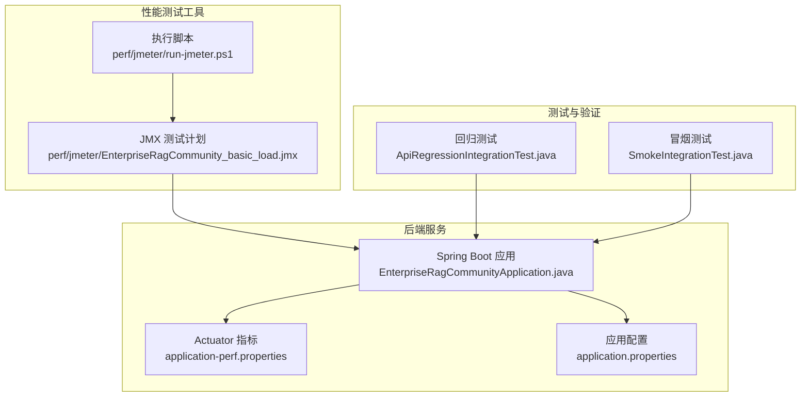
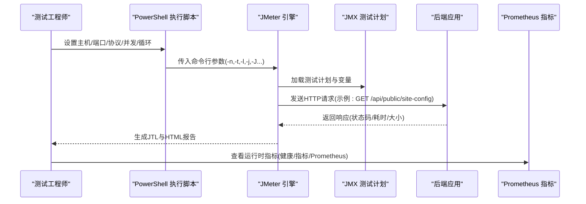
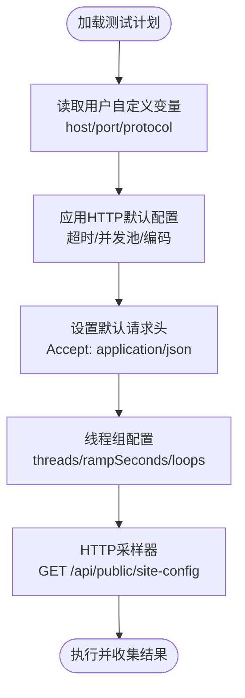
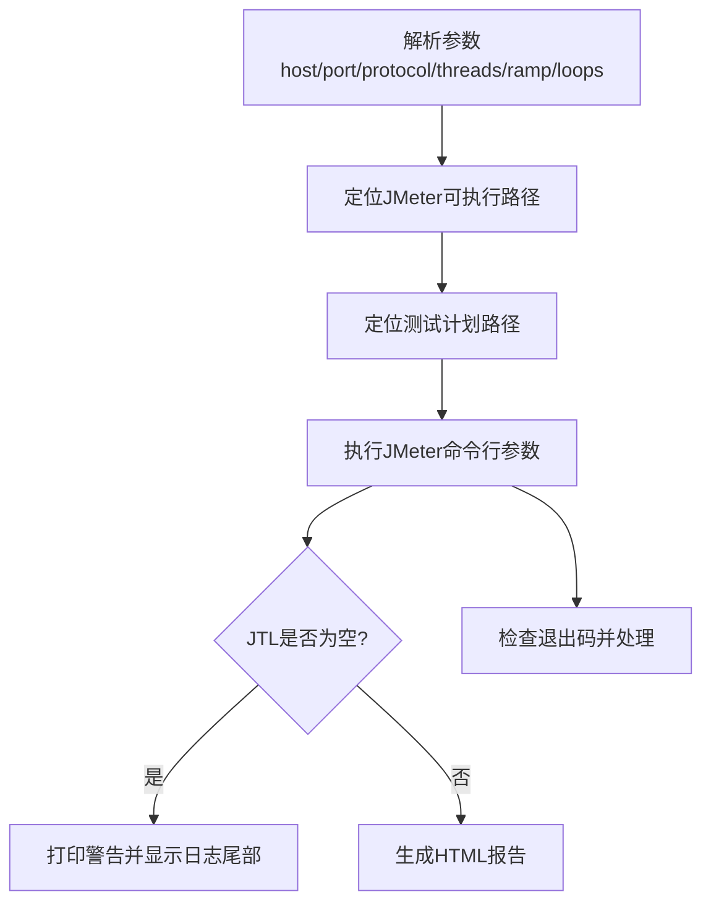
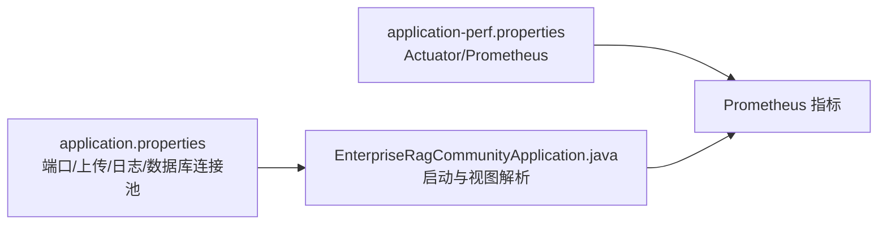
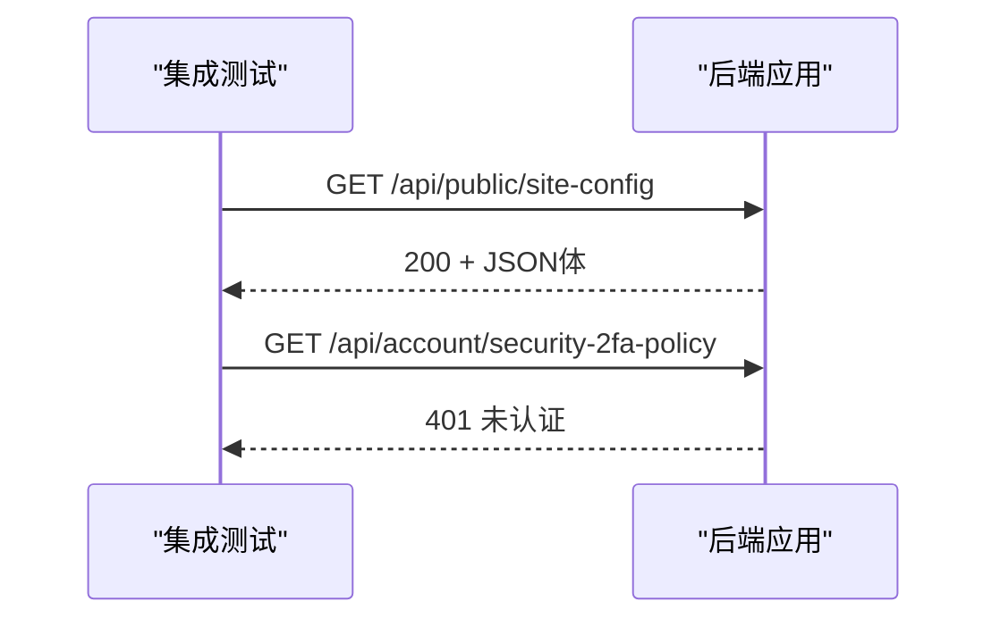
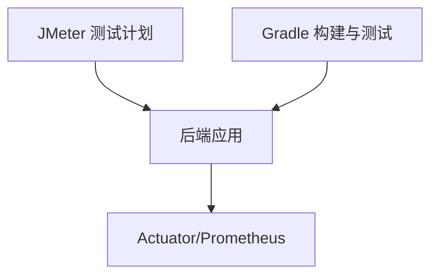

# 性能测试

<cite>
**本文引用的文件**
- [EnterpriseRagCommunity_basic_load.jmx](file://perf/jmeter/EnterpriseRagCommunity_basic_load.jmx)
- [run-jmeter.ps1](file://perf/jmeter/run-jmeter.ps1)
- [application-perf.properties](file://src/main/resources/application-perf.properties)
- [application.properties](file://src/main/resources/application.properties)
- [ApiRegressionIntegrationTest.java](file://src/integrationTest/java/com/example/EnterpriseRagCommunity/ApiRegressionIntegrationTest.java)
- [SmokeIntegrationTest.java](file://src/integrationTest/java/com/example/EnterpriseRagCommunity/SmokeIntegrationTest.java)
- [EnterpriseRagCommunityApplication.java](file://src/main/java/com/example/EnterpriseRagCommunity/EnterpriseRagCommunityApplication.java)
- [build.gradle](file://build.gradle)
- [gradle.properties](file://gradle.properties)
</cite>

## 目录
1. [引言](#引言)
2. [项目结构](#项目结构)
3. [核心组件](#核心组件)
4. [架构总览](#架构总览)
5. [详细组件分析](#详细组件分析)
6. [依赖分析](#依赖分析)
7. [性能考虑](#性能考虑)
8. [故障排查指南](#故障排查指南)
9. [结论](#结论)
10. [附录](#附录)

## 引言
本文件面向企业级RAG社区平台，系统化阐述基于Apache JMeter的性能测试方案，覆盖测试场景设计、并发用户设置、性能指标监控、测试实施流程、瓶颈识别与优化建议、测试环境与数据准备、结果对比分析以及持续性能测试策略。目标是帮助测试与研发团队以可重复、可度量的方式评估系统在高并发下的稳定性与吞吐能力。

## 项目结构
本项目的性能测试相关资产集中在perf/jmeter目录，包含JMX测试计划与PowerShell执行脚本；后端服务通过Spring Boot Actuator暴露Prometheus指标，便于性能监控与分析。集成测试用于验证关键接口可用性，为性能测试提供基准。

**图表来源**
- [EnterpriseRagCommunity_basic_load.jmx:1-83](file://perf/jmeter/EnterpriseRagCommunity_basic_load.jmx#L1-L83)
- [run-jmeter.ps1:1-74](file://perf/jmeter/run-jmeter.ps1#L1-L74)
- [application-perf.properties:1-6](file://src/main/resources/application-perf.properties#L1-L6)
- [application.properties:1-84](file://src/main/resources/application.properties#L1-L84)
- [ApiRegressionIntegrationTest.java:1-36](file://src/integrationTest/java/com/example/EnterpriseRagCommunity/ApiRegressionIntegrationTest.java#L1-L36)
- [SmokeIntegrationTest.java:1-14](file://src/integrationTest/java/com/example/EnterpriseRagCommunity/SmokeIntegrationTest.java#L1-L14)
- [EnterpriseRagCommunityApplication.java:1-64](file://src/main/java/com/example/EnterpriseRagCommunity/EnterpriseRagCommunityApplication.java#L1-L64)

**章节来源**
- [EnterpriseRagCommunity_basic_load.jmx:1-83](file://perf/jmeter/EnterpriseRagCommunity_basic_load.jmx#L1-L83)
- [run-jmeter.ps1:1-74](file://perf/jmeter/run-jmeter.ps1#L1-L74)
- [application-perf.properties:1-6](file://src/main/resources/application-perf.properties#L1-L6)
- [application.properties:1-84](file://src/main/resources/application.properties#L1-L84)
- [ApiRegressionIntegrationTest.java:1-36](file://src/integrationTest/java/com/example/EnterpriseRagCommunity/ApiRegressionIntegrationTest.java#L1-L36)
- [SmokeIntegrationTest.java:1-14](file://src/integrationTest/java/com/example/EnterpriseRagCommunity/SmokeIntegrationTest.java#L1-L14)
- [EnterpriseRagCommunityApplication.java:1-64](file://src/main/java/com/example/EnterpriseRagCommunity/EnterpriseRagCommunityApplication.java#L1-L64)

## 核心组件
- JMeter测试计划：定义并发线程组、请求采样器、默认HTTP参数与超时、请求头等，覆盖公开API路径示例。
- JMeter执行脚本：封装JMeter命令行参数，自动创建输出目录、生成HTML报告，并对空结果进行提示。
- 后端指标配置：启用Actuator健康、信息、指标端点，并暴露Prometheus指标，便于性能观测。
- 应用配置：定义服务端口、连接池参数、上传大小限制、日志级别等，影响性能表现与资源占用。
- 集成测试：验证公开站点配置接口与鉴权接口行为，作为性能测试前的回归与冒烟基础。

**章节来源**
- [EnterpriseRagCommunity_basic_load.jmx:30-80](file://perf/jmeter/EnterpriseRagCommunity_basic_load.jmx#L30-L80)
- [run-jmeter.ps1:37-49](file://perf/jmeter/run-jmeter.ps1#L37-L49)
- [application-perf.properties:1-6](file://src/main/resources/application-perf.properties#L1-L6)
- [application.properties:27-84](file://src/main/resources/application.properties#L27-L84)
- [ApiRegressionIntegrationTest.java:22-34](file://src/integrationTest/java/com/example/EnterpriseRagCommunity/ApiRegressionIntegrationTest.java#L22-L34)
- [SmokeIntegrationTest.java:10-13](file://src/integrationTest/java/com/example/EnterpriseRagCommunity/SmokeIntegrationTest.java#L10-L13)

## 架构总览
下图展示一次典型性能测试的端到端流程：测试脚本调用JMeter，JMeter按配置向后端发送HTTP请求，后端返回响应，JMeter收集采样数据并生成报告。

**图表来源**
- [run-jmeter.ps1:37-49](file://perf/jmeter/run-jmeter.ps1#L37-L49)
- [EnterpriseRagCommunity_basic_load.jmx:4-28](file://perf/jmeter/EnterpriseRagCommunity_basic_load.jmx#L4-L28)
- [application-perf.properties:1-6](file://src/main/resources/application-perf.properties#L1-L6)

## 详细组件分析

### JMeter测试计划组件
- 测试计划与用户自定义变量：支持通过命令行参数注入host/port/protocol等，便于多环境复用。
- HTTP请求默认配置：统一域名、端口、协议、内容编码、连接/响应超时、并发池大小等。
- 默认请求头：统一设置Accept为JSON，确保接口一致性。
- 线程组：支持通过命令行参数设置线程数、爬坡时间、循环次数，便于阶梯式压测。
- 单个HTTP采样器：示例为公开站点配置接口GET /api/public/site-config。

**图表来源**
- [EnterpriseRagCommunity_basic_load.jmx:8-26](file://perf/jmeter/EnterpriseRagCommunity_basic_load.jmx#L8-L26)
- [EnterpriseRagCommunity_basic_load.jmx:30-42](file://perf/jmeter/EnterpriseRagCommunity_basic_load.jmx#L30-L42)
- [EnterpriseRagCommunity_basic_load.jmx:53-64](file://perf/jmeter/EnterpriseRagCommunity_basic_load.jmx#L53-L64)
- [EnterpriseRagCommunity_basic_load.jmx:66-77](file://perf/jmeter/EnterpriseRagCommunity_basic_load.jmx#L66-L77)

**章节来源**
- [EnterpriseRagCommunity_basic_load.jmx:8-26](file://perf/jmeter/EnterpriseRagCommunity_basic_load.jmx#L8-L26)
- [EnterpriseRagCommunity_basic_load.jmx:30-42](file://perf/jmeter/EnterpriseRagCommunity_basic_load.jmx#L30-L42)
- [EnterpriseRagCommunity_basic_load.jmx:53-64](file://perf/jmeter/EnterpriseRagCommunity_basic_load.jmx#L53-L64)
- [EnterpriseRagCommunity_basic_load.jmx:66-77](file://perf/jmeter/EnterpriseRagCommunity_basic_load.jmx#L66-L77)

### JMeter执行脚本组件
- 参数解析：支持主机名、端口、协议、并发线程数、爬坡秒数、循环次数。
- JMeter定位：优先使用JMETER_BAT，其次从JMETER_HOME推导，否则报错。
- 输出管理：自动创建带时间戳的结果目录，生成JTL、HTML报告与日志文件。
- 结果校验：若JTL为空则提示并打印尾部日志；非空则生成HTML报告。
- 退出码处理：非零退出码抛出异常，便于CI/CD捕获失败。

**图表来源**
- [run-jmeter.ps1:1-21](file://perf/jmeter/run-jmeter.ps1#L1-L21)
- [run-jmeter.ps1:23-28](file://perf/jmeter/run-jmeter.ps1#L23-L28)
- [run-jmeter.ps1:37-49](file://perf/jmeter/run-jmeter.ps1#L37-L49)
- [run-jmeter.ps1:56-69](file://perf/jmeter/run-jmeter.ps1#L56-L69)

**章节来源**
- [run-jmeter.ps1:1-21](file://perf/jmeter/run-jmeter.ps1#L1-L21)
- [run-jmeter.ps1:23-28](file://perf/jmeter/run-jmeter.ps1#L23-L28)
- [run-jmeter.ps1:37-49](file://perf/jmeter/run-jmeter.ps1#L37-L49)
- [run-jmeter.ps1:56-69](file://perf/jmeter/run-jmeter.ps1#L56-L69)

### 后端指标与配置
- Actuator指标：启用健康、信息、指标端点，暴露Prometheus指标，便于在压测期间观察CPU、内存、线程、数据库连接池等。
- 应用配置：服务端口、Tomcat上传限制、日志级别、数据库连接池参数等，直接影响性能上限与稳定性。
- 应用入口：Spring Boot启动类，提供静态页面路由与JSP视图解析器，便于前端渲染场景的性能观测。

**图表来源**
- [application.properties:27-84](file://src/main/resources/application.properties#L27-L84)
- [application-perf.properties:1-6](file://src/main/resources/application-perf.properties#L1-L6)
- [EnterpriseRagCommunityApplication.java:20-52](file://src/main/java/com/example/EnterpriseRagCommunity/EnterpriseRagCommunityApplication.java#L20-L52)

**章节来源**
- [application-perf.properties:1-6](file://src/main/resources/application-perf.properties#L1-L6)
- [application.properties:27-84](file://src/main/resources/application.properties#L27-L84)
- [EnterpriseRagCommunityApplication.java:20-52](file://src/main/java/com/example/EnterpriseRagCommunity/EnterpriseRagCommunityApplication.java#L20-L52)

### 集成测试与回归基线
- 回归测试：验证公开站点配置接口返回状态码与关键字段，确保性能测试目标接口可用。
- 冒烟测试：验证应用上下文加载成功，保证压测环境基础稳定。

**图表来源**
- [ApiRegressionIntegrationTest.java:22-34](file://src/integrationTest/java/com/example/EnterpriseRagCommunity/ApiRegressionIntegrationTest.java#L22-L34)
- [SmokeIntegrationTest.java:10-13](file://src/integrationTest/java/com/example/EnterpriseRagCommunity/SmokeIntegrationTest.java#L10-L13)

**章节来源**
- [ApiRegressionIntegrationTest.java:22-34](file://src/integrationTest/java/com/example/EnterpriseRagCommunity/ApiRegressionIntegrationTest.java#L22-L34)
- [SmokeIntegrationTest.java:10-13](file://src/integrationTest/java/com/example/EnterpriseRagCommunity/SmokeIntegrationTest.java#L10-L13)

## 依赖分析
- JMeter与后端：JMeter通过HTTP协议访问后端服务端口；测试计划中的默认HTTP配置与线程组参数决定并发强度与超时容忍。
- 指标采集：后端Actuator暴露Prometheus端点，JMeter负责采集请求级指标（响应时间、吞吐量、错误率）。
- 构建与运行：Gradle构建脚本配置了Spring Boot插件、依赖管理、测试任务与Jacoco覆盖率，间接影响性能测试的可重复性与稳定性。

**图表来源**
- [EnterpriseRagCommunity_basic_load.jmx:30-42](file://perf/jmeter/EnterpriseRagCommunity_basic_load.jmx#L30-L42)
- [application-perf.properties:1-6](file://src/main/resources/application-perf.properties#L1-L6)
- [build.gradle:14-23](file://build.gradle#L14-L23)

**章节来源**
- [EnterpriseRagCommunity_basic_load.jmx:30-42](file://perf/jmeter/EnterpriseRagCommunity_basic_load.jmx#L30-L42)
- [application-perf.properties:1-6](file://src/main/resources/application-perf.properties#L1-L6)
- [build.gradle:14-23](file://build.gradle#L14-L23)

## 性能考虑
- 并发与爬坡：根据业务峰值与资源容量设定线程数与爬坡时间，采用阶梯式增加压力，观察系统拐点。
- 超时与重试：合理设置连接/响应超时，避免压测放大延迟；关注错误率阈值，防止雪崩。
- 数据库与连接池：依据数据库最大连接数与事务隔离级别调整连接池参数，避免连接争用导致的吞吐下降。
- 上传与缓存：大文件上传与静态资源缓存策略会影响I/O与网络带宽，需纳入压测场景。
- 观测维度：结合JMeter请求级指标与后端Prometheus指标，定位CPU、堆内存、GC、数据库连接池、线程池等瓶颈。

[本节为通用指导，无需特定文件来源]

## 故障排查指南
- JMeter找不到可执行文件：检查JMETER_HOME或显式指定JMETER_BAT路径。
- JTL为空或仅表头：确认测试计划路径存在且参数正确；查看JMeter日志尾部定位问题。
- 退出码非零：根据日志定位JMeter执行失败原因，修正参数或环境配置。
- 接口不可用：先运行集成测试验证公开接口可用性，再进行性能测试。
- 指标缺失：确认后端已启用Actuator与Prometheus端点，检查网络连通性与防火墙策略。

**章节来源**
- [run-jmeter.ps1:13-21](file://perf/jmeter/run-jmeter.ps1#L13-L21)
- [run-jmeter.ps1:25-27](file://perf/jmeter/run-jmeter.ps1#L25-L27)
- [run-jmeter.ps1:51-54](file://perf/jmeter/run-jmeter.ps1#L51-L54)
- [ApiRegressionIntegrationTest.java:22-34](file://src/integrationTest/java/com/example/EnterpriseRagCommunity/ApiRegressionIntegrationTest.java#L22-L34)
- [application-perf.properties:1-6](file://src/main/resources/application-perf.properties#L1-L6)

## 结论
通过JMeter测试计划与执行脚本，结合后端Actuator/Prometheus指标，可以系统化地完成企业级RAG社区平台的性能测试。建议以“回归基线+阶梯压测+指标联动”的方式推进，逐步逼近系统瓶颈，并配合数据库与连接池参数优化，持续提升系统的稳定性与吞吐能力。

[本节为总结性内容，无需特定文件来源]

## 附录

### 关键性能指标与阈值建议
- 响应时间（P50/P95/P99）：建议在并发压力下保持P95/P99在可接受范围内，超出SLA即视为不达标。
- 吞吐量（Requests/sec）：关注系统在不同并发下的稳定吞吐，识别拐点与饱和点。
- 错误率（Error %）：目标应接近0；若出现显著错误率，需回溯至上游依赖与资源瓶颈。
- 资源指标（CPU/内存/连接池/线程池）：结合Prometheus指标，定位CPU争用、内存泄漏、连接池耗尽等问题。

[本节为通用指导，无需特定文件来源]

### 测试场景设计与执行流程
- 场景设计：以公开接口为基础，逐步扩展到登录、搜索、检索、上传等关键路径。
- 并发设置：从低并发开始，按倍数递增，观察指标变化趋势。
- 执行步骤：准备环境与数据 -> 运行集成测试确保基线 -> 执行JMeter脚本 -> 收集JTL与HTML报告 -> 分析Prometheus指标 -> 识别瓶颈 -> 优化与回归。

[本节为通用指导，无需特定文件来源]

### 性能测试环境与数据准备
- 环境：确保JMeter与后端在同一网络内，关闭不必要的安全拦截；后端开启Actuator与Prometheus端点。
- 数据：准备代表性测试数据（如站点配置、用户会话、检索样本），避免冷启动与首次索引带来的偏差。
- 参数：通过命令行参数传递host/port/protocol/threads/ramp/loops，便于自动化与版本化管理。

**章节来源**
- [run-jmeter.ps1:1-9](file://perf/jmeter/run-jmeter.ps1#L1-L9)
- [application-perf.properties:1-6](file://src/main/resources/application-perf.properties#L1-L6)
- [application.properties:27-84](file://src/main/resources/application.properties#L27-L84)

### 结果对比分析方法
- 维度对比：同一场景在不同并发下的响应时间、吞吐量、错误率对比。
- 指标对比：JMeter请求级指标与后端Prometheus指标交叉验证，确认瓶颈位置。
- 版本对比：固定场景与参数，对比不同版本的性能差异，形成趋势报告。

[本节为通用指导，无需特定文件来源]

### 持续性能测试策略
- CI集成：在CI流水线中加入JMeter执行与报告生成步骤，失败即阻断。
- 基线回归：每次变更后运行集成测试与轻量级压测，确保回归基线稳定。
- 周期性巡检：定期在预生产环境执行全链路压测，监控关键指标趋势。
- 告警联动：将关键指标阈值接入监控告警，触发性能回归事件。

[本节为通用指导，无需特定文件来源]