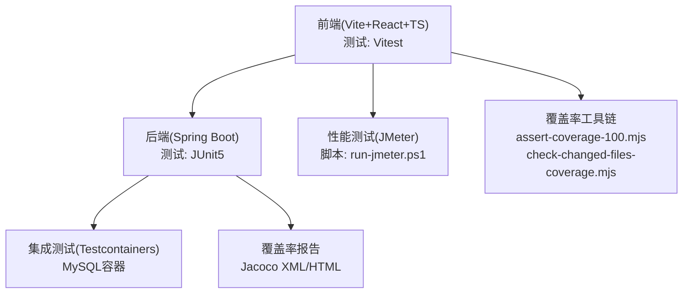
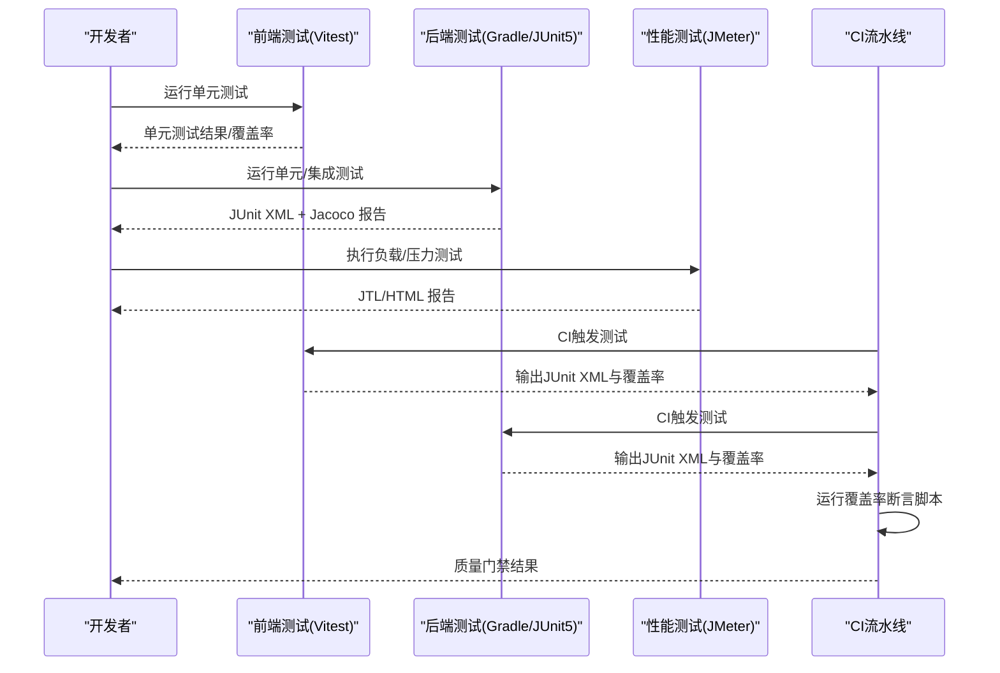
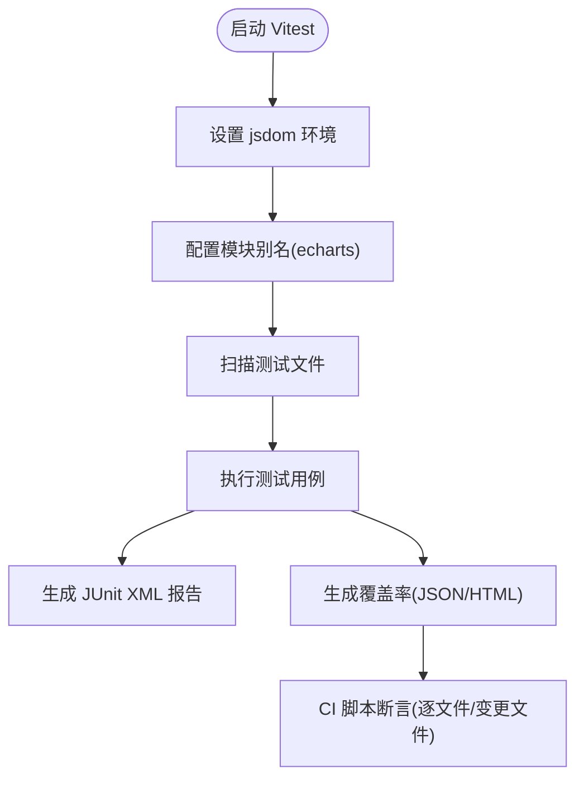
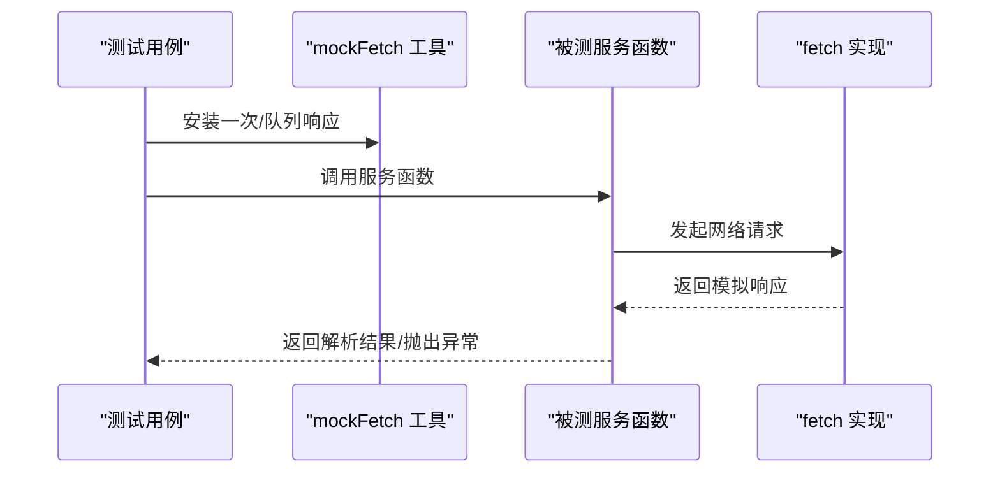
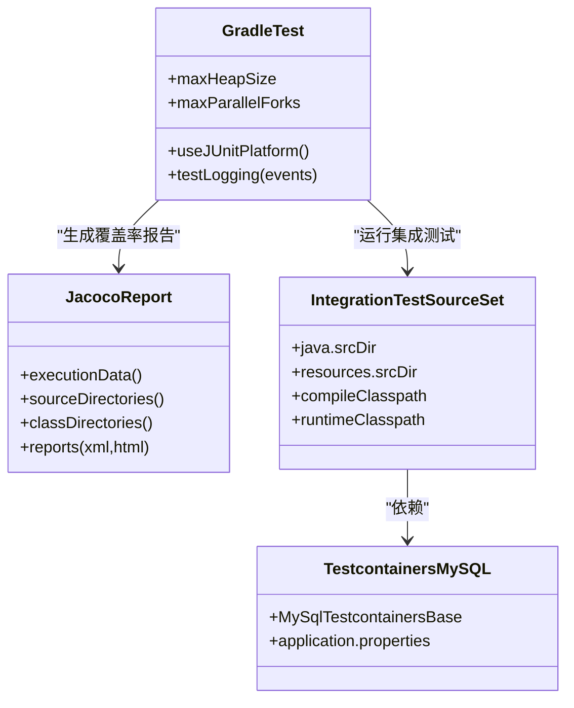
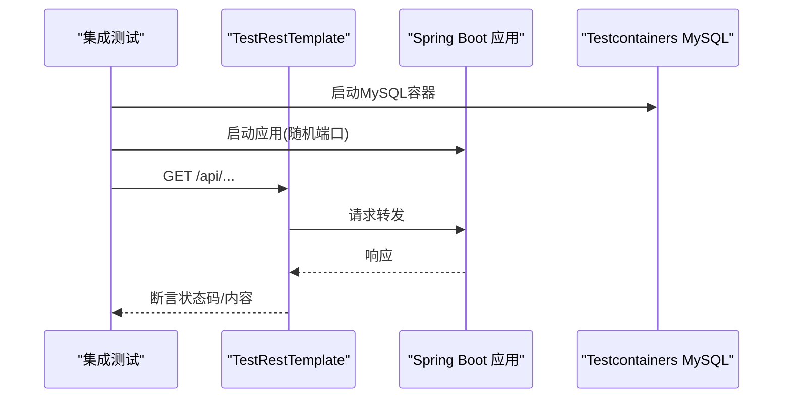
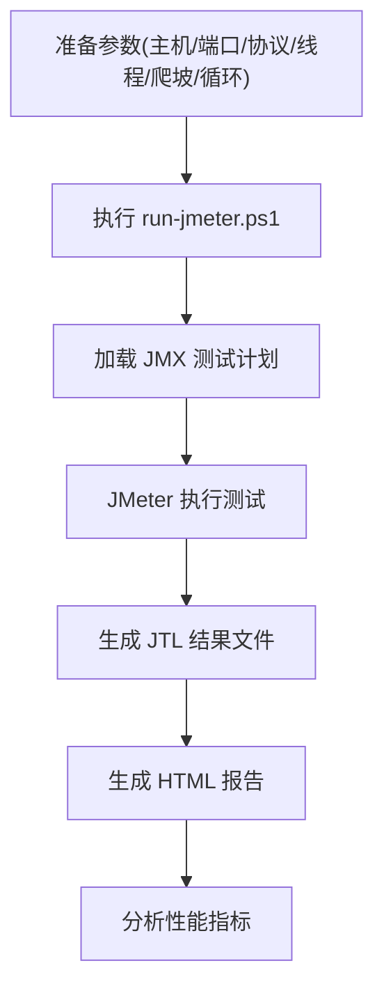
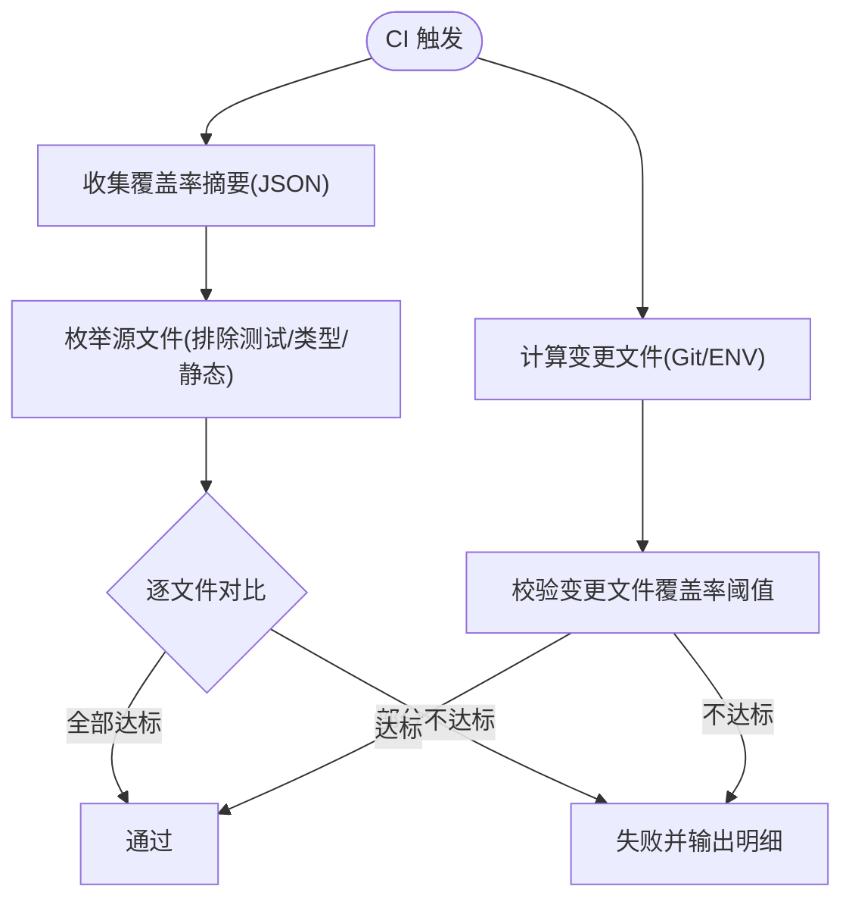
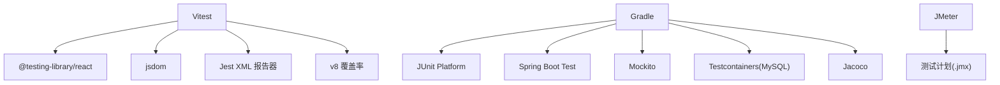

# 测试策略

<cite>
**本文引用的文件**
- [vitest.config.ts](file://my-vite-app/vitest.config.ts)
- [package.json](file://my-vite-app/package.json)
- [vitestSetup.ts](file://my-vite-app/src/testUtils/vitestSetup.ts)
- [mockFetch.ts](file://my-vite-app/src/testUtils/mockFetch.ts)
- [renderWithRoute.tsx](file://my-vite-app/src/testUtils/renderWithRoute.tsx)
- [assert-coverage-100.mjs](file://my-vite-app/scripts/assert-coverage-100.mjs)
- [check-changed-files-coverage.mjs](file://my-vite-app/scripts/check-changed-files-coverage.mjs)
- [build.gradle](file://build.gradle)
- [ApiRegressionIntegrationTest.java](file://src/integrationTest/java/com/example/EnterpriseRagCommunity/ApiRegressionIntegrationTest.java)
- [SmokeIntegrationTest.java](file://src/integrationTest/java/com/example/EnterpriseRagCommunity/SmokeIntegrationTest.java)
- [application.properties](file://src/test/resources/application.properties)
- [run-jmeter.ps1](file://perf/jmeter/run-jmeter.ps1)
- [useAdminStepUp.test.tsx](file://my-vite-app/src/components/admin/useAdminStepUp.test.tsx)
- [UserService.test.ts](file://my-vite-app/src/services/UserService.test.ts)
</cite>

## 目录
1. [引言](#引言)
2. [项目结构](#项目结构)
3. [核心组件](#核心组件)
4. [架构总览](#架构总览)
5. [详细组件分析](#详细组件分析)
6. [依赖关系分析](#依赖关系分析)
7. [性能考虑](#性能考虑)
8. [故障排查指南](#故障排查指南)
9. [结论](#结论)
10. [附录](#附录)

## 引言
本测试策略文档面向企业级RAG社区平台，系统化阐述测试金字塔的落地实践，覆盖前端单元测试、后端单元/集成测试以及性能与负载测试，并明确持续集成中的自动化流程与质量门禁标准。文档基于仓库现有测试基础设施与脚本，提供可执行的实施建议与最佳实践。

## 项目结构
项目采用前后端分离的多模块布局：
- 前端（React + TypeScript）位于 my-vite-app，使用 Vitest 进行单元测试，Jest XML 报告输出，Istanbul 兼容覆盖率统计。
- 后端（Spring Boot + Gradle）位于 src/main/java，使用 JUnit 5，集成测试位于 src/integrationTest，通过 Testcontainers 管理数据库容器。
- 性能测试位于 perf/jmeter，提供 JMeter 脚本与执行脚本。

**图表来源**
- [vitest.config.ts:12-41](file://my-vite-app/vitest.config.ts#L12-L41)
- [build.gradle:225-267](file://build.gradle#L225-L267)
- [run-jmeter.ps1:1-74](file://perf/jmeter/run-jmeter.ps1#L1-L74)

**章节来源**
- [vitest.config.ts:1-43](file://my-vite-app/vitest.config.ts#L1-L43)
- [build.gradle:140-146](file://build.gradle#L140-L146)
- [run-jmeter.ps1:1-74](file://perf/jmeter/run-jmeter.ps1#L1-L74)

## 核心组件
- 前端测试运行器与配置：Vitest 配置、JSDOM 环境、Jest XML 报告、覆盖率收集与阈值控制。
- 前端测试工具集：mockFetch 工具、路由渲染辅助、覆盖率断言脚本。
- 后端测试运行器与配置：Gradle Test 任务、Jacoco 覆盖率、集成测试源集与 Testcontainers。
- 性能测试：JMeter 脚本与执行脚本，支持参数化并发、循环次数与结果目录。
- 质量门禁：CI 中的覆盖率断言脚本与 Gradle 覆盖率验证任务。

**章节来源**
- [vitest.config.ts:12-41](file://my-vite-app/vitest.config.ts#L12-L41)
- [mockFetch.ts:1-138](file://my-vite-app/src/testUtils/mockFetch.ts#L1-L138)
- [renderWithRoute.tsx:1-23](file://my-vite-app/src/testUtils/renderWithRoute.tsx#L1-L23)
- [assert-coverage-100.mjs:1-119](file://my-vite-app/scripts/assert-coverage-100.mjs#L1-L119)
- [check-changed-files-coverage.mjs:1-185](file://my-vite-app/scripts/check-changed-files-coverage.mjs#L1-L185)
- [build.gradle:225-267](file://build.gradle#L225-L267)
- [run-jmeter.ps1:1-74](file://perf/jmeter/run-jmeter.ps1#L1-L74)

## 架构总览
测试体系由三层构成：单元测试（前端）、集成测试（后端）与性能测试（JMeter）。前端通过 Vitest 快速反馈，后端通过 Gradle/Jacoco 获取整体覆盖率，CI 中结合脚本进行逐文件与变更文件的覆盖率校验。

**图表来源**
- [vitest.config.ts:16-19](file://my-vite-app/vitest.config.ts#L16-L19)
- [build.gradle:225-267](file://build.gradle#L225-L267)
- [assert-coverage-100.mjs:72-116](file://my-vite-app/scripts/assert-coverage-100.mjs#L72-L116)
- [check-changed-files-coverage.mjs:114-182](file://my-vite-app/scripts/check-changed-files-coverage.mjs#L114-L182)

## 详细组件分析

### 前端测试框架与配置（Vitest）
- 环境与插件：使用 jsdom 环境，React 插件，别名映射（如 echarts）。
- 包含规则：自动扫描 src/**/*.{test,spec}.{ts,tsx}。
- 报告：默认与 Jest XML；输出路径 test-reports/vitest-junit.xml。
- 覆盖率：v8 提供者，输出 JSON 摘要与 HTML；排除测试文件、类型声明、静态资源与入口；阈值设为 0（由 CI 脚本统一校验）。
- 初始化：setupFiles 创建必要目录，确保报告与覆盖率输出稳定。

**图表来源**
- [vitest.config.ts:5-41](file://my-vite-app/vitest.config.ts#L5-L41)
- [vitestSetup.ts:1-10](file://my-vite-app/src/testUtils/vitestSetup.ts#L1-L10)
- [assert-coverage-100.mjs:72-116](file://my-vite-app/scripts/assert-coverage-100.mjs#L72-L116)
- [check-changed-files-coverage.mjs:114-182](file://my-vite-app/scripts/check-changed-files-coverage.mjs#L114-L182)

**章节来源**
- [vitest.config.ts:12-41](file://my-vite-app/vitest.config.ts#L12-L41)
- [vitestSetup.ts:1-10](file://my-vite-app/src/testUtils/vitestSetup.ts#L1-L10)

### 前端测试工具与Mock策略
- mockFetch 工具：提供响应构造、一次性与队列式响应、错误模拟，便于服务层测试。
- 路由渲染辅助：在 MemoryRouter 中渲染带路由的组件，便于测试路由行为。
- CSRF 与服务层测试夹具：通过 resetServiceTest 与 getFetchCallInfo 统一 fetch 行为，保证断言一致性。

**图表来源**
- [mockFetch.ts:83-137](file://my-vite-app/src/testUtils/mockFetch.ts#L83-L137)
- [UserService.test.ts:16-200](file://my-vite-app/src/services/UserService.test.ts#L16-L200)

**章节来源**
- [mockFetch.ts:1-138](file://my-vite-app/src/testUtils/mockFetch.ts#L1-L138)
- [renderWithRoute.tsx:1-23](file://my-vite-app/src/testUtils/renderWithRoute.tsx#L1-L23)
- [UserService.test.ts:16-200](file://my-vite-app/src/services/UserService.test.ts#L16-L200)

### 后端测试框架与配置（Gradle + JUnit5 + Testcontainers）
- 测试运行器：Gradle Test 任务使用 JUnit Platform，日志输出事件级别可控。
- 集成测试源集：独立的 integrationTest 源集，classpath 与运行时继承 test 配置。
- 覆盖率：Jacoco 全局开启，生成 XML/HTML 报告；提供按类聚焦的覆盖率任务与 100% 验证任务。
- 数据库：集成测试基类使用 Testcontainers 启动 MySQL，测试配置读取 application.properties。

**图表来源**
- [build.gradle:140-146](file://build.gradle#L140-L146)
- [build.gradle:225-267](file://build.gradle#L225-L267)
- [build.gradle:201-223](file://build.gradle#L201-L223)
- [application.properties:1-21](file://src/test/resources/application.properties#L1-L21)

**章节来源**
- [build.gradle:140-146](file://build.gradle#L140-L146)
- [build.gradle:201-223](file://build.gradle#L201-L223)
- [build.gradle:225-267](file://build.gradle#L225-L267)
- [application.properties:1-21](file://src/test/resources/application.properties#L1-L21)

### 集成测试示例（Spring Boot + TestRestTemplate）
- 示例：ApiRegressionIntegrationTest 与 SmokeIntegrationTest 展示了基于 TestRestTemplate 的 API 回归与上下文加载冒烟测试。
- 数据库：继承 MySqlTestcontainersBase，确保测试数据库一致可用。

**图表来源**
- [ApiRegressionIntegrationTest.java:13-35](file://src/integrationTest/java/com/example/EnterpriseRagCommunity/ApiRegressionIntegrationTest.java#L13-L35)
- [SmokeIntegrationTest.java:7-13](file://src/integrationTest/java/com/example/EnterpriseRagCommunity/SmokeIntegrationTest.java#L7-L13)

**章节来源**
- [ApiRegressionIntegrationTest.java:13-35](file://src/integrationTest/java/com/example/EnterpriseRagCommunity/ApiRegressionIntegrationTest.java#L13-L35)
- [SmokeIntegrationTest.java:7-13](file://src/integrationTest/java/com/example/EnterpriseRagCommunity/SmokeIntegrationTest.java#L7-L13)

### 性能测试（JMeter）
- 脚本：EnterpriseRagCommunity_basic_load.jmx（仓库中存在）。
- 执行：run-jmeter.ps1 支持主机、端口、协议、并发线程、爬坡时间、循环次数等参数化。
- 输出：JTL 文件与 HTML 报告目录，便于分析吞吐、延迟与错误率。

**图表来源**
- [run-jmeter.ps1:1-74](file://perf/jmeter/run-jmeter.ps1#L1-L74)

**章节来源**
- [run-jmeter.ps1:1-74](file://perf/jmeter/run-jmeter.ps1#L1-L74)

### 覆盖率断言与质量门禁
- 逐文件 100% 覆盖断言：遍历 src 下 TS/TSX 源文件，排除测试/类型/静态资源，校验 Lines/Branches/Functions/Statements 均为 100%。
- 变更文件增量覆盖率断言：从环境变量或 Git diff 推断变更文件集合，校验阈值不低于 100%。
- Gradle 覆盖率验证：提供按类聚焦的 100% 验证任务，用于关键服务类的强制覆盖。

**图表来源**
- [assert-coverage-100.mjs:72-116](file://my-vite-app/scripts/assert-coverage-100.mjs#L72-L116)
- [check-changed-files-coverage.mjs:114-182](file://my-vite-app/scripts/check-changed-files-coverage.mjs#L114-L182)
- [build.gradle:317-380](file://build.gradle#L317-L380)

**章节来源**
- [assert-coverage-100.mjs:1-119](file://my-vite-app/scripts/assert-coverage-100.mjs#L1-L119)
- [check-changed-files-coverage.mjs:1-185](file://my-vite-app/scripts/check-changed-files-coverage.mjs#L1-L185)
- [build.gradle:317-380](file://build.gradle#L317-L380)

## 依赖关系分析
- 前端测试依赖：Vitest、@testing-library/react、JSdom、Jest XML 报告器、v8 覆盖率提供者。
- 后端测试依赖：JUnit 5、Spring Boot Test、Mockito、Testcontainers（MySQL/JDBC）、Jacoco。
- 性能测试依赖：JMeter（通过 JMETER_HOME/JMETER_BAT 指定）。

**图表来源**
- [package.json:52-75](file://my-vite-app/package.json#L52-L75)
- [build.gradle:122-129](file://build.gradle#L122-L129)
- [run-jmeter.ps1:13-21](file://perf/jmeter/run-jmeter.ps1#L13-L21)

**章节来源**
- [package.json:52-75](file://my-vite-app/package.json#L52-L75)
- [build.gradle:122-129](file://build.gradle#L122-L129)
- [run-jmeter.ps1:13-21](file://perf/jmeter/run-jmeter.ps1#L13-L21)

## 性能考虑
- 并发与资源：Gradle Test 任务限制并行度与堆大小，避免资源争用导致的不稳定。
- 数据初始化：集成测试使用 Testcontainers 独立数据库，避免共享状态影响性能测试。
- 覆盖率成本：v8 覆盖率提供者与 Jacoco 在 CI 中生成报告，建议仅在 CI 开启以减少本地开发负担。
- JMeter 参数：通过脚本参数控制并发与循环，建议先小规模验证再逐步放大。

**章节来源**
- [build.gradle:55-66](file://build.gradle#L55-L66)
- [run-jmeter.ps1:1-74](file://perf/jmeter/run-jmeter.ps1#L1-L74)

## 故障排查指南
- Vitest 报告路径不存在：确认 setupFiles 创建 test-reports 目录。
- 覆盖率断言失败：检查 coverage-summary.json 是否生成，确认排除规则是否正确匹配源文件。
- Gradle 覆盖率报告缺失：确认 jacocoTestReport 任务已执行，XML/HTML 输出路径是否存在。
- JMeter 执行失败：检查 JMETER_HOME/JMETER_BAT 是否正确，测试计划路径是否存在。
- Testcontainers 启动失败：确认 Docker 可用，数据库连接参数与 Flyway 初始化配置正确。

**章节来源**
- [vitestSetup.ts:1-10](file://my-vite-app/src/testUtils/vitestSetup.ts#L1-L10)
- [assert-coverage-100.mjs:73-76](file://my-vite-app/scripts/assert-coverage-100.mjs#L73-L76)
- [build.gradle:255-267](file://build.gradle#L255-L267)
- [run-jmeter.ps1:19-21](file://perf/jmeter/run-jmeter.ps1#L19-L21)
- [application.properties:1-21](file://src/test/resources/application.properties#L1-L21)

## 结论
本项目已建立完善的测试金字塔：前端以 Vitest 为核心，配合 mockFetch 与路由渲染工具快速验证业务逻辑；后端以 Gradle/JUnit5/Testcontainers 保障集成稳定性，并通过 Jacoco 与 Gradle 聚焦任务实现精细化覆盖率控制；性能测试通过 JMeter 脚本与执行脚本形成可重复的负载/压力评估能力。CI 中通过覆盖率断言脚本与 Gradle 验证任务实现质量门禁，确保关键路径与变更代码的测试覆盖。

## 附录
- 测试金字塔实施清单
  - 前端单元测试：组件交互、服务层调用、路由行为、错误处理。
  - 前端集成测试：跨组件协作、状态管理、第三方库集成。
  - 后端单元测试：服务层、仓储层、工具类。
  - 后端集成测试：控制器、数据库、外部服务。
  - 端到端测试：关键用户旅程（待补充）。
  - 性能测试：JMeter 场景设计与回归执行。
- 测试用例编写指南
  - 前端：优先使用 @testing-library/react，关注用户可见行为；对副作用使用 mockFetch。
  - 后端：使用 Mockito stubbing，结合 Testcontainers 初始化数据库。
- Mock 策略
  - 前端：集中于 mockFetch 与 vi.mock，避免真实网络请求。
  - 后端：对 Repository/Service/HTTP 客户端进行接口隔离与桩对象注入。
- 测试数据管理
  - 前端：通过 mockFetch 预置响应，必要时使用队列式响应模拟序列化场景。
  - 后端：Flyway 初始化 SQL 与 Testcontainers 容器化数据库，确保可重复性。
- 持续集成与质量门禁
  - 前端：CI 脚本执行 Vitest 并输出报告；随后运行逐文件与变更文件覆盖率断言。
  - 后端：Gradle 执行 test/integrationTest，生成 Jacoco 报告并通过 Gradle 验证任务。