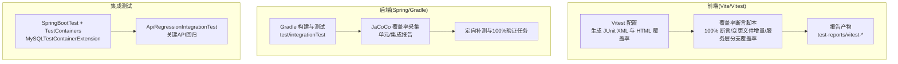
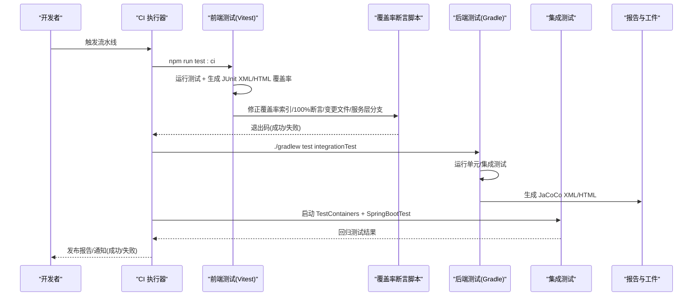
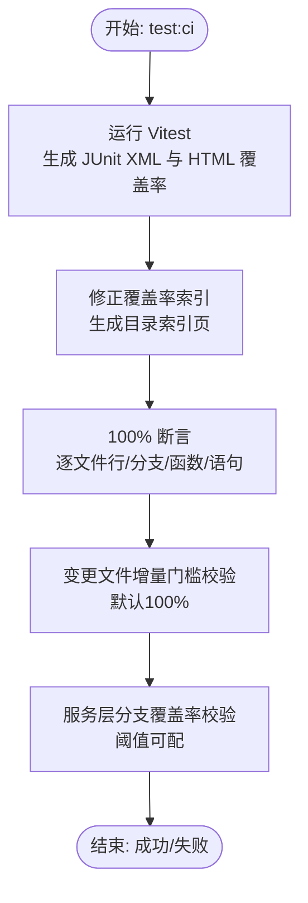
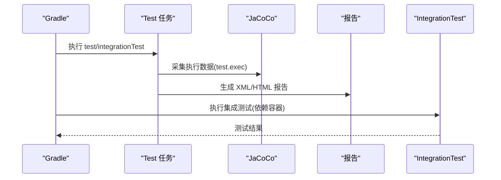
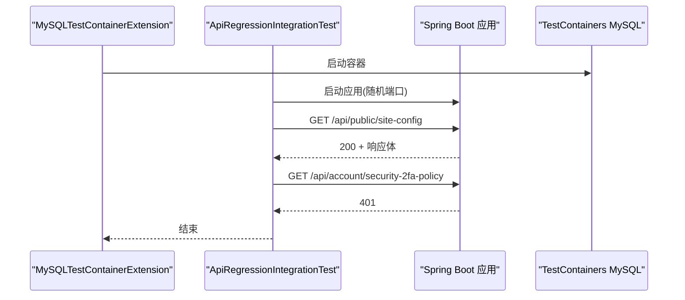
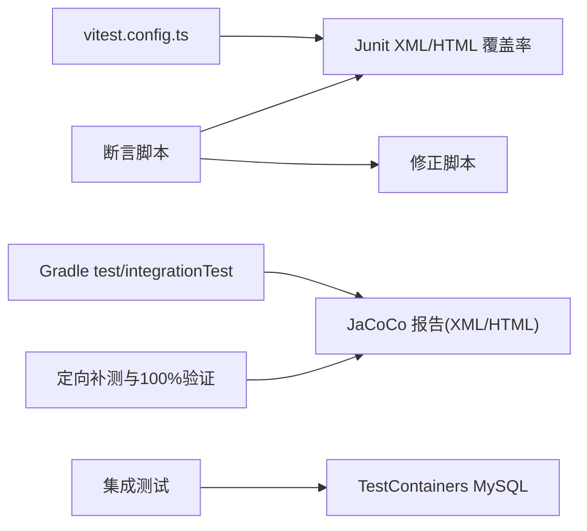

# 测试自动化

<cite>
**本文引用的文件**
- [vitest.config.ts](file://my-vite-app/vitest.config.ts)
- [package.json](file://my-vite-app/package.json)
- [vitestSetup.ts](file://my-vite-app/src/testUtils/vitestSetup.ts)
- [assert-coverage-100.mjs](file://my-vite-app/scripts/assert-coverage-100.mjs)
- [check-changed-files-coverage.mjs](file://my-vite-app/scripts/check-changed-files-coverage.mjs)
- [check-services-branch-coverage.mjs](file://my-vite-app/scripts/check-services-branch-coverage.mjs)
- [fix-istanbul-src-index.mjs](file://my-vite-app/scripts/fix-istanbul-src-index.mjs)
- [build.gradle](file://build.gradle)
- [settings.gradle](file://settings.gradle)
- [ApiRegressionIntegrationTest.java](file://src/integrationTest/java/com/example/EnterpriseRagCommunity/ApiRegressionIntegrationTest.java)
- [MySQLTestContainerExtension.java](file://src/test/java/com/example/EnterpriseRagCommunity/testsupport/MySQLTestContainerExtension.java)
- [自动化测试与指标说明.md](file://docs/自动化测试与指标说明.md)
</cite>

## 目录
1. [引言](#引言)
2. [项目结构](#项目结构)
3. [核心组件](#核心组件)
4. [架构总览](#架构总览)
5. [详细组件分析](#详细组件分析)
6. [依赖关系分析](#依赖关系分析)
7. [性能考量](#性能考量)
8. [故障排查指南](#故障排查指南)
9. [结论](#结论)
10. [附录](#附录)

## 引言
本文件面向CI/CD流水线中的测试自动化，系统化梳理前端与后端测试执行、覆盖率采集与质量门禁、测试报告生成与发布、测试环境配置与清理、测试数据与资源优化、以及失败重试与通知机制。文档以仓库内现有脚本与配置为依据，结合Gradle与Vitest的测试与覆盖率体系，形成可落地的自动化实践说明。

## 项目结构
项目采用前后端分离的测试布局：
- 前端测试与覆盖率：基于Vitest，生成JUnit XML与HTML覆盖率报告，并在CI中进行100%覆盖率断言与变更文件增量门槛校验。
- 后端测试与覆盖率：基于JUnit 5与Spring Boot Test，使用JaCoCo采集行/分支/方法覆盖率，支持定向补测与精确类覆盖率验证。
- 集成测试：基于TestContainers与SpringBootTest，对关键API进行回归验证。
- 文档与指标：提供统一的测试类型、报告产物与指标口径说明，便于CI归档与评审。

图表来源
- [vitest.config.ts:12-42](file://my-vite-app/vitest.config.ts#L12-L42)
- [package.json:6-13](file://my-vite-app/package.json#L6-L13)
- [build.gradle:216-227](file://build.gradle#L216-L227)
- [build.gradle:255-267](file://build.gradle#L255-L267)
- [ApiRegressionIntegrationTest.java:13-35](file://src/integrationTest/java/com/example/EnterpriseRagCommunity/ApiRegressionIntegrationTest.java#L13-L35)
- [MySQLTestContainerExtension.java:6-16](file://src/test/java/com/example/EnterpriseRagCommunity/testsupport/MySQLTestContainerExtension.java#L6-L16)

章节来源
- [vitest.config.ts:1-43](file://my-vite-app/vitest.config.ts#L1-L43)
- [package.json:1-82](file://my-vite-app/package.json#L1-L82)
- [build.gradle:140-146](file://build.gradle#L140-L146)
- [build.gradle:216-227](file://build.gradle#L216-L227)
- [build.gradle:255-267](file://build.gradle#L255-L267)
- [ApiRegressionIntegrationTest.java:1-36](file://src/integrationTest/java/com/example/EnterpriseRagCommunity/ApiRegressionIntegrationTest.java#L1-L36)
- [MySQLTestContainerExtension.java:1-17](file://src/test/java/com/example/EnterpriseRagCommunity/testsupport/MySQLTestContainerExtension.java#L1-L17)

## 核心组件
- 前端测试与覆盖率
  - Vitest配置：启用jsdom环境、Junit报告器、HTML覆盖率与JSON摘要，指定include/exclude规则，关闭自动清理以便后续断言脚本读取。
  - CI脚本：统一执行Vitest、修正覆盖率索引、校验变更文件覆盖率与服务层分支覆盖率。
  - 断言脚本：100%断言（逐文件行/分支/函数/语句）、变更文件增量门槛校验、服务层分支覆盖率阈值校验。
- 后端测试与覆盖率
  - Gradle任务：test/integrationTest，统一JVM参数与并行策略；Jacoco采集单元与集成覆盖率，生成XML/HTML报告。
  - 定向补测：针对特定类/包注册独立测试与报告任务，并提供100%覆盖率验证任务。
  - 集成测试：基于TestContainers启动MySQL，确保数据库一致性与API回归验证。
- 测试报告与发布
  - 前端：Junit XML与HTML覆盖率目录；CI可据此生成工件与通知。
  - 后端：JaCoCo XML/HTML报告；Gradle任务可按需生成与校验。
- 质量门禁
  - 前端：100%断言与服务层分支覆盖率阈值；变更文件增量门槛。
  - 后端：定向类100%覆盖率验证与分支覆盖率阈值（如95%）。

章节来源
- [vitest.config.ts:12-42](file://my-vite-app/vitest.config.ts#L12-L42)
- [package.json:6-13](file://my-vite-app/package.json#L6-L13)
- [assert-coverage-100.mjs:72-118](file://my-vite-app/scripts/assert-coverage-100.mjs#L72-L118)
- [check-changed-files-coverage.mjs:114-184](file://my-vite-app/scripts/check-changed-files-coverage.mjs#L114-L184)
- [check-services-branch-coverage.mjs:33-67](file://my-vite-app/scripts/check-services-branch-coverage.mjs#L33-L67)
- [build.gradle:255-267](file://build.gradle#L255-L267)
- [build.gradle:382-779](file://build.gradle#L382-L779)
- [build.gradle:781-800](file://build.gradle#L781-L800)

## 架构总览
下图展示CI流水线中测试与覆盖率的关键交互：

图表来源
- [package.json:11-12](file://my-vite-app/package.json#L11-L12)
- [vitest.config.ts:16-20](file://my-vite-app/vitest.config.ts#L16-L20)
- [build.gradle:216-227](file://build.gradle#L216-L227)
- [ApiRegressionIntegrationTest.java:13-35](file://src/integrationTest/java/com/example/EnterpriseRagCommunity/ApiRegressionIntegrationTest.java#L13-L35)

## 详细组件分析

### 前端测试与覆盖率断言
- 测试执行
  - Vitest配置启用jsdom环境、Junit报告器与HTML覆盖率，include仅含src，exclude排除测试文件、声明文件、静态资源与入口文件，避免噪声。
  - CI脚本统一执行Vitest并串联覆盖率修正、100%断言、变更文件增量门槛与服务层分支覆盖率校验。
- 覆盖率修正
  - 修正Istanbul产物索引，生成src与components目录的index.html，便于阅读与归档。
- 100%覆盖率断言
  - 逐文件校验行/分支/函数/语句均为100%，失败时输出具体文件与百分比并退出码非零。
- 变更文件增量门槛
  - 从环境变量或Git diff识别变更文件，过滤非相关文件，校验阈值（默认100%）。
- 服务层分支覆盖率
  - 仅统计src/services下ts文件，按分支总数/覆盖数计算百分比，支持阶段切换与阈值配置。

图表来源
- [package.json:11-12](file://my-vite-app/package.json#L11-L12)
- [fix-istanbul-src-index.mjs:212-318](file://my-vite-app/scripts/fix-istanbul-src-index.mjs#L212-L318)
- [assert-coverage-100.mjs:72-118](file://my-vite-app/scripts/assert-coverage-100.mjs#L72-L118)
- [check-changed-files-coverage.mjs:114-184](file://my-vite-app/scripts/check-changed-files-coverage.mjs#L114-L184)
- [check-services-branch-coverage.mjs:33-67](file://my-vite-app/scripts/check-services-branch-coverage.mjs#L33-L67)

章节来源
- [vitest.config.ts:12-42](file://my-vite-app/vitest.config.ts#L12-L42)
- [package.json:6-13](file://my-vite-app/package.json#L6-L13)
- [vitestSetup.ts:1-10](file://my-vite-app/src/testUtils/vitestSetup.ts#L1-L10)
- [fix-istanbul-src-index.mjs:1-319](file://my-vite-app/scripts/fix-istanbul-src-index.mjs#L1-L319)
- [assert-coverage-100.mjs:1-119](file://my-vite-app/scripts/assert-coverage-100.mjs#L1-L119)
- [check-changed-files-coverage.mjs:1-185](file://my-vite-app/scripts/check-changed-files-coverage.mjs#L1-L185)
- [check-services-branch-coverage.mjs:1-70](file://my-vite-app/scripts/check-services-branch-coverage.mjs#L1-L70)

### 后端测试与JaCoCo覆盖率
- 测试执行
  - Gradle统一配置JVM参数、并行策略与结果目录；test与integrationTest分别运行单元与集成测试。
- 覆盖率采集
  - JaCoCo在test任务结束后生成执行文件，随后生成XML/HTML报告；支持按包/类细化报告。
- 定向补测与100%验证
  - 针对关键服务类注册独立测试、报告与100%验证任务，支持分支/指令/行/方法计数器校验。
- 集成测试
  - 基于TestContainers启动MySQL，使用扩展在所有测试前保证容器可用，确保API回归测试稳定。

图表来源
- [build.gradle:140-146](file://build.gradle#L140-L146)
- [build.gradle:233-238](file://build.gradle#L233-L238)
- [build.gradle:255-267](file://build.gradle#L255-L267)
- [build.gradle:216-227](file://build.gradle#L216-L227)
- [MySQLTestContainerExtension.java:6-16](file://src/test/java/com/example/EnterpriseRagCommunity/testsupport/MySQLTestContainerExtension.java#L6-L16)

章节来源
- [build.gradle:140-146](file://build.gradle#L140-L146)
- [build.gradle:233-238](file://build.gradle#L233-L238)
- [build.gradle:255-267](file://build.gradle#L255-L267)
- [build.gradle:382-779](file://build.gradle#L382-L779)
- [MySQLTestContainerExtension.java:1-17](file://src/test/java/com/example/EnterpriseRagCommunity/testsupport/MySQLTestContainerExtension.java#L1-L17)

### 集成测试与API回归
- 集成测试
  - 使用SpringBootTest随机端口启动应用，配合TestContainers提供MySQL环境。
  - 示例测试覆盖公开站点配置与鉴权接口，验证状态码与响应内容。
- 环境准备
  - TestContainers扩展在BeforeAll阶段确保容器可用，避免测试间相互影响。

图表来源
- [MySQLTestContainerExtension.java:6-16](file://src/test/java/com/example/EnterpriseRagCommunity/testsupport/MySQLTestContainerExtension.java#L6-L16)
- [ApiRegressionIntegrationTest.java:13-35](file://src/integrationTest/java/com/example/EnterpriseRagCommunity/ApiRegressionIntegrationTest.java#L13-L35)

章节来源
- [ApiRegressionIntegrationTest.java:1-36](file://src/integrationTest/java/com/example/EnterpriseRagCommunity/ApiRegressionIntegrationTest.java#L1-L36)
- [MySQLTestContainerExtension.java:1-17](file://src/test/java/com/example/EnterpriseRagCommunity/testsupport/MySQLTestContainerExtension.java#L1-L17)

### 质量门禁与报告发布
- 前端门禁
  - 100%断言：逐文件行/分支/函数/语句必须为100%。
  - 变更文件增量门槛：默认100%，失败时输出具体文件与百分比。
  - 服务层分支覆盖率：按阶段调整阈值，失败时输出覆盖率与阈值。
- 后端门禁
  - 定向类100%验证：对关键服务类进行指令/分支/行/方法计数器校验，确保无遗漏。
  - 分支覆盖率阈值：如95%等，失败时抛出异常并终止流水线。
- 报告发布
  - 前端：Junit XML与HTML覆盖率目录；CI可复制至统一目录归档。
  - 后端：JaCoCo XML/HTML报告；Gradle任务可按需生成与校验。

章节来源
- [assert-coverage-100.mjs:72-118](file://my-vite-app/scripts/assert-coverage-100.mjs#L72-L118)
- [check-changed-files-coverage.mjs:114-184](file://my-vite-app/scripts/check-changed-files-coverage.mjs#L114-L184)
- [check-services-branch-coverage.mjs:33-67](file://my-vite-app/scripts/check-services-branch-coverage.mjs#L33-L67)
- [build.gradle:382-779](file://build.gradle#L382-L779)
- [build.gradle:781-800](file://build.gradle#L781-L800)

## 依赖关系分析
- 前端
  - Vitest配置依赖React插件与jsdom环境；报告器输出Junit XML与HTML；覆盖率provider为v8。
  - 断言脚本依赖覆盖率摘要文件与src目录结构，通过修正脚本生成目录索引页。
- 后端
  - Gradle插件包含Spring Boot、Jacoco、OWASP依赖检查与SonarQube；test/integrationTest任务依赖TestContainers。
  - 定向补测任务通过XML解析JaCoCo报告，校验关键计数器并生成可读HTML。

图表来源
- [vitest.config.ts:12-42](file://my-vite-app/vitest.config.ts#L12-L42)
- [package.json:6-13](file://my-vite-app/package.json#L6-L13)
- [build.gradle:216-227](file://build.gradle#L216-L227)
- [build.gradle:255-267](file://build.gradle#L255-L267)
- [build.gradle:382-779](file://build.gradle#L382-L779)

章节来源
- [vitest.config.ts:1-43](file://my-vite-app/vitest.config.ts#L1-L43)
- [package.json:1-82](file://my-vite-app/package.json#L1-L82)
- [build.gradle:216-227](file://build.gradle#L216-L227)
- [build.gradle:255-267](file://build.gradle#L255-L267)
- [build.gradle:382-779](file://build.gradle#L382-L779)

## 性能考量
- 前端
  - Vitest使用v8 provider，报告器包含text、json-summary、html；clean=false便于断言脚本读取摘要。
  - 建议在CI中缓存node_modules与覆盖率中间产物，减少重复计算。
- 后端
  - Gradle统一JVM参数与并行策略，限制fork数量与内存上限，避免过度竞争。
  - JaCoCo报告生成与定向补测任务按需触发，避免不必要的开销。

章节来源
- [vitest.config.ts:20-41](file://my-vite-app/vitest.config.ts#L20-L41)
- [build.gradle:55-66](file://build.gradle#L55-L66)
- [build.gradle:255-267](file://build.gradle#L255-L267)

## 故障排查指南
- 前端覆盖率断言失败
  - 检查覆盖率摘要文件是否存在与可读；确认src目录结构与排除规则是否导致文件未被统计。
  - 使用修正脚本生成目录索引页，定位低覆盖率文件。
- 变更文件增量门槛失败
  - 确认环境变量COVERAGE_CHANGED_FILES或Git基线分支设置；检查文件过滤规则与相对路径。
- 服务层分支覆盖率不足
  - 调整阈值环境变量；检查服务层测试用例是否覆盖所有分支。
- 后端JaCoCo报告缺失
  - 确认test任务已生成执行文件；检查报告任务依赖与XML输出路径。
- 定向补测100%验证失败
  - 检查XML中关键计数器是否存在；确认类名与包路径匹配；必要时开启非零分母校验。
- 集成测试失败
  - 检查TestContainers容器是否正常启动；确认应用端口与网络可达；查看测试日志与容器日志。

章节来源
- [assert-coverage-100.mjs:72-118](file://my-vite-app/scripts/assert-coverage-100.mjs#L72-L118)
- [check-changed-files-coverage.mjs:114-184](file://my-vite-app/scripts/check-changed-files-coverage.mjs#L114-L184)
- [check-services-branch-coverage.mjs:33-67](file://my-vite-app/scripts/check-services-branch-coverage.mjs#L33-L67)
- [build.gradle:255-267](file://build.gradle#L255-L267)
- [build.gradle:382-779](file://build.gradle#L382-L779)
- [ApiRegressionIntegrationTest.java:13-35](file://src/integrationTest/java/com/example/EnterpriseRagCommunity/ApiRegressionIntegrationTest.java#L13-L35)
- [MySQLTestContainerExtension.java:6-16](file://src/test/java/com/example/EnterpriseRagCommunity/testsupport/MySQLTestContainerExtension.java#L6-L16)

## 结论
本项目在CI中实现了前后端一体化测试自动化：前端通过Vitest与定制断言脚本实现100%覆盖率与增量门槛校验，后端通过Gradle与JaCoCo实现单元/集成覆盖率与定向补测100%验证。结合TestContainers的集成测试与统一报告产物，形成了可追溯、可度量的质量门禁体系。建议在CI中进一步完善通知与工件归档策略，持续提升测试效率与稳定性。

## 附录
- 测试类型与报告产物概览参见文档说明，涵盖后端功能测试、覆盖率、前端功能与覆盖率、性能压测、安全扫描等。
- 常用命令与参数可在文档中查阅，便于本地调试与CI配置。

章节来源
- [自动化测试与指标说明.md:18-31](file://docs/自动化测试与指标说明.md#L18-L31)
- [自动化测试与指标说明.md:62-86](file://docs/自动化测试与指标说明.md#L62-L86)
- [自动化测试与指标说明.md:87-110](file://docs/自动化测试与指标说明.md#L87-L110)