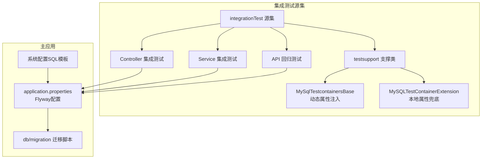
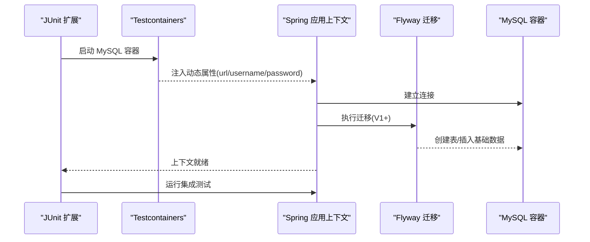
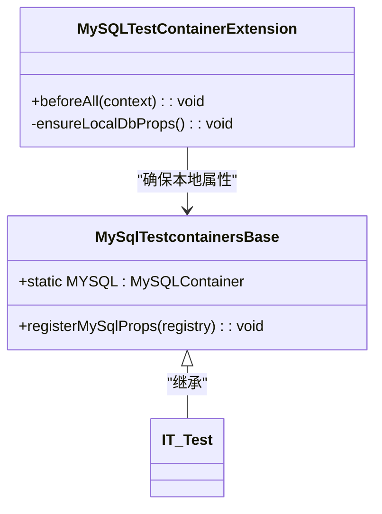
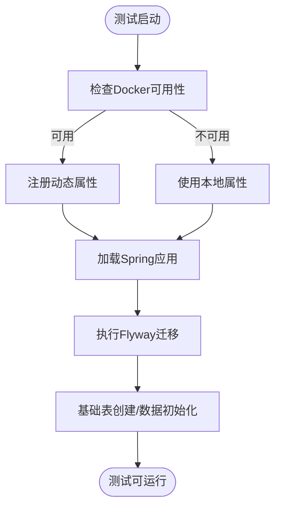
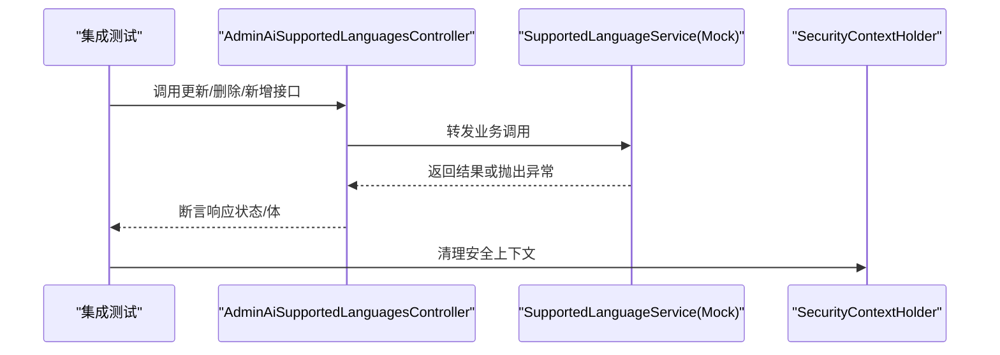
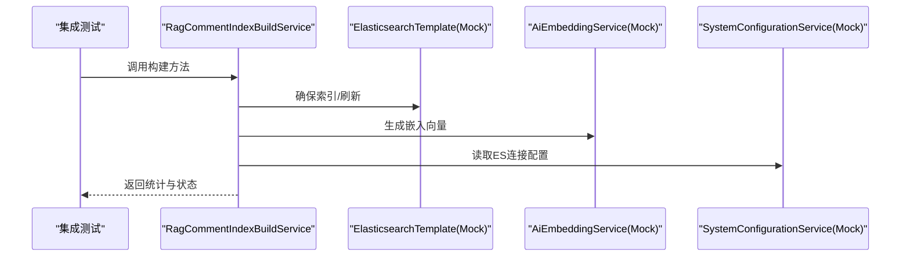
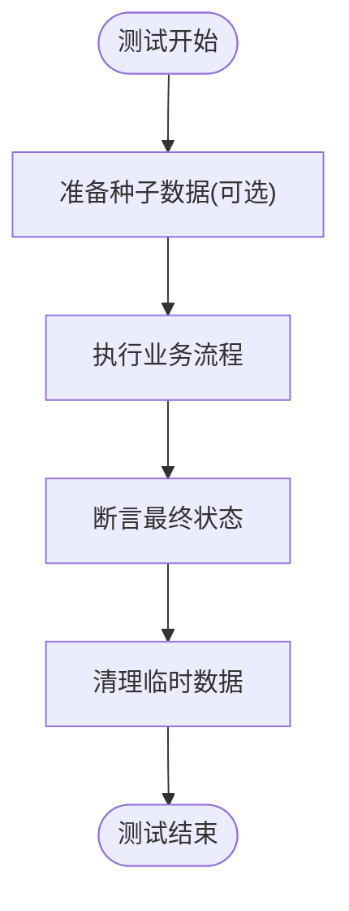
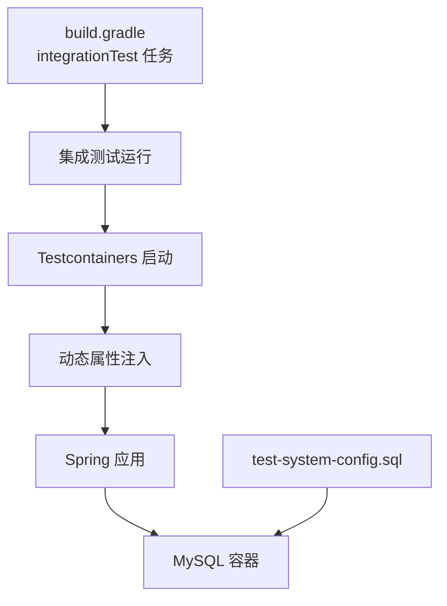
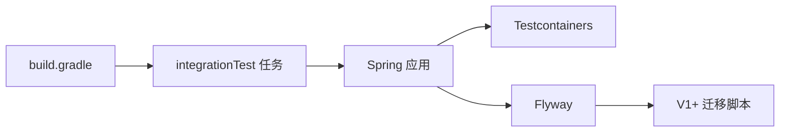

# 集成测试

<cite>
**本文引用的文件**   
- [MySQLTestContainerExtension.java](file://src/integrationTest/java/com/example/EnterpriseRagCommunity/testsupport/MySQLTestContainerExtension.java)
- [MySqlTestcontainersBase.java](file://src/integrationTest/java/com/example/EnterpriseRagCommunity/testsupport/MySqlTestcontainersBase.java)
- [AdminAiAdminControllersBranchIntegrationTest.java](file://src/integrationTest/java/com/example/EnterpriseRagCommunity/controller/ai/admin/AdminAiAdminControllersBranchIntegrationTest.java)
- [ModerationPrecheckRejectIntegrationTest.java](file://src/integrationTest/java/com/example/EnterpriseRagCommunity/service/moderation/jobs/ModerationPrecheckRejectIntegrationTest.java)
- [RagCommentIndexBuildServiceIntegrationTest.java](file://src/integrationTest/java/com/example/EnterpriseRagCommunity/service/retrieval/RagCommentIndexBuildServiceIntegrationTest.java)
- [ApiRegressionIntegrationTest.java](file://src/integrationTest/java/com/example/EnterpriseRagCommunity/ApiRegressionIntegrationTest.java)
- [SmokeIntegrationTest.java](file://src/integrationTest/java/com/example/EnterpriseRagCommunity/SmokeIntegrationTest.java)
- [application.properties](file://src/main/resources/application.properties)
- [V1__table_design.sql](file://src/main/resources/db/migration/V1__table_design.sql)
- [test-system-config.sql](file://src/test/resources/test-system-config.sql)
- [build.gradle](file://build.gradle)
</cite>

## 目录
1. [引言](#引言)
2. [项目结构](#项目结构)
3. [核心组件](#核心组件)
4. [架构总览](#架构总览)
5. [详细组件分析](#详细组件分析)
6. [依赖分析](#依赖分析)
7. [性能考虑](#性能考虑)
8. [故障排查指南](#故障排查指南)
9. [结论](#结论)
10. [附录](#附录)

## 引言
本文件面向Spring Boot应用的集成测试，重点覆盖以下方面：
- MySQL Testcontainers的配置与使用：容器启动、动态属性注入、Flyway迁移脚本执行、测试环境隔离
- Web层集成测试：Controller测试与API端点验证
- Service层集成测试：依赖注入、外部服务模拟、事务边界与数据一致性
- 数据库测试最佳实践：事务管理、数据清理、迁移脚本与系统配置同步
- 测试环境配置、Docker容器管理、测试数据同步策略

## 项目结构
集成测试位于独立的源集“integrationTest”中，与单元测试分离，并通过Gradle任务统一运行。核心支撑类位于testsupport包，用于在测试期间拉起MySQL容器并注入动态属性。

**图表来源**
- [MySqlTestcontainersBase.java:11-27](file://src/integrationTest/java/com/example/EnterpriseRagCommunity/testsupport/MySqlTestcontainersBase.java#L11-L27)
- [MySQLTestContainerExtension.java:6-32](file://src/integrationTest/java/com/example/EnterpriseRagCommunity/testsupport/MySQLTestContainerExtension.java#L6-L32)
- [application.properties:18-24](file://src/main/resources/application.properties#L18-L24)
- [V1__table_design.sql:1-200](file://src/main/resources/db/migration/V1__table_design.sql#L1-L200)
- [test-system-config.sql:1-21](file://src/test/resources/test-system-config.sql#L1-L21)

**章节来源**
- [build.gradle:201-227](file://build.gradle#L201-L227)
- [MySqlTestcontainersBase.java:11-27](file://src/integrationTest/java/com/example/EnterpriseRagCommunity/testsupport/MySqlTestcontainersBase.java#L11-L27)
- [MySQLTestContainerExtension.java:6-32](file://src/integrationTest/java/com/example/EnterpriseRagCommunity/testsupport/MySQLTestContainerExtension.java#L6-L32)

## 核心组件
- 动态属性注入基类：通过Testcontainers自动注入MySQL连接参数，确保测试与生产Flyway配置一致
- 本地属性兜底扩展：当Docker不可用时，回退到本地MySQL连接参数
- 集成测试样例：覆盖Controller分支、Service工作流、API端点回归与Smoke测试

**章节来源**
- [MySqlTestcontainersBase.java:11-27](file://src/integrationTest/java/com/example/EnterpriseRagCommunity/testsupport/MySqlTestcontainersBase.java#L11-L27)
- [MySQLTestContainerExtension.java:6-32](file://src/integrationTest/java/com/example/EnterpriseRagCommunity/testsupport/MySQLTestContainerExtension.java#L6-L32)
- [ApiRegressionIntegrationTest.java:13-35](file://src/integrationTest/java/com/example/EnterpriseRagCommunity/ApiRegressionIntegrationTest.java#L13-L35)
- [SmokeIntegrationTest.java:7-13](file://src/integrationTest/java/com/example/EnterpriseRagCommunity/SmokeIntegrationTest.java#L7-L13)

## 架构总览
下图展示了集成测试从容器启动到应用加载、Flyway迁移、业务逻辑执行的整体流程。

**图表来源**
- [MySqlTestcontainersBase.java:20-26](file://src/integrationTest/java/com/example/EnterpriseRagCommunity/testsupport/MySqlTestcontainersBase.java#L20-L26)
- [application.properties:18-24](file://src/main/resources/application.properties#L18-L24)
- [V1__table_design.sql:1-200](file://src/main/resources/db/migration/V1__table_design.sql#L1-L200)

## 详细组件分析

### MySQL Testcontainers 配置与使用
- 容器定义与动态属性注入：在抽象基类中声明静态MySQL容器实例，并通过@DynamicPropertySource将容器的JDBC URL、用户名、密码注入到Spring环境中
- Docker可用性检查：当Docker不可用时，使用Assumptions跳过测试，避免失败
- 本地回退机制：扩展类在静态初始化与beforeAll阶段确保本地属性存在，便于无Docker环境下的快速开发调试

**图表来源**
- [MySqlTestcontainersBase.java:11-27](file://src/integrationTest/java/com/example/EnterpriseRagCommunity/testsupport/MySqlTestcontainersBase.java#L11-L27)
- [MySQLTestContainerExtension.java:6-32](file://src/integrationTest/java/com/example/EnterpriseRagCommunity/testsupport/MySQLTestContainerExtension.java#L6-L32)

**章节来源**
- [MySqlTestcontainersBase.java:11-27](file://src/integrationTest/java/com/example/EnterpriseRagCommunity/testsupport/MySqlTestcontainersBase.java#L11-L27)
- [MySQLTestContainerExtension.java:6-32](file://src/integrationTest/java/com/example/EnterpriseRagCommunity/testsupport/MySQLTestContainerExtension.java#L6-L32)

### 数据库初始化与迁移脚本执行
- Flyway启用与位置：生产配置启用Flyway，迁移脚本位于classpath:db/migration
- 基础表设计：V1脚本包含用户、角色、权限、板块、内容等核心表结构
- 系统配置同步：测试阶段可通过test-system-config.sql将动态配置写入system_configurations表，供DynamicConfigurationLoader在运行时注入到Environment

**图表来源**
- [application.properties:18-24](file://src/main/resources/application.properties#L18-L24)
- [V1__table_design.sql:1-200](file://src/main/resources/db/migration/V1__table_design.sql#L1-L200)
- [test-system-config.sql:1-21](file://src/test/resources/test-system-config.sql#L1-L21)

**章节来源**
- [application.properties:18-24](file://src/main/resources/application.properties#L18-L24)
- [V1__table_design.sql:1-200](file://src/main/resources/db/migration/V1__table_design.sql#L1-L200)
- [test-system-config.sql:1-21](file://src/test/resources/test-system-config.sql#L1-L21)

### Web层集成测试：Controller测试与API端点验证
- 控制器分支覆盖：通过Mock Service层，验证Controller对不同输入的响应路径与异常处理
- API回归测试：以随机端口启动应用，验证公开端点返回码与关键字段
- 安全上下文清理：在每个测试后清理SecurityContextHolder，避免跨用例污染

**图表来源**
- [AdminAiAdminControllersBranchIntegrationTest.java:50-108](file://src/integrationTest/java/com/example/EnterpriseRagCommunity/controller/ai/admin/AdminAiAdminControllersBranchIntegrationTest.java#L50-L108)
- [AdminAiSupportedLanguagesController.java:1-59](file://src/main/java/com/example/EnterpriseRagCommunity/controller/ai/admin/AdminAiSupportedLanguagesController.java#L1-L59)

**章节来源**
- [AdminAiAdminControllersBranchIntegrationTest.java:50-108](file://src/integrationTest/java/com/example/EnterpriseRagCommunity/controller/ai/admin/AdminAiAdminControllersBranchIntegrationTest.java#L50-L108)
- [ApiRegressionIntegrationTest.java:13-35](file://src/integrationTest/java/com/example/EnterpriseRagCommunity/ApiRegressionIntegrationTest.java#L13-L35)

### Service层集成测试：依赖注入与外部服务模拟
- 服务工作流测试：通过Mock外部ES客户端、嵌入服务、系统配置服务等，验证复杂业务流程（如评论向量索引构建）
- JDBC直插测试：使用JdbcTemplate直接插入测试数据，绕过部分业务层约束，聚焦核心流程
- 管道步骤验证：在Moderation场景中，验证规则/向量步骤的动作与状态流转

**图表来源**
- [RagCommentIndexBuildServiceIntegrationTest.java:46-101](file://src/integrationTest/java/com/example/EnterpriseRagCommunity/service/retrieval/RagCommentIndexBuildServiceIntegrationTest.java#L46-L101)
- [ModerationPrecheckRejectIntegrationTest.java:42-113](file://src/integrationTest/java/com/example/EnterpriseRagCommunity/service/moderation/jobs/ModerationPrecheckRejectIntegrationTest.java#L42-L113)

**章节来源**
- [RagCommentIndexBuildServiceIntegrationTest.java:46-101](file://src/integrationTest/java/com/example/EnterpriseRagCommunity/service/retrieval/RagCommentIndexBuildServiceIntegrationTest.java#L46-L101)
- [ModerationPrecheckRejectIntegrationTest.java:42-113](file://src/integrationTest/java/com/example/EnterpriseRagCommunity/service/moderation/jobs/ModerationPrecheckRejectIntegrationTest.java#L42-L113)

### 数据库测试最佳实践：事务管理与数据清理
- 事务边界验证：通过自定义DummyTxManager与@EnableTransactionManagement，验证Service层事务边界与并发行为
- 数据清理策略：建议在每个测试后清理临时数据；对于需要保留的种子数据，优先使用Flyway V1中的基础数据
- 一致性校验：通过断言数据库最终状态（如队列状态、索引元数据）确保流程正确

**图表来源**
- [AdminModerationLlmServiceTransactionBoundaryTest.java:49-76](file://src/test/java/com/example/EnterpriseRagCommunity/service/moderation/admin/AdminModerationLlmServiceTransactionBoundaryTest.java#L49-L76)
- [V1__table_design.sql:1-200](file://src/main/resources/db/migration/V1__table_design.sql#L1-L200)

**章节来源**
- [AdminModerationLlmServiceTransactionBoundaryTest.java:49-76](file://src/test/java/com/example/EnterpriseRagCommunity/service/moderation/admin/AdminModerationLlmServiceTransactionBoundaryTest.java#L49-L76)

### 测试环境配置、Docker容器管理与测试数据同步
- Gradle集成测试任务：独立的integrationTest任务，与test任务并行运行，确保隔离
- Docker容器生命周期：容器随测试启动，动态属性注入Spring环境；Docker不可用时回退本地属性
- 测试数据同步：通过test-system-config.sql将测试所需的动态配置写入数据库，供运行时加载

**图表来源**
- [build.gradle:216-227](file://build.gradle#L216-L227)
- [MySqlTestcontainersBase.java:20-26](file://src/integrationTest/java/com/example/EnterpriseRagCommunity/testsupport/MySqlTestcontainersBase.java#L20-L26)
- [test-system-config.sql:1-21](file://src/test/resources/test-system-config.sql#L1-L21)

**章节来源**
- [build.gradle:216-227](file://build.gradle#L216-L227)
- [MySQLTestContainerExtension.java:6-32](file://src/integrationTest/java/com/example/EnterpriseRagCommunity/testsupport/MySQLTestContainerExtension.java#L6-L32)

## 依赖分析
- Testcontainers与Spring Boot：通过@DynamicPropertySource与Assumptions实现容器驱动的测试环境
- Gradle源集与任务：integrationTest源集与独立任务，确保与单元测试隔离
- Flyway与迁移脚本：生产配置启用Flyway，迁移脚本由V1起始，保证数据库结构一致性

**图表来源**
- [build.gradle:201-227](file://build.gradle#L201-L227)
- [application.properties:18-24](file://src/main/resources/application.properties#L18-L24)

**章节来源**
- [build.gradle:201-227](file://build.gradle#L201-L227)
- [application.properties:18-24](file://src/main/resources/application.properties#L18-L24)

## 性能考虑
- 容器启动成本：Testcontainers容器启动与迁移执行会增加测试总时长，建议在CI中并行运行多个集成测试任务
- 连接池与超时：生产配置中设置了合理的连接池与超时参数，测试中应保持一致以避免差异
- Mock外部服务：对外部ES、AI服务进行Mock，减少网络抖动对测试稳定性的影响

## 故障排查指南
- Docker不可用：确认Testcontainers扩展是否按预期回退到本地属性；检查DB_USERNAME/DB_PASSWORD环境变量
- 迁移失败：检查Flyway配置与迁移脚本完整性；确保V1脚本未被意外修改
- 端口冲突：API回归测试使用随机端口，若出现冲突需检查系统端口占用
- 安全上下文污染：确保每个测试后清理SecurityContextHolder，避免鉴权相关断言失败

**章节来源**
- [MySQLTestContainerExtension.java:6-32](file://src/integrationTest/java/com/example/EnterpriseRagCommunity/testsupport/MySQLTestContainerExtension.java#L6-L32)
- [application.properties:18-24](file://src/main/resources/application.properties#L18-L24)
- [ApiRegressionIntegrationTest.java:13-35](file://src/integrationTest/java/com/example/EnterpriseRagCommunity/ApiRegressionIntegrationTest.java#L13-L35)

## 结论
本项目通过Testcontainers实现了可靠的MySQL测试环境，结合动态属性注入与Flyway迁移，确保了数据库初始化的一致性与可重复性。Web层与Service层的集成测试分别覆盖了端点验证与业务流程，配合Mock策略提升了测试稳定性。建议在持续集成中并行运行集成测试任务，并在必要时引入更细粒度的数据清理策略以进一步提升测试效率与可靠性。

## 附录
- 推荐的测试数据同步策略：在测试前通过test-system-config.sql写入所需配置，在测试后清理临时数据，避免影响其他测试
- 事务边界验证：在需要时引入@EnableTransactionManagement与自定义事务管理器，验证Service层事务行为