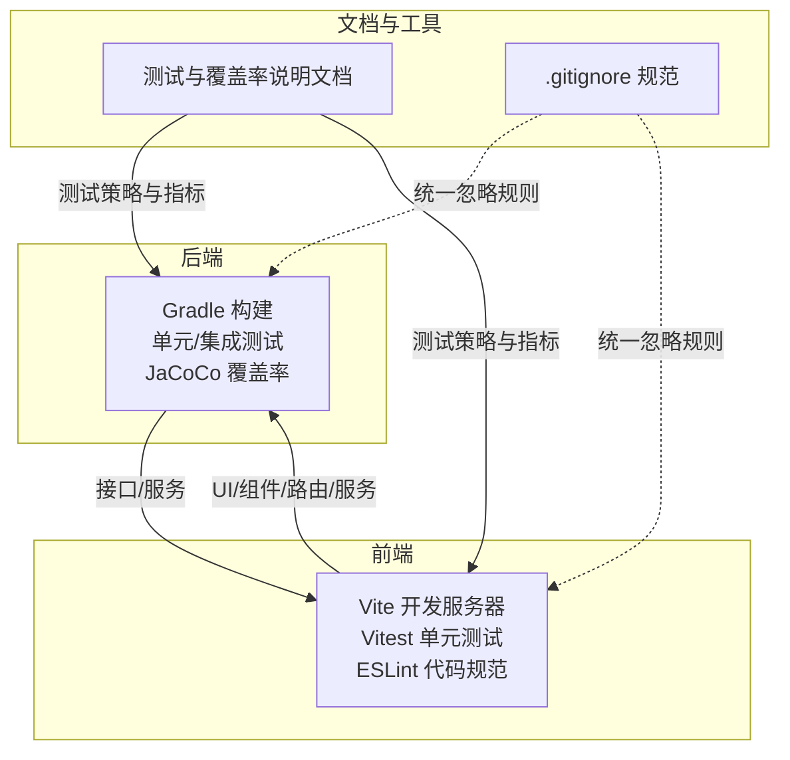
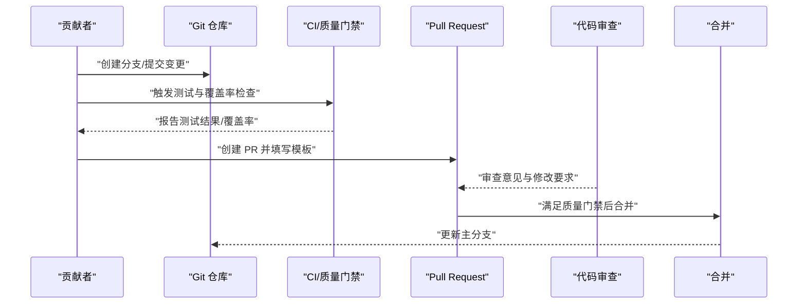
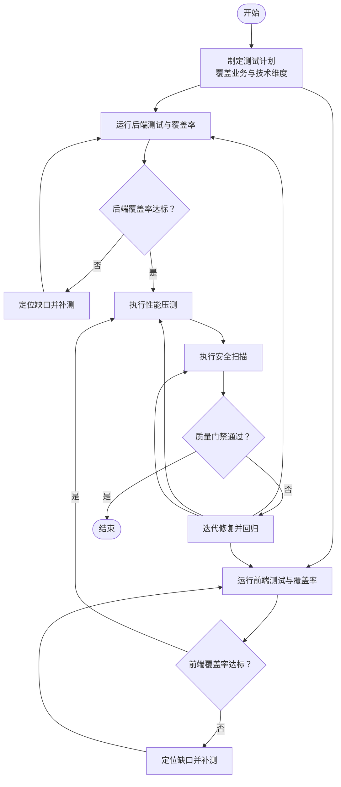
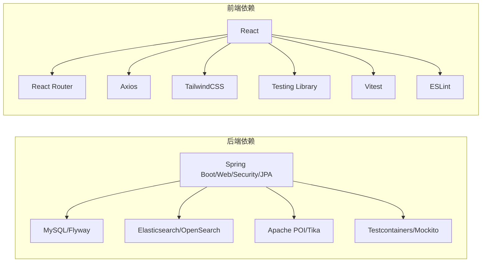

# 贡献指南

<cite>
**本文引用的文件**   
- [build.gradle](file://build.gradle)
- [settings.gradle](file://settings.gradle)
- [.gitignore](file://.gitignore)
- [package.json](file://my-vite-app/package.json)
- [eslint.config.js](file://my-vite-app/eslint.config.js)
- [vitest.config.ts](file://my-vite-app/vitest.config.ts)
- [自动化测试与指标说明.md](file://docs/自动化测试与指标说明.md)
- [docs/git操作指南.md](file://docs/git操作指南.md)
</cite>

## 目录
1. [引言](#引言)
2. [项目结构](#项目结构)
3. [核心组件](#核心组件)
4. [架构总览](#架构总览)
5. [详细组件分析](#详细组件分析)
6. [依赖分析](#依赖分析)
7. [性能考虑](#性能考虑)
8. [故障排查指南](#故障排查指南)
9. [结论](#结论)
10. [附录](#附录)

## 引言
本贡献指南面向企业级RAG社区平台的开发者与文档贡献者，系统阐述代码贡献流程、编码规范与质量标准，涵盖Git工作流、分支管理策略、Pull Request提交规范、开发环境搭建、代码审查标准、测试要求、文档贡献方式、问题报告模板与功能请求流程、许可证与知识产权政策，以及社区交流渠道与维护者联系方式。内容基于仓库现有构建脚本、测试与覆盖率配置、前端工程化配置及文档进行整理，确保新贡献者能够快速上手并高质量交付。

## 项目结构
本项目采用前后端分离与多模块协同的组织方式：
- 后端（Spring Boot + Gradle）
  - 源码位于 src/main/java，包含控制器、服务、仓储、实体、配置、安全与工具等模块化包结构
  - 构建与测试通过 Gradle 插件完成，支持单元测试、集成测试与覆盖率收集
- 前端（React + Vite + Vitest）
  - 源码位于 my-vite-app/src，使用 TypeScript 与 React 生态，组件、页面、服务、工具函数与类型定义清晰分层
  - 测试通过 Vitest + JSDOM 运行，生成 JUnit 与 HTML 覆盖率报告
- 文档与测试支撑
  - docs 目录包含测试与覆盖率说明、本地开发反向代理配置、分支覆盖率记录与任务清单等
  - .gitignore 规范了忽略文件与目录，避免无关产物进入版本控制

**图表来源**
- [build.gradle](file://build.gradle)
- [package.json](file://my-vite-app/package.json)
- [vitest.config.ts](file://my-vite-app/vitest.config.ts)
- [eslint.config.js](file://my-vite-app/eslint.config.js)
- [自动化测试与指标说明.md](file://docs/自动化测试与指标说明.md)
- [.gitignore](file://.gitignore)

**章节来源**
- [build.gradle](file://build.gradle)
- [settings.gradle](file://settings.gradle)
- [package.json](file://my-vite-app/package.json)
- [vitest.config.ts](file://my-vite-app/vitest.config.ts)
- [eslint.config.js](file://my-vite-app/eslint.config.js)
- [自动化测试与指标说明.md](file://docs/自动化测试与指标说明.md)
- [.gitignore](file://.gitignore)

## 核心组件
- 构建与测试体系
  - 后端：Gradle 插件负责编译、测试、打包与覆盖率生成，支持集成测试与聚焦测试
  - 前端：Vite 提供开发与构建，Vitest 负责单元测试与覆盖率，ESLint 保证代码风格
- 质量与安全
  - 依赖漏洞扫描（SCA）、性能压测（JMeter）、覆盖率门槛与报告汇总
- 文档与协作
  - 测试与覆盖率说明文档、Git 操作指南、本地开发反向代理配置

**章节来源**
- [build.gradle](file://build.gradle)
- [package.json](file://my-vite-app/package.json)
- [vitest.config.ts](file://my-vite-app/vitest.config.ts)
- [eslint.config.js](file://my-vite-app/eslint.config.js)
- [自动化测试与指标说明.md](file://docs/自动化测试与指标说明.md)
- [docs/git操作指南.md](file://docs/git操作指南.md)

## 架构总览
下图展示了贡献流程中的关键环节：本地开发、测试与覆盖率、代码规范检查、PR 提交与审查、CI/质量门禁与报告汇总。

**图表来源**
- [build.gradle](file://build.gradle)
- [package.json](file://my-vite-app/package.json)
- [vitest.config.ts](file://my-vite-app/vitest.config.ts)
- [自动化测试与指标说明.md](file://docs/自动化测试与指标说明.md)

## 详细组件分析

### Git 工作流与分支管理
- 分支策略
  - 建议采用功能分支开发，主分支保持稳定，发布前通过标签或分支保护策略管理
- 提交规范
  - 使用清晰的提交信息，遵循“类型: 概述”格式，必要时补充正文与关联 Issue
- 合并与保护
  - 主分支需通过测试与覆盖率门禁，建议开启保护分支与必需审查

**章节来源**
- [.gitignore](file://.gitignore)
- [docs/git操作指南.md](file://docs/git操作指南.md)

### Pull Request 提交规范
- 必填字段
  - 标题：简明扼要描述变更
  - 摘要：变更动机、影响范围、风险与回滚预案
  - 测试：列出新增/调整的测试用例与覆盖率变化
  - 附件：截图、性能对比、覆盖率报告链接
- 审查要点
  - 代码可读性、健壮性、安全性与性能
  - 是否满足测试与覆盖率要求
  - 是否引入新的依赖漏洞或破坏既有行为

**章节来源**
- [自动化测试与指标说明.md](file://docs/自动化测试与指标说明.md)
- [build.gradle](file://build.gradle)
- [package.json](file://my-vite-app/package.json)

### 开发环境搭建
- 后端
  - JDK 版本与工具链：Gradle 构建脚本指定 Java Toolchain 与 Release 版本，建议使用对应版本 JDK
  - 依赖与镜像：内置阿里云 Maven 镜像，网络不佳时可切换源
  - 运行与调试：通过 Gradle bootRun 启动，内嵌 Tomcat，JSP/JSTL/EL 引擎已配置
- 前端
  - Node.js 与包管理：安装依赖后使用 npm scripts 启动 dev、build、lint、test
  - ESLint：遵循配置规则，避免未使用变量与空块等常见问题
  - Vitest：单元测试与覆盖率，报告输出至 test-reports 目录
- 文档与本地代理
  - 参考文档中的本地开发反向代理配置，便于前后端联调

**章节来源**
- [build.gradle](file://build.gradle)
- [settings.gradle](file://settings.gradle)
- [package.json](file://my-vite-app/package.json)
- [eslint.config.js](file://my-vite-app/eslint.config.js)
- [vitest.config.ts](file://my-vite-app/vitest.config.ts)
- [docs/Win11-Nginx-本地开发反向代理配置.md](file://docs/Win11-Nginx-本地开发反向代理配置.md)

### 编码规范与质量标准
- 后端
  - 构建与测试：Gradle 插件启用 JUnit 平台、测试日志与并行度控制，集成测试独立任务
  - 覆盖率：JaCoCo 收集行/分支/方法覆盖，支持生成 HTML 报告与 XML 汇总
  - 依赖安全：集成依赖漏洞扫描插件，定期更新 NVD 数据库
- 前端
  - ESLint：推荐规则与自定义规则，关闭部分严格限制以提升开发效率
  - Vitest：JSDOM 环境、JUnit 报告与 HTML 覆盖率，排除静态资源与类型声明
- 文档与测试
  - 测试类型与报告：后端单元/集成测试、覆盖率、前端 Vitest、性能压测（JMeter）、安全扫描（SCA/DAST/npm audit）
  - 指标说明：建议从“业务维度”和“技术维度”双视角描述覆盖面，并如实披露不在覆盖范围内的场景

**章节来源**
- [build.gradle](file://build.gradle)
- [package.json](file://my-vite-app/package.json)
- [eslint.config.js](file://my-vite-app/eslint.config.js)
- [vitest.config.ts](file://my-vite-app/vitest.config.ts)
- [自动化测试与指标说明.md](file://docs/自动化测试与指标说明.md)

### 测试要求与覆盖率门槛
- 后端
  - 单元测试与集成测试：通过 Gradle 任务执行，覆盖率报告生成与汇总
  - 聚焦测试：支持按类或模式过滤，便于定向补测与验证
  - 覆盖率门槛：项目内置多类“100% 覆盖”与“≥95% 覆盖”验证任务，确保关键服务与作业的分支覆盖率达标
- 前端
  - 单元测试与覆盖率：Vitest 运行，HTML 与 JSON 汇总报告，排除静态资源与类型声明
  - 聚焦覆盖率：可通过脚本检查变更文件覆盖率与服务分支覆盖率
- 性能与安全
  - 性能压测：JMeter 脚本与报告产物路径，建议结合 Prometheus/Grafana 采集资源指标
  - 安全扫描：SCA（依赖漏洞）、DAST（ZAP 基线）、前端 npm audit

**图表来源**
- [自动化测试与指标说明.md](file://docs/自动化测试与指标说明.md)
- [build.gradle](file://build.gradle)
- [package.json](file://my-vite-app/package.json)

**章节来源**
- [自动化测试与指标说明.md](file://docs/自动化测试与指标说明.md)
- [build.gradle](file://build.gradle)
- [package.json](file://my-vite-app/package.json)

### 文档贡献方式
- 文档类型
  - 测试与覆盖率说明、本地开发配置、分支覆盖率记录、任务清单等
- 贡献流程
  - 在 docs 目录新增或修改文档，确保与测试/构建配置一致
  - 提交 PR 时在摘要中说明文档变更的目的、影响与参考链接
- 格式与规范
  - 使用 Markdown，标题层级清晰，必要时附带图表与来源标注

**章节来源**
- [自动化测试与指标说明.md](file://docs/自动化测试与指标说明.md)
- [docs/git操作指南.md](file://docs/git操作指南.md)

### 问题报告模板与功能请求流程
- 问题报告（Issue）
  - 标题：简洁描述问题
  - 环境：操作系统、JDK/Node 版本、数据库版本、浏览器版本
  - 复现步骤：最小可复现步骤与期望/实际结果
  - 日志与截图：测试报告、覆盖率报告、错误日志与截图
  - 关联标签：类型（缺陷/性能/安全）、模块（后端/前端/文档）、优先级
- 功能请求（Feature Request）
  - 背景与动机：解决的问题与收益
  - 方案概述：建议的实现思路与影响范围
  - 风险与回退：潜在风险与回滚预案
  - 附件：设计草图、原型图、性能评估

**章节来源**
- [自动化测试与指标说明.md](file://docs/自动化测试与指标说明.md)

### 许可证要求、版权声明与知识产权政策
- 许可证与版权
  - 本项目未在仓库中显式声明许可证与版权归属，请在提交前确认相关法律合规要求
- 知识产权
  - 贡献者需确保对所提交内容拥有合法权利，不侵犯第三方知识产权
  - 提交即默认同意遵守项目所在组织的开源政策与贡献者许可协议（CLA）

[本节为通用指导，无需特定文件来源]

### 社区交流渠道与维护者联系方式
- 交流渠道
  - 通过 Issue/PR 讨论技术方案与问题
  - 在文档中记录重要决策与路线图
- 维护者
  - 请在 PR 中 @ 维护者进行审查与合并

[本节为通用指导，无需特定文件来源]

## 依赖分析
- 后端依赖
  - Spring 生态（Web、Security、JPA、Actuator、Micrometer）、MySQL、Elasticsearch/OpenSearch、Flyway、POI/Tika、Testcontainers、Mockito、Swagger 等
- 前端依赖
  - React、React Router、Axios、TailwindCSS、Testing Library、Vitest、ESLint、TypeScript 等
- 工具链
  - Gradle、Vite、ESLint、JMeter、OWASP Dependency-Check、ZAP

**图表来源**
- [build.gradle](file://build.gradle)
- [package.json](file://my-vite-app/package.json)

**章节来源**
- [build.gradle](file://build.gradle)
- [package.json](file://my-vite-app/package.json)

## 性能考虑
- 性能压测
  - 使用 JMeter 脚本执行负载测试，关注吞吐量、P90/P95/P99 响应时间与错误率
  - 结合 Prometheus/Grafana 采集 CPU、内存、GC、线程数与 HTTP 耗时分布
- 资源指标
  - 通过 Actuator Prometheus 端点暴露指标，便于持续观测
- 建议
  - 在 PR 中附带性能对比数据与资源占用趋势，确保变更不会引入性能退化

**章节来源**
- [自动化测试与指标说明.md](file://docs/自动化测试与指标说明.md)

## 故障排查指南
- 构建与测试
  - 若 JaCoCo 报告缺失或覆盖率异常，检查执行数据文件与报告生成任务是否成功
  - 集成测试失败时，优先查看测试容器日志与数据库迁移状态
- 前端测试
  - Vitest 报告缺失或覆盖率不更新时，确认报告输出目录与脚本执行顺序
  - ESLint 报错时，根据规则提示修正未使用变量与空块等问题
- 性能与安全
  - JMeter 结果为空或仅表头时，检查目标服务可达性、协议与 TLS 设置
  - SCA 报告异常时，尝试更新/清理 NVD 数据库后重跑分析

**章节来源**
- [build.gradle](file://build.gradle)
- [package.json](file://my-vite-app/package.json)
- [vitest.config.ts](file://my-vite-app/vitest.config.ts)
- [eslint.config.js](file://my-vite-app/eslint.config.js)
- [自动化测试与指标说明.md](file://docs/自动化测试与指标说明.md)

## 结论
本指南基于仓库现有构建、测试与文档配置，提供了从环境搭建到代码贡献、从测试与覆盖率到性能与安全的全流程规范。建议贡献者在提交前对照测试与覆盖率说明，确保变更满足质量门禁，并在 PR 中提供充分的测试证据与说明，共同维护项目的稳定性与可维护性。

## 附录
- 快速检查清单
  - 本地测试全部通过，覆盖率达标
  - ESLint 无严重警告，代码风格一致
  - 前后端联调通过，文档更新同步
  - PR 模板填写完整，附带测试报告与性能对比

[本节为通用指导，无需特定文件来源]