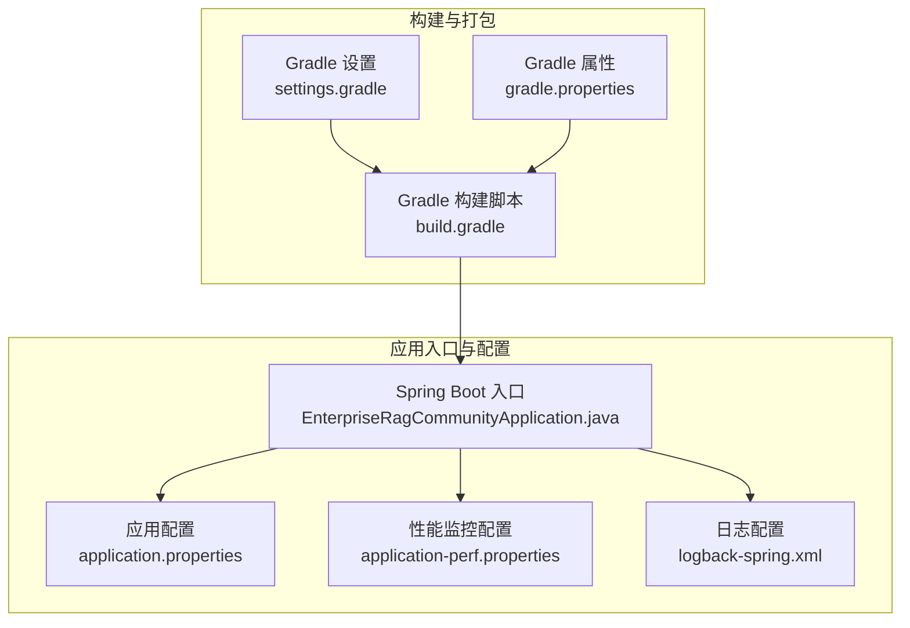
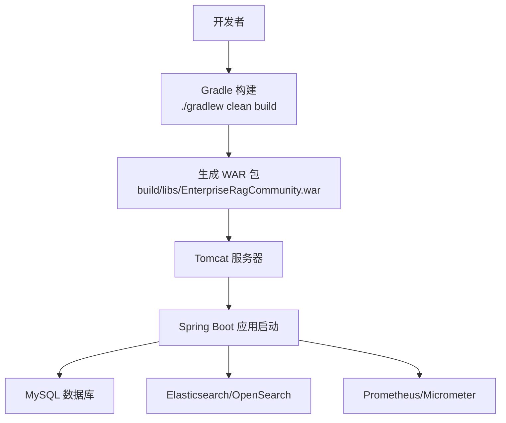
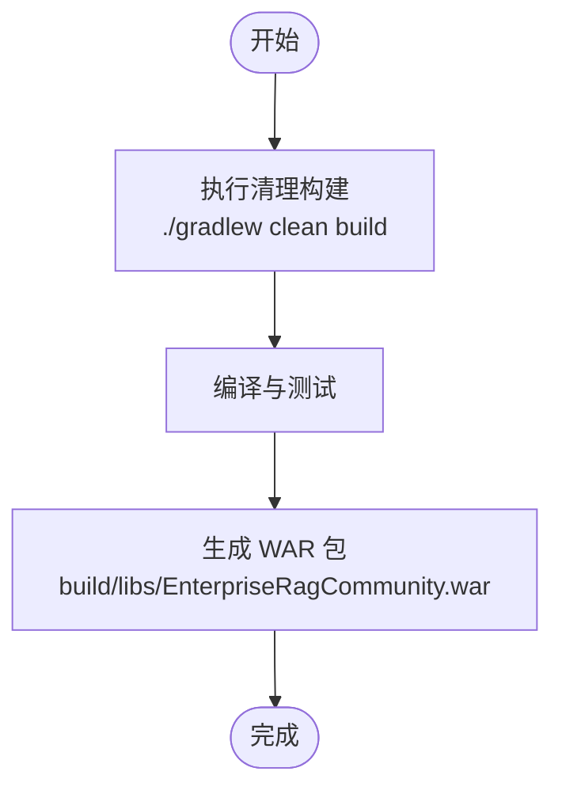
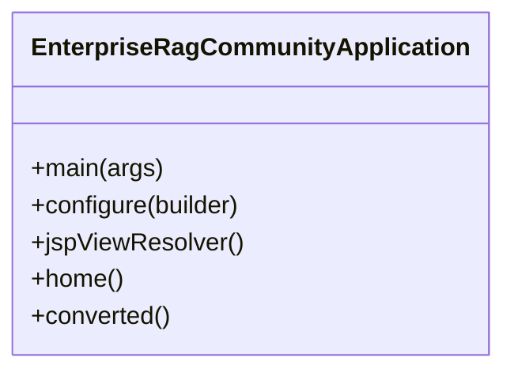
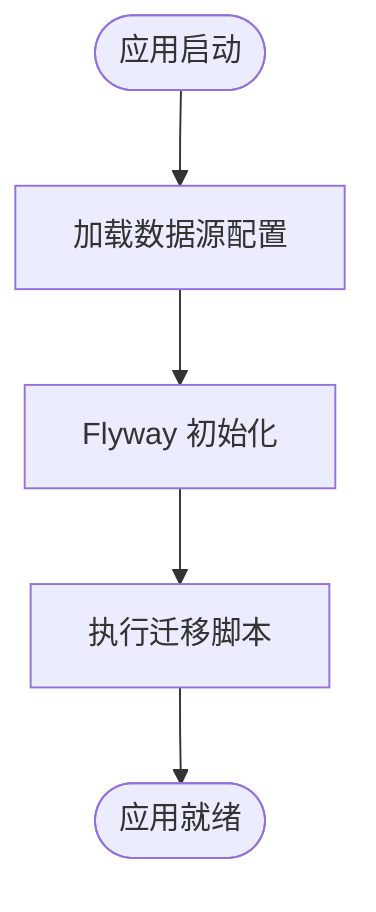
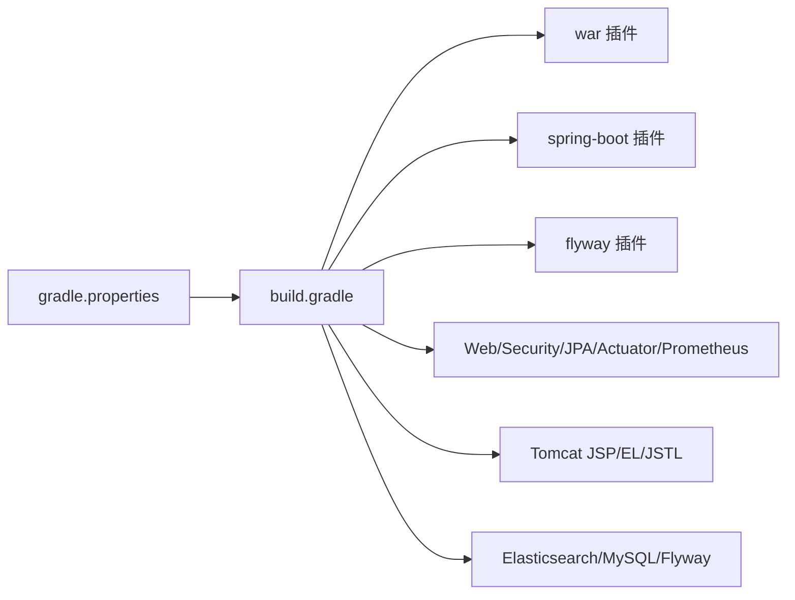

# 传统部署

<cite>
**本文引用的文件**
- [build.gradle](file://build.gradle)
- [settings.gradle](file://settings.gradle)
- [gradle.properties](file://gradle.properties)
- [application.properties](file://src/main/resources/application.properties)
- [application-perf.properties](file://src/main/resources/application-perf.properties)
- [logback-spring.xml](file://src/main/resources/logback-spring.xml)
- [EnterpriseRagCommunityApplication.java](file://src/main/java/com/example/EnterpriseRagCommunity/EnterpriseRagCommunityApplication.java)
</cite>

## 目录
1. [引言](#引言)
2. [项目结构](#项目结构)
3. [核心组件](#核心组件)
4. [架构总览](#架构总览)
5. [详细组件分析](#详细组件分析)
6. [依赖分析](#依赖分析)
7. [性能考虑](#性能考虑)
8. [故障排除指南](#故障排除指南)
9. [结论](#结论)
10. [附录](#附录)

## 引言
本指南面向需要以传统 WAR 包方式部署本项目的运维与开发人员，覆盖以下内容：
- 使用 Gradle 构建 WAR 包的完整命令与产物位置
- 在 Tomcat 服务器上部署与启动应用的步骤
- 关键配置文件 application.properties 的参数说明与生产环境建议
- 数据库连接与 Flyway 初始化策略
- 外部服务集成（邮件、Elasticsearch/OpenSearch、Prometheus/Micrometer）
- 部署验证、日志检查与常见问题排查
- 性能调优与监控配置建议

## 项目结构
本项目采用 Spring Boot 3.x + Gradle 构建，核心特性包括：
- 使用 Spring Boot Gradle 插件与 war 插件，启用 bootWar 并禁用 bootJar，确保输出为 WAR
- 内嵌 Tomcat（JSP/JSTL/EL 支持），便于传统部署
- 通过 Spring Boot Servlet initializer 将应用适配为可部署到外部容器的 WAR
- 提供 application.properties 与 application-perf.properties 两类配置文件，分别用于运行时与监控暴露

**图表来源**
- [build.gradle:14-30](file://build.gradle#L14-L30)
- [settings.gradle:1-15](file://settings.gradle#L1-L15)
- [gradle.properties:1-13](file://gradle.properties#L1-L13)
- [EnterpriseRagCommunityApplication.java:20-35](file://src/main/java/com/example/EnterpriseRagCommunity/EnterpriseRagCommunityApplication.java#L20-L35)
- [application.properties:1-84](file://src/main/resources/application.properties#L1-L84)
- [application-perf.properties:1-6](file://src/main/resources/application-perf.properties#L1-L6)
- [logback-spring.xml:1-8](file://src/main/resources/logback-spring.xml#L1-L8)

**章节来源**
- [build.gradle:14-30](file://build.gradle#L14-L30)
- [settings.gradle:1-15](file://settings.gradle#L1-L15)
- [gradle.properties:1-13](file://gradle.properties#L1-L13)
- [EnterpriseRagCommunityApplication.java:20-35](file://src/main/java/com/example/EnterpriseRagCommunity/EnterpriseRagCommunityApplication.java#L20-L35)
- [application.properties:1-84](file://src/main/resources/application.properties#L1-L84)
- [application-perf.properties:1-6](file://src/main/resources/application-perf.properties#L1-L6)
- [logback-spring.xml:1-8](file://src/main/resources/logback-spring.xml#L1-L8)

## 核心组件
- 构建与打包：通过 Gradle 启用 war 插件与 bootWar，输出名为 EnterpriseRagCommunity.war
- 应用入口：继承 SpringBootServletInitializer，支持外部容器部署
- 配置体系：application.properties 提供运行期配置；application-perf.properties 暴露管理端点与 Prometheus
- 日志系统：基于 Logback，统一控制台与文件编码

**章节来源**
- [build.gradle:27-29](file://build.gradle#L27-L29)
- [EnterpriseRagCommunityApplication.java:24-35](file://src/main/java/com/example/EnterpriseRagCommunity/EnterpriseRagCommunityApplication.java#L24-L35)
- [application.properties:1-84](file://src/main/resources/application.properties#L1-L84)
- [application-perf.properties:1-6](file://src/main/resources/application-perf.properties#L1-L6)
- [logback-spring.xml:1-8](file://src/main/resources/logback-spring.xml#L1-L8)

## 架构总览
下图展示从构建到部署的关键路径与交互。

**图表来源**
- [build.gradle:90-91](file://build.gradle#L90-L91)
- [application.properties:7-16](file://src/main/resources/application.properties#L7-L16)
- [application-perf.properties:1-6](file://src/main/resources/application-perf.properties#L1-L6)

## 详细组件分析

### 构建与 WAR 生成
- 启用 war 插件与 bootWar，并将归档文件名固定为 EnterpriseRagCommunity.war
- 禁用 bootJar，确保仅输出 WAR
- 内嵌 Tomcat 依赖（JSP/EL/JSTL）已声明，满足传统部署需求

**图表来源**
- [build.gradle:14-30](file://build.gradle#L14-L30)
- [build.gradle:90-91](file://build.gradle#L90-L91)

**章节来源**
- [build.gradle:14-30](file://build.gradle#L14-L30)
- [build.gradle:90-91](file://build.gradle#L90-L91)

### 应用入口与容器适配
- 继承 SpringBootServletInitializer 并重写 configure 方法，使应用可作为 WAR 部署到外部 Tomcat
- 注册 JSP 视图解析器，指定前缀与后缀，限定处理特定视图名

**图表来源**
- [EnterpriseRagCommunityApplication.java:24-52](file://src/main/java/com/example/EnterpriseRagCommunity/EnterpriseRagCommunityApplication.java#L24-L52)

**章节来源**
- [EnterpriseRagCommunityApplication.java:24-52](file://src/main/java/com/example/EnterpriseRagCommunity/EnterpriseRagCommunityApplication.java#L24-L52)

### 配置文件与参数说明
- application.properties
  - 数据源与连接池：驱动、URL、用户名、密码、最大池大小、空闲与生命周期等
  - Flyway：启用、迁移脚本位置、基线策略、编码等
  - 服务器：端口、上下文路径、字符集
  - 上传：文件与请求大小限制
  - 日志：文件名、滚动策略、根与模块日志级别
  - 租户与访问日志捕获
  - 上传存储根路径与 URL 前缀
  - 动态配置键（Master Key）
  - AI 默认超时与历史限制
  - OpenSearch 平台主机、工作空间、服务 ID、连接与读超时
  - Elasticsearch 连接超时、Socket 超时、凭据
  - JPA：关闭 open-in-view
- application-perf.properties
  - 管理端地址与端口
  - 暴露端点：health、info、prometheus、metrics
  - 健康检查详情策略
  - 指标标签中的应用名

**章节来源**
- [application.properties:1-84](file://src/main/resources/application.properties#L1-L84)
- [application-perf.properties:1-6](file://src/main/resources/application-perf.properties#L1-L6)

### 数据库与 Flyway 初始化
- 数据源：MySQL 驱动与 URL，支持通过环境变量注入用户名与密码
- 连接池：HikariCP 参数可按需调整
- Flyway：启用迁移，支持自定义迁移脚本位置、基线版本与编码

**图表来源**
- [application.properties:7-24](file://src/main/resources/application.properties#L7-L24)

**章节来源**
- [application.properties:7-24](file://src/main/resources/application.properties#L7-L24)

### 外部服务集成
- 邮件：Spring Mail Starter 已引入
- Elasticsearch/OpenSearch：Spring Data Elasticsearch 与连接超时、凭据配置
- Prometheus/Micrometer：Actuator 与 Prometheus 注册器已引入，管理端点暴露

**章节来源**
- [build.gradle:102-131](file://build.gradle#L102-L131)
- [application.properties:72-83](file://src/main/resources/application.properties#L72-L83)
- [application-perf.properties:1-6](file://src/main/resources/application-perf.properties#L1-L6)

### 日志与监控
- 日志：Logback 配置文件统一控制台与文件编码
- 监控：管理端口仅绑定本地地址，仅暴露健康、信息、Prometheus 与指标端点

**章节来源**
- [logback-spring.xml:1-8](file://src/main/resources/logback-spring.xml#L1-L8)
- [application-perf.properties:1-6](file://src/main/resources/application-perf.properties#L1-L6)

## 依赖分析
- 构建插件与任务
  - war、spring-boot、dependency-management、flyway、jacoco、sonarqube、owasp-dependencycheck
  - bootWar 启用，bootJar 禁用
  - 测试任务配置了 JVM 参数与并发策略
- 运行时依赖
  - Web、Validation、Mail、JPA、Security、Actuator、Prometheus、内嵌 Tomcat JSP/EL/JSTL
  - Elasticsearch 客户端、MySQL 驱动、Flyway
- Gradle 属性
  - JVM 参数、Java 版本、Flyway 连接信息

**图表来源**
- [build.gradle:14-23](file://build.gradle#L14-L23)
- [build.gradle:102-131](file://build.gradle#L102-L131)
- [gradle.properties:1-13](file://gradle.properties#L1-L13)

**章节来源**
- [build.gradle:14-23](file://build.gradle#L14-L23)
- [build.gradle:102-131](file://build.gradle#L102-L131)
- [gradle.properties:1-13](file://gradle.properties#L1-L13)

## 性能考虑
- 连接池参数：根据并发与数据库能力调整最大池大小、空闲与生命周期
- 上传与表单：针对大文件场景适当提高上传与表单大小限制
- 日志滚动：合理设置单文件大小、保留天数与总容量，避免磁盘压力
- 监控端点：仅暴露必要端点，避免对外网暴露敏感信息
- JVM 参数：结合实际内存与 GC 行为优化堆大小与元空间

[本节为通用建议，无需特定文件引用]

## 故障排除指南
- 构建失败
  - 确认 Gradle Wrapper 与 JDK 版本匹配（Java 21）
  - 清理缓存后重试：./gradlew clean build
- WAR 无法部署到 Tomcat
  - 确认已生成 EnterpriseRagCommunity.war
  - 检查 Tomcat 是否包含 JSP/EL/JSTL 依赖（项目已声明）
- 数据库连接错误
  - 校验 DB_USERNAME、DB_PASSWORD 与数据库连通性
  - 如需基线迁移，确认 Flyway 基线策略与脚本位置
- 应用启动后无法访问
  - 检查 server.port 与 context-path
  - 查看日志文件定位异常
- 监控端点不可用
  - 确认 management.server.address 与端口未被防火墙阻断
  - 仅本地暴露管理端点符合安全最佳实践

**章节来源**
- [build.gradle:90-91](file://build.gradle#L90-L91)
- [application.properties:7-16](file://src/main/resources/application.properties#L7-L16)
- [application-perf.properties:1-6](file://src/main/resources/application-perf.properties#L1-L6)

## 结论
本指南提供了从构建到部署、从配置到监控的全流程说明。遵循本文步骤，可在传统 Tomcat 环境稳定运行本应用，并通过合理的参数与监控配置保障生产可用性。

[本节为总结，无需特定文件引用]

## 附录

### A. 构建与部署清单
- 构建 WAR
  - 执行命令：./gradlew clean build
  - 产物位置：build/libs/EnterpriseRagCommunity.war
- 部署到 Tomcat
  - 将 WAR 放入 Tomcat webapps 目录或通过 Manager 部署
  - 启动 Tomcat，等待应用启动完成
- 应用启动配置
  - 端口与上下文：server.port、server.servlet.context-path
  - 数据库：spring.datasource.url、DB_USERNAME、DB_PASSWORD
  - 日志：logging.file.name、logging.logback.rollingpolicy.*
  - 监控：management.server.port、management.endpoints.web.exposure.include

**章节来源**
- [build.gradle:27-29](file://build.gradle#L27-L29)
- [build.gradle:90-91](file://build.gradle#L90-L91)
- [application.properties:27-43](file://src/main/resources/application.properties#L27-L43)
- [application-perf.properties:1-6](file://src/main/resources/application-perf.properties#L1-L6)

### B. application-prod.properties 参数对照表
- 数据库连接
  - spring.datasource.url：数据库连接串
  - spring.datasource.username：数据库用户名
  - spring.datasource.password：数据库密码
  - Hikari 连接池参数：maximum-pool-size、minimum-idle、connection-timeout、validation-timeout、idle-timeout、max-lifetime
- Flyway
  - spring.flyway.enabled：是否启用
  - spring.flyway.locations：迁移脚本位置
  - spring.flyway.baseline-on-migrate：迁移时是否基线
  - spring.flyway.encoding：迁移脚本编码
- 服务器
  - server.port：HTTP 端口
  - server.servlet.context-path：上下文路径
  - server.servlet.encoding：字符集与强制策略
- 上传
  - spring.servlet.multipart.*：文件与请求大小限制
  - server.tomcat.max-http-form-post-size、server.tomcat.max-swallow-size
- 日志
  - logging.file.name：日志文件路径
  - logging.logback.rollingpolicy.*：滚动策略参数
  - logging.level.*：根与模块日志级别
- AI 与外部服务
  - app.ai.*：AI 调用超时与历史限制
  - app.opensearch.platform.*：OpenSearch 平台主机、工作空间、服务 ID、连接与读超时
  - spring.elasticsearch.*：Elasticsearch 连接超时、Socket 超时、凭据
- 监控
  - management.server.*：管理端地址与端口
  - management.endpoints.web.exposure.include：暴露端点
  - management.endpoint.health.show-details：健康检查详情策略
  - management.metrics.tags.application：指标标签

**章节来源**
- [application.properties:1-84](file://src/main/resources/application.properties#L1-L84)
- [application-perf.properties:1-6](file://src/main/resources/application-perf.properties#L1-L6)