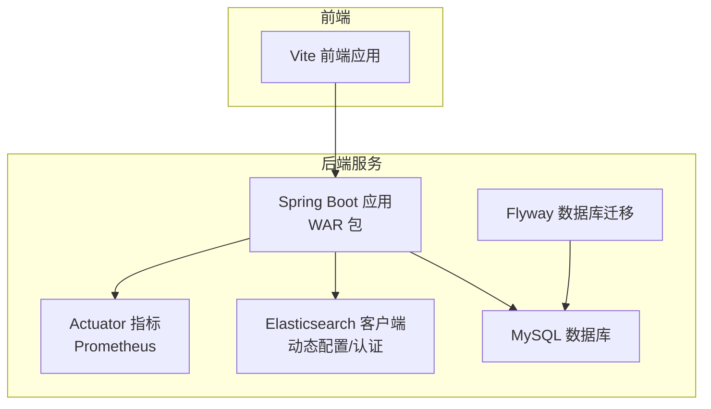
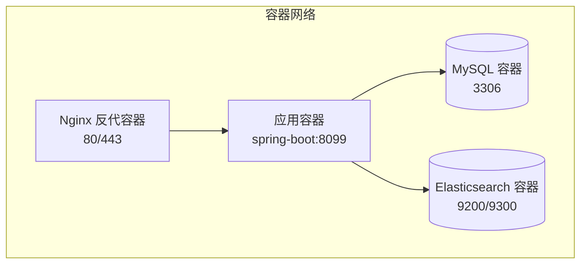
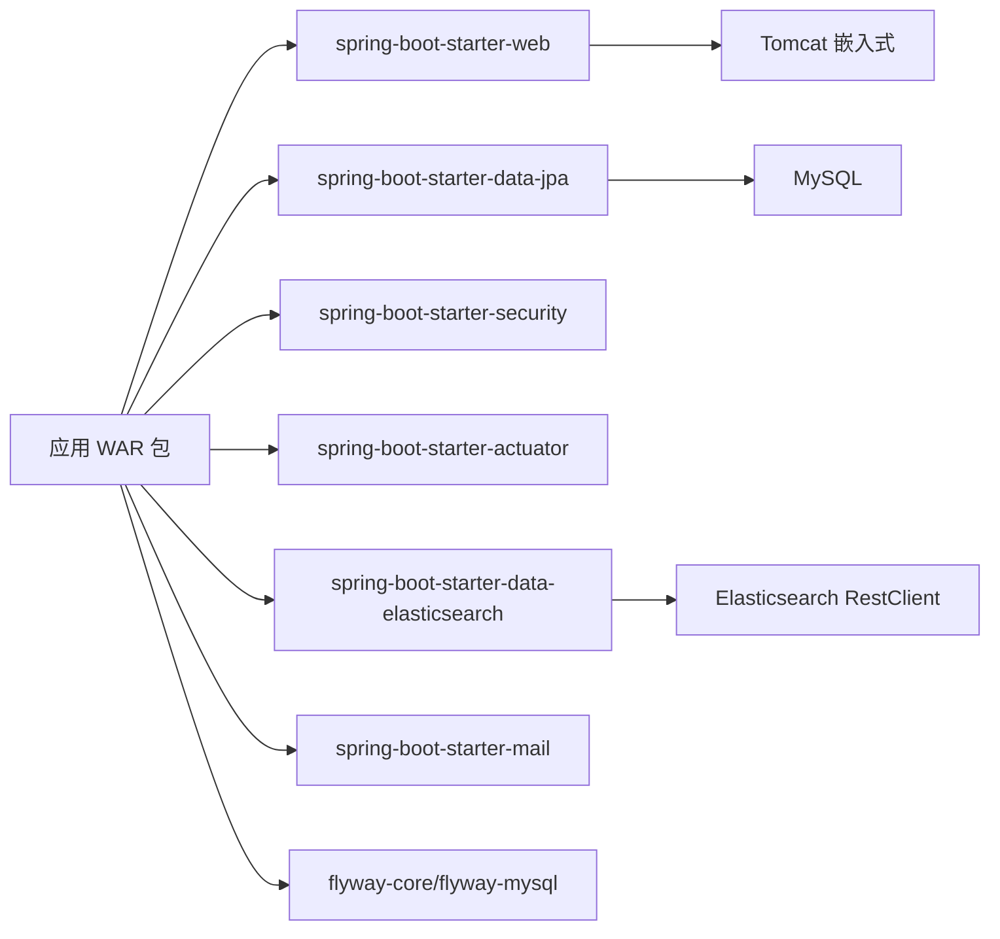

# 容器化部署

<cite>
**本文引用的文件**   
- [build.gradle](file://build.gradle)
- [settings.gradle](file://settings.gradle)
- [application.properties](file://src/main/resources/application.properties)
- [V1__table_design.sql](file://src/main/resources/db/migration/V1__table_design.sql)
- [DynamicElasticsearchConfig.java](file://src/main/java/com/example/EnterpriseRagCommunity/config/DynamicElasticsearchConfig.java)
- [ElasticsearchAuthConfigValidator.java](file://src/main/java/com/example/EnterpriseRagCommunity/config/ElasticsearchAuthConfigValidator.java)
- [ElasticsearchIkAnalyzerProbe.java](file://src/main/java/com/example/EnterpriseRagCommunity/service/es/ElasticsearchIkAnalyzerProbe.java)
- [package.json](file://my-vite-app/package.json)
</cite>

## 目录
1. [引言](#引言)
2. [项目结构](#项目结构)
3. [核心组件](#核心组件)
4. [架构总览](#架构总览)
5. [详细组件分析](#详细组件分析)
6. [依赖分析](#依赖分析)
7. [性能考量](#性能考量)
8. [故障排查指南](#故障排查指南)
9. [结论](#结论)
10. [附录](#附录)

## 引言
本指南面向企业级RAG社区项目的容器化部署，覆盖Docker镜像构建、容器配置、多容器编排、镜像优化与安全加固、网络与数据卷、环境变量传递、监控与日志、健康检查以及生产部署建议与扩展性考虑。文档基于仓库中的Gradle构建脚本、Spring Boot配置、数据库迁移脚本、Elasticsearch动态配置与认证校验等关键文件进行分析与提炼。

## 项目结构
该工程采用Spring Boot + Gradle多模块风格，后端以WAR包形式打包，前端位于独立的Vite应用目录。后端服务依赖MySQL与Elasticsearch，具备Flyway数据库迁移能力，并通过Actuator与Prometheus集成实现可观测性。

**图表来源**
- [build.gradle:102-138](file://build.gradle#L102-L138)
- [application.properties:7-84](file://src/main/resources/application.properties#L7-L84)
- [DynamicElasticsearchConfig.java:92-126](file://src/main/java/com/example/EnterpriseRagCommunity/config/DynamicElasticsearchConfig.java#L92-L126)

**章节来源**
- [build.gradle:102-138](file://build.gradle#L102-L138)
- [application.properties:7-84](file://src/main/resources/application.properties#L7-L84)

## 核心组件
- 后端应用：基于Spring Boot 3.x，启用Web、JPA、Security、Actuator、Elasticsearch客户端等起步依赖。
- 数据库：MySQL 8.0，使用Flyway进行迁移管理。
- 搜索引擎：Elasticsearch，支持动态配置与ApiKey认证。
- 前端：Vite React应用，独立构建产物供后端静态资源托管或反向代理。

**章节来源**
- [build.gradle:102-138](file://build.gradle#L102-L138)
- [application.properties:7-84](file://src/main/resources/application.properties#L7-L84)
- [V1__table_design.sql:1-200](file://src/main/resources/db/migration/V1__table_design.sql#L1-L200)

## 架构总览
下图展示了容器化部署下的典型拓扑：应用容器、数据库容器、搜索引擎容器通过自定义网络互联；前端可通过Nginx反代或直接由应用提供静态资源；容器间通过服务名解析通信，数据持久化通过命名卷完成。

[此图为概念性拓扑示意，不对应具体源码文件]

## 详细组件分析

### Dockerfile 最佳实践
- 基础镜像选择
  - 使用官方OpenJDK镜像作为基础，确保运行时一致性和安全基线。
  - 选择与Gradle工具链一致的Java版本（仓库使用Java 21）。
- 分层优化
  - 将依赖下载与编译步骤分离，利用缓存提升增量构建效率。
  - 排除不必要的开发依赖与构建工具，缩小镜像体积。
- 运行用户与权限
  - 以非root用户运行应用进程，降低攻击面。
- JVM参数
  - 设置合理的堆大小、元空间与GC参数，结合容器CPU/内存限制进行调优。
- 入口命令
  - 使用spring-boot插件生成的可执行WAR或内嵌Tomcat方式启动，确保端口与上下文路径正确。

[本节为通用最佳实践说明，未直接分析具体文件]

### 镜像优化技巧
- 多阶段构建：分离构建阶段与运行阶段，仅将最终产物复制到运行镜像。
- 层缓存策略：固定依赖版本，先复制依赖再复制源码，最大化缓存命中。
- 清理构建产物：移除临时文件、日志与调试符号。
- 压缩与去重：使用更小的基础镜像，合并RUN指令减少层数。

[本节为通用优化建议，未直接分析具体文件]

### 安全配置
- 环境变量注入
  - 通过环境变量传递数据库凭据、ES认证密钥、日志级别与文件路径等敏感信息。
- 认证与授权
  - Elasticsearch优先使用ApiKey认证；后端通过动态配置加载认证信息。
- 端口与协议
  - 默认HTTP端口8099；如启用HTTPS需在反向代理层处理证书。
- 文件权限
  - 挂载日志与上传目录时，确保容器内用户具有写权限。

**章节来源**
- [application.properties:7-84](file://src/main/resources/application.properties#L7-L84)
- [DynamicElasticsearchConfig.java:115-123](file://src/main/java/com/example/EnterpriseRagCommunity/config/DynamicElasticsearchConfig.java#L115-L123)

### docker-compose.yml 编排示例
- 应用容器
  - 映射端口至宿主机8099；挂载日志与上传目录；注入环境变量。
  - 依赖数据库与搜索引擎容器，使用健康检查等待其就绪。
- 数据库容器
  - 使用MySQL 8.0，初始化数据库与用户；持久化数据卷。
- 搜索引擎容器
  - 使用Elasticsearch 8.x，开启安全或保持开放以便测试；持久化数据卷。
- 反向代理（可选）
  - Nginx容器提供静态资源与TLS终止，转发请求至应用容器。

[本节为编排思路说明，未直接分析具体文件]

### 容器网络配置
- 自定义网络：将应用、数据库、搜索引擎置于同一网络，便于通过服务名访问。
- 服务发现：容器间通过服务名与端口通信，避免硬编码IP。
- 端口映射：仅暴露必要端口，内部服务间使用桥接网络。

[本节为通用网络设计说明，未直接分析具体文件]

### 数据卷挂载与环境变量传递
- 数据卷
  - MySQL：/var/lib/mysql（初始化数据与二进制日志）
  - Elasticsearch：/usr/share/elasticsearch/data（索引数据）
  - 应用：/opt/app/logs（日志）、/opt/app/uploads（上传文件）
- 环境变量
  - 数据库：DB_USERNAME、DB_PASSWORD、DB_POOL_MAX、DB_POOL_CONN_TIMEOUT_MS
  - Elasticsearch：SPRING_ELASTICSEARCH_USERNAME、SPRING_ELASTICSEARCH_PASSWORD、APP_ES_API_KEY
  - 日志与性能：LOG_LEVEL_ROOT、LOG_FILE、LOG_MAX_FILE_SIZE、LOG_MAX_HISTORY

**章节来源**
- [application.properties:7-84](file://src/main/resources/application.properties#L7-L84)

### 健康检查与可观测性
- 健康检查
  - 应用容器：对/actuator/health发起HTTP探测，失败次数与超时合理配置。
  - 数据库与搜索引擎：使用TCP/HTTP探测确认端口可用。
- 指标与告警
  - 启用Actuator与Prometheus，导出JVM与业务指标。
  - 结合外部监控系统（如Grafana/Prometheus）建立告警规则。

**章节来源**
- [build.gradle:110-111](file://build.gradle#L110-L111)

### 前端构建与部署
- 前端应用使用Vite构建，产物位于dist目录。
- 方案A：将dist作为静态资源由后端提供或通过Nginx提供。
- 方案B：将dist构建产物复制到后端静态资源目录，随WAR一起发布。

**章节来源**
- [package.json:1-82](file://my-vite-app/package.json#L1-L82)

## 依赖分析
后端依赖关系与运行时要求如下：

**图表来源**
- [build.gradle:102-138](file://build.gradle#L102-L138)
- [application.properties:7-84](file://src/main/resources/application.properties#L7-L84)

**章节来源**
- [build.gradle:102-138](file://build.gradle#L102-L138)
- [application.properties:7-84](file://src/main/resources/application.properties#L7-L84)

## 性能考量
- JVM调优
  - 合理设置最大堆与元空间，避免频繁Full GC。
  - 使用G1GC并结合容器内存限制进行参数匹配。
- 连接池
  - HikariCP连接池参数按业务并发调整，避免连接泄漏。
- 搜索引擎
  - ES写入批处理与刷新策略平衡吞吐与延迟。
- 数据库
  - Flyway迁移在启动阶段完成，避免运行时DDL风暴。

[本节为通用性能建议，未直接分析具体文件]

## 故障排查指南
- Elasticsearch认证问题
  - 若未配置API Key，ES安全启用时将返回401；需在系统配置中注入APP_ES_API_KEY。
  - 动态配置支持热切换，变更后触发客户端刷新。
- 数据库连接异常
  - 检查DB_USERNAME/DB_PASSWORD与连接串；确认Hikari连接池参数。
  - Flyway迁移失败时查看迁移脚本与版本冲突。
- 日志定位
  - 通过LOG_FILE与LOG_LEVEL_ROOT定位问题；关注访问日志与错误栈。
- 健康检查失败
  - 检查Actuator端点可达性与依赖服务状态。

**章节来源**
- [ElasticsearchAuthConfigValidator.java:23-31](file://src/main/java/com/example/EnterpriseRagCommunity/config/ElasticsearchAuthConfigValidator.java#L23-L31)
- [DynamicElasticsearchConfig.java:57-79](file://src/main/java/com/example/EnterpriseRagCommunity/config/DynamicElasticsearchConfig.java#L57-L79)
- [application.properties:7-84](file://src/main/resources/application.properties#L7-L84)

## 结论
通过合理的Docker镜像构建、多容器编排与安全加固，结合健康检查与可观测性，可实现企业级RAG社区的稳定、可扩展与易维护部署。建议在生产环境中启用ES认证、最小权限原则、只读根文件系统与受限资源配额，并配合CI/CD流水线自动化构建与发布。

## 附录
- 关键配置项速查
  - 数据库：spring.datasource.url、DB_USERNAME、DB_PASSWORD、DB_POOL_MAX
  - Elasticsearch：spring.elasticsearch.*、APP_ES_API_KEY
  - 日志：LOG_FILE、LOG_LEVEL_ROOT、LOG_MAX_FILE_SIZE
  - 服务器：server.port、server.servlet.context-path

[本节为配置清单摘要，未直接分析具体文件]