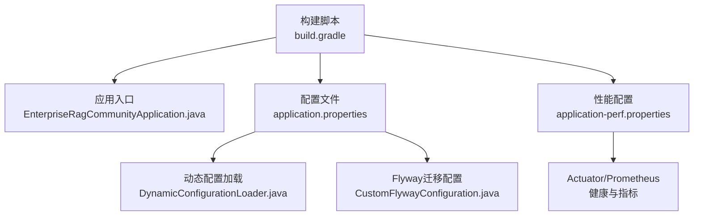
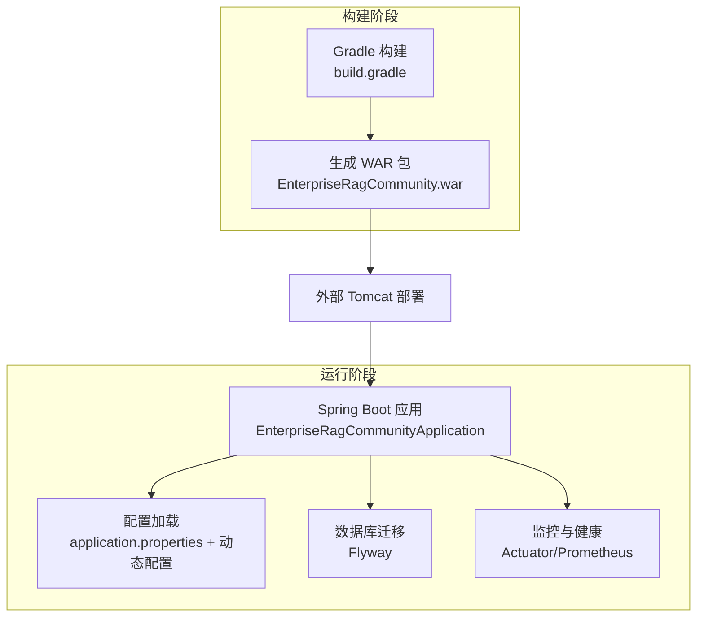
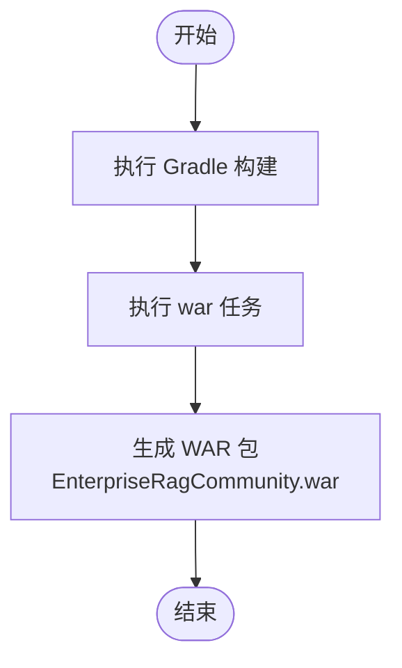
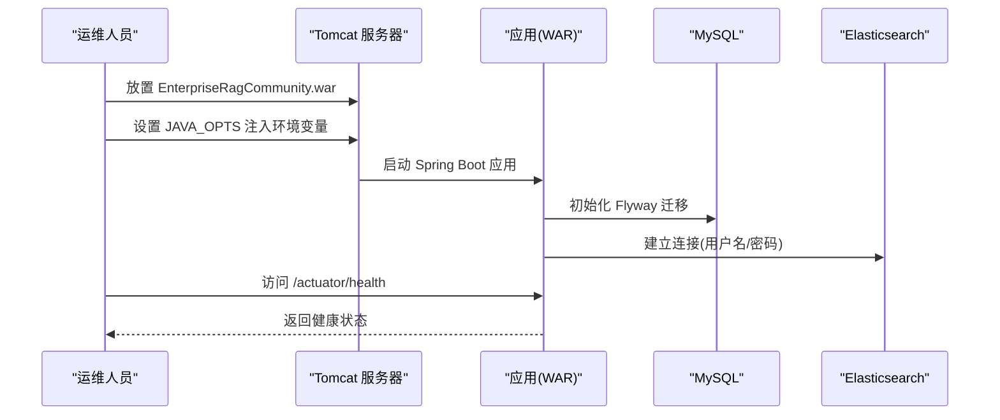
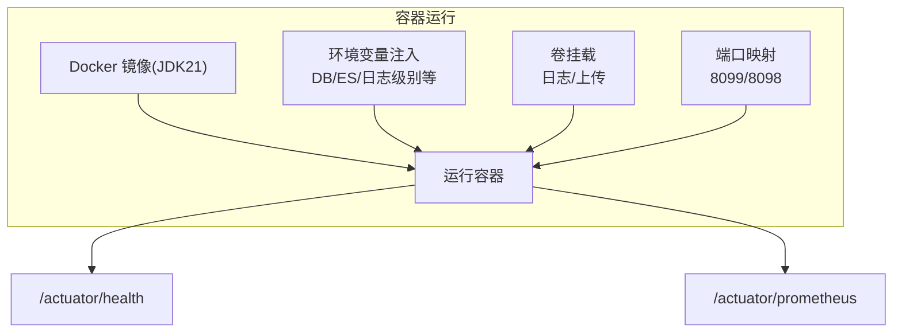
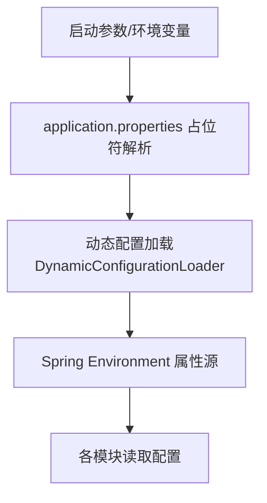
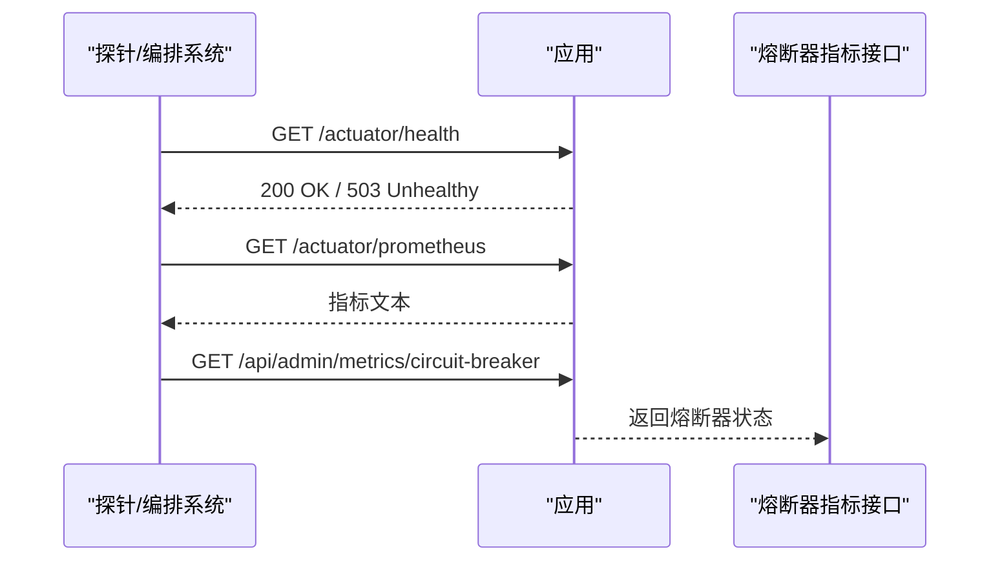
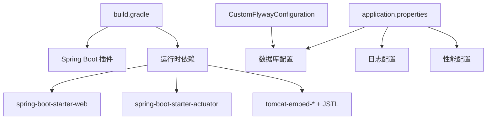

# 应用部署

<cite>
**本文引用的文件**
- [build.gradle](file://build.gradle)
- [settings.gradle](file://settings.gradle)
- [gradle.properties](file://gradle.properties)
- [application.properties](file://src/main/resources/application.properties)
- [application-perf.properties](file://src/main/resources/application-perf.properties)
- [logback-spring.xml](file://src/main/resources/logback-spring.xml)
- [EnterpriseRagCommunityApplication.java](file://src/main/java/com/example/EnterpriseRagCommunity/EnterpriseRagCommunityApplication.java)
- [CustomFlywayConfiguration.java](file://src/main/java/com/example/EnterpriseRagCommunity/config/CustomFlywayConfiguration.java)
- [DynamicConfigurationLoader.java](file://src/main/java/com/example/EnterpriseRagCommunity/config/DynamicConfigurationLoader.java)
- [AdminCircuitBreakerMetricsController.java](file://src/main/java/com/example/EnterpriseRagCommunity/controller/monitor/admin/AdminCircuitBreakerMetricsController.java)
- [MetricsEventsRepository.java](file://src/main/java/com/example/EnterpriseRagCommunity/repository/monitor/MetricsEventsRepository.java)
- [MetricsEventsEntity.java](file://src/main/java/com/example/EnterpriseRagCommunity/entity/monitor/MetricsEventsEntity.java)
- [EnterpriseRagCommunity_basic_load.jmx](file://perf/jmeter/EnterpriseRagCommunity_basic_load.jmx)
</cite>

## 目录
1. [引言](#引言)
2. [项目结构](#项目结构)
3. [核心组件](#核心组件)
4. [架构总览](#架构总览)
5. [详细组件分析](#详细组件分析)
6. [依赖分析](#依赖分析)
7. [性能考虑](#性能考虑)
8. [故障排查指南](#故障排查指南)
9. [结论](#结论)
10. [附录](#附录)

## 引言
本指南面向企业级RAG社区平台的运维与开发团队，提供从源码到生产环境的完整部署方案。内容覆盖：
- WAR包构建与Spring Boot打包配置
- 传统部署：Tomcat服务器配置与应用部署
- 现代部署：Docker容器化部署要点
- 应用配置文件管理、环境变量注入与密钥安全
- 部署验证、健康检查与服务发现配置建议

## 项目结构
该工程为基于Gradle的Spring Boot 3应用，采用内嵌Tomcat运行模式，同时支持以WAR包形式部署至外部Tomcat。核心目录与文件如下：
- 构建与打包：build.gradle、settings.gradle、gradle.properties
- 应用入口与Servlet初始化：EnterpriseRagCommunityApplication.java
- 配置与动态配置加载：application.properties、application-perf.properties、DynamicConfigurationLoader.java
- 数据库迁移：CustomFlywayConfiguration.java
- 性能与监控：application-perf.properties、Prometheus暴露端点
- 测试与负载：EnterpriseRagCommunity_basic_load.jmx

图表来源
- [build.gradle:102-138](file://build.gradle#L102-L138)
- [EnterpriseRagCommunityApplication.java:20-35](file://src/main/java/com/example/EnterpriseRagCommunity/EnterpriseRagCommunityApplication.java#L20-L35)
- [application.properties:1-84](file://src/main/resources/application.properties#L1-L84)
- [application-perf.properties:1-6](file://src/main/resources/application-perf.properties#L1-L6)
- [DynamicConfigurationLoader.java:14-46](file://src/main/java/com/example/EnterpriseRagCommunity/config/DynamicConfigurationLoader.java#L14-L46)
- [CustomFlywayConfiguration.java:14-49](file://src/main/java/com/example/EnterpriseRagCommunity/config/CustomFlywayConfiguration.java#L14-L49)

章节来源
- [build.gradle:102-138](file://build.gradle#L102-L138)
- [EnterpriseRagCommunityApplication.java:20-35](file://src/main/java/com/example/EnterpriseRagCommunity/EnterpriseRagCommunityApplication.java#L20-L35)
- [application.properties:1-84](file://src/main/resources/application.properties#L1-L84)
- [application-perf.properties:1-6](file://src/main/resources/application-perf.properties#L1-L6)
- [DynamicConfigurationLoader.java:14-46](file://src/main/java/com/example/EnterpriseRagCommunity/config/DynamicConfigurationLoader.java#L14-L46)
- [CustomFlywayConfiguration.java:14-49](file://src/main/java/com/example/EnterpriseRagCommunity/config/CustomFlywayConfiguration.java#L14-L49)

## 核心组件
- 打包与运行模式
  - 使用Spring Boot Gradle插件，启用war插件，禁用bootJar，生成EnterpriseRagCommunity.war
  - 内嵌Tomcat版本与JSP/JSTL依赖已配置，支持JSP视图解析
- 配置体系
  - application.properties集中管理数据库、日志、上传、AI相关参数，支持${ENV_VAR:default}占位符
  - application-perf.properties开启Actuator端口与Prometheus指标暴露
  - DynamicConfigurationLoader支持从数据库动态刷新配置属性源
- 数据迁移
  - CustomFlywayConfiguration映射Flyway常用属性，确保迁移执行顺序与编码一致
- 监控与健康
  - Actuator暴露health、info、prometheus、metrics端点；Prometheus仅对本地地址暴露
  - 提供电路熔断器指标查询接口，便于运维观测

章节来源
- [build.gradle:27-29](file://build.gradle#L27-L29)
- [build.gradle:90-91](file://build.gradle#L90-L91)
- [build.gradle:104-111](file://build.gradle#L104-L111)
- [application.properties:1-84](file://src/main/resources/application.properties#L1-L84)
- [application-perf.properties:1-6](file://src/main/resources/application-perf.properties#L1-L6)
- [DynamicConfigurationLoader.java:24-45](file://src/main/java/com/example/EnterpriseRagCommunity/config/DynamicConfigurationLoader.java#L24-L45)
- [CustomFlywayConfiguration.java:17-40](file://src/main/java/com/example/EnterpriseRagCommunity/config/CustomFlywayConfiguration.java#L17-L40)

## 架构总览
下图展示应用启动与部署的关键交互：Gradle构建生成WAR，Spring Boot引导应用，Actuator暴露监控端点，Flyway执行数据库迁移。

图表来源
- [build.gradle:27-29](file://build.gradle#L27-L29)
- [EnterpriseRagCommunityApplication.java:20-35](file://src/main/java/com/example/EnterpriseRagCommunity/EnterpriseRagCommunityApplication.java#L20-L35)
- [application.properties:18-24](file://src/main/resources/application.properties#L18-L24)
- [application-perf.properties:1-6](file://src/main/resources/application-perf.properties#L1-L6)

## 详细组件分析

### 组件A：WAR包构建与Spring Boot打包配置
- 关键点
  - 启用war插件，禁用bootJar，设置archiveFileName为EnterpriseRagCommunity.war
  - 内嵌Tomcat与JSP引擎依赖，支持JSP视图解析
  - bootRun任务设置JVM参数与字符集
- 构建命令示例
  - ./gradlew clean build
  - 产物位于build/libs/EnterpriseRagCommunity.war

图表来源
- [build.gradle:27-29](file://build.gradle#L27-L29)
- [build.gradle:90-91](file://build.gradle#L90-L91)
- [build.gradle:104-111](file://build.gradle#L104-L111)

章节来源
- [build.gradle:27-29](file://build.gradle#L27-L29)
- [build.gradle:90-91](file://build.gradle#L90-L91)
- [build.gradle:104-111](file://build.gradle#L104-L111)

### 组件B：Tomcat服务器配置与应用部署（传统方式）
- 部署步骤
  - 将EnterpriseRagCommunity.war放入Tomcat的webapps目录
  - 设置JAVA_OPTS或CATALINA_OPTS，注入数据库与ES连接参数
  - 启动Tomcat，访问根路径确认应用启动
- 关键配置项
  - server.port、server.servlet.context-path在application.properties中定义
  - 数据库连接通过spring.datasource.*与环境变量组合
  - ES认证通过spring.elasticsearch.*与环境变量组合
- 验证
  - 访问健康端点：/actuator/health
  - 访问指标端点：/actuator/prometheus

图表来源
- [application.properties:7-16](file://src/main/resources/application.properties#L7-L16)
- [application.properties:78-82](file://src/main/resources/application.properties#L78-L82)
- [application-perf.properties:1-6](file://src/main/resources/application-perf.properties#L1-L6)
- [CustomFlywayConfiguration.java:17-40](file://src/main/java/com/example/EnterpriseRagCommunity/config/CustomFlywayConfiguration.java#L17-L40)

章节来源
- [application.properties:7-16](file://src/main/resources/application.properties#L7-L16)
- [application.properties:78-82](file://src/main/resources/application.properties#L78-L82)
- [application-perf.properties:1-6](file://src/main/resources/application-perf.properties#L1-L6)
- [CustomFlywayConfiguration.java:17-40](file://src/main/java/com/example/EnterpriseRagCommunity/config/CustomFlywayConfiguration.java#L17-L40)

### 组件C：Docker容器化部署（现代方式）
- 构建镜像
  - 基于JDK 21镜像，复制构建产物EnterpriseRagCommunity.war
  - 暴露应用端口与监控端口
- 运行容器
  - 通过环境变量注入数据库与ES凭据
  - 映射日志卷与上传目录
- 健康检查与服务发现
  - 建议在编排系统中使用/actuator/health进行就绪探针
  - 通过Prometheus抓取/actuator/prometheus指标

图表来源
- [application.properties:27](file://src/main/resources/application.properties#L27)
- [application-perf.properties:1-6](file://src/main/resources/application-perf.properties#L1-L6)

章节来源
- [application.properties:27](file://src/main/resources/application.properties#L27)
- [application-perf.properties:1-6](file://src/main/resources/application-perf.properties#L1-L6)

### 组件D：应用配置文件管理、环境变量注入与密钥安全
- 配置文件
  - application.properties：数据库、日志、上传、AI、OpenSearch平台等参数
  - application-perf.properties：Actuator与Prometheus端口与暴露策略
  - logback-spring.xml：控制台与文件日志字符集
- 环境变量注入
  - 使用${ENV_VAR:default}占位符，未设置时回退默认值
  - 常见变量：DB_USERNAME、DB_PASSWORD、DB_POOL_*、LOG_FILE、LOG_LEVEL_*、SPRING_ELASTICSEARCH_USERNAME、SPRING_ELASTICSEARCH_PASSWORD、APP_OPENSEARCH_PLATFORM_* 等
- 密钥安全
  - 建议通过外部密管系统注入敏感变量，避免硬编码
  - 生产环境关闭本地可访问的管理端口，仅限内网或VPN访问
- 动态配置
  - DynamicConfigurationLoader从数据库读取配置并注入到Spring Environment，支持热更新

图表来源
- [application.properties:2-10](file://src/main/resources/application.properties#L2-L10)
- [application.properties:40-43](file://src/main/resources/application.properties#L40-L43)
- [application-perf.properties:1-6](file://src/main/resources/application-perf.properties#L1-L6)
- [logback-spring.xml:1-8](file://src/main/resources/logback-spring.xml#L1-L8)
- [DynamicConfigurationLoader.java:24-45](file://src/main/java/com/example/EnterpriseRagCommunity/config/DynamicConfigurationLoader.java#L24-L45)

章节来源
- [application.properties:2-10](file://src/main/resources/application.properties#L2-L10)
- [application.properties:40-43](file://src/main/resources/application.properties#L40-L43)
- [application-perf.properties:1-6](file://src/main/resources/application-perf.properties#L1-L6)
- [logback-spring.xml:1-8](file://src/main/resources/logback-spring.xml#L1-L8)
- [DynamicConfigurationLoader.java:24-45](file://src/main/java/com/example/EnterpriseRagCommunity/config/DynamicConfigurationLoader.java#L24-L45)

### 组件E：部署验证、健康检查与服务发现
- 健康检查
  - /actuator/health：查看应用健康状态
  - /actuator/info：查看应用信息
- 指标与监控
  - /actuator/prometheus：导出Prometheus指标
  - /actuator/metrics：列出可用指标
- 电路熔断器指标
  - /api/admin/metrics/circuit-breaker：内容安全与依赖熔断器状态
- 服务发现
  - 建议在Kubernetes中使用Headless Service或Ingress暴露服务
  - 使用/actuator/health作为就绪/存活探针

图表来源
- [application-perf.properties:1-6](file://src/main/resources/application-perf.properties#L1-L6)
- [AdminCircuitBreakerMetricsController.java:25-35](file://src/main/java/com/example/EnterpriseRagCommunity/controller/monitor/admin/AdminCircuitBreakerMetricsController.java#L25-L35)

章节来源
- [application-perf.properties:1-6](file://src/main/resources/application-perf.properties#L1-L6)
- [AdminCircuitBreakerMetricsController.java:25-35](file://src/main/java/com/example/EnterpriseRagCommunity/controller/monitor/admin/AdminCircuitBreakerMetricsController.java#L25-L35)

## 依赖分析
- 构建与运行
  - Gradle插件：Spring Boot、依赖管理、OWASP、SonarQube、Flyway
  - 依赖：spring-boot-starter-web、validation、mail、data-jpa、security、actuator、prometheus
  - 内嵌Tomcat与JSP引擎：tomcat-embed-jasper、tomcat-embed-el、JSTL
- 配置与迁移
  - application.properties与application-perf.properties提供运行期配置
  - CustomFlywayConfiguration负责迁移配置映射与修复+迁移流程

图表来源
- [build.gradle:14-23](file://build.gradle#L14-L23)
- [build.gradle:104-111](file://build.gradle#L104-L111)
- [application.properties:7-16](file://src/main/resources/application.properties#L7-L16)
- [application-perf.properties:1-6](file://src/main/resources/application-perf.properties#L1-L6)
- [CustomFlywayConfiguration.java:17-40](file://src/main/java/com/example/EnterpriseRagCommunity/config/CustomFlywayConfiguration.java#L17-L40)

章节来源
- [build.gradle:14-23](file://build.gradle#L14-L23)
- [build.gradle:104-111](file://build.gradle#L104-L111)
- [application.properties:7-16](file://src/main/resources/application.properties#L7-L16)
- [application-perf.properties:1-6](file://src/main/resources/application-perf.properties#L1-L6)
- [CustomFlywayConfiguration.java:17-40](file://src/main/java/com/example/EnterpriseRagCommunity/config/CustomFlywayConfiguration.java#L17-L40)

## 性能考虑
- JVM与线程
  - 开启虚拟线程spring.threads.virtual.enabled=true
  - Gradle测试任务设置最大堆与元空间上限，建议在生产JVM参数中参考
- 数据库连接池
  - HikariCP参数可通过环境变量调整：DB_POOL_MAX、DB_POOL_MIN_IDLE、DB_POOL_CONN_TIMEOUT_MS等
- 文件上传与HTTP
  - multipart与Tomcat参数已调大，满足大文件场景
- 监控与指标
  - Prometheus仅对本地地址暴露，避免公网泄露
  - 建议结合JMeter压力测试脚本进行容量评估

章节来源
- [application.properties:5](file://src/main/resources/application.properties#L5)
- [application.properties:11-16](file://src/main/resources/application.properties#L11-L16)
- [application.properties:33-36](file://src/main/resources/application.properties#L33-L36)
- [application-perf.properties:1-6](file://src/main/resources/application-perf.properties#L1-L6)
- [EnterpriseRagCommunity_basic_load.jmx:1-83](file://perf/jmeter/EnterpriseRagCommunity_basic_load.jmx#L1-L83)

## 故障排查指南
- 数据库迁移失败
  - 检查Flyway配置与数据库连通性
  - 查看迁移日志与schema历史表状态
- 配置未生效
  - 确认环境变量是否正确注入
  - 检查DynamicConfigurationLoader是否成功加载数据库配置
- 日志与字符集
  - 确认logback-spring.xml字符集设置与系统locale一致
- 健康与指标不可达
  - 确认management.server.address与端口映射
  - 检查防火墙与网络策略

章节来源
- [CustomFlywayConfiguration.java:17-40](file://src/main/java/com/example/EnterpriseRagCommunity/config/CustomFlywayConfiguration.java#L17-L40)
- [DynamicConfigurationLoader.java:24-45](file://src/main/java/com/example/EnterpriseRagCommunity/config/DynamicConfigurationLoader.java#L24-L45)
- [logback-spring.xml:1-8](file://src/main/resources/logback-spring.xml#L1-L8)
- [application-perf.properties:1-6](file://src/main/resources/application-perf.properties#L1-L6)

## 结论
本指南提供了从构建到部署、从配置到监控的全链路实践建议。建议在生产环境中：
- 使用Docker容器化部署并结合编排系统
- 通过密管系统注入敏感变量，严格限制管理端口访问
- 借助Actuator与Prometheus建立完善的可观测性体系
- 以JMeter脚本进行容量与稳定性评估

## 附录
- 关键端点
  - /actuator/health：健康检查
  - /actuator/prometheus：Prometheus指标
  - /api/admin/metrics/circuit-breaker：熔断器指标
- 关键环境变量
  - DB_USERNAME、DB_PASSWORD、DB_POOL_MAX、LOG_FILE、LOG_LEVEL_ROOT、SPRING_ELASTICSEARCH_USERNAME、SPRING_ELASTICSEARCH_PASSWORD、APP_OPENSEARCH_PLATFORM_* 等