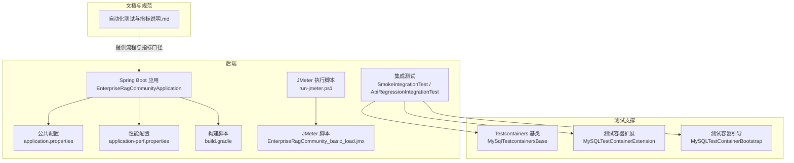
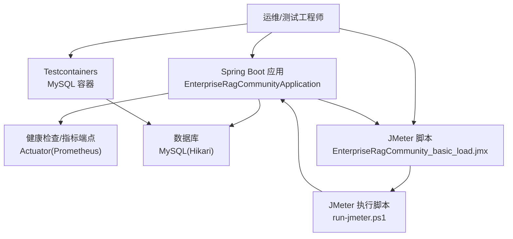
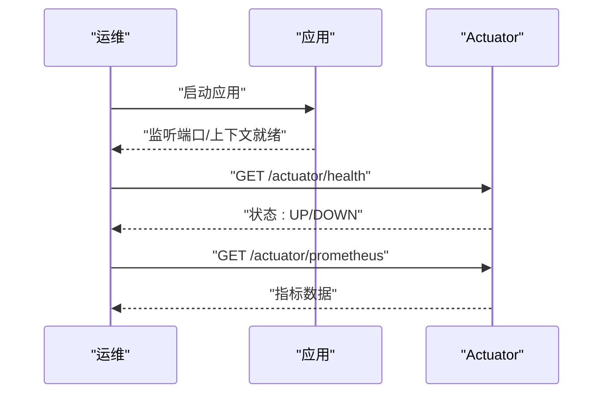
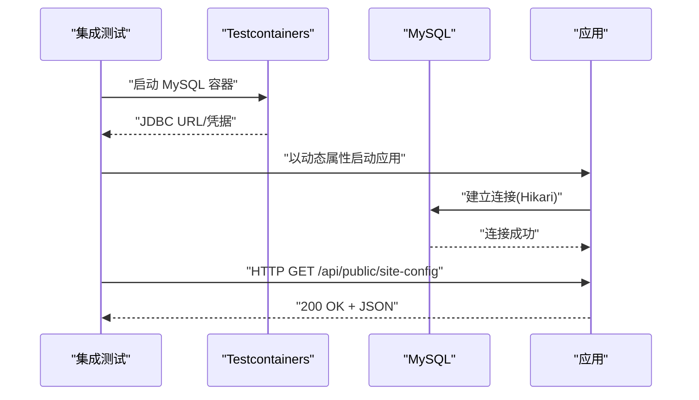
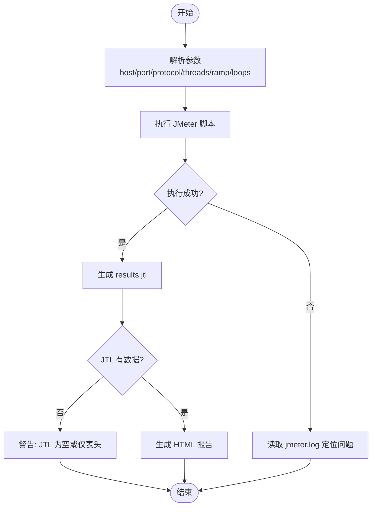
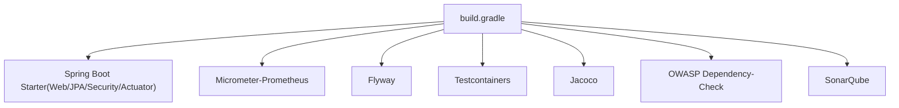

# 部署验证

<cite>
**本文引用的文件**
- [EnterpriseRagCommunityApplication.java](file://src/main/java/com/example/EnterpriseRagCommunity/EnterpriseRagCommunityApplication.java)
- [PublicSiteConfigController.java](file://src/main/java/com/example/EnterpriseRagCommunity/controller/PublicSiteConfigController.java)
- [application.properties](file://src/main/resources/application.properties)
- [application-perf.properties](file://src/main/resources/application-perf.properties)
- [build.gradle](file://build.gradle)
- [settings.gradle](file://settings.gradle)
- [SmokeIntegrationTest.java](file://src/integrationTest/java/com/example/EnterpriseRagCommunity/SmokeIntegrationTest.java)
- [ApiRegressionIntegrationTest.java](file://src/integrationTest/java/com/example/EnterpriseRagCommunity/ApiRegressionIntegrationTest.java)
- [MySqlTestcontainersBase.java](file://src/integrationTest/java/com/example/EnterpriseRagCommunity/testsupport/MySqlTestcontainersBase.java)
- [MySQLTestContainerExtension.java](file://src/integrationTest/java/com/example/EnterpriseRagCommunity/testsupport/MySQLTestContainerExtension.java)
- [MySQLTestContainerBootstrap.java](file://src/test/java/com/example/EnterpriseRagCommunity/testsupport/MySQLTestContainerBootstrap.java)
- [EnterpriseRagCommunity_basic_load.jmx](file://perf/jmeter/EnterpriseRagCommunity_basic_load.jmx)
- [run-jmeter.ps1](file://perf/jmeter/run-jmeter.ps1)
- [自动化测试与指标说明.md](file://docs/自动化测试与指标说明.md)
</cite>

## 目录
1. [引言](#引言)
2. [项目结构](#项目结构)
3. [核心组件](#核心组件)
4. [架构概览](#架构概览)
5. [详细组件分析](#详细组件分析)
6. [依赖分析](#依赖分析)
7. [性能考虑](#性能考虑)
8. [故障排查指南](#故障排查指南)
9. [结论](#结论)
10. [附录](#附录)

## 引言
本指南面向部署与运维团队，提供一套完整的部署验证与测试流程，涵盖应用启动验证、功能测试、性能测试、集成与端到端测试、JMeter 负载测试脚本使用、测试结果分析、性能瓶颈识别、监控指标采集与告警配置、故障恢复验证以及部署回滚策略与应急处理方案。文档基于仓库中的实际配置与测试脚本，确保流程可落地、可追溯。

## 项目结构
项目采用 Spring Boot 3 + Gradle 构建，后端以 WAR 包形式部署，集成 Actuator 与 Micrometer Prometheus 指标，使用 JMeter 进行性能压测，并通过 Testcontainers 与自定义扩展支持集成测试。前端位于 my-vite-app 目录，测试与报告汇总由统一脚本管理。

图表来源
- [EnterpriseRagCommunityApplication.java:1-64](file://src/main/java/com/example/EnterpriseRagCommunity/EnterpriseRagCommunityApplication.java#L1-L64)
- [application.properties:1-84](file://src/main/resources/application.properties#L1-L84)
- [application-perf.properties:1-6](file://src/main/resources/application-perf.properties#L1-L6)
- [build.gradle:1-138](file://build.gradle#L1-L138)
- [SmokeIntegrationTest.java:1-14](file://src/integrationTest/java/com/example/EnterpriseRagCommunity/SmokeIntegrationTest.java#L1-L14)
- [ApiRegressionIntegrationTest.java:1-36](file://src/integrationTest/java/com/example/EnterpriseRagCommunity/ApiRegressionIntegrationTest.java#L1-L36)
- [MySqlTestcontainersBase.java:1-27](file://src/integrationTest/java/com/example/EnterpriseRagCommunity/testsupport/MySqlTestcontainersBase.java#L1-L27)
- [MySQLTestContainerExtension.java:1-32](file://src/integrationTest/java/com/example/EnterpriseRagCommunity/testsupport/MySQLTestContainerExtension.java#L1-L32)
- [MySQLTestContainerBootstrap.java:35-92](file://src/test/java/com/example/EnterpriseRagCommunity/testsupport/MySQLTestContainerBootstrap.java#L35-L92)
- [EnterpriseRagCommunity_basic_load.jmx:1-83](file://perf/jmeter/EnterpriseRagCommunity_basic_load.jmx#L1-L83)
- [run-jmeter.ps1:1-74](file://perf/jmeter/run-jmeter.ps1#L1-L74)
- [自动化测试与指标说明.md:1-149](file://docs/自动化测试与指标说明.md#L1-L149)

章节来源
- [build.gradle:1-138](file://build.gradle#L1-L138)
- [settings.gradle:1-15](file://settings.gradle#L1-L15)
- [application.properties:1-84](file://src/main/resources/application.properties#L1-L84)
- [application-perf.properties:1-6](file://src/main/resources/application-perf.properties#L1-L6)

## 核心组件
- 应用主类与启动入口：负责应用启动、视图解析器注册与根路径映射，确保静态资源与 JSP 视图可用。
- 公共配置：数据库连接、连接池、Flyway 迁移、日志、上传与 AI 相关超时配置等。
- 性能配置：启用 Actuator、暴露健康/信息/指标端点、Prometheus 指标导出。
- 构建与插件：Spring Boot 插件、Jacoco、OWASP 依赖检查、SonarQube、Flyway、Tomcat JSP 支持等。
- 集成测试支撑：Testcontainers MySQL 容器、动态属性注入、本地回退机制。
- 性能测试：JMeter 脚本与执行脚本，支持参数化并发、持续时间与报告生成。

章节来源
- [EnterpriseRagCommunityApplication.java:20-64](file://src/main/java/com/example/EnterpriseRagCommunity/EnterpriseRagCommunityApplication.java#L20-L64)
- [application.properties:7-84](file://src/main/resources/application.properties#L7-L84)
- [application-perf.properties:1-6](file://src/main/resources/application-perf.properties#L1-L6)
- [build.gradle:102-138](file://build.gradle#L102-L138)
- [MySqlTestcontainersBase.java:11-27](file://src/integrationTest/java/com/example/EnterpriseRagCommunity/testsupport/MySqlTestcontainersBase.java#L11-L27)
- [MySQLTestContainerBootstrap.java:35-92](file://src/test/java/com/example/EnterpriseRagCommunity/testsupport/MySQLTestContainerBootstrap.java#L35-L92)
- [EnterpriseRagCommunity_basic_load.jmx:1-83](file://perf/jmeter/EnterpriseRagCommunity_basic_load.jmx#L1-L83)
- [run-jmeter.ps1:1-74](file://perf/jmeter/run-jmeter.ps1#L1-L74)

## 架构概览
下图展示了部署验证的关键交互：应用启动与健康检查、公共接口验证、数据库连接测试、集成测试执行、JMeter 性能测试与报告生成。

图表来源
- [EnterpriseRagCommunityApplication.java:20-64](file://src/main/java/com/example/EnterpriseRagCommunity/EnterpriseRagCommunityApplication.java#L20-L64)
- [application-perf.properties:1-6](file://src/main/resources/application-perf.properties#L1-L6)
- [application.properties:7-16](file://src/main/resources/application.properties#L7-L16)
- [MySqlTestcontainersBase.java:11-27](file://src/integrationTest/java/com/example/EnterpriseRagCommunity/testsupport/MySqlTestcontainersBase.java#L11-L27)
- [EnterpriseRagCommunity_basic_load.jmx:1-83](file://perf/jmeter/EnterpriseRagCommunity_basic_load.jmx#L1-L83)
- [run-jmeter.ps1:1-74](file://perf/jmeter/run-jmeter.ps1#L1-L74)

## 详细组件分析

### 应用启动验证
- 启动入口与视图解析：确认应用主类与 JSP 视图解析器配置，确保静态页面与 JSP 路由可用。
- 端口与上下文：服务器端口与编码配置需与部署环境一致。
- Actuator 指标：确认性能配置已启用，Prometheus 端点可访问。

图表来源
- [EnterpriseRagCommunityApplication.java:20-64](file://src/main/java/com/example/EnterpriseRagCommunity/EnterpriseRagCommunityApplication.java#L20-L64)
- [application-perf.properties:1-6](file://src/main/resources/application-perf.properties#L1-L6)

章节来源
- [EnterpriseRagCommunityApplication.java:20-64](file://src/main/java/com/example/EnterpriseRagCommunity/EnterpriseRagCommunityApplication.java#L20-L64)
- [application.properties:27-31](file://src/main/resources/application.properties#L27-L31)
- [application-perf.properties:1-6](file://src/main/resources/application-perf.properties#L1-L6)

### 功能测试与数据库连接测试
- 冒烟测试：验证应用上下文加载成功。
- 回归测试：通过随机端口启动，验证公共接口与鉴权行为。
- 数据库连接：使用 Testcontainers 启动 MySQL 容器，动态注入连接参数；若 Docker 不可用，提供本地回退配置。

图表来源
- [SmokeIntegrationTest.java:7-13](file://src/integrationTest/java/com/example/EnterpriseRagCommunity/SmokeIntegrationTest.java#L7-L13)
- [ApiRegressionIntegrationTest.java:13-35](file://src/integrationTest/java/com/example/EnterpriseRagCommunity/ApiRegressionIntegrationTest.java#L13-L35)
- [MySqlTestcontainersBase.java:11-27](file://src/integrationTest/java/com/example/EnterpriseRagCommunity/testsupport/MySqlTestcontainersBase.java#L11-L27)
- [application.properties:7-16](file://src/main/resources/application.properties#L7-L16)

章节来源
- [SmokeIntegrationTest.java:7-13](file://src/integrationTest/java/com/example/EnterpriseRagCommunity/SmokeIntegrationTest.java#L7-L13)
- [ApiRegressionIntegrationTest.java:13-35](file://src/integrationTest/java/com/example/EnterpriseRagCommunity/ApiRegressionIntegrationTest.java#L13-L35)
- [MySqlTestcontainersBase.java:11-27](file://src/integrationTest/java/com/example/EnterpriseRagCommunity/testsupport/MySqlTestcontainersBase.java#L11-L27)
- [MySQLTestContainerExtension.java:1-32](file://src/integrationTest/java/com/example/EnterpriseRagCommunity/testsupport/MySQLTestContainerExtension.java#L1-L32)
- [MySQLTestContainerBootstrap.java:35-92](file://src/test/java/com/example/EnterpriseRagCommunity/testsupport/MySQLTestContainerBootstrap.java#L35-L92)
- [application.properties:7-16](file://src/main/resources/application.properties#L7-L16)

### 性能测试与 JMeter 脚本使用
- 脚本参数：主机、端口、协议、并发线程数、爬坡时间、循环次数。
- 执行流程：PowerShell 脚本解析参数，调用 JMeter 执行测试计划，生成 JTL 与 HTML 报告。
- 常见问题：如结果文件为空，检查日志定位启动失败、目标不可达或 TLS/协议不匹配等问题。

图表来源
- [run-jmeter.ps1:1-74](file://perf/jmeter/run-jmeter.ps1#L1-L74)
- [EnterpriseRagCommunity_basic_load.jmx:8-26](file://perf/jmeter/EnterpriseRagCommunity_basic_load.jmx#L8-L26)
- [自动化测试与指标说明.md:62-78](file://docs/自动化测试与指标说明.md#L62-L78)

章节来源
- [run-jmeter.ps1:1-74](file://perf/jmeter/run-jmeter.ps1#L1-L74)
- [EnterpriseRagCommunity_basic_load.jmx:1-83](file://perf/jmeter/EnterpriseRagCommunity_basic_load.jmx#L1-L83)
- [自动化测试与指标说明.md:62-78](file://docs/自动化测试与指标说明.md#L62-L78)

### 监控指标采集与告警配置
- 指标端点：通过性能配置暴露健康、信息、指标与 Prometheus 端点，默认仅本机访问。
- 建议采集：CPU、内存、GC、线程数、HTTP 请求耗时分布等。
- 告警建议：结合吞吐量、平均响应时间、P90/P95/P99、错误率等关键指标设定阈值。

章节来源
- [application-perf.properties:1-6](file://src/main/resources/application-perf.properties#L1-L6)
- [自动化测试与指标说明.md:79-86](file://docs/自动化测试与指标说明.md#L79-L86)

### 故障恢复验证与部署回滚策略
- 健康检查：通过 Actuator 健康端点判断应用状态，异常时触发回滚或重启。
- 回滚策略：保留上一版本 WAR 包与配置快照，回滚时恢复数据库迁移版本与配置文件。
- 应急处理：记录压测与运行日志，结合 JMeter 报告定位瓶颈；必要时临时降级非关键功能。

章节来源
- [application-perf.properties:1-6](file://src/main/resources/application-perf.properties#L1-L6)
- [自动化测试与指标说明.md:62-78](file://docs/自动化测试与指标说明.md#L62-L78)

## 依赖分析
- 构建与运行：Spring Boot Web、Actuator、Micrometer-Prometheus、JPA、Flyway、MySQL Connector、Testcontainers、Jacoco、OWASP 依赖检查、SonarQube。
- 测试与集成：Testcontainers MySQL、Mock、AssertJ 断言。
- 前端：Vite/React 测试与覆盖率（不在本指南范围内，但与后端测试协同）。

图表来源
- [build.gradle:102-138](file://build.gradle#L102-L138)

章节来源
- [build.gradle:102-138](file://build.gradle#L102-L138)

## 性能考虑
- 连接池与超时：合理配置最大连接数、最小空闲、连接超时、验证超时与最大存活时间。
- 并发与线程：虚拟线程开启、Tomcat 上下文大小限制与表单提交大小限制。
- 压测建议：从低并发起步，逐步提升至目标并发，关注 P95/P99 延迟与错误率拐点，结合 JVM GC 与线程指标定位瓶颈。

章节来源
- [application.properties:7-16](file://src/main/resources/application.properties#L7-L16)
- [application.properties:33-36](file://src/main/resources/application.properties#L33-L36)
- [自动化测试与指标说明.md:73-78](file://docs/自动化测试与指标说明.md#L73-L78)

## 故障排查指南
- 启动失败：检查日志与端口占用，确认数据库连接参数与网络可达性。
- 数据库连接：Docker 不可用时使用本地回退配置；确保 JDBC URL 参数与 SSL 设置正确。
- JMeter 执行失败：检查 JMETER_HOME/JMETER_BAT 环境变量，确认测试计划路径与参数传递。
- 结果为空：查看 jmeter.log，确认目标服务已启动、HTTPS 协议参数正确、并发与循环设置有效。

章节来源
- [run-jmeter.ps1:13-21](file://perf/jmeter/run-jmeter.ps1#L13-L21)
- [run-jmeter.ps1:24-27](file://perf/jmeter/run-jmeter.ps1#L24-L27)
- [run-jmeter.ps1:51-54](file://perf/jmeter/run-jmeter.ps1#L51-L54)
- [run-jmeter.ps1:56-69](file://perf/jmeter/run-jmeter.ps1#L56-L69)
- [MySQLTestContainerBootstrap.java:35-92](file://src/test/java/com/example/EnterpriseRagCommunity/testsupport/MySQLTestContainerBootstrap.java#L35-L92)
- [自动化测试与指标说明.md:68-71](file://docs/自动化测试与指标说明.md#L68-L71)

## 结论
本指南提供了从应用启动、功能验证、数据库连接测试到性能压测与监控告警的完整流程。通过 Testcontainers 与 JMeter 的组合，可在受控环境中快速验证部署质量，并以指标与报告为依据进行性能瓶颈识别与优化。建议在每次发布前执行冒烟与回归测试，并在预生产环境进行 JMeter 负载测试，确保上线稳定性。

## 附录
- 常用命令与参数参考见文档“自动化测试与指标说明.md”。
- JMeter 脚本与执行脚本位于 perf/jmeter 目录，参数化支持主机、端口、协议、并发、爬坡与循环次数。
- 集成测试基类与扩展位于 src/integrationTest 与 src/test 的 testsupport 目录，支持 Testcontainers 与本地回退。

章节来源
- [自动化测试与指标说明.md:1-149](file://docs/自动化测试与指标说明.md#L1-L149)
- [EnterpriseRagCommunity_basic_load.jmx:1-83](file://perf/jmeter/EnterpriseRagCommunity_basic_load.jmx#L1-L83)
- [run-jmeter.ps1:1-74](file://perf/jmeter/run-jmeter.ps1#L1-L74)
- [MySqlTestcontainersBase.java:1-27](file://src/integrationTest/java/com/example/EnterpriseRagCommunity/testsupport/MySqlTestcontainersBase.java#L1-L27)
- [MySQLTestContainerExtension.java:1-32](file://src/integrationTest/java/com/example/EnterpriseRagCommunity/testsupport/MySQLTestContainerExtension.java#L1-L32)
- [MySQLTestContainerBootstrap.java:35-92](file://src/test/java/com/example/EnterpriseRagCommunity/testsupport/MySQLTestContainerBootstrap.java#L35-L92)