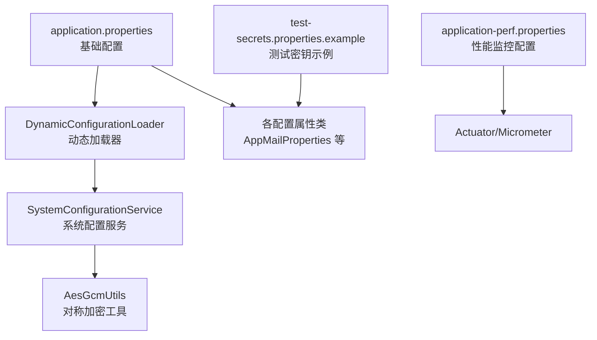
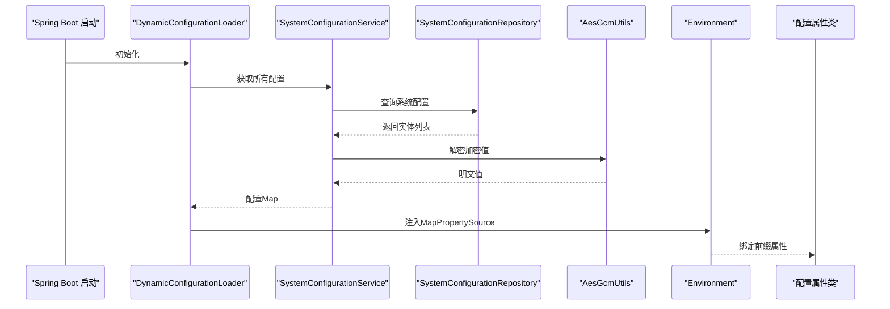
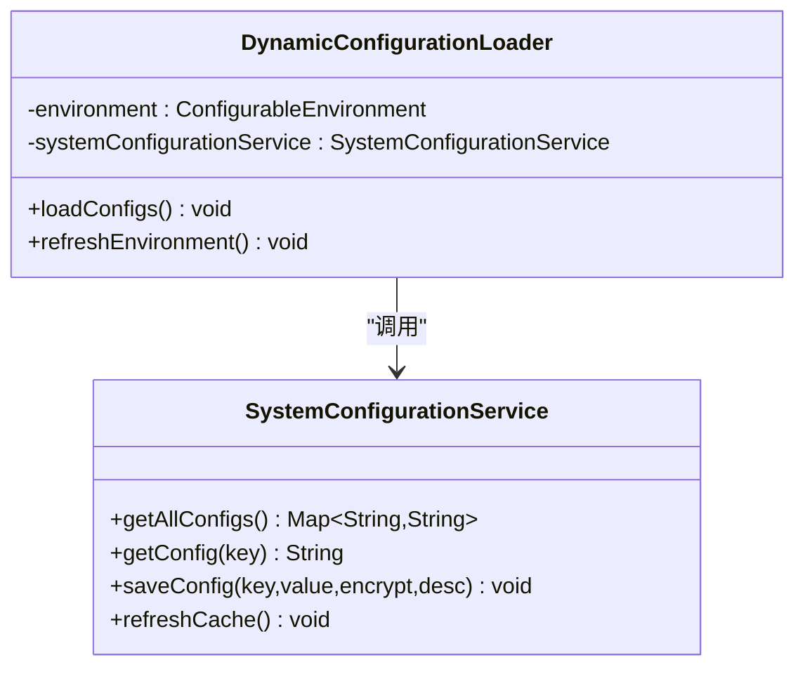
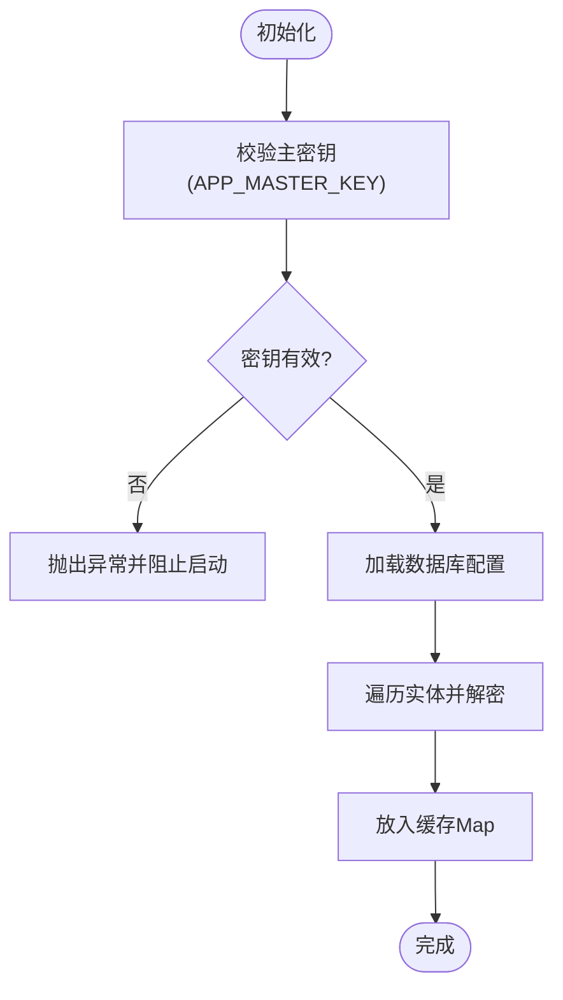
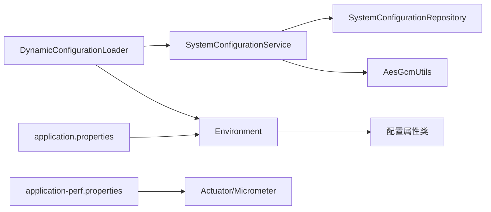

# 配置管理

<cite>
**本文引用的文件**
- [application.properties](file://src/main/resources/application.properties)
- [application-perf.properties](file://src/main/resources/application-perf.properties)
- [DynamicConfigurationLoader.java](file://src/main/java/com/example/EnterpriseRagCommunity/config/DynamicConfigurationLoader.java)
- [SystemConfigurationService.java](file://src/main/java/com/example/EnterpriseRagCommunity/service/config/SystemConfigurationService.java)
- [AppMailProperties.java](file://src/main/java/com/example/EnterpriseRagCommunity/config/AppMailProperties.java)
- [OpenSearchPlatformProperties.java](file://src/main/java/com/example/EnterpriseRagCommunity/config/OpenSearchPlatformProperties.java)
- [EsAuthProperties.java](file://src/main/java/com/example/EnterpriseRagCommunity/config/EsAuthProperties.java)
- [ElasticsearchAuthConfigValidator.java](file://src/main/java/com/example/EnterpriseRagCommunity/config/ElasticsearchAuthConfigValidator.java)
- [LlmQueueProperties.java](file://src/main/java/com/example/EnterpriseRagCommunity/config/LlmQueueProperties.java)
- [AiTokenizerProperties.java](file://src/main/java/com/example/EnterpriseRagCommunity/config/AiTokenizerProperties.java)
- [UploadProperties.java](file://src/main/java/com/example/EnterpriseRagCommunity/config/UploadProperties.java)
- [RetrievalRagProperties.java](file://src/main/java/com/example/EnterpriseRagCommunity/config/RetrievalRagProperties.java)
- [TotpSecurityProperties.java](file://src/main/java/com/example/EnterpriseRagCommunity/config/TotpSecurityProperties.java)
- [AesGcmUtils.java](file://src/main/java/com/example/EnterpriseRagCommunity/utils/AesGcmUtils.java)
- [test-secrets.properties.example](file://src/test/resources/test-secrets.properties.example)
</cite>

## 目录
1. [引言](#引言)
2. [项目结构](#项目结构)
3. [核心组件](#核心组件)
4. [架构总览](#架构总览)
5. [详细组件分析](#详细组件分析)
6. [依赖分析](#依赖分析)
7. [性能考虑](#性能考虑)
8. [故障排除指南](#故障排除指南)
9. [结论](#结论)
10. [附录](#附录)

## 引言
本指南面向Spring Boot应用的配置管理，系统性阐述以下内容：
- 配置文件结构与层次（基础、性能、测试等）
- 环境特定配置（开发/生产/集成测试）与激活方式
- 动态配置加载与热更新机制（数据库驱动的运行时配置）
- 数据库连接、缓存、邮件服务、第三方API等关键配置项
- 配置加密、敏感信息保护与安全最佳实践
- 配置验证、故障排除与运维建议

## 项目结构
应用采用标准的Spring Boot资源目录组织，关键配置位于主资源目录与测试资源目录中，并通过Profile与动态加载实现环境隔离与运行时变更。

图表来源
- [application.properties:1-84](file://src/main/resources/application.properties#L1-L84)
- [DynamicConfigurationLoader.java:1-47](file://src/main/java/com/example/EnterpriseRagCommunity/config/DynamicConfigurationLoader.java#L1-L47)
- [SystemConfigurationService.java:1-95](file://src/main/java/com/example/EnterpriseRagCommunity/service/config/SystemConfigurationService.java#L1-L95)
- [application-perf.properties:1-6](file://src/main/resources/application-perf.properties#L1-L6)
- [test-secrets.properties.example:1-16](file://src/test/resources/test-secrets.properties.example#L1-L16)

章节来源
- [application.properties:1-84](file://src/main/resources/application.properties#L1-L84)
- [application-perf.properties:1-6](file://src/main/resources/application-perf.properties#L1-L6)
- [test-secrets.properties.example:1-16](file://src/test/resources/test-secrets.properties.example#L1-L16)

## 核心组件
- 基础配置文件：集中定义数据源、Flyway迁移、服务器、上传、日志、动态配置键位等。
- 动态配置加载器：启动后从数据库拉取配置并注入Spring Environment，支持热更新。
- 系统配置服务：负责从数据库读取配置、解密、缓存与持久化写入。
- 配置属性类：以@ConfigurationProperties绑定前缀，封装业务域配置（邮件、AI队列、上传、检索RAG等）。
- 加密工具：基于对称加密算法对敏感值进行存储与运行时解密。
- 性能配置：暴露健康检查、指标端点，便于监控与压测。

章节来源
- [application.properties:1-84](file://src/main/resources/application.properties#L1-L84)
- [DynamicConfigurationLoader.java:1-47](file://src/main/java/com/example/EnterpriseRagCommunity/config/DynamicConfigurationLoader.java#L1-L47)
- [SystemConfigurationService.java:1-95](file://src/main/java/com/example/EnterpriseRagCommunity/service/config/SystemConfigurationService.java#L1-L95)
- [application-perf.properties:1-6](file://src/main/resources/application-perf.properties#L1-L6)

## 架构总览
下图展示配置从静态文件到动态数据库、再到运行时属性绑定的整体流程。

图表来源
- [DynamicConfigurationLoader.java:24-45](file://src/main/java/com/example/EnterpriseRagCommunity/config/DynamicConfigurationLoader.java#L24-L45)
- [SystemConfigurationService.java:41-61](file://src/main/java/com/example/EnterpriseRagCommunity/service/config/SystemConfigurationService.java#L41-L61)
- [AesGcmUtils.java](file://src/main/java/com/example/EnterpriseRagCommunity/utils/AesGcmUtils.java)

## 详细组件分析

### 基础配置文件（application.properties）
- 应用与编码：设置应用名、虚拟线程、文件编码等。
- 数据源与连接池：MySQL驱动、URL、用户名、密码、Hikari连接池参数（最大池大小、最小空闲、连接超时、校验超时、空闲超时、最大生存时间）。
- Flyway迁移：启用、迁移脚本位置、基线版本、编码等。
- 服务器与上传：端口、上下文路径、字符集、文件上传限制、Tomcat表单大小与吞吐限制。
- 日志：控制台与文件字符集、日志文件路径、滚动策略（单文件大小、历史天数、总大小上限）、根日志级别与模块级别。
- 访问日志捕获：是否捕获请求/响应体及最大字节数。
- 上传配置：根目录与URL前缀。
- 动态配置键位：预留主密钥APP_MASTER_KEY，用于数据库配置的解密。
- AI相关：连接/读取超时、默认历史条数。
- OpenSearch平台：主机、工作空间、服务ID、连接/读取超时。
- Elasticsearch：连接/套接字超时、用户名/密码。
- JPA：关闭open-in-view。

章节来源
- [application.properties:1-84](file://src/main/resources/application.properties#L1-L84)

### 动态配置加载器（DynamicConfigurationLoader）
- 职责：在应用启动后从系统配置服务获取全部配置，构建MapPropertySource并注入到Environment的首位置，优先级高于外部配置。
- 更新机制：提供refreshEnvironment方法，可按需刷新数据库配置到内存。

图表来源
- [DynamicConfigurationLoader.java:14-46](file://src/main/java/com/example/EnterpriseRagCommunity/config/DynamicConfigurationLoader.java#L14-L46)
- [SystemConfigurationService.java:16-94](file://src/main/java/com/example/EnterpriseRagCommunity/service/config/SystemConfigurationService.java#L16-L94)

章节来源
- [DynamicConfigurationLoader.java:1-47](file://src/main/java/com/example/EnterpriseRagCommunity/config/DynamicConfigurationLoader.java#L1-L47)

### 系统配置服务（SystemConfigurationService）
- 关键点：
  - 启动校验：要求APP_MASTER_KEY必须存在，否则拒绝启动，确保加密可用。
  - 缓存：使用并发Map缓存配置键值，避免重复查询。
  - 解密：对标记为加密的配置值使用对称加密工具解密后再放入缓存。
  - 写入：保存时根据encrypt标志决定是否加密；成功后更新缓存。
- 错误处理：解密失败或数据库异常会记录错误日志，保证系统稳定。

图表来源
- [SystemConfigurationService.java:33-61](file://src/main/java/com/example/EnterpriseRagCommunity/service/config/SystemConfigurationService.java#L33-L61)

章节来源
- [SystemConfigurationService.java:1-95](file://src/main/java/com/example/EnterpriseRagCommunity/service/config/SystemConfigurationService.java#L1-L95)

### 配置属性类（示例）
- 邮件配置（AppMailProperties）：用户名、密码、发件地址、发件人名称。
- OpenSearch平台配置（OpenSearchPlatformProperties）：主机、工作空间、服务ID、连接/读取超时。
- Elasticsearch认证配置（EsAuthProperties）：ApiKey。
- Elasticsearch认证校验器（ElasticsearchAuthConfigValidator）：启动时打印认证模式日志，若未配置ApiKey则警告。
- AI队列配置（LlmQueueProperties）：并发、队列容量、历史保留等。
- AI分词器配置（AiTokenizerProperties）：分词器API Key。
- 上传配置（UploadProperties）：根目录、URL前缀、路径规范化与URL前缀标准化。
- 检索RAG配置（RetrievalRagProperties）：ES索引、IK分词开关、嵌入模型与维度。
- TOTP安全配置（TotpSecurityProperties）：Base64编码的AES主密钥。

章节来源
- [AppMailProperties.java:1-16](file://src/main/java/com/example/EnterpriseRagCommunity/config/AppMailProperties.java#L1-L16)
- [OpenSearchPlatformProperties.java:1-17](file://src/main/java/com/example/EnterpriseRagCommunity/config/OpenSearchPlatformProperties.java#L1-L17)
- [EsAuthProperties.java:1-25](file://src/main/java/com/example/EnterpriseRagCommunity/config/EsAuthProperties.java#L1-L25)
- [ElasticsearchAuthConfigValidator.java:1-33](file://src/main/java/com/example/EnterpriseRagCommunity/config/ElasticsearchAuthConfigValidator.java#L1-L33)
- [LlmQueueProperties.java:1-16](file://src/main/java/com/example/EnterpriseRagCommunity/config/LlmQueueProperties.java#L1-L16)
- [AiTokenizerProperties.java:1-14](file://src/main/java/com/example/EnterpriseRagCommunity/config/AiTokenizerProperties.java#L1-L14)
- [UploadProperties.java:1-28](file://src/main/java/com/example/EnterpriseRagCommunity/config/UploadProperties.java#L1-L28)
- [RetrievalRagProperties.java:1-22](file://src/main/java/com/example/EnterpriseRagCommunity/config/RetrievalRagProperties.java#L1-L22)
- [TotpSecurityProperties.java:1-18](file://src/main/java/com/example/EnterpriseRagCommunity/config/TotpSecurityProperties.java#L1-L18)

### 性能配置（application-perf.properties）
- 暴露管理端点：health、info、prometheus、metrics。
- 详情显示策略：始终显示健康详情。
- 指标标签：应用名标签。
- 监听地址与端口：仅本地回环，降低暴露面。

章节来源
- [application-perf.properties:1-6](file://src/main/resources/application-perf.properties#L1-L6)

### 测试密钥示例（test-secrets.properties.example）
- 提供测试阶段所需的第三方服务密钥样例，包括AI网关、ES、邮箱等，便于本地快速搭建测试环境。

章节来源
- [test-secrets.properties.example:1-16](file://src/test/resources/test-secrets.properties.example#L1-L16)

## 依赖分析
- 配置加载链路：DynamicConfigurationLoader → SystemConfigurationService → 数据库 → AesGcmUtils（解密）→ Environment → 配置属性类。
- 配置覆盖顺序：数据库动态配置优先于外部配置（MapPropertySource插入至首位），随后是application.properties等静态配置。
- 外部依赖：MySQL驱动、Flyway、Elasticsearch客户端、OpenSearch平台、Spring Web MVC、Actuator/Micrometer。

图表来源
- [DynamicConfigurationLoader.java:19-45](file://src/main/java/com/example/EnterpriseRagCommunity/config/DynamicConfigurationLoader.java#L19-L45)
- [SystemConfigurationService.java:24-31](file://src/main/java/com/example/EnterpriseRagCommunity/service/config/SystemConfigurationService.java#L24-L31)
- [application.properties:65-67](file://src/main/resources/application.properties#L65-L67)
- [application-perf.properties:1-6](file://src/main/resources/application-perf.properties#L1-L6)

## 性能考虑
- 连接池参数：合理设置最大池大小、最小空闲、连接/校验超时，避免频繁创建销毁连接。
- 文件上传：根据业务规模调整最大文件与请求大小，避免内存压力。
- 日志滚动：控制单文件大小、历史天数与总大小上限，平衡磁盘占用与排查成本。
- 监控端点：仅在受控网络暴露管理端口，减少攻击面。

## 故障排除指南
- 启动失败（缺少主密钥）：检查APP_MASTER_KEY是否正确设置，确保数据库中的加密配置可被解密。
- Elasticsearch认证问题：若集群启用安全，需在系统配置中设置APP_ES_API_KEY；启动时可通过ElasticsearchAuthConfigValidator的日志确认当前认证模式。
- 动态配置不生效：确认DynamicConfigurationLoader已执行refreshEnvironment，且数据库配置键存在于缓存中。
- 密钥泄露风险：仅在受信环境中存放测试密钥，生产环境使用强口令与最小权限原则。
- 配置覆盖冲突：数据库动态配置优先级最高，如需临时覆盖可在数据库中更新对应键值。

章节来源
- [SystemConfigurationService.java:33-39](file://src/main/java/com/example/EnterpriseRagCommunity/service/config/SystemConfigurationService.java#L33-L39)
- [ElasticsearchAuthConfigValidator.java:23-31](file://src/main/java/com/example/EnterpriseRagCommunity/config/ElasticsearchAuthConfigValidator.java#L23-L31)
- [DynamicConfigurationLoader.java:29-45](file://src/main/java/com/example/EnterpriseRagCommunity/config/DynamicConfigurationLoader.java#L29-L45)

## 结论
本项目通过“静态配置 + 动态配置 + 加密存储”的组合，实现了灵活、安全、可观测的配置管理体系。建议在生产环境严格管理主密钥与数据库访问权限，结合动态配置实现非停机变更，并通过性能配置暴露必要的监控指标以支撑运维与容量规划。

## 附录
- 环境变量与占位符参考：application.properties中大量使用${VAR:default}语法，便于在不同环境注入变量。
- 最佳实践清单：
  - 生产环境必须设置APP_MASTER_KEY，且定期轮换。
  - 对外暴露的配置尽量使用动态配置，避免硬编码。
  - 使用最小权限原则管理数据库与第三方服务凭据。
  - 在CI/CD中对敏感配置进行加密存储与解密注入。
  - 定期审计系统配置表，清理无效键值。