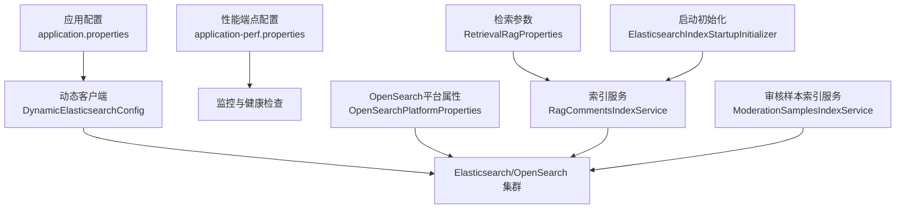
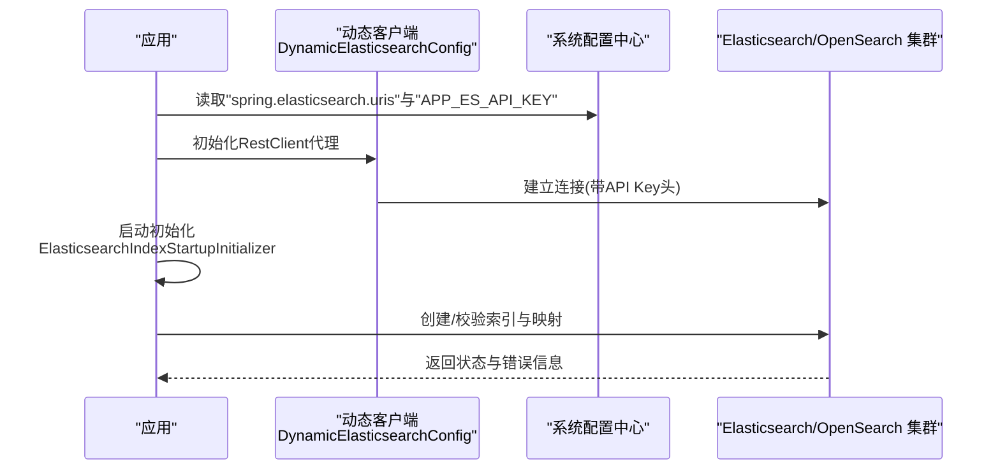
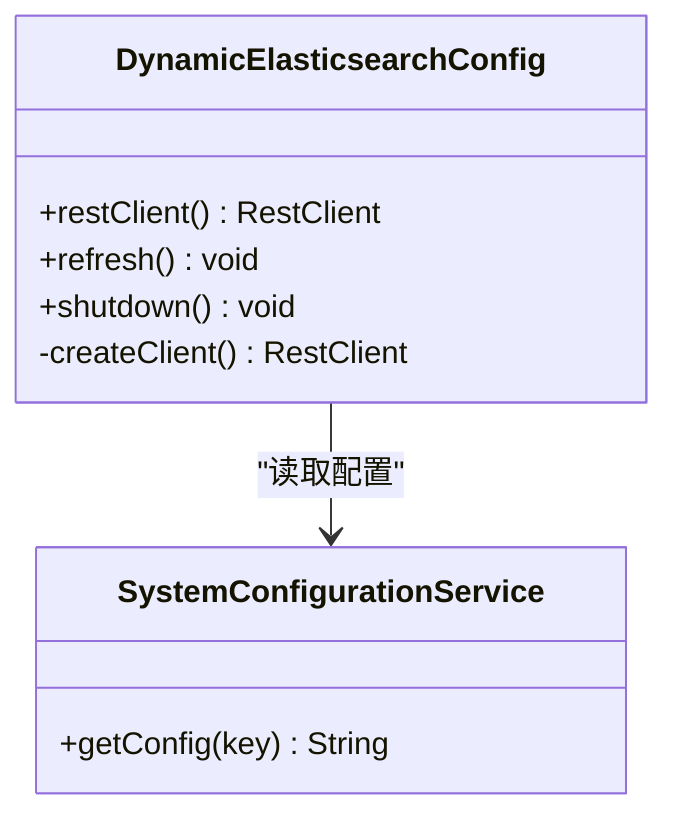
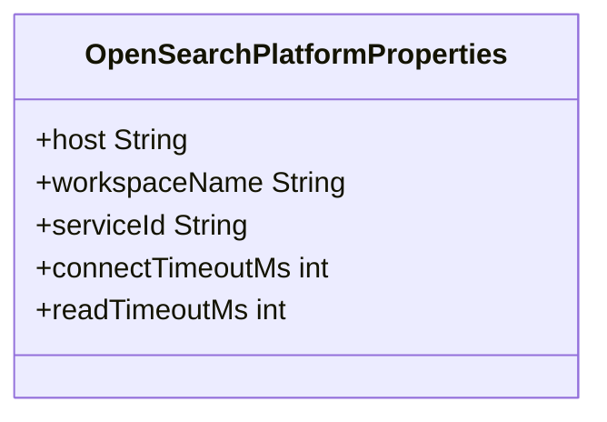
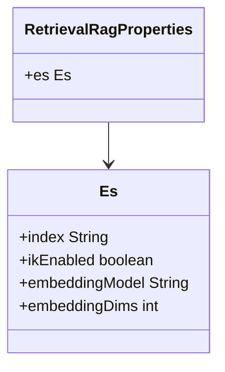
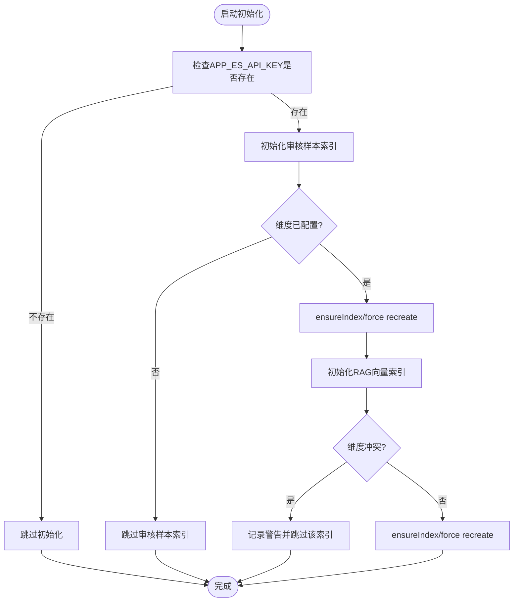
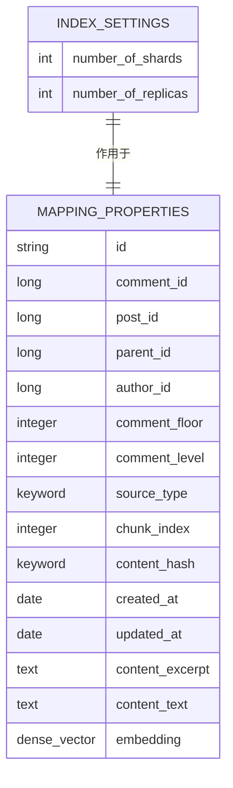
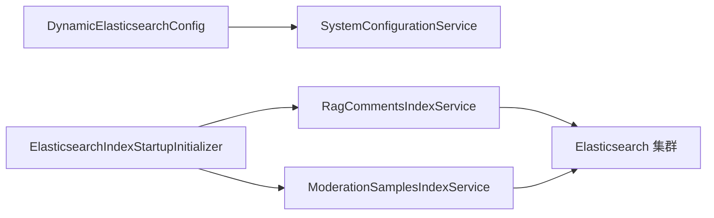
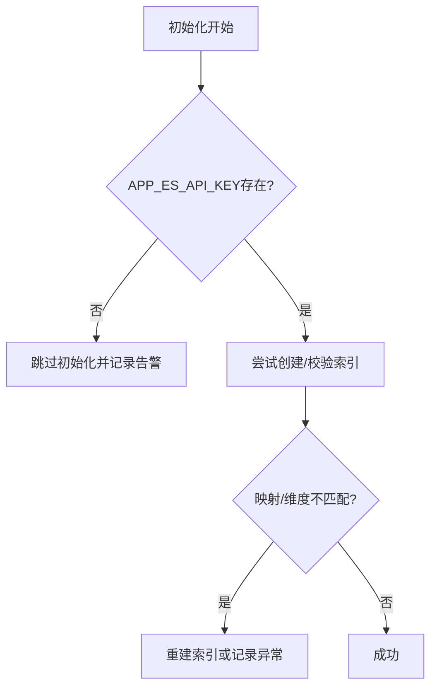

# Elasticsearch配置

<cite>
**本文引用的文件**
- [application.properties](file://src/main/resources/application.properties)
- [application-perf.properties](file://src/main/resources/application-perf.properties)
- [DynamicElasticsearchConfig.java](file://src/main/java/com/example/EnterpriseRagCommunity/config/DynamicElasticsearchConfig.java)
- [ElasticsearchApiKeyConfig.java](file://src/main/java/com/example/EnterpriseRagCommunity/config/ElasticsearchApiKeyConfig.java)
- [OpenSearchPlatformProperties.java](file://src/main/java/com/example/EnterpriseRagCommunity/config/OpenSearchPlatformProperties.java)
- [RetrievalRagProperties.java](file://src/main/java/com/example/EnterpriseRagCommunity/config/RetrievalRagProperties.java)
- [ElasticsearchIndexStartupInitializer.java](file://src/main/java/com/example/EnterpriseRagCommunity/config/ElasticsearchIndexStartupInitializer.java)
- [RagCommentsIndexService.java](file://src/main/java/com/example/EnterpriseRagCommunity/service/retrieval/es/RagCommentsIndexService.java)
- [ModerationSamplesIndexService.java](file://src/main/java/com/example/EnterpriseRagCommunity/service/moderation/ez/ModerationSamplesIndexService.java)
</cite>

## 目录
1. [简介](#简介)
2. [项目结构](#项目结构)
3. [核心组件](#核心组件)
4. [架构总览](#架构总览)
5. [详细组件分析](#详细组件分析)
6. [依赖关系分析](#依赖关系分析)
7. [性能考虑](#性能考虑)
8. [故障排查指南](#故障排查指南)
9. [结论](#结论)
10. [附录](#附录)

## 简介
本指南围绕企业级检索社区系统的Elasticsearch/OpenSearch配置进行系统性梳理，覆盖集群连接、认证与安全、索引模板与映射、查询性能优化、分片与副本、索引生命周期管理（ILM）、冷热分离、存储优化、监控与健康检查、故障恢复策略，以及阿里云OpenSearch平台的特定配置与最佳实践。文档以仓库中的实际配置与实现为依据，提供可操作的建议与可视化图示。

## 项目结构
与Elasticsearch/OpenSearch相关的关键位置如下：
- 应用配置：application.properties、application-perf.properties
- 动态客户端与认证：DynamicElasticsearchConfig、ElasticsearchApiKeyConfig
- 平台属性：OpenSearchPlatformProperties
- 检索参数：RetrievalRagProperties
- 启动时索引初始化：ElasticsearchIndexStartupInitializer
- 索引服务与映射：RagCommentsIndexService、ModerationSamplesIndexService

**图表来源**
- [application.properties:72-83](file://src/main/resources/application.properties#L72-L83)
- [application-perf.properties:1-6](file://src/main/resources/application-perf.properties#L1-L6)
- [DynamicElasticsearchConfig.java:36-126](file://src/main/java/com/example/EnterpriseRagCommunity/config/DynamicElasticsearchConfig.java#L36-L126)
- [OpenSearchPlatformProperties.java:10-16](file://src/main/java/com/example/EnterpriseRagCommunity/config/OpenSearchPlatformProperties.java#L10-L16)
- [RetrievalRagProperties.java:14-20](file://src/main/java/com/example/EnterpriseRagCommunity/config/RetrievalRagProperties.java#L14-L20)
- [ElasticsearchIndexStartupInitializer.java:57-191](file://src/main/java/com/example/EnterpriseRagCommunity/config/ElasticsearchIndexStartupInitializer.java#L57-L191)
- [RagCommentsIndexService.java:131-219](file://src/main/java/com/example/EnterpriseRagCommunity/service/retrieval/es/RagCommentsIndexService.java#L131-L219)
- [ModerationSamplesIndexService.java:221-236](file://src/main/java/com/example/EnterpriseRagCommunity/service/moderation/ez/ModerationSamplesIndexService.java#L221-L236)

**章节来源**
- [application.properties:72-83](file://src/main/resources/application.properties#L72-L83)
- [application-perf.properties:1-6](file://src/main/resources/application-perf.properties#L1-L6)
- [DynamicElasticsearchConfig.java:36-126](file://src/main/java/com/example/EnterpriseRagCommunity/config/DynamicElasticsearchConfig.java#L36-L126)
- [OpenSearchPlatformProperties.java:10-16](file://src/main/java/com/example/EnterpriseRagCommunity/config/OpenSearchPlatformProperties.java#L10-L16)
- [RetrievalRagProperties.java:14-20](file://src/main/java/com/example/EnterpriseRagCommunity/config/RetrievalRagProperties.java#L14-L20)
- [ElasticsearchIndexStartupInitializer.java:57-191](file://src/main/java/com/example/EnterpriseRagCommunity/config/ElasticsearchIndexStartupInitializer.java#L57-L191)
- [RagCommentsIndexService.java:131-219](file://src/main/java/com/example/EnterpriseRagCommunity/service/retrieval/es/RagCommentsIndexService.java#L131-L219)
- [ModerationSamplesIndexService.java:221-236](file://src/main/java/com/example/EnterpriseRagCommunity/service/moderation/ez/ModerationSamplesIndexService.java#L221-L236)

## 核心组件
- 动态Elasticsearch客户端与刷新：通过代理与热切换实现运行时刷新，支持API Key认证与URI列表。
- OpenSearch平台属性：封装阿里云OpenSearch平台的主机、工作空间、服务ID及超时配置。
- 检索参数：控制索引名称、IK分词器启用、嵌入维度等。
- 启动时索引初始化：根据系统配置与业务维度，自动创建或校验索引与映射。
- 索引服务与映射：构建索引settings与mapping，支持dense_vector、IK分词器与字段类型。

**章节来源**
- [DynamicElasticsearchConfig.java:36-126](file://src/main/java/com/example/EnterpriseRagCommunity/config/DynamicElasticsearchConfig.java#L36-L126)
- [OpenSearchPlatformProperties.java:10-16](file://src/main/java/com/example/EnterpriseRagCommunity/config/OpenSearchPlatformProperties.java#L10-L16)
- [RetrievalRagProperties.java:14-20](file://src/main/java/com/example/EnterpriseRagCommunity/config/RetrievalRagProperties.java#L14-L20)
- [ElasticsearchIndexStartupInitializer.java:57-191](file://src/main/java/com/example/EnterpriseRagCommunity/config/ElasticsearchIndexStartupInitializer.java#L57-L191)
- [RagCommentsIndexService.java:131-219](file://src/main/java/com/example/EnterpriseRagCommunity/service/retrieval/es/RagCommentsIndexService.java#L131-L219)

## 架构总览
下图展示从应用配置到索引初始化与客户端认证的整体流程：

**图表来源**
- [DynamicElasticsearchConfig.java:92-126](file://src/main/java/com/example/EnterpriseRagCommunity/config/DynamicElasticsearchConfig.java#L92-L126)
- [ElasticsearchIndexStartupInitializer.java:60-69](file://src/main/java/com/example/EnterpriseRagCommunity/config/ElasticsearchIndexStartupInitializer.java#L60-L69)

## 详细组件分析

### 动态Elasticsearch客户端与认证
- 支持多URI连接与热切换，刷新时关闭旧客户端并建立新连接。
- 优先从系统配置读取API Key，注入到默认请求头中；若未配置则执行未认证请求。
- 提供优雅关闭逻辑，避免资源泄漏。

**图表来源**
- [DynamicElasticsearchConfig.java:36-126](file://src/main/java/com/example/EnterpriseRagCommunity/config/DynamicElasticsearchConfig.java#L36-L126)

**章节来源**
- [DynamicElasticsearchConfig.java:36-126](file://src/main/java/com/example/EnterpriseRagCommunity/config/DynamicElasticsearchConfig.java#L36-L126)

### OpenSearch平台属性与阿里云OpenSearch
- 封装平台主机、工作空间、服务ID与连接/读取超时。
- 默认指向阿里云OpenSearch平台示例地址，便于快速接入。
- 可结合动态客户端与系统配置实现统一认证与连接管理。

**图表来源**
- [OpenSearchPlatformProperties.java:10-16](file://src/main/java/com/example/EnterpriseRagCommunity/config/OpenSearchPlatformProperties.java#L10-L16)

**章节来源**
- [OpenSearchPlatformProperties.java:10-16](file://src/main/java/com/example/EnterpriseRagCommunity/config/OpenSearchPlatformProperties.java#L10-L16)
- [application.properties:72-76](file://src/main/resources/application.properties#L72-L76)

### 检索参数与索引命名
- 控制默认索引名、IK分词器开关、嵌入模型与维度。
- 用于启动初始化阶段决定是否创建/重建索引。

**图表来源**
- [RetrievalRagProperties.java:14-20](file://src/main/java/com/example/EnterpriseRagCommunity/config/RetrievalRagProperties.java#L14-L20)

**章节来源**
- [RetrievalRagProperties.java:14-20](file://src/main/java/com/example/EnterpriseRagCommunity/config/RetrievalRagProperties.java#L14-L20)

### 启动时索引初始化与维度校验
- 在应用启动时根据系统配置与业务维度创建或校验索引。
- 若检测到映射不一致（如嵌入维度不匹配），可选择重建索引。
- 对审核样本索引与RAG向量索引分别处理，兼容多种数据源类型。

**图表来源**
- [ElasticsearchIndexStartupInitializer.java:57-191](file://src/main/java/com/example/EnterpriseRagCommunity/config/ElasticsearchIndexStartupInitializer.java#L57-L191)

**章节来源**
- [ElasticsearchIndexStartupInitializer.java:57-191](file://src/main/java/com/example/EnterpriseRagCommunity/config/ElasticsearchIndexStartupInitializer.java#L57-L191)

### 索引模板与映射（以评论索引为例）
- settings：默认1个主分片、0个副本；可选IK分析器配置。
- mapping：包含基础字段、文本字段（支持IK分词器）、可选dense_vector字段（向量）。
- 嵌入维度读取与校验：从现有映射解析，若不匹配则抛出异常提示重建。

**图表来源**
- [RagCommentsIndexService.java:155-219](file://src/main/java/com/example/EnterpriseRagCommunity/service/retrieval/es/RagCommentsIndexService.java#L155-L219)

**章节来源**
- [RagCommentsIndexService.java:131-219](file://src/main/java/com/example/EnterpriseRagCommunity/service/retrieval/es/RagCommentsIndexService.java#L131-L219)

### 审核样本索引服务（映射与设置）
- 设置与映射构建遵循与评论索引一致的模式，但对IK启用有更明确的注释与回退逻辑。
- 当IK不可用时自动降级为非IK设置，确保可用性。

**章节来源**
- [ModerationSamplesIndexService.java:221-236](file://src/main/java/com/example/EnterpriseRagCommunity/service/moderation/ez/ModerationSamplesIndexService.java#L221-L236)

## 依赖关系分析
- DynamicElasticsearchConfig依赖SystemConfigurationService读取URIs与API Key。
- ElasticsearchIndexStartupInitializer依赖多个索引服务与系统配置，负责初始化与维度校验。
- 索引服务依赖Spring Data Elasticsearch Template与IndexOperations进行创建与映射更新。

**图表来源**
- [DynamicElasticsearchConfig.java:29](file://src/main/java/com/example/EnterpriseRagCommunity/config/DynamicElasticsearchConfig.java#L29)
- [ElasticsearchIndexStartupInitializer.java:34-41](file://src/main/java/com/example/EnterpriseRagCommunity/config/ElasticsearchIndexStartupInitializer.java#L34-L41)
- [RagCommentsIndexService.java:26](file://src/main/java/com/example/EnterpriseRagCommunity/service/retrieval/es/RagCommentsIndexService.java#L26)
- [ModerationSamplesIndexService.java:29](file://src/main/java/com/example/EnterpriseRagCommunity/service/moderation/ez/ModerationSamplesIndexService.java#L29)

**章节来源**
- [DynamicElasticsearchConfig.java:29](file://src/main/java/com/example/EnterpriseRagCommunity/config/DynamicElasticsearchConfig.java#L29)
- [ElasticsearchIndexStartupInitializer.java:34-41](file://src/main/java/com/example/EnterpriseRagCommunity/config/ElasticsearchIndexStartupInitializer.java#L34-L41)
- [RagCommentsIndexService.java:26](file://src/main/java/com/example/EnterpriseRagCommunity/service/retrieval/es/RagCommentsIndexService.java#L26)
- [ModerationSamplesIndexService.java:29](file://src/main/java/com/example/EnterpriseRagCommunity/service/moderation/ez/ModerationSamplesIndexService.java#L29)

## 性能考虑
- 连接与超时：通过application.properties配置连接与套接字超时，建议按网络环境调整。
- 分片与副本：默认1主分片、0副本，适合开发与小规模场景；生产需根据写入吞吐与查询并发评估分片数与副本数。
- IK分词器：仅在集群安装IK插件时启用，避免不必要的分词开销。
- 向量检索：dense_vector字段的相似度算法与维度需与嵌入模型一致，避免映射不匹配导致的失败。
- 监控与指标：开启Prometheus暴露端点，结合健康检查与日志级别定位性能瓶颈。

**章节来源**
- [application.properties:79-82](file://src/main/resources/application.properties#L79-L82)
- [RagCommentsIndexService.java:155-173](file://src/main/java/com/example/EnterpriseRagCommunity/service/retrieval/es/RagCommentsIndexService.java#L155-L173)
- [application-perf.properties:1-6](file://src/main/resources/application-perf.properties#L1-L6)

## 故障排查指南
- API Key缺失：启动初始化会跳过，需在系统配置中设置APP_ES_API_KEY。
- 映射不一致：当嵌入维度与现有索引不一致时，抛出异常并提示重建索引。
- IK不可用：若IK插件未安装，系统会自动降级为标准分词器并记录警告。
- 客户端刷新：通过refresh方法热切换客户端，注意旧连接关闭异常的告警。

**图表来源**
- [ElasticsearchIndexStartupInitializer.java:60-69](file://src/main/java/com/example/EnterpriseRagCommunity/config/ElasticsearchIndexStartupInitializer.java#L60-L69)
- [RagCommentsIndexService.java:61-71](file://src/main/java/com/example/EnterpriseRagCommunity/service/retrieval/es/RagCommentsIndexService.java#L61-L71)

**章节来源**
- [ElasticsearchIndexStartupInitializer.java:60-69](file://src/main/java/com/example/EnterpriseRagCommunity/config/ElasticsearchIndexStartupInitializer.java#L60-L69)
- [RagCommentsIndexService.java:61-71](file://src/main/java/com/example/EnterpriseRagCommunity/service/retrieval/es/RagCommentsIndexService.java#L61-L71)
- [DynamicElasticsearchConfig.java:57-79](file://src/main/java/com/example/EnterpriseRagCommunity/config/DynamicElasticsearchConfig.java#L57-L79)

## 结论
本项目通过动态客户端与系统配置实现了灵活的Elasticsearch/OpenSearch连接与认证；借助启动初始化与索引服务，能够按业务需求自动创建/校验索引与映射，并对IK与向量维度进行严格校验。结合阿里云OpenSearch平台属性与监控配置，可在不同环境中快速落地并稳定运行。

## 附录

### 配置项速查
- 集群连接与认证
  - spring.elasticsearch.uris：逗号分隔的节点列表（动态客户端会解析）
  - spring.elasticsearch.connection-timeout/spring.elasticsearch.socket-timeout：连接与读取超时
  - spring.elasticsearch.username/password：用户名密码（当前由API Key优先处理）
  - APP_ES_API_KEY：系统配置中的API Key，注入到请求头
- OpenSearch平台
  - app.opensearch.platform.host/workspace-name/service-id/connect/read-timeout-ms：平台接入参数
- 检索与索引
  - app.retrieval.rag.es.index/ik-enabled/embedding-dims：索引名、IK开关、嵌入维度
- 启动初始化
  - app.es.init.enabled/force-recreate/fail-on-error：初始化开关、强制重建、失败策略

**章节来源**
- [application.properties:72-83](file://src/main/resources/application.properties#L72-L83)
- [application-perf.properties:1-6](file://src/main/resources/application-perf.properties#L1-L6)
- [OpenSearchPlatformProperties.java:10-16](file://src/main/java/com/example/EnterpriseRagCommunity/config/OpenSearchPlatformProperties.java#L10-L16)
- [RetrievalRagProperties.java:14-20](file://src/main/java/com/example/EnterpriseRagCommunity/config/RetrievalRagProperties.java#L14-L20)
- [ElasticsearchIndexStartupInitializer.java:43-50](file://src/main/java/com/example/EnterpriseRagCommunity/config/ElasticsearchIndexStartupInitializer.java#L43-L50)