# MySQL数据库配置

<cite>
**本文档引用的文件**
- [application.properties](file://src/main/resources/application.properties)
- [application-perf.properties](file://src/main/resources/application-perf.properties)
- [CustomFlywayConfiguration.java](file://src/main/java/com/example/EnterpriseRagCommunity/config/CustomFlywayConfiguration.java)
- [V1__table_design.sql](file://bin/main/db/migration/V1__table_design.sql)
- [V3__system_default_configs.sql](file://bin/main/db/migration/V3__system_default_configs.sql)
- [MySQLTestContainerBootstrap.java](file://src/test/java/com/example/EnterpriseRagCommunity/testsupport/MySQLTestContainerBootstrap.java)
- [FlywayMigrationsSmokeTest.java](file://src/test/java/com/example/EnterpriseRagCommunity/db/FlywayMigrationsSmokeTest.java)
- [DynamicConfigurationLoader.java](file://src/main/java/com/example/EnterpriseRagCommunity/config/DynamicConfigurationLoader.java)
</cite>

## 目录
1. [简介](#简介)
2. [项目结构](#项目结构)
3. [核心组件](#核心组件)
4. [架构概览](#架构概览)
5. [详细组件分析](#详细组件分析)
6. [依赖关系分析](#依赖关系分析)
7. [性能考虑](#性能考虑)
8. [故障排除指南](#故障排除指南)
9. [结论](#结论)
10. [附录](#附录)

## 简介
本文件详细说明了Enterprise RAG Community项目的MySQL数据库配置，包括数据库连接配置、Hikari连接池参数设置、Flyway数据库迁移管理。文档涵盖了数据库初始化脚本、表结构设计和约束定义，并详细解释了数据库连接字符串格式、认证配置和安全设置。同时提供了数据库性能调优参数、连接池大小配置和超时设置建议，以及数据库备份恢复策略、主从复制配置和高可用部署方案。

## 项目结构
该项目采用Spring Boot框架，数据库配置主要集中在以下位置：

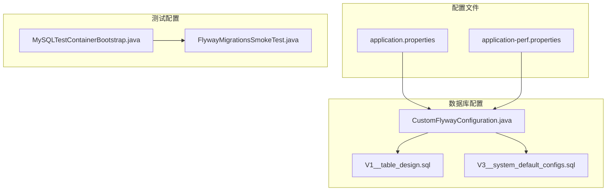

**图表来源**
- [application.properties:1-84](file://src/main/resources/application.properties#L1-L84)
- [CustomFlywayConfiguration.java:1-50](file://src/main/java/com/example/EnterpriseRagCommunity/config/CustomFlywayConfiguration.java#L1-L50)
- [V1__table_design.sql:1-800](file://bin/main/db/migration/V1__table_design.sql#L1-L800)

**章节来源**
- [application.properties:1-84](file://src/main/resources/application.properties#L1-L84)
- [application-perf.properties:1-6](file://src/main/resources/application-perf.properties#L1-L6)

## 核心组件

### 数据库连接配置
项目使用标准的Spring Boot数据库配置方式，支持环境变量覆盖：

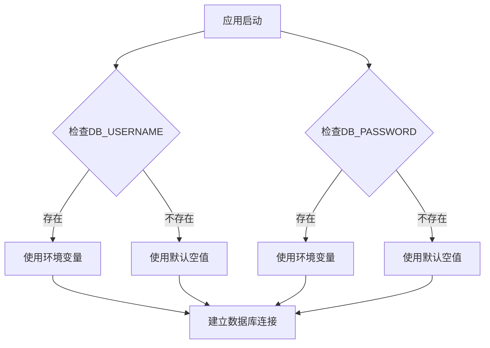

**图表来源**
- [application.properties:8-10](file://src/main/resources/application.properties#L8-L10)

### Hikari连接池配置
连接池参数通过环境变量灵活配置：

| 参数名称 | 默认值 | 描述 |
|---------|--------|------|
| DB_POOL_MAX | 20 | 最大连接数 |
| DB_POOL_MIN_IDLE | 5 | 最小空闲连接数 |
| DB_POOL_CONN_TIMEOUT_MS | 10000 | 连接超时(毫秒) |
| DB_POOL_VALIDATION_TIMEOUT_MS | 3000 | 验证超时(毫秒) |
| DB_POOL_IDLE_TIMEOUT_MS | 600000 | 空闲超时(毫秒) |
| DB_POOL_MAX_LIFETIME_MS | 1800000 | 连接最大生命周期(毫秒) |

**章节来源**
- [application.properties:11-16](file://src/main/resources/application.properties#L11-L16)

### Flyway迁移配置
项目实现了自定义的Flyway配置类：

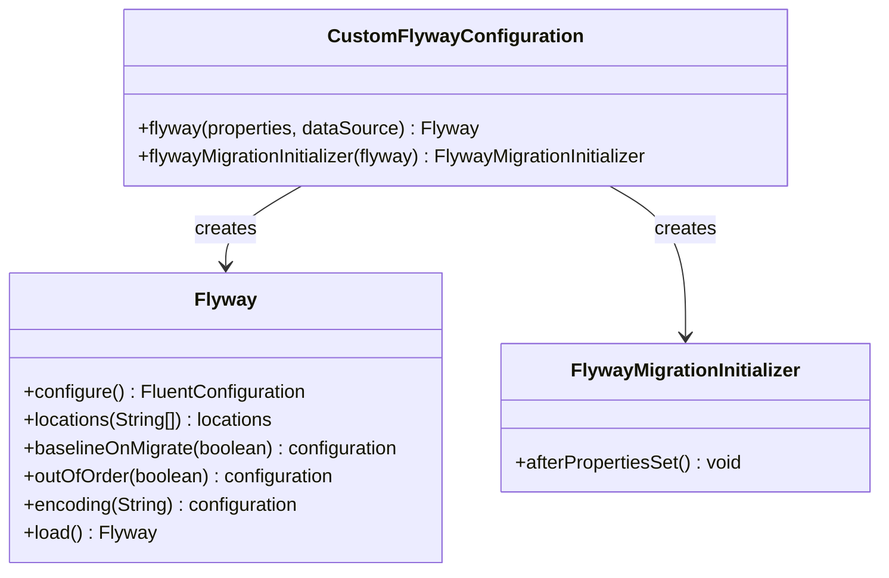

**图表来源**
- [CustomFlywayConfiguration.java:15-49](file://src/main/java/com/example/EnterpriseRagCommunity/config/CustomFlywayConfiguration.java#L15-L49)

**章节来源**
- [CustomFlywayConfiguration.java:1-50](file://src/main/java/com/example/EnterpriseRagCommunity/config/CustomFlywayConfiguration.java#L1-L50)

## 架构概览

### 数据库层架构
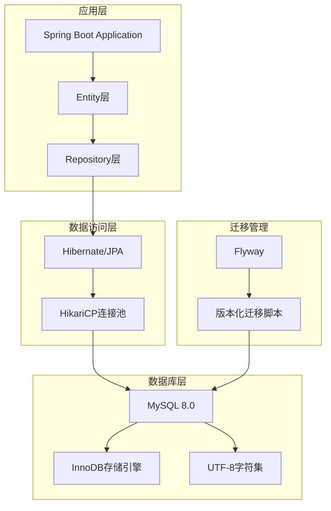

**图表来源**
- [application.properties:7-24](file://src/main/resources/application.properties#L7-L24)
- [CustomFlywayConfiguration.java:18-39](file://src/main/java/com/example/EnterpriseRagCommunity/config/CustomFlywayConfiguration.java#L18-L39)

## 详细组件分析

### 数据库连接字符串详解

#### 基础连接参数
连接字符串包含以下关键参数：

| 参数 | 值 | 说明 |
|------|-----|------|
| createDatabaseIfNotExist | true | 自动创建数据库 |
| useSSL | false | 禁用SSL连接 |
| serverTimezone | Asia/Shanghai | 服务器时区 |
| allowPublicKeyRetrieval | true | 允许公钥检索 |

#### 连接字符串格式
```
jdbc:mysql://主机:端口/数据库名?参数1=值1&参数2=值2&...
```

**章节来源**
- [application.properties:8-8](file://src/main/resources/application.properties#L8-L8)

### 表结构设计分析

#### 核心业务表
项目包含完整的业务表结构设计，涵盖用户管理、内容管理、审核系统等多个模块：

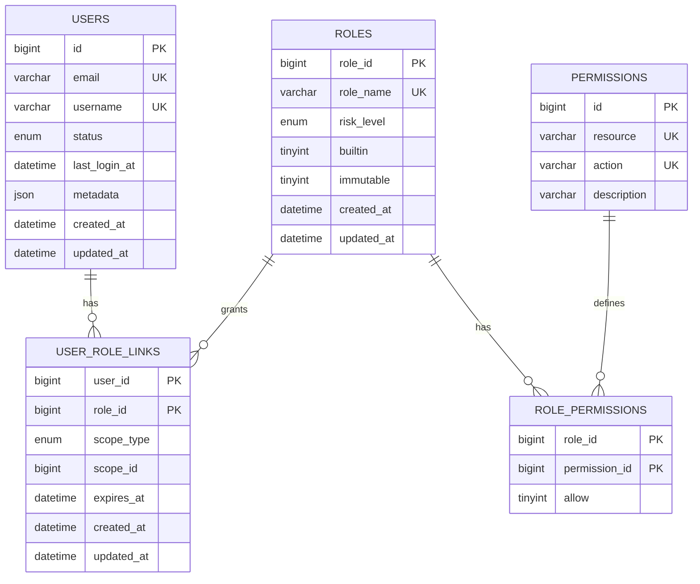

**图表来源**
- [V1__table_design.sql:16-95](file://bin/main/db/migration/V1__table_design.sql#L16-L95)

#### 约束和索引设计
- **唯一约束**: 用户邮箱、用户名组合唯一性保证
- **外键约束**: 角色权限关联、用户角色关联的完整性
- **复合索引**: 高频查询字段的组合索引优化
- **全文索引**: 文档内容的全文检索支持

**章节来源**
- [V1__table_design.sql:16-95](file://bin/main/db/migration/V1__table_design.sql#L16-L95)

### Flyway迁移管理

#### 迁移脚本组织
项目采用版本化的迁移脚本管理：

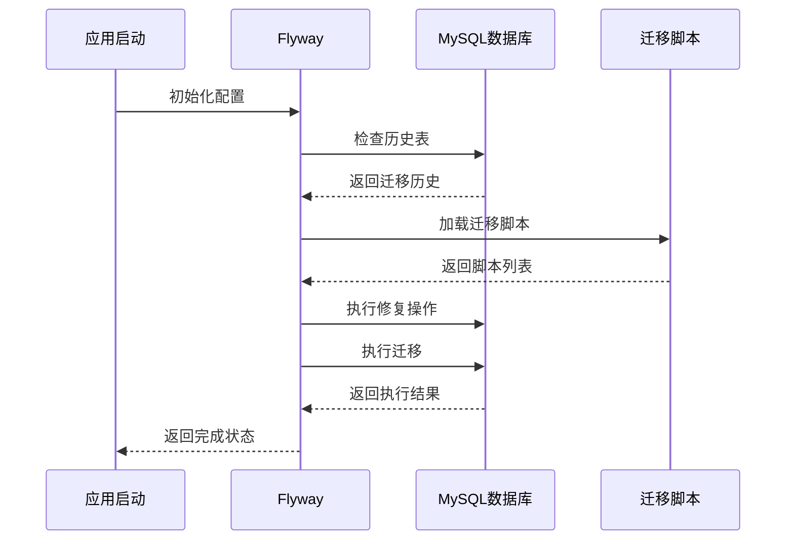

**图表来源**
- [CustomFlywayConfiguration.java:43-48](file://src/main/java/com/example/EnterpriseRagCommunity/config/CustomFlywayConfiguration.java#L43-L48)

#### 迁移脚本特性
- **幂等性**: 使用INSERT IGNORE和条件检查确保重复执行安全
- **版本管理**: 严格的版本号递增管理
- **编码设置**: 统一使用UTF-8编码
- **基准版本**: 支持从指定版本开始迁移

**章节来源**
- [CustomFlywayConfiguration.java:18-40](file://src/main/java/com/example/EnterpriseRagCommunity/config/CustomFlywayConfiguration.java#L18-L40)

### 动态配置加载

#### 配置系统架构
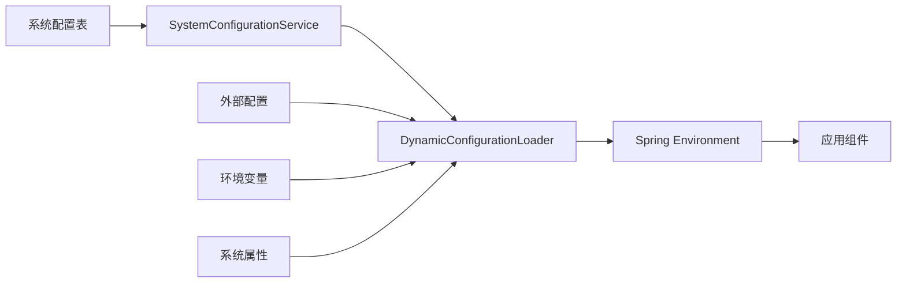

**图表来源**
- [DynamicConfigurationLoader.java:24-45](file://src/main/java/com/example/EnterpriseRagCommunity/config/DynamicConfigurationLoader.java#L24-L45)

**章节来源**
- [DynamicConfigurationLoader.java:1-46](file://src/main/java/com/example/EnterpriseRagCommunity/config/DynamicConfigurationLoader.java#L1-L46)

## 依赖关系分析

### 外部依赖关系
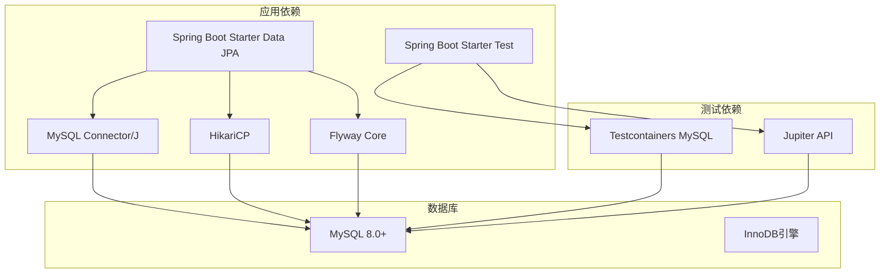

**图表来源**
- [application.properties:7-24](file://src/main/resources/application.properties#L7-L24)

### 内部组件依赖
- **配置层**: application.properties → CustomFlywayConfiguration
- **数据访问层**: CustomFlywayConfiguration → 实体映射
- **测试层**: MySQLTestContainerBootstrap → FlywayMigrationsSmokeTest

**章节来源**
- [application.properties:1-84](file://src/main/resources/application.properties#L1-L84)

## 性能考虑

### 连接池优化建议

#### 连接池参数调优
基于应用负载特征，建议以下参数配置：

| 参数 | 生产环境建议 | 测试环境建议 | 说明 |
|------|-------------|-------------|------|
| maximum-pool-size | 50-100 | 10-20 | 根据并发请求数调整 |
| minimum-idle | 10-25 | 2-5 | 保持的最小空闲连接 |
| connection-timeout | 30000-60000 | 10000 | 连接获取超时时间 |
| validation-timeout | 5000-10000 | 3000 | 连接验证超时时间 |
| idle-timeout | 600000 | 300000 | 空闲连接回收时间 |
| max-lifetime | 1800000-3600000 | 1800000 | 连接最大存活时间 |

#### 数据库性能优化
- **索引优化**: 为高频查询字段建立合适的索引
- **查询优化**: 使用EXPLAIN分析慢查询
- **连接复用**: 合理配置连接池参数避免连接泄漏
- **事务管理**: 使用适当的事务隔离级别

### 监控和调优

#### 性能监控配置
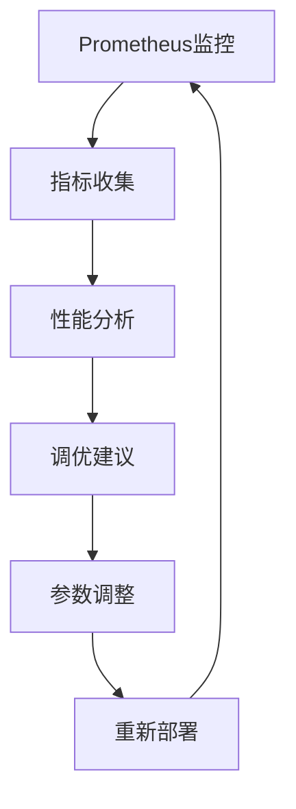

**图表来源**
- [application-perf.properties:1-6](file://src/main/resources/application-perf.properties#L1-L6)

**章节来源**
- [application-perf.properties:1-6](file://src/main/resources/application-perf.properties#L1-L6)

## 故障排除指南

### 常见连接问题

#### 连接超时问题
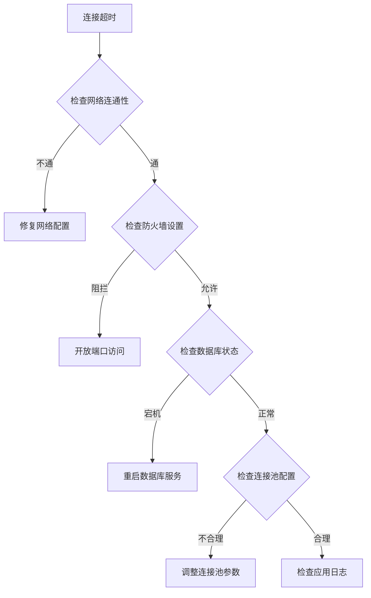

#### 认证失败排查
- **检查用户名密码**: 确认环境变量设置正确
- **验证SSL配置**: 根据生产环境调整SSL设置
- **检查时区配置**: 确保serverTimezone设置正确
- **验证公钥检索**: 在开发环境允许公钥检索

### 迁移问题处理

#### Flyway迁移失败
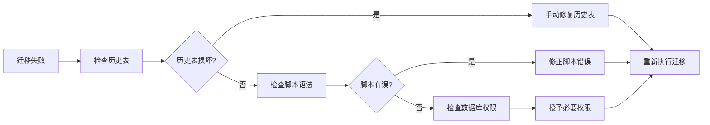

**章节来源**
- [FlywayMigrationsSmokeTest.java:11-27](file://src/test/java/com/example/EnterpriseRagCommunity/db/FlywayMigrationsSmokeTest.java#L11-L27)

### 测试环境配置

#### Docker测试容器
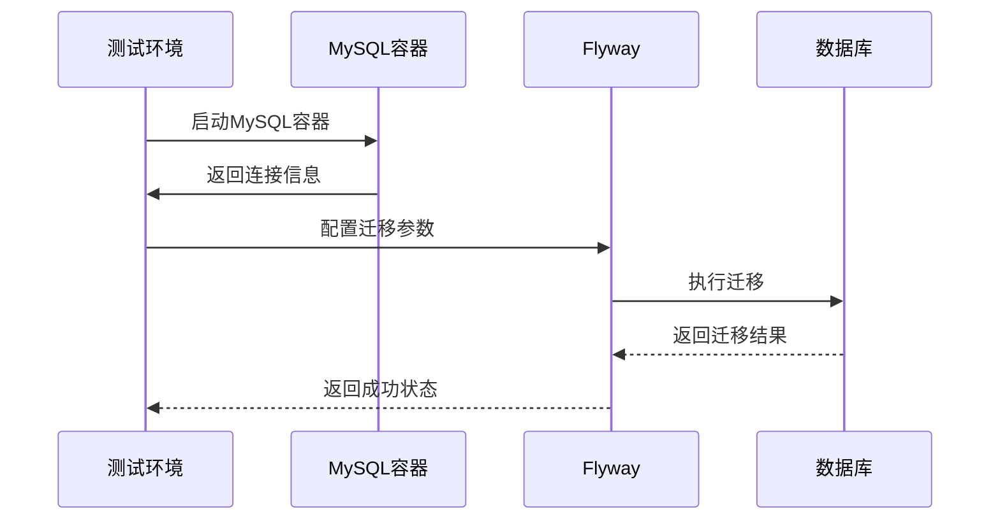

**图表来源**
- [MySQLTestContainerBootstrap.java:35-51](file://src/test/java/com/example/EnterpriseRagCommunity/testsupport/MySQLTestContainerBootstrap.java#L35-L51)

**章节来源**
- [MySQLTestContainerBootstrap.java:35-51](file://src/test/java/com/example/EnterpriseRagCommunity/testsupport/MySQLTestContainerBootstrap.java#L35-L51)

## 结论
本项目的MySQL数据库配置采用了现代化的最佳实践，包括：

1. **标准化配置**: 使用Spring Boot标准配置方式，支持环境变量覆盖
2. **连接池优化**: HikariCP提供高性能的连接池管理
3. **版本化迁移**: Flyway实现数据库版本化管理
4. **动态配置**: 支持运行时配置更新
5. **测试友好**: 提供Docker测试容器支持

这些配置为生产环境提供了稳定可靠的数据库基础设施，支持高并发访问和持续演进。

## 附录

### 安全配置建议

#### 生产环境安全加固
- **SSL连接**: 在生产环境启用SSL连接
- **强密码策略**: 使用复杂密码并定期轮换
- **网络隔离**: 将数据库部署在私有网络中
- **访问控制**: 限制数据库访问IP范围
- **审计日志**: 启用数据库审计功能

#### 备份和恢复策略
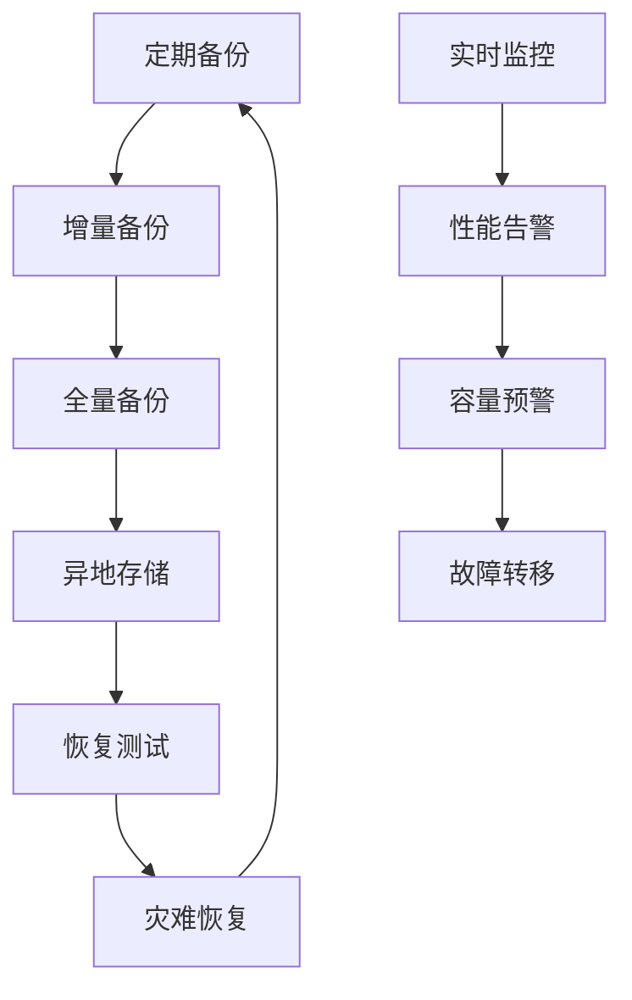

#### 高可用部署方案
- **主从复制**: 配置MySQL主从复制实现读写分离
- **集群部署**: 使用MySQL Group Replication构建集群
- **负载均衡**: 通过ProxySQL实现连接池负载均衡
- **故障转移**: 配置自动故障转移机制