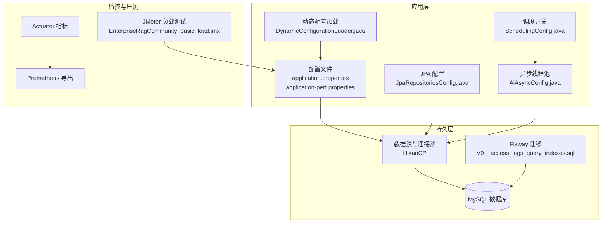
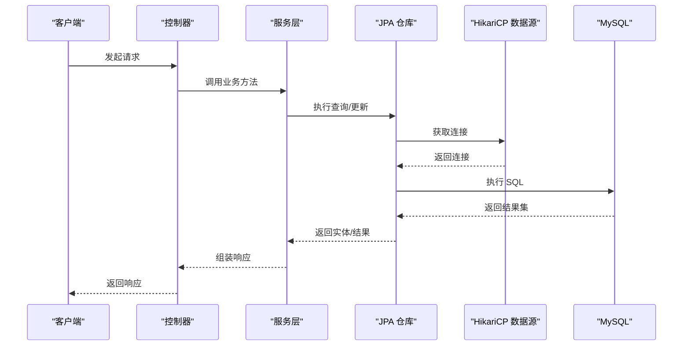
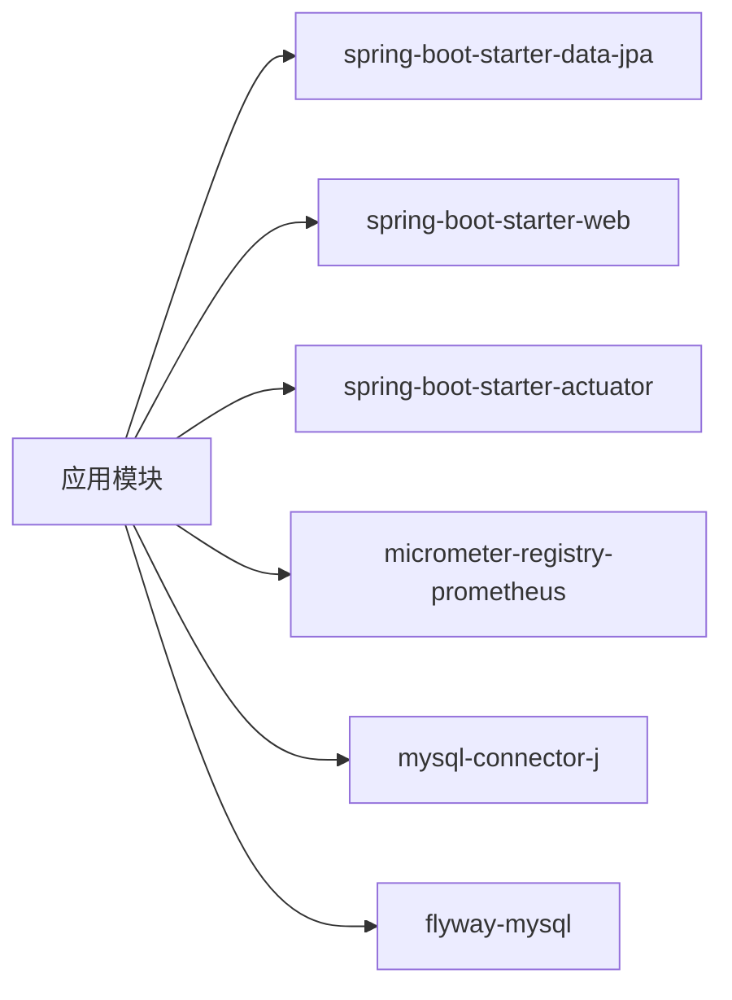

# 数据库性能优化

<cite>
**本文引用的文件**
- [application.properties](file://src/main/resources/application.properties)
- [application-perf.properties](file://src/main/resources/application-perf.properties)
- [V9__access_logs_query_indexes.sql](file://src/main/resources/db/migration/V9__access_logs_query_indexes.sql)
- [JpaRepositoriesConfig.java](file://src/main/java/com/example/EnterpriseRagCommunity/config/JpaRepositoriesConfig.java)
- [AiAsyncConfig.java](file://src/main/java/com/example/EnterpriseRagCommunity/config/AiAsyncConfig.java)
- [SchedulingConfig.java](file://src/main/java/com/example/EnterpriseRagCommunity/config/SchedulingConfig.java)
- [DynamicConfigurationLoader.java](file://src/main/java/com/example/EnterpriseRagCommunity/config/DynamicConfigurationLoader.java)
- [build.gradle](file://build.gradle)
- [EnterpriseRagCommunity_basic_load.jmx](file://perf/jmeter/EnterpriseRagCommunity_basic_load.jmx)
</cite>

## 目录
1. [简介](#简介)
2. [项目结构](#项目结构)
3. [核心组件](#核心组件)
4. [架构总览](#架构总览)
5. [详细组件分析](#详细组件分析)
6. [依赖分析](#依赖分析)
7. [性能考量](#性能考量)
8. [故障排查指南](#故障排查指南)
9. [结论](#结论)
10. [附录](#附录)

## 简介
本指南面向数据库性能优化，结合本项目的实际配置与实现，系统阐述以下主题：
- MySQL 性能调优参数与连接池配置
- 索引优化策略与查询优化技巧
- 并发控制、线程池与资源管理
- 慢查询分析、执行计划优化与统计信息更新
- 缓存策略、批量操作与异步处理
- 监控指标、瓶颈识别与容量规划
- 读写分离、分库分表与分布式事务处理思路

本指南以“可落地”为原则，既提供原理性建议，也给出与代码直接对应的配置与实现位置，便于快速定位与验证。

## 项目结构
本项目采用 Spring Boot + Spring Data JPA + Flyway 的典型后端架构，数据库访问通过 HikariCP 连接池完成，Actuator + Micrometer + Prometheus 提供运行时监控能力。关键性能相关配置集中在应用配置文件与构建脚本中，并通过 Flyway 进行数据库迁移与索引增强。

图表来源
- [application.properties:1-84](file://src/main/resources/application.properties#L1-L84)
- [application-perf.properties:1-6](file://src/main/resources/application-perf.properties#L1-L6)
- [JpaRepositoriesConfig.java:1-12](file://src/main/java/com/example/EnterpriseRagCommunity/config/JpaRepositoriesConfig.java#L1-L12)
- [AiAsyncConfig.java:1-47](file://src/main/java/com/example/EnterpriseRagCommunity/config/AiAsyncConfig.java#L1-L47)
- [SchedulingConfig.java:1-12](file://src/main/java/com/example/EnterpriseRagCommunity/config/SchedulingConfig.java#L1-L12)
- [DynamicConfigurationLoader.java:1-46](file://src/main/java/com/example/EnterpriseRagCommunity/config/DynamicConfigurationLoader.java#L1-L46)
- [V9__access_logs_query_indexes.sql:1-4](file://src/main/resources/db/migration/V9__access_logs_query_indexes.sql#L1-L4)
- [build.gradle:102-138](file://build.gradle#L102-L138)
- [EnterpriseRagCommunity_basic_load.jmx:1-83](file://perf/jmeter/EnterpriseRagCommunity_basic_load.jmx#L1-L83)

章节来源
- [application.properties:1-84](file://src/main/resources/application.properties#L1-L84)
- [application-perf.properties:1-6](file://src/main/resources/application-perf.properties#L1-L6)
- [JpaRepositoriesConfig.java:1-12](file://src/main/java/com/example/EnterpriseRagCommunity/config/JpaRepositoriesConfig.java#L1-L12)
- [AiAsyncConfig.java:1-47](file://src/main/java/com/example/EnterpriseRagCommunity/config/AiAsyncConfig.java#L1-L47)
- [SchedulingConfig.java:1-12](file://src/main/java/com/example/EnterpriseRagCommunity/config/SchedulingConfig.java#L1-L12)
- [DynamicConfigurationLoader.java:1-46](file://src/main/java/com/example/EnterpriseRagCommunity/config/DynamicConfigurationLoader.java#L1-L46)
- [V9__access_logs_query_indexes.sql:1-4](file://src/main/resources/db/migration/V9__access_logs_query_indexes.sql#L1-L4)
- [build.gradle:102-138](file://build.gradle#L102-L138)
- [EnterpriseRagCommunity_basic_load.jmx:1-83](file://perf/jmeter/EnterpriseRagCommunity_basic_load.jmx#L1-L83)

## 核心组件
- 数据源与连接池：通过 HikariCP 提供高性能连接池，默认最大池大小、空闲超时、最大存活时间等参数均可通过环境变量动态调整。
- JPA 仓库扫描：统一启用 JPA 仓库包扫描，确保实体映射与查询接口按约定组织。
- 异步线程池：为 AI 相关任务、文件提取与 RAG 索引构建提供独立线程池，避免阻塞主线程。
- 动态配置加载：从数据库系统配置表加载键值对，注入到 Spring Environment，支持热更新。
- 监控与导出：启用 Actuator 指标并通过 Prometheus 导出，便于集成监控平台。
- 数据库迁移：Flyway 管理版本化迁移，包含针对访问日志表的复合索引优化。

章节来源
- [application.properties:7-16](file://src/main/resources/application.properties#L7-L16)
- [JpaRepositoriesConfig.java:7-10](file://src/main/java/com/example/EnterpriseRagCommunity/config/JpaRepositoriesConfig.java#L7-L10)
- [AiAsyncConfig.java:13-45](file://src/main/java/com/example/EnterpriseRagCommunity/config/AiAsyncConfig.java#L13-L45)
- [DynamicConfigurationLoader.java:24-45](file://src/main/java/com/example/EnterpriseRagCommunity/config/DynamicConfigurationLoader.java#L24-L45)
- [application-perf.properties:1-6](file://src/main/resources/application-perf.properties#L1-L6)
- [V9__access_logs_query_indexes.sql:1-4](file://src/main/resources/db/migration/V9__access_logs_query_indexes.sql#L1-L4)

## 架构总览
下图展示数据库访问链路与性能相关配置的交互关系：

图表来源
- [application.properties:7-16](file://src/main/resources/application.properties#L7-L16)
- [JpaRepositoriesConfig.java:7-10](file://src/main/java/com/example/EnterpriseRagCommunity/config/JpaRepositoriesConfig.java#L7-L10)
- [build.gradle:107,118](file://build.gradle#L107,L118)

## 详细组件分析

### 数据库连接池与参数优化
- 连接池参数
  - 最大池大小：通过环境变量控制，避免过度占用系统内存与上下文切换开销。
  - 最小空闲数：维持一定空闲连接以降低新连接建立延迟。
  - 连接超时与校验超时：缩短等待与无效连接检测时间，提升可用性。
  - 空闲超时与最大生存时间：防止连接泄漏与长时间占用资源。
- MySQL 驱动与版本
  - 构建脚本声明了 MySQL Connector/J 版本，确保与数据库兼容性与性能特性一致。
- 生产建议
  - 根据 QPS 与并发度调优最大池大小；结合慢查询与连接池指标（如繁忙度、拒绝次数）迭代。
  - 启用连接池健康检查与自动回收策略，避免“假连接”导致的请求失败。

章节来源
- [application.properties:7-16](file://src/main/resources/application.properties#L7-L16)
- [build.gradle:10,118](file://build.gradle#L10,L118)

### 索引优化策略
- 访问日志表复合索引
  - 针对归档时间、用户 ID、状态码与创建时间等字段组合建立复合索引，支撑高频查询路径。
- 设计原则
  - 将最常过滤的列放在前部，遵循“最左前缀”原则。
  - 结合查询模式选择覆盖索引，减少回表成本。
  - 定期评估索引选择性与维护成本，清理冗余索引。
- 实施步骤
  - 使用 EXPLAIN 分析慢查询，确认索引是否命中。
  - 借助数据库统计信息与查询直方图，识别热点字段与排序/连接场景。

章节来源
- [V9__access_logs_query_indexes.sql:1-4](file://src/main/resources/db/migration/V9__access_logs_query_indexes.sql#L1-L4)

### 查询优化技巧
- 避免 SELECT *
  - 明确指定所需列，减少网络与解析开销。
- 合理使用 LIMIT
  - 对分页与列表查询添加上限，防止一次性返回过多数据。
- 避免在 WHERE 子句中对列进行函数计算或隐式类型转换。
- 使用 EXISTS 替代 IN 子查询（当子查询可能返回大量数据时）。
- 利用 JOIN 代替多轮查询，减少往返次数。
- 对于聚合查询，优先考虑物化视图或定期汇总表。

（本节为通用实践，不直接分析具体文件）

### 并发控制与资源管理
- 线程池配置
  - AI 相关任务线程池：核心池大小、最大池大小、队列容量与拒绝策略需根据任务特征与 SLA 调整。
  - 文件提取与 RAG 索引线程池：独立隔离，避免相互影响。
- 调度开关
  - 通过条件注解启用/禁用定时任务，降低非必要负载。
- 动态配置加载
  - 将系统配置从数据库拉取并注入到运行时，支持热更新关键参数（如阈值、开关）。

章节来源
- [AiAsyncConfig.java:13-45](file://src/main/java/com/example/EnterpriseRagCommunity/config/AiAsyncConfig.java#L13-L45)
- [SchedulingConfig.java:8-11](file://src/main/java/com/example/EnterpriseRagCommunity/config/SchedulingConfig.java#L8-L11)
- [DynamicConfigurationLoader.java:24-45](file://src/main/java/com/example/EnterpriseRagCommunity/config/DynamicConfigurationLoader.java#L24-L45)

### 慢查询分析与执行计划优化
- 工具与流程
  - 开启慢查询日志与慢查询阈值，结合 EXPLAIN/ANALYZE 分析执行计划。
  - 关注全表扫描、回表、临时表与排序等高成本操作。
  - 定期更新表与索引统计信息，确保优化器做出正确决策。
- 与项目结合
  - 访问日志表的复合索引已针对常见查询模式优化，建议持续观察慢查询日志与执行计划变化。

章节来源
- [V9__access_logs_query_indexes.sql:1-4](file://src/main/resources/db/migration/V9__access_logs_query_indexes.sql#L1-L4)

### 缓存策略、批量操作与异步处理
- 缓存策略
  - 对热点只读数据（如配置、字典）采用本地缓存+分布式缓存双写，设置合理过期与失效策略。
  - 使用缓存预热与异步刷新，避免冷启动抖动。
- 批量操作
  - 批量插入/更新时调整 JDBC 批处理参数，减少网络往返。
  - 控制批次大小，避免事务过大导致锁竞争与回滚成本上升。
- 异步处理
  - 将非关键路径（如日志、通知、索引构建）放入独立线程池异步执行，提升吞吐。

章节来源
- [AiAsyncConfig.java:13-45](file://src/main/java/com/example/EnterpriseRagCommunity/config/AiAsyncConfig.java#L13-L45)

### 监控指标、瓶颈识别与容量规划
- 指标体系
  - Actuator 暴露健康、信息与指标，Prometheus 导出器用于采集。
  - 关键指标：数据库连接池状态、查询耗时分布（P50/P95/P99）、错误率、拒绝率、慢查询数量。
- 瓶颈识别
  - 通过指标关联业务峰值时段，定位 CPU、I/O、锁等待与 GC 抖动。
  - 结合数据库慢查询日志与执行计划，识别热点 SQL。
- 容量规划
  - 基于历史趋势与增长预期，预留 CPU/内存/存储/网络带宽与连接池空间。
  - 采用分层扩容策略：先扩连接池与实例，再考虑读写分离与分库分表。

章节来源
- [application-perf.properties:1-6](file://src/main/resources/application-perf.properties#L1-L6)
- [build.gradle:110,111](file://build.gradle#L110,L111)

### 读写分离、分库分表与分布式事务
- 读写分离
  - 主库负责写入，从库承担读取；通过路由规则将查询分散至只读副本。
  - 注意最终一致性与读写延迟，对强一致场景谨慎使用。
- 分库分表
  - 基于业务维度（如租户、时间）进行水平拆分，设计稳定路由算法。
  - 关注跨分片查询与聚合的成本，必要时引入中间层或物化汇总。
- 分布式事务
  - 优先采用 Saga 或 TCC 等最终一致性方案；严格控制补偿范围与幂等性。
  - 对强一致需求，评估两阶段提交带来的性能与可用性代价。

（本节为通用实践，不直接分析具体文件）

## 依赖分析
- 运行时依赖
  - Spring Data JPA、Spring Boot Starter Web、Actuator、Micrometer Prometheus Registry、MySQL Connector/J、Flyway。
- 构建与测试
  - Gradle 插件与依赖管理，集成测试容器与覆盖率工具。

图表来源
- [build.gradle:107,110,111,118,116,117](file://build.gradle#L107,L110,L111,L118,L116,L117)

章节来源
- [build.gradle:102-138](file://build.gradle#L102-L138)

## 性能考量
- 连接池
  - 合理设置最大池大小与空闲超时，避免连接不足或泄漏。
  - 监控连接池拒绝率与等待时间，及时扩容或优化 SQL。
- 索引
  - 针对高频查询字段建立复合索引，定期评估选择性与维护成本。
- 查询
  - 使用 EXPLAIN 分析执行计划，避免全表扫描与不必要的排序/临时表。
- 并发
  - 为不同业务域划分线程池，设置合理的队列与拒绝策略。
- 监控
  - 指标采集与告警联动，提前发现异常波动与资源瓶颈。

（本节为通用指导，不直接分析具体文件）

## 故障排查指南
- 连接池问题
  - 症状：请求堆积、超时增多、拒绝率上升。
  - 排查：检查连接池指标、慢查询、锁等待；核对最大池大小与超时配置。
- 查询缓慢
  - 症状：P95/P99 显著升高。
  - 排查：查看慢查询日志与执行计划，确认索引命中与回表情况。
- 线程池拥塞
  - 症状：任务积压、超时、拒绝。
  - 排查：检查队列长度、拒绝策略、任务耗时分布；按业务域拆分线程池。
- 动态配置未生效
  - 症状：参数修改后无变化。
  - 排查：确认动态配置加载逻辑、属性源顺序与刷新机制。

章节来源
- [application.properties:7-16](file://src/main/resources/application.properties#L7-L16)
- [AiAsyncConfig.java:13-45](file://src/main/java/com/example/EnterpriseRagCommunity/config/AiAsyncConfig.java#L13-L45)
- [DynamicConfigurationLoader.java:24-45](file://src/main/java/com/example/EnterpriseRagCommunity/config/DynamicConfigurationLoader.java#L24-L45)

## 结论
本项目的数据库性能优化基础良好：连接池参数可配置、JPA 仓库集中管理、异步线程池隔离、动态配置加载与监控导出均已具备。建议在现有基础上：
- 持续完善慢查询治理与执行计划分析；
- 依据业务查询模式补充或调整索引；
- 在高并发场景下细化线程池与连接池参数；
- 建立基于指标的容量规划与压测闭环。

（本节为总结，不直接分析具体文件）

## 附录
- 压测建议
  - 使用 JMeter 测试计划模拟真实流量，关注响应时间分布、错误率与连接池状态。
  - 逐步提升并发与持续时间，观察系统在压力下的稳定性与恢复能力。

章节来源
- [EnterpriseRagCommunity_basic_load.jmx:1-83](file://perf/jmeter/EnterpriseRagCommunity_basic_load.jmx#L1-L83)