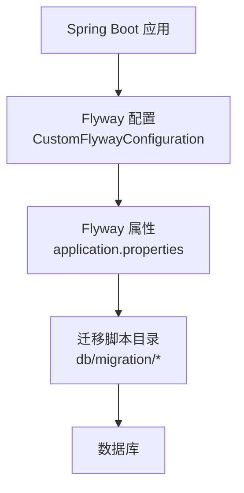
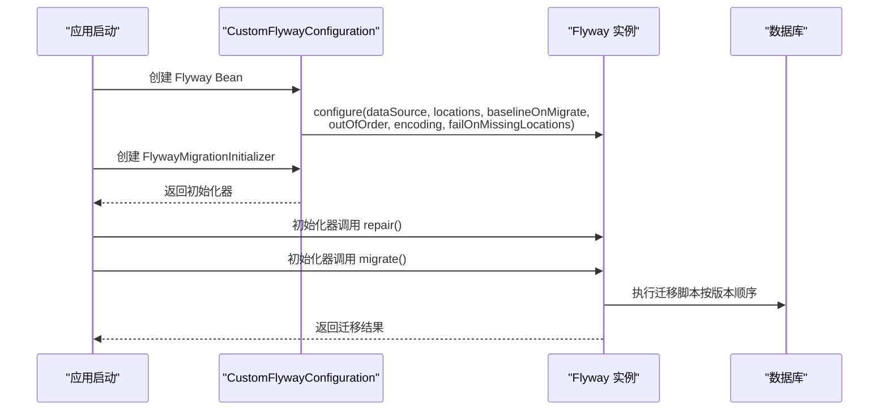
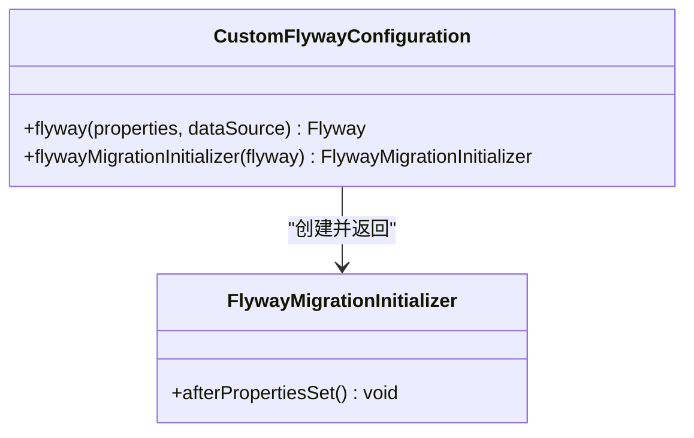
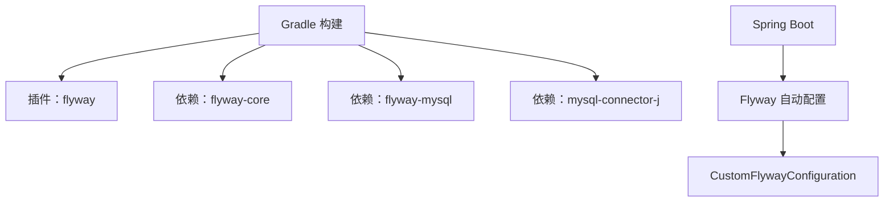

# 数据库迁移管理

<cite>
**本文档引用的文件**
- [CustomFlywayConfiguration.java](file://src/main/java/com/example/EnterpriseRagCommunity/config/CustomFlywayConfiguration.java)
- [application.properties](file://src/main/resources/application.properties)
- [build.gradle](file://build.gradle)
- [README.md](file://src/main/resources/db/migration/README.md)
- [V1__table_design.sql](file://src/main/resources/db/migration/V1__table_design.sql)
- [V3__system_default_configs.sql](file://src/main/resources/db/migration/V3__system_default_configs.sql)
- [V4__llm_price_configs.sql](file://src/main/resources/db/migration/V4__llm_price_configs.sql)
- [V5__context_window_log_fields_and_context_defaults.sql](file://src/main/resources/db/migration/V5__context_window_log_fields_and_context_defaults.sql)
- [FlywayMigrationsSmokeTest.java](file://src/test/java/com/example/EnterpriseRagCommunity/db/FlywayMigrationsSmokeTest.java)
- [CustomFlywayConfigurationTest.java](file://src/test/java/com/example/EnterpriseRagCommunity/config/CustomFlywayConfigurationTest.java)
</cite>

## 目录
1. [简介](#简介)
2. [项目结构](#项目结构)
3. [核心组件](#核心组件)
4. [架构概览](#架构概览)
5. [详细组件分析](#详细组件分析)
6. [依赖分析](#依赖分析)
7. [性能考虑](#性能考虑)
8. [故障排查指南](#故障排查指南)
9. [结论](#结论)
10. [附录](#附录)

## 简介
本文件系统化阐述本项目的数据库迁移管理实践，基于 Flyway 框架实现。内容覆盖配置与使用、脚本命名规范与版本管理、执行顺序与幂等性、增量迁移策略、回滚与冲突处理、生产环境最佳实践（停机时间与数据一致性）、脚本编写指南（SQL 标准与兼容性）、以及迁移监控、日志与故障诊断方法。文档面向开发者与运维人员，兼顾技术深度与可操作性。

## 项目结构
- 迁移脚本位于资源目录 db/migration，采用 Flyway 命名规范，版本按递增顺序执行。
- Spring Boot 应用通过 application.properties 配置 Flyway，使用自定义配置类覆盖默认行为。
- Gradle 构建中集成 Flyway 插件与依赖，确保本地与 CI 环境一致。

**图表来源**
- [CustomFlywayConfiguration.java:17-40](file://src/main/java/com/example/EnterpriseRagCommunity/config/CustomFlywayConfiguration.java#L17-L40)
- [application.properties:18-24](file://src/main/resources/application.properties#L18-L24)
- [V1__table_design.sql:1-20](file://src/main/resources/db/migration/V1__table_design.sql#L1-L20)

**章节来源**
- [application.properties:18-24](file://src/main/resources/application.properties#L18-L24)
- [build.gradle:22-22](file://build.gradle#L22-L22)
- [README.md:1-14](file://src/main/resources/db/migration/README.md#L1-L14)

## 核心组件
- 自定义 Flyway 配置：集中管理 locations、baselineOnMigrate、outOfOrder、encoding、failOnMissingLocations 等属性，并显式避免使用已移除的 cleanOnValidationError。
- Spring Boot 属性映射：通过 spring.flyway.* 将 Flyway 行为注入容器。
- 迁移脚本：按版本顺序执行，具备幂等性，覆盖表设计、默认配置、LLM 价格、上下文窗口字段与默认配置等。

**章节来源**
- [CustomFlywayConfiguration.java:17-40](file://src/main/java/com/example/EnterpriseRagCommunity/config/CustomFlywayConfiguration.java#L17-L40)
- [application.properties:18-24](file://src/main/resources/application.properties#L18-L24)
- [V1__table_design.sql:1-20](file://src/main/resources/db/migration/V1__table_design.sql#L1-L20)

## 架构概览
下图展示了应用启动时 Flyway 的初始化与迁移执行流程，包括 repair 与 migrate 的调用顺序。

**图表来源**
- [CustomFlywayConfiguration.java:17-48](file://src/main/java/com/example/EnterpriseRagCommunity/config/CustomFlywayConfiguration.java#L17-L48)
- [FlywayMigrationsSmokeTest.java:11-27](file://src/test/java/com/example/EnterpriseRagCommunity/db/FlywayMigrationsSmokeTest.java#L11-L27)

**章节来源**
- [CustomFlywayConfiguration.java:42-48](file://src/main/java/com/example/EnterpriseRagCommunity/config/CustomFlywayConfiguration.java#L42-L48)
- [FlywayMigrationsSmokeTest.java:11-27](file://src/test/java/com/example/EnterpriseRagCommunity/db/FlywayMigrationsSmokeTest.java#L11-L27)

## 详细组件分析

### Flyway 配置与初始化
- 配置要点
  - locations：从 application.properties 读取，默认 classpath:db/migration。
  - baselineOnMigrate：开启基线，确保新库首次迁移。
  - outOfOrder：默认关闭，保证严格顺序执行。
  - encoding：UTF-8，统一字符集。
  - failOnMissingLocations：可按需开启，避免遗漏迁移目录。
  - table：可指定历史表名（通过属性映射）。
- 初始化器
  - 先 repair 再 migrate，提升迁移健壮性。

**图表来源**
- [CustomFlywayConfiguration.java:17-48](file://src/main/java/com/example/EnterpriseRagCommunity/config/CustomFlywayConfiguration.java#L17-L48)

**章节来源**
- [CustomFlywayConfiguration.java:17-48](file://src/main/java/com/example/EnterpriseRagCommunity/config/CustomFlywayConfiguration.java#L17-L48)
- [CustomFlywayConfigurationTest.java:17-53](file://src/test/java/com/example/EnterpriseRagCommunity/config/CustomFlywayConfigurationTest.java#L17-L53)

### 迁移脚本命名规范与版本管理
- 命名规范
  - 文件名格式：V{版本}__{描述}.sql，版本递增，描述清晰。
  - 示例：V1__table_design.sql、V3__system_default_configs.sql、V4__llm_price_configs.sql、V5__context_window_log_fields_and_context_defaults.sql。
- 版本管理
  - README 对现有脚本进行分类说明，建议后续新增脚本继续遵循 V{N+1}_* 命名。
  - 历史演进迁移已合并至 V1-V4，全新部署可直接从 V1 开始。

**章节来源**
- [README.md:1-14](file://src/main/resources/db/migration/README.md#L1-L14)
- [V1__table_design.sql:1-20](file://src/main/resources/db/migration/V1__table_design.sql#L1-L20)
- [V3__system_default_configs.sql:1-20](file://src/main/resources/db/migration/V3__system_default_configs.sql#L1-L20)
- [V4__llm_price_configs.sql:1-20](file://src/main/resources/db/migration/V4__llm_price_configs.sql#L1-L20)
- [V5__context_window_log_fields_and_context_defaults.sql:1-20](file://src/main/resources/db/migration/V5__context_window_log_fields_and_context_defaults.sql#L1-L20)

### 执行顺序与幂等性
- 顺序执行
  - Flyway 按版本号升序执行，确保依赖关系正确。
- 幂等性保障
  - 使用 INSERT IGNORE、ON DUPLICATE KEY UPDATE、WHERE NOT EXISTS 等手段避免重复写入。
  - 示例：权限与角色初始化、默认版块、风险标签、语言列表等均采用幂等写法。

**章节来源**
- [V3__system_default_configs.sql:18-244](file://src/main/resources/db/migration/V3__system_default_configs.sql#L18-L244)
- [V3__system_default_configs.sql:437-500](file://src/main/resources/db/migration/V3__system_default_configs.sql#L437-L500)
- [V3__system_default_configs.sql:565-691](file://src/main/resources/db/migration/V3__system_default_configs.sql#L565-L691)

### 增量迁移策略
- 新增脚本
  - 始终使用更高版本号，保持顺序递增。
  - 在同一版本内拆分职责，例如“表设计类”“默认配置类”“价格配置类”等，便于评审与回滚。
- 分层迁移
  - 基础表结构先行（V1），再补充系统配置（V3）、业务配置（V4/V5）等。

**章节来源**
- [README.md:5-13](file://src/main/resources/db/migration/README.md#L5-L13)

### 回滚机制与冲突处理
- 回滚策略
  - Flyway 不提供自动回滚，推荐通过补丁脚本（undo migration 或 create new migration）实现逆向变更。
  - 对于高风险变更，建议先在测试环境验证，再灰度到生产。
- 冲突处理
  - outOfOrder 关闭，避免非预期顺序执行。
  - 若出现历史表不一致，先执行 repair 再 migrate（初始化器已内置该顺序）。

**章节来源**
- [CustomFlywayConfiguration.java:22-23](file://src/main/java/com/example/EnterpriseRagCommunity/config/CustomFlywayConfiguration.java#L22-L23)
- [CustomFlywayConfiguration.java:42-48](file://src/main/java/com/example/EnterpriseRagCommunity/config/CustomFlywayConfiguration.java#L42-L48)

### 生产环境最佳实践
- 停机时间控制
  - 尽量避免长事务与大表重建；将大变更拆分为多个小版本脚本。
  - 使用只读副本或维护窗口执行迁移。
- 数据一致性
  - 保持脚本幂等；对关键表使用外键与约束，确保参照完整性。
  - 迁移前后进行数据校验（如计数、采样）。
- 配置与隔离
  - 通过环境变量覆盖 spring.flyway.locations、baseline-version 等，确保不同环境隔离。
  - 使用 failOnMissingLocations 与 validateOnMigrate（测试用例中演示）加强校验。

**章节来源**
- [application.properties:18-24](file://src/main/resources/application.properties#L18-L24)
- [FlywayMigrationsSmokeTest.java:18-27](file://src/test/java/com/example/EnterpriseRagCommunity/db/FlywayMigrationsSmokeTest.java#L18-L27)

### 迁移脚本编写指南
- SQL 标准与兼容性
  - 使用 UTF8MB4 字符集与 InnoDB 引擎，确保多语言与事务支持。
  - 避免使用数据库特定语法，必要时使用条件判断或 DDL 动态生成。
- 幂等性与可读性
  - 明确注释每个 DDL 的目的与约束。
  - 使用 INSERT IGNORE、ON DUPLICATE KEY UPDATE、WHERE NOT EXISTS 等保证幂等。
- 结构与职责分离
  - 将“表设计/索引/约束”“默认配置/常量数据”“业务配置/价格/策略”等分层放置，便于维护与审计。

**章节来源**
- [V1__table_design.sql:1-20](file://src/main/resources/db/migration/V1__table_design.sql#L1-L20)
- [V3__system_default_configs.sql:1-20](file://src/main/resources/db/migration/V3__system_default_configs.sql#L1-L20)
- [V4__llm_price_configs.sql:1-20](file://src/main/resources/db/migration/V4__llm_price_configs.sql#L1-L20)

### 迁移监控、日志与故障诊断
- 监控与日志
  - 应用日志级别与输出配置在 application.properties 中集中管理，便于定位迁移过程中的异常。
  - 建议在 CI 中增加迁移冒烟测试，确保脚本可执行。
- 故障诊断
  - 使用 Flyway 历史表（schema history）查看已执行版本与状态。
  - 出错时先执行 repair，再执行 migrate；必要时手动清理历史记录并重新基线（谨慎操作）。

**章节来源**
- [application.properties:38-84](file://src/main/resources/application.properties#L38-L84)
- [FlywayMigrationsSmokeTest.java:11-27](file://src/test/java/com/example/EnterpriseRagCommunity/db/FlywayMigrationsSmokeTest.java#L11-L27)

## 依赖分析
- Gradle 集成
  - 插件：org.flywaydb.flyway 12.0.2
  - 依赖：flyway-core 与 flyway-mysql 12.0.2
  - JDBC 驱动：mysql-connector-j 9.4.0
- Spring Boot 自动装配
  - 通过 spring.flyway.* 属性启用与配置 Flyway。

**图表来源**
- [build.gradle:11-22](file://build.gradle#L11-L22)
- [build.gradle:116-118](file://build.gradle#L116-L118)

**章节来源**
- [build.gradle:11-22](file://build.gradle#L11-L22)
- [build.gradle:116-118](file://build.gradle#L116-L118)

## 性能考虑
- 迁移执行性能
  - 避免在迁移中执行耗时的全表扫描与重建；必要时分批处理。
  - 合理使用索引与约束，减少迁移期间的锁竞争。
- 脚本体积与复杂度
  - 将大型 DDL 拆分为多个小版本，降低单次迁移时间与失败风险。
- 测试与验证
  - 在测试环境模拟生产数据规模，验证迁移耗时与资源占用。

## 故障排查指南
- 常见问题
  - 迁移失败：检查日志级别与输出，确认数据库连接与字符集设置。
  - 版本冲突：使用 repair 清理历史不一致，再执行 migrate。
  - 缺失迁移目录：启用 failOnMissingLocations，确保路径正确。
- 测试验证
  - 使用测试用例中的 Flyway 配置与断言，验证迁移可成功执行。

**章节来源**
- [application.properties:18-24](file://src/main/resources/application.properties#L18-L24)
- [FlywayMigrationsSmokeTest.java:11-27](file://src/test/java/com/example/EnterpriseRagCommunity/db/FlywayMigrationsSmokeTest.java#L11-L27)
- [CustomFlywayConfigurationTest.java:17-53](file://src/test/java/com/example/EnterpriseRagCommunity/config/CustomFlywayConfigurationTest.java#L17-L53)

## 结论
本项目基于 Flyway 的数据库迁移管理实现了标准化、可审计与可回滚的演进路径。通过严格的命名规范、幂等脚本、顺序执行与测试验证，能够在保证数据一致性的同时，最小化生产停机时间并提升迁移可靠性。建议持续遵循现有规范，完善监控与告警，确保迁移流程在各环境中稳定一致。

## 附录
- 迁移脚本示例路径
  - [V1__table_design.sql](file://src/main/resources/db/migration/V1__table_design.sql)
  - [V3__system_default_configs.sql](file://src/main/resources/db/migration/V3__system_default_configs.sql)
  - [V4__llm_price_configs.sql](file://src/main/resources/db/migration/V4__llm_price_configs.sql)
  - [V5__context_window_log_fields_and_context_defaults.sql](file://src/main/resources/db/migration/V5__context_window_log_fields_and_context_defaults.sql)