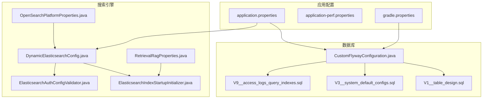
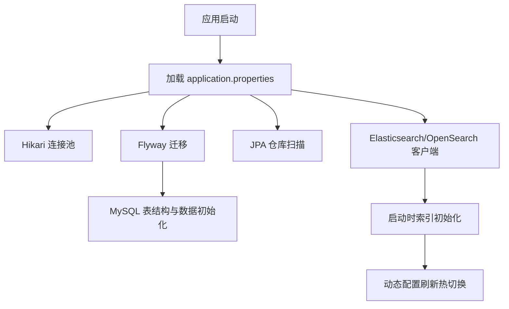
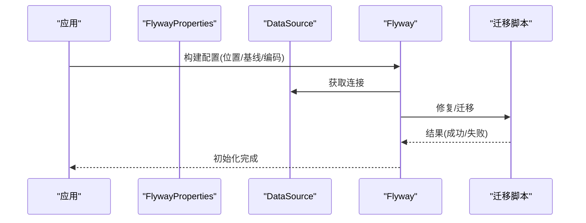
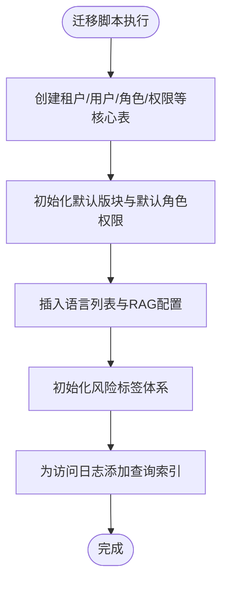
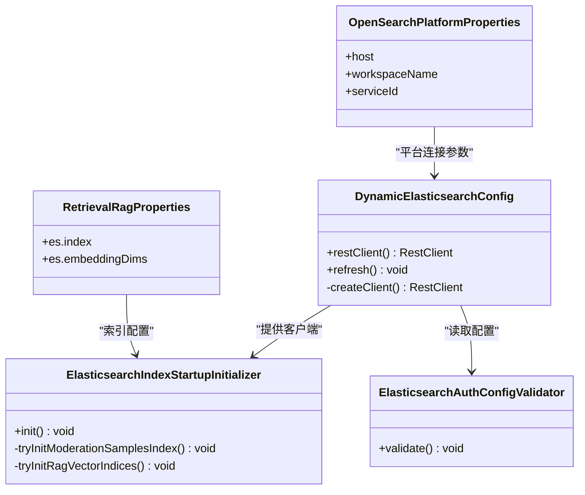
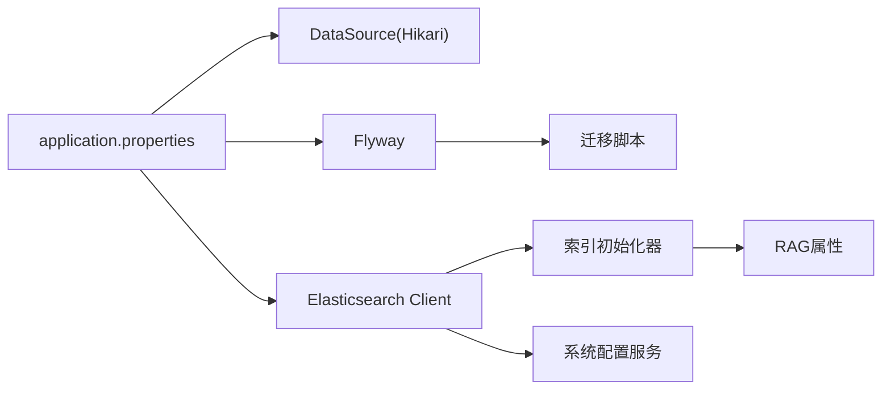

# 数据库配置

<cite>
**本文引用的文件**
- [application.properties](file://src/main/resources/application.properties)
- [application-perf.properties](file://src/main/resources/application-perf.properties)
- [gradle.properties](file://gradle.properties)
- [CustomFlywayConfiguration.java](file://src/main/java/com/example/EnterpriseRagCommunity/config/CustomFlywayConfiguration.java)
- [JpaRepositoriesConfig.java](file://src/main/java/com/example/EnterpriseRagCommunity/config/JpaRepositoriesConfig.java)
- [DynamicElasticsearchConfig.java](file://src/main/java/com/example/EnterpriseRagCommunity/config/DynamicElasticsearchConfig.java)
- [ElasticsearchIndexStartupInitializer.java](file://src/main/java/com/example/EnterpriseRagCommunity/config/ElasticsearchIndexStartupInitializer.java)
- [ElasticsearchAuthConfigValidator.java](file://src/main/java/com/example/EnterpriseRagCommunity/config/ElasticsearchAuthConfigValidator.java)
- [RetrievalRagProperties.java](file://src/main/java/com/example/EnterpriseRagCommunity/config/RetrievalRagProperties.java)
- [OpenSearchPlatformProperties.java](file://src/main/java/com/example/EnterpriseRagCommunity/config/OpenSearchPlatformProperties.java)
- [V1__table_design.sql](file://src/main/resources/db/migration/V1__table_design.sql)
- [V3__system_default_configs.sql](file://src/main/resources/db/migration/V3__system_default_configs.sql)
- [V9__access_logs_query_indexes.sql](file://src/main/resources/db/migration/V9__access_logs_query_indexes.sql)
</cite>

## 目录
1. [简介](#简介)
2. [项目结构](#项目结构)
3. [核心组件](#核心组件)
4. [架构总览](#架构总览)
5. [详细组件分析](#详细组件分析)
6. [依赖关系分析](#依赖关系分析)
7. [性能考量](#性能考量)
8. [故障排查指南](#故障排查指南)
9. [结论](#结论)
10. [附录](#附录)

## 简介
本指南面向企业级RAG社区平台的数据库与搜索引擎配置与管理，覆盖以下主题：
- MySQL数据库初始化与Flyway迁移脚本管理
- 数据库连接池、事务与性能优化
- Elasticsearch/OpenSearch索引初始化、映射与查询优化
- 监控指标、慢查询分析与容量规划建议
- 备份与恢复策略、高可用架构建议

## 项目结构
围绕数据库与搜索引擎的关键配置与脚本分布如下：
- 数据库与迁移
  - 连接与Flyway：application.properties、gradle.properties、CustomFlywayConfiguration.java
  - 迁移脚本：db/migration/V1__table_design.sql、V3__system_default_configs.sql、V9__access_logs_query_indexes.sql
- 搜索引擎
  - 动态客户端与启动初始化：DynamicElasticsearchConfig.java、ElasticsearchIndexStartupInitializer.java、ElasticsearchAuthConfigValidator.java
  - 配置属性：RetrievalRagProperties.java、OpenSearchPlatformProperties.java
- 性能与监控
  - 应用性能监控：application-perf.properties

**图表来源**
- [application.properties:1-84](file://src/main/resources/application.properties#L1-L84)
- [application-perf.properties:1-6](file://src/main/resources/application-perf.properties#L1-L6)
- [gradle.properties:10-12](file://gradle.properties#L10-L12)
- [CustomFlywayConfiguration.java:1-50](file://src/main/java/com/example/EnterpriseRagCommunity/config/CustomFlywayConfiguration.java#L1-L50)
- [V1__table_design.sql:1-800](file://src/main/resources/db/migration/V1__table_design.sql#L1-L800)
- [V3__system_default_configs.sql:1-691](file://src/main/resources/db/migration/V3__system_default_configs.sql#L1-L691)
- [V9__access_logs_query_indexes.sql:1-4](file://src/main/resources/db/migration/V9__access_logs_query_indexes.sql#L1-L4)
- [DynamicElasticsearchConfig.java:1-128](file://src/main/java/com/example/EnterpriseRagCommunity/config/DynamicElasticsearchConfig.java#L1-L128)
- [ElasticsearchIndexStartupInitializer.java:1-240](file://src/main/java/com/example/EnterpriseRagCommunity/config/ElasticsearchIndexStartupInitializer.java#L1-L240)
- [ElasticsearchAuthConfigValidator.java:1-33](file://src/main/java/com/example/EnterpriseRagCommunity/config/ElasticsearchAuthConfigValidator.java#L1-L33)
- [RetrievalRagProperties.java:1-22](file://src/main/java/com/example/EnterpriseRagCommunity/config/RetrievalRagProperties.java#L1-L22)
- [OpenSearchPlatformProperties.java:1-17](file://src/main/java/com/example/EnterpriseRagCommunity/config/OpenSearchPlatformProperties.java#L1-L17)

**章节来源**
- [application.properties:1-84](file://src/main/resources/application.properties#L1-L84)
- [application-perf.properties:1-6](file://src/main/resources/application-perf.properties#L1-L6)
- [gradle.properties:10-12](file://gradle.properties#L10-L12)
- [CustomFlywayConfiguration.java:1-50](file://src/main/java/com/example/EnterpriseRagCommunity/config/CustomFlywayConfiguration.java#L1-L50)
- [V1__table_design.sql:1-800](file://src/main/resources/db/migration/V1__table_design.sql#L1-L800)
- [V3__system_default_configs.sql:1-691](file://src/main/resources/db/migration/V3__system_default_configs.sql#L1-L691)
- [V9__access_logs_query_indexes.sql:1-4](file://src/main/resources/db/migration/V9__access_logs_query_indexes.sql#L1-L4)
- [DynamicElasticsearchConfig.java:1-128](file://src/main/java/com/example/EnterpriseRagCommunity/config/DynamicElasticsearchConfig.java#L1-L128)
- [ElasticsearchIndexStartupInitializer.java:1-240](file://src/main/java/com/example/EnterpriseRagCommunity/config/ElasticsearchIndexStartupInitializer.java#L1-L240)
- [ElasticsearchAuthConfigValidator.java:1-33](file://src/main/java/com/example/EnterpriseRagCommunity/config/ElasticsearchAuthConfigValidator.java#L1-L33)
- [RetrievalRagProperties.java:1-22](file://src/main/java/com/example/EnterpriseRagCommunity/config/RetrievalRagProperties.java#L1-L22)
- [OpenSearchPlatformProperties.java:1-17](file://src/main/java/com/example/EnterpriseRagCommunity/config/OpenSearchPlatformProperties.java#L1-L17)

## 核心组件
- 数据库连接与连接池
  - 数据源驱动、URL、凭据通过环境变量注入，连接池参数可调
- Flyway迁移
  - 自定义配置加载位置、基线版本、编码与修复策略
- JPA仓库扫描
  - 统一扫描包路径，确保实体与仓库装配
- Elasticsearch/OpenSearch
  - 动态客户端与热切换、启动时索引初始化、认证校验
- RAG检索配置
  - 索引名称、IK分词、嵌入维度等属性化配置

**章节来源**
- [application.properties:7-16](file://src/main/resources/application.properties#L7-L16)
- [CustomFlywayConfiguration.java:17-48](file://src/main/java/com/example/EnterpriseRagCommunity/config/CustomFlywayConfiguration.java#L17-L48)
- [JpaRepositoriesConfig.java:7-9](file://src/main/java/com/example/EnterpriseRagCommunity/config/JpaRepositoriesConfig.java#L7-L9)
- [DynamicElasticsearchConfig.java:33-51](file://src/main/java/com/example/EnterpriseRagCommunity/config/DynamicElasticsearchConfig.java#L33-L51)
- [ElasticsearchIndexStartupInitializer.java:43-50](file://src/main/java/com/example/EnterpriseRagCommunity/config/ElasticsearchIndexStartupInitializer.java#L43-L50)
- [RetrievalRagProperties.java:12-20](file://src/main/java/com/example/EnterpriseRagCommunity/config/RetrievalRagProperties.java#L12-L20)

## 架构总览
应用通过Spring Boot自动装配与自定义配置完成数据库与搜索引擎的初始化与运行时管理。

**图表来源**
- [application.properties:7-16](file://src/main/resources/application.properties#L7-L16)
- [CustomFlywayConfiguration.java:17-48](file://src/main/java/com/example/EnterpriseRagCommunity/config/CustomFlywayConfiguration.java#L17-L48)
- [JpaRepositoriesConfig.java:7-9](file://src/main/java/com/example/EnterpriseRagCommunity/config/JpaRepositoriesConfig.java#L7-L9)
- [DynamicElasticsearchConfig.java:33-51](file://src/main/java/com/example/EnterpriseRagCommunity/config/DynamicElasticsearchConfig.java#L33-L51)
- [ElasticsearchIndexStartupInitializer.java:52-69](file://src/main/java/com/example/EnterpriseRagCommunity/config/ElasticsearchIndexStartupInitializer.java#L52-L69)

## 详细组件分析

### 数据库初始化与Flyway迁移
- 迁移位置与行为
  - 位置：classpath:db/migration
  - 基线迁移：启用基线版本
  - 编码：UTF-8
  - 顺序：严格顺序，不允许错序
  - 缺失位置：不报错
- 自定义配置
  - 通过自定义Bean加载Flyway，显式设置关键属性，避免使用已废弃的清理策略
  - 迁移初始化器先修复再迁移，提升健壮性

**图表来源**
- [CustomFlywayConfiguration.java:17-48](file://src/main/java/com/example/EnterpriseRagCommunity/config/CustomFlywayConfiguration.java#L17-L48)
- [application.properties:18-24](file://src/main/resources/application.properties#L18-L24)

**章节来源**
- [application.properties:18-24](file://src/main/resources/application.properties#L18-L24)
- [CustomFlywayConfiguration.java:17-48](file://src/main/java/com/example/EnterpriseRagCommunity/config/CustomFlywayConfiguration.java#L17-L48)

### MySQL表设计与系统默认配置
- 表设计要点
  - 使用InnoDB、utf8mb4字符集
  - 多处唯一键与外键约束，保证数据一致性
  - 关键查询字段建立索引，如用户唯一索引、帖子状态索引、审计日志实体索引等
- 系统默认配置
  - 初始化权限点与默认角色权限矩阵
  - 插入默认版块、语言列表、RAG与混合检索默认配置
  - 风险标签体系初始化
- 访问日志查询索引
  - 为归档状态、用户与时间组合添加复合索引，优化查询

**图表来源**
- [V1__table_design.sql:6-800](file://src/main/resources/db/migration/V1__table_design.sql#L6-L800)
- [V3__system_default_configs.sql:18-691](file://src/main/resources/db/migration/V3__system_default_configs.sql#L18-L691)
- [V9__access_logs_query_indexes.sql:1-4](file://src/main/resources/db/migration/V9__access_logs_query_indexes.sql#L1-L4)

**章节来源**
- [V1__table_design.sql:1-800](file://src/main/resources/db/migration/V1__table_design.sql#L1-L800)
- [V3__system_default_configs.sql:1-691](file://src/main/resources/db/migration/V3__system_default_configs.sql#L1-L691)
- [V9__access_logs_query_indexes.sql:1-4](file://src/main/resources/db/migration/V9__access_logs_query_indexes.sql#L1-L4)

### Elasticsearch/OpenSearch索引配置与启动初始化
- 动态客户端
  - 通过系统配置服务读取ES集群地址与API Key，构建RestClient
  - 使用CGLIB代理实现热切换，支持运行时刷新
- 启动初始化
  - 在应用启动时根据配置决定是否初始化ES索引
  - 支持强制重建与按来源类型选择POST/COMMENT/FILE_ASSET等索引
- 认证校验
  - 启动时检查API Key配置，提示认证模式

**图表来源**
- [DynamicElasticsearchConfig.java:33-51](file://src/main/java/com/example/EnterpriseRagCommunity/config/DynamicElasticsearchConfig.java#L33-L51)
- [ElasticsearchIndexStartupInitializer.java:57-69](file://src/main/java/com/example/EnterpriseRagCommunity/config/ElasticsearchIndexStartupInitializer.java#L57-L69)
- [ElasticsearchAuthConfigValidator.java:23-31](file://src/main/java/com/example/EnterpriseRagCommunity/config/ElasticsearchAuthConfigValidator.java#L23-L31)
- [RetrievalRagProperties.java:12-20](file://src/main/java/com/example/EnterpriseRagCommunity/config/RetrievalRagProperties.java#L12-L20)
- [OpenSearchPlatformProperties.java:11-15](file://src/main/java/com/example/EnterpriseRagCommunity/config/OpenSearchPlatformProperties.java#L11-L15)

**章节来源**
- [DynamicElasticsearchConfig.java:1-128](file://src/main/java/com/example/EnterpriseRagCommunity/config/DynamicElasticsearchConfig.java#L1-L128)
- [ElasticsearchIndexStartupInitializer.java:1-240](file://src/main/java/com/example/EnterpriseRagCommunity/config/ElasticsearchIndexStartupInitializer.java#L1-L240)
- [ElasticsearchAuthConfigValidator.java:1-33](file://src/main/java/com/example/EnterpriseRagCommunity/config/ElasticsearchAuthConfigValidator.java#L1-L33)
- [RetrievalRagProperties.java:1-22](file://src/main/java/com/example/EnterpriseRagCommunity/config/RetrievalRagProperties.java#L1-L22)
- [OpenSearchPlatformProperties.java:1-17](file://src/main/java/com/example/EnterpriseRagCommunity/config/OpenSearchPlatformProperties.java#L1-L17)

### 连接池、事务与性能优化
- 连接池参数
  - 最大池大小、最小空闲、连接超时、验证超时、空闲超时、最大生存时间
  - 通过环境变量动态调整，满足不同规模负载
- 事务管理
  - Spring Data JPA默认开启open-in-view控制，避免长时间持有持久化上下文
- 性能监控
  - Prometheus端点暴露健康、信息与指标，便于外部监控

**章节来源**
- [application.properties:7-16](file://src/main/resources/application.properties#L7-L16)
- [application.properties:83-84](file://src/main/resources/application.properties#L83-L84)
- [application-perf.properties:1-6](file://src/main/resources/application-perf.properties#L1-L6)

## 依赖关系分析
- 配置依赖
  - application.properties定义数据源、Flyway、ES连接与JPA行为
  - gradle.properties提供Flyway数据库连接凭据
  - 自定义Flyway配置与属性文件协同工作
- 组件耦合
  - Elasticsearch动态客户端与系统配置服务耦合，支持热切换
  - 启动初始化器依赖RAG属性与系统配置服务
- 外部依赖
  - MySQL驱动与HikariCP
  - Elasticsearch/OpenSearch客户端

**图表来源**
- [application.properties:7-16](file://src/main/resources/application.properties#L7-L16)
- [application.properties:78-83](file://src/main/resources/application.properties#L78-L83)
- [gradle.properties:10-12](file://gradle.properties#L10-L12)
- [CustomFlywayConfiguration.java:17-48](file://src/main/java/com/example/EnterpriseRagCommunity/config/CustomFlywayConfiguration.java#L17-L48)
- [DynamicElasticsearchConfig.java:33-51](file://src/main/java/com/example/EnterpriseRagCommunity/config/DynamicElasticsearchConfig.java#L33-L51)
- [ElasticsearchIndexStartupInitializer.java:34-41](file://src/main/java/com/example/EnterpriseRagCommunity/config/ElasticsearchIndexStartupInitializer.java#L34-L41)
- [RetrievalRagProperties.java:12-20](file://src/main/java/com/example/EnterpriseRagCommunity/config/RetrievalRagProperties.java#L12-L20)

**章节来源**
- [application.properties:7-16](file://src/main/resources/application.properties#L7-L16)
- [application.properties:78-83](file://src/main/resources/application.properties#L78-L83)
- [gradle.properties:10-12](file://gradle.properties#L10-L12)
- [CustomFlywayConfiguration.java:17-48](file://src/main/java/com/example/EnterpriseRagCommunity/config/CustomFlywayConfiguration.java#L17-L48)
- [DynamicElasticsearchConfig.java:33-51](file://src/main/java/com/example/EnterpriseRagCommunity/config/DynamicElasticsearchConfig.java#L33-L51)
- [ElasticsearchIndexStartupInitializer.java:34-41](file://src/main/java/com/example/EnterpriseRagCommunity/config/ElasticsearchIndexStartupInitializer.java#L34-L41)
- [RetrievalRagProperties.java:12-20](file://src/main/java/com/example/EnterpriseRagCommunity/config/RetrievalRagProperties.java#L12-L20)

## 性能考量
- 数据库
  - 合理设置连接池参数以平衡并发与资源占用
  - 为高频查询字段建立复合索引，减少全表扫描
  - 对大字段使用全文索引或分表策略
- 搜索引擎
  - IK分词与向量维度需与业务规模匹配
  - 启动时按来源类型选择性初始化索引，避免不必要的重建
- 监控
  - 开启Prometheus端点，采集JVM与应用指标
  - 结合慢查询日志与索引使用情况分析热点

[本节为通用指导，无需特定文件引用]

## 故障排查指南
- 数据库连接失败
  - 检查数据源URL、用户名、密码与时区配置
  - 核对连接池超时与最大生命周期参数
- Flyway迁移异常
  - 查看迁移脚本编码与位置配置
  - 启用修复后再迁移，确认基线版本
- Elasticsearch认证失败
  - 确认系统配置中API Key已正确设置
  - 启动时认证校验会提示当前认证模式
- 索引初始化失败
  - 检查APP_ES_API_KEY是否存在
  - 根据来源类型与维度选择合适的索引策略

**章节来源**
- [application.properties:7-16](file://src/main/resources/application.properties#L7-L16)
- [application.properties:78-83](file://src/main/resources/application.properties#L78-L83)
- [CustomFlywayConfiguration.java:17-48](file://src/main/java/com/example/EnterpriseRagCommunity/config/CustomFlywayConfiguration.java#L17-L48)
- [ElasticsearchAuthConfigValidator.java:23-31](file://src/main/java/com/example/EnterpriseRagCommunity/config/ElasticsearchAuthConfigValidator.java#L23-L31)
- [ElasticsearchIndexStartupInitializer.java:60-69](file://src/main/java/com/example/EnterpriseRagCommunity/config/ElasticsearchIndexStartupInitializer.java#L60-L69)

## 结论
本指南梳理了企业级RAG社区平台的数据库与搜索引擎配置要点，包括MySQL Flyway迁移、连接池与性能优化、Elasticsearch索引初始化与认证校验，并提供了监控与故障排查建议。建议在生产环境中结合业务规模与SLA要求，持续优化索引与查询计划，完善备份与高可用方案。

[本节为总结，无需特定文件引用]

## 附录
- 备份与恢复策略建议
  - 数据库：采用物理/逻辑备份结合，定期校验恢复流程
  - 搜索引擎：导出索引元数据与文档快照，制定增量同步策略
- 高可用架构
  - 数据库：主从复制、读写分离、连接池与故障转移
  - 搜索引擎：多节点集群、跨可用区部署、健康检查与自动切换
- 监控与容量规划
  - 指标：QPS、P95/P99延迟、连接池利用率、索引写入速率
  - 容量：基于历史峰值与增长趋势，预留20%-30%冗余

[本节为通用指导，无需特定文件引用]