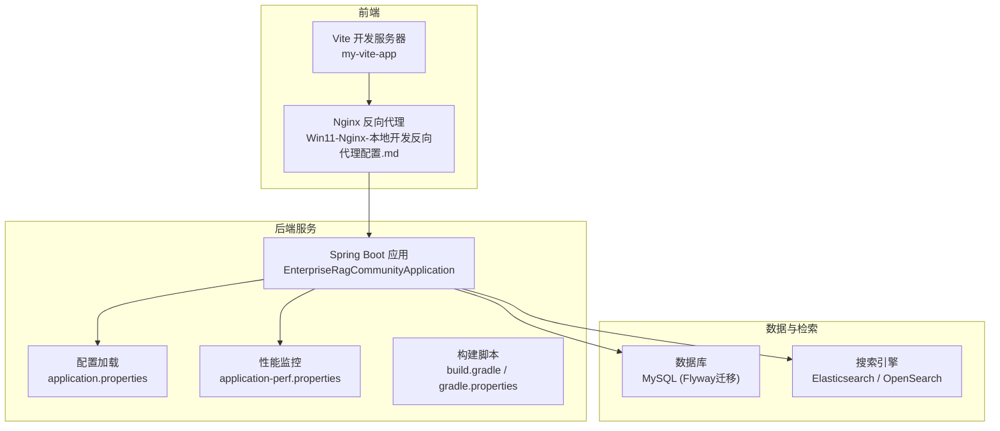
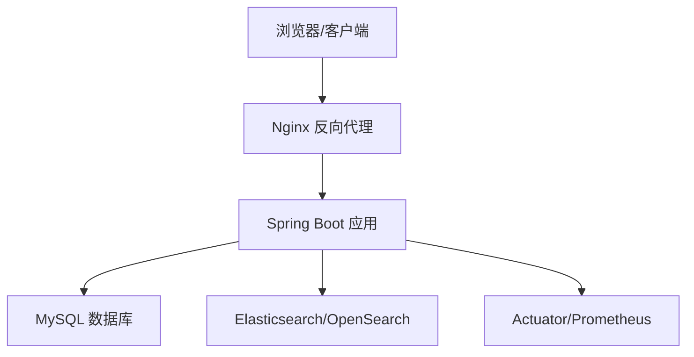
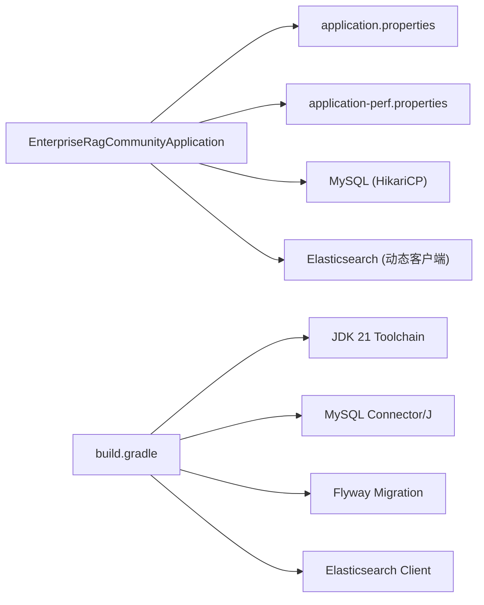

# 环境准备

<cite>
**本文引用的文件**
- [application.properties](file://src/main/resources/application.properties)
- [application-perf.properties](file://src/main/resources/application-perf.properties)
- [gradle.properties](file://gradle.properties)
- [build.gradle](file://build.gradle)
- [EnterpriseRagCommunityApplication.java](file://src/main/java/com/example/EnterpriseRagCommunity/EnterpriseRagCommunityApplication.java)
- [DynamicElasticsearchConfig.java](file://src/main/java/com/example/EnterpriseRagCommunity/config/DynamicElasticsearchConfig.java)
- [ElasticsearchAuthConfigValidator.java](file://src/main/java/com/example/EnterpriseRagCommunity/config/ElasticsearchAuthConfigValidator.java)
- [EsAuthProperties.java](file://src/main/java/com/example/EnterpriseRagCommunity/config/EsAuthProperties.java)
- [SystemConfigurationEntity.java](file://src/main/java/com/example/EnterpriseRagCommunity/entity/config/SystemConfigurationEntity.java)
- [SystemConfigurationRepository.java](file://src/main/java/com/example/EnterpriseRagCommunity/repository/config/SystemConfigurationRepository.java)
- [SetupController.java](file://src/main/java/com/example/EnterpriseRagCommunity/controller/SetupController.java)
- [Win11-Nginx-本地开发反向代理配置.md](file://docs/Win11-Nginx-本地开发反向代理配置.md)
</cite>

## 目录
1. [引言](#引言)
2. [项目结构](#项目结构)
3. [核心组件](#核心组件)
4. [架构总览](#架构总览)
5. [详细组件分析](#详细组件分析)
6. [依赖关系分析](#依赖关系分析)
7. [性能注意事项](#性能注意事项)
8. [故障排查指南](#故障排查指南)
9. [结论](#结论)
10. [附录](#附录)

## 引言
本指南面向企业级RAG社区平台的部署与运维团队，提供从硬件到软件、从开发到生产的全链路环境准备方案。内容覆盖：
- 系统硬件要求与操作系统兼容性
- 软件依赖与前置条件检查（JDK 21+、MySQL、Elasticsearch/OpenSearch、Redis等）
- 环境变量与配置项映射
- 网络与防火墙配置建议
- 开发与生产差异配置及切换最佳实践

## 项目结构
该工程采用Spring Boot 3.x + Gradle多模块风格，后端以WAR方式打包，内置Tomcat运行；前端位于my-vite-app目录，支持独立开发与反向代理联调。

图表来源
- [EnterpriseRagCommunityApplication.java:1-64](file://src/main/java/com/example/EnterpriseRagCommunity/EnterpriseRagCommunityApplication.java#L1-L64)
- [application.properties:1-84](file://src/main/resources/application.properties#L1-L84)
- [application-perf.properties:1-6](file://src/main/resources/application-perf.properties#L1-L6)
- [build.gradle:102-138](file://build.gradle#L102-L138)
- [gradle.properties:1-13](file://gradle.properties#L1-L13)
- [Win11-Nginx-本地开发反向代理配置.md:1-127](file://docs/Win11-Nginx-本地开发反向代理配置.md#L1-L127)

章节来源
- [EnterpriseRagCommunityApplication.java:1-64](file://src/main/java/com/example/EnterpriseRagCommunity/EnterpriseRagCommunityApplication.java#L1-L64)
- [application.properties:1-84](file://src/main/resources/application.properties#L1-L84)
- [application-perf.properties:1-6](file://src/main/resources/application-perf.properties#L1-L6)
- [build.gradle:102-138](file://build.gradle#L102-L138)
- [gradle.properties:1-13](file://gradle.properties#L1-L13)
- [Win11-Nginx-本地开发反向代理配置.md:1-127](file://docs/Win11-Nginx-本地开发反向代理配置.md#L1-L127)

## 核心组件
- 应用配置中心：通过application.properties集中管理数据库、搜索引擎、日志、上传、AI平台等配置，并支持环境变量覆盖。
- 动态ES客户端：基于数据库系统配置动态刷新Elasticsearch连接（支持API Key鉴权）。
- 性能监控：Prometheus与Actuator暴露健康、指标端点。
- 构建与工具链：Gradle + Spring Boot插件，Java Toolchain固定JDK 21，MySQL Connector/J与Flyway集成。

章节来源
- [application.properties:1-84](file://src/main/resources/application.properties#L1-L84)
- [DynamicElasticsearchConfig.java:1-128](file://src/main/java/com/example/EnterpriseRagCommunity/config/DynamicElasticsearchConfig.java#L1-L128)
- [application-perf.properties:1-6](file://src/main/resources/application-perf.properties#L1-L6)
- [build.gradle:37-53](file://build.gradle#L37-L53)
- [gradle.properties:4-4](file://gradle.properties#L4-L4)

## 架构总览
后端通过Spring Boot启动，读取配置并连接MySQL与Elasticsearch；前端通过Nginx反向代理统一入口，便于本地联调与生产部署。

图表来源
- [Win11-Nginx-本地开发反向代理配置.md:25-90](file://docs/Win11-Nginx-本地开发反向代理配置.md#L25-L90)
- [application.properties:7-84](file://src/main/resources/application.properties#L7-L84)
- [application-perf.properties:1-6](file://src/main/resources/application-perf.properties#L1-L6)

## 详细组件分析

### JDK 21+ 安装与工具链
- 工程使用Java Toolchain固定JDK 21，确保构建与运行一致性。
- Gradle JVM参数与编码设置，保障日志与国际化输出稳定。
- 建议在CI/CD与生产环境均安装JDK 21并配置JAVA_HOME。

章节来源
- [gradle.properties:4-4](file://gradle.properties#L4-L4)
- [gradle.properties:1-1](file://gradle.properties#L1-L1)
- [build.gradle:37-53](file://build.gradle#L37-L53)

### MySQL 数据库准备
- JDBC驱动与连接池：使用MySQL Connector/J，HikariCP连接池参数可由环境变量覆盖。
- Flyway迁移：启用并支持自定义迁移脚本位置，基线版本为1。
- 默认端口与字符集：项目默认使用UTF-8与Asia/Shanghai时区。

建议
- 生产环境建议使用更高连接池上限与更严格的连接超时配置。
- 在容器或云上部署时，通过环境变量注入DB用户名、密码与连接串。

章节来源
- [application.properties:7-16](file://src/main/resources/application.properties#L7-L16)
- [application.properties:18-24](file://src/main/resources/application.properties#L18-L24)
- [build.gradle:10-11](file://build.gradle#L10-L11)
- [gradle.properties:10-12](file://gradle.properties#L10-L12)

### Elasticsearch/OpenSearch 集群设置
- 客户端与鉴权：支持通过数据库系统配置动态加载ES集群地址与API Key鉴权；若未配置API Key，将以未认证请求发起。
- 默认地址：当未配置时，默认指向本地9200端口HTTP。
- 平台对接：项目同时提供OpenSearch平台相关配置键位，便于在阿里云平台使用。

建议
- 生产环境务必配置API Key并存储于系统配置表中，避免明文暴露。
- 集群地址支持逗号分隔多节点，建议使用内网域名并开启TLS。

章节来源
- [DynamicElasticsearchConfig.java:92-126](file://src/main/java/com/example/EnterpriseRagCommunity/config/DynamicElasticsearchConfig.java#L92-L126)
- [ElasticsearchAuthConfigValidator.java:23-31](file://src/main/java/com/example/EnterpriseRagCommunity/config/ElasticsearchAuthConfigValidator.java#L23-L31)
- [EsAuthProperties.java:14-24](file://src/main/java/com/example/EnterpriseRagCommunity/config/EsAuthProperties.java#L14-L24)
- [application.properties:78-82](file://src/main/resources/application.properties#L78-L82)
- [application.properties:71-77](file://src/main/resources/application.properties#L71-L77)

### Redis 缓存配置
- 当前仓库未发现Redis相关依赖或配置项。
- 若业务需要引入缓存层，建议在应用配置中新增Redis连接参数，并在Spring Boot中启用相应starter。

章节来源
- [build.gradle:102-138](file://build.gradle#L102-L138)
- [application.properties:1-84](file://src/main/resources/application.properties#L1-L84)

### 日志与监控
- 日志文件与滚动策略可通过环境变量控制。
- Actuator与Prometheus端点仅在本地开发暴露，生产需限制管理端口访问。

章节来源
- [application.properties:38-50](file://src/main/resources/application.properties#L38-L50)
- [application-perf.properties:1-6](file://src/main/resources/application-perf.properties#L1-L6)

### 前端与反向代理（Nginx）
- 本地开发建议通过Nginx统一入口，避免CORS与跨端口问题。
- 提供upstream keepalive与长超时配置，适配大文件上传场景。

章节来源
- [Win11-Nginx-本地开发反向代理配置.md:1-127](file://docs/Win11-Nginx-本地开发反向代理配置.md#L1-L127)

## 依赖关系分析

图表来源
- [EnterpriseRagCommunityApplication.java:1-64](file://src/main/java/com/example/EnterpriseRagCommunity/EnterpriseRagCommunityApplication.java#L1-L64)
- [application.properties:7-84](file://src/main/resources/application.properties#L7-L84)
- [application-perf.properties:1-6](file://src/main/resources/application-perf.properties#L1-L6)
- [build.gradle:102-138](file://build.gradle#L102-L138)
- [gradle.properties:4-4](file://gradle.properties#L4-L4)

章节来源
- [build.gradle:102-138](file://build.gradle#L102-L138)
- [gradle.properties:1-13](file://gradle.properties#L1-L13)
- [application.properties:1-84](file://src/main/resources/application.properties#L1-L84)

## 性能注意事项
- 连接池参数：根据并发与数据库承载能力调整最大池大小、空闲超时与生命周期。
- 搜索客户端：合理设置连接与Socket超时，避免长时间阻塞。
- 监控端点：生产环境仅暴露必要端点，限制管理端口访问范围。

章节来源
- [application.properties:11-16](file://src/main/resources/application.properties#L11-L16)
- [application.properties:79-80](file://src/main/resources/application.properties#L79-L80)
- [application-perf.properties:1-6](file://src/main/resources/application-perf.properties#L1-L6)

## 故障排查指南
- Elasticsearch鉴权：若集群启用安全，但未配置API Key，将收到401错误。可通过系统配置表写入API Key并触发客户端刷新。
- 环境变量与配置：后端支持通过环境变量覆盖数据库、ES、日志等配置；可通过“检查环境”接口定位当前生效的配置来源。
- 本地联调：使用Nginx反代时，关注upstream keepalive与长超时设置，避免大文件上传出现502。

章节来源
- [ElasticsearchAuthConfigValidator.java:23-31](file://src/main/java/com/example/EnterpriseRagCommunity/config/ElasticsearchAuthConfigValidator.java#L23-L31)
- [DynamicElasticsearchConfig.java:57-79](file://src/main/java/com/example/EnterpriseRagCommunity/config/DynamicElasticsearchConfig.java#L57-L79)
- [SetupController.java:190-226](file://src/main/java/com/example/EnterpriseRagCommunity/controller/SetupController.java#L190-L226)
- [Win11-Nginx-本地开发反向代理配置.md:15-90](file://docs/Win11-Nginx-本地开发反向代理配置.md#L15-L90)

## 结论
本指南明确了企业级RAG社区平台的环境准备要点：JDK 21工具链、MySQL与Flyway迁移、Elasticsearch/OpenSearch动态鉴权、日志与监控、以及Nginx反向代理。生产环境应强化鉴权与网络隔离，严格控制管理端口暴露范围，并结合实际负载调优连接池与搜索客户端参数。

## 附录

### 环境变量与配置项映射
- 数据库
  - JDBC URL、用户名、密码：spring.datasource.url、spring.datasource.username、spring.datasource.password
  - 连接池参数：spring.datasource.hikari.*（最大池大小、最小空闲、连接超时、校验超时、空闲超时、最大存活时间）
- Flyway
  - 迁移脚本位置：spring.flyway.locations
  - 基线版本：spring.flyway.baseline-version
- 服务器
  - 端口：server.port
  - 字符集：server.servlet.encoding.charset
- 日志
  - 日志文件路径、滚动策略、级别：logging.file.name、logging.logback.rollingpolicy.*、logging.level.*
- AI平台
  - OpenSearch平台主机、工作空间、服务ID、超时：app.opensearch.platform.*
- Elasticsearch
  - 地址、用户名、密码、连接/Socket超时：spring.elasticsearch.uris、spring.elasticsearch.username、spring.elasticsearch.password、spring.elasticsearch.connection-timeout、spring.elasticsearch.socket-timeout
  - API Key：APP_ES_API_KEY（系统配置表）
- 性能监控
  - 管理端地址与端口、暴露端点：management.server.address、management.server.port、management.endpoints.web.exposure.include

章节来源
- [application.properties:7-84](file://src/main/resources/application.properties#L7-L84)
- [application-perf.properties:1-6](file://src/main/resources/application-perf.properties#L1-L6)

### 开发与生产差异配置
- 开发
  - 使用本地ES（默认9200）、未认证或本地API Key、日志级别较低、管理端口仅本地可访问。
- 生产
  - 使用内网域名/负载均衡ES地址、启用API Key鉴权、严格日志滚动与保留策略、限制管理端口访问、连接池参数按容量调优。

章节来源
- [application.properties:78-84](file://src/main/resources/application.properties#L78-L84)
- [application-perf.properties:1-6](file://src/main/resources/application-perf.properties#L1-L6)
- [DynamicElasticsearchConfig.java:92-126](file://src/main/java/com/example/EnterpriseRagCommunity/config/DynamicElasticsearchConfig.java#L92-L126)

### 环境切换最佳实践
- 使用不同配置文件或环境变量区分环境；在CI/CD中通过密钥管理服务注入敏感配置。
- 对系统配置表中的ES API Key进行加密存储，通过后端接口动态刷新客户端。
- 通过Nginx在开发与生产阶段分别配置upstream keepalive与超时策略，保证上传稳定性。

章节来源
- [SystemConfigurationEntity.java:1-25](file://src/main/java/com/example/EnterpriseRagCommunity/entity/config/SystemConfigurationEntity.java#L1-L25)
- [SystemConfigurationRepository.java:1-9](file://src/main/java/com/example/EnterpriseRagCommunity/repository/config/SystemConfigurationRepository.java#L1-L9)
- [DynamicElasticsearchConfig.java:57-79](file://src/main/java/com/example/EnterpriseRagCommunity/config/DynamicElasticsearchConfig.java#L57-L79)
- [Win11-Nginx-本地开发反向代理配置.md:15-90](file://docs/Win11-Nginx-本地开发反向代理配置.md#L15-L90)