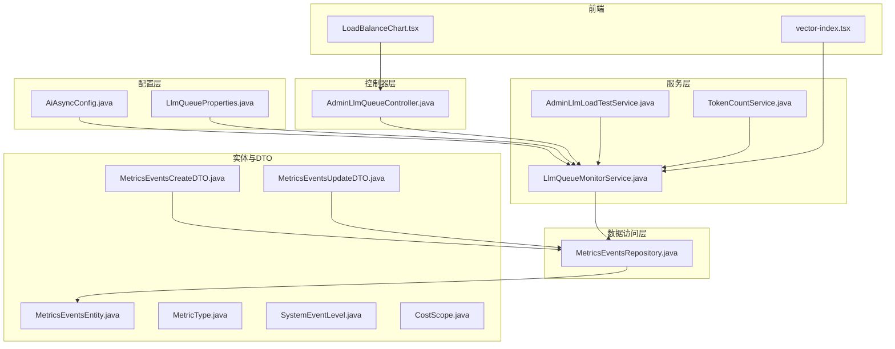
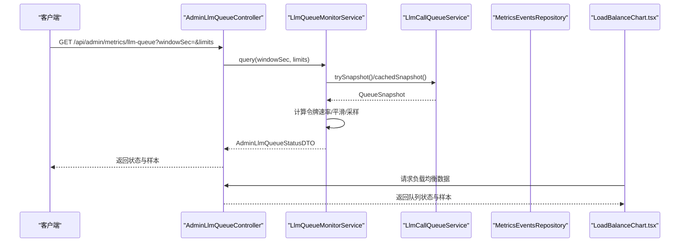
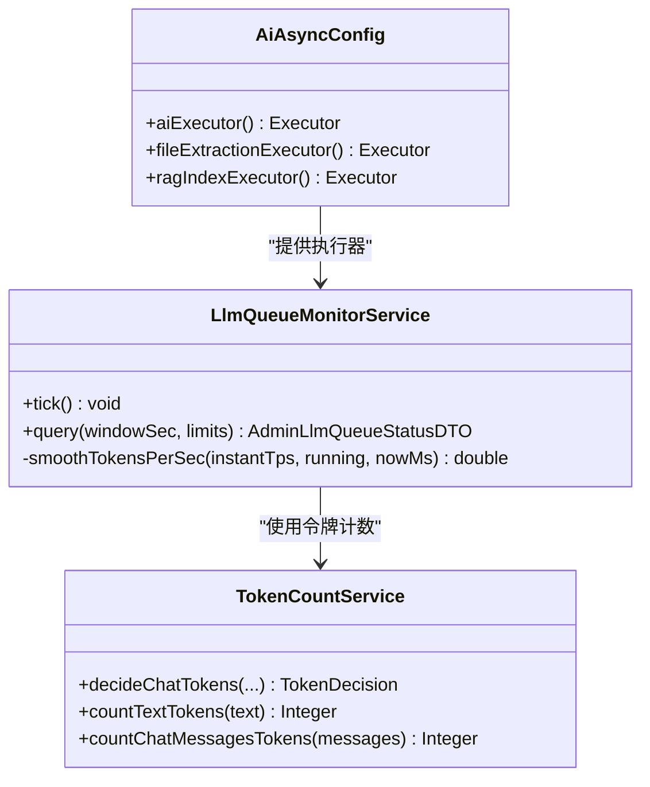
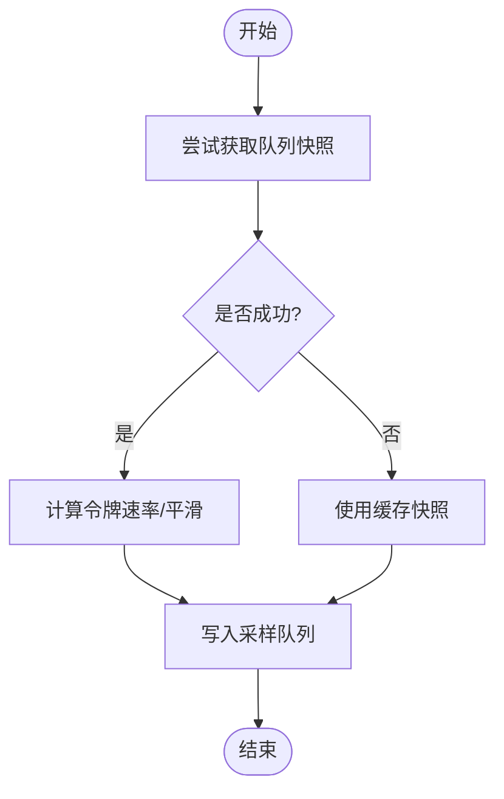
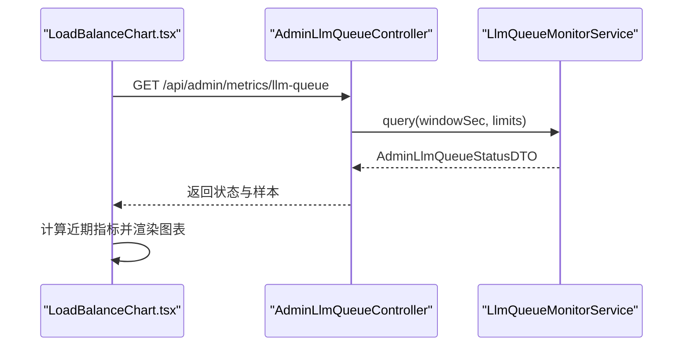
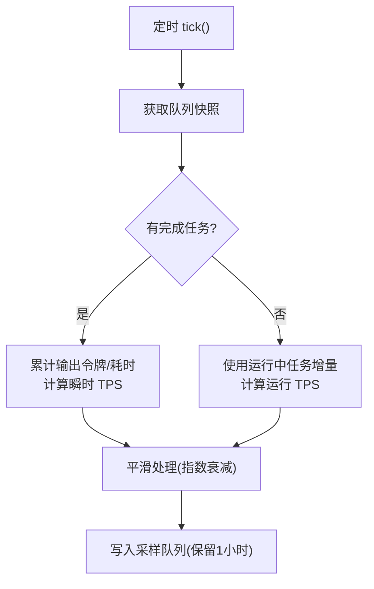
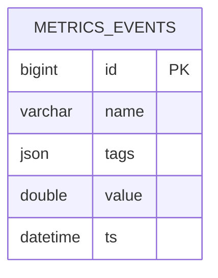
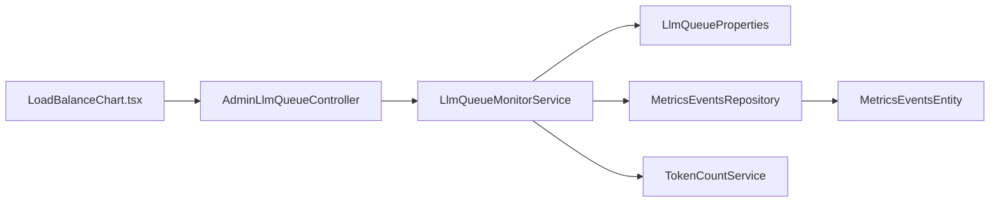

# 应用监控

<cite>
**本文引用的文件**
- [AiAsyncConfig.java](file://src/main/java/com/example/EnterpriseRagCommunity/config/AiAsyncConfig.java)
- [LlmQueueMonitorService.java](file://src/main/java/com/example/EnterpriseRagCommunity/service/monitor/LlmQueueMonitorService.java)
- [AdminLlmQueueController.java](file://src/main/java/com/example/EnterpriseRagCommunity/controller/monitor/admin/AdminLlmQueueController.java)
- [LlmQueueProperties.java](file://src/main/java/com/example/EnterpriseRagCommunity/config/LlmQueueProperties.java)
- [MetricsEventsRepository.java](file://src/main/java/com/example/EnterpriseRagCommunity/repository/monitor/MetricsEventsRepository.java)
- [MetricsEventsEntity.java](file://src/main/java/com/example/EnterpriseRagCommunity/entity/monitor/MetricsEventsEntity.java)
- [MetricsEventsCreateDTO.java](file://src/main/java/com/example/EnterpriseRagCommunity/dto/monitor/MetricsEventsCreateDTO.java)
- [MetricsEventsUpdateDTO.java](file://src/main/java/com/example/EnterpriseRagCommunity/dto/monitor/MetricsEventsUpdateDTO.java)
- [MetricType.java](file://src/main/java/com/example/EnterpriseRagCommunity/entity/monitor/enums/MetricType.java)
- [SystemEventLevel.java](file://src/main/java/com/example/EnterpriseRagCommunity/entity/monitor/enums/SystemEventLevel.java)
- [CostScope.java](file://src/main/java/com/example/EnterpriseRagCommunity/entity/monitor/enums/CostScope.java)
- [TokenCountService.java](file://src/main/java/com/example/EnterpriseRagCommunity/service/ai/TokenCountService.java)
- [application.properties](file://src/main/resources/application.properties)
- [LoadBalanceChart.tsx](file://my-vite-app/src/pages/admin/forms/metrics/LoadBalanceChart.tsx)
- [vector-index.tsx](file://my-vite-app/src/pages/admin/forms/retrieval/vector-index.tsx)
- [AdminLlmLoadTestService.java](file://src/main/java/com/example/EnterpriseRagCommunity/service/monitor/AdminLlmLoadTestService.java)
</cite>

## 目录
1. [简介](#简介)
2. [项目结构](#项目结构)
3. [核心组件](#核心组件)
4. [架构总览](#架构总览)
5. [详细组件分析](#详细组件分析)
6. [依赖分析](#依赖分析)
7. [性能考虑](#性能考虑)
8. [故障排查指南](#故障排查指南)
9. [结论](#结论)
10. [附录](#附录)

## 简介
本文件面向应用监控体系，围绕以下目标展开：Spring Boot Actuator 监控端点配置、自定义健康检查实现与指标收集机制；AI 异步任务执行器监控、文件提取任务队列监控、RAG 索引构建监控；LLM 负载均衡监控、队列状态监控与令牌使用量统计；监控数据可视化配置、告警规则设置与故障诊断方法；以及监控指标的采集频率、存储策略与查询优化建议。

## 项目结构
后端采用 Spring Boot + JPA 的分层架构，监控相关代码主要分布在如下模块：
- 配置层：线程池与队列参数配置
- 控制器层：对外暴露监控接口
- 服务层：监控逻辑与采样、平滑、缓存与聚合
- 数据访问层：指标事件与任务历史的持久化
- 实体与 DTO：指标事件模型、枚举类型与查询参数
- 前端：可视化图表组件（负载均衡、向量索引）

**图示来源**
- [AiAsyncConfig.java:1-47](file://src/main/java/com/example/EnterpriseRagCommunity/config/AiAsyncConfig.java#L1-L47)
- [LlmQueueMonitorService.java:1-397](file://src/main/java/com/example/EnterpriseRagCommunity/service/monitor/LlmQueueMonitorService.java#L1-L397)
- [AdminLlmQueueController.java:1-79](file://src/main/java/com/example/EnterpriseRagCommunity/controller/monitor/admin/AdminLlmQueueController.java#L1-L79)
- [MetricsEventsRepository.java:1-37](file://src/main/java/com/example/EnterpriseRagCommunity/repository/monitor/MetricsEventsRepository.java#L1-L37)
- [MetricsEventsEntity.java:1-35](file://src/main/java/com/example/EnterpriseRagCommunity/entity/monitor/MetricsEventsEntity.java#L1-L35)
- [MetricsEventsCreateDTO.java:1-30](file://src/main/java/com/example/EnterpriseRagCommunity/dto/monitor/MetricsEventsCreateDTO.java#L1-L30)
- [MetricsEventsUpdateDTO.java:1-32](file://src/main/java/com/example/EnterpriseRagCommunity/dto/monitor/MetricsEventsUpdateDTO.java#L1-L32)
- [MetricType.java:1-8](file://src/main/java/com/example/EnterpriseRagCommunity/entity/monitor/enums/MetricType.java#L1-L8)
- [SystemEventLevel.java:1-8](file://src/main/java/com/example/EnterpriseRagCommunity/entity/monitor/enums/SystemEventLevel.java#L1-L8)
- [CostScope.java:1-13](file://src/main/java/com/example/EnterpriseRagCommunity/entity/monitor/enums/CostScope.java#L1-L13)
- [LoadBalanceChart.tsx:49-392](file://my-vite-app/src/pages/admin/forms/metrics/LoadBalanceChart.tsx#L49-L392)
- [vector-index.tsx:564-581](file://my-vite-app/src/pages/admin/forms/retrieval/vector-index.tsx#L564-L581)

**章节来源**
- [AiAsyncConfig.java:1-47](file://src/main/java/com/example/EnterpriseRagCommunity/config/AiAsyncConfig.java#L1-L47)
- [LlmQueueMonitorService.java:1-397](file://src/main/java/com/example/EnterpriseRagCommunity/service/monitor/LlmQueueMonitorService.java#L1-L397)
- [AdminLlmQueueController.java:1-79](file://src/main/java/com/example/EnterpriseRagCommunity/controller/monitor/admin/AdminLlmQueueController.java#L1-L79)
- [MetricsEventsRepository.java:1-37](file://src/main/java/com/example/EnterpriseRagCommunity/repository/monitor/MetricsEventsRepository.java#L1-L37)
- [MetricsEventsEntity.java:1-35](file://src/main/java/com/example/EnterpriseRagCommunity/entity/monitor/MetricsEventsEntity.java#L1-L35)
- [MetricsEventsCreateDTO.java:1-30](file://src/main/java/com/example/EnterpriseRagCommunity/dto/monitor/MetricsEventsCreateDTO.java#L1-L30)
- [MetricsEventsUpdateDTO.java:1-32](file://src/main/java/com/example/EnterpriseRagCommunity/dto/monitor/MetricsEventsUpdateDTO.java#L1-L32)
- [MetricType.java:1-8](file://src/main/java/com/example/EnterpriseRagCommunity/entity/monitor/enums/MetricType.java#L1-L8)
- [SystemEventLevel.java:1-8](file://src/main/java/com/example/EnterpriseRagCommunity/entity/monitor/enums/SystemEventLevel.java#L1-L8)
- [CostScope.java:1-13](file://src/main/java/com/example/EnterpriseRagCommunity/entity/monitor/enums/CostScope.java#L1-L13)
- [LoadBalanceChart.tsx:49-392](file://my-vite-app/src/pages/admin/forms/metrics/LoadBalanceChart.tsx#L49-L392)
- [vector-index.tsx:564-581](file://my-vite-app/src/pages/admin/forms/retrieval/vector-index.tsx#L564-L581)

## 核心组件
- 线程池与执行器：为 AI 异步任务、文件提取与 RAG 索引构建分别配置独立线程池，便于隔离与容量控制。
- LLM 队列监控服务：定时采样队列快照，计算令牌速率、平滑处理、缓存最近完成的任务，并提供查询接口。
- 指标事件存储：以 JSON 字段存储标签，支持按名称与时间窗口聚合统计。
- 令牌计数与决策：根据输出规范化、使用度量与分词器结果综合决定输入/输出令牌数。
- 可视化与前端：负载均衡图表与向量索引管理页面展示监控数据。

**章节来源**
- [AiAsyncConfig.java:13-45](file://src/main/java/com/example/EnterpriseRagCommunity/config/AiAsyncConfig.java#L13-L45)
- [LlmQueueMonitorService.java:57-120](file://src/main/java/com/example/EnterpriseRagCommunity/service/monitor/LlmQueueMonitorService.java#L57-L120)
- [MetricsEventsRepository.java:15-28](file://src/main/java/com/example/EnterpriseRagCommunity/repository/monitor/MetricsEventsRepository.java#L15-L28)
- [TokenCountService.java:136-219](file://src/main/java/com/example/EnterpriseRagCommunity/service/ai/TokenCountService.java#L136-L219)
- [LoadBalanceChart.tsx:49-392](file://my-vite-app/src/pages/admin/forms/metrics/LoadBalanceChart.tsx#L49-L392)
- [vector-index.tsx:564-581](file://my-vite-app/src/pages/admin/forms/retrieval/vector-index.tsx#L564-L581)

## 架构总览
下图展示了从控制器到服务、再到数据存储与前端可视化的整体调用链路。

**图示来源**
- [AdminLlmQueueController.java:30-39](file://src/main/java/com/example/EnterpriseRagCommunity/controller/monitor/admin/AdminLlmQueueController.java#L30-L39)
- [LlmQueueMonitorService.java:57-203](file://src/main/java/com/example/EnterpriseRagCommunity/service/monitor/LlmQueueMonitorService.java#L57-L203)
- [LoadBalanceChart.tsx:49-392](file://my-vite-app/src/pages/admin/forms/metrics/LoadBalanceChart.tsx#L49-L392)

## 详细组件分析

### 组件一：AI 异步任务执行器监控
- 线程池配置：分别为 AI 任务、文件提取与 RAG 索引构建配置独立执行器，设置核心/最大线程数与队列容量，避免相互影响。
- 监控要点：通过队列监控服务定期采样，结合令牌计数服务评估吞吐与成本。

**图示来源**
- [AiAsyncConfig.java:13-45](file://src/main/java/com/example/EnterpriseRagCommunity/config/AiAsyncConfig.java#L13-L45)
- [LlmQueueMonitorService.java:57-150](file://src/main/java/com/example/EnterpriseRagCommunity/service/monitor/LlmQueueMonitorService.java#L57-L150)
- [TokenCountService.java:136-219](file://src/main/java/com/example/EnterpriseRagCommunity/service/ai/TokenCountService.java#L136-L219)

**章节来源**
- [AiAsyncConfig.java:13-45](file://src/main/java/com/example/EnterpriseRagCommunity/config/AiAsyncConfig.java#L13-L45)
- [LlmQueueMonitorService.java:57-150](file://src/main/java/com/example/EnterpriseRagCommunity/service/monitor/LlmQueueMonitorService.java#L57-L150)
- [TokenCountService.java:136-219](file://src/main/java/com/example/EnterpriseRagCommunity/service/ai/TokenCountService.java#L136-L219)

### 组件二：文件提取任务队列监控
- 队列容量与拒绝策略：文件提取执行器采用 CallerRunsPolicy，当队列满时由调用线程直接执行，降低丢任务风险。
- 监控维度：队列长度、运行中任务数、令牌速率、任务详情与历史。

**图示来源**
- [LlmQueueMonitorService.java:57-120](file://src/main/java/com/example/EnterpriseRagCommunity/service/monitor/LlmQueueMonitorService.java#L57-L120)

**章节来源**
- [AiAsyncConfig.java:24-34](file://src/main/java/com/example/EnterpriseRagCommunity/config/AiAsyncConfig.java#L24-L34)
- [LlmQueueMonitorService.java:57-120](file://src/main/java/com/example/EnterpriseRagCommunity/service/monitor/LlmQueueMonitorService.java#L57-L120)

### 组件三：RAG 索引构建监控
- 执行器配置：RAG 索引执行器与 AI 执行器分离，避免长耗时任务阻塞对话类请求。
- 监控侧重点：队列长度、运行中任务、令牌速率趋势与最近完成任务列表。

**章节来源**
- [AiAsyncConfig.java:36-45](file://src/main/java/com/example/EnterpriseRagCommunity/config/AiAsyncConfig.java#L36-L45)
- [LlmQueueMonitorService.java:152-203](file://src/main/java/com/example/EnterpriseRagCommunity/service/monitor/LlmQueueMonitorService.java#L152-L203)

### 组件四：LLM 负载均衡监控
- 后端：AdminLlmQueueController 提供队列状态查询与任务详情接口，支持窗口大小与限制参数。
- 前端：LoadBalanceChart.tsx 支持多种时间范围，计算近期 QPS、错误率、429 限流率、慢请求比例与慢趋势等指标。

**图示来源**
- [AdminLlmQueueController.java:30-39](file://src/main/java/com/example/EnterpriseRagCommunity/controller/monitor/admin/AdminLlmQueueController.java#L30-L39)
- [LlmQueueMonitorService.java:152-203](file://src/main/java/com/example/EnterpriseRagCommunity/service/monitor/LlmQueueMonitorService.java#L152-L203)
- [LoadBalanceChart.tsx:49-392](file://my-vite-app/src/pages/admin/forms/metrics/LoadBalanceChart.tsx#L49-L392)

**章节来源**
- [AdminLlmQueueController.java:30-39](file://src/main/java/com/example/EnterpriseRagCommunity/controller/monitor/admin/AdminLlmQueueController.java#L30-L39)
- [LoadBalanceChart.tsx:49-392](file://my-vite-app/src/pages/admin/forms/metrics/LoadBalanceChart.tsx#L49-L392)

### 组件五：队列状态监控与令牌使用量统计
- 令牌速率计算：基于完成任务的输出令牌与耗时计算瞬时 TPS，结合运行中任务令牌增量计算运行 TPS，并进行指数平滑。
- 最近完成任务合并：优先合并内存中的最近完成任务，不足部分从数据库缓存中补充，避免重复查询。
- 负载测试采样：AdminLlmLoadTestService 定期采样队列状态，统计最大等待/运行/总任务数与令牌速率均值与峰值。

**图示来源**
- [LlmQueueMonitorService.java:57-120](file://src/main/java/com/example/EnterpriseRagCommunity/service/monitor/LlmQueueMonitorService.java#L57-L120)
- [AdminLlmLoadTestService.java:226-245](file://src/main/java/com/example/EnterpriseRagCommunity/service/monitor/AdminLlmLoadTestService.java#L226-L245)

**章节来源**
- [LlmQueueMonitorService.java:122-150](file://src/main/java/com/example/EnterpriseRagCommunity/service/monitor/LlmQueueMonitorService.java#L122-L150)
- [AdminLlmLoadTestService.java:226-245](file://src/main/java/com/example/EnterpriseRagCommunity/service/monitor/AdminLlmLoadTestService.java#L226-L245)

### 组件六：指标事件存储与查询
- 模型设计：指标事件实体包含名称、标签(JSON)、数值与时间戳。
- 聚合查询：按指标名与时间范围聚合，返回计数、平均值与总和。
- DTO：创建与更新 DTO 支持可选字段与时间戳忽略。

**图示来源**
- [MetricsEventsEntity.java:15-32](file://src/main/java/com/example/EnterpriseRagCommunity/entity/monitor/MetricsEventsEntity.java#L15-L32)
- [MetricsEventsRepository.java:15-28](file://src/main/java/com/example/EnterpriseRagCommunity/repository/monitor/MetricsEventsRepository.java#L15-L28)

**章节来源**
- [MetricsEventsEntity.java:15-32](file://src/main/java/com/example/EnterpriseRagCommunity/entity/monitor/MetricsEventsEntity.java#L15-L32)
- [MetricsEventsRepository.java:15-28](file://src/main/java/com/example/EnterpriseRagCommunity/repository/monitor/MetricsEventsRepository.java#L15-L28)
- [MetricsEventsCreateDTO.java:13-28](file://src/main/java/com/example/EnterpriseRagCommunity/dto/monitor/MetricsEventsCreateDTO.java#L13-L28)
- [MetricsEventsUpdateDTO.java:14-30](file://src/main/java/com/example/EnterpriseRagCommunity/dto/monitor/MetricsEventsUpdateDTO.java#L14-L30)

### 组件七：令牌使用量统计与决策
- 输出规范化：去除思考块与多余空白，统一“ok”等特殊输出。
- 令牌决策：优先使用使用度量，其次尝试分词器估算，最后回退到启发式规则。
- 与队列监控联动：为队列监控提供更准确的令牌速率输入。

**章节来源**
- [TokenCountService.java:43-219](file://src/main/java/com/example/EnterpriseRagCommunity/service/ai/TokenCountService.java#L43-L219)

## 依赖分析
- 组件耦合：控制器依赖服务；服务依赖队列快照与属性配置；数据访问层依赖实体与枚举；前端依赖控制器返回的数据结构。
- 外部依赖：MySQL、OpenSearch 平台、Elasticsearch 连接参数在应用配置中集中管理。

**图示来源**
- [AdminLlmQueueController.java:27-28](file://src/main/java/com/example/EnterpriseRagCommunity/controller/monitor/admin/AdminLlmQueueController.java#L27-L28)
- [LlmQueueMonitorService.java:40-42](file://src/main/java/com/example/EnterpriseRagCommunity/service/monitor/LlmQueueMonitorService.java#L40-L42)
- [LlmQueueProperties.java:10-14](file://src/main/java/com/example/EnterpriseRagCommunity/config/LlmQueueProperties.java#L10-L14)
- [MetricsEventsRepository.java:13-14](file://src/main/java/com/example/EnterpriseRagCommunity/repository/monitor/MetricsEventsRepository.java#L13-L14)
- [MetricsEventsEntity.java:14-14](file://src/main/java/com/example/EnterpriseRagCommunity/entity/monitor/MetricsEventsEntity.java#L14-L14)
- [TokenCountService.java:23-23](file://src/main/java/com/example/EnterpriseRagCommunity/service/ai/TokenCountService.java#L23-L23)
- [LoadBalanceChart.tsx:49-392](file://my-vite-app/src/pages/admin/forms/metrics/LoadBalanceChart.tsx#L49-L392)

**章节来源**
- [AdminLlmQueueController.java:27-28](file://src/main/java/com/example/EnterpriseRagCommunity/controller/monitor/admin/AdminLlmQueueController.java#L27-L28)
- [LlmQueueMonitorService.java:40-42](file://src/main/java/com/example/EnterpriseRagCommunity/service/monitor/LlmQueueMonitorService.java#L40-L42)
- [LlmQueueProperties.java:10-14](file://src/main/java/com/example/EnterpriseRagCommunity/config/LlmQueueProperties.java#L10-L14)
- [MetricsEventsRepository.java:13-14](file://src/main/java/com/example/EnterpriseRagCommunity/repository/monitor/MetricsEventsRepository.java#L13-L14)
- [MetricsEventsEntity.java:14-14](file://src/main/java/com/example/EnterpriseRagCommunity/entity/monitor/MetricsEventsEntity.java#L14-L14)
- [TokenCountService.java:23-23](file://src/main/java/com/example/EnterpriseRagCommunity/service/ai/TokenCountService.java#L23-L23)
- [LoadBalanceChart.tsx:49-392](file://my-vite-app/src/pages/admin/forms/metrics/LoadBalanceChart.tsx#L49-L392)

## 性能考虑
- 采样频率：队列监控服务每秒采样一次，保留最近 1 小时样本，窗口查询默认 5 分钟，兼顾实时性与存储开销。
- 缓存策略：最近完成任务列表带 TTL 缓存，减少数据库压力；令牌速率平滑避免瞬时波动干扰。
- 查询优化：指标事件按名称与时间范围聚合，建议在 ts 与 name 上建立复合索引以提升查询效率。
- 线程池隔离：AI、文件提取、RAG 索引三类任务分离执行器，防止互相抢占 CPU 与 IO 资源。
- 前端渲染：图表组件仅计算近期窗口指标，避免一次性加载过多数据导致卡顿。

**章节来源**
- [LlmQueueMonitorService.java:57-120](file://src/main/java/com/example/EnterpriseRagCommunity/service/monitor/LlmQueueMonitorService.java#L57-L120)
- [MetricsEventsRepository.java:15-28](file://src/main/java/com/example/EnterpriseRagCommunity/repository/monitor/MetricsEventsRepository.java#L15-L28)
- [LoadBalanceChart.tsx:49-392](file://my-vite-app/src/pages/admin/forms/metrics/LoadBalanceChart.tsx#L49-L392)

## 故障排查指南
- 队列状态异常
  - 症状：队列长时间停滞、令牌速率归零但仍有运行任务。
  - 排查：检查队列配置上限与拒绝策略；确认最近完成任务是否持续推进；查看任务详情接口返回。
- 令牌速率异常
  - 症状：TPS 波动大或长期为 0。
  - 排查：确认平滑算法参数与最近完成任务增量；核对使用度量与分词器结果一致性。
- 指标事件缺失
  - 症状：聚合查询无数据。
  - 排查：确认指标名称、时间范围与标签；检查数据库连接与索引；验证 DTO 字段是否正确。
- 前端图表不刷新
  - 症状：图表长时间不变。
  - 排查：确认缓存 TTL 设置与时间范围选择；检查网络请求与权限。

**章节来源**
- [AdminLlmQueueController.java:41-47](file://src/main/java/com/example/EnterpriseRagCommunity/controller/monitor/admin/AdminLlmQueueController.java#L41-L47)
- [LlmQueueMonitorService.java:122-150](file://src/main/java/com/example/EnterpriseRagCommunity/service/monitor/LlmQueueMonitorService.java#L122-L150)
- [MetricsEventsRepository.java:15-28](file://src/main/java/com/example/EnterpriseRagCommunity/repository/monitor/MetricsEventsRepository.java#L15-L28)
- [LoadBalanceChart.tsx:62-62](file://my-vite-app/src/pages/admin/forms/metrics/LoadBalanceChart.tsx#L62-L62)

## 结论
本监控体系通过独立线程池隔离、队列采样与平滑处理、指标事件聚合与前端可视化，实现了对 AI 异步任务、文件提取与 RAG 索引的全链路可观测。建议在生产环境完善告警规则与日志审计，持续优化查询索引与缓存策略，确保在高并发场景下的稳定性与可维护性。

## 附录
- 监控端点与配置
  - Actuator 默认启用端点（如 health、info、metrics），可通过配置文件调整暴露策略与安全策略。
  - 应用配置集中于 application.properties，包括数据库、日志、上传与 AI 调用超时等参数。
- 告警规则建议
  - 队列等待时间超过阈值、令牌速率骤降、错误率与 429 限流率上升、索引构建失败率等。
- 可视化扩展
  - 在前端图表组件中增加更多时间范围与指标维度，结合后端查询接口实现动态筛选与钻取。

**章节来源**
- [application.properties:1-84](file://src/main/resources/application.properties#L1-L84)
- [AdminLlmQueueController.java:30-39](file://src/main/java/com/example/EnterpriseRagCommunity/controller/monitor/admin/AdminLlmQueueController.java#L30-L39)
- [LoadBalanceChart.tsx:49-392](file://my-vite-app/src/pages/admin/forms/metrics/LoadBalanceChart.tsx#L49-L392)