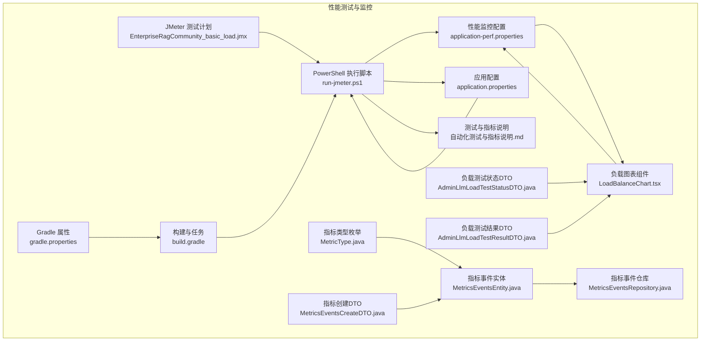
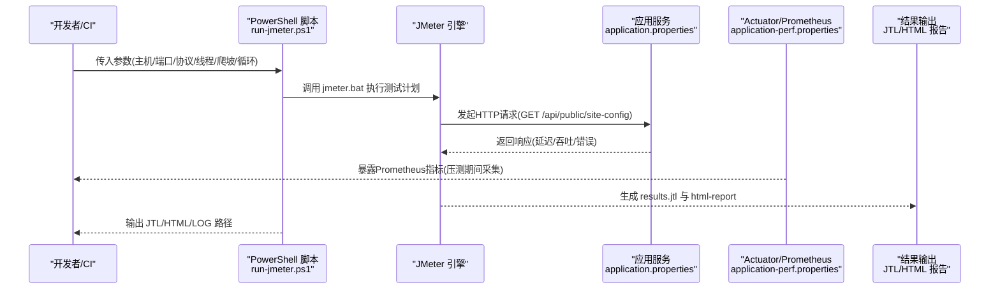
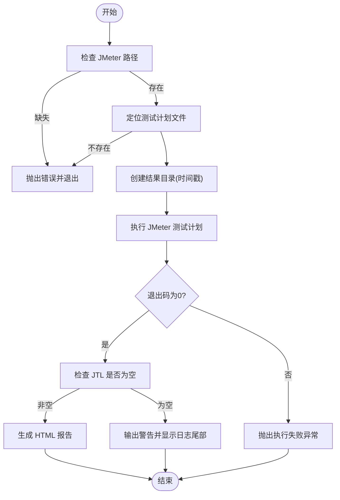
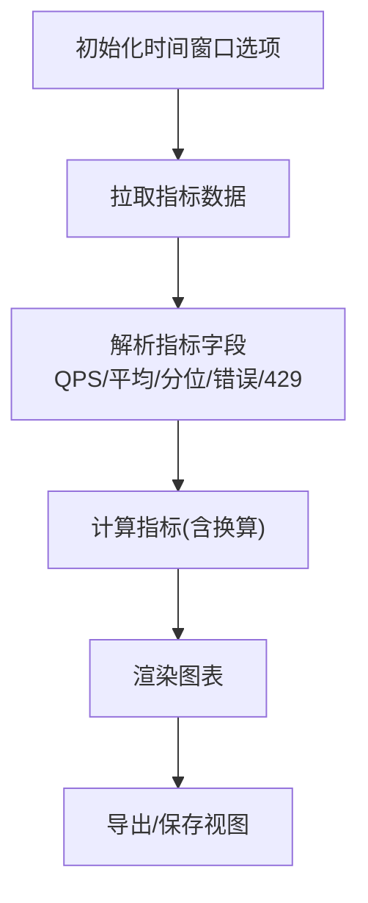
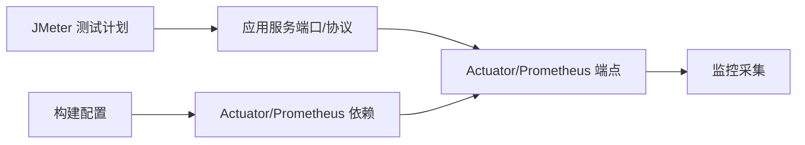

# 性能测试

<cite>
**本文引用的文件**
- [EnterpriseRagCommunity_basic_load.jmx](file://perf/jmeter/EnterpriseRagCommunity_basic_load.jmx)
- [run-jmeter.ps1](file://perf/jmeter/run-jmeter.ps1)
- [application-perf.properties](file://src/main/resources/application-perf.properties)
- [application.properties](file://src/main/resources/application.properties)
- [自动化测试与指标说明.md](file://docs/自动化测试与指标说明.md)
- [build.gradle](file://build.gradle)
- [gradle.properties](file://gradle.properties)
- [AdminLlmLoadTestStatusDTO.java](file://src/main/java/com/example/EnterpriseRagCommunity/dto/monitor/AdminLlmLoadTestStatusDTO.java)
- [AdminLlmLoadTestResultDTO.java](file://src/main/java/com/example/EnterpriseRagCommunity/dto/monitor/AdminLlmLoadTestResultDTO.java)
- [MetricsEventsEntity.java](file://src/main/java/com/example/EnterpriseRagCommunity/entity/monitor/MetricsEventsEntity.java)
- [MetricsEventsRepository.java](file://src/main/java/com/example/EnterpriseRagCommunity/repository/monitor/MetricsEventsRepository.java)
- [MetricType.java](file://src/main/java/com/example/EnterpriseRagCommunity/entity/monitor/enums/MetricType.java)
- [MetricsEventsCreateDTO.java](file://src/main/java/com/example/EnterpriseRagCommunity/dto/monitor/MetricsEventsCreateDTO.java)
- [LoadBalanceChart.tsx](file://my-vite-app/src/pages/admin/forms/metrics/LoadBalanceChart.tsx)
</cite>

## 目录
1. [引言](#引言)
2. [项目结构](#项目结构)
3. [核心组件](#核心组件)
4. [架构总览](#架构总览)
5. [详细组件分析](#详细组件分析)
6. [依赖分析](#依赖分析)
7. [性能考虑](#性能考虑)
8. [故障排查指南](#故障排查指南)
9. [结论](#结论)
10. [附录](#附录)

## 引言
本指南面向企业RAG社区项目的性能测试与基准测试落地，围绕JMeter负载测试脚本配置、测试场景设计、执行参数设置、测试环境搭建、数据准备与结果分析进行系统化说明，并提供基础负载、压力与稳定性测试的实施方法。同时，结合项目内置的Prometheus指标导出能力与前端可视化图表，形成从“压测执行—指标采集—可视化—瓶颈定位—优化建议”的闭环。最后，给出自动化性能测试集成到CI/CD流水线的最佳实践。

## 项目结构
与性能测试直接相关的文件与位置如下：
- JMeter测试计划与执行脚本：perf/jmeter/EnterpriseRagCommunity_basic_load.jmx、perf/jmeter/run-jmeter.ps1
- 性能监控配置：src/main/resources/application-perf.properties
- 应用服务端口与通用配置：src/main/resources/application.properties
- 文档与指标说明：docs/自动化测试与指标说明.md
- 构建与任务配置：build.gradle、gradle.properties
- 监控指标模型与存储：实体、仓库、DTO与枚举位于src/main/java/com/example/EnterpriseRagCommunity/{entity,repository,dto}/monitor/*
- 前端监控可视化：my-vite-app/src/pages/admin/forms/metrics/LoadBalanceChart.tsx

**图示来源**
- [EnterpriseRagCommunity_basic_load.jmx:1-83](file://perf/jmeter/EnterpriseRagCommunity_basic_load.jmx#L1-L83)
- [run-jmeter.ps1:1-74](file://perf/jmeter/run-jmeter.ps1#L1-L74)
- [application-perf.properties:1-6](file://src/main/resources/application-perf.properties#L1-L6)
- [application.properties:1-84](file://src/main/resources/application.properties#L1-L84)
- [自动化测试与指标说明.md:1-149](file://docs/自动化测试与指标说明.md#L1-L149)
- [build.gradle:1-800](file://build.gradle#L1-L800)
- [gradle.properties:1-13](file://gradle.properties#L1-L13)
- [AdminLlmLoadTestStatusDTO.java:1-34](file://src/main/java/com/example/EnterpriseRagCommunity/dto/monitor/AdminLlmLoadTestStatusDTO.java#L1-L34)
- [AdminLlmLoadTestResultDTO.java:1-18](file://src/main/java/com/example/EnterpriseRagCommunity/dto/monitor/AdminLlmLoadTestResultDTO.java#L1-L18)
- [MetricsEventsEntity.java:1-35](file://src/main/java/com/example/EnterpriseRagCommunity/entity/monitor/MetricsEventsEntity.java#L1-L35)
- [MetricsEventsRepository.java:1-36](file://src/main/java/com/example/EnterpriseRagCommunity/repository/monitor/MetricsEventsRepository.java#L1-L36)
- [MetricType.java:1-7](file://src/main/java/com/example/EnterpriseRagCommunity/entity/monitor/enums/MetricType.java#L1-L7)
- [MetricsEventsCreateDTO.java:1-30](file://src/main/java/com/example/EnterpriseRagCommunity/dto/monitor/MetricsEventsCreateDTO.java#L1-L30)
- [LoadBalanceChart.tsx:49-155](file://my-vite-app/src/pages/admin/forms/metrics/LoadBalanceChart.tsx#L49-L155)

**章节来源**
- [EnterpriseRagCommunity_basic_load.jmx:1-83](file://perf/jmeter/EnterpriseRagCommunity_basic_load.jmx#L1-L83)
- [run-jmeter.ps1:1-74](file://perf/jmeter/run-jmeter.ps1#L1-L74)
- [application-perf.properties:1-6](file://src/main/resources/application-perf.properties#L1-L6)
- [application.properties:1-84](file://src/main/resources/application.properties#L1-L84)
- [自动化测试与指标说明.md:18-71](file://docs/自动化测试与指标说明.md#L18-L71)
- [build.gradle:100-138](file://build.gradle#L100-L138)
- [gradle.properties:1-13](file://gradle.properties#L1-L13)

## 核心组件
- JMeter测试计划：定义测试场景、线程组、HTTP请求与默认参数，支持通过命令行参数覆盖主机、端口、协议、并发线程数、爬坡时间与循环次数。
- PowerShell执行脚本：负责定位JMeter安装、校验测试计划存在性、创建输出目录、生成JTL与HTML报告、处理退出码与日志提示。
- 性能监控配置：启用Actuator与Prometheus端点，暴露健康、信息、指标等端点，便于压测期间采集CPU、内存、GC、线程数与HTTP耗时分布等。
- 应用配置：定义服务端口、编码、连接池、超时、日志等，确保压测目标可达且具备合理性能基线。
- 监控指标模型：提供指标事件的实体、仓库、DTO与类型枚举，支撑自定义指标的入库与查询聚合。
- 前端可视化：提供负载图表组件，支持按时间窗口聚合与指标换算，辅助观察吞吐、平均/分位延迟、错误率与限流情况。

**章节来源**
- [EnterpriseRagCommunity_basic_load.jmx:53-79](file://perf/jmeter/EnterpriseRagCommunity_basic_load.jmx#L53-L79)
- [run-jmeter.ps1:29-69](file://perf/jmeter/run-jmeter.ps1#L29-L69)
- [application-perf.properties:1-6](file://src/main/resources/application-perf.properties#L1-L6)
- [application.properties:27-36](file://src/main/resources/application.properties#L27-L36)
- [MetricsEventsEntity.java:1-35](file://src/main/java/com/example/EnterpriseRagCommunity/entity/monitor/MetricsEventsEntity.java#L1-L35)
- [MetricsEventsRepository.java:1-36](file://src/main/java/com/example/EnterpriseRagCommunity/repository/monitor/MetricsEventsRepository.java#L1-L36)
- [LoadBalanceChart.tsx:49-155](file://my-vite-app/src/pages/admin/forms/metrics/LoadBalanceChart.tsx#L49-L155)

## 架构总览
下图展示了从JMeter执行到结果产出与可视化的整体流程，以及与应用监控配置的关系。

**图示来源**
- [run-jmeter.ps1:37-49](file://perf/jmeter/run-jmeter.ps1#L37-L49)
- [EnterpriseRagCommunity_basic_load.jmx:66-77](file://perf/jmeter/EnterpriseRagCommunity_basic_load.jmx#L66-L77)
- [application.properties:27-36](file://src/main/resources/application.properties#L27-L36)
- [application-perf.properties:1-6](file://src/main/resources/application-perf.properties#L1-L6)

## 详细组件分析

### JMeter测试计划与执行脚本
- 测试计划要点
  - 用户自定义变量：host、port、protocol，支持通过-J参数覆盖。
  - HTTP请求默认值：域名、端口、协议、内容编码、并发连接池大小、连接/响应超时。
  - 默认请求头：Accept: application/json。
  - 线程组：循环次数、并发线程数、爬坡时间、错误处理策略。
  - 单个HTTP采样器：GET /api/public/site-config。
- 执行脚本要点
  - 自动解析 JMETER_HOME 或 JMETER_BAT，校验路径存在性。
  - 创建带时间戳的结果目录，生成JTL、HTML报告与日志文件。
  - 解析退出码，若失败抛出异常；若JTL为空，提示检查日志。
  - 支持生成HTML报告与输出关键产物路径。

**图示来源**
- [run-jmeter.ps1:13-21](file://perf/jmeter/run-jmeter.ps1#L13-L21)
- [run-jmeter.ps1:23-27](file://perf/jmeter/run-jmeter.ps1#L23-L27)
- [run-jmeter.ps1:29-35](file://perf/jmeter/run-jmeter.ps1#L29-L35)
- [run-jmeter.ps1:37-49](file://perf/jmeter/run-jmeter.ps1#L37-L49)
- [run-jmeter.ps1:51-54](file://perf/jmeter/run-jmeter.ps1#L51-L54)
- [run-jmeter.ps1:56-69](file://perf/jmeter/run-jmeter.ps1#L56-L69)

**章节来源**
- [EnterpriseRagCommunity_basic_load.jmx:8-26](file://perf/jmeter/EnterpriseRagCommunity_basic_load.jmx#L8-L26)
- [EnterpriseRagCommunity_basic_load.jmx:30-42](file://perf/jmeter/EnterpriseRagCommunity_basic_load.jmx#L30-L42)
- [EnterpriseRagCommunity_basic_load.jmx:44-51](file://perf/jmeter/EnterpriseRagCommunity_basic_load.jmx#L44-L51)
- [EnterpriseRagCommunity_basic_load.jmx:53-64](file://perf/jmeter/EnterpriseRagCommunity_basic_load.jmx#L53-L64)
- [EnterpriseRagCommunity_basic_load.jmx:66-77](file://perf/jmeter/EnterpriseRagCommunity_basic_load.jmx#L66-L77)
- [run-jmeter.ps1:1-74](file://perf/jmeter/run-jmeter.ps1#L1-L74)

### 性能监控与指标模型
- Actuator/Prometheus
  - application-perf.properties启用健康、信息、Prometheus与指标端点，监听地址与端口固定，便于压测期间采集。
- 指标事件模型
  - 实体：指标名称、标签、数值、时间戳。
  - 仓库：按指标名与时间范围聚合统计（计数、平均、求和）。
  - DTO：创建指标事件的输入模型。
  - 枚举：指标类型（计数器、仪表盘、直方图）。

```mermaid
classDiagram
class MetricsEventsEntity {
+Long id
+String name
+Map~String,Object~ tags
+Double value
+LocalDateTime ts
}
class MetricsEventsRepository {
+aggregateByNameAndTsBetween(name,start,end) MetricsSummary[]
}
class MetricsEventsCreateDTO {
+String name
+Map~String,Object~ tags
+Double value
+LocalDateTime ts
}
class MetricType {
<<enum>>
COUNTER
GAUGE
HISTOGRAM
}
MetricsEventsRepository --> MetricsEventsEntity : "持久化"
MetricsEventsCreateDTO --> MetricsEventsEntity : "创建"
MetricsEventsEntity --> MetricType : "使用"
```

**图示来源**
- [MetricsEventsEntity.java:1-35](file://src/main/java/com/example/EnterpriseRagCommunity/entity/monitor/MetricsEventsEntity.java#L1-L35)
- [MetricsEventsRepository.java:1-36](file://src/main/java/com/example/EnterpriseRagCommunity/repository/monitor/MetricsEventsRepository.java#L1-L36)
- [MetricsEventsCreateDTO.java:1-30](file://src/main/java/com/example/EnterpriseRagCommunity/dto/monitor/MetricsEventsCreateDTO.java#L1-L30)
- [MetricType.java:1-7](file://src/main/java/com/example/EnterpriseRagCommunity/entity/monitor/enums/MetricType.java#L1-L7)

**章节来源**
- [application-perf.properties:1-6](file://src/main/resources/application-perf.properties#L1-L6)
- [MetricsEventsEntity.java:1-35](file://src/main/java/com/example/EnterpriseRagCommunity/entity/monitor/MetricsEventsEntity.java#L1-L35)
- [MetricsEventsRepository.java:1-36](file://src/main/java/com/example/EnterpriseRagCommunity/repository/monitor/MetricsEventsRepository.java#L1-L36)
- [MetricsEventsCreateDTO.java:1-30](file://src/main/java/com/example/EnterpriseRagCommunity/dto/monitor/MetricsEventsCreateDTO.java#L1-L30)
- [MetricType.java:1-7](file://src/main/java/com/example/EnterpriseRagCommunity/entity/monitor/enums/MetricType.java#L1-L7)

### 前端监控可视化
- 负载图表组件支持按时间窗口聚合，自动换算吞吐、平均/分位延迟、错误率与429限流率，便于快速定位异常区间。

**图示来源**
- [LoadBalanceChart.tsx:49-67](file://my-vite-app/src/pages/admin/forms/metrics/LoadBalanceChart.tsx#L49-L67)
- [LoadBalanceChart.tsx:132-155](file://my-vite-app/src/pages/admin/forms/metrics/LoadBalanceChart.tsx#L132-L155)

**章节来源**
- [LoadBalanceChart.tsx:49-67](file://my-vite-app/src/pages/admin/forms/metrics/LoadBalanceChart.tsx#L49-L67)
- [LoadBalanceChart.tsx:132-155](file://my-vite-app/src/pages/admin/forms/metrics/LoadBalanceChart.tsx#L132-L155)

## 依赖分析
- JMeter与应用端口
  - JMeter默认请求目标为 GET /api/public/site-config，需确保应用端口与协议配置正确。
- 监控端点
  - application-perf.properties启用Prometheus端点，便于在压测期间采集服务端资源指标。
- 构建与任务
  - build.gradle引入Actuator与Prometheus依赖，Gradle属性控制JVM参数与工具链版本。

**图示来源**
- [EnterpriseRagCommunity_basic_load.jmx:66-77](file://perf/jmeter/EnterpriseRagCommunity_basic_load.jmx#L66-L77)
- [application.properties:27-36](file://src/main/resources/application.properties#L27-L36)
- [application-perf.properties:1-6](file://src/main/resources/application-perf.properties#L1-L6)
- [build.gradle:104-111](file://build.gradle#L104-L111)
- [gradle.properties:1-13](file://gradle.properties#L1-L13)

**章节来源**
- [application.properties:27-36](file://src/main/resources/application.properties#L27-L36)
- [application-perf.properties:1-6](file://src/main/resources/application-perf.properties#L1-L6)
- [build.gradle:104-111](file://build.gradle#L104-L111)
- [gradle.properties:1-13](file://gradle.properties#L1-L13)

## 性能考虑
- 基础负载测试
  - 场景：GET /api/public/site-config，模拟匿名用户访问站点配置。
  - 参数：线程数、爬坡时间、循环次数，建议从较小规模起步，逐步放大。
  - 结果：关注吞吐、平均/分位延迟、错误率与429限流率。
- 压力测试
  - 场景：逐步提升并发，直至出现明显延迟增长、错误率上升或限流。
  - 指标：TPS、P95/P99延迟、错误率、限流率、资源占用（CPU/内存/GC/线程）。
- 稳定性测试
  - 场景：在峰值并发下持续运行一段时间，观察系统抖动与资源耗尽风险。
  - 指标：长时间趋势下的延迟与错误波动、GC停顿、线程池饱和度。
- 基准指标定义
  - 吞吐量（TPS）、平均响应时间、P90/P95/P99、错误率、并发数、限流率。
- 瓶颈识别
  - 通过Prometheus+Grafana采集服务端资源指标，结合JMeter报告定位网络、数据库、AI服务等环节的瓶颈。
- 优化建议
  - 连接池与超时：调整数据库连接池与超时参数，避免连接泄漏与慢查询。
  - 缓存与限流：对热点接口增加缓存与限流策略，降低下游压力。
  - 异步与并发：对耗时操作异步化，合理设置线程池与队列容量。
  - 资源扩容：根据压测峰值评估CPU/内存/GC策略，必要时横向扩容。

[本节为通用指导，无需特定文件引用]

## 故障排查指南
- JMeter执行失败
  - 检查JMeter路径是否正确，可通过环境变量JMETER_HOME或直接指定JMETER_BAT。
  - 查看日志文件，定位启动失败、目标不可达、TLS/协议不匹配等问题。
- JTL为空或仅有表头
  - 确认被压测服务已启动且可访问对应端口与路径。
  - 确认Threads/Loops参数大于0；如目标为HTTPS，确保传入协议参数。
- 监控端点不可用
  - 确认application-perf.properties已启用Prometheus端点，监听地址与端口配置正确。
  - 确保应用服务已启动并暴露Actuator端点。

**章节来源**
- [run-jmeter.ps1:13-21](file://perf/jmeter/run-jmeter.ps1#L13-L21)
- [run-jmeter.ps1:51-54](file://perf/jmeter/run-jmeter.ps1#L51-L54)
- [run-jmeter.ps1:56-69](file://perf/jmeter/run-jmeter.ps1#L56-L69)
- [自动化测试与指标说明.md:68-71](file://docs/自动化测试与指标说明.md#L68-L71)
- [application-perf.properties:1-6](file://src/main/resources/application-perf.properties#L1-L6)

## 结论
本指南基于项目现有的JMeter测试计划与执行脚本、Actuator/Prometheus监控配置，提供了从测试场景设计、执行参数、环境准备到结果分析与可视化的完整流程。通过结合服务端资源指标与前端可视化组件，能够有效识别瓶颈并指导优化。建议在CI/CD中集成性能测试任务，形成持续的性能基线与回归保障。

[本节为总结，无需特定文件引用]

## 附录
- 常用命令与参数
  - 运行JMeter基础负载测试：参见文档中的示例命令与参数说明。
  - 监控端点：http://127.0.0.1:8098/actuator/prometheus。
- CI/CD集成建议
  - 在流水线中添加性能测试步骤，固定JMeter路径，设置主机/端口/协议/并发/爬坡/循环参数。
  - 将JTL与HTML报告归档至统一目录，便于后续分析与对比。
  - 在压测期间采集Prometheus指标，结合Grafana进行趋势分析与告警。

**章节来源**
- [自动化测试与指标说明.md:62-71](file://docs/自动化测试与指标说明.md#L62-L71)
- [application-perf.properties:1-6](file://src/main/resources/application-perf.properties#L1-L6)