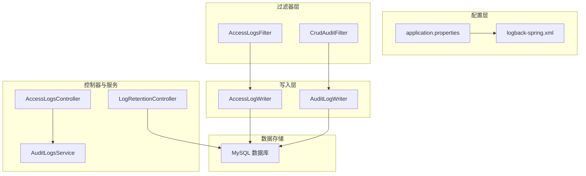
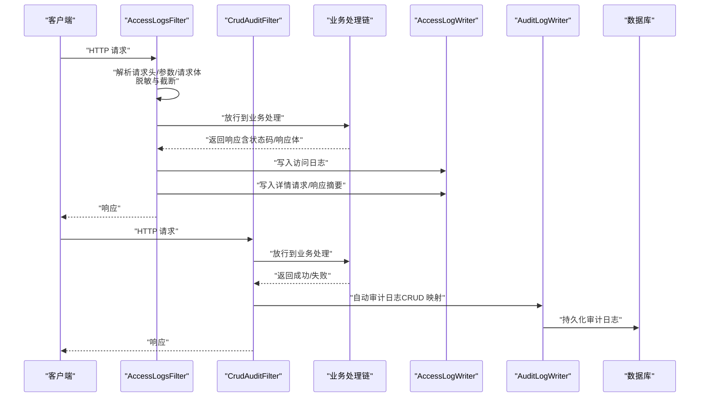
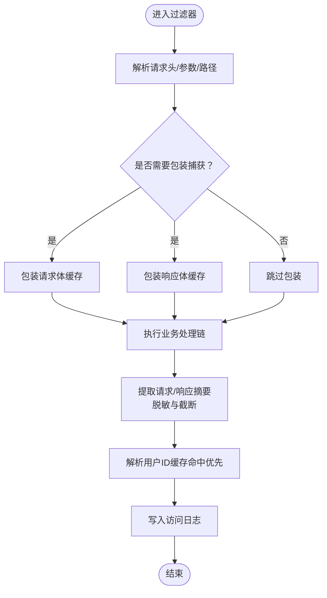
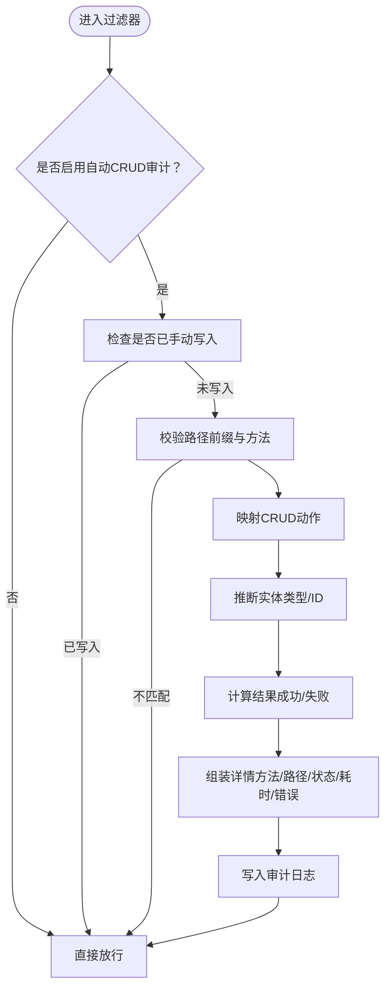
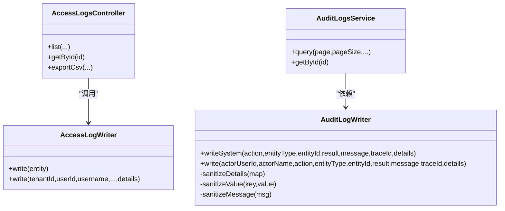
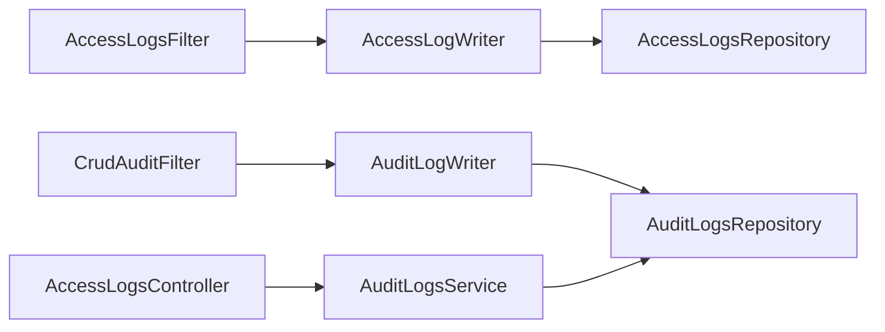

# 日志管理

<cite>
**本文引用的文件**
- [logback-spring.xml](file://src/main/resources/logback-spring.xml)
- [application.properties](file://src/main/resources/application.properties)
- [AccessLogsFilter.java](file://src/main/java/com/example/EnterpriseRagCommunity/security/AccessLogsFilter.java)
- [CrudAuditFilter.java](file://src/main/java/com/example/EnterpriseRagCommunity/security/CrudAuditFilter.java)
- [AccessLogWriter.java](file://src/main/java/com/example/EnterpriseRagCommunity/service/access/AccessLogWriter.java)
- [AuditLogWriter.java](file://src/main/java/com/example/EnterpriseRagCommunity/service/access/AuditLogWriter.java)
- [AccessLogsController.java](file://src/main/java/com/example/EnterpriseRagCommunity/controller/access/AccessLogsController.java)
- [AuditLogsService.java](file://src/main/java/com/example/EnterpriseRagCommunity/service/access/AuditLogsService.java)
- [LogRetentionController.java](file://src/main/java/com/example/EnterpriseRagCommunity/controller/access/LogRetentionController.java)
- [LoggingToFileSmokeTest.java](file://src/test/java/com/example/EnterpriseRagCommunity/LoggingToFileSmokeTest.java)
</cite>

## 目录
1. [引言](#引言)
2. [项目结构](#项目结构)
3. [核心组件](#核心组件)
4. [架构总览](#架构总览)
5. [详细组件分析](#详细组件分析)
6. [依赖关系分析](#依赖关系分析)
7. [性能考量](#性能考量)
8. [故障排查指南](#故障排查指南)
9. [结论](#结论)
10. [附录](#附录)

## 引言
本技术文档系统化阐述本项目的日志管理方案，覆盖以下方面：
- Logback 配置与输出格式
- 日志级别设置与控制
- 访问日志过滤器与审计日志自动记录机制
- 操作日志（审计日志）记录策略与查询能力
- 日志轮转、存储与归档策略
- 日志聚合、搜索与分析建议
- 日志安全、敏感信息脱敏与合规要求
- 日志监控告警与异常检测的实现要点

## 项目结构
围绕日志管理的关键代码与配置分布如下：
- 配置层：application.properties 提供日志级别、文件路径与 Logback 轮转参数；logback-spring.xml 继承 Spring Boot 默认基础配置。
- 过滤器层：AccessLogsFilter 实现请求级访问日志采集；CrudAuditFilter 实现 CRUD 自动审计。
- 写入层：AccessLogWriter、AuditLogWriter 将日志持久化到数据库。
- 控制器与服务：AccessLogsController、AuditLogsService 提供查询、导出与检索能力。
- 测试：LoggingToFileSmokeTest 验证日志落盘行为。

**图表来源**
- [application.properties:38-54](file://src/main/resources/application.properties#L38-L54)
- [logback-spring.xml:1-8](file://src/main/resources/logback-spring.xml#L1-L8)
- [AccessLogsFilter.java:44-213](file://src/main/java/com/example/EnterpriseRagCommunity/security/AccessLogsFilter.java#L44-L213)
- [CrudAuditFilter.java:35-128](file://src/main/java/com/example/EnterpriseRagCommunity/security/CrudAuditFilter.java#L35-L128)
- [AccessLogWriter.java:13-68](file://src/main/java/com/example/EnterpriseRagCommunity/service/access/AccessLogWriter.java#L13-L68)
- [AuditLogWriter.java:25-88](file://src/main/java/com/example/EnterpriseRagCommunity/service/access/AuditLogWriter.java#L25-L88)
- [AccessLogsController.java:25-151](file://src/main/java/com/example/EnterpriseRagCommunity/controller/access/AccessLogsController.java#L25-L151)
- [AuditLogsService.java:27-121](file://src/main/java/com/example/EnterpriseRagCommunity/service/access/AuditLogsService.java#L27-L121)
- [LogRetentionController.java:16-41](file://src/main/java/com/example/EnterpriseRagCommunity/controller/access/LogRetentionController.java#L16-L41)

**章节来源**
- [application.properties:38-54](file://src/main/resources/application.properties#L38-L54)
- [logback-spring.xml:1-8](file://src/main/resources/logback-spring.xml#L1-L8)

## 核心组件
- Logback 配置与输出格式
  - 使用 Spring Boot 默认基础配置继承，确保控制台与文件输出统一。
  - 字符集统一为 UTF-8，避免乱码。
- 日志级别设置
  - 通过环境变量或 application.properties 动态调整根级别与包级别。
  - 关键包级别示例：Spring Web、静态资源处理器等。
- 访问日志过滤器
  - 拦截 HTTP 请求，提取客户端 IP、请求头、请求体、响应体、状态码、耗时等。
  - 支持可选捕获请求体与响应体，带大小限制与截断保护。
  - 对敏感字段进行脱敏处理（如密码、令牌、Cookie 等）。
- 审计日志自动记录
  - 基于 CRUD 行为映射，自动记录增删改查动作，支持包含/排除路径前缀配置。
  - 自动识别实体类型与实体 ID，记录结果与错误信息。
- 日志写入与持久化
  - 访问日志与审计日志分别写入对应实体并持久化至数据库。
  - 审计日志对消息与详情中的敏感字段进行二次脱敏。
- 查询与导出
  - 提供分页查询、关键词检索、时间范围筛选、排序等能力。
  - 支持导出 CSV，便于离线分析与合规审计。

**章节来源**
- [AccessLogsFilter.java:44-213](file://src/main/java/com/example/EnterpriseRagCommunity/security/AccessLogsFilter.java#L44-L213)
- [CrudAuditFilter.java:35-128](file://src/main/java/com/example/EnterpriseRagCommunity/security/CrudAuditFilter.java#L35-L128)
- [AccessLogWriter.java:13-68](file://src/main/java/com/example/EnterpriseRagCommunity/service/access/AccessLogWriter.java#L13-L68)
- [AuditLogWriter.java:25-88](file://src/main/java/com/example/EnterpriseRagCommunity/service/access/AuditLogWriter.java#L25-L88)
- [AccessLogsController.java:25-151](file://src/main/java/com/example/EnterpriseRagCommunity/controller/access/AccessLogsController.java#L25-L151)
- [AuditLogsService.java:27-121](file://src/main/java/com/example/EnterpriseRagCommunity/service/access/AuditLogsService.java#L27-L121)

## 架构总览
下图展示从请求进入应用到日志落库的整体流程，包括访问日志与审计日志两条主线。

**图表来源**
- [AccessLogsFilter.java:84-213](file://src/main/java/com/example/EnterpriseRagCommunity/security/AccessLogsFilter.java#L84-L213)
- [CrudAuditFilter.java:58-128](file://src/main/java/com/example/EnterpriseRagCommunity/security/CrudAuditFilter.java#L58-L128)
- [AccessLogWriter.java:17-68](file://src/main/java/com/example/EnterpriseRagCommunity/service/access/AccessLogWriter.java#L17-L68)
- [AuditLogWriter.java:43-88](file://src/main/java/com/example/EnterpriseRagCommunity/service/access/AuditLogWriter.java#L43-L88)

## 详细组件分析

### 访问日志过滤器（AccessLogsFilter）
- 功能要点
  - 排除特定管理接口前缀，避免自检闭环。
  - 生成/透传请求 ID 与追踪 ID，便于跨服务关联。
  - 解析真实客户端 IP（支持 Forwarded/X-Forwarded-For/X-Real-IP）。
  - 可选捕获请求体与响应体，支持二进制与流式响应的规避。
  - 对查询串、请求体、响应体中的敏感字段进行脱敏。
  - 记录请求头快照、会话指纹（哈希）、延迟、状态码等。
- 性能与安全
  - 通过最大字节数限制与截断，防止内存与存储压力。
  - 缓存用户 ID，降低重复查询。
  - 对大对象使用 SHA-256 摘要，减少存储体积。
- 配置项
  - 是否捕获请求体与响应体
  - 最大字节限制
  - 排除路径前缀

**图表来源**
- [AccessLogsFilter.java:84-213](file://src/main/java/com/example/EnterpriseRagCommunity/security/AccessLogsFilter.java#L84-L213)

**章节来源**
- [AccessLogsFilter.java:44-213](file://src/main/java/com/example/EnterpriseRagCommunity/security/AccessLogsFilter.java#L44-L213)

### 审计日志自动记录（CrudAuditFilter）
- 功能要点
  - 在业务处理完成后自动判断 CRUD 类型（读/写/改/删）。
  - 支持包含/排除路径前缀，可选择是否包含读取操作。
  - 自动推断实体类型与实体 ID，记录结果与错误信息。
  - 与手动审计日志写入不冲突，避免重复记录。
- 配置项
  - 是否启用自动 CRUD 审计
  - 是否包含读取
  - 包含/排除路径前缀列表

**图表来源**
- [CrudAuditFilter.java:58-128](file://src/main/java/com/example/EnterpriseRagCommunity/security/CrudAuditFilter.java#L58-L128)

**章节来源**
- [CrudAuditFilter.java:35-128](file://src/main/java/com/example/EnterpriseRagCommunity/security/CrudAuditFilter.java#L35-L128)

### 日志写入与持久化
- 访问日志写入
  - 提供便捷方法批量写入，自动补全缺失字段与时间戳。
- 审计日志写入
  - 统一写入入口，保证字段一致性与上下文注入（如请求上下文）。
  - 对详情与消息中的敏感字段进行脱敏处理，避免泄露。

**图表来源**
- [AccessLogWriter.java:13-68](file://src/main/java/com/example/EnterpriseRagCommunity/service/access/AccessLogWriter.java#L13-L68)
- [AuditLogWriter.java:25-88](file://src/main/java/com/example/EnterpriseRagCommunity/service/access/AuditLogWriter.java#L25-L88)
- [AccessLogsController.java:25-151](file://src/main/java/com/example/EnterpriseRagCommunity/controller/access/AccessLogsController.java#L25-L151)
- [AuditLogsService.java:27-121](file://src/main/java/com/example/EnterpriseRagCommunity/service/access/AuditLogsService.java#L27-L121)

**章节来源**
- [AccessLogWriter.java:13-68](file://src/main/java/com/example/EnterpriseRagCommunity/service/access/AccessLogWriter.java#L13-L68)
- [AuditLogWriter.java:25-88](file://src/main/java/com/example/EnterpriseRagCommunity/service/access/AuditLogWriter.java#L25-L88)

### 查询与导出（访问日志与审计日志）
- 访问日志
  - 分页查询、关键词、时间范围、多维筛选、排序。
  - 导出 CSV，包含常用字段，便于离线分析。
- 审计日志
  - 支持按操作类型（CREATE/UPDATE/DELETE）模糊匹配。
  - 支持按实体类型、实体 ID、结果、时间范围、关键字检索。
  - 支持按详情 JSON 中的 actorName、traceId 等字段模糊检索。

**章节来源**
- [AccessLogsController.java:25-151](file://src/main/java/com/example/EnterpriseRagCommunity/controller/access/AccessLogsController.java#L25-L151)
- [AuditLogsService.java:27-121](file://src/main/java/com/example/EnterpriseRagCommunity/service/access/AuditLogsService.java#L27-L121)

## 依赖关系分析
- 组件耦合
  - 过滤器依赖写入器与管理员服务（用于解析用户信息）。
  - 写入器依赖仓库进行持久化。
  - 控制器依赖服务进行查询与导出。
- 外部依赖
  - Logback（通过 Spring Boot 默认基础配置）。
  - MySQL（日志持久化目标）。
  - Spring MVC/Spring Security（过滤器与安全上下文）。

**图表来源**
- [AccessLogsFilter.java:52-53](file://src/main/java/com/example/EnterpriseRagCommunity/security/AccessLogsFilter.java#L52-L53)
- [CrudAuditFilter.java:37-38](file://src/main/java/com/example/EnterpriseRagCommunity/security/CrudAuditFilter.java#L37-L38)
- [AccessLogWriter.java](file://src/main/java/com/example/EnterpriseRagCommunity/service/access/AccessLogWriter.java#L15)
- [AuditLogWriter.java](file://src/main/java/com/example/EnterpriseRagCommunity/service/access/AuditLogWriter.java#L27)
- [AccessLogsController.java](file://src/main/java/com/example/EnterpriseRagCommunity/controller/access/AccessLogsController.java#L30)
- [AuditLogsService.java](file://src/main/java/com/example/EnterpriseRagCommunity/service/access/AuditLogsService.java#L29)

**章节来源**
- [AccessLogsFilter.java:52-53](file://src/main/java/com/example/EnterpriseRagCommunity/security/AccessLogsFilter.java#L52-L53)
- [CrudAuditFilter.java:37-38](file://src/main/java/com/example/EnterpriseRagCommunity/security/CrudAuditFilter.java#L37-L38)
- [AccessLogWriter.java](file://src/main/java/com/example/EnterpriseRagCommunity/service/access/AccessLogWriter.java#L15)
- [AuditLogWriter.java](file://src/main/java/com/example/EnterpriseRagCommunity/service/access/AuditLogWriter.java#L27)
- [AccessLogsController.java](file://src/main/java/com/example/EnterpriseRagCommunity/controller/access/AccessLogsController.java#L30)
- [AuditLogsService.java](file://src/main/java/com/example/EnterpriseRagCommunity/service/access/AuditLogsService.java#L29)

## 性能考量
- 请求体/响应体捕获
  - 通过最大字节限制与截断，避免内存暴涨与磁盘压力。
  - 对二进制与流式响应（如 SSE）主动规避捕获。
- 用户 ID 缓存
  - 使用 TTL 缓存用户名到用户 ID 的映射，降低数据库查询频率。
- 存储优化
  - 对大对象使用 SHA-256 摘要，仅保存摘要与截断文本，减少存储占用。
- 查询性能
  - 审计日志查询对详情 JSON 的模糊检索为“尽力而为”，需结合索引与分页上限控制。

[本节为通用性能建议，无需具体文件引用]

## 故障排查指南
- 日志未落盘
  - 检查 LOG_FILE 环境变量或 application.properties 中 logging.file.name 设置。
  - 使用测试用例验证 Logback 配置加载与文件写入。
- 日志级别过高/过低
  - 通过 LOG_LEVEL_ROOT 或包级别变量调整，避免影响性能或掩盖问题。
- 访问日志缺失
  - 确认请求路径未被排除前缀命中。
  - 检查 app.logging.access.capture-body 与 app.logging.access.max-body-bytes 配置。
- 审计日志未记录
  - 确认 CrudAuditFilter 已启用且未被排除路径命中。
  - 检查 include-reads 与包含/排除前缀配置。
- 敏感信息泄露风险
  - 审计日志与访问日志均对敏感字段进行脱敏，若发现异常请核查过滤器与写入器的脱敏规则。

**章节来源**
- [LoggingToFileSmokeTest.java:19-34](file://src/test/java/com/example/EnterpriseRagCommunity/LoggingToFileSmokeTest.java#L19-L34)
- [application.properties:38-54](file://src/main/resources/application.properties#L38-L54)
- [AccessLogsFilter.java:55-62](file://src/main/java/com/example/EnterpriseRagCommunity/security/AccessLogsFilter.java#L55-L62)
- [CrudAuditFilter.java:40-50](file://src/main/java/com/example/EnterpriseRagCommunity/security/CrudAuditFilter.java#L40-L50)
- [AuditLogWriter.java:90-149](file://src/main/java/com/example/EnterpriseRagCommunity/service/access/AuditLogWriter.java#L90-L149)

## 结论
本项目采用“过滤器采集 + 写入器统一持久化 + 控制器服务查询导出”的日志体系，覆盖访问日志与审计日志两大场景。通过可配置的捕获策略、严格的敏感信息脱敏与完善的查询能力，满足日常运维、合规审计与安全分析需求。建议在生产环境中结合日志轮转与外部聚合平台，进一步提升可观察性与可追溯性。

[本节为总结性内容，无需具体文件引用]

## 附录

### Logback 配置与输出格式
- 继承 Spring Boot 默认基础配置，确保控制台与文件输出一致。
- 字符集统一为 UTF-8。
- 文件输出路径、轮转策略由 application.properties 提供参数驱动。

**章节来源**
- [logback-spring.xml:1-8](file://src/main/resources/logback-spring.xml#L1-L8)
- [application.properties:38-54](file://src/main/resources/application.properties#L38-L54)

### 日志级别设置
- 根级别与包级别通过环境变量或 application.properties 动态配置。
- 示例：根级别、项目包、Spring Web、静态资源处理器等。

**章节来源**
- [application.properties:45-54](file://src/main/resources/application.properties#L45-L54)

### 日志轮转、存储与归档策略
- 轮转参数
  - 单文件最大大小
  - 保留天数
  - 总体积上限
- 存储位置
  - 文件名由 LOG_FILE 指定，默认 logs/EnterpriseRagCommunity.log。
- 归档建议
  - 结合外部日志平台（如 ELK/OpenSearch）集中收集与归档。
  - 对访问日志与审计日志分别建立索引策略，便于检索与报表。

**章节来源**
- [application.properties:40-44](file://src/main/resources/application.properties#L40-L44)

### 日志聚合、搜索与分析
- 聚合平台
  - 建议接入 OpenSearch/Elasticsearch，统一收集访问日志与审计日志。
- 搜索与分析
  - 利用审计日志的 action、entityType、entityId、result、traceId、actorName 等字段构建仪表板。
  - 访问日志可用于流量分析、异常检测与安全审计。

[本节为概念性建议，无需具体文件引用]

### 日志安全、敏感信息脱敏与合规
- 敏感字段脱敏
  - 访问日志：对查询串、请求体、响应体中的敏感键（密码、令牌、Cookie 等）进行掩码。
  - 审计日志：对详情与消息中的敏感字段进行二次脱敏。
- 合规要求
  - 保留策略应符合数据最小化与最长保留期限要求。
  - 导出 CSV 与查询接口需受权限控制（ADMIN 角色）。

**章节来源**
- [AccessLogsFilter.java:285-301](file://src/main/java/com/example/EnterpriseRagCommunity/security/AccessLogsFilter.java#L285-L301)
- [AccessLogsFilter.java:494-522](file://src/main/java/com/example/EnterpriseRagCommunity/security/AccessLogsFilter.java#L494-L522)
- [AuditLogWriter.java:90-149](file://src/main/java/com/example/EnterpriseRagCommunity/service/access/AuditLogWriter.java#L90-L149)
- [AccessLogsController.java:36-83](file://src/main/java/com/example/EnterpriseRagCommunity/controller/access/AccessLogsController.java#L36-L83)

### 日志监控告警与异常检测
- 告警维度
  - 异常状态码占比、慢请求阈值、异常堆栈关键字、失败率突增。
- 检测建议
  - 基于审计日志的 FAIL 结果与错误字段进行异常检测。
  - 基于访问日志的延迟与状态码进行实时告警。

[本节为通用实践建议，无需具体文件引用]