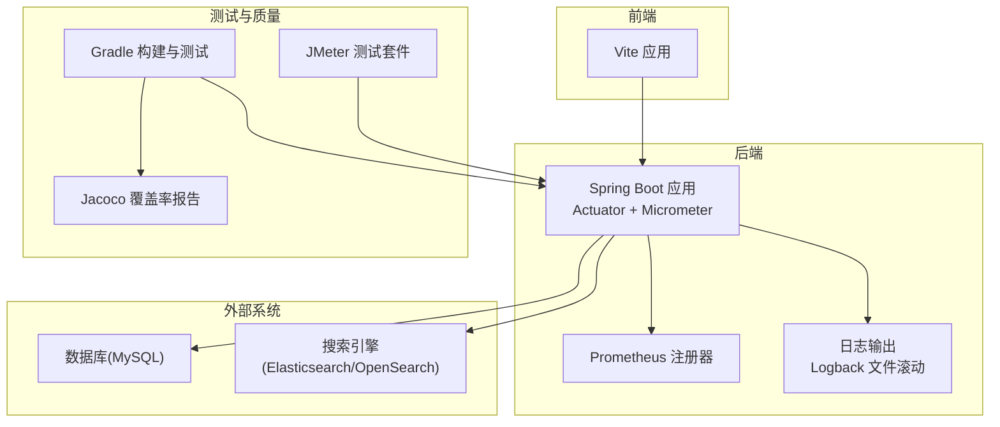
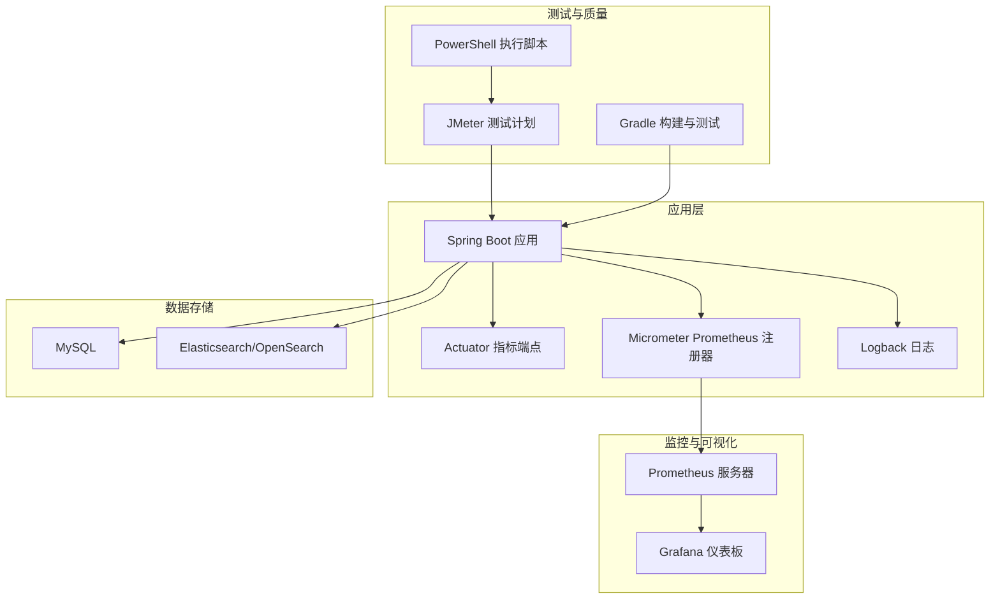
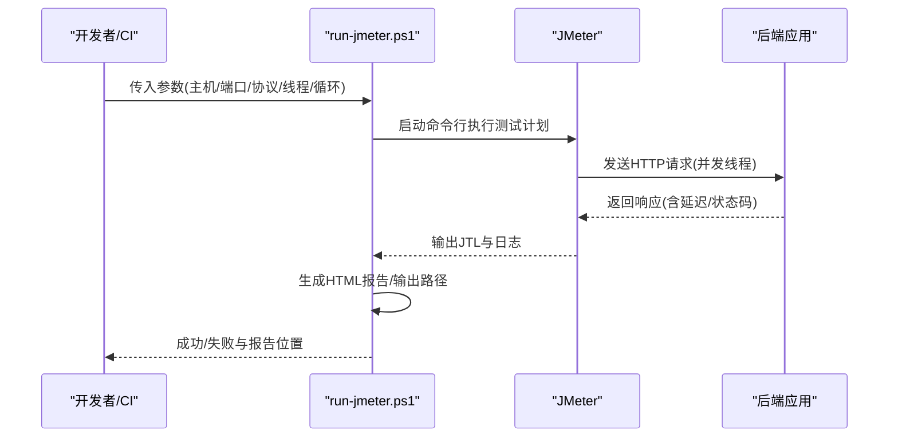
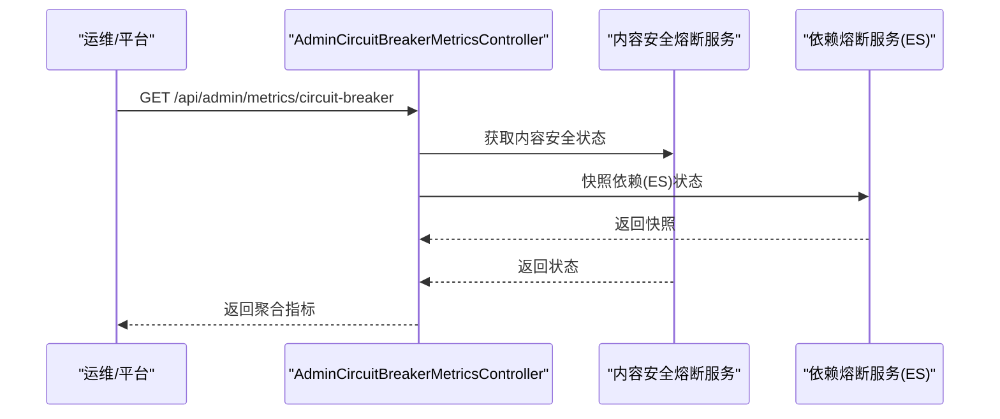
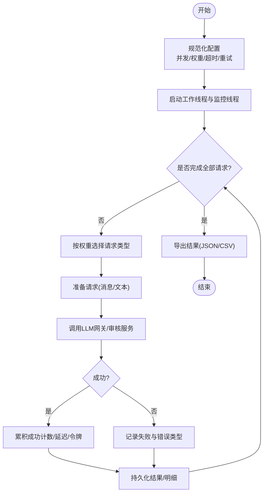
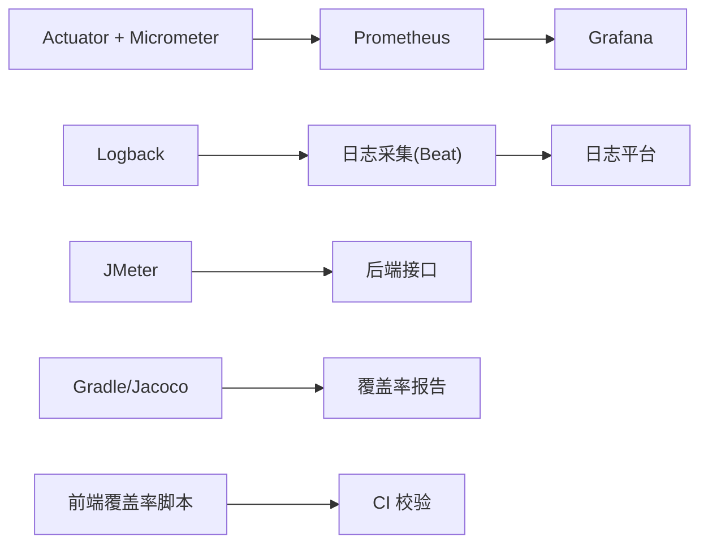

# 监控运维

<cite>
**本文引用的文件**
- [application.properties](file://src/main/resources/application.properties)
- [application-perf.properties](file://src/main/resources/application-perf.properties)
- [logback-spring.xml](file://src/main/resources/logback-spring.xml)
- [build.gradle](file://build.gradle)
- [EnterpriseRagCommunity_basic_load.jmx](file://perf/jmeter/EnterpriseRagCommunity_basic_load.jmx)
- [run-jmeter.ps1](file://perf/jmeter/run-jmeter.ps1)
- [AdminCircuitBreakerMetricsController.java](file://src/main/java/com/example/EnterpriseRagCommunity/controller/monitor/admin/AdminCircuitBreakerMetricsController.java)
- [AdminLlmLoadTestService.java](file://src/main/java/com/example/EnterpriseRagCommunity/service/monitor/AdminLlmLoadTestService.java)
- [assert-coverage-100.mjs](file://my-vite-app/scripts/assert-coverage-100.mjs)
- [check-changed-files-coverage.mjs](file://my-vite-app/scripts/check-changed-files-coverage.mjs)
</cite>

## 目录
1. [引言](#引言)
2. [项目结构](#项目结构)
3. [核心组件](#核心组件)
4. [架构总览](#架构总览)
5. [详细组件分析](#详细组件分析)
6. [依赖关系分析](#依赖关系分析)
7. [性能考量](#性能考量)
8. [故障排查指南](#故障排查指南)
9. [结论](#结论)
10. [附录](#附录)

## 引言
本指南面向企业级RAG社区平台的运维与监控，围绕应用监控配置、性能指标采集与告警、Prometheus/Grafana集成、日志聚合、JMeter性能测试、系统健康检查与服务降级、故障恢复流程以及运维自动化与CI/CD变更管理进行系统化说明。文档基于仓库现有实现与配置文件进行提炼，确保可操作性与落地性。

## 项目结构
后端采用Spring Boot 3 + Actuator + Micrometer + Prometheus集成；前端使用Vite+TypeScript；性能测试使用JMeter；Gradle构建并内置Jacoco覆盖率报告；日志通过Logback输出至文件并支持滚动策略。

图示来源
- [application.properties:1-84](file://src/main/resources/application.properties#L1-L84)
- [application-perf.properties:1-6](file://src/main/resources/application-perf.properties#L1-L6)
- [logback-spring.xml:1-8](file://src/main/resources/logback-spring.xml#L1-L8)
- [build.gradle:102-138](file://build.gradle#L102-L138)

章节来源
- [application.properties:1-84](file://src/main/resources/application.properties#L1-L84)
- [application-perf.properties:1-6](file://src/main/resources/application-perf.properties#L1-L6)
- [logback-spring.xml:1-8](file://src/main/resources/logback-spring.xml#L1-L8)
- [build.gradle:102-138](file://build.gradle#L102-L138)

## 核心组件
- 监控与指标
  - Actuator端点暴露健康、信息、Prometheus、指标等，便于Prometheus抓取。
  - Micrometer Prometheus注册器已引入，结合Actuator即可启用。
- 日志与审计
  - Logback配置统一字符集，继承基础模板，配合文件滚动策略。
  - 访问日志可捕获请求体与响应体，便于问题定位。
- 性能测试与负载评估
  - 提供JMeter测试计划与PowerShell执行脚本，支持并发、循环次数、超时等参数化。
  - 后端提供LLM负载测试服务，具备并发工作线程、重试、令牌统计、队列监控与结果导出能力。
- 健康与熔断
  - 提供熔断器状态查询接口，聚合内容安全与依赖熔断状态。
- 质量与覆盖率
  - Gradle任务链路包含测试与Jacoco报告生成；前端提供逐文件与变更文件覆盖率校验脚本。

章节来源
- [application-perf.properties:1-6](file://src/main/resources/application-perf.properties#L1-L6)
- [logback-spring.xml:1-8](file://src/main/resources/logback-spring.xml#L1-L8)
- [EnterpriseRagCommunity_basic_load.jmx:1-83](file://perf/jmeter/EnterpriseRagCommunity_basic_load.jmx#L1-L83)
- [run-jmeter.ps1:1-74](file://perf/jmeter/run-jmeter.ps1#L1-L74)
- [AdminCircuitBreakerMetricsController.java:1-38](file://src/main/java/com/example/EnterpriseRagCommunity/controller/monitor/admin/AdminCircuitBreakerMetricsController.java#L1-L38)
- [AdminLlmLoadTestService.java:1-800](file://src/main/java/com/example/EnterpriseRagCommunity/service/monitor/AdminLlmLoadTestService.java#L1-L800)
- [assert-coverage-100.mjs:1-119](file://my-vite-app/scripts/assert-coverage-100.mjs#L1-L119)
- [check-changed-files-coverage.mjs:1-185](file://my-vite-app/scripts/check-changed-files-coverage.mjs#L1-L185)

## 架构总览
下图展示Prometheus抓取指标、Grafana可视化、JMeter负载测试与后端应用之间的关系，以及日志与数据库/搜索引擎的交互。

图示来源
- [application-perf.properties:1-6](file://src/main/resources/application-perf.properties#L1-L6)
- [build.gradle:102-138](file://build.gradle#L102-L138)
- [EnterpriseRagCommunity_basic_load.jmx:1-83](file://perf/jmeter/EnterpriseRagCommunity_basic_load.jmx#L1-L83)
- [run-jmeter.ps1:1-74](file://perf/jmeter/run-jmeter.ps1#L1-L74)

## 详细组件分析

### 组件A：Prometheus与Grafana集成
- 指标暴露
  - 通过Actuator开启health、info、prometheus、metrics端点，并强制显示详情。
  - 通过Micrometer Prometheus注册器将JVM与业务指标暴露给Prometheus。
- Grafana仪表板建议
  - 基础面板：CPU使用率、内存使用、GC次数、线程数、请求速率、错误率。
  - 业务面板：LLM调用量、延迟分布、队列长度、令牌消耗、审核通过/拒绝率。
  - 健康面板：应用健康状态、数据库连接池状态、搜索引擎可用性。
- 告警规则建议
  - 延迟P95超过阈值、错误率上升、队列积压、数据库连接池耗尽、Prometheus抓取失败。

章节来源
- [application-perf.properties:1-6](file://src/main/resources/application-perf.properties#L1-L6)
- [build.gradle:102-138](file://build.gradle#L102-L138)

### 组件B：日志聚合与管理
- 日志配置
  - Logback继承基础模板，统一控制台与文件编码。
  - 应用日志文件路径、滚动大小、历史天数、总大小上限由配置项控制。
  - 访问日志可捕获请求体与响应体，限制最大字节数，避免过大日志影响性能。
- 日志聚合建议
  - 使用Filebeat/Fluent Bit采集日志，发送至Elastic Stack/Graylog/Loki。
  - 对访问日志进行结构化解析，建立索引以便检索与告警。
- 运维要点
  - 定期清理旧日志，监控磁盘占用。
  - 关键异常与慢查询需在日志中打标，便于快速定位。

章节来源
- [logback-spring.xml:1-8](file://src/main/resources/logback-spring.xml#L1-L8)
- [application.properties:38-61](file://src/main/resources/application.properties#L38-L61)

### 组件C：JMeter性能测试
- 测试计划
  - 提供基础负载测试计划，包含HTTP请求默认配置、线程组、循环次数、并发线程数、超时等参数化。
  - 默认对公开站点配置接口发起GET请求，可扩展其他API场景。
- 执行脚本
  - PowerShell脚本支持通过环境变量或参数指定主机、端口、协议、线程数、加 ramp 时间、循环次数。
  - 自动生成时间戳目录存放JTL与HTML报告，失败时抛出异常并输出JMeter日志尾部。
- 建议
  - 将脚本加入CI/CD，按阶段执行不同场景（预热、峰值、压力）。
  - 结合Grafana看板观察应用侧指标，定位瓶颈。

图示来源
- [EnterpriseRagCommunity_basic_load.jmx:1-83](file://perf/jmeter/EnterpriseRagCommunity_basic_load.jmx#L1-L83)
- [run-jmeter.ps1:1-74](file://perf/jmeter/run-jmeter.ps1#L1-L74)

章节来源
- [EnterpriseRagCommunity_basic_load.jmx:1-83](file://perf/jmeter/EnterpriseRagCommunity_basic_load.jmx#L1-L83)
- [run-jmeter.ps1:1-74](file://perf/jmeter/run-jmeter.ps1#L1-L74)

### 组件D：系统健康检查与熔断
- 健康检查
  - Actuator health端点开启详情，便于Kubernetes/外部探针识别应用健康状态。
- 熔断监控
  - 提供熔断器状态查询接口，聚合内容安全与依赖（如ES）熔断状态，便于管理员快速掌握风险面。
- 建议
  - 将健康检查纳入容器探针，结合熔断状态触发自动扩缩容或流量切换。

图示来源
- [AdminCircuitBreakerMetricsController.java:1-38](file://src/main/java/com/example/EnterpriseRagCommunity/controller/monitor/admin/AdminCircuitBreakerMetricsController.java#L1-L38)

章节来源
- [AdminCircuitBreakerMetricsController.java:1-38](file://src/main/java/com/example/EnterpriseRagCommunity/controller/monitor/admin/AdminCircuitBreakerMetricsController.java#L1-L38)
- [application-perf.properties:1-6](file://src/main/resources/application-perf.properties#L1-L6)

### 组件E：LLM负载测试服务（后端）
- 并发与重试
  - 支持虚拟线程池与固定线程池组合，按权重分配聊天流与审核测试请求。
  - 可配置超时、重试次数与重试间隔，失败时记录错误类型。
- 指标采集
  - 实时采样队列挂起/运行/总任务数、TPS、延迟分布、令牌消耗（总/入/出）。
  - 异步重计算令牌统计，保证准确性。
- 导出与归档
  - 支持JSON/CVS导出测试结果与明细，便于离线分析与回归对比。
- 建议
  - 在压测前清理缓存/索引，压测后清理临时数据，避免污染生产数据。

图示来源
- [AdminLlmLoadTestService.java:1-800](file://src/main/java/com/example/EnterpriseRagCommunity/service/monitor/AdminLlmLoadTestService.java#L1-L800)

章节来源
- [AdminLlmLoadTestService.java:1-800](file://src/main/java/com/example/EnterpriseRagCommunity/service/monitor/AdminLlmLoadTestService.java#L1-L800)

### 组件F：质量与覆盖率保障
- Gradle测试与覆盖率
  - 测试任务链路包含Jacoco报告生成，支持多类服务的聚焦覆盖率任务与验证。
- 前端覆盖率校验
  - 提供逐文件100%覆盖率与变更文件增量覆盖率校验脚本，CI中可直接调用。

章节来源
- [build.gradle:229-380](file://build.gradle#L229-L380)
- [assert-coverage-100.mjs:1-119](file://my-vite-app/scripts/assert-coverage-100.mjs#L1-L119)
- [check-changed-files-coverage.mjs:1-185](file://my-vite-app/scripts/check-changed-files-coverage.mjs#L1-L185)

## 依赖关系分析
- 指标与监控
  - Spring Boot Actuator + Micrometer Prometheus注册器 → Prometheus抓取 → Grafana可视化。
- 日志
  - Logback输出至文件，结合Filebeat/Fluent Bit进入日志平台。
- 测试
  - JMeter测试计划与PowerShell脚本驱动后端接口，生成JTL与HTML报告。
- 质量
  - Gradle测试链路与Jacoco报告；前端覆盖率脚本在CI中执行。

图示来源
- [application-perf.properties:1-6](file://src/main/resources/application-perf.properties#L1-L6)
- [build.gradle:102-138](file://build.gradle#L102-L138)
- [EnterpriseRagCommunity_basic_load.jmx:1-83](file://perf/jmeter/EnterpriseRagCommunity_basic_load.jmx#L1-L83)
- [run-jmeter.ps1:1-74](file://perf/jmeter/run-jmeter.ps1#L1-L74)

章节来源
- [application-perf.properties:1-6](file://src/main/resources/application-perf.properties#L1-L6)
- [build.gradle:102-138](file://build.gradle#L102-L138)
- [EnterpriseRagCommunity_basic_load.jmx:1-83](file://perf/jmeter/EnterpriseRagCommunity_basic_load.jmx#L1-L83)
- [run-jmeter.ps1:1-74](file://perf/jmeter/run-jmeter.ps1#L1-L74)

## 性能考量
- JVM与线程
  - 已启用虚拟线程执行器，适合高并发I/O密集型场景；注意线程池大小与队列容量匹配实际负载。
- 数据库与连接池
  - Hikari连接池参数可调，建议根据峰值QPS与事务持续时间优化最大池大小、空闲超时、最大生命周期。
- 搜索引擎
  - Elasticsearch连接超时与Socket超时已配置，建议结合索引写入批大小与刷新策略优化吞吐。
- 日志与IO
  - 访问日志捕获体大小受控，建议在高并发场景下降低捕获范围或关闭响应体捕获以减少开销。
- 测试基线
  - 使用JMeter与后端LLM负载测试服务建立稳定基线，定期回归对比，识别回归与性能退化。

章节来源
- [application.properties:7-16](file://src/main/resources/application.properties#L7-L16)
- [application.properties:78-83](file://src/main/resources/application.properties#L78-L83)
- [application.properties:58-61](file://src/main/resources/application.properties#L58-L61)
- [EnterpriseRagCommunity_basic_load.jmx:1-83](file://perf/jmeter/EnterpriseRagCommunity_basic_load.jmx#L1-L83)
- [AdminLlmLoadTestService.java:1-800](file://src/main/java/com/example/EnterpriseRagCommunity/service/monitor/AdminLlmLoadTestService.java#L1-L800)

## 故障排查指南
- 健康检查失败
  - 通过health端点查看应用与依赖健康状态，结合熔断器状态接口判断内容安全与依赖风险。
- 指标异常
  - 观察Prometheus/Grafana中的延迟、错误率、队列积压、令牌消耗趋势，定位瓶颈。
- 日志定位
  - 利用访问日志捕获体功能与日志平台检索，结合错误堆栈与时间窗口快速定位。
- 测试回放
  - 使用JMeter脚本复现问题场景，比对前后版本指标差异；必要时导出后端LLM负载测试结果进行离线分析。
- 降级与恢复
  - 当依赖熔断或队列积压严重时，优先降级非关键路径，释放资源；恢复后逐步提升负载并观察指标。

章节来源
- [application-perf.properties:1-6](file://src/main/resources/application-perf.properties#L1-L6)
- [AdminCircuitBreakerMetricsController.java:1-38](file://src/main/java/com/example/EnterpriseRagCommunity/controller/monitor/admin/AdminCircuitBreakerMetricsController.java#L1-L38)
- [EnterpriseRagCommunity_basic_load.jmx:1-83](file://perf/jmeter/EnterpriseRagCommunity_basic_load.jmx#L1-L83)
- [run-jmeter.ps1:1-74](file://perf/jmeter/run-jmeter.ps1#L1-L74)
- [AdminLlmLoadTestService.java:1-800](file://src/main/java/com/example/EnterpriseRagCommunity/service/monitor/AdminLlmLoadTestService.java#L1-L800)

## 结论
本指南基于仓库现有配置与实现，给出了Prometheus/Grafana集成、日志聚合、JMeter性能测试、健康检查与熔断、LLM负载测试服务、质量与覆盖率保障的运维实践路径。建议在生产环境中结合业务场景完善告警阈值、扩展可视化面板、固化CI/CD中的测试与覆盖率校验流程，并建立定期回归与容量规划机制。

## 附录
- 快速清单
  - 启用Actuator与Prometheus端点，配置Grafana数据源与仪表板。
  - 部署日志采集，建立访问日志解析规则与索引。
  - 在CI中执行JMeter与覆盖率脚本，保留报告与归档。
  - 建立熔断器监控与健康检查告警，制定降级与恢复流程。
  - 使用后端LLM负载测试服务建立性能基线，定期回归。