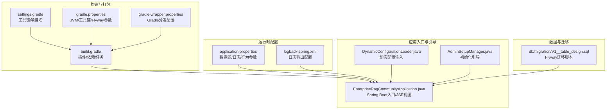
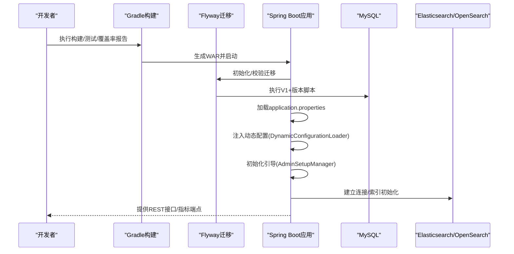
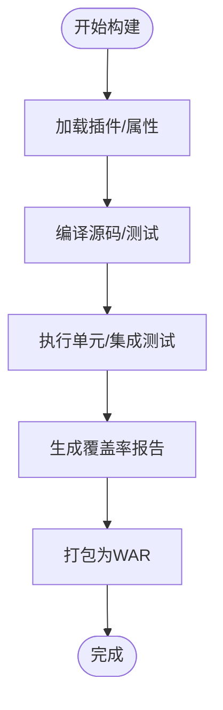
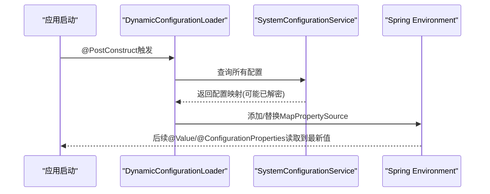
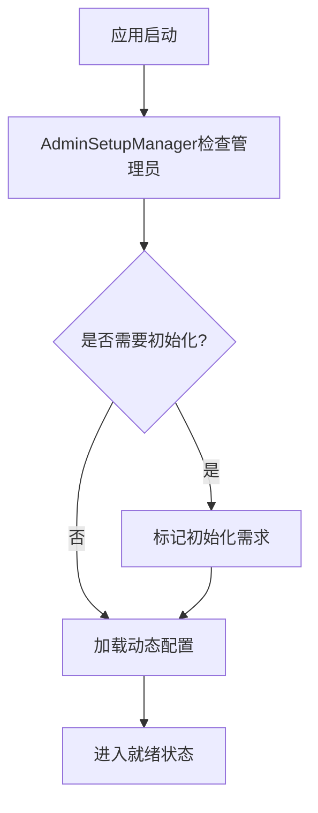
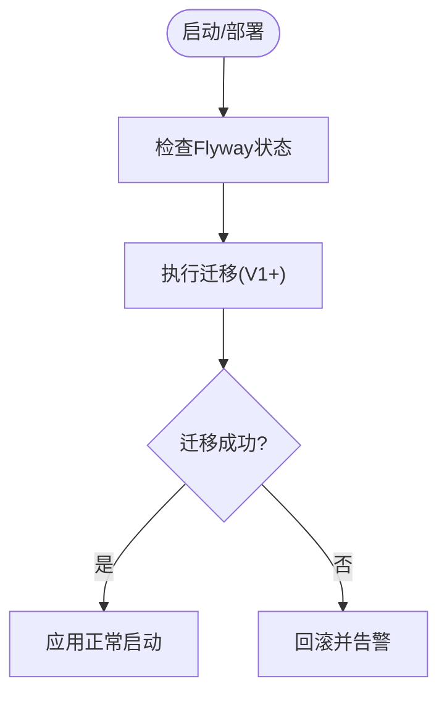
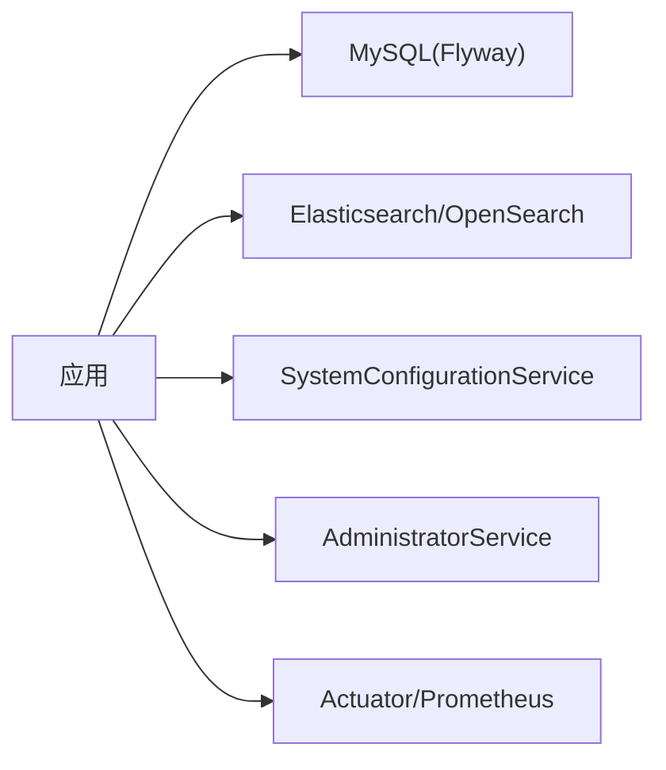

# 运维自动化

<cite>
**本文引用的文件**
- [build.gradle](file://build.gradle)
- [settings.gradle](file://settings.gradle)
- [gradle.properties](file://gradle.properties)
- [gradle-wrapper.properties](file://gradle/wrapper/gradle-wrapper.properties)
- [application.properties](file://src/main/resources/application.properties)
- [logback-spring.xml](file://src/main/resources/logback-spring.xml)
- [EnterpriseRagCommunityApplication.java](file://src/main/java/com/example/EnterpriseRagCommunity/EnterpriseRagCommunityApplication.java)
- [DynamicConfigurationLoader.java](file://src/main/java/com/example/EnterpriseRagCommunity/config/DynamicConfigurationLoader.java)
- [AdminSetupManager.java](file://src/main/java/com/example/EnterpriseRagCommunity/config/AdminSetupManager.java)
- [SystemConfigurationService.java](file://src/main/java/com/example/EnterpriseRagCommunity/service/config/SystemConfigurationService.java)
- [V1__table_design.sql](file://src/main/resources/db/migration/V1__table_design.sql)
- [AdminCircuitBreakerMetricsController.java](file://src/main/java/com/example/EnterpriseRagCommunity/controller/monitor/admin/AdminCircuitBreakerMetricsController.java)
- [TotpCryptoService.java](file://src/main/java/com/example/EnterpriseRagCommunity/service/access/TotpCryptoService.java)
</cite>

## 目录
1. [引言](#引言)
2. [项目结构](#项目结构)
3. [核心组件](#核心组件)
4. [架构总览](#架构总览)
5. [详细组件分析](#详细组件分析)
6. [依赖分析](#依赖分析)
7. [性能考虑](#性能考虑)
8. [故障排查指南](#故障排查指南)
9. [结论](#结论)
10. [附录](#附录)

## 引言
本指南面向运维与平台工程团队，围绕企业级RAG社区系统的构建、配置、发布与运行时自动化展开，覆盖以下主题：
- Gradle构建配置、依赖管理与打包发布流程
- 动态配置加载机制、系统配置管理与运行时参数调整
- 初始化引导服务、数据库迁移与系统启动流程自动化
- 环境变量配置、密钥管理与安全设置
- 部署脚本、回滚策略与变更管理流程
- 监控告警、自动扩缩容与故障自愈的实现方案

## 项目结构
该工程采用Spring Boot 3 + Gradle多模块风格，后端以WAR包形式部署，结合Flyway进行数据库迁移，Actuator+Prometheus导出指标，支持JSP视图解析与内嵌Tomcat。

**图表来源**
- [build.gradle](file://build.gradle)
- [settings.gradle](file://settings.gradle)
- [gradle.properties](file://gradle.properties)
- [gradle-wrapper.properties](file://gradle/wrapper/gradle-wrapper.properties)
- [application.properties](file://src/main/resources/application.properties)
- [logback-spring.xml](file://src/main/resources/logback-spring.xml)
- [EnterpriseRagCommunityApplication.java](file://src/main/java/com/example/EnterpriseRagCommunity/EnterpriseRagCommunityApplication.java)
- [DynamicConfigurationLoader.java](file://src/main/java/com/example/EnterpriseRagCommunity/config/DynamicConfigurationLoader.java)
- [AdminSetupManager.java](file://src/main/java/com/example/EnterpriseRagCommunity/config/AdminSetupManager.java)
- [V1__table_design.sql](file://src/main/resources/db/migration/V1__table_design.sql)

**章节来源**
- [build.gradle](file://build.gradle)
- [settings.gradle](file://settings.gradle)
- [gradle.properties](file://gradle.properties)
- [gradle-wrapper.properties](file://gradle/wrapper/gradle-wrapper.properties)
- [application.properties](file://src/main/resources/application.properties)
- [logback-spring.xml](file://src/main/resources/logback-spring.xml)
- [EnterpriseRagCommunityApplication.java](file://src/main/java/com/example/EnterpriseRagCommunity/EnterpriseRagCommunityApplication.java)

## 核心组件
- 构建与打包：基于Spring Boot插件生成可执行WAR，禁用默认jar；统一JDK工具链与编译参数；集成Jacoco、SonarQube、OWASP Dependency Check等质量工具。
- 运行时配置：通过application.properties集中管理数据源、Flyway、日志、上传、AI平台、Elasticsearch等参数，并支持环境变量覆盖。
- 动态配置：启动阶段从数据库拉取系统配置并注入Spring Environment，实现“数据库驱动”的运行时参数调整。
- 初始化引导：应用启动时检测管理员账户，决定是否进入初始化流程。
- 数据库迁移：Flyway扫描classpath:db/migration目录，按版本顺序执行SQL脚本。
- 监控与可观测性：Actuator暴露指标，Prometheus作为指标采集器，结合告警规则实现告警与自愈。

**章节来源**
- [build.gradle](file://build.gradle)
- [application.properties](file://src/main/resources/application.properties)
- [DynamicConfigurationLoader.java](file://src/main/java/com/example/EnterpriseRagCommunity/config/DynamicConfigurationLoader.java)
- [AdminSetupManager.java](file://src/main/java/com/example/EnterpriseRagCommunity/config/AdminSetupManager.java)
- [V1__table_design.sql](file://src/main/resources/db/migration/V1__table_design.sql)

## 架构总览
下图展示了从构建到运行的关键路径与自动化环节：

**图表来源**
- [build.gradle](file://build.gradle)
- [application.properties](file://src/main/resources/application.properties)
- [DynamicConfigurationLoader.java](file://src/main/java/com/example/EnterpriseRagCommunity/config/DynamicConfigurationLoader.java)
- [AdminSetupManager.java](file://src/main/java/com/example/EnterpriseRagCommunity/config/AdminSetupManager.java)
- [V1__table_design.sql](file://src/main/resources/db/migration/V1__table_design.sql)

## 详细组件分析

### 构建与打包自动化
- 插件与任务
  - Spring Boot、依赖管理、Jacoco、SonarQube、OWASP、Flyway等插件统一管理。
  - 默认任务包含测试与覆盖率报告；禁用bootJar，启用bootWar并指定输出文件名。
  - 测试任务统一JVM参数、最大堆、并发与编译参数，确保CI稳定性。
- 依赖管理
  - Web、JPA、Security、Actuator、Prometheus、Elasticsearch客户端、MySQL驱动、POI/PDFBox/Tika等。
- 工具链与包装
  - Gradle Wrapper指向国内镜像，提升下载速度；settings.gradle支持可选工具链解析器。

**图表来源**
- [build.gradle](file://build.gradle)
- [gradle.properties](file://gradle.properties)
- [gradle-wrapper.properties](file://gradle/wrapper/gradle-wrapper.properties)

**章节来源**
- [build.gradle](file://build.gradle)
- [gradle.properties](file://gradle.properties)
- [gradle-wrapper.properties](file://gradle/wrapper/gradle-wrapper.properties)

### 运行时参数与环境变量
- 数据源与连接池
  - 支持DB_USERNAME/DB_PASSWORD/DB_POOL_*系列参数覆盖，默认数据库URL与SSL配置。
- Flyway迁移
  - SPRING_FLYWAY_LOCATIONS可覆盖迁移脚本位置；baseline-on-migrate开启，baseline-version=1。
- 日志与文件
  - LOG_FILE、LOG_MAX_FILE_SIZE、LOG_MAX_HISTORY、LOG_TOTAL_SIZE_CAP控制滚动策略；日志级别可通过LOG_LEVEL_*系列参数调整。
- AI与平台
  - app.ai.*、app.opensearch.platform.*、spring.elasticsearch.*等参数支持环境变量覆盖。
- 应用行为
  - server.port/context-path、multipart大小、虚拟线程开关等。

**章节来源**
- [application.properties](file://src/main/resources/application.properties)

### 动态配置加载机制
- 设计思路
  - 应用启动后，通过DynamicConfigurationLoader从SystemConfigurationService拉取所有配置项，封装为MapPropertySource并插入Environment首部，实现“数据库配置”对环境变量的覆盖。
- 关键点
  - SystemConfigurationService在初始化时要求APP_MASTER_KEY存在，否则拒绝启动，保障密钥安全。
  - 配置项支持加密存储，读取时解密并缓存，保存时可选择加密。
- 运行时调整
  - 通过管理端或API修改数据库中的配置项，重启或调用refreshEnvironment即可生效。

**图表来源**
- [DynamicConfigurationLoader.java](file://src/main/java/com/example/EnterpriseRagCommunity/config/DynamicConfigurationLoader.java)
- [SystemConfigurationService.java](file://src/main/java/com/example/EnterpriseRagCommunity/service/config/SystemConfigurationService.java)

**章节来源**
- [DynamicConfigurationLoader.java](file://src/main/java/com/example/EnterpriseRagCommunity/config/DynamicConfigurationLoader.java)
- [SystemConfigurationService.java](file://src/main/java/com/example/EnterpriseRagCommunity/service/config/SystemConfigurationService.java)

### 初始化引导服务与系统启动流程
- AdminSetupManager
  - 在所有ApplicationRunner之前执行，统计管理员数量，决定是否需要初始化设置。
  - 用于避免重复初始化，保证首次部署体验。
- 启动入口
  - EnterpriseRagCommunityApplication作为SpringBootServletInitializer，显式注册JSP视图解析器，便于传统JSP页面渲染。
- 启动顺序
  - 先执行AdminSetupManager，再加载动态配置，最后建立数据库与外部服务连接。

**图表来源**
- [AdminSetupManager.java](file://src/main/java/com/example/EnterpriseRagCommunity/config/AdminSetupManager.java)
- [EnterpriseRagCommunityApplication.java](file://src/main/java/com/example/EnterpriseRagCommunity/EnterpriseRagCommunityApplication.java)

**章节来源**
- [AdminSetupManager.java](file://src/main/java/com/example/EnterpriseRagCommunity/config/AdminSetupManager.java)
- [EnterpriseRagCommunityApplication.java](file://src/main/java/com/example/EnterpriseRagCommunity/EnterpriseRagCommunityApplication.java)

### 数据库迁移与版本演进
- 迁移策略
  - Flyway扫描classpath:db/migration，按版本顺序执行；baseline-on-migrate=true，baseline-version=1。
  - V1脚本定义核心表结构（租户、用户、角色、权限、会话、审计日志等），后续版本逐步演进。
- CI/CD建议
  - 在部署前自动执行flyway migrate，失败即回滚；生产环境禁止跳过迁移。

**图表来源**
- [application.properties](file://src/main/resources/application.properties)
- [V1__table_design.sql](file://src/main/resources/db/migration/V1__table_design.sql)

**章节来源**
- [application.properties](file://src/main/resources/application.properties)
- [V1__table_design.sql](file://src/main/resources/db/migration/V1__table_design.sql)

### 环境变量配置、密钥管理与安全设置
- 环境变量覆盖
  - application.properties广泛使用${VAR:default}语法，支持在容器/CI中注入敏感参数。
- 主密钥与TOTP密钥
  - SystemConfigurationService要求APP_MASTER_KEY存在，否则拒绝启动。
  - TotpCryptoService支持从系统配置或环境变量读取APP_TOTP_MASTER_KEY，进行TOTP密钥加解密。
- 安全建议
  - 生产环境必须通过密钥管理服务注入APP_MASTER_KEY与APP_TOTP_MASTER_KEY，避免明文存储。
  - 对敏感配置项启用加密存储并在SystemConfigurationService中持久化。

**章节来源**
- [application.properties](file://src/main/resources/application.properties)
- [SystemConfigurationService.java](file://src/main/java/com/example/EnterpriseRagCommunity/service/config/SystemConfigurationService.java)
- [TotpCryptoService.java](file://src/main/java/com/example/EnterpriseRagCommunity/service/access/TotpCryptoService.java)

### 监控告警、自动扩缩容与故障自愈
- 指标与可观测性
  - Actuator + Micrometer + Prometheus导出JVM/业务指标；AdminCircuitBreakerMetricsController提供熔断器与依赖健康快照。
- 告警与自愈
  - 结合Prometheus Alertmanager与Kubernetes HPA/HPA策略，实现基于CPU/内存/请求延迟/错误率的自动扩缩容。
  - 内容安全熔断器与依赖熔断器可作为自愈开关，异常阈值触发后自动降级或切换上游。
- 建议流程
  - 将AdminCircuitBreakerMetricsController的指标接入监控面板，设置阈值告警；告警触发后自动执行预设的自愈脚本（切换实例、降级策略、回滚版本）。

**章节来源**
- [AdminCircuitBreakerMetricsController.java](file://src/main/java/com/example/EnterpriseRagCommunity/controller/monitor/admin/AdminCircuitBreakerMetricsController.java)

## 依赖分析
- 构建期依赖
  - Spring Boot Starter(Web/JPA/Security/Actuator)、Elasticsearch、MySQL Connector、POI/PDFBox/Tika、Jacoco/SonarQube/OWASP等。
- 运行期耦合
  - 应用依赖数据库与搜索引擎；动态配置依赖SystemConfigurationService；初始化依赖AdministratorService。
- 外部集成
  - OpenSearch平台参数可由环境变量覆盖，便于多环境适配。

**图表来源**
- [build.gradle](file://build.gradle)
- [application.properties](file://src/main/resources/application.properties)
- [SystemConfigurationService.java](file://src/main/java/com/example/EnterpriseRagCommunity/service/config/SystemConfigurationService.java)
- [AdminSetupManager.java](file://src/main/java/com/example/EnterpriseRagCommunity/config/AdminSetupManager.java)

**章节来源**
- [build.gradle](file://build.gradle)
- [application.properties](file://src/main/resources/application.properties)

## 性能考虑
- JVM与编译
  - 统一JDK 21工具链与release版本；测试任务限制并行度与内存上限，避免CI资源争用。
- 连接池与IO
  - HikariCP参数可调；上传文件大小与表单大小按需配置；日志滚动策略避免磁盘压力。
- 指标与观测
  - 开启Prometheus指标，结合Grafana看板定位热点与瓶颈。

[本节为通用指导，不直接分析具体文件]

## 故障排查指南
- 启动失败（缺少主密钥）
  - 现象：应用初始化时报错，拒绝启动。
  - 排查：确认APP_MASTER_KEY已注入；检查SystemConfigurationService初始化逻辑。
- 动态配置未生效
  - 现象：@Value读取旧值。
  - 排查：确认DynamicConfigurationLoader.refreshEnvironment已调用；检查MapPropertySource优先级。
- 数据库迁移失败
  - 现象：启动时报迁移错误。
  - 排查：查看Flyway日志与版本状态；确认SPRING_FLYWAY_LOCATIONS正确；必要时回滚至上一版本。
- 日志过大/无法写入
  - 现象：磁盘爆满或日志文件缺失。
  - 排查：检查LOG_FILE与滚动策略参数；确认日志目录权限。

**章节来源**
- [SystemConfigurationService.java](file://src/main/java/com/example/EnterpriseRagCommunity/service/config/SystemConfigurationService.java)
- [DynamicConfigurationLoader.java](file://src/main/java/com/example/EnterpriseRagCommunity/config/DynamicConfigurationLoader.java)
- [application.properties](file://src/main/resources/application.properties)

## 结论
本项目通过Gradle统一构建、Spring Boot运行时参数与动态配置、Flyway数据库迁移以及Actuator/Prometheus可观测性，形成了可复用、可演进的运维自动化基线。配合密钥管理与安全策略，可在多环境中稳定交付并持续迭代。

[本节为总结性内容，不直接分析具体文件]

## 附录

### 部署脚本与回滚策略（建议）
- 部署步骤
  - 构建：./gradlew clean build
  - 迁移：flyway migrate（或在应用启动时自动执行）
  - 部署：将生成的WAR部署至Tomcat或容器
  - 健康检查：访问/actuator/health与关键接口
- 回滚策略
  - 保留上一版本WAR与数据库备份；回滚时先回退代码/镜像，再执行flyway baseline或downgrade
- 变更管理
  - 迁移脚本版本化；重大配置变更通过SystemConfigurationService进行灰度与回滚

[本节为通用实践建议，不直接分析具体文件]