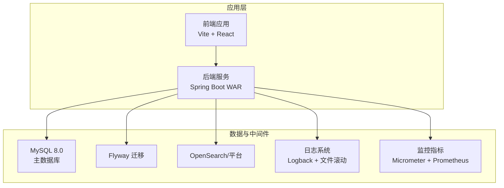
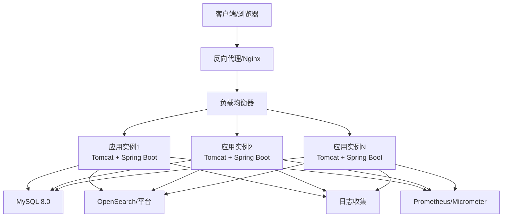
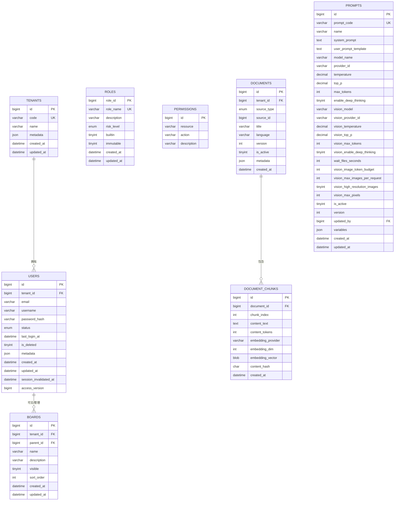
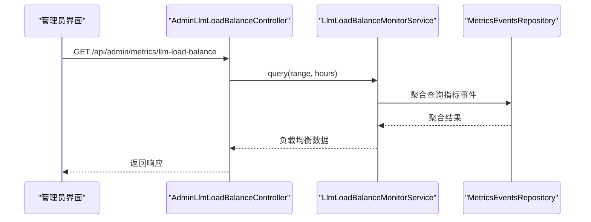
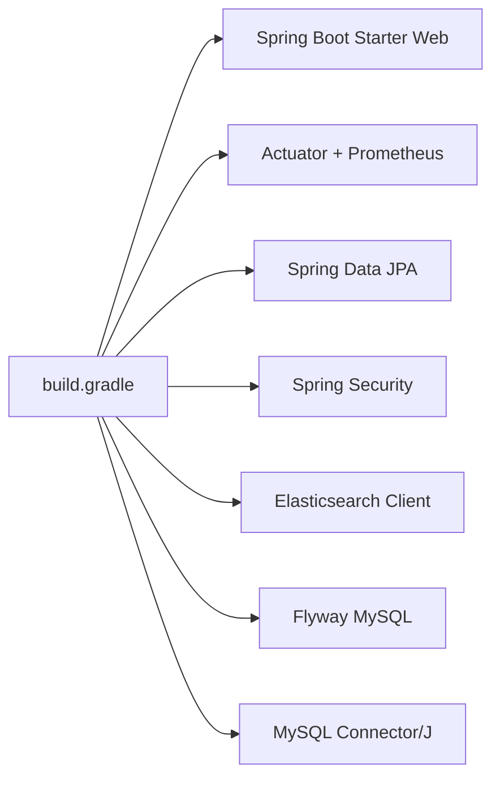

# 部署指南

<cite>
**本文档引用的文件**
- [application.properties](file://src/main/resources/application.properties)
- [logback-spring.xml](file://src/main/resources/logback-spring.xml)
- [build.gradle](file://build.gradle)
- [settings.gradle](file://settings.gradle)
- [gradle.properties](file://gradle.properties)
- [V1__table_design.sql](file://src/main/resources/db/migration/V1__table_design.sql)
- [V3__system_default_configs.sql](file://src/main/resources/db/migration/V3__system_default_configs.sql)
- [DynamicConfigurationLoader.java](file://src/main/java/com/example/EnterpriseRagCommunity/config/DynamicConfigurationLoader.java)
- [SecurityConfig.java](file://src/main/java/com/example/EnterpriseRagCommunity/config/SecurityConfig.java)
- [AdminLlmLoadBalanceController.java](file://src/main/java/com/example/EnterpriseRagCommunity/controller/monitor/admin/AdminLlmLoadBalanceController.java)
- [MetricsEventsRepository.java](file://src/main/java/com/example/EnterpriseRagCommunity/repository/monitor/MetricsEventsRepository.java)
- [MetricsEventsEntity.java](file://src/main/java/com/example/EnterpriseRagCommunity/entity/monitor/MetricsEventsEntity.java)
- [AdminLlmLoadTestService.java](file://src/main/java/com/example/EnterpriseRagCommunity/service/monitor/AdminLlmLoadTestService.java)
- [EnterpriseRagCommunity_basic_load.jmx](file://perf/jmeter/EnterpriseRagCommunity_basic_load.jmx)
- [run-jmeter.ps1](file://perf/jmeter/run-jmeter.ps1)
</cite>

## 目录
1. [简介](#简介)
2. [项目结构](#项目结构)
3. [核心组件](#核心组件)
4. [架构概览](#架构概览)
5. [详细组件分析](#详细组件分析)
6. [依赖关系分析](#依赖关系分析)
7. [性能考虑](#性能考虑)
8. [故障排除指南](#故障排除指南)
9. [结论](#结论)
10. [附录](#附录)

## 简介
本指南面向企业级RAG社区平台的生产环境部署，涵盖服务器配置、环境准备、Docker容器化、Kubernetes编排、云平台部署策略，以及数据库、缓存、消息队列等基础设施配置。同时提供监控告警、日志收集、性能调优、备份恢复与灾难恢复计划及运维最佳实践。

## 项目结构
该工程采用Spring Boot 3.5.11 + Gradle构建，后端以WAR形式打包，使用MySQL 8.0作为主数据库，Flyway进行数据库迁移，支持OpenSearch/OpenSearch平台对接，具备完善的权限控制、审核流水线、RAG检索与监控能力。

**图表来源**
- [build.gradle:102-138](file://build.gradle#L102-L138)
- [application.properties:7-84](file://src/main/resources/application.properties#L7-L84)

**章节来源**
- [build.gradle:102-138](file://build.gradle#L102-L138)
- [application.properties:7-84](file://src/main/resources/application.properties#L7-L84)

## 核心组件
- 应用配置与环境变量：通过application.properties集中管理数据库、日志、AI服务、OpenSearch等配置项，支持环境变量覆盖。
- 数据库与迁移：MySQL 8.0 + Flyway，初始表结构与系统默认配置迁移脚本。
- 动态配置加载：运行时从数据库读取配置并注入Spring Environment。
- 安全与权限：基于方法级注解的权限控制与CORS/CSRF配置。
- 监控与指标：Actuator + Micrometer + Prometheus，支持LLM负载均衡监控与指标事件存储。
- 性能测试：JMeter脚本与执行脚本，支持基本负载测试。

**章节来源**
- [application.properties:66-84](file://src/main/resources/application.properties#L66-L84)
- [V1__table_design.sql:1-800](file://src/main/resources/db/migration/V1__table_design.sql#L1-L800)
- [V3__system_default_configs.sql:299-330](file://src/main/resources/db/migration/V3__system_default_configs.sql#L299-L330)
- [DynamicConfigurationLoader.java:14-46](file://src/main/java/com/example/EnterpriseRagCommunity/config/DynamicConfigurationLoader.java#L14-L46)
- [SecurityConfig.java:196-219](file://src/main/java/com/example/EnterpriseRagCommunity/config/SecurityConfig.java#L196-L219)
- [AdminLlmLoadBalanceController.java:11-24](file://src/main/java/com/example/EnterpriseRagCommunity/controller/monitor/admin/AdminLlmLoadBalanceController.java#L11-L24)

## 架构概览
生产部署建议采用"应用容器 + 数据库容器 + 搜索引擎容器 + 监控与日志"的组合，前端静态资源可由Nginx或CDN承载，后端通过反向代理接入。

[此图为概念性架构示意，无需图表来源标注]

## 详细组件分析

### 数据库部署与配置
- 数据库选择：MySQL 8.0，InnoDB引擎，utf8mb4字符集。
- 迁移管理：Flyway启用，支持多位置迁移脚本，自动基线与版本管理。
- 初始表结构：包含租户、用户、角色权限、内容管理、RAG文档与分片、审核流水线、指标事件等核心表。
- 系统默认配置：权限点、默认版块、RAG与Hybrid检索配置、风险标签、支持语言等。

**图表来源**
- [V1__table_design.sql:6-800](file://src/main/resources/db/migration/V1__table_design.sql#L6-L800)

**章节来源**
- [V1__table_design.sql:1-800](file://src/main/resources/db/migration/V1__table_design.sql#L1-L800)
- [V3__system_default_configs.sql:18-56](file://src/main/resources/db/migration/V3__system_default_configs.sql#L18-L56)
- [V3__system_default_configs.sql:299-330](file://src/main/resources/db/migration/V3__system_default_configs.sql#L299-L330)
- [application.properties:18-24](file://src/main/resources/application.properties#L18-L24)

### 缓存服务设置
- 当前代码未直接引入Redis/Memcached等缓存组件依赖，但可通过Spring Cache抽象或自定义实现接入。
- 建议在生产中引入Redis集群，用于会话缓存、热点数据缓存与分布式锁。
- 缓存键命名应遵循业务域前缀+实体ID的规范，配合TTL与淘汰策略。

[本节为通用实践建议，无需章节来源]

### 消息队列配置
- 当前代码未包含消息队列依赖或实现，如需异步处理（审核任务、RAG索引构建、通知发送），可在应用层集成RabbitMQ/Kafka或使用Spring Cloud Stream。
- 建议将高延迟或非关键路径操作放入消息队列，确保接口响应时间稳定。

[本节为通用实践建议，无需章节来源]

### 监控告警系统搭建
- 指标导出：启用Actuator与Micrometer，Prometheus抓取后端指标。
- 指标事件：MetricsEventsEntity用于存储通用指标事件，支持按名称与时间范围聚合查询。
- LLM负载均衡监控：AdminLlmLoadBalanceController提供查询接口，结合数据库中的负载统计进行可视化展示。

**图表来源**
- [AdminLlmLoadBalanceController.java:16-23](file://src/main/java/com/example/EnterpriseRagCommunity/controller/monitor/admin/AdminLlmLoadBalanceController.java#L16-L23)
- [MetricsEventsRepository.java:14-36](file://src/main/java/com/example/EnterpriseRagCommunity/repository/monitor/MetricsEventsRepository.java#L14-L36)

**章节来源**
- [AdminLlmLoadBalanceController.java:11-24](file://src/main/java/com/example/EnterpriseRagCommunity/controller/monitor/admin/AdminLlmLoadBalanceController.java#L11-L24)
- [MetricsEventsRepository.java:14-36](file://src/main/java/com/example/EnterpriseRagCommunity/repository/monitor/MetricsEventsRepository.java#L14-L36)
- [MetricsEventsEntity.java:11-35](file://src/main/java/com/example/EnterpriseRagCommunity/entity/monitor/MetricsEventsEntity.java#L11-L35)

### 日志收集与性能调优
- 日志配置：Logback Spring XML，UTF-8字符集，支持文件滚动策略（最大文件、历史天数、总大小上限）。
- 性能调优：JVM参数、虚拟线程启用、Tomcat上传限制、文件大小限制等已在配置中体现。
- 建议：生产环境开启异步日志、合理设置日志级别、使用结构化日志（JSON）便于ELK收集。

**章节来源**
- [logback-spring.xml:1-8](file://src/main/resources/logback-spring.xml#L1-L8)
- [application.properties:38-44](file://src/main/resources/application.properties#L38-L44)
- [application.properties:27-36](file://src/main/resources/application.properties#L27-L36)

### 备份恢复策略与灾难恢复
- 数据库备份：建议使用Percona XtraBackup或mysqldump定期全备+增量备份，结合binlog归档。
- 配置备份：动态配置表与Flyway迁移脚本均需纳入备份范围。
- 灾难恢复：制定RTO/RPO目标，演练跨AZ/跨区域恢复流程，确保应用与数据库双活或多活。

[本节为通用实践建议，无需章节来源]

### 运维最佳实践
- 环境隔离：开发/测试/预生产/生产严格分离，配置通过环境变量注入。
- 安全加固：最小权限原则、密钥轮换、TLS加密传输、定期漏洞扫描。
- 版本管理：Gradle多任务与Jacoco覆盖率报告，CI/CD自动化构建与测试。
- 变更管理：灰度发布、蓝绿部署、回滚预案。

**章节来源**
- [build.gradle:229-267](file://build.gradle#L229-L267)
- [gradle.properties:1-13](file://gradle.properties#L1-L13)

## 依赖关系分析

**图表来源**
- [build.gradle:102-138](file://build.gradle#L102-L138)

**章节来源**
- [build.gradle:102-138](file://build.gradle#L102-L138)

## 性能考虑
- JVM与线程：启用虚拟线程，合理设置堆大小与Metaspace，避免GC停顿。
- 数据库连接池：HikariCP参数（最大连接、空闲超时、最大生命周期）需根据并发与QPS调优。
- IO与上传：Tomcat与Servlet上传限制需与前端静态资源CDN配合，降低后端压力。
- 指标与监控：Prometheus抓取频率与告警阈值需结合业务峰值设定。

[本节提供通用指导，无需章节来源]

## 故障排除指南
- 数据库连接失败：检查主机、端口、凭据与SSL设置，确认Flyway迁移是否成功。
- 权限不足：核对角色权限矩阵与方法级注解权限，确认CORS/CSRF配置。
- 指标查询异常：检查指标事件表结构与时间范围参数，确认聚合SQL执行计划。
- 日志乱码：确认Logback字符集与系统编码一致。

**章节来源**
- [application.properties:7-16](file://src/main/resources/application.properties#L7-L16)
- [SecurityConfig.java:196-219](file://src/main/java/com/example/EnterpriseRagCommunity/config/SecurityConfig.java#L196-L219)
- [MetricsEventsRepository.java:14-36](file://src/main/java/com/example/EnterpriseRagCommunity/repository/monitor/MetricsEventsRepository.java#L14-L36)
- [logback-spring.xml:1-8](file://src/main/resources/logback-spring.xml#L1-L8)

## 结论
本指南提供了从服务器配置到容器化与Kubernetes编排的完整部署思路，结合数据库、缓存、消息队列、监控告警与日志收集的最佳实践，帮助您在生产环境中稳定运行企业级RAG社区平台。建议结合实际业务规模与合规要求进一步细化安全与灾备策略。

## 附录

### Docker容器化部署要点
- 基础镜像：使用官方OpenJDK 21镜像，减少镜像体积与攻击面。
- 环境变量：通过环境变量注入数据库、AI服务、OpenSearch等配置。
- 健康检查：提供HTTP健康检查端点，结合容器编排进行滚动更新。
- 存储：持久化日志目录与上传目录，挂载到共享存储或对象存储。

[本节为通用实践建议，无需章节来源]

### Kubernetes编排配置要点
- Deployment：副本数、滚动更新策略、资源限制与请求。
- Service：ClusterIP/LoadBalancer暴露，健康检查端点。
- ConfigMap/Secret：配置与密钥分离，支持热更新。
- Ingress：TLS终止、路径转发、限流与WAF。
- HPA：基于CPU/内存或自定义指标的自动扩缩容。

[本节为通用实践建议，无需章节来源]

### 云平台部署策略
- AWS：EC2/ECS + RDS + EFS + CloudFront + WAF + X-Ray。
- Azure：AKS + Azure Database for MySQL + Azure Files + CDN + Application Gateway。
- 阿里云：ACK + RDS + NAS + OSS + SLB + ARMS。

[本节为通用实践建议，无需章节来源]

### 性能测试与压测
- JMeter：提供基础负载测试脚本与执行脚本，建议逐步提升并发与事务比例，观察响应时间与错误率。
- 建议：结合Prometheus/Grafana实时观测CPU、内存、连接池、慢查询与GC。

**章节来源**
- [EnterpriseRagCommunity_basic_load.jmx](file://perf/jmeter/EnterpriseRagCommunity_basic_load.jmx)
- [run-jmeter.ps1](file://perf/jmeter/run-jmeter.ps1)