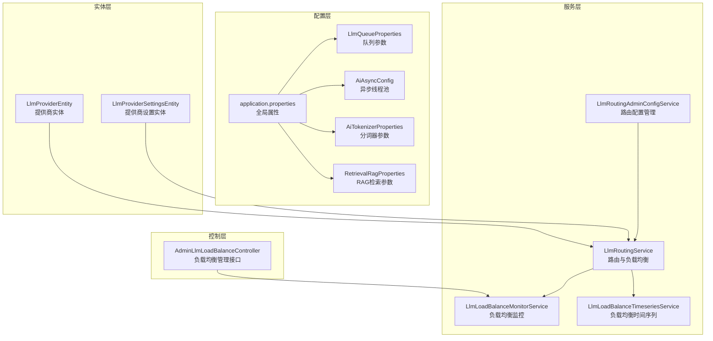
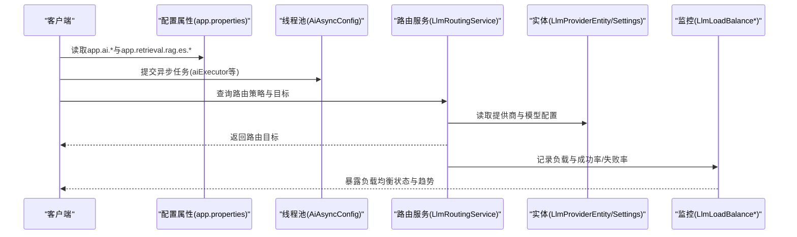
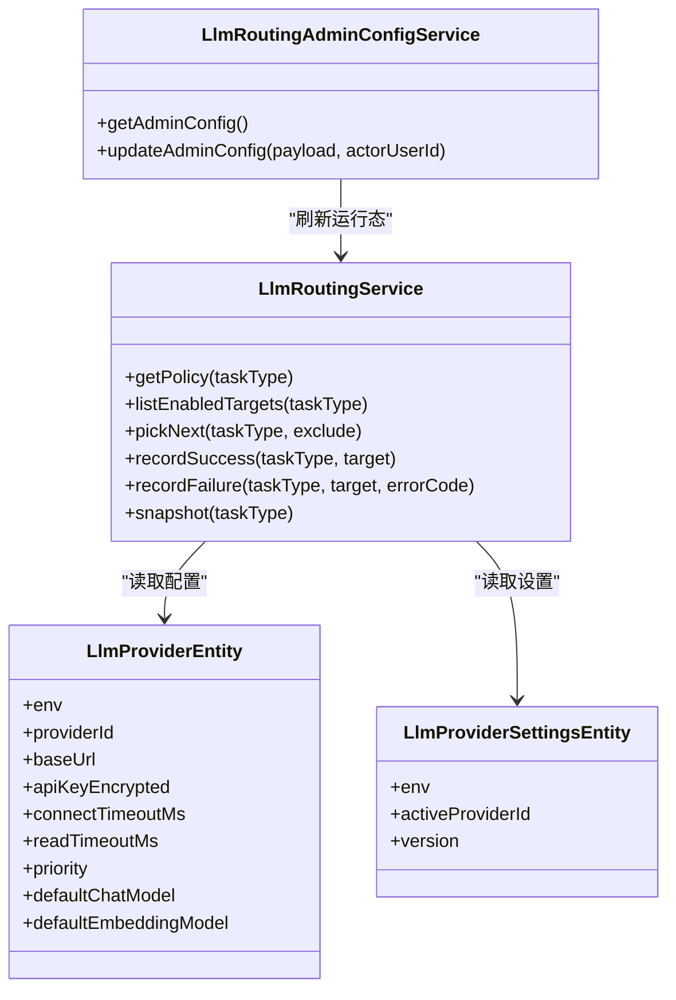
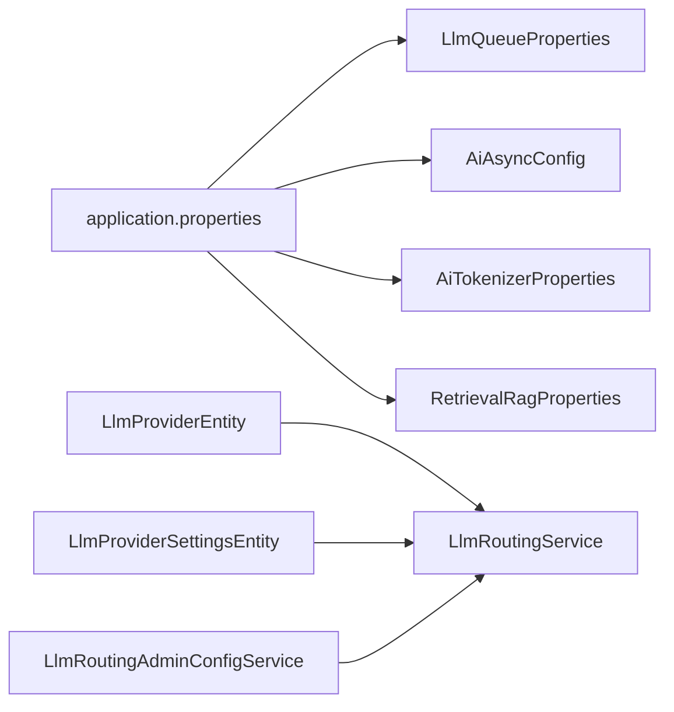

# AI服务配置

<cite>
**本文引用的文件**
- [LlmQueueProperties.java](file://src/main/java/com/example/EnterpriseRagCommunity/config/LlmQueueProperties.java)
- [AiAsyncConfig.java](file://src/main/java/com/example/EnterpriseRagCommunity/config/AiAsyncConfig.java)
- [AiTokenizerProperties.java](file://src/main/java/com/example/EnterpriseRagCommunity/config/AiTokenizerProperties.java)
- [RetrievalRagProperties.java](file://src/main/java/com/example/EnterpriseRagCommunity/config/RetrievalRagProperties.java)
- [application.properties](file://src/main/resources/application.properties)
- [LlmProviderEntity.java](file://src/main/java/com/example/EnterpriseRagCommunity/entity/ai/LlmProviderEntity.java)
- [LlmProviderSettingsEntity.java](file://src/main/java/com/example/EnterpriseRagCommunity/entity/ai/LlmProviderSettingsEntity.java)
- [LlmRoutingService.java](file://src/main/java/com/example/EnterpriseRagCommunity/service/ai/LlmRoutingService.java)
- [LlmRoutingAdminConfigService.java](file://src/main/java/com/example/EnterpriseRagCommunity/service/ai/LlmRoutingAdminConfigService.java)
- [AdminLlmLoadBalanceController.java](file://src/main/java/com/example/EnterpriseRagCommunity/controller/monitor/admin/AdminLlmLoadBalanceController.java)
- [LlmLoadBalanceMonitorService.java](file://src/main/java/com/example/EnterpriseRagCommunity/service/monitor/LlmLoadBalanceMonitorService.java)
- [LlmLoadBalanceTimeseriesService.java](file://src/main/java/com/example/EnterpriseRagCommunity/service/monitor/LlmLoadBalanceTimeseriesService.java)
</cite>

## 目录
1. [引言](#引言)
2. [项目结构](#项目结构)
3. [核心组件](#核心组件)
4. [架构总览](#架构总览)
5. [详细组件分析](#详细组件分析)
6. [依赖关系分析](#依赖关系分析)
7. [性能考量](#性能考量)
8. [故障排查指南](#故障排查指南)
9. [结论](#结论)
10. [附录](#附录)

## 引言
本文件面向企业级AI服务配置，围绕以下主题展开：LLM队列配置、AI异步处理配置、分词器配置；AI服务提供商配置、模型路由策略与负载均衡；RAG检索配置、上下文窗口配置与令牌计费；以及不同AI服务提供商的配置模板与性能调优建议，并给出AI服务监控与限流配置的最佳实践。

## 项目结构
本项目的AI配置主要分布在如下位置：
- 配置类：位于 config 包，负责读取应用属性并注入到运行时
- 实体类：位于 entity.ai 包，持久化LLM提供商与设置
- 服务类：位于 service.ai 与 service.monitor 包，实现路由策略、负载均衡与监控
- 控制器：位于 controller.*.admin 包，提供管理端配置接口

图表来源
- [LlmQueueProperties.java:1-16](file://src/main/java/com/example/EnterpriseRagCommunity/config/LlmQueueProperties.java#L1-L16)
- [AiAsyncConfig.java:1-47](file://src/main/java/com/example/EnterpriseRagCommunity/config/AiAsyncConfig.java#L1-L47)
- [AiTokenizerProperties.java:1-14](file://src/main/java/com/example/EnterpriseRagCommunity/config/AiTokenizerProperties.java#L1-L14)
- [RetrievalRagProperties.java:1-22](file://src/main/java/com/example/EnterpriseRagCommunity/config/RetrievalRagProperties.java#L1-L22)
- [application.properties:68-71](file://src/main/resources/application.properties#L68-L71)
- [LlmProviderEntity.java:1-83](file://src/main/java/com/example/EnterpriseRagCommunity/entity/ai/LlmProviderEntity.java#L1-L83)
- [LlmProviderSettingsEntity.java:1-36](file://src/main/java/com/example/EnterpriseRagCommunity/entity/ai/LlmProviderSettingsEntity.java#L1-L36)
- [LlmRoutingService.java:1-541](file://src/main/java/com/example/EnterpriseRagCommunity/service/ai/LlmRoutingService.java#L1-L541)
- [LlmRoutingAdminConfigService.java:1-247](file://src/main/java/com/example/EnterpriseRagCommunity/service/ai/LlmRoutingAdminConfigService.java#L1-L247)
- [AdminLlmLoadBalanceController.java](file://src/main/java/com/example/EnterpriseRagCommunity/controller/monitor/admin/AdminLlmLoadBalanceController.java)
- [LlmLoadBalanceMonitorService.java](file://src/main/java/com/example/EnterpriseRagCommunity/service/monitor/LlmLoadBalanceMonitorService.java)
- [LlmLoadBalanceTimeseriesService.java](file://src/main/java/com/example/EnterpriseRagCommunity/service/monitor/LlmLoadBalanceTimeseriesService.java)

章节来源
- [application.properties:1-84](file://src/main/resources/application.properties#L1-L84)

## 核心组件
- LLM队列配置：通过 LlmQueueProperties 读取 app.ai.queue.* 属性，控制并发数、队列容量、完成任务保留数量与历史保留天数
- AI异步处理配置：通过 AiAsyncConfig 定义多个专用线程池，包括通用aiExecutor、文件提取fileExtractionExecutor、RAG索引ragIndexExecutor
- 分词器配置：通过 AiTokenizerProperties 读取 app.ai.tokenizer.apiKey
- RAG检索配置：通过 RetrievalRagProperties 读取 app.retrieval.rag.es.*，包括索引名、IK分词开关、嵌入模型与维度
- 全局AI超时与历史限制：通过 application.properties 的 app.ai.* 属性统一设置连接/读取超时与默认历史条目限制

章节来源
- [LlmQueueProperties.java:10-15](file://src/main/java/com/example/EnterpriseRagCommunity/config/LlmQueueProperties.java#L10-L15)
- [AiAsyncConfig.java:13-45](file://src/main/java/com/example/EnterpriseRagCommunity/config/AiAsyncConfig.java#L13-L45)
- [AiTokenizerProperties.java:9-12](file://src/main/java/com/example/EnterpriseRagCommunity/config/AiTokenizerProperties.java#L9-L12)
- [RetrievalRagProperties.java:9-21](file://src/main/java/com/example/EnterpriseRagCommunity/config/RetrievalRagProperties.java#L9-L21)
- [application.properties:68-71](file://src/main/resources/application.properties#L68-L71)

## 架构总览
AI服务配置贯穿“配置读取—实体持久化—路由决策—执行调度—监控观测”的闭环。下图展示从配置到路由与监控的关键交互：

图表来源
- [application.properties:68-82](file://src/main/resources/application.properties#L68-L82)
- [AiAsyncConfig.java:13-45](file://src/main/java/com/example/EnterpriseRagCommunity/config/AiAsyncConfig.java#L13-L45)
- [LlmRoutingService.java:114-136](file://src/main/java/com/example/EnterpriseRagCommunity/service/ai/LlmRoutingService.java#L114-L136)
- [LlmProviderEntity.java:21-82](file://src/main/java/com/example/EnterpriseRagCommunity/entity/ai/LlmProviderEntity.java#L21-L82)
- [LlmProviderSettingsEntity.java:16-35](file://src/main/java/com/example/EnterpriseRagCommunity/entity/ai/LlmProviderSettingsEntity.java#L16-L35)
- [LlmLoadBalanceMonitorService.java](file://src/main/java/com/example/EnterpriseRagCommunity/service/monitor/LlmLoadBalanceMonitorService.java)
- [LlmLoadBalanceTimeseriesService.java](file://src/main/java/com/example/EnterpriseRagCommunity/service/monitor/LlmLoadBalanceTimeseriesService.java)

## 详细组件分析

### LLM队列配置（LlmQueueProperties）
- 关键参数
  - 最大并发数：控制同时进行的任务数
  - 最大队列长度：等待执行的任务队列上限
  - 完成任务保留数：已完成任务的保留数量
  - 历史保留天数：队列历史数据的保留周期
- 应用场景
  - 防止突发流量导致系统过载
  - 平滑削峰填谷，提升吞吐稳定性
- 调优建议
  - 根据下游提供商的并发限制与SLA调整最大并发
  - 队列长度应结合内存与GC压力评估
  - 保留策略需平衡可观测性与存储成本

章节来源
- [LlmQueueProperties.java:10-15](file://src/main/java/com/example/EnterpriseRagCommunity/config/LlmQueueProperties.java#L10-L15)

### AI异步处理配置（AiAsyncConfig）
- 线程池类型
  - aiExecutor：通用AI任务，核心/最大线程与队列容量适中
  - fileExtractionExecutor：文件内容提取，采用CallerRunsPolicy避免丢弃
  - ragIndexExecutor：RAG索引构建，独立线程池隔离IO密集型任务
- 参数要点
  - 核心/最大线程数：决定并发能力
  - 队列容量：缓冲瞬时高峰
  - 拒绝策略：CallerRunsPolicy在饱和时由调用线程执行，降低丢任务风险
- 调优建议
  - 文件提取与RAG索引线程池应与CPU核数匹配
  - 对于高延迟上游，适当提高队列容量以减少拒绝

章节来源
- [AiAsyncConfig.java:13-45](file://src/main/java/com/example/EnterpriseRagCommunity/config/AiAsyncConfig.java#L13-L45)

### 分词器配置（AiTokenizerProperties）
- 关键参数
  - apiKey：用于外部分词器服务的认证
- 使用建议
  - 将密钥安全存储于环境变量或密钥管理服务
  - 在多租户或多环境部署时，按环境区分配置

章节来源
- [AiTokenizerProperties.java:9-12](file://src/main/java/com/example/EnterpriseRagCommunity/config/AiTokenizerProperties.java#L9-L12)

### RAG检索配置（RetrievalRagProperties）
- 关键参数
  - ES索引名：默认索引名称
  - IK分词开关：是否启用IK分词
  - 嵌入模型与维度：影响向量检索质量与性能
- 调优建议
  - 根据业务语料选择合适的分词器与索引映射
  - 嵌入维度与下游相似度计算精度需权衡性能

章节来源
- [RetrievalRagProperties.java:9-21](file://src/main/java/com/example/EnterpriseRagCommunity/config/RetrievalRagProperties.java#L9-L21)

### AI服务提供商配置（LlmProviderEntity / LlmProviderSettingsEntity）
- 提供商实体字段
  - 环境标识、提供商ID、名称、类型、基础URL、加密API Key与额外头
  - 连接/读取超时、启用状态、优先级、默认聊天/嵌入模型、元数据
- 设置实体字段
  - 当前生效提供商ID、版本号、更新时间与操作人
- 配置要点
  - 不同提供商的超时、优先级与默认模型直接影响路由策略
  - 加密存储敏感信息，确保传输安全

章节来源
- [LlmProviderEntity.java:21-82](file://src/main/java/com/example/EnterpriseRagCommunity/entity/ai/LlmProviderEntity.java#L21-L82)
- [LlmProviderSettingsEntity.java:16-35](file://src/main/java/com/example/EnterpriseRagCommunity/entity/ai/LlmProviderSettingsEntity.java#L16-L35)

### 模型路由策略与负载均衡（LlmRoutingService / LlmRoutingAdminConfigService）
- 路由策略
  - 权重轮询（WEIGHTED_RR）：基于权重动态分配
  - 优先级回退（PRIORITY_FALLBACK）：优先命中高优先级目标，失败后降级
- 关键机制
  - 健康状态：连续失败次数与冷却时间
  - 速率控制：每模型令牌桶，支持QPS限制
  - 运行态快照：聚合健康、权重、速率与运行中的任务数
- 管理接口
  - 支持按任务类型配置策略（最大尝试次数、失败阈值、冷却时间）
  - 支持按任务类型配置目标（启用、权重、优先级、排序、QPS、价格配置ID）

图表来源
- [LlmRoutingService.java:114-136](file://src/main/java/com/example/EnterpriseRagCommunity/service/ai/LlmRoutingService.java#L114-L136)
- [LlmRoutingService.java:172-230](file://src/main/java/com/example/EnterpriseRagCommunity/service/ai/LlmRoutingService.java#L172-L230)
- [LlmRoutingService.java:338-372](file://src/main/java/com/example/EnterpriseRagCommunity/service/ai/LlmRoutingService.java#L338-L372)
- [LlmRoutingService.java:232-284](file://src/main/java/com/example/EnterpriseRagCommunity/service/ai/LlmRoutingService.java#L232-L284)
- [LlmRoutingAdminConfigService.java:36-86](file://src/main/java/com/example/EnterpriseRagCommunity/service/ai/LlmRoutingAdminConfigService.java#L36-L86)
- [LlmRoutingAdminConfigService.java:88-215](file://src/main/java/com/example/EnterpriseRagCommunity/service/ai/LlmRoutingAdminConfigService.java#L88-L215)
- [LlmProviderEntity.java:21-82](file://src/main/java/com/example/EnterpriseRagCommunity/entity/ai/LlmProviderEntity.java#L21-L82)
- [LlmProviderSettingsEntity.java:16-35](file://src/main/java/com/example/EnterpriseRagCommunity/entity/ai/LlmProviderSettingsEntity.java#L16-L35)

章节来源
- [LlmRoutingService.java:31-541](file://src/main/java/com/example/EnterpriseRagCommunity/service/ai/LlmRoutingService.java#L31-L541)
- [LlmRoutingAdminConfigService.java:26-247](file://src/main/java/com/example/EnterpriseRagCommunity/service/ai/LlmRoutingAdminConfigService.java#L26-L247)

### 上下文窗口与令牌计费配置
- 上下文窗口
  - 全局默认历史限制由 app.ai.default-history-limit 控制
- 令牌计费
  - 路由目标可绑定价格配置ID（priceConfigId），用于后续计费统计与对账
- 建议
  - 结合模型上下文长度与业务对话轮次设置合理的历史限制
  - 为不同提供商与模型建立清晰的价格配置映射

章节来源
- [application.properties:70](file://src/main/resources/application.properties#L70)
- [LlmRoutingAdminConfigService.java:79](file://src/main/java/com/example/EnterpriseRagCommunity/service/ai/LlmRoutingAdminConfigService.java#L79)

### AI服务监控与限流配置
- 负载均衡监控
  - LlmLoadBalanceMonitorService 与 LlmLoadBalanceTimeseriesService 提供实时与时间序列的负载观测
  - AdminLlmLoadBalanceController 暴露管理端接口，便于查看与调试
- 限流策略
  - 基于每模型令牌桶的QPS限制（routeTarget.qps）
  - 失败冷却与优先级回退策略降低热点提供商压力
- 建议
  - 为关键提供商设置合理的QPS上限与失败阈值
  - 结合监控指标动态调整权重与优先级

章节来源
- [AdminLlmLoadBalanceController.java](file://src/main/java/com/example/EnterpriseRagCommunity/controller/monitor/admin/AdminLlmLoadBalanceController.java)
- [LlmLoadBalanceMonitorService.java](file://src/main/java/com/example/EnterpriseRagCommunity/service/monitor/LlmLoadBalanceMonitorService.java)
- [LlmLoadBalanceTimeseriesService.java](file://src/main/java/com/example/EnterpriseRagCommunity/service/monitor/LlmLoadBalanceTimeseriesService.java)
- [LlmRoutingService.java:412-458](file://src/main/java/com/example/EnterpriseRagCommunity/service/ai/LlmRoutingService.java#L412-L458)
- [LlmRoutingService.java:362-371](file://src/main/java/com/example/EnterpriseRagCommunity/service/ai/LlmRoutingService.java#L362-L371)

## 依赖关系分析
- 配置依赖
  - application.properties 提供全局AI超时与历史限制
  - LlmQueueProperties、AiAsyncConfig、AiTokenizerProperties、RetrievalRagProperties 读取对应命名空间属性
- 实体依赖
  - LlmRoutingService 读取 LlmProviderEntity 与 LlmProviderSettingsEntity 决策路由
- 管理依赖
  - LlmRoutingAdminConfigService 统一维护策略与目标配置，并触发运行态重置

图表来源
- [application.properties:68-82](file://src/main/resources/application.properties#L68-L82)
- [LlmQueueProperties.java:9-15](file://src/main/java/com/example/EnterpriseRagCommunity/config/LlmQueueProperties.java#L9-L15)
- [AiAsyncConfig.java:10-45](file://src/main/java/com/example/EnterpriseRagCommunity/config/AiAsyncConfig.java#L10-L45)
- [AiTokenizerProperties.java:7-12](file://src/main/java/com/example/EnterpriseRagCommunity/config/AiTokenizerProperties.java#L7-L12)
- [RetrievalRagProperties.java:7-21](file://src/main/java/com/example/EnterpriseRagCommunity/config/RetrievalRagProperties.java#L7-L21)
- [LlmProviderEntity.java:21-82](file://src/main/java/com/example/EnterpriseRagCommunity/entity/ai/LlmProviderEntity.java#L21-L82)
- [LlmProviderSettingsEntity.java:16-35](file://src/main/java/com/example/EnterpriseRagCommunity/entity/ai/LlmProviderSettingsEntity.java#L16-L35)
- [LlmRoutingService.java:104-112](file://src/main/java/com/example/EnterpriseRagCommunity/service/ai/LlmRoutingService.java#L104-L112)
- [LlmRoutingAdminConfigService.java:32-34](file://src/main/java/com/example/EnterpriseRagCommunity/service/ai/LlmRoutingAdminConfigService.java#L32-L34)

章节来源
- [LlmRoutingService.java:104-112](file://src/main/java/com/example/EnterpriseRagCommunity/service/ai/LlmRoutingService.java#L104-L112)
- [LlmRoutingAdminConfigService.java:32-34](file://src/main/java/com/example/EnterpriseRagCommunity/service/ai/LlmRoutingAdminConfigService.java#L32-L34)

## 性能考量
- 线程池与队列
  - 合理设置核心/最大线程与队列容量，避免频繁拒绝或内存压力
  - 对高延迟任务使用CallerRunsPolicy降低丢任务风险
- 路由与限流
  - 优先级回退适合强SLA任务；权重轮询适合长尾任务
  - QPS令牌桶与失败冷却组合，避免热点提供商雪崩
- 存储与检索
  - RAG索引与分词策略直接影响检索性能，需结合业务语料优化
- 观测与调优
  - 借助负载均衡监控与时间序列指标持续迭代策略参数

## 故障排查指南
- 路由不生效
  - 检查提供商是否启用、模型是否在目标列表中
  - 查看策略配置（最大尝试次数、失败阈值、冷却时间）
- 频繁限流
  - 提升QPS或权重；检查失败码是否为429并触发冷却
- 执行异常
  - 关注线程池饱和与拒绝策略；必要时扩容或调整任务优先级
- 监控缺失
  - 确认监控服务已启动并正确暴露指标；检查管理端接口可用性

章节来源
- [LlmRoutingService.java:362-371](file://src/main/java/com/example/EnterpriseRagCommunity/service/ai/LlmRoutingService.java#L362-L371)
- [AiAsyncConfig.java:31](file://src/main/java/com/example/EnterpriseRagCommunity/config/AiAsyncConfig.java#L31)
- [AdminLlmLoadBalanceController.java](file://src/main/java/com/example/EnterpriseRagCommunity/controller/monitor/admin/AdminLlmLoadBalanceController.java)

## 结论
通过将配置、实体、路由与监控有机结合，系统实现了灵活可控的AI服务配置体系。建议在生产环境中持续观测负载与错误指标，动态调整路由策略与限流参数，并为不同提供商与模型建立清晰的价格与性能基线。

## 附录

### 配置模板与最佳实践
- LLM队列配置模板
  - app.ai.queue.max-concurrent：并发上限
  - app.ai.queue.max-queue-size：队列容量
  - app.ai.queue.keep-completed：完成任务保留数
  - app.ai.queue.history-keep-days：历史保留天数
- AI异步处理模板
  - aiExecutor：通用AI任务
  - fileExtractionExecutor：文件提取（建议开启CallerRunsPolicy）
  - ragIndexExecutor：RAG索引构建
- 分词器模板
  - app.ai.tokenizer.api-key：分词器服务密钥
- RAG检索模板
  - app.retrieval.rag.es.index：ES索引名
  - app.retrieval.rag.es.ik-enabled：IK分词开关
  - app.retrieval.rag.es.embedding-model：嵌入模型
  - app.retrieval.rag.es.embedding-dims：嵌入维度
- 全局AI模板
  - app.ai.connect-timeout-ms：连接超时
  - app.ai.read-timeout-ms：读取超时
  - app.ai.default-history-limit：默认历史限制

章节来源
- [LlmQueueProperties.java:10-15](file://src/main/java/com/example/EnterpriseRagCommunity/config/LlmQueueProperties.java#L10-L15)
- [AiAsyncConfig.java:13-45](file://src/main/java/com/example/EnterpriseRagCommunity/config/AiAsyncConfig.java#L13-L45)
- [AiTokenizerProperties.java:9-12](file://src/main/java/com/example/EnterpriseRagCommunity/config/AiTokenizerProperties.java#L9-L12)
- [RetrievalRagProperties.java:9-21](file://src/main/java/com/example/EnterpriseRagCommunity/config/RetrievalRagProperties.java#L9-L21)
- [application.properties:68-71](file://src/main/resources/application.properties#L68-L71)